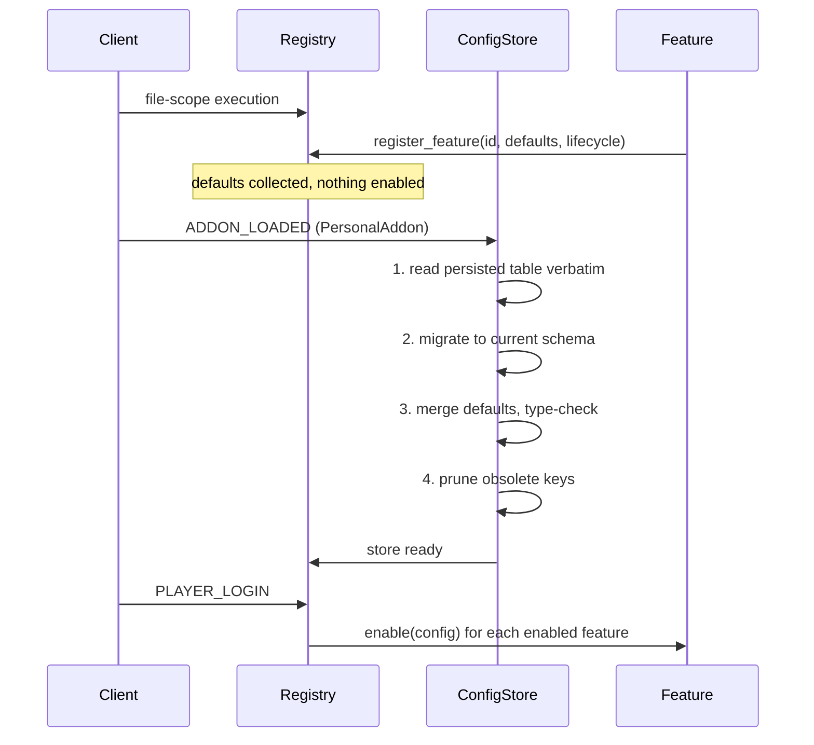
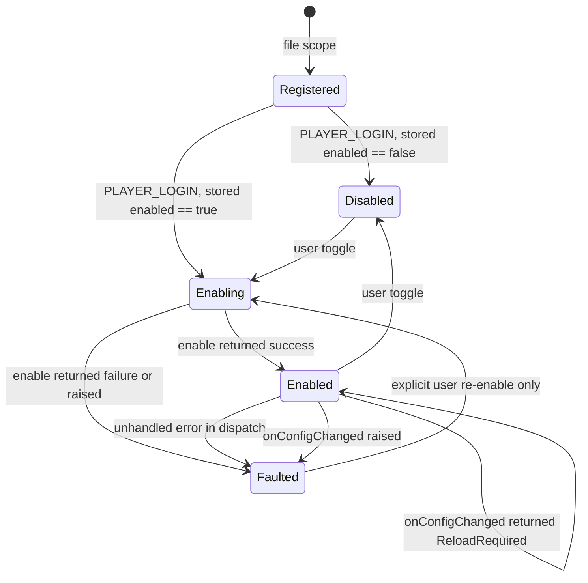
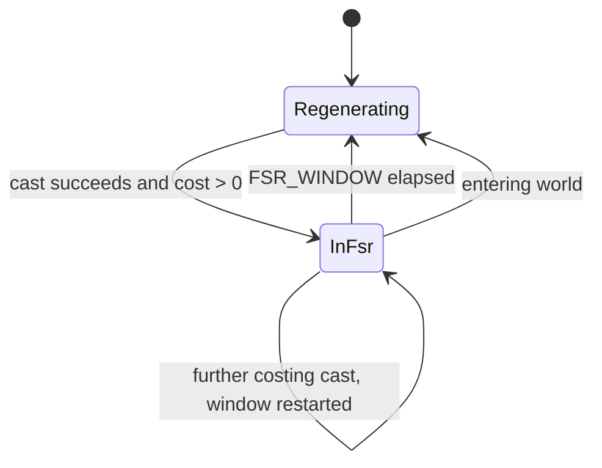
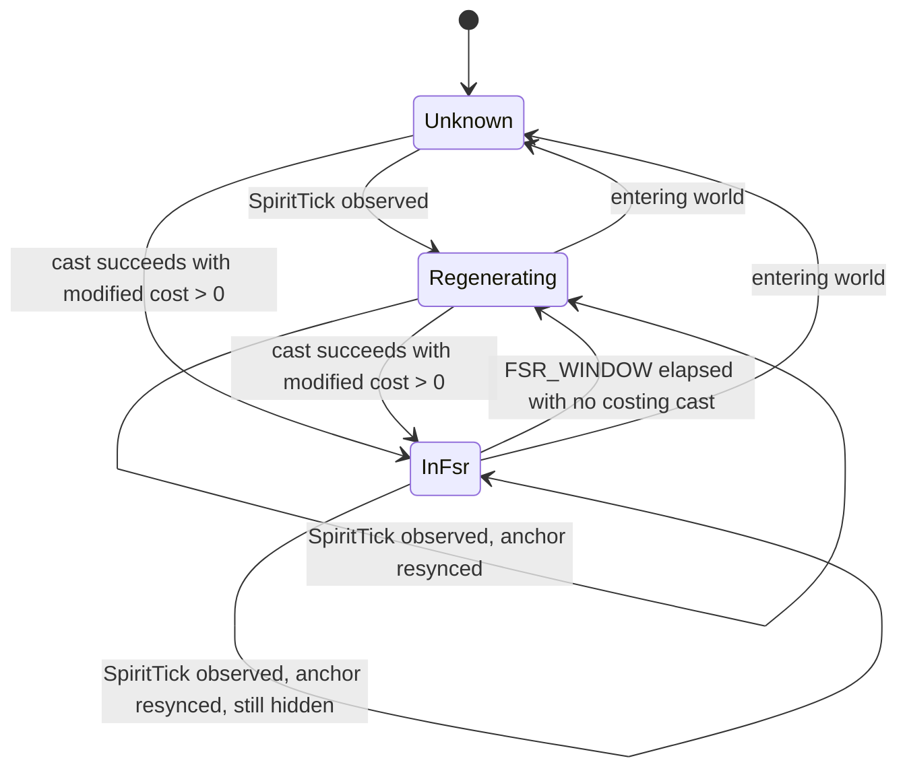

# PersonalAddon — Phase 1 Design
**Date:** September 19, 2026
**API Version:** 1.60.1 (WoW Forever Beta)
**Supersedes:** Phase 1 section of `20260919-RoadmapProposal.md`
**Revision:** 6 — gossip spike results in §12 (Phase 5 is GO); FSR re-scoped to a window indicator (§11.1a option A); superseded tick design in Appendix A

---

## 1. Scope

Phase 1 delivers the load path, the shared substrate that Phases 2–5 consume,
one user-visible trivial feature, one user-visible non-trivial feature, and one
feasibility spike that can re-order the remaining roadmap.

| Item | Kind | Consumer |
|---|---|---|
| `.toc` + load sequence | Substrate | All |
| Config store: schema, versioning, migration | Substrate | All; Phase 6 binds to it |
| Feature registry + lifecycle | Substrate | Phases 2–5; Phase 6 toggles it |
| Event dispatch with per-feature error isolation | Substrate | Phases 2–5 |
| Bounded frame pool | Substrate | Phase 2 (nameplate frames), Phase 4 (font strings) |
| Escape neutralization | Substrate | Phases 2, 4, 5 |
| `/rl` command | Feature | User |
| FiveSecondRule tracker | Feature | User |
| Gossip interaction spike | Investigation | Phase 5 go/no-go |

## 2. Non-goals

- No options panel. Phase 1 writes and reads the store; Phase 6 renders a UI
  over it. Config changes in Phase 1 are made by editing the saved variables
  file or by a debug slash command, not by a panel.
- No profiles. Single user, single character set. The store is per-account with
  no character scoping until a feature demonstrably needs it.
- No Ace3 dependency in Phase 1. AceConfig arrives in Phase 6 and binds to the
  store defined here. The store is panel-agnostic by construction.
- No nameplate, player frame, combat text, or camera work.

## 3. Decisions taken

**Config layer — hand-rolled store, AceConfig for the panel only.** The store,
its defaults, and its migration are owned here. Ace3 is a Phase 6 dependency
confined to option-table rendering, which keeps the persisted shape debuggable
and keeps a beta-client Ace3 breakage from taking the addon's state with it.

**FSR tick source — inference from power-change events, not from the combat
log.** Base spirit regen does not emit a combat log event. The tick clock is
driven by observed positive mana deltas on the player unit. `SPELL_ENERGIZE`
and `SPELL_PERIODIC_ENERGIZE` from the combat log are consumed for the opposite
purpose: to mark a mana gain as *not* a spirit tick so it does not resync the
phase estimate. Drinking and potions are the cases that corrupt a
single-source implementation.

**FSR render — binary.** Ticking or not ticking. No partial-regen state.

> The combat log half of the tick-source decision does not survive contact
> with this client. See the client finding in §11.2; the power-change half
> stands and is what the tracker runs on.

The render decision is not a tracking decision. The tick phase anchor is
maintained in **every** state, including inside the five-second window, because
partial-regen effects and MP5 produce observable ticks while the window is
running. Dropping those observations would leave the anchor stale by up to the
window length and the line would visibly jump when regen resumes. The anchor is
always tracked; only the render is binary.

---

## 4. File layout and load sequence

Load order is declared in the `.toc` and is significant: substrate files must
execute before feature files, because features call `register_feature` at file
scope.

```
PersonalAddon.toc
Core/Constants
Core/Log
Core/Isolation
Core/EscapeGuard
Core/ConfigStore
Core/Migrations
Core/FramePool
Core/Registry
Core/Dispatch
Core/Debug
Features/ReloadCommand
Features/FiveSecondRule
Spikes/GossipProbe
```



**The four hydration steps are ordered and the order is load-bearing.**
Migration runs against the table exactly as persisted, before any type check or
default merge touches it. Merging first would discard a value whose type a
migration was about to change, and the migration would then read the default
instead of the user's data. §5.2 states this as a pre-condition rather than
leaving it to the diagram.

The invariant: **no feature reads config before `ADDON_LOADED`, and no feature
touches a frame before `PLAYER_LOGIN`.** Registration is declaration only.

---

## 5. Config store

### 5.1 Persisted shape

```
type ConfigStore = {
    schemaVersion: integer,
    features: Map<FeatureId, FeatureConfig>
}

type FeatureConfig = {
    enabled: boolean,
    settings: Map<ConfigKey, ConfigValue>
}

type ConfigValue = boolean | number | string
```

Nested tables are not permitted as config values. A flat map per feature keeps
migration, default-merging and the Phase 6 option table one-to-one with the
persisted shape; nesting buys nothing for this addon and costs a recursive
merge on every load.

### 5.2 Hydration and defaults

```
# Brings the persisted store to the current schema and completes it against
# registered defaults.
# pre:  called exactly once, on ADDON_LOADED for this addon;
#       persistedStore has not been read, type-checked or merged by any caller
# post: on success every registered feature has a complete FeatureConfig,
#       store.schemaVersion == currentSchemaVersion, and every notice raised
#       during the four steps is present in the returned report;
#       on failure the persisted table is left byte-identical and the returned
#       store holds defaults only
function hydrate_config_store(
    persistedStore: ConfigStore | Absent,
    registeredDefaults: Map<FeatureId, ConfigDefaults>,
    currentSchemaVersion: integer
) -> Result<HydrationOutcome, StoreFailure>

type HydrationOutcome = {
    store:            ConfigStore,
    quarantinedStore: ConfigStore | Absent,
    notices:          List<HydrationNotice>
}
```

**Step order is fixed at: read, migrate, merge, prune.** Stated as a
pre-condition above because reversing steps 2 and 3 destroys data silently.

**Merge rule (step 3).** Persisted value wins over default when the key is
present *and* the value's type matches the default's type. A type mismatch
discards the persisted value, takes the default, and raises a notice — this is
the path that survives a hand-edited saved variables file.

**Obsolete keys (step 4).** A persisted key with no corresponding default is
pruned, and each pruning raises a notice naming the key. Renames are the
business of a migration step, which runs before the prune; anything still
unmatched at step 4 is dead weight from a removed feature or a typo. Retaining
it would let the store accumulate cruft across six phases of churn with nothing
that ever cleans it, and the notice is what catches the case where the real bug
was a forgotten migration.

### 5.3 Migration

```
# One version transition. Steps are declared in ascending order and each
# transitions exactly one version.
# pre:  store.schemaVersion == fromVersion
# post: apply has rewritten the store in place to the fromVersion + 1 shape and
#       has not stamped schemaVersion itself
# raises: any error; migrate_store isolates it
type MigrationStep = {
    fromVersion: integer,
    description: string,
    apply:       (store: ConfigStore) -> Unit
}

# Applies migration steps in ascending order until the store reaches the
# current schema version.
# pre:  store.schemaVersion <= currentSchemaVersion;
#       migrationSteps contains exactly one step per version transition between
#       store.schemaVersion and currentSchemaVersion;
#       no default merge or type check has run against store
# post: store.schemaVersion == currentSchemaVersion and every applicable step
#       has run once, in ascending order
# raises: never — a failing step returns MigrationFailure and leaves the store
#         at the last version that applied cleanly
function migrate_store(
    store: ConfigStore,
    migrationSteps: List<MigrationStep>,
    currentSchemaVersion: integer
) -> Result<ConfigStore, MigrationFailure>
```

`apply` deliberately does not stamp `schemaVersion`. The caller stamps it after
the step returns cleanly, which is what makes a partially-applied chain resume
at the right place rather than at the version the step claimed to have reached.

**The downgrade case is the one that corrupts silently.** If
`store.schemaVersion > currentSchemaVersion` — the user ran a newer addon
build, then reverted — migrations must not run backwards and the newer table
must not be written over. Behaviour: return it as `quarantinedStore`, load
defaults, and surface a message naming the quarantine key so the config is
recoverable by hand. Do not attempt a best-effort read of the future shape.

### 5.4 Durability limit, stated rather than mitigated

The client serializes saved variables on reload and logout, not on write. A
client crash loses every config change made since login. There is no API to
force a flush. This is accepted, not solved; it is recorded here so it is not
later mistaken for a bug in the store.

---

## 6. Feature registry and lifecycle

```
# Registers a feature with the addon's lifecycle owner. Called at file scope.
# pre:  featureId is unique; defaults is flat and contains only ConfigValue;
#       called before ADDON_LOADED
# post: featureId is known to the registry and its defaults are available to
#       the config store; the feature is not enabled
function register_feature(
    featureId: FeatureId,
    defaults: ConfigDefaults,
    lifecycle: FeatureLifecycle
) -> Unit

type FeatureLifecycle = {
    enable:          (config: FeatureConfig) -> Result<Unit, EnableFailure>,
    disable:         () -> Unit,
    onConfigChanged: (config: FeatureConfig, changedKey: ConfigKey)
                         -> Result<ConfigApplied, ReloadRequired>
}
```

### 6.1 Lifecycle contract

`enable` and `disable` are inverses and both are idempotent. The binding
post-condition:

> **After `disable()` returns, the feature holds zero registered events, zero
> shown frames, and zero running timers.**

Stated because the common shortcut — hiding frames while leaving event
registrations live — produces a feature that is invisible but still consuming
every combat log event. Phase 4 makes that expensive; the contract is set here
so Phase 4 inherits it rather than discovering it.

**`disable` must tolerate a partially-initialized feature.** It is invoked to
clean up after a failed `enable`, which may have subscribed events or created
frames before it failed. A `disable` that assumes `enable` ran to completion
raises during cleanup and turns one failure into two.

**The registry enforces the post-condition rather than trusting it.** After
`disable()` returns, the registry calls `unsubscribe_all(featureId)` on the
dispatcher unconditionally. Features are free to release individual tokens
early, but the guarantee does not rest on each of five features remembering to.

### 6.2 Config change results

`onConfigChanged` returns a value rather than recording a pending reload through
a side channel on the registry. A feature that cannot apply a key live returns
`ReloadRequired`, naming the key; the caller — a debug command in Phase 1, the
options panel in Phase 6 — is the party that knows how to tell the user, and it
already has the value in hand. A registry-held "reload pending" flag would have
to be read by every caller anyway and can go stale when a second change reverts
the first.

Returning `ReloadRequired` is not a failure. The value was persisted; only its
live application is deferred.

### 6.3 States



**`Faulted` is distinct from `Disabled` and the distinction carries meaning.**
`Disabled` is a user decision. `Faulted` is a broken feature. Collapsing them
loses the only signal that something needs fixing, and makes a fault look like
a preference on the next login.

Every transition into `Faulted` invokes `disable()` first, under isolation, to
release whatever the feature had acquired. A raise inside that cleanup is
swallowed after `unsubscribe_all` has run — the substrate-enforced release is
what makes the fault containable.

`Faulted` does not self-recover. A feature that errors once per combat log event
will error thousands of times; automatic retry converts one bug into a
frame-rate collapse.

A feature that entered `Faulted` does not persist `enabled = false`. Its stored
preference is untouched, so a fault caused by a transient client state clears on
the next login rather than silently turning the feature off forever.

---

## 7. Event dispatch and error isolation

Features do not register event handlers directly. They subscribe through the
dispatcher, which owns the frames and wraps every handler invocation.

```
# Subscribes a feature to a client event.
# pre:  featureId is registered and is Enabling or Enabled
# post: on success handler receives every subsequent occurrence of eventName
#       until the token is released or the feature leaves Enabled, and the
#       underlying client registration is created if this is the first
#       subscriber for eventName;
#       on EventUnsupported nothing is recorded and the refusal has surfaced
function subscribe(
    featureId: FeatureId,
    eventName: EventName,
    handler: (EventPayload) -> Unit
) -> Result<SubscriptionToken, EventUnsupported>

# Subscribes a feature to the combat log. The filter is not optional.
# pre:  featureId is registered; sourceFilter allocates nothing
# post: handler receives only occurrences for which sourceFilter returned true,
#       and the payload is never materialised for occurrences it rejects
function subscribe_combat_log(
    featureId: FeatureId,
    sourceFilter: (subEvent: CombatSubEvent, sourceGuid: Guid, destGuid: Guid)
                      -> boolean,
    handler: (CombatLogPayload) -> Unit
) -> SubscriptionToken

# Releases one subscription.
# pre:  token was issued by this dispatcher
# post: handler receives no further occurrences; the underlying client
#       registration is dropped when no subscriber for that event remains
# raises: never — releasing an already-released token is a no-op
function unsubscribe(
    token: SubscriptionToken
) -> Unit

# Releases every subscription held by a feature.
# pre:  none
# post: the feature holds zero subscriptions
# raises: never
function unsubscribe_all(
    featureId: FeatureId
) -> Unit

# Routes a client event to every subscribed feature, isolating failures.
# pre:  subscribers were registered by features in Enabled
# post: every subscriber is invoked exactly once; a subscriber that raises is
#       moved to Faulted and disabled, and remaining subscribers still run
function dispatch_event(
    eventName: EventName,
    eventPayload: EventPayload,
    subscribers: List<FeatureSubscription>
) -> Unit

type FeatureSubscription = {
    featureId:    FeatureId,
    eventName:    EventName,
    handler:      (EventPayload) -> Unit,
    sourceFilter: ((CombatSubEvent, Guid, Guid) -> boolean) | Absent
}

type SubscriptionToken = opaque
```

**A client can refuse an event, and it refuses by returning, not by raising.**
The registration call reports failure as a value for an event the client does
not implement. An unchecked call therefore records a subscription for a handler
that can never fire and reports success to the feature — degradation with no
symptom, which §13 forbids. Every subscription path checks the result, surfaces
a refusal once, and records nothing. A feature decides for itself whether a
given signal is required or merely a refinement; see §11.2.

`unsubscribe_all` exists for the registry's benefit, not the features'. See
§6.1: the disable post-condition is enforced by the substrate calling this
after every `disable()`, rather than by each feature releasing its own tokens.
Per-token `unsubscribe` remains available for features that legitimately
subscribe and release inside a single enabled session.

Three properties isolation buys:

1. **One feature's error does not silence the others.** On a shared handler
   frame with no isolation, an error in the nameplate module stops the FSR
   tracker from receiving events for the rest of the session, and the symptom
   points at the wrong module.
2. **Errors surface once, not continuously.** First error per feature per
   session is printed to chat naming the feature and the event; the feature is
   then disabled. Subsequent suppression is counted, not printed.
3. **A beta-client API removal degrades to one dead feature** rather than a
   dead addon. This is the concrete reason isolation is Phase 1 work and not a
   later hardening pass — the client patches often.

The combat log is a distinct channel with a mandatory source-filter predicate
supplied at subscription time, evaluated before the payload is unpacked into a
table. Phase 4 is the feature that makes this matter; the shape is fixed here
so Phase 4 cannot route around it.

---

## 8. Bounded frame pool

No Phase 1 feature consumes the pool. It is specified now because its first
consumer is one phase away — Phase 2 acquires a frame per nameplate unit on
add and releases on remove — and retrofitting pooling into a module that
already creates frames inline is a rewrite of that module's lifetime handling.

```
# Constructs a pool. Capacity and policy are per-pool, not global.
# pre:  capacity > 0; factory returns a frame in template state;
#       reset returns a frame to template state without destroying it
# post: pool holds zero frames and will construct at most capacity on demand
function create_pool(
    poolName: PoolName,
    capacity: integer,
    dropPolicy: DropPolicy,
    factory: () -> PooledFrame,
    reset: (PooledFrame) -> Unit
) -> FramePool

type DropPolicy = SurfaceAndFail | RecycleOldest

# Acquires a frame, constructing one if the pool is empty and capacity permits.
# pre:  pool was constructed by create_pool
# post: on success the returned frame is in template state and is owned by the
#       caller until released;
#       under SurfaceAndFail at capacity, nothing is constructed and
#       PoolExhausted is returned;
#       under RecycleOldest at capacity, the least-recently-acquired live frame
#       is reset and returned, and its previous holder's reference is invalid
function acquire_frame(
    pool: FramePool
) -> Result<PooledFrame, PoolExhausted>

# Returns a frame to the pool.
# pre:  frame was acquired from this pool
# post: frame is hidden, unanchored, cleared of per-use state, and available
# raises: never — double release is a no-op and raises a notice
function release_frame(
    pool: FramePool,
    frame: PooledFrame
) -> Unit
```

**The two policies differ in who handles exhaustion, and that is the whole
point of naming them.**

- `SurfaceAndFail` — `acquire_frame` returns `PoolExhausted` and the caller
  skips its render. Correct for the nameplate pool, where hitting the cap means
  the cap is wrong and the operator needs to know.
- `RecycleOldest` — the pool internally evicts the least-recently-acquired live
  frame, resets it, and returns it as a successful acquire. Correct for the
  combat text pool, where hitting the cap during a large pull is expected and
  dropping the oldest on-screen number is the desired behaviour.

`RecycleOldest` invalidates a reference held by another caller. Consumers of a
`RecycleOldest` pool must therefore look their frame up through the pool rather
than cache it across frames, and must tolerate their frame disappearing. This
is a real constraint on the consumer, which is why it is a per-pool choice and
not a global default. **There is no unbounded mode.**

---

## 9. Escape neutralization

The addon's only meaningful trust boundary: server-sourced strings that reach a
font string. Unit names, guild names, pet names, and — in Phase 5 — gossip and
quest body text. All are influenced by parties other than the user.

```
# Neutralizes UI escape sequences in externally-sourced text so it renders
# literally.
# pre:  sourceText originated outside this addon
# post: returned text contains no active color, texture, or hyperlink escape
#       and is safe to pass to a font string
# raises: never
function neutralize_escapes(
    sourceText: string
) -> string
```

Two rules that accompany it, and that the later phases inherit:

- Externally-sourced text is never the format argument of a formatting call. A
  name containing a percent sign raises inside an event handler; with dispatch
  isolation that now costs a disabled feature rather than a dead addon, but it
  is still a bug that never needs to exist.
- Neutralization happens at the boundary — once, where the string enters the
  addon — not at each render site. Render sites are added over four phases and
  one of them will be forgotten.

---

## 10. Feature: `/rl`

```
# Registers the reload slash command.
# pre:  no other loaded addon owns this command token
# post: the command token invokes a client UI reload
function register_reload_command() -> Unit
```

Its real purpose in Phase 1 is as a load smoke test: if `/rl` responds, the
`.toc`, the load order, the registry and the dispatcher all executed. Keep it
first in the feature list for that reason.

The token collision case is worth one line of handling. Slash command
registration is last-writer-wins and silent; if Leatrix Plus or another addon
is ever loaded alongside this one, whichever loaded later owns `/rl` and the
loser has no idea. Check the token before claiming it and surface a message if
it is taken.

Slash command release on disable is best-effort: the client's command hash
retains a stale entry that cannot be cleared from Lua. This is the one
documented exception to the §6.1 post-condition, and it is inert — the handler
is gone, so the token becomes unrecognised rather than harmful.

---

## 11. Feature: FiveSecondRule tracker

### 11.1 What is being rendered

A vertical line that sweeps across the player's mana bar over the five-second
rule window. It sits at the left edge when a mana-costing cast opens the window
and reaches the right edge as spirit regen resumes. Outside the window it is
hidden.

The line answers "how long until my mana starts coming back", which is the
question the five-second rule actually raises. It does not show regen tick
timing; see §11.1a for why not.

### 11.1a Client finding, 2026-09-19: power values are protected

**This supersedes the tick-phase design below. Read it first.**

Verified in game. `UnitPower("player")` returns a value that insecure code may
not use in arithmetic — the error is *"attempt to perform arithmetic on a local
(a secret number value, while execution tainted by 'PersonalAddon')"*. This is
the client's addon-restriction system, and the withheld combat log recorded in
§11.2 is the same policy, not a separate one: the client is modern and is
deliberately withholding both.

**The tracker's premise does not survive this.** §11 infers the tick clock from
observed mana deltas. A delta is a subtraction. There is no delta, therefore no
tick edge, therefore no phase, therefore no line.

Current behaviour: a capability probe runs before anything is created or
subscribed, and the feature faults at login naming the protected value. That is
a correct failure, not a fix. Exit criteria 8 cannot be met as written.

Three options, in the order I would take them:

**A — re-scope to a five-second window indicator.** Drop the tick phase; render
the window itself, filling or draining across the bar over its five seconds.
Needs `GetTime` and the cast event, both of which work, and needs no power value
at all. It is also what the original FiveSecondRule addon's marker communicates,
so little is actually lost. Cheapest and most likely to survive the next patch.

**B — find a sanctioned regen API.** If the client exposes tick or regen timing
through an API designed for it, prefer that over inference. Unverified.

**C — read the mana bar's geometry instead of its value.** If the Blizzard bar's
fill fraction is derivable from widget geometry rather than from power data, the
phase could be recovered indirectly. Fragile, and likely restricted by the same
policy. Last resort.

**Decision: option A, taken 2026-09-19 and implemented.** §11.1 onwards now
describes the window indicator as it ships. The superseded tick-phase design is
preserved verbatim in Appendix A, because it is correct on a client that permits
power reads and is the starting point if this one ever does.

Option B was not probed before deciding. If a sanctioned regen API turns up it
beats the indicator outright, and Appendix A is where to restart from — but the
indicator is worth having either way, so it was not worth blocking on.

### 11.2 Signal sources

Three, and only one of them is required. Nothing here reads a power amount.

| Signal | | Role | If refused |
|---|---|---|---|
| `UNIT_SPELLCAST_SUCCEEDED` | required | Opens the window when the cast cost mana | Feature faults — there is nothing to indicate |
| `UNIT_DISPLAYPOWER` | refinement | Re-checks whether the player is a mana user | Indicator will not follow a form change |
| `PLAYER_ENTERING_WORLD` | refinement | Clears a running window | A window survives a loading screen |

```
# Reports whether a cast consumed mana. Returns Absent when this client will
# not say, which is a distinct answer from "no".
# pre:  spellId came from a UNIT_SPELLCAST_SUCCEEDED for the player
# post: the returned value is a predicate, never a cost amount, so a
#       client-protected number cannot escape this function
# raises: never — a restricted cost read returns Absent
function costs_mana(
    spellId: SpellId
) -> CostVerdict

type CostVerdict = CostedMana | Free | Absent
```

**Only the predicate crosses the boundary, never the amount.** If this client
protects spell cost the way it protects power, reading it raises; returning a
boolean from inside the guarded read means a protected value can never reach the
state machine, where it would raise somewhere far less obvious.

`Absent` degrades to treating every successful cast as costing mana. The
consequence is stated once: a free cast shows a window that is not really
running. That is wrong in one direction only, and the alternative — treating
`Absent` as `Free` — would show no window at all, which is wrong in the
direction the user cannot notice.

### 11.3 Window lifecycle

```
# Opens or restarts the five-second window.
# pre:  a player cast succeeded and costs_mana returned CostedMana, or returned
#       Absent and the fallback applied
# post: state == InFsr; windowStartedAt == openedAt;
#       windowEndsAt == openedAt + FSR_WINDOW; exactly one expiry timer is armed
function open_window(
    openedAt: Timestamp
) -> Unit

# Elapsed portion of the running window, clamped to [0, 1].
# pre:  none — returns 0 when no window is running
# post: 0 when the window has just opened, 1 at or past its end
function window_elapsed_fraction(
    now: Timestamp,
    windowStartedAt: Timestamp,
    windowEndsAt: Timestamp
) -> Fraction
```

Both functions are pure arithmetic over our own timestamps. This is the whole
reason the re-scope works: `GetTime` is not a restricted value, so the indicator
is computable where the tick phase was not.

**Exactly one timer, re-armed rather than accumulated.** A cast during a running
window cancels the outstanding timer before arming the next one, so a player
casting every second holds one timer, not five. The cancellation carries a
generation counter as well as a handle, because a client without cancellable
timers still has to honour §6.1's zero-running-timers post-condition.

### 11.4 State machine



Two states, where the tick design needed three. `Unknown` existed to model "the
phase estimate is unrecoverable after a loading screen". There is no phase to
estimate, and not-being-in-the-window *is* regenerating, so the state has
nothing left to represent and is gone.

`InFsr --> Regenerating: entering world` is a deliberate choice rather than an
oversight about whether the window survives a zone change. Carrying a window
across a loading screen risks showing the indicator after regen has already
resumed — a confidently wrong reading. Clearing it under-reports once, silently
and harmlessly. Given a choice between the two errors, take the quiet one.

### 11.5 Visibility

Shown only while `state == InFsr` **and** the player is a mana user. That is the
complete rule; it is shorter than the tick design's because full-mana and
`Unknown` both required reading power.

```
# Decides whether the player's power is mana, without reading an amount.
# pre:  none
# post: reads only the power type's string token; when the token is unreadable
#       returns true rather than false
# raises: never
function is_mana_user() -> boolean
```

**The unreadable case resolves to true, not false.** Compare the two failures: a
visible indicator on a rage user is a cosmetic complaint the user will report; an
invisible indicator on a mana user is a dead feature they will assume is broken
and cannot distinguish from a bug. Fail toward the one that is visible.

The token is compared as a string, never as the numeric power index, so this
survives a client that protects power numbers.

### 11.6 Render cost

One texture, one `SetPoint` per frame while visible, and only while visible. No
allocation in the update path. The update hook is attached when the window opens
and detached when it closes or the feature is disabled — never left running
against a hidden texture.

---

## 12. Spike: gossip interaction feasibility

**Purpose.** Phase 5's dialogue replacement is the only roadmap item whose
feasibility is genuinely unknown. Every other phase is laborious but obviously
achievable. Discovering at Phase 5 that the client blocks addon-driven gossip
selection would invalidate the marquee feature after four phases of committed
design.

**Method.** A throwaway frame, loaded behind a debug-only registration, with
one button that invokes gossip option selection out of combat against a known
multi-option NPC. Then the same for quest accept and for quest reward
selection.

**Pass criteria.** The call completes, the expected game state change occurs,
and no blocked-action notice is raised — for all three of: gossip option
selection, quest accept, quest reward selection.

**Failure handling.** Record which of the three are blocked. A block on reward
selection alone is survivable — the custom box handles presentation and hands
off to the default frame for the reward click. A block on gossip option
selection is fatal to the feature as designed, and Phase 5 is re-scoped to
restyling the Blizzard frame rather than replacing it. That re-scope is cheap
to decide now and expensive to decide later.

### Result, 2026-09-19

| Call | Verdict | Evidence |
|---|---|---|
| Gossip option selection | **PASS** | `C_GossipInfo.SelectOption(137586)` returned with no block recorded |
| Quest accept | **PASS** | `AcceptQuest()` returned with no block, and the game confirmed *"Quest accepted: Among the Faithful"* |
| Quest reward selection | **NOT TESTED** | The probe was never run; it needs an open quest-completion page |

**Phase 5 is GO on the call that decides the feature.** Gossip option selection
from addon code is permitted, so the dialogue box can be replaced rather than
merely restyled. That was the one item in the roadmap with genuinely unknown
feasibility, and the answer is the favourable one.

Quest accept passing is a stronger result than "returned without error": the
game printed its own acceptance confirmation, so the call took effect rather than
being silently swallowed.

**Reward selection remains open, and its failure mode is survivable.** Per the
failure handling above, a block on reward selection alone does not invalidate
Phase 5 — the custom box handles presentation and hands off to the default frame
for the reward click. So Phase 5 design may proceed; this is a detail to settle
before Phase 5 *implementation*, not before its design.

One caveat on the gossip result: the probe reports that the call returned
cleanly, not that the dialogue advanced. Blizzard's own confirmation line exists
for quest accept but not for gossip selection, so "the option was taken" is
inferred from the absence of a block. If the gossip window did not visibly
progress when you ran it, that inference is wrong and this verdict needs
revisiting.

**The probe itself had a defect, fixed 2026-09-19.** It tracked blocks but not
attempts, so a probe that never ran reported identically to one that ran and
passed — which is how reward showed as "no block recorded" while untested. It now
distinguishes NOT TESTED, attempted-but-incomplete, PASS and BLOCKED, and warns
when any probe never ran. The lesson is the one this document keeps relearning:
absence of a negative signal is not a positive result.

The spike code is deleted once its answer is recorded here. It is not the
beginning of Phase 5.

---

## 13. Failure modes

| Failure | Detection | Behaviour |
|---|---|---|
| Persisted store is newer than the addon | Version comparison before migration | Return as `quarantinedStore`, load defaults, surface the quarantine key |
| Persisted store is not a table | Type check at step 1 | Quarantine, load defaults, surface |
| Persisted value has wrong type | Type check at step 3 | Discard the value, take the default, notice |
| Persisted key has no default | Absence at step 4 | Prune, notice naming the key |
| Migration step raises | Isolated step invocation | Halt at last clean version, no features enabled, surface |
| Feature raises in an event handler | Dispatch isolation | `Faulted`; `disable()` then `unsubscribe_all`; first occurrence printed; others unaffected |
| Feature `enable` fails or raises | Enable result inspected under isolation | `Faulted`, not `Disabled`; `disable()` invoked to clean partial init; stored preference untouched |
| Feature `disable` raises during fault cleanup | Isolated invocation | Swallowed after `unsubscribe_all` has run; surfaced once |
| `onConfigChanged` raises | Isolated invocation | `Faulted`; the value stays persisted |
| `onConfigChanged` returns `ReloadRequired` | Return value | Not a failure; caller informs the user, value already persisted |
| Client refuses an event registration | Registration result checked at subscribe | Nothing recorded; refusal surfaced once; the feature decides whether that signal was required |
| A feature's *required* signal is refused | `enable` returns a failure value | `Faulted`, with the lost capability named; partial subscriptions released |
| A feature's *refinement* signal is refused | `enable` continues | Feature runs degraded; what is lost is surfaced once and reported by `/pa fsr` |
| Client API absent after a patch | Feature raises on first use | Same as handler failure — one dead feature, not a dead addon |
| `/rl` token already claimed | Token check before registration | Do not claim; surface the conflict |
| FSR phase unrecoverable after zoning | `Unknown` state | Line hidden until the next classified tick |
| Late energize invalidates a tick classification | Provisional anchor window | Roll back to the superseded anchor; at most one window of visible correction |
| Pool at capacity, `SurfaceAndFail` | Acquire returns exhaustion | Caller skips its render; surfaced, since the cap is wrong |
| Pool at capacity, `RecycleOldest` | Internal eviction | Oldest live frame reclaimed; its holder's reference invalidated by contract |
| Frame released twice | Ownership check in release | No-op with a notice; never returns the same frame to two callers |
| Config changes lost to a client crash | Not detectable | Accepted; documented in §5.4 |

The common thread: every failure either surfaces or is explicitly recorded as
accepted. Nothing in this phase degrades silently.

---

## 14. Exit criteria

Phase 1 is complete when all of the following hold:

1. `/rl` responds, confirming the load path.
2. A feature can be disabled and re-enabled at runtime with no reload, and
   after disable it holds no event registrations, no shown frames, and no
   timers.
3. A deliberately raising test feature is isolated: it faults and disables,
   the FSR tracker keeps running, and one message is printed.
4. A feature whose `enable` fails lands in `Faulted`, not `Disabled`, and its
   stored preference is unchanged on the next login.
5. The store survives a hand-corrupted saved variables file by falling back to
   defaults with a surfaced message.
6. A migration from a seeded version-0 table to the current version runs once
   and is idempotent across reloads.
7. A persisted key with no default is pruned with a notice; a persisted key
   whose type was changed by a migration survives with the user's value, not
   the default — this is the test that catches a step-order regression in §5.2.
8. ~~The FSR line advances during regen, hides during the five-second window,
   and does not resync phase when the player drinks.~~ **Unachievable on
   1.60.1 — see §11.1a.** Replaced, option A having been taken, by: a
   mana-costing cast opens the window and the line begins its sweep; a further
   costing cast restarts it; the line reaches the right edge and hides as the
   window expires; a loading screen clears a running window; the line stays
   hidden for a non-mana user; and all of the above hold with power values
   protected, which is the property that makes the re-scope worth doing.
9. The gossip spike result is recorded in §12 and the Phase 5 decision is
   stated. **Partially met 2026-09-19:** gossip selection and quest accept both
   PASS, so the Phase 5 decision is stated (replace, not restyle). Reward
   selection is still untested; it does not gate the decision.
10. Every item above verified with the Gamepad UI active.

Criterion 8's drink clause is the one that distinguishes a working tracker from
one that looks right in a training dummy test and drifts in play. Criterion 7
is the one that catches the §5.2 defect coming back.

---

## 15. Audit disposition

Against `20260919-Phase01Audit.md`.

| # | Section | Disposition | Resolution |
|---|---|---|---|
| 1 | §4, §5.2 | Accepted | Step order fixed at read → migrate → merge → prune, stated as a `hydrate_config_store` pre-condition and reflected in the §4 diagram. Exit criterion 7 tests it. |
| 2 | §5.2 | Accepted | Obsolete keys are pruned at step 4 with a notice per key. Renames belong to migrations, which run first. |
| 3 | §5.3 | Accepted | `MigrationStep` defined. `apply` does not stamp `schemaVersion`; the caller does, so a partial chain resumes correctly. |
| 4 | §6.1 | Accepted | `Enabling` state added. `enable` failure goes to `Faulted`, not `Disabled`, and invokes `disable()` to clean partial init. `disable` must tolerate partial initialization — stated as contract. |
| 5 | §6.1 | Accepted | `onConfigChanged` returns `Result<ConfigApplied, ReloadRequired>`. Chose the return type over a registry flag: a flag has to be read by every caller anyway and goes stale when a second change reverts the first. |
| 6 | §7 | Accepted | `subscribe`, `subscribe_combat_log`, `SubscriptionToken` and `FeatureSubscription` defined. |
| 7 | §6.1, §7 | Accepted, different remedy | `unsubscribe(token)` added, but the disable post-condition is enforced by the registry calling `unsubscribe_all(featureId)` after every `disable()`. The audit's per-feature unsubscribe reintroduces the leak the contract exists to prevent, since it depends on five features' diligence. |
| 8 | §8 | Accepted | `create_pool` defined, taking capacity, policy, factory and reset. |
| 9 | §8 | Accepted | `DropPolicy` is an explicit two-case type. `SurfaceAndFail` fails the acquire; `RecycleOldest` evicts internally and returns a frame. The consumer constraint that `RecycleOldest` imposes is stated. |
| 10 | §11.2 | Accepted, different remedy | The ordering hazard is real. Buffering the power-update event is rejected: it adds latency to the primary render signal in every case to fix a rare one. Replaced with a bidirectional correlation window — provisional anchor plus rollback on a late energize. |
| 11 | §11.4 | Accepted | `Unknown --> InFsr` added. |
| 12 | §3, §11.4 | Accepted mechanism, rejected framing | `InFsr --> InFsr: SpiritTick observed` added; the dropped-observation drift was a real defect. It does **not** overturn the binary render decision. The audit conflates the phase anchor with the render state; §3 now separates them — the anchor is tracked in every state, only the render is binary. |

---

---

## Appendix A. Superseded tick-phase design

Preserved verbatim from revision 3. **Not implemented and not implementable on
1.60.1** — it requires arithmetic on the player's mana, which this client
protects (§11.1a). It is kept because the mechanism is sound on a client that
permits power reads, and because the reasoning in it — the provisional anchor,
the bidirectional correlation window, the `Unknown` state after a loading screen
— is the work product of the audit in §15 and should not have to be rediscovered.

Read §11 for what the addon actually does.

### A.1 Signal sources

| Signal | Source | Role |
|---|---|---|
| Window start | Player spellcast success, filtered to casts with non-zero mana cost | Enters `InFsr`, restarting the window if already there |
| Tick observation | Positive mana delta on the player's power-change event | Resyncs the phase anchor in any state; confirms `Regenerating` |
| Non-tick mana gain | Combat log energize events targeting the player | Suppresses, or retroactively rolls back, the resync a raw delta triggered |
| Maximum change | Player max-power change | Marks a delta as bookkeeping, not a tick |
| Power type change | Player display-power change | Shows or hides the tracker for form and class changes |
| World transition | Player entering world | Enters `Unknown` |

```
# Classifies an observed positive mana delta.
# pre:  manaDelta > 0 and was observed on the player unit
# post: returns SpiritTick only when no energize event for the player was
#       recorded within the correlation window preceding the delta and the
#       maximum did not change on the same frame
function classify_mana_gain(
    manaDelta: Power,
    observedAt: Timestamp,
    recentEnergizeEvents: EnergizeRing,
    correlationWindow: Duration
) -> ManaGainKind

type ManaGainKind = SpiritTick | ExternalRestore | MaximumChanged
```

`recentEnergizeEvents` is a bounded ring, not a growing list. It only ever
needs to span the correlation window.

`MaximumChanged` covers the gain that is not a gain: a gear swap or level-up
raises maximum mana and the current value moves with it. Treating that as a
tick puts the phase estimate a full period out of alignment.

#### Event ordering is not guaranteed, and the correlation window is therefore bidirectional

The combat log and the power-update stream are separate channels. An energize
can be delivered *after* the mana delta it caused, in which case a
leading-window-only check classifies a potion or a drink tick as a spirit tick
and re-anchors the phase to the wrong instant.

Buffering the power-update event until the combat log catches up is the wrong
fix. It adds latency to the one signal the feature exists to render, in every
case, to correct a case that is rare. The anchor would be right and the line
would lag.

Instead the anchor is provisional for one window:

```
# Re-anchors the tick phase and retains the displaced anchor so a late
# energize can undo the decision.
# pre:  gainKind == SpiritTick
# post: anchor.lastTickAt == observedAt; anchor.supersededTickAt holds the
#       previous value; anchor.provisionalUntil == observedAt + window
function apply_provisional_anchor(
    anchor: TickAnchor,
    observedAt: Timestamp,
    correlationWindow: Duration
) -> TickAnchor

# Undoes a provisional re-anchor when a late energize proves the delta that
# caused it was not a spirit tick.
# pre:  energizeAt <= anchor.provisionalUntil
# post: anchor.lastTickAt is restored to anchor.supersededTickAt and the
#       anchor is no longer provisional
function rollback_provisional_anchor(
    anchor: TickAnchor,
    energizeAt: Timestamp
) -> TickAnchor
```

The line renders immediately on the optimistic classification. If a late
energize arrives, the anchor snaps back by at most one correlation window —
visible as a small correction rather than a persistent offset. One window of
occasional imprecision is the correct trade against one window of latency on
every tick.

#### Client finding, 2026-09-19: there is no combat log on 1.60.1

Verified in game. `COMBAT_LOG_EVENT_UNFILTERED` is not a registerable event,
`COMBAT_LOG_EVENT` is not either, and `CombatLogGetCurrentEventInfo` does not
exist. The registration call returns false rather than raising, so the first
build enabled cleanly while holding a dead subscription.

**The design above assumed an API this client does not have.** The mechanism is
sound and is kept in the code, dormant, because it is correct the moment a
combat log exists. What it means today:

- The energize channel is a **refinement, not a requirement**. Its absence
  degrades the tracker; it does not disable it.
- `classify_mana_gain` can only ever return `SpiritTick` or `MaximumChanged`.
  `ExternalRestore` is unreachable, so the provisional anchor is never rolled
  back.
- **Consequence, stated rather than hidden:** while the player is drinking,
  every drink tick is read as a spirit tick and the phase re-anchors to it. The
  line is wrong for as long as drinking lasts, and correct again within one tick
  of standing up. The tracker says this once, on enable.

Exit criterion 8's drink clause therefore cannot be met on this client through
the combat log. A replacement disambiguator is Phase 1 remaining work; the two
candidate sources that do not need a combat log are the drink aura and the
player's own casts, since a potion or an Innervate-like is a cast the tracker
already observes. Which is viable depends on the client's aura API, which is
unverified.

`SIGNALS` in the implementation carries the required-or-refinement decision per
event, and what is lost when each one is missing.

### A.2 Cast cost is evaluated at cast time, not from the spell's base cost

A cast made free by a clearcasting-style proc must not start the window. Base
cost lookup reports the unmodified cost and will start it anyway. Query the
cost as modified at the moment of the cast.

### A.3 State machine



Three transitions exist for reasons worth stating:

**`Unknown --> InFsr`.** A cast made immediately after a zone-in or login must
start the window. Without this edge the tracker sits in `Unknown` until a tick
is observed, and the first window after every loading screen goes untracked —
which is exactly when a mana user is most likely to be casting.

**`InFsr --> InFsr` on `SpiritTick`.** Partial-regen effects and MP5 tick
during the window. The anchor is resynced; the render stays hidden. Dropping
the observation would leave the anchor up to five seconds stale and the line
would jump on the transition back to `Regenerating`. This is anchor
maintenance, not a render state — see §3 and Appendix A's preamble.

**`Unknown --> Regenerating`** on any classified tick, not merely the first.
The wording matters: `Unknown` is exited by evidence, and evidence is any
delta that classifies as a spirit tick.

`Unknown` is the state the original proposal omitted and the one that produces
the visible bug: without it, the line resumes after a flight path or an
instance zone-in at a phase offset that has no relationship to the server's
clock, and it stays wrong until the next observed tick happens to correct it.
In `Unknown` the line is hidden. It is not a guess.

### A.4 Phase estimate

```
# Computes progress through the current regen tick period.
# pre:  trackerState != Unknown; anchor.lastTickAt was set by a classified
#       SpiritTick
# post: returns a fraction in [0, 1) representing elapsed portion of the
#       current period
function tick_phase_fraction(
    anchor: TickAnchor,
    now: Timestamp,
    tickPeriod: Duration
) -> Fraction
```

The pre-condition admits `InFsr` deliberately. The anchor is live in that state
even though nothing is drawn, so the fraction is well-defined the instant the
window ends.

**Accuracy contract, stated so it is not later mistaken for a defect:** the
rendered line is a latency-shifted estimate of a server-side clock that is not
queryable. It is re-anchored on every observed tick, so error is bounded by
round-trip latency and does not accumulate. It is not authoritative and will
visibly disagree with the server by up to one latency interval after a spike,
and by up to one correlation window after a rolled-back provisional anchor.

`tickPeriod`, the five-second window length, and the correlation window are
named constants in the constants file with their assumed values recorded, not
literals at the use site — all three are numbers a beta patch can change, and a
literal buried in a phase calculation is the kind of value that takes an hour
to find.

### A.5 Visibility

The tracker is hidden, not merely stopped, when any of: the player's displayed
power is not mana; mana is at maximum; state is `Unknown`; state is `InFsr`;
the feature is disabled. The maximum-mana case is a deliberate call — ticks
still occur but regenerate nothing, and rendering a moving line for a no-op is
noise on the bar the user is actually reading.

Hidden does not mean untracked. The anchor and the state machine continue to
run in every hidden case except a disabled feature, because the render must be
correct at the instant it becomes visible again.

### A.6 Render cost

One texture, repositioned once per frame while visible, and only while visible.
No allocation in the update path. The update hook is attached on enable and
detached on disable and on transition to a hidden state — not left running
against an invisible texture.

---

---

## Assumptions

- ~~The regen tick period is a fixed server-side cadence for the duration of a
  session.~~ **Moot on 1.60.1** — the period cannot be observed at all, because
  observing it requires arithmetic on a protected value. See §11.1a.
- The client's restriction policy applies to power values and the combat log but
  not to `GetTime`, the spellcast event, or widget geometry. All three are now
  confirmed working, since the shipped indicator depends on all three.
- The five-second window restarts in full on every mana-costing cast rather than
  running from the first cast of a sequence. This is the standard reading of the
  rule and what every FSR addon assumes, but it is server behaviour we cannot
  observe, so it is an assumption and not a measurement.
- A cast reported as free by `costs_mana` genuinely does not trigger the rule. If
  the client's cost query reflects a proc that the server does not honour, the
  indicator will miss a window that is really running.
- Modified spell cost is queryable at cast time on this client. If only base
  cost is available, clearcasting-style procs will produce false window starts
  and that becomes a known limitation rather than a bug.
- ~~The correlation window is wide enough to span cross-channel delivery skew
  between the combat log and the power-update stream~~ — **falsified 2026-09-19.**
  There is no combat log on 1.60.1, so the window is currently unexercised. The
  constant stays because the mechanism stays; see the client finding in §11.2.
- A replacement for the energize disambiguator exists on this client. Unverified:
  it depends on the aura API's shape, and if neither the drink aura nor an
  own-cast marker is workable, the drink case becomes a permanent documented
  limitation rather than remaining Phase 1 work.
- Saved variables are per-account with no per-character scoping requirement.
- The player is the only unit the FSR tracker observes.
- The Gamepad UI's presence does not alter event delivery for any Phase 1
  signal; it is a verification surface in Phase 1, not a design input until
  Phase 5.
- No addon-to-addon or addon-to-server communication exists anywhere in the
  roadmap, so the fault tolerance surface is confined to client API loss,
  handler errors, pool bounds, and store corruption.
