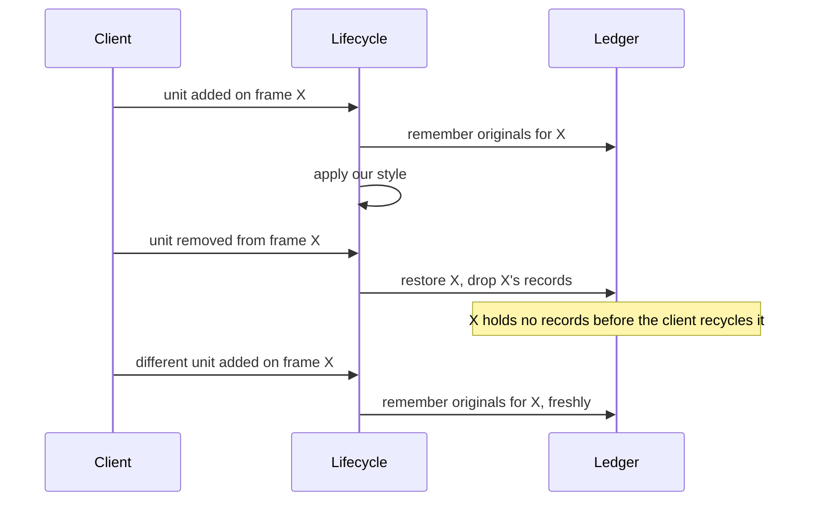
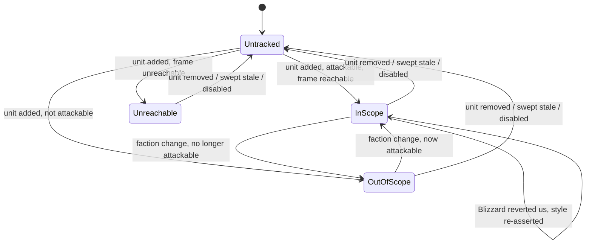

# PersonalAddon — Phase 2 Design
**Date:** September 19, 2026
**API Version:** 1.60.1 (WoW Forever Beta)
**Supersedes:** Phase 2 section of `20260919-RoadmapProposal.md`
**Depends on:** `20260919-Phase01.md` rev 6 — registry, dispatch, config store, isolation
**Revision:** 5 — spike complete (§4.6); client findings in §4.7, §4.8, §9.0, §9.5 and §9.6; audit dispositions in §14

---

## 1. Scope

Skinnier hostile and neutral nameplates and aggro-based colouring from a DPS
perspective.

**As shipped on 1.60.1: geometry and colouring only.** Name repositioning was
designed, built and then withheld by the client (§4.7), which also means the
roadmap's "Data Positioning" bullet is fully out of reach under restyle-in-place.

| Item | Kind | Note |
|---|---|---|
| Capability spike | Investigation | Runs first; records what the client permits |
| Style ledger | Substrate | New; Phase 3 reuses it |
| Nameplate lifecycle | Feature | Attach, detach, rescope, zone sweep |
| Geometry restyle | Feature | Bar dimensions on Blizzard's own bar |
| Name repositioning | Feature | **Withheld by this client — §4.7** |
| Aggro colouring | Feature | Capability-gated, binary |

Phase 1's lesson drives the shape of this document: **every client capability
this phase depends on is probed before it is designed against, and every
capability has a stated behaviour when it is withheld.** Three assumptions about
this client were falsified during Phase 1. Assuming again costs more than a
spike.

The capability gating is enforced at runtime, not merely recorded. The spike
exists to put knowledge on paper; the feature detects what it can do each time
it enables, so it stays correct across a client patch that changes the answer.

## 2. Non-goals

- **Guild tags and NPC role tags.** The roadmap lists them; restyle-in-place
  cannot deliver them. Nameplates carry no guild text to reposition, so adding
  one means creating and owning a widget per plate, which is the strategy that
  was considered and not chosen (§3). Deferred, not forgotten — §13 states what
  it would cost.
- **Friendly nameplates.** Hostile and neutral only.
- **The personal resource display.** Your own nameplate is a different frame.
  This was deferred to Phase 3, which was **rejected 2026-09-19** — so it is now
  simply out of scope, with no phase behind it.
- **Health text, percentages, or any numeric health readout.** Almost certainly
  impossible (§4.1), and not in the roadmap either way.
- **Replacing nameplates with frames we own.**
- **Any CVar write.** Nameplate behaviour is heavily CVar-driven and it is
  tempting to set visibility and distance CVars. Phase 2 restyles whatever the
  user's own CVars produce. CVars are global client state that outlives the
  addon, and the capture-and-restore machinery for them belongs in Phase 5 where
  the camera genuinely needs it. Building it now would be an abstraction with
  one hypothetical consumer, which is the mistake §13 records.
- **Insecure hooks into Blizzard nameplate code.** Secure post-hooks only, and
  only under the constraints in §7.2.

## 3. Decisions taken

**Restyle in place; own nothing.** Blizzard's status bar is the only thing that
knows a unit's health, and on this client it is likely the only thing that ever
will (§4.1). We resize and recolour that bar, and would have moved its existing
name text had the client permitted it (§4.7). We create no frames, textures or
font strings. The cost is the two non-goals above; the benefit is that the feature
is indifferent to whether health is readable — which is what let it survive the
protected-power finding that killed Phase 1's tick line.

**Hostile and neutral units only**, tested by attackability.

**Aggro colouring is binary on the spike.** If the client tells us who a mob is
attacking, we colour red / green / white. If it withholds that, we do not colour
at all and leave Blizzard's colours alone — no reaction-colour substitute, which
would look like a working feature while conveying nothing.

**Pet and guardian aggro is green.** Green means "something other than me is
holding this". Keeps the palette at three.

**Prefer boolean and string APIs over numeric ones.** Earned in Phase 1: the
restriction system protects *numbers*. Where a capability is available as both a
count and a predicate, take the predicate. This is why §9 compares unit
identities rather than reading threat percentages, and why §6 tests
attackability rather than reading a reaction index.

---

## 4. Capability spike

A `nameplateProbe` feature, disabled by default, driven by `/pa probe plates`.
Same pattern as Phase 1's gossip probe, with that probe's attempt-tracking fix
applied from the start: **a question that was never asked must never report as a
pass.**

```
type FunctionName = string
type CapabilityVerdict = Available | Withheld | Absent | NotTested
```

`NotTested` is a first-class verdict, not an absence. Phase 1's spike reported an
unrun probe identically to a passing one, which is how its reward question went
unanswered while appearing answered.

### 4.1 Is unit health readable?

```
# pre:  a hostile nameplate unit exists
# post: reports whether arithmetic on the unit's health is permitted, without
#       raising if it is not
function probe_health_readable(
    unitToken: UnitToken
) -> CapabilityVerdict
```

Expected `Withheld`, by analogy with power in Phase 1 §11.1a. Probed because the
analogy is an inference, and because `Available` would reopen the replacement
strategy rejected in §3.

**This does not gate Phase 2.** Restyle-in-place needs no health value. It was
probed for the record, and originally because Phase 3 would want the answer.
Phase 3 was rejected, so the record is now the only reason — and it is still
worth having, since it confirms the Phase 1 §11.1a analogy held.

### 4.2 Is the aggro target readable?

The question that decides whether §9 ships.

```
# pre:  unitToken is a live hostile nameplate unit, ideally one in combat
# post: reports which candidate mechanisms this client permits
function probe_aggro_source(
    unitToken: UnitToken
) -> AggroSourceVerdict

type AggroSourceVerdict = {
    targetOfTarget:  CapabilityVerdict,
    threatSituation: CapabilityVerdict,
    combatState:     CapabilityVerdict
}
```

1. **Target-of-target** — can we resolve the nameplate unit's target and compare
   its identity against the player, the pet and the group? Identity comparison is
   a predicate, so it is the mechanism most likely to survive the restriction
   system.
2. **Threat situation** — if a threat query exists, is its result readable or
   protected? A protected numeric threat value is useless; a readable
   categorical one would be better than target-of-target because it is what the
   server actually means.
3. **Combat state** — needed to tell `Elsewhere` from `Unknown`; see §9.2.

**Sub-question resolved 2026-09-19, ahead of the spike.** The third sub-question
of revision 1 asked what Blizzard's default plates already encode, on the
grounds that a client allowed to know things we are not may already be colouring
this. Answered by observation: **default plates colour a hostile unit's health
bar red and nothing else — no threat encoding, no target encoding, and no
in-game setting to add any.** The only colour option the client offers is class
colouring of the bar or name.

So §9 is not redundant. It adds information the client does not otherwise
surface, which is the strongest justification this phase has for any of its
work.

### 4.3 Is the nameplate frame touchable, and does Blizzard revert us?

```
# post: reports whether the nameplate frame and its parts can be read and
#       written from addon code, and names the update path that reverts us
function probe_plate_mutability(
    unitToken: UnitToken
) -> PlateMutabilityVerdict

type PlateMutabilityVerdict = {
    addedEventDeliverable:  CapabilityVerdict,
    frameReachable:         boolean,
    barResizable:           boolean,
    barRecolourable:        boolean,
    nameTextMovable:        boolean,
    revertingUpdatePath:    FunctionName | Absent,
    securePostHookAllowed:  boolean
}
```

`addedEventDeliverable` closes a contradiction the audit found: §10 lists the
nameplate-added event as a required capability, so it must be probed like any
other. Phase 1's dispatcher already refuses a subscription the client will not
deliver and surfaces it, so the runtime enforcement exists regardless — but the
spike should not claim to cover every dependency while skipping one.

`revertingUpdatePath` is the field that decides §7.2. Blizzard re-sets nameplate
size and anchoring on unit add, target change and scale change; a one-shot
restyle visibly reverts. `securePostHookAllowed` decides whether we may hook it.

If `frameReachable` is false for some units but not others — plausible, since
restricted clients mark some frames untouchable — §6 skips those plates rather
than faulting the feature.

### 4.4 Is an NPC's title available?

```
# post: reports whether an NPC's title is obtainable without tooltip scanning
function probe_npc_title_source() -> TitleSourceVerdict

type TitleSourceVerdict = DirectApi | TooltipScanOnly | Unavailable
```

Phase 2 does not use it — role tags are a non-goal — but a `DirectApi` answer
sharply lowers the cost of §13's deferred work and changes whether the deferral
is worth revisiting.

### 4.5 What does the frame look like?

```
# post: records the widget path from the nameplate frame to its health bar and
#       name text, so §7 and §8 are written against observation rather than an
#       assumed frame layout
function probe_plate_shape(
    unitToken: UnitToken
) -> PlateShapeReport
```

Added because every falsified Phase 1 assumption was of this kind: a well-known
API that this client arranges differently. The health bar and name widget paths
are worth one probe rather than one debugging session.

### 4.6 Results

**Complete, 2026-09-19.** `/pa probe plates` against a hostile target in combat.

| Question | Verdict | Detail |
|---|---|---|
| 4.1 health readable | **Withheld** | value is protected — confirms the Phase 1 analogy |
| 4.1 health max readable | **Withheld** | value is protected |
| 4.2 target-of-target | **Available** | resolved a real unit |
| 4.2 threat situation | **Available** | returned `3`, and the number is computable — see §4.8 |
| 4.2 combat state | **Available** | |
| 4.2 aggro evidence | **Available** | target resolved to a named unit |
| 4.2 Blizzard's own colouring | Hostile red only | plus the selected target, which turns out to matter — §9.5 |
| 4.3 added event deliverable | **Available** | |
| 4.3 frame reachable | **Available** | |
| 4.3 bar resizable | **Available** | height was 10.4 by default |
| 4.3 bar recolourable | **Available** | was 1.00 0.00 0.00 |
| 4.3 name text movable | **Withheld** | restricted region — §4.7 |
| 4.3 reverting update path | **Available** | `CompactUnitFrame_UpdateAll` |
| 4.3 secure post-hook allowed | **Available** | `hooksecurefunc` present, hook installed |
| 4.4 NPC title source | **Inconclusive** | the probe was wrong — see below |
| 4.5 frame shape | **Available** | `frame.UnitFrame.healthBar` and `.name` |

Three things worth drawing out.

**The default bar height is 10.4**, so the shipped `barHeight = 6` is a genuine
reduction rather than a guess that happened to be smaller. `barWidth = 110` is
still untuned.

**`UnitThreatSituation` is readable**, which §4.2 named as the preferred mechanism
if it ever were. It is. See §4.8.

**The NPC title result was a false positive, and the probe was at fault.** It
asked "did `UnitPVPName` return a string", which it does — it returns the *bare
name* for an NPC with no title, and the reported value (`Prideclaw`) was the
mob's name, not a title. Reporting that as `Available` is the same error class as
Phase 1's gossip probe reporting an unrun question as a pass: **a call that
returned is not a call that answered.** The probe now compares the decorated name
against the plain one and reports `NotTested` when they match, with instructions
to re-test on an NPC that actually has a title.

### 4.7 Client finding, 2026-09-19: the nameplate name is a restricted region

Verified in game. Reading a nameplate name's anchors fails with:

```
FontString:GetPoint(): Action[FrameMeasurement] failed because
[Can't measure restricted regions]
```

**The client logs and returns; it does not raise.** So `pcall` suppresses
nothing — the same shape as Phase 1's forbidden combat-log registration, and the
second time this client has answered a refusal with a log line rather than an
error. The lesson is now general enough to state as a rule:

> On this client, a refusal may arrive as a **log line and a nil return** rather
> than as a Lua error. A guarded call is therefore not sufficient; the call must
> be **feature-detected, attempted once, and the verdict cached.**

Two consequences:

**§8 name repositioning does not ship.** We cannot measure the name, so we cannot
record an original, so we must not move it — moving it without a recorded
original would leave a change `disable()` cannot undo, which §5 exists to
prevent. `nameOffsetY` remains a config key and has no effect; `/pa plates`
reports it as unavailable.

**The roadmap's "Data Positioning" bullet is now entirely unachievable under
restyle-in-place.** Guild and NPC role tags were already non-goals (§2) because
they need widgets we own. The unit name is the last item in that bullet, and this
client will not let us move Blizzard's. Phase 2 therefore delivers **geometry and
colouring only.** Adding any text positioning means owning the widgets, which is
the Phase 2b sketched in §13.

**Cost of the diagnosis: one taint complaint per attempt.** The first build
measured per plate per style, so the count climbed with every pull — the report
that surfaced this was `11x` and rising. The verdict is now probed once per
session and cached, and a forbidden-region pre-check avoids even that attempt
where the client flags the region up front. Expect at most one such line in the
error log, from the single probe.

### 4.8 `UnitThreatSituation` is available, and is the better mechanism

Returned `3` and the value is computable, so it is not protected. §4.2 set the
preference order before knowing: a readable categorical threat value beats
target-of-target *because it is what the server actually means.* Target-of-target
is a proxy — it reports who a mob is swinging at this instant, which flickers as
mobs retarget mid-combat.

**Not implemented in revision 3.** The shipped mechanism is target-of-target,
which works. Swapping to threat is a mechanism change rather than a fix, and
mixing it into the same pass as the §9.5 bug fixes would have made it impossible
to tell which change produced which behaviour.

What the swap would buy:

- A steadier read. Threat does not flicker when a mob's swing target changes for
  one server tick, which is the twitchiness observed in live play.
- Correctness on multi-target mobs, where "who is it hitting" and "who has
  threat" genuinely differ.

What it costs:

- One threat query per group member per plate to answer the *green* case, since
  `UnitThreatSituation(unit, mob)` answers only for the unit asked about. That is
  up to five queries per plate against the current three predicates.
- A semantic decision the current design does not need: the threat scale
  distinguishes "tanking securely" from "tanking insecurely", and the palette has
  no colour for "you are about to lose it". That is arguably the most useful thing
  on the whole nameplate, and it is a Phase 2b question rather than a fix.

Recommendation: take the swap, in its own pass, with §9.1's case table rewritten
against threat levels rather than target identity.

---

## 5. Style ledger

**The central correctness problem of this phase.** We mutate frames we do not
own, and Phase 1 §6.1 requires that after `disable()` the feature holds zero
shown frames — which for foreign frames means *restored*, not hidden.

A naive disable writes back what it believes Blizzard's defaults are. That is
wrong the moment Blizzard changes a default, and on a beta client it will be
wrong within a patch or two. The ledger records what was actually there.

```
type Widget = opaque
type Length = number
type Anchor = { point: AnchorPoint, relativeTo: Widget, relativePoint: AnchorPoint,
                offsetX: Length, offsetY: Length }
type Colour = { red: Fraction, green: Fraction, blue: Fraction }
type StyleValue = Length | Anchor | Colour

type StyledProperty =
      BarWidth | BarHeight | BarPoint
    | NamePoint
    | BarColour

type StyleRecord = {
    property: StyledProperty,
    original: StyleValue
}

type StyleLedger = Map<Widget, List<StyleRecord>>
```

```
# Records a foreign widget's original value for a property, once per occupancy.
# pre:  widget is live; property is one this addon can read and write
# post: the original is stored if and only if no original is already stored for
#       this widget and property within the current occupancy (§5.1)
function remember_original(
    ledger: StyleLedger,
    widget: Widget,
    property: StyledProperty,
    currentValue: StyleValue
) -> Unit

# Writes back every original recorded for one widget and forgets them.
# pre:  none
# post: the widget holds its recorded originals and has no records left
# raises: never — a destroyed widget is counted, not raised on
function restore_widget(
    ledger: StyleLedger,
    widget: Widget
) -> RestoreReport

# Writes back everything and empties the ledger.
# post: the ledger is empty; every record was restored or counted
# raises: never
function restore_all(
    ledger: StyleLedger
) -> RestoreReport

type RestoreReport = {
    restored:     integer,
    widgetGone:   integer,
    writeRefused: integer
}
```

### 5.1 Record lifetime is one occupancy, not one session

The audit's sharpest finding: record-once-per-frame is wrong because **nameplate
frames are recycled across units.**

Capture frame `X`'s originals while it shows a small mob, let the client recycle
`X` to an elite that Blizzard would size differently, and our stored original is
the small mob's. Restoring writes the wrong geometry onto a frame showing a
different unit. Blizzard also re-sizes based on unit state — target scaling,
classification — so even within one occupancy there is more than one base value.

The fix makes the record's lifetime match the frame's occupancy by one unit:

- On attach, capture originals fresh.
- On detach — unit removed, rescoped out, or swept as stale — **restore
  immediately and drop the records**, before the client can recycle the frame.
- The ledger therefore only ever holds records for currently-attached plates, and
  `restore_all` at disable is a short list.



### 5.2 Restore must be non-permanent, not perfect

Worth stating because it bounds how much the §5.1 problem can cost.

If Blizzard changes a base value mid-occupancy — you target the mob and its plate
scales up — our captured original is the pre-target value, and restoring gives
the smaller size. That is a wrong value.

It is also a self-correcting one. **Once we stop re-asserting, Blizzard's own
update path writes its current value on the next event it fires on.** We are not
the only writer; we are merely the one that has to stop cleanly. So restore needs
to be non-permanent rather than exact, and the failure mode is a wrong size for
one event cycle rather than a frame permanently altered.

This is why §5.1's fix is worth having anyway: a wrong restore that persists
until Blizzard's next update is still a visible glitch, and the fix is cheap.

### 5.3 Keyed by widget identity

Not by unit token. Nameplate unit tokens are recycled aggressively —
`nameplate3` is a different mob a minute later — so a token-keyed ledger restores
the wrong widget. Keys are the widget references themselves.

~~Phase 3 restyles the player frame and reuses this unchanged.~~ **That
justification is void: Phase 3 was rejected 2026-09-19.**

This is worth recording rather than quietly deleting, because the argument was
mine. §13 criticises `FramePool` for being built on "a consumer one phase away",
and claims the ledger clears a higher bar — "a consumer whose design is already
written down". The design was written down. It was then cancelled.

So the ledger has exactly one consumer, and the stricter test I proposed turned
out to be only marginally stricter than the one it replaced. The honest version:
**a planned consumer is not a consumer, however well documented.** The ledger
earns its place on the merits of this phase alone — it is what makes
restyle-in-place reversible, and §12's criterion 5 would be unmeetable without
it — not on a second consumer that never arrived.

---

## 6. Nameplate lifecycle

One tracked record per attached plate, carrying its scope. This unifies three
audit findings — the missing `Skipped`/`Styled` transitions, the missing
`Skipped` teardown, and the `sweep_aggro` contradiction — which all came from
modelling in-scope and out-of-scope plates as separate populations.

```
type PlateScope = InScope | OutOfScope | Unreachable

type TrackedPlate = {
    frame:        Widget,
    healthBar:    Widget | Absent,
    nameText:     Widget | Absent,
    unitToken:    UnitToken,
    scope:        PlateScope,
    styleApplied: boolean,
    lastAggro:    AggroState | Absent
}
```

```
# Decides whether a nameplate is ours to style.
# pre:  unitToken came from the client's nameplate-added event
# post: InScope only for units the player can attack, which is hostile and
#       neutral and excludes the player's own plate
function classify_scope(
    unitToken: UnitToken,
    frame: Widget | Absent
) -> PlateScope
```

Attackability is a predicate, so it is preferred over a numeric reaction index
(§3). It is also the correct test: "can I fight this" is what hostile-or-neutral
means.



### 6.1 Scope can change while a plate is attached

A unit's attackability is not fixed for the plate's lifetime. A player flags for
PvP, a mob is mind-controlled, a faction changes. The transitions above are
driven by the unit-faction event, and both directions matter:

```
# Re-evaluates one tracked plate's scope and applies or reverses styling.
# pre:  plate is tracked
# post: on a transition into InScope the style is applied and originals recorded;
#       on a transition out of InScope the originals are restored and dropped;
#       an unchanged scope writes nothing
function rescope_plate(
    plate: TrackedPlate,
    ledger: StyleLedger,
    style: NamePlateStyle
) -> Unit
```

**Leaving `InScope` restores immediately**, per §5.1 — a plate that stops being
ours must not keep our geometry while we stop maintaining it.

### 6.2 Teardown is uniform across scopes

Every tracked plate is untracked the same way regardless of scope: restore what
the ledger holds for it, drop its records, remove the record. An `OutOfScope`
plate holds no records, so its restore is a no-op — but it is still *tracked*,
and therefore still has to be untracked, or the tracked set grows without bound.

```
# Releases tracking for every plate whose unit no longer exists.
# pre:  called on world entry, and on a low-frequency interval as a backstop
# post: every tracked plate whose unit is gone has been restored and untracked,
#       whatever its scope; plates whose units are live are untouched
function sweep_stale_plates(
    trackedPlates: List<TrackedPlate>,
    ledger: StyleLedger
) -> integer
```

`NAME_PLATE_UNIT_REMOVED` does not reliably fire for every plate when the world
changes. A lifecycle that trusts it leaks a record per plate per loading screen,
forever. Same defect class as Phase 1's dead subscription: a resource recorded as
live that the event which should reclaim it never will.

**`disable()` empties the tracked set as well as the ledger.** Restoring the
ledger without clearing tracking leaves records pointing at frames we no longer
maintain, and the next enable would believe they were already styled.

### 6.3 Bounded by construction

The tracked set is bounded by the client's nameplate cap. Iteration is always
over the tracked list, never a discovery scan of the frame hierarchy. Nothing
allocates per frame or per event in the steady state.

---

## 7. Geometry restyle and re-application

```
type NamePlateStyle = {
    barHeight:   Length,
    barWidth:    Length,
    nameOffsetY: Length
}

type PlateUnstyleable = FrameUnreachable | BarMissing | WriteRefused
```

```
# Applies our dimensions to a nameplate's health bar.
# pre:  plate.scope == InScope
# post: on success the bar carries our dimensions and the ledger holds its
#       originals; on failure nothing was written and nothing was recorded
# raises: never — an unstyleable plate is skipped and surfaced once per session
function apply_plate_style(
    plate: TrackedPlate,
    style: NamePlateStyle,
    ledger: StyleLedger
) -> Result<Unit, PlateUnstyleable>
```

**Record before write, and record nothing on a failed write.** A recorded
original for a property we never changed makes restore write a value Blizzard
was already managing, which is a corruption rather than a no-op.

### 7.1 Re-application strategy

Blizzard reverts us. Three strategies, in descending preference, selected by
§4.3:

| Strategy | Condition | Cost |
|---|---|---|
| Secure post-hook on the reverting path | §4.3 names it and permits hooking | Re-asserts exactly when Blizzard changes something |
| Re-apply on the events Blizzard re-applies on | Hook refused or path unnamed | Incomplete by construction — some path will be missed |
| Throttled sweep over tracked plates | Both unavailable | Correct eventually; a brief flicker per revert |

**A per-frame reassert is not on the list.** Forty plates times every frame is
the one thing this phase must not do, and for a property that only changes when
Blizzard touches it, a few-hertz sweep is indistinguishable to the eye.

The sweep is the backstop in all three cases, because "Blizzard changed
something we did not predict" is not hypothetical on a beta client.

### 7.2 A secure post-hook cannot be removed

The audit's second sharpest finding, and a genuine lifecycle leak. Secure
post-hooks are permanent for the session — there is no unhook. A hook that
re-asserts our style will keep doing so after `disable()`, undoing
`restore_all` on the next Blizzard update and leaving the feature visibly active
while disabled.

Constraints, all three required:

1. **Installed at most once per session**, on first enable, never per enable.
   Enabling and disabling ten times must not stack ten hooks.
2. **Inert when disabled.** The hook body's first action is to check whether the
   feature is enabled and return if not. It must also return if the frame is not
   a tracked `InScope` plate.
3. **Documented as an exception** to Phase 1 §6.1's zero-registrations
   post-condition, alongside the slash command in Phase 1 §10. The hook survives
   disable; what the contract actually guarantees is that it does nothing.

This is the only place in the phase where disable cannot fully undo itself, and
it is the reason the hook is third in preference order behind nothing — it is
first in *capability* and carries a permanent cost.

---

## 8. Name repositioning — not shipped on this client

**Withheld by 1.60.1 (§4.7).** The design is kept because it is correct on a
client that permits the measurement, and because the capability gate around it is
what keeps the rest of the feature working.

```
type NameTextImmovable = NameWidgetMissing | AnchorWriteRefused | RegionRestricted
```

```
# Reports once per session whether this client will let us measure and move the
# nameplate name. Cached, because a refusal costs a taint complaint per attempt.
# pre:  nameText is a live font string
# post: the verdict is memoised for the session; at most one measurement is ever
#       attempted, and none at all when a cheap forbidden-region check suffices
function name_is_repositionable(
    nameText: Widget
) -> boolean

# Repositions a nameplate's existing name text.
# pre:  name_is_repositionable returned true; plate.scope == InScope
# post: the name sits at the configured offset and its original anchor is in the
#       ledger; on failure nothing was written or recorded
function apply_name_position(
    plate: TrackedPlate,
    nameOffsetY: Length,
    ledger: StyleLedger
) -> Result<Unit, NameTextImmovable>
```

The ordering matters: the probe runs **before** the ledger read, so a client that
refuses measurement costs one attempt rather than one per plate per sweep.

**No string passes through this addon** either way, which is why Phase 1's
`EscapeGuard` has no consumer here (§13). The moment a later phase *sets*
nameplate text from a unit or guild name, that changes and the neutralizer
becomes mandatory.

---

## 9. Aggro colouring

**Conditional on §4.2.** If the client withholds the aggro target, this section
does not run and Blizzard's colours are left alone (§3). §4.6 confirms Blizzard
encodes nothing beyond hostile-red, so this is additive rather than duplicative.

```
type AggroState = OnPlayer | OnGroupOrPet | Elsewhere | Unknown
```

```
# Compares two units, distinguishing "no" from "could not tell".
# pre:  both tokens are syntactically valid unit references
# post: Absent when the comparison could not be completed at all
# raises: never
function units_are_same(
    leftUnit: UnitToken,
    rightUnit: UnitToken
) -> boolean | Absent

# Classifies who a hostile unit is currently attacking, from a DPS perspective.
# pre:  plate.scope == InScope
# post: returns Unknown when the client withholds the unit's target or when any
#       comparison could not be completed; never a guess
# raises: never
function classify_aggro(
    unitToken: UnitToken
) -> AggroState
```

### 9.0 A failed comparison is not a negative answer

`units_are_same` returns three values, not two, and the third one is
load-bearing. The first implementation collapsed it to two by reading a guarded
call's result directly, which meant a *failed* comparison was indistinguishable
from a successful `false` — and, worse, the failure value was truthy, so a
comparison that could not be made read as **yes**.

Observed in live play: a mob held by one party member was green, and when a
different party member took over it turned red, as though the player had aggro.
Nothing about the player had changed; a comparison had simply failed, and the
failure was being read as agreement.

The rule this phase now encodes, and the reason §9 has a fourth state at all:

> A comparison that could not be completed is `Unknown`. `Unknown` restores the
> original colour. The cost of not knowing is an uncoloured plate — never a
> confidently wrong one.

Group membership follows the same shape. The membership test returns
true / false / could-not-tell, and falls back to explicit comparison against the
four party slots when the client's own membership query refuses, because getting
the second puller's colour wrong is worse than four extra predicate calls per
plate.

### 9.1 The full case table

The roadmap's three colours absorbed six unstated cases. All of them:

| The mob is targeting | State | Colour | Why |
|---|---|---|---|
| The player | `OnPlayer` | Red | You have it |
| A party or raid member | `OnGroupOrPet` | Green | Someone else has it |
| Your pet or guardian | `OnGroupOrPet` | Green | Decision in §3 — not you |
| Nothing, and not in combat | `Elsewhere` | White | Genuinely idle |
| A player outside your group | `Elsewhere` | White | Not your fight |
| Another NPC — infighting, guards, charmed mobs | `Elsewhere` | White | Not a unit you are responsible for |
| A totem or an uncontrolled guardian | `Elsewhere` | White | Not a unit you are responsible for |
| Nothing resolvable, but the mob is in combat | `Unknown` | **restore original** | It has a target we cannot see |
| Target resolution refused outright | `Unknown` | **restore original** | We do not paint a guess |

A mob targeting another NPC is `Elsewhere` rather than `Unknown`: we resolved its
target successfully, and the answer is "not you and not your group". `Unknown` is
reserved for *failure to see*, not for seeing something uninteresting.

### 9.2 Telling `Elsewhere` from `Unknown`

An unresolvable target and no target at all look identical — both are simply an
absent unit. Distinguishing them matters, because one is information and the
other is its absence.

**Combat state is the discriminator.** A mob in combat necessarily has a target.
If it is in combat and we cannot resolve one, the client is withholding it, and
the honest answer is `Unknown`. If it is not in combat, an absent target is the
truth, and the answer is `Elsewhere`.

```
# pre:  the unit's target could not be resolved
# post: Unknown when the unit is in combat, Elsewhere when it is not;
#       Unknown when combat state itself is unreadable
function classify_unresolved_target(
    unitToken: UnitToken
) -> AggroState
```

Unreadable combat state resolves to `Unknown`, not `Elsewhere`, because the
whole point of the state is to avoid asserting something we cannot see.

### 9.3 `Unknown` restores rather than holding

A plate coloured red that becomes `Unknown` must **not** keep the red. Revision 1
said "leave the plate alone", which was written for a plate never coloured and is
wrong for one already coloured — it leaves a stale, confident claim on screen,
which is exactly what the fourth state exists to prevent.

```
# Applies a classification to a plate, writing only on change.
# pre:  plate.scope == InScope
# post: on a state change the corresponding colour is written, or the original
#       colour is restored when the new state is Unknown;
#       an unchanged state writes nothing
function apply_aggro_colour(
    plate: TrackedPlate,
    state: AggroState,
    palette: AggroPalette,
    ledger: StyleLedger
) -> Unit
```

So the `BarColour` record's lifetime is shorter than the other properties': it is
recorded on the first colour write and restored on any transition to `Unknown`,
as well as on detach and disable.

### 9.4 Evaluation cadence

```
# Re-classifies every InScope plate and writes only those whose state changed.
# pre:  called on a fixed low-frequency interval, never from an update handler
# post: every InScope plate has been classified once; OutOfScope and Unreachable
#       plates are skipped; unchanged plates were not written
function sweep_aggro(
    trackedPlates: List<TrackedPlate>,
    palette: AggroPalette,
    ledger: StyleLedger
) -> Unit
```

Filtering to `InScope` is explicit: the tracked list holds every attached plate,
and colouring an out-of-scope one would both be wrong and record an original we
have no business holding.

Event-driven where the client cooperates, swept where it does not. The
unit-target event is the natural trigger but is unreliable for nameplate units on
every client I know of, so the sweep is primary and the event is an accelerator.

**Write only on drift, not on classification change** — see §9.5, which corrects
what this paragraph originally said. `lastAggro` records what we decided; it does
not gate whether we write. Recolouring forty plates several times a second would
be waste, so the write is suppressed when the bar already holds our colour — but
that test reads the bar, rather than trusting our own last decision.

### 9.5 Blizzard is a competing writer on the bar colour

Found in live play, 2026-09-19, and it invalidated part of §9.4 as written.

**The client paints the player's current target's health bar red on its own
schedule.** So a plate we had painted green went red the moment the player cast
at it, and stayed red while they kept casting. Stop attacking and the green came
back.

The cause was §9.4's "write only on change", which this document specified as
change of *classification*. That is the wrong comparison when another writer
exists:

| Comparison | Behaviour |
|---|---|
| desired versus previously-desired | Our write happens once. Blizzard's next write wins permanently. |
| desired versus **actual** | Our write happens whenever the bar does not already hold our colour. |

The second is what the geometry re-assert had been doing all along (§7.1 writes
on drift, not on config change). The colour path simply never got the same
treatment, and the asymmetry survived review because both were described as
"write only on change" using the same words for different comparisons.

**Corrected rule:** every property we own on a foreign widget is re-asserted by
comparing our desired value against the widget's current value, on a tolerance
where the value is a float. Classification changes decide *what* we want; they
never decide *whether* to write it.

The re-assert is driven from two places, and the split matters for cost:

- **The secure post-hook**, which fires on the exact update that overwrote us, and
  re-asserts **one plate** in O(1). It resolves the plate through an index keyed
  by unit frame, because Blizzard hands its update path the unit frame rather
  than the nameplate frame.
- **The interval sweep**, which catches anything the hook could not attribute.

The first implementation called the full sweep from the hook. That is O(n) per
fire, and Blizzard's update path fires per plate per health change — O(n²) per
health tick across a crowded pull, which is precisely the case §12's criterion 10
exists to protect. A call the hook cannot attribute now sets a coalescing flag for
the next tick instead of sweeping synchronously.

### 9.6 Winning the race is not the same as not flickering

Observed in live play after §9.5 shipped: when a mob the player has **selected**
is held by **another party member**, the plate oscillated between green and red.

§9.5's fix was correct and incomplete. It changed us from *losing permanently* to
*winning eventually*, and "eventually" was one sweep period — 250 ms of Blizzard's
colour before our correction. A quarter-second alternation does not read as a
colour; it reads as a fault.

The conflict is narrower than it looks. It requires **both** of:

- the mob is the player's selected target, which is the only plate Blizzard
  repaints on its own initiative, and
- our verdict for that plate is not red, so our colour and Blizzard's disagree.

When the mob is attacking the player, both parties want red and nothing is
visible. When the mob is not selected, Blizzard is not writing. So the contested
set is bounded by one plate in practice, which is what makes the fix affordable.

**Three changes, in descending certainty:**

**1. Hook every colour-writing path, not the first path found.** A post-hook on
the function that writes the colour re-asserts in the *same frame* as Blizzard's
write, so nothing is ever drawn wrong. Revision 3 installed on the first
candidate that existed, which was a general update function rather than the
colour one. All available candidates are now hooked, colour-specific first.

**2. Re-assert a contested plate every frame until it settles.** A plate enters
the contested set when a re-assert actually had to write — that is the signal
another writer got there first — and leaves after a grace period with no further
drift. Only contested plates are checked per frame, so the cost is bounded by the
number of plates Blizzard is fighting us over, not by the number on screen. The
per-frame driver stops entirely when the set empties.

**3. `yieldSelectedTarget`, off by default.** Ceding the property outright: the
selected target's plate is reported `Unknown`, which restores Blizzard's colour
and stops us contesting it. Guaranteed stable, and the cost is no aggro colour on
the one plate the player is attacking. The white target outline still identifies
it.

The third exists because the first two cannot be verified from outside the client.
If a residual flicker survives on real hardware, it is one config key rather than
another round trip.

**The general lesson, which is not about nameplates.** Two writers on one property
cannot both be satisfied, and a re-assert loop is not a fix for that — it is a
choice to win the race, which has a visible cost measured by how fast you can win
it. The alternatives are to correct within the same frame as the other writer, or
to cede the property. Racing on a timer is the worst of the three, and it is the
one that looks like it works.

---

## 10. Degradation matrix

Every capability, and the behaviour without it. Each row surfaces once per
session; none degrades silently.

| Withheld | Effect | Feature state |
|---|---|---|
| Unit health readable | None — restyle needs no health value | Enabled |
| Nameplate-added event | No lifecycle at all | **Faulted**, reason named |
| Frame reachable, all units | Nothing to style | **Faulted**, reason named |
| Frame reachable, some units | Those plates tracked as `Unreachable` and skipped | Enabled |
| Bar resizable | Geometry cannot be applied | **Faulted**, reason named |
| Bar recolourable | §9 classifies but cannot paint | Enabled, colouring off |
| Target-of-target and threat | §9 does not run; Blizzard's colours kept | Enabled, colouring off |
| Combat state only | §9 runs; unresolved targets all read `Unknown` | Enabled, degraded |
| Name text movable | Name stays where Blizzard puts it | Enabled, repositioning off |
| Unit-faction event | Scope changes missed until the next sweep | Enabled, degraded |
| Secure post-hook | Fall to event re-apply, then to sweep | Enabled |

Three required capabilities, the rest refinements — the same
required-versus-refinement split Phase 1's `SIGNALS` table uses, for the same
reason.

---

## 11. Failure modes

| Failure | Detection | Behaviour |
|---|---|---|
| Frame forbidden for a unit | Reachability check before styling | Tracked as `Unreachable`, surfaced once, others unaffected |
| Bar write refused mid-session | Write result checked | Stop styling that plate, record nothing, surface once |
| Blizzard reverts our geometry | Post-hook, or the backstop sweep | Re-asserted; no user-visible persistence |
| Frame recycled to a new unit | Restore-on-detach before recycling (§5.1) | Records never outlive an occupancy |
| Blizzard changes a base value mid-occupancy | Not detectable | Restore is one event cycle stale, then self-corrects (§5.2) |
| `NAME_PLATE_UNIT_REMOVED` never fires | Zone sweep and interval backstop | Plate restored and untracked; `widgetGone` counted |
| Widget destroyed before restore | `restore_widget` counts it | Counted, never raised on |
| Scope changes while attached | Unit-faction event, sweep backstop | Style applied or reversed by `rescope_plate` |
| Post-hook fires after disable | Enabled check first in the hook body | Returns without writing (§7.2) |
| Post-hook installed repeatedly | Install-once guard | One hook per session regardless of enable count |
| Aggro unresolvable for one unit | `classify_aggro` returns `Unknown` | Original colour restored; other plates still coloured |
| A unit comparison refuses | `units_are_same` returns `Absent` | `Unknown`, never a guess (§9.0); the colour reverts |
| A refusal arrives as a log line, not an error | Verdict probed once and cached (§4.7) | One complaint per session rather than one per plate per sweep |
| Name region refuses measurement | `name_is_repositionable` caches false | Repositioning off; geometry and colouring unaffected |
| Aggro unresolvable for all units | Capability check at enable | §9 never runs; surfaced once |
| Stale colour after losing visibility | `Unknown` transition restores (§9.3) | Never holds a claim it can no longer support |
| Ledger restores the wrong widget | Prevented by construction | Keyed by widget identity, scoped to one occupancy |
| Blizzard repaints the bar we coloured | Desired-versus-actual comparison (§9.5) | Re-asserted by the hook in O(1), or by the next sweep |
| Blizzard repaints it repeatedly, on the selected target | Re-assert had to write, so the plate is contested (§9.6) | Corrected per frame until it settles; the set is bounded by one plate in practice |
| A residual flicker survives on real hardware | Visible oscillation | `yieldSelectedTarget` cedes that one plate's colour to Blizzard |
| Blizzard's update path fires per plate per tick | Hook re-asserts one plate, never sweeps | O(1) per fire; unattributable calls coalesce to the next tick |
| A probe reports a call that returned as a call that answered | Compare against a known baseline (§4.6) | `NotTested`, with what to re-test |
| Tracked set grows unbounded | Uniform teardown across scopes (§6.2) | Every scope is untracked the same way |
| Feature disabled mid-combat | `restore_all` on disable | Written back immediately; none of this is combat-protected |

---

## 12. Exit criteria

1. §4.6 is filled in and the §9 go/no-go is stated.
2. Hostile and neutral plates carry the configured dimensions; friendly plates
   and the player's own plate are untouched.
3. ~~The name sits at its configured offset.~~ **Unachievable on 1.60.1
   (§4.7).** Replaced by: the name measurement is attempted at most **once per
   session** regardless of plate count or sweep count, `/pa plates` reports it
   unavailable, and geometry and colouring are unaffected by its absence.
4. Blizzard reverting a plate's geometry is re-asserted within one sweep
   interval — verified by forcing a revert, e.g. targeting the unit.
5. **Disable restores exactly.** With the addon loaded and the feature disabled,
   plates are indistinguishable from a client with the addon absent. This catches
   a ledger that recorded our own values.
6. **A recycled frame restores correctly.** Style a small mob's plate, let it
   despawn, let the frame be reused by a differently-sized unit, then disable —
   the second unit's plate must not inherit the first's geometry. This is §5.1's
   regression test.
7. **Scope changes both ways.** A unit that becomes attackable while its plate is
   up gets styled; one that stops being attackable is restored.
8. A loading screen leaks nothing: tracked count returns to the plates actually
   on screen, and `widgetGone` does not grow across repeated zoning.
9. **The post-hook is inert when disabled.** Disable, then force the Blizzard
   update path to fire — geometry must stay restored. §7.2's regression test.
10. **Forty plates.** A dense pull or a raid with plates forced on: no
    measurable frame-rate change and no allocation growth over a minute of
    combat. This is the criterion the design is shaped by.
11. If §9 shipped: all four states render, including a deliberate `Unknown`
    restoring the original colour rather than holding a stale one.
    **Partially met 2026-09-19:** red, green and white confirmed in live play.
14. **Aggro holder changes hands.** With two party members, each pulling in turn
    on the same mob, the plate stays green across the handover. This is §9.0's
    regression test.
15. **Our colour survives attacking the mob.** Select a plate we have coloured
    green and cast at it repeatedly: it must stay green rather than reverting to
    Blizzard's selected-target red. §9.5's regression test, and the symptom that
    found that bug.
16. **The hook does not sweep.** Firing the reverting update path re-asserts the
    one affected plate and leaves the others to the interval sweep. This is the
    O(n²) guard, and it is cheaper to assert here than to discover at criterion
    10.
17. **No oscillation on the selected target.** Select a mob another party member
    is holding: the plate stays our colour rather than alternating. §9.6's
    regression test, and the symptom that found that bug.
18. **The contested set settles.** After the competing writes stop, the per-frame
    driver stops and the contested count returns to zero. This is what keeps §9.6
    from being a permanent per-frame cost.
12. If §9 shipped: pet aggro renders green, verified with a pet class.
13. Verified with the Gamepad UI active.

Criteria 5, 6 and 9 are the ones most likely to be skipped and most expensive to
discover late, because the symptom — permanently altered nameplates — gets
attributed to a different addon.

---

## 13. Phase 1 substrate this phase does not use

Recorded because I argued for both, and the argument for one was wrong.

**`FramePool` has no consumer in Phase 2.** I justified building it by naming
Phase 2 as its first consumer — "Phase 2 acquires a frame per nameplate unit on
add and releases on remove". Restyle-in-place creates no frames, so it does not.
Its first real consumer is Phase 4's combat text. That makes it, today,
speculative infrastructure carried for two phases, which is the premature
abstraction the Phase 1 review stance flags. The code is correct and tested; the
timing was wrong.

**`EscapeGuard` has no consumer either**, because §8 moves Blizzard's font string
without setting its text — and §4.7 means it does not even do that. It becomes
mandatory the moment any phase renders a unit name, guild name or gossip body,
which Phase 5's dialogue box will, but not now.

**The style ledger's second consumer never arrived either** (§5.3). Phase 3 was
rejected, so of the three substrate pieces this project has built ahead of need,
exactly one — the ledger — is used at all, and only by the phase that built it.

**The combat log channel in `Dispatch` has no consumer and cannot have one**, per
Phase 1 §11.2. It remains in case the restriction is ever lifted.

The lesson is not "build less substrate". It is that **"a consumer one phase
away" was not a strong enough test** — §5's ledger clears the higher bar, which
is a consumer whose design is already written down.

### What adding guild and role tags would cost

If §4.4 returns `DirectApi` and the tags become worth revisiting: one owned font
string per plate, therefore a per-plate widget lifecycle, therefore `FramePool`
acquires its consumer after all, therefore `EscapeGuard` becomes mandatory on the
guild string. A coherent Phase 2b, not a patch, and not scope creep here.

---

## 14. Audit disposition

Against `20260919-Phase02Audit.md`. **All fourteen accepted.**

| # | Section | Disposition | Resolution |
|---|---|---|---|
| 1 | §4.3 | Accepted | `FunctionName` defined in §4. |
| 2 | §5 | Accepted | `StyleLedger`, `Widget`, `StyleValue`, plus `Anchor`, `Colour` and `StyleRecord`, defined in §5. |
| 3 | §5 | Accepted, extended | The recycling case is worse than the dynamic-base case and the audit's question surfaced it. §5.1 scopes a record's lifetime to one occupancy and restores on detach before the client can recycle. §5.2 adds the bound the audit did not ask for: restore need only be non-permanent, because Blizzard's own update path re-establishes its values once we stop re-asserting. |
| 4 | §6 | Accepted | Scope is a property of one tracked record, not two populations. `InScope`/`OutOfScope` transitions are driven by the unit-faction event, both directions, in §6.1. |
| 5 | §6.1 | Accepted | §6.2 makes teardown uniform across all three scopes. An `OutOfScope` plate holds no records but is still tracked and still has to be untracked. |
| 6 | §6.1 | Accepted | `TrackedPlate` and `PlateScope` defined in §6. |
| 7 | §6.1 | Accepted | §6.2 states that `disable()` empties the tracked set as well as the ledger, and why: records pointing at unmaintained frames would make the next enable believe they were already styled. |
| 8 | §7 | Accepted | `Length` in §5, `PlateUnstyleable` and `NamePlateStyle` in §7. |
| 9 | §7.1 | Accepted, extended | §7.2 is new. A secure post-hook cannot be removed, so it needs three constraints, not one: inert when disabled *and* installed at most once per session *and* documented as an exception to Phase 1 §6.1. The audit named the first; install-once matters because enable/disable cycles would otherwise stack hooks. |
| 10 | §8 | Accepted | `NameTextImmovable` defined in §8. |
| 11 | §9.1 | Accepted | Mob-versus-NPC is `Elsewhere`. The principle: `Unknown` is for failure to see, not for seeing something uninteresting. |
| 12 | §9.1 | Accepted, extended | §9.3 is new: a transition to `Unknown` restores the original colour. Revision 1's "leave the plate alone" was written for a never-coloured plate and was wrong for a coloured one. The extension the audit did not ask for is §9.2 — `Elsewhere` and `Unknown` were indistinguishable as specified, since both present as an absent unit; combat state is the discriminator. |
| 13 | §9.2 | Accepted | Resolved by the unified model in §6. `sweep_aggro` filters to `InScope` explicitly in §9.4. |
| 14 | §10 | Accepted | `addedEventDeliverable` added to §4.3's verdict. Phase 1's dispatcher already refuses and surfaces an undeliverable event, so runtime enforcement existed — but §1 should not claim full coverage while skipping a dependency. |

Findings 4, 5 and 13 shared one root cause: modelling in-scope and out-of-scope
plates as separate populations. One model fixes all three, which is why they are
not three separate patches.

---

## Assumptions

- ~~`UnitHealth` is protected, by analogy with `UnitPower`.~~ **Confirmed
  2026-09-19** (§4.6): both health and max health are protected. The analogy held,
  and the phase was designed so the answer did not matter.
- Blizzard writes the bar colour but not the bar dimensions on its
  selected-target path. If it also rewrote dimensions, the geometry re-assert
  already handles it on the same drift comparison — this is an assumption about
  frequency, not about correctness.
- Widget geometry remains unrestricted for the health bar, **confirmed in live
  play**: resizing and recolouring both work. It is *not* unrestricted for the
  name region (§4.7), so "widget geometry is safe" was too broad an
  inference from Phase 1's mana bar — the restriction is per-region, not
  per-operation.
- The client's nameplate cap bounds the tracked set. If plates can exist without
  a corresponding added event, §6's tracking is incomplete and §6.2's sweep
  becomes primary rather than a backstop.
- A mob in combat always has a target, which is what makes combat state a valid
  discriminator in §9.2. If this client leaves a mob flagged in combat with no
  target — briefly, on death or evade — those plates read `Unknown` and are left
  at their original colour, which is the safe direction.
- A mob targeting a group member's *pet* is `Elsewhere`, not `OnGroupOrPet`. Only
  the player's own pet is folded into green; resolving every group member's pet
  would mean walking the full group's pet units on every classification, for a
  distinction a DPS player does not act on.
- Mind control needs no special case in §9: a controlled mob's target is read the
  same way as any other's. It does matter in §6.1, because control can change
  attackability.
- Nothing in this phase is combat-protected, so disable restores immediately
  rather than deferring to combat end. If a write turns out to be protected in
  combat, the restore path needs the deferral Phase 5's CVar work will need
  anyway.
