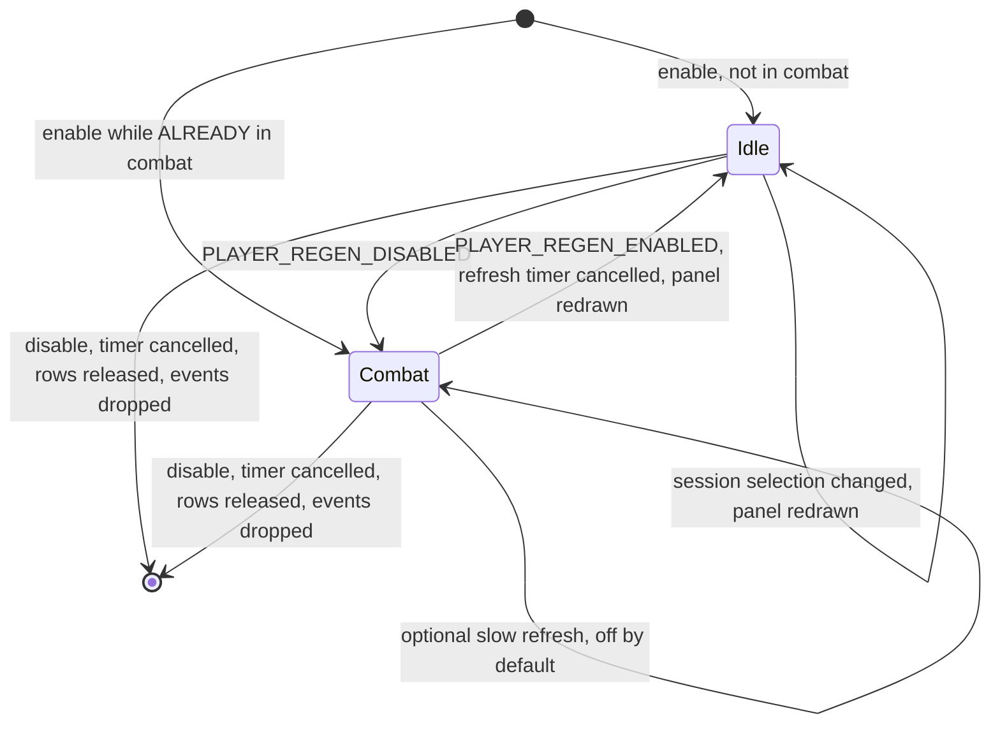

# PersonalAddon — Phase 4 Design
**Date:** September 19, 2026
**API Version:** 1.60.1 (WoW Forever Beta)
**Replaces:** Phase 4 of `20260919-RoadmapProposal.md` — "Scrolling Combat Text"
**Depends on:** `20260919-Phase01.md` rev 6, `20260919-Phase02.md` rev 5
**Revision:** 3 — live client findings in §6.1 and §7.1; audit dispositions in §13

---

## 1. Scope

A small panel above the player frame showing **your own damage breakdown by
spell**: icon, damage per second, and share of your own total.

| Item | Kind |
|---|---|
| Damage meter reader | Feature |
| Breakdown panel | Feature |
| Session selector (Current / Overall) | Config |

**This document is short because the phase is small.** The client does the hard
part. Phases 1 and 2 were long because they were arguing with a client that
withheld what they needed; this one reads a sanctioned API that returns exactly
the shape the feature wants. Padding it out would misrepresent the work.

### 1.1 Why this replaces Scrolling Combat Text

The roadmap's Phase 4 was MikScrollingBattleText-style floating numbers. That
requires per-hit damage events, and `C_CombatLog.IsCombatLogRestricted()` returns
**true** — the client says so itself, which turns the Phase 1 §11.2 finding from
an inference into a first-party statement.

MikScrollingBattleText was installed and registered roughly one hit in three.
Epic Damage Meter, measured against the built-in meter across eleven fights,
missed one spell — 10 of 11. **Both are building on an incomplete source.** For a
feature whose entire output is numbers, 10-of-11 is disqualifying in the worst
way: not visibly broken, just quietly wrong. A DPS figure that is ten percent
short looks entirely plausible.

So the scrolling-text feature is not deferred, it is **abandoned as
unimplementable correctly on this client**, and replaced by a panel built on the
data the client considers authoritative.

## 2. Non-goals

- **Replacing or hiding the built-in meter.** We read its data; we do not touch
  its window. An earlier proposal was to reparent `SourceWindow` out of the
  meter — rejected, see §3.
- **Group or raid comparison.** Percentages are of your own total. The session
  does carry every source, so this is possible later; it is not this phase.
- **A session browser.** `GetAvailableCombatSessions` returns your full history
  with mob names and durations. Browsing it is a natural second feature and is
  deliberately not built now.
- **Live updates during combat**, beyond an optional slow refresh. The stated
  requirement is post-combat information.
- **Aggregating anything ourselves.** If we find ourselves summing damage, we
  have taken a wrong turn — the client has already done it, more accurately than
  we could.

## 3. Decisions taken

**Read the sanctioned API; render our own panel.** Verified in §4. This was the
best of four candidate approaches and it is the only one that satisfies every
stated requirement, spell icons included.

The rejected alternatives, and why:

| Approach | Rejected because |
|---|---|
| Reparent the meter's `SourceWindow` | Child visibility is inherited, so hiding the meter to show one child *requires* reparenting. Then: an undocumented layout contract (§9.6's competing-writer problem with no events), rows recycled on rules we cannot observe (§5.1's problem, unbounded), and breakage on any UI patch. |
| Relocate and strip the whole meter window | Workable, but we inherit Blizzard's row format — so **no spell icons**, which was a stated requirement. |
| Aggregate from the event source EDM uses | 10 of 11. Disqualified: see §1.1. |

**Percentages are of your own total**, and **DPS is elapsed-time based** — both
your calls, and both happen to be what the API already returns, so neither
costs us anything.

**Spell icons, not names.** Narrower, more legible, and it means **no
server-sourced string reaches a font string** — so `EscapeGuard` still has no
consumer here (§12).

**Session selection is a config key, not a feature.** `Current` and `Overall` are
two values of `Enum.DamageMeterSessionType`. The post-ship wish for per-encounter
and overall totals is delivered by the client, not by us, and exposing it costs
one key. It ships in Phase 4 because withholding it would be more work than
including it.

This also voids advice I gave before the probe: I recommended keying the
aggregate by a segment id "from day one — one field, not machinery". There is no
aggregate to key. The segment is a parameter.

---

## 4. Client findings, verified 2026-09-19

Captured to disk and read directly, rather than transcribed from chat. The probe
wrote to a **separate saved variable**, because the config store's hydration
prunes any key no feature declares (Phase 1 §5.2 step 4) and diagnostics written
there would be silently deleted on the next login.

### 4.1 The API

```
C_DamageMeter.IsDamageMeterAvailable()                                  -> boolean
C_DamageMeter.GetAvailableCombatSessions()                              -> List<SessionSummary>
C_DamageMeter.GetSessionDurationSeconds(sessionType)                    -> Seconds
C_DamageMeter.GetCombatSessionFromType(sessionType, meterType)          -> CombatSession
C_DamageMeter.GetCombatSessionFromID(sessionId, meterType)              -> CombatSession
C_DamageMeter.GetCombatSessionSourceFromType(sessionType, meterType [, sourceGuid, creatureId])
                                                                        -> CombatSessionSource
C_DamageMeter.GetCombatSessionSourceFromID(sessionId, meterType [, sourceGuid, creatureId])
                                                                        -> CombatSessionSource
C_DamageMeter.ResetAllCombatSessions()                                  -- never called; see §10
```

All 15 `(sessionType, meterType)` pairs probed were accepted.

### 4.2 The shape

```
type SessionSummary = {
    sessionID:       integer,
    name:            string,
    durationSeconds: Seconds
}

type CombatSession = {
    durationSeconds: Seconds,
    totalAmount:     Amount,
    maxAmount:       Amount,
    combatSources:   List<CombatSource>
}

type CombatSource = {
    sourceGUID:      Guid,
    name:            string,
    isLocalPlayer:   boolean,
    classFilename:   string,
    specIconID:      integer,
    totalAmount:     Amount,
    amountPerSecond: Rate,
    classification:  string,
    deathRecapID:    integer,
    deathTimeSeconds: Seconds
}

type CombatSessionSource = {
    totalAmount:  Amount,
    maxAmount:    Amount,
    combatSpells: List<CombatSpell>
}

type CombatSpell = {
    spellID:         SpellId,
    totalAmount:     Amount,
    amountPerSecond: Rate,
    overkillAmount:  Amount,
    isDeadly:        boolean,
    isAvoidable:     boolean,
    creatureName:    string,
    combatSpellDetails: SpellDetail
}
```

**Every number came back computable and printable.** That is not a given on this
client — health and power are protected (§11.1a) — and it is the finding that
makes the phase possible at all.

Observed consistency check: two spells at 88 and 67 summed to the source's
`totalAmount` of 155. The numbers agree with themselves.

### 4.3 The enums

```
Enum.DamageMeterSessionType = { Overall = 0, Current = 1, Expired = 2 }

Enum.DamageMeterType = {
    DamageDone = 0, Dps = 1, HealingDone = 2, Hps = 3, Absorbs = 4,
    Interrupts = 5, Dispels = 6, DamageTaken = 7,
    AvoidableDamageTaken = 8, Deaths = 9, EnemyDamageTaken = 10
}
```

Named constants are used throughout. An integer literal here would be a value I
brute-forced and would have to re-guess after a patch; the client's own name
survives renumbering.

### 4.4 What this buys, per requirement

| Requirement | Source | Work |
|---|---|---|
| Spell icon | `spellID` → §4.5's resolver | One call, with fallbacks |
| DPS, elapsed-based | `amountPerSecond` | **None** — already computed |
| Percent of own total | `spell.totalAmount / source.totalAmount` | One division |
| Current vs Overall | `Enum.DamageMeterSessionType` | One config key |
| Our own rows only | `sourceGuid` filter | One argument |

`amountPerSecond` is worth dwelling on: `88 / 4.0302 = 21.83` against a reported
`durationSeconds` of `21`, so the client divides by a *fractional* duration it
does not otherwise expose. Computing DPS ourselves from `durationSeconds` would
be measurably less accurate than reading the field.

### 4.5 Resolving a spell icon

Named explicitly, because "texture lookup" was hand-waving and because this
client has already proved `C_Spell` is only *partially* populated — Phase 1's FSR
tracker reports `spell mana cost is not queryable on this client`, so
`GetSpellPowerCost` is absent from both the namespace and the global table while
other `C_Spell` functions exist.

So the icon is resolved through a chain, once at enable, and the winner is cached:

```
# Picks the first icon lookup this client actually provides.
# pre:  called once, at enable
# post: returns a resolver taking a SpellId, or Absent when none of the
#       candidates exist; the choice is cached for the session
# raises: never
function resolve_icon_lookup() -> (SpellId -> TextureId) | Absent
```

Candidates, in order:

1. `C_Spell.GetSpellTexture(spellId)`
2. `GetSpellTexture(spellId)`
3. `C_Spell.GetSpellInfo(spellId).iconID`
4. `select(3, GetSpellInfo(spellId))`

`Absent` is a **refinement failure, not a fault** (§9): rows still show DPS and
share, which is most of the information. A panel with no icons is degraded; a
panel that does not exist is useless.

---

## 5. Read path

```
# Fetches the player's own spell breakdown for one session.
# pre:  IsDamageMeterAvailable() returned true
# post: rows are ordered by descending totalAmount and carry a share of the
#       source total; an empty or absent session yields an empty list, never nil
# raises: never — a refused or malformed response yields Absent
function read_own_breakdown(
    sessionType: DamageMeterSessionType,
    meterType: DamageMeterType,
    playerGuid: Guid,
    maximumRows: integer
) -> Result<Breakdown, MeterUnavailable>

type Breakdown = {
    totalAmount:     Amount,
    durationSeconds: Seconds,
    rows:            List<BreakdownRow>,
    truncatedRows:   integer
}

type BreakdownRow = {
    spellId:         SpellId,
    iconTexture:     TextureId,
    amountPerSecond: Rate,
    shareOfTotal:    Fraction
}
```

`meterType` is a parameter rather than a constant, and Phase 4 always passes
`Enum.DamageMeterType.DamageDone`. Not `Dps`: the `DamageDone` response carries
**both** `totalAmount` and `amountPerSecond` (§4.2), so it answers the DPS column
and the percentage column from one call. `Dps` is presumably the same data
presented differently, and asking for it would be a second call for no new
information. It is a parameter because `HealingDone` is the obvious next request
and hardcoding would make that a rewrite instead of an argument.

Four properties:

**Bounded.** `maximumRows` caps what is read into the panel, and anything beyond
it is counted in `truncatedRows` rather than silently dropped. A long fight can
produce many spells; the panel has a fixed size and the count tells the user
what is not shown.

**Empty is not an error.** No combat yet, or a session with no damage, is an
empty list.

**A refusal at enable faults; a refusal at read time does not.** Revision 1
contradicted itself here — §5 said a refused call yields `Absent` while §9 said it
faults. Both, depending on when:

| When | Meaning | Behaviour |
|---|---|---|
| At enable | The API is missing or changed — a capability failure | **Faulted**, reason named |
| At read time, having enabled | A transient: no session, meter switched off mid-session | **Empty breakdown**, panel hidden, surfaced once |

This is the same required-versus-refinement split Phase 1's `SIGNALS` table and
Phase 2's degradation matrix both use. A capability that was never there is a
fault; a capability that is there and returned nothing this time is data.

**Zero-damage spells are filtered.** A spell that landed for nothing contributes
a row of zeroes and displaces a row that means something.

---

## 6. Render

A panel anchored above the player frame: three columns, one row per spell.

```
+---------------------------+
|  [icon]    4.0     57%    |
|  [icon]    3.1     43%    |
+---------------------------+
```

```
# Draws a breakdown into the panel, reusing pooled rows.
# pre:  panel exists; breakdown.rows is ordered and bounded
# post: exactly breakdown.rows rows are shown, all others released to the pool;
#       the panel is hidden entirely when rows is empty
function render_breakdown(
    panel: Panel,
    breakdown: Breakdown,
    rowPool: FramePool
) -> Unit
```

**This is `FramePool`'s first real consumer.** It was built in Phase 1 on the
claim that Phase 2 would use it, which turned out to be false (Phase 2 §13), and
it has been carried unused for two phases. Rows are acquired per spell and
released on every redraw, which is exactly the acquire/release cycle it
implements — including the bounded capacity and the `SurfaceAndFail` policy,
since a panel that wants more rows than its cap means the cap is wrong.

### 6.1 Client findings, 2026-09-19: the border and the anchor

**`SetBackdrop` does not exist on this client.** Revision 2 guarded the border
with `if panel.SetBackdrop then`, which is false here — so the border was skipped
**silently** and the panel shipped with none, with no message saying why. The
guard was right; failing quietly was not, and it is the same defect this project
has now found four times.

Borders are therefore applied through a chain, and which link won is reported by
`/pa dps`:

1. The frame created with a backdrop template, then `SetBackdrop` with the
   tooltip edge.
2. A bordered child frame stretched over the panel, from the client's own
   templates — this is how its windows get their edges, so it is the closest
   thing to "any border currently in game".
3. Four thin edge textures we draw. Not an in-game border, but it always works,
   and a visible edge beats none.

**The panel anchors BOTTOMLEFT to `PlayerFrame`'s TOPLEFT**, so it sits directly
above the player's name and shares its left edge. Revision 2 centred it above the
whole frame. Offsets nudge it from there.

Anchoring to the name *widget* would be more precise and was rejected: Phase 2
§4.7 established that this client treats frame text as a restricted region, and a
panel that faulted trying to measure a font string would be a poor trade for a few
pixels.

**Anchoring is safe, and conditional.** `SetPoint` *to* `PlayerFrame` neither
modifies nor measures it, so none of the rejected Phase 3 concerns apply — we are
a neighbour, not a modification.

But `PlayerFrame` is not guaranteed to exist. A total-conversion UI may remove or
replace it, and anchoring to a nil frame raises.

```
# Chooses what the panel hangs from.
# pre:  none
# post: returns PlayerFrame when it exists, otherwise UIParent with the
#       configured fallback offset; never returns Absent
function resolve_panel_anchor() -> (anchorFrame: Widget, anchorPoint: AnchorPoint)
```

`UIParent` is the fallback because it always exists. A panel in a slightly wrong
place is recoverable by the user; a feature that faulted because their UI
replaced a frame is not.

**Nothing here is a restricted region**, because we own every widget in the
panel. This is the first phase that owns widgets, and it does so because there is
no Blizzard widget to restyle — a distinction worth keeping from Phase 2's
own-nothing rule, which existed to avoid per-plate widget lifecycles on frames we
did not control.

---

## 7. Refresh

The stated requirement is post-combat information, so the default is the cheapest
thing that satisfies it.



Combat state is confirmed readable (Phase 2 §4.6), so the boundaries are events
rather than polling.

**Enabling during combat is the normal case, not the edge case.** A `/reload`
mid-fight is routine, and a state machine that assumes it starts idle will never
see the `PLAYER_REGEN_DISABLED` that already happened and will treat the eventual
`PLAYER_REGEN_ENABLED` as arriving from nowhere. Enable therefore *asks* whether
the player is in combat rather than assuming.

**No polling by default.** An optional in-combat refresh interval exists as a
config key and is off unless set, because a panel that redraws during a fight is
a panel competing for frame time during the one period it matters.

### 7.1 Client finding, 2026-09-19: combat end is not session end

Observed in live play: our DPS was **sometimes** lower than the built-in meter's.
Not consistently — which is the detail that identifies the cause.

This feature holds no accumulator, so there is nothing to fail to reset. The
numbers come straight from the API on every read. A consistent discrepancy would
point at reading the wrong session; an intermittent one points at reading the
right session **too early**.

`PLAYER_REGEN_ENABLED` fires the moment the player leaves combat, while the client
may still be recording a final periodic tick, a swing already in flight, or
overkill resolution. Reading only at that instant snapshots a session mid-finalise.

So the panel renders immediately — something should appear at once — and then
re-reads at two short offsets, keeping whichever is latest.

```
# Re-reads shortly after combat ends, to catch damage the client recorded after
# it told us combat was over.
# pre:  combat has just ended and an immediate read has already rendered
# post: the panel reflects the latest read; a pending settle is cancelled by a
#       new fight or by disable, and never writes afterwards
function schedule_settle_reads(
    baselineTotal: Amount
) -> Unit
```

**It reports on itself.** If a settle read returns a higher total than the
immediate one, that is logged once — so the hypothesis is confirmed or refuted by
the user's own play rather than by this paragraph. If the message never appears,
the race was not the cause and the discrepancy is something else.

Two cancellation paths matter and both are tested: a new fight invalidates a
settle read pending for the previous one, and disable cancels outright. A stale
settle read writing into a new fight's panel would be worse than the problem it
was added to solve.

**The refresh timer is cancelled on every exit from `Combat`**, and again on
disable. Phase 1 §6.1 requires zero running timers after `disable()`, and a
poller that survives the fight it was created for would keep reading a session
nobody is looking at. The timer is a cancellable handle, as in Phase 2, with a
generation guard for clients that do not offer one.

---

## 8. Configuration

| Key | Default | Effect |
|---|---|---|
| `sessionType` | `Current` | `Current` or `Overall`; the post-ship wish, as a key |
| `maximumRows` | 4 | Panel height, and the read bound |
| `inCombatRefreshSeconds` | 0 | 0 disables in-combat refresh entirely |
| `showWhenEmpty` | false | Whether an empty breakdown shows an empty panel |
| `panelAlpha` | 0.8 | Backdrop transparency |
| `anchorOffsetX` / `anchorOffsetY` | 0 / 8 | Offset from the anchor, and the fallback offset from `UIParent` |

**Numbers are rendered without decimal places** — DPS and share both round to
whole numbers. A tenth of a point of DPS is noise in a four-row panel, and the
extra glyphs cost width the panel does not have.

Every key here is already live-changeable through `/pa set`. When the Phase 6
settings menu arrives it binds to these same keys, which is what Phase 1's config
store was built for; `maximumRows` in particular was chosen at 4 to fit above the
player frame and is expected to be adjusted there.

### 8.1 Manual refresh

```
# Re-reads the session and redraws, regardless of combat state.
# pre:  the feature is enabled
# post: the panel reflects the session as of this call
function refresh_now() -> Unit
```

Exposed as `/pa dps`. It exists for three reasons: it is the fallback §9 names
when the combat-end event is undeliverable, it is how the panel is inspected
during development, and a read-only feature that can be asked to re-read costs
almost nothing.

---

## 9. Degradation

| Withheld | Effect | Feature state |
|---|---|---|
| `C_DamageMeter` absent | No data source at all | **Faulted**, reason named |
| `IsDamageMeterAvailable()` false | The user has the meter off | **Enabled, panel hidden**, surfaced once |
| `GetCombatSessionSourceFromType` refuses | No breakdown | **Faulted**, reason named |
| A spell's icon lookup fails | One row without an icon | Row still shows DPS and share |
| `Enum.DamageMeterSessionType` absent | Cannot name the session | **Faulted** — an integer literal here would be a guess |
| `PLAYER_REGEN_ENABLED` undeliverable | No automatic refresh | Enabled; `/pa dps` refreshes by hand, surfaced once |
| Icon lookup chain fully absent (§4.5) | Rows show no icon | Enabled, degraded, surfaced once |

The meter being *switched off* is deliberately not a fault. It is a user
decision, and faulting over it would be the addon overruling them.

---

## 10. Failure modes

| Failure | Detection | Behaviour |
|---|---|---|
| Meter API absent or changed by a patch | Guarded call at enable | Faulted with the reason named; no partial panel |
| Session returns nil | Result checked | Empty breakdown, panel hidden |
| More spells than `maximumRows` | Count compared to cap | Bounded read; overflow reported as `truncatedRows` |
| A spell has zero damage | Filtered on read | Not shown; does not displace a meaningful row |
| Icon lookup fails for a spell id | Texture result checked | Row renders without an icon |
| Row pool exhausted | `SurfaceAndFail` | Surfaced — it means `maximumRows` exceeds the pool cap, a configuration error |
| **`ResetAllCombatSessions` called** | **Prevented by construction** | **Never called. It destroys the user's history, the client already offers the action, and a read-only feature has no business writing.** |
| Numbers become protected by a patch | Format guarded | Faulted rather than rendering a placeholder that looks like data |

The last row is the one to keep. Every other phase learned that this client
withholds things without warning; a meter that rendered `0` or `--` where a
number used to be would be the wrong-but-believable failure this whole phase
exists to avoid.

---

## 11. Exit criteria

1. The panel shows one row per damaging spell, ordered by total descending.
2. DPS matches the built-in meter's figure for the same spell and session.
3. Percentages sum to 100 within rounding across all shown rows, or the shortfall
   equals the truncated rows' share.
4. Switching `sessionType` between `Current` and `Overall` changes the numbers to
   match the built-in meter's own Current and Overall.
5. The panel updates when combat ends, without a reload.
6. Turning the built-in meter off hides the panel and surfaces one message; it
   does not fault.
7. Disabling the feature releases every pooled row, cancels any refresh timer,
   drops both combat-state subscriptions, and leaves no frame shown. This is
   Phase 1 §6.1's post-condition, and the registry enforces the subscription half
   by calling `unsubscribe_all` after every `disable()`.
8. A fight with more distinct spells than `maximumRows` shows the cap and reports
   the remainder.
9. Enabling with `/reload` **during** a fight produces a correct panel when that
   fight ends, rather than waiting for the next one.
10. With `PlayerFrame` absent, the panel anchors to `UIParent` and the feature
    does not fault.
11. **DPS agrees with the built-in meter after the settle window**, not merely at
    the instant combat ends. §7.1's regression test, and the symptom that found it.
12. A new fight cancels any settle read pending from the previous one, and a
    cancelled settle read never writes.
13. The panel has a visible border, and `/pa dps` names which of §6.1's three
    mechanisms produced it.
14. The panel's bottom-left sits above the player's name, sharing its left edge.
15. Verified with the Gamepad UI active.

Criterion 2 is the one that matters. This phase exists because two addons
disagreed with the built-in meter; ours agreeing with it is the whole point, and
"looks about right" is exactly the standard that let 10-of-11 pass unnoticed.

---

## 12. Substrate

**`FramePool` finally has a consumer** (§6), two phases after it was built. The
justification given for building it early was wrong twice over — Phase 2 was
named as its consumer and was not, and Phase 3 was cancelled — but the code is
correct and tested, and it fits this use exactly.

**`EscapeGuard` still has none.** Icons instead of names means no server-sourced
string reaches a font string. It becomes mandatory the moment Phase 5 renders
gossip text, and that is the first genuine use it will have had.

**The style ledger is not used**, because nothing here restyles a foreign widget.

Three pieces of substrate, built ahead of need, and Phase 4 is the first phase
that uses one of them for its intended purpose. That is the honest tally.

---

## 13. Audit disposition

Against `20260919-Phase04Audit.md`. **All eight accepted.**

| # | Section | Disposition | Resolution |
|---|---|---|---|
| 1 | §4.4 | Accepted, extended | §4.5 is new. The audit asked which function; the answer is a *chain*, because this client has already proved `C_Spell` is partially populated — Phase 1 reports `GetSpellPowerCost` missing from both the namespace and the globals. Four candidates, resolved once, cached, and a missing chain degrades rather than faults. |
| 2 | §5 | Accepted | `meterType` added to the signature. `DamageDone` is what Phase 4 passes, and §5 now says why: its response carries both `totalAmount` and `amountPerSecond`, so `Dps` would be a second call for no new information. |
| 3 | §5 vs §9 | Accepted | A real contradiction, and mine. Resolved by splitting on *when*: a refusal at enable is a capability failure and faults; a refusal at read time is data and yields an empty panel. Same split Phase 1's `SIGNALS` and Phase 2's degradation matrix use. |
| 4 | §6 | Accepted | `resolve_panel_anchor` added, falling back to `UIParent`. A panel in the wrong place is recoverable; a feature that faulted because the user's UI replaced a frame is not. |
| 5 | §7 | Accepted | `[*] --> Combat` added. Reframed in the text as the normal case rather than an edge case — a mid-fight `/reload` is routine, and assuming an idle start means missing a `PLAYER_REGEN_DISABLED` that already happened. |
| 6 | §7 | Accepted | Cancellation stated for both exits from `Combat` and for disable, with the cancellable-handle-plus-generation-guard pattern Phase 2 already uses. Phase 1 §6.1 requires it. |
| 7 | §9 | Accepted | `/pa dps` defined in §8.1. The audit offered "define it or remove it"; defining it is right, because it is also the development inspection path and costs almost nothing on a read-only feature. |
| 8 | §11 | Accepted | Criterion 7 now names timer cancellation and subscription teardown, and notes that the registry enforces the subscription half automatically. |

No findings rejected. Most were things left implicit rather than wrong, with the
exception of finding 3, which was a contradiction between two sections I wrote in
the same pass.

---

## Assumptions

- `Current` holds the most recent fight and resets when a new one starts. The
  probe saw `Current` at 14 seconds against `Overall` at 202, which is consistent
  with that reading but does not prove the reset behaviour.
- `amountPerSecond` divides by a fractional duration the API does not otherwise
  expose, so it is read rather than recomputed. If it ever disagrees with the
  built-in meter, recomputing from `durationSeconds` is the fallback and will be
  slightly less accurate.
- `GetCombatSessionSourceFromType` with a `sourceGuid` returns that source's
  breakdown and nothing else. The probe confirmed the player's own GUID returns
  the player's spells; it did not test another unit's GUID.
- The built-in meter is Blizzard's and `C_DamageMeter` is a client API rather
  than an addon's global. The `C_` prefix and the argument-error format both say
  so.
- This is a beta client and `C_DamageMeter` is new. Every call is guarded, and
  §10's last row says what happens if a patch protects the numbers.
