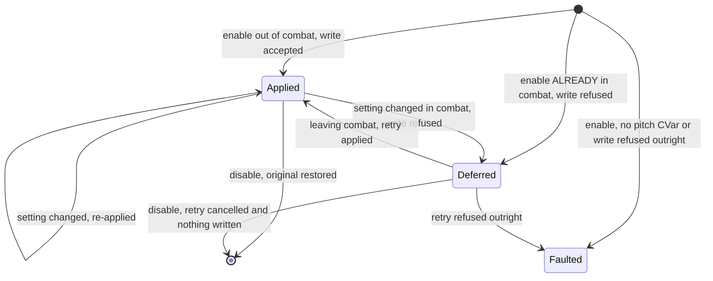

# PersonalAddon — Phase 5 Design
**Date:** September 19, 2026
**API Version:** 1.60.1 (WoW Forever Beta)
**Rescopes:** Phase 5 of `20260919-RoadmapProposal.md` — camera only; NPC interaction work deferred to after v1
**Depends on:** `20260919-Phase01.md` rev 6, `20260919-Phase02.md` rev 5
**Revision:** 2 — incorporates `20260919-Phase05Audit.md`; dispositions in §12

---

## 1. Scope

Raise the camera's vertical pitch so the view shows less floor and more horizon.
One setting, applied on login, restored when switched off.

| Item | Kind |
|---|---|
| CVar capability spike | Investigation |
| CVar steward | Substrate |
| Camera pitch | Feature |

### 1.1 What was removed, and why

The roadmap paired camera pitch with an Immersion-style dialogue replacement. The
dialogue half is **deferred to after v1**, and most of its original scope turned
out to be redundant rather than deferred: the Gamepad UI already navigates every
interface, switches panels with `L2` / `R2`, and handles quest accept, decline and
reward selection. Building any of that would have been reimplementing working
client features, worse.

What remains wanted — the existing interaction frames moved to lower centre, and
gossip text broken into paragraphs — is recorded in the roadmap with its
decisions, and is not this phase.

This is the second time this project has discovered that a planned feature was
already provided. The first was Phase 4's damage meter. The pattern is worth
naming: **on this client, check what the client does before designing what the
addon should do.**

## 2. Non-goals

- **Contextual camera behaviour.** Dynamic Cam changes pitch by situation —
  mounted, indoors, in combat, talking to an NPC. That means state tracking,
  transitions, and a competing-writer problem with the client's own camera. One
  always-on setting was the explicit choice.
- **Any other camera property.** Not distance, not shoulder offset, not
  field of view. One setting.
- **A toggle binding.** Considered and not chosen; the setting is changed through
  config like every other.
- **Persisting the pitch after the feature is disabled.** See §5.2 — leaving a
  modified CVar behind is the failure this phase is most careful about.

## 3. Decisions taken

**Always on, one setting.** Applied once on login and left alone. **No per-frame
work and nothing to race** — the client holds the value once written, so there is
no competing writer of the kind §9.5 of Phase 2 dealt with.

It does have lifecycle states (§6). Revision 1 claimed "no state machine" and then
drew one two sections later; the claim was about there being no *behavioural* state
to maintain, and it was worded as though there were no states at all.

**The CVar steward is built here.** Phase 2 deferred it deliberately: nameplates
wrote no CVars, and building it then would have been an abstraction with one
hypothetical consumer. The camera is its first genuine one, which is the bar §13
of Phase 2 says substrate should clear.

**Restore on disable and on logout.** A CVar is global client state that outlives
the addon. An addon that changes one and leaves it has altered the user's client
permanently, from their point of view invisibly, and they will not know which
addon to blame.

---

## 4. Capability spike

Fifth phase, fifth spike, and by now the justification writes itself: four client
assumptions have been falsified in this project — protected health, protected
power, a withheld combat log, restricted nameplate text — and every one came from
designing before probing.

A `cameraProbe` feature, disabled by default, driven by `/pa probe camera`.

### 4.1 Which camera CVars exist, and are they writable?

```
type CVarVerdict = {
    name:          CVarName,
    exists:        boolean,
    currentValue:  string | Absent,
    writable:      boolean,
    writeRefused:  boolean
}
```

```
# Reports what this client offers for camera pitch, without changing anything
# that is not restored immediately.
# pre:  called out of combat
# post: every probed CVar holds the value it held before the probe ran
# raises: never
function probe_camera_cvars() -> List<CVarVerdict>
```

**Writability is read, not tested.** `GetCVarInfo` reports `isReadOnly` and
`isSecure` alongside the current and default values, which answers the question
without writing anything at all. Revision 1 proposed writing each candidate back
to its own value as a permitted-write test; that is unnecessary for the primary
determination and carries real risk, since a handful of CVars act on being set even
when the value is unchanged.

So the enumeration is **entirely read-only**, and a write-back confirmation exists
as a separate, explicit, one-CVar-at-a-time command. Discovering thirty camera
CVars and writing to all of them to learn what metadata already says would be the
wrong trade.

Candidates are **discovered, not guessed**: the probe enumerates CVars whose
names match camera-related terms and reports them, rather than testing a list I
assembled from memory of a different client. The same approach found
`C_DamageMeter` in Phase 4, where a guessed list would have found nothing.

### 4.2 Is the write combat-protected?

```
type CapabilityVerdict = Available | Withheld | Absent | NotTested

# post: reports whether a camera CVar write is refused while in combat
# raises: never
function probe_combat_protection(
    cvarName: CVarName
) -> CapabilityVerdict
```

`NotTested` is a first-class verdict, as in Phases 2 and 4. This probe *cannot* run
itself out of combat, so an unrun in-combat test must report as unrun rather than
as a pass — the defect Phase 1's gossip spike had.

Some camera CVars are historically combat-protected. If ours is, the steward
needs the deferral path in §5.3; if not, that path is dead weight and should not
be written.

### 4.3 Results

_Unrecorded — run `/pa probe camera` and fill this in before implementing §6._

| Question | Verdict |
|---|---|
| Candidate CVars found | |
| Which control vertical pitch | |
| Writable out of combat | |
| Writable in combat | |
| Value range accepted | |

---

## 5. The CVar steward

```
type CVarName = string
type CVarValue = string

type CVarRecord = {
    name:          CVarName,
    originalValue: CVarValue,
    appliedValue:  CVarValue
}

type CVarSteward = {
    stewardName: string,
    records:     Map<CVarName, CVarRecord>,
    restored:    integer,
    refused:     integer
}

type ApplyOutcome =
      Applied
    | RefusedOutright
    | RefusedInCombat

type RestoreReport = {
    restored: integer,
    refused:  integer,
    absent:   integer
}
```

```
# Records a CVar's original value and applies ours.
# pre:  cvarName exists on this client
# post: on Applied the original is recorded once and the new value is live;
#       on either refusal NOTHING is recorded and nothing was written
# raises: never
function steward_apply(
    steward: CVarSteward,
    cvarName: CVarName,
    newValue: CVarValue
) -> ApplyOutcome

# Writes every recorded original back and forgets it.
# pre:  none
# post: every recorded CVar holds its original value; the steward is empty
# raises: never
function steward_restore_all(
    steward: CVarSteward
) -> RestoreReport
```

`ApplyOutcome` has three cases rather than a success-or-failure pair, because
"refused because the client will never allow it" and "refused because we are in
combat" call for opposite responses: the first is a fault, the second is a retry.
Collapsing them into one failure value is what made revision 1 ambiguous about
what a deferred write returns.

### 5.1 It is the style ledger, for CVars

Deliberately the same shape as Phase 2 §5, and for the same reason: we are
changing state we do not own, so restoring means writing back **what was actually
there**, not what we believe the default to be.

Two properties carried over, both of which Phase 2 learned the hard way:

**Record once.** The original is whatever was there before *we* touched it.
Re-recording on a second write captures our own value and makes restore a no-op —
the bug that permanently alters someone's client.

**Record nothing on a refused write.** A recorded original for a CVar we never
changed makes restore overwrite a value the client was managing. Phase 2's ledger
had exactly this defect and the harness caught it as a phantom entry.

One property it does **not** need: Phase 2's occupancy scoping. Nameplate frames
are recycled across units; CVars are not. A record lives for the enabled session.

### 5.2 Restore on disable, on logout, and the case we cannot cover

Restore runs on `disable()` and again on the client's logout event.

**A crash leaves the CVar modified**, and nothing can be registered to prevent
that. It is the same class of limitation as Phase 1 §5.4's saved-variable flush,
and it is stated here rather than discovered: if the client crashes with the
feature enabled, the camera pitch stays changed until the addon is loaded and
disabled, or the user resets it themselves.

`/pa camera` reports the recorded original alongside the applied value, so the
value to restore by hand is always visible.

### 5.3 The steward reports; the feature retries

Revision 1 said "the steward queues it" in this section and then drew the
`Deferred` state in the *feature's* diagram in §6. Both cannot be true, and the
audit was right to call it. The resolution reverses revision 1:

**The steward has no queue and no lifecycle.** It records, writes, and reports one
of three outcomes. It subscribes to nothing and schedules nothing.

**The feature owns the retry.** On `RefusedInCombat` it holds the intended value,
subscribes to the combat-end event, and applies again when that fires.

This is the better split for a reason that is not merely tidiness. A queue living
inside substrate is a queue the feature cannot see and cannot clear, so
`disable()` would have to reach into the steward to cancel work it did not
schedule. With the retry in the feature, disable clears it the same way it clears
everything else — its own state and its own subscription — and Phase 1 §6.1's
post-condition is satisfied without a special case.

**A pending retry must never outlive the feature.** This is the third time this
project has met the same defect: Phase 2 §7.2's secure post-hook firing after
disable, Phase 4 §7.1's settle read writing after disable, and now a deferred CVar
write applying after disable. The shape is always the same — **work scheduled by a
feature that is no longer running** — and the fix is always the same: the
scheduling feature owns the cancellation, and the test asserts that nothing was
written afterwards.

**If §4.2 says writes are permitted in combat, none of this is written.** Phase 2
§13's lesson applies directly: machinery for a consumer that does not exist is the
mistake this project has already made three times.

---

## 6. The feature

```
type CameraPitch = number

type PitchUnavailable =
      NoPitchCVar
    | WriteRefusedOutright
    | ValueOutOfRange

# Applies the configured pitch.
# pre:  the spike identified a pitch CVar and it is writable
# post: on success the pitch is live and its original is held by the steward;
#       on RefusedInCombat the intended value is held and a retry is armed
function apply_camera_pitch(
    steward: CVarSteward,
    pitch: CameraPitch
) -> Result<ApplyOutcome, PitchUnavailable>
```



`[*] --> Deferred` exists because enabling during combat is routine, not an edge
case — a `/reload` mid-fight is ordinary, and it is the **second** time an audit
has caught me assuming enable happens out of combat, the first being Phase 4's
finding 5. The lesson is now general enough to state: **a feature's enable path
must ask what state the world is in, never assume it starts from rest.**

`Deferred --> [*]` is finding 3: a retry armed for a feature that has since been
disabled would write the CVar after the original was restored, silently undoing
it. Disable cancels the retry and the test asserts nothing was written.

There is no update loop and no timer. The client holds the setting once written,
and the only subscription is the combat-end retry, which exists only if §4.2 says
it must.

---

## 7. Configuration

| Key | Default | Effect |
|---|---|---|
| `pitch` | *from §4.3* | The vertical pitch value |

One key. The default is deliberately left until the spike reports the accepted
range, because a default outside it would fault the feature on first enable for
no reason other than my guessing.

---

## 8. Degradation

| Withheld | Effect | Feature state |
|---|---|---|
| No camera pitch CVar on this client | Nothing to set | **Faulted**, reason named |
| The CVar exists but writes are refused | Nothing to set | **Faulted**, reason named |
| Writes refused only in combat | Applied on leaving combat | Enabled, deferred (§5.3) |
| The logout event is undeliverable | Restore on disable only | Enabled; surfaced once, because the crash-equivalent case widens |

---

## 9. Failure modes

| Failure | Detection | Behaviour |
|---|---|---|
| CVar absent | Existence check at enable | Faulted with the name it looked for |
| Write refused at enable | Result checked | Faulted; nothing recorded, nothing changed |
| Write refused after enable | Result checked per write | Surfaced once; the previous value stands |
| Value out of the accepted range | Client refuses the write | Surfaced with the range from §4.3 |
| Steward records our own value | Prevented by construction | Record-once, as Phase 2 §5 |
| Steward records a refused write | Prevented by construction | Record only after a successful write |
| **Client crashes with the feature enabled** | **Not detectable** | **CVar stays modified. Accepted and documented; `/pa camera` shows the original to restore by hand.** |
| Retry armed, then the feature is disabled | Cancelled by `disable()` | Nothing written; the restored original stands (§5.3) |
| Retry refused outright when combat ends | Outcome checked on retry | Faulted with the reason; no further retries |
| Another addon changes the same CVar | Not detectable | Last writer wins; our restore would overwrite theirs. Single-user addon, accepted. |

---

## 10. Exit criteria

1. §4.3 is filled in and the pitch CVar is named.
2. The camera visibly shows more horizon and less floor with the feature enabled.
3. `/pa set camera pitch <n>` changes it live, without a reload.
4. **Disabling restores the original exactly** — verified by reading the CVar
   before enabling, after enabling, and after disabling.
5. A `/reload` with the feature enabled leaves the pitch applied once, not
   compounded.
6. `/pa camera` reports the original value alongside the applied one.
7. A value outside the accepted range is refused with a message, not silently
   ignored.
8. **Enabling during combat** either applies the pitch or defers it and applies
   it when the fight ends — it does not fault and does not silently do nothing.
9. **A deferred retry cancelled by disable writes nothing.** Enable in combat,
   disable while still in combat, leave combat, and confirm the CVar holds its
   original value. This is §5.3's regression test and the third instance of that
   defect class in this project.
10. Verified with the Gamepad UI active.

Criterion 4 is the one that matters, and criterion 5 is the one most likely to be
skipped: a steward that records on every apply rather than once would, across two
reloads, come to believe our value is the original.

---

## 11. Substrate

**The CVar steward is the second piece of substrate in this project with a real
first consumer at the moment it is written** — the first being nothing, since
`FramePool` waited two phases, `EscapeGuard` is still waiting, and the style
ledger's promised second consumer was cancelled with Phase 3.

It is written here rather than in Phase 2 because Phase 2 wrote no CVars. That
restraint is the whole point of §13 of Phase 2, and this is what honouring it
looks like: the abstraction appears in the phase that needs it, shaped by a real
requirement rather than an anticipated one.

---

## 12. Audit disposition

Against `20260919-Phase05Audit.md`. **All eight accepted.**

| # | Section | Disposition | Resolution |
|---|---|---|---|
| 1 | §4.2 | Accepted | `CapabilityVerdict` defined, with `NotTested` first-class — this probe cannot run its own in-combat half, so an unrun test must not read as a pass. |
| 2 | §5 | Accepted | `CVarSteward`, `RestoreReport` and `CVarRecord` defined. `CVarWriteRefused` is gone, replaced by `ApplyOutcome` — see finding 5. |
| 3 | §5.3, §6 | Accepted | `Deferred --> [*]` added, and §5.3 states the rule. Recorded as the **third** instance of one defect class: work scheduled by a feature that is no longer running. Phase 2 §7.2 and Phase 4 §7.1 were the first two. |
| 4 | §5.3 vs §6 | Accepted, reversed | A real contradiction, and mine. Revision 1 put the queue in the steward and the state in the feature. Resolved **against** revision 1: the steward has no queue and no lifecycle, and the feature owns the retry. Not for tidiness — a queue inside substrate is one `disable()` cannot clear without reaching into code it did not schedule. |
| 5 | §5, §5.3 | Accepted | `steward_apply` returns a three-case `ApplyOutcome`. "Never allowed" and "not right now" demand opposite responses — a fault and a retry — so collapsing them into one failure value was the source of the ambiguity. |
| 6 | §6 | Accepted | `CameraPitch` and `PitchUnavailable` defined, the latter with three cases so a range rejection is distinguishable from a refusal. |
| 7 | §6 | Accepted | `[*] --> Deferred` added. Second time an audit has caught this assumption, so §6 now states the general rule rather than patching the instance. |
| 8 | §3 vs §6 | Accepted | The "no state machine" claim is corrected. What was meant was no per-frame work and no competing writer; what was written denied the lifecycle states two sections later. |

Findings 3, 4 and 5 shared one root cause — the deferral queue's ownership — and
one fix addresses all three, as findings 4, 5 and 13 did in Phase 2.

Beyond the audit: §4.1 changed independently. `GetCVarInfo` reports `isReadOnly`
and `isSecure` without writing anything, so the enumeration is now entirely
read-only and the write-back test is a separate explicit command. Revision 1 would
have written to every camera CVar it found to learn what metadata already says.

---

## Assumptions

- The client exposes camera pitch through a CVar rather than a function-only API.
  §4.1 discovers rather than assumes, and a function-only API would change §5's
  shape but not its purpose.
- Pitch is expressible as a single scalar. If this client models it as several
  interacting values, §7's one key becomes several and §4.3 will say so.
- The user wants the pitch restored when the feature is off. The alternative —
  set it once and leave it — was rejected in §3: an addon that permanently alters
  a client setting and cannot say which addon did it is the failure mode this
  design is most careful about.
- No other addon is managing the same CVar. Single-user addon; last writer wins,
  and that is accepted rather than defended against.
