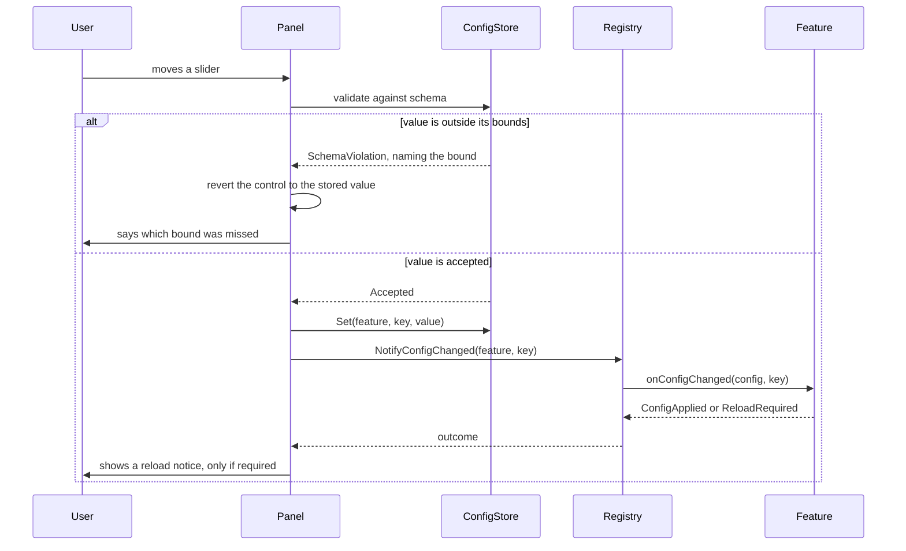

# PersonalAddon — Phase 6 Design
**Date:** September 19, 2026
**API Version:** 1.60.1 (WoW Forever Beta)
**Implements:** Phase 6 of `20260919-RoadmapProposal.md` — Configuration Menu & Polish
**Depends on:** Phases 1, 2 and 4 (Phases 3 and 5 ship nothing)
**Revision:** 3 — spike results in §4.0; colours now curated; audit dispositions in §15

---

## 1. Scope

The last phase before v1. A settings panel in the client's own options menu, a
config schema that makes it possible, and the removal of everything that was only
ever scaffolding.

| Item | Kind |
|---|---|
| Settings API spike | Investigation |
| Config schema | Substrate |
| Internal-feature marking | Substrate |
| Settings panel | Feature |
| Spike removal | Polish |
| Gamepad verification pass | Polish |

### 1.1 What the addon actually ships

Six roadmap features were planned. Four ship, in some form:

| Roadmap item | Outcome |
|---|---|
| `/rl` command | Ships as designed |
| FiveSecondRule tracker | Ships **re-scoped** — a window indicator, not a tick line (Phase 1 §11.1a) |
| Threat-based nameplates | Ships **partially** — bars and aggro colour, no text placement (Phase 2 §4.7) |
| Scrolling combat text | **Replaced** by the damage breakdown panel (Phase 4 §1.1) |
| Minimal player frames | **Dropped by choice** (roadmap, Phase 3) |
| Camera pitch | **Not deliverable** (Phase 5 §4.5b) |
| NPC dialogue replacement | **Redundant** — the Gamepad UI already does it (Phase 5 §1.1) |
| Configuration menu | This phase |

Stated here because the settings panel is where a user meets the addon, and a menu
listing features that do not exist would be the last place to discover that.

## 2. Non-goals

- **Ace3, in any form.** See §3 — this reverses a Phase 1 decision.
- **Exposing all 18 config keys.** Curated; see §7. The rest stay on `/pa set`.
- **Profiles, or per-character settings.** Phase 1 §2 ruled these out and nothing
  since has argued for them.
- **A settings panel for the probes.** They are being deleted (§10).
- **Reworking any feature.** This phase adds a surface over what exists and deletes
  what was scaffolding. If it finds itself changing feature behaviour, something has
  gone wrong.

## 3. Decisions taken

**The client's own Settings API, and no Ace3.** This reverses Phase 1 §3, which
chose "hand-rolled store, AceConfig for the panel only". The reversal is driven by
a finding that did not exist when that decision was made:

> The Gamepad UI navigates every client interface, and switches panels with
> `L2`/`R2`, with no addon involved.

So a panel registered into the client's own options menu is **controller-navigable
for free**, while AceGUI widgets are not built for controller focus traversal at
all. For a controller-first addon, the dependency would have bought less
boilerplate at the cost of the one interface the user could not drive.

It also removes the risk Phase 1 §3 named in the same breath — an Ace3 breakage on
a beta client taking the addon's state with it. The hand-rolled store stays; it was
always the half worth keeping.

**Curated settings.** Feature toggles plus the values worth tuning by eye. A menu
of every variable is a dump, not a design, and several of the 18 keys are tuning
values where a wrong entry degrades performance rather than appearance.

**Spikes deleted.** Each says at its head that it should be deleted once its result
is recorded, and all four results are recorded.

---

## 4. Capability spike

One question, and the last spike this project runs.

```
type CapabilityVerdict = Available | Withheld | Absent | NotTested

type SettingsApiVerdict = {
    registerCategory:   CapabilityVerdict,
    createCheckbox:     CapabilityVerdict,
    createSlider:       CapabilityVerdict,
    createDropdown:     CapabilityVerdict,
    createColourPicker: CapabilityVerdict,
    openToCategory:     CapabilityVerdict,
    legacyFallback:     CapabilityVerdict
}

# post: reports which parts of the client's settings API exist, without
#       registering anything
function probe_settings_api() -> SettingsApiVerdict
```

`createColourPicker` is in the struct because §7 makes the nameplate colour keys
conditional on it, and revision 1 stated that condition while probing nothing that
could answer it.

`legacyFallback` covers the older interface-options registration path. If the
modern API is absent but the legacy one is present, there is still a panel to build
— a different shape, the same content.

Read-only: it checks for the functions rather than registering a throwaway
category, because a registered category is not obviously removable and this addon
should not leave one behind to answer a question.

**The function names are enumerated, not guessed.** The probe lists what the
settings namespace actually contains and then reports which known entry points are
among them. Phase 4 found `C_DamageMeter` by enumeration where a hand-written list
would have found nothing, and Phase 5's camera enumeration surfaced names no
guess would have produced.

**If the API is absent**, the panel is not built and `/pa set` remains the
configuration surface. That is the third option from the question that opened this
phase, and it stays available as the fallback rather than as a separate design.

### 4.0 Results, 2026-09-19

**The full modern API is present.** A panel can be registered as designed.

| Question | Verdict | Entry point |
|---|---|---|
| Register a category | **Available** | `Settings.RegisterAddOnCategory`, plus `RegisterVerticalLayoutCategory` and a subcategory variant |
| Create a checkbox | **Available** | `Settings.CreateCheckbox` |
| Create a slider | **Available** | `Settings.CreateSlider`, with `CreateSliderOptions` for bounds |
| Create a dropdown | **Available** | `Settings.CreateDropdown`, with `CreateControlTextContainer` |
| **Pick a colour** | **Available** | **`Settings.CreateColorSwatch`** — see below |
| Open to our category | Available | `Settings.OpenToCategory` |
| Register a setting object | Available | `Settings.RegisterProxySetting` — the one for settings not backed by a CVar |
| Legacy interface options | Absent | Moot; the modern path exists |

63 functions in the namespace.

**The colour control exists, and the enumeration is the only reason we know.** The
probe's candidate list guessed `Settings.CreateColorPicker` and
`Settings.CreateColourPicker`. Neither exists. The real name is
`Settings.CreateColorSwatch`, and the probe reported `Available` only by falling
through to `ColorPickerFrame` — the client's raw picker dialog, which is a far
worse thing to wire into a settings row than a native swatch.

Three guesses wrong, and the answer sitting in the enumerated list. That is the
third time in this project enumeration has found something a candidate list
missed, after `C_DamageMeter` in Phase 4 and the camera CVars in Phase 5.

**§7's conditional therefore resolves in favour of exposing the colours.**

**`RegisterProxySetting` is the binding to use.** The namespace also carries
`SetupCVarCheckbox`, `SetupCVarSlider` and friends, which bind a control straight
to a CVar. This addon's config lives in its own store, not in CVars, so the
proxy form — which takes a getter and a setter — is the correct one. Reading the
list carefully matters here: the CVar helpers are the more prominent names and are
the wrong ones.

**One question left open.** 63 functions exist and 60 were shown. Whether a
registered category can be *unregistered* is unanswered, and it bears on Phase 1
§6.1: if it cannot, the panel persists after the feature is disabled and that is a
documented exception like the slash command in Phase 1 §10, not a defect. The
probe's row cap is raised so the remaining names appear on the next run.

### 4.1 The last spike deletes itself

This probe is written, run, recorded, and removed in the same phase as the four
before it (§10). Worth noting because it makes the pattern complete: **five phases,
five spikes, and every one of them found something the design would otherwise have
assumed.**

Their record:

| Phase | What the spike prevented |
|---|---|
| 1 | Designing a dialogue replacement that might have been blocked — it was not |
| 2 | Assuming nameplate text was placeable — it is a restricted region |
| 4 | Building an aggregator on an incomplete event source — a sanctioned API existed |
| 5 | Shipping a camera feature that the client accepts and ignores |
| 6 | This one |

---

## 5. Config schema

The config store has types — inferred from each default — but no ranges, no labels
and no notion of which keys are for people. A menu needs all three, and so does
validation.

```
# Used throughout this project's documents for an optional field. Defined here
# because this is the last of them and it was never written down.
type Absent = the absence of a value

type ChoiceOption = {
    value: ConfigValue,
    label: string
}

type SchemaViolation =
      WrongKind         # a boolean where a number was declared
    | BelowMinimum      # carries the bound it missed
    | AboveMaximum
    | NotAChoice        # carries the permitted values
    | NoSchema          # the key exists but declares none

type ConfigKind = Toggle | Number | Choice | Colour | Text

type ConfigSchema = {
    kind:       ConfigKind,
    label:      string,
    description: string | Absent,
    minimum:    number | Absent,
    maximum:    number | Absent,
    step:       number | Absent,
    choices:    List<ChoiceOption> | Absent,
    curated:    boolean
}
```

```
# Validates a value against its key's schema.
# pre:  featureId declares schemaKey
# post: Accepted only when the value is the right kind AND within any declared
#       bounds; the rejection names the bound it missed
function validate_against_schema(
    featureId: FeatureId,
    schemaKey: ConfigKey,
    candidate: ConfigValue
) -> Result<ConfigValue, SchemaViolation>
```

### 5.1 It is validation first, and a menu second

Worth stating, because "add metadata so the menu can render" would be building
substrate for one consumer — the mistake this project has made three times and
recorded each time in a §13.

The schema earns its place on validation alone. Today:

```
/pa set damageBreakdown maximumRows 9999
```

succeeds. The type is right, so the store accepts it, and the nameplate bars become
absurd until someone notices. With bounds declared, that is refused and says why —
and the menu gets its slider ranges from the same declaration rather than a second
list that can drift from the first.

The menu is the second consumer, present at the moment of writing. That is the bar
Phase 2 §13 set, and this is the second time it has been met, after Phase 5's CVar
steward.

### 5.2 Where the schema lives

With the feature, in its registration, beside its defaults. The feature is the only
thing that knows what its key *means* — that `maximumRows` is a row count between 1 and
20, that `sessionType` is one of two named sessions.

The schema declares *semantics*, not widgets: `Number` with a range, not "slider".
Mapping a kind to a control is §9's business, and a feature that named a widget
would be a feature that had to change if the panel toolkit did — which is exactly
what happened to the panel toolkit in §3.

---

## 6. Internal features

Eleven features are registered. Five are probes, two are deliberately-broken test
scaffolding, and four are the addon. A settings menu must show the four.

```
# post: a feature marked internal is excluded from the settings panel and from
#       the default /pa status listing, but remains addressable by name
function is_internal(
    featureId: FeatureId
) -> boolean
```

Declared in the feature's registration, defaulting to false so a new feature is
visible unless it says otherwise. Internal is about **audience, not capability**:
an internal feature is still enabled, disabled and configured the same way, and
`/pa status all` still lists it. It simply is not offered to someone browsing
settings.

`faultProbe` and `enableFailProbe` are **kept** rather than deleted with the
spikes. They are forty lines, they are the only way to verify Phase 1 §6.1's
isolation contract against the live client, and a future client patch is exactly
when that contract would quietly break. Marked internal.

---

## 7. The curated surface

Four features, their toggles, and eleven values.

| Feature | Exposed | Kind |
|---|---|---|
| **All four** | Enabled | Toggle |
| FiveSecondRule | `lineWidth` | Number 1–6 |
| | `lineAlpha` | Number 0.1–1.0 |
| Nameplates | *(no sizing keys)* | removed in 1.0.0 — see Phase 2 §4.9 |
| | `aggroColouring` | Toggle |
| | `yieldSelectedTarget` | Toggle |
| Damage breakdown | `sessionType` | Choice: Current, Overall |
| | `maximumRows` | Number 1–10 |
| | `panelAlpha` | Number 0.1–1.0 |
| | `anchorOffsetX` | Number −300–300 |
| | `anchorOffsetY` | Number −300–300 |
| Nameplates | `colourOnPlayer` | Colour — it is on you |
| | `colourOnGroup` | Colour — a party member or your pet has it |
| | `colourElsewhere` | Colour — neither |

The three colours join the curated list because §4.0 found a native swatch
control. Revision 1 excluded them on the grounds that a hex field in a menu is
worse than the slash command, which was right about hex fields and wrong about
what the client offers.

Left on `/pa set`, deliberately:

| Key | Why |
|---|---|
| `nameplates.sweepInterval` | A performance tuning value. Lowering it is a frame-rate decision dressed as a preference |
| `damageBreakdown.inCombatRefreshSeconds` | Same, and the default of 0 is the right answer for nearly everyone |
| `damageBreakdown.showWhenEmpty` | Marginal, and the behaviour is obvious enough not to need discovering |
| ~~`nameplates.colourOnPlayer` / `OnGroup` / `Elsewhere`~~ | **Now exposed** — §4.0 found `Settings.CreateColorSwatch`, so the condition is met and these move into the curated list below |

### 7.1 A dead key to delete, not to hide

`nameplates.nameOffsetY` **is removed entirely**, not merely left off the menu.

Phase 2 §4.7 established that this client treats nameplate text as a restricted
region, so the key has done nothing since it shipped. A setting that exists and has
no effect is worse than one that is absent: it invites the user to change it, then
to conclude the addon is broken when nothing happens.

Removing it exercises the config store's step-4 prune (Phase 1 §5.2), which will
drop it from saved variables with a notice on the next login. That path has been
tested since Phase 1 and has never run against a real removal.

---

## 8. Dead-key removal is the store's first real prune

Revision 1 titled this "first real migration" and then said in its first line that
no migration is involved. The prune and the migration chain are different
mechanisms and the header named the wrong one.

**No migration is needed.** Step 4 of hydration (Phase 1 §5.2) drops any persisted
key that no feature declares, which is exactly what `nameOffsetY` becomes once it
is removed from the code. The migration chain is for keys that change *shape*; this
key changes to not existing.

What makes it worth its own section is that **the prune has never run against a
real removal.** It has been exercised by tests since Phase 1 and by nothing else.
The exit criteria therefore check that the notice appears, not merely that the key
is gone — a silent prune and a prune that never ran look identical from the
outside.

---

## 9. The settings panel

```
# Builds the panel from the registry and the schema, and registers it.
# pre:  §4 reported the settings API available; every curated key has a schema
# post: the panel reflects current config; changing a control writes through the
#       config store and notifies the feature, exactly as /pa set does
# raises: never — a control that cannot be created is skipped and surfaced once
function build_settings_panel(
    features: List<FeatureId>,
    schema: Map<FeatureId, Map<ConfigKey, ConfigSchema>>
) -> Result<PanelHandle, PanelUnavailable>

type PanelHandle = {
    categoryId:      CategoryId,
    controlCount:    integer,
    skippedControls: List<ConfigKey>
}

type PanelUnavailable =
      SettingsApiAbsent      # section 4 found neither the modern nor legacy path
    | CategoryRefused        # registration itself failed
    | NoCuratedKeys          # nothing to show, which would be a schema error
```

`skippedControls` is on the handle rather than being a failure: a control type the
client will not create costs that one row, not the panel (§12).

**The panel writes through the same path as `/pa set`.** It calls the config store
and then `Registry.NotifyConfigChanged`, which is what already applies a change
live. It does not touch features directly, and it gains nothing that the slash
command does not have.

That matters for one reason: `onConfigChanged` may return `ReloadRequired` (Phase 1
§6.2), and the panel is the caller that finally makes that return value worth
having. Phase 1 chose a returned value over a registry flag on the argument that
"the caller is the party that knows how to tell the user". This is that caller.



**A rejected value reverts the control.** Leaving a slider showing a value the
store refused would put the panel and the config out of step, and the panel is the
thing the user believes. A control whose range came from the same schema should not
be able to produce an out-of-bounds value at all — so if this path ever fires, the
schema and the control disagree, and that is worth seeing rather than smoothing
over.

### 9.1 The panel subscribes to nothing

Revision 1 claimed the panel "shows a feature as faulted rather than as off" and
described no mechanism for learning about a fault. The audit was right to call it,
and the fix is to **remove the requirement rather than add the mechanism.**

The panel reads feature state from the registry when it is opened, and again after
any action it takes. It does not subscribe to fault notifications.

What that costs: a feature that faults while the panel sits open and untouched is
shown as enabled until the user interacts or reopens. That is a stale reading of at
most one idle panel, and the fault has already announced itself in chat by then.

What it buys: **no teardown path, because there is nothing to tear down.** This
project has now met the same defect four times — Phase 2 §7.2's post-hook firing
after disable, Phase 4 §7.1's settle read writing after disable, Phase 5 §5.3's
deferred retry applying after disable, and this. Three of those were fixed by
adding cancellation. This one is fixed by not scheduling anything, which is the
only version of that fix that cannot regress.

---

## 10. Removal checklist

Mechanical, and listed so none of it is half-done:

- Delete `Spikes/GossipProbe.lua`, `NameplateProbe.lua`, `MeterProbe.lua`,
  `CameraProbe.lua`, and the settings probe from §4.
- Remove the `Spikes` entries from the `.toc`, and the `Spikes` folder.
- Remove `/pa probe` routing from the debug command.
- **Keep** `PersonalAddonProbeLog` declared in the `.toc`, and clear its contents
  once on load. Revision 1 said to remove the declaration *and* clear the data,
  which cannot be done in that order: an undeclared saved variable is not loaded
  into the addon's environment, so there is nothing to clear. Declared-and-empty
  costs nothing; the declaration comes out after v1, once a login has written an
  empty table.
- Mark `faultProbe` and `enableFailProbe` internal (§6); do not delete them.
- Version to `1.0.0`.

Every spike's findings are already in the phase documents. That is the whole reason
they can go.

---

## 11. Gamepad verification

The roadmap's final pass, and the criteria that matter for a controller-first addon.

Each shipped feature, driven only with the controller:

1. The settings panel opens, every control is reachable, and each one changes what
   it claims to.
2. The FSR indicator is visible and correct while playing a mana user.
3. Nameplates colour correctly in a group fight.
4. The damage breakdown panel is readable at its default position, and is not
   covered by any interface the Gamepad UI opens.

Point 4 is the one most likely to fail and is easy to miss: the panel anchors above
the player frame, and the Gamepad UI's own overlays may occupy that space.

---

## 12. Failure modes

| Failure | Detection | Behaviour |
|---|---|---|
| Settings API absent | §4's probe at enable | No panel; `/pa set` remains, surfaced once |
| One control type unavailable | Creation result checked | That control is skipped, the rest of the panel builds, surfaced once |
| A curated key has no schema | Checked when the panel builds | That key is skipped and named; the panel is not abandoned for one bad row |
| A value outside its range | `validate_against_schema` | Refused, naming the bound — from the menu and from `/pa set` alike |
| `onConfigChanged` returns `ReloadRequired` | Return value | The panel says so; the value is already stored |
| `nameOffsetY` still in saved variables | Prune at step 4 | Dropped with a notice (§7.1) |
| Probe saved variable left behind | Cleared once on load | Removed; the declaration alone would not do it |
| A feature faults while the panel is open | Read on open and after each action (§9.1) | Reflected next time the panel is opened or touched; never stale without the user having done something |

---

## 13. Exit criteria

1. The panel appears under the client's own AddOns settings and every curated
   control works.
2. Every control is reachable and operable **with the controller only**.
3. A change made in the panel takes effect without a reload, or says a reload is
   needed — matching what `/pa set` does for the same key.
4. A value outside its range is refused with the bound named, from both surfaces.
5. No probe feature appears in the panel.
6. `nameOffsetY` is gone from the code and pruned from saved variables with a
   notice on first login after the upgrade.
7. `PersonalAddonProbeLog` is gone from the saved variables file, not merely
   undeclared.
8. The `Spikes` folder does not exist and the addon loads clean.
9. The four shipped features behave exactly as they did before this phase.
10. Version reads `1.0.0`.

Criterion 9 is the one to hold this phase to. It adds a surface and deletes
scaffolding; if any feature behaves differently afterwards, the phase overreached.

---

## 14. Substrate, final tally

Six pieces were built ahead of need. The record, since three of the six were
argued for in documents that also criticised premature abstraction:

| Piece | Built in | First consumer | Verdict |
|---|---|---|---|
| `Isolation` | 1 | Phase 1 | Immediate |
| `ConfigStore` | 1 | Phase 1 | Immediate |
| `Dispatch` | 1 | Phase 1 | Immediate |
| `FramePool` | 1 | **Phase 4** | Two phases early, on a claim about Phase 2 that was wrong |
| `EscapeGuard` | 1 | **none yet** | Five phases unused; its consumer is the deferred gossip work |
| `StyleLedger` | 2 | Phase 2 | Immediate, but its *second* consumer was cancelled with Phase 3 |
| `CVarSteward` | 5 | Phase 5's probe | Immediate, and then the feature it was for turned out undeliverable |
| `ConfigSchema` | 6 | Phase 6 | Immediate, two consumers (§5.1) |

The honest summary: **the three pieces written for an anticipated consumer all
missed.** `FramePool` waited two phases, `EscapeGuard` is still waiting, and the
style ledger's promised second consumer was cancelled. The pieces written for a
consumer that already existed all landed.

The test that survives is the one in Phase 2 §13, tightened by Phase 5: a consumer
whose design is written down is not enough — Phase 3's was written down and
cancelled. **A consumer that exists at the moment of writing** is the only bar that
has not produced a miss.

---

## 15. Audit disposition

Against `20260919-Phase06Audit.md`. **All nine accepted.**

| # | Section | Disposition | Resolution |
|---|---|---|---|
| 1 | §4 | Accepted | `CapabilityVerdict` defined, with `NotTested` first-class as in Phases 2, 4 and 5. |
| 2 | §4, §7 | Accepted | `createColourPicker` added to the verdict. §7 stated a condition on a probe that could not answer it. `legacyFallback` added at the same time, since the same struct should say whether a fallback path exists. |
| 3 | §5 | Accepted | `ChoiceOption` and `SchemaViolation` defined, the latter carrying the bound it missed. `Absent` is defined here too — it has been used as the optional marker across every document in this project and was never written down. |
| 4 | §8 | Accepted | A real self-contradiction: the header said migration, the body said prune. Retitled, and the section now says why a *prune* deserves its own section — it has never run against a real removal. |
| 5 | §9 | Accepted | `PanelHandle` and `PanelUnavailable` defined. `skippedControls` sits on the success handle, because one uncreatable control costs a row, not the panel. |
| 6 | §9 | Accepted | An `alt` branch added, plus the rule that a rejected value reverts the control — and the note that this path firing at all means the schema and the control disagree. |
| 7 | §10 | Accepted | The sharpest finding. Removing the declaration and clearing the data cannot both be done: an undeclared saved variable is never loaded, so there is nothing to clear. The declaration stays for v1 and comes out afterwards. |
| 8 | §12 | Accepted, requirement removed | §9.1 is new. The fix is not to add a fault-notification mechanism but to drop the claim that needed one: the panel reads state on open and after each action, and subscribes to nothing. |
| 9 | §12 | Accepted, moot by construction | No subscription means no teardown. Recorded as the fourth instance of "work outliving the thing that scheduled it", and the first one fixed by not scheduling — the only version of that fix which cannot regress. |

Findings 8 and 9 share one resolution, as findings 3/4/5 did in Phase 5 and 4/5/13
in Phase 2. The pattern in all three cases was the same: a contradiction and a leak
that both came from one structural choice.

---

## Assumptions

- The client's settings API is the modern `Settings.*` registration rather than the
  legacy interface-options path. §4 discovers which; the panel's shape changes with
  the answer, its content does not.
- The Gamepad UI drives a registered settings category the same way it drives the
  client's own panels. This is the assumption the whole §3 reversal rests on, and
  criterion 2 is what tests it — if it fails, Ace3 would not have been better, and
  `/pa set` is the fallback.
- Removing `nameOffsetY` is safe because it has never done anything. If a later
  client patch un-restricts nameplate text, it comes back as a new key with a
  schema, not as a resurrection.
- No further client surprises. Five phases have produced five, so this is the
  assumption most likely to be wrong — which is why §4 is a spike rather than an
  assertion.
