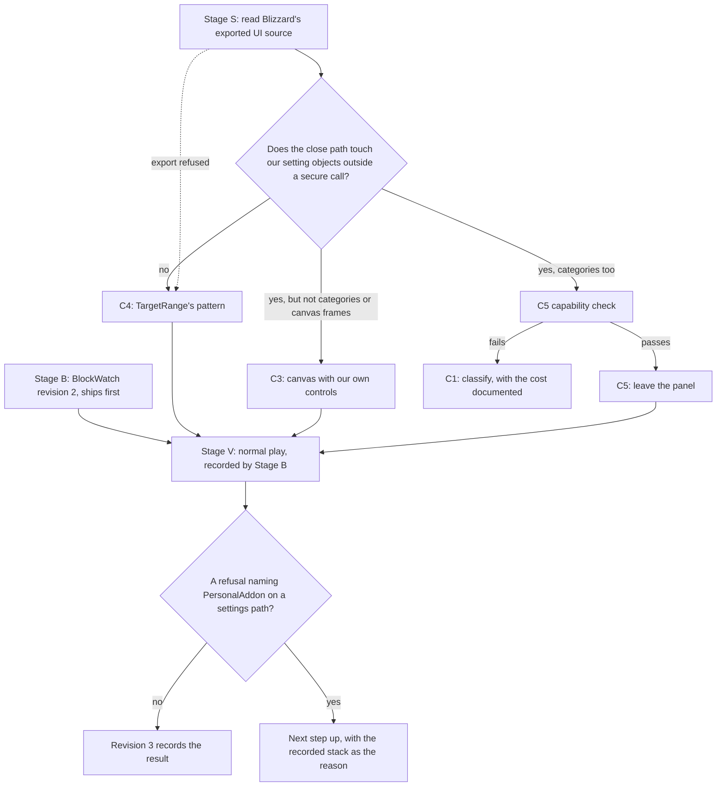
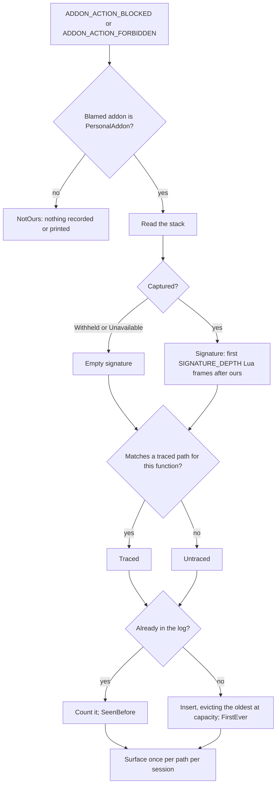

# PersonalAddon — Patch 01: `IsUserOAuthed()` refused with this addon named
**Date:** September 24, 2026
**API Version:** 1.60.1 (WoW Forever Beta), client patched 2026-09-24 19:07 local
**Reported by:** BlockWatch, in the session of 2026-09-24 19:14:51–19:22:31
**Depends on:** Phase 6 §9 (settings panel); commit `ff43442` (the `ExitWithCommit()` trace recorded in `Core/BlockWatch.lua`)
**Revision:** 5 — §0.5's confirmation run (§0.5.1): §0.2's defect confirmed; the refusal moves between addons, and removing our page would only stop naming us. Revision history at the end.

---

## 0.5 Reopened (2026-09-27)

**§0.3's cost statement is wrong, and the verification this patch closed on has
failed.** BlockWatch recorded five new refusals on 2026-09-26, in sessions where the
Phase 7 build was running and Options was used with the controller:

| Local time | Refused | Root of the stack | Path to the refusal |
|---|---|---|---|
| 23:35:42 | `RunBinding()` ×2, `DescendStop()` | `GAMEPADACTIONBUTTON8`, a gamepad action-button press | `PressActionButton` → `MainActionBarFrame.lua:294` / `:297` |
| 23:37:24 | `SpellStopCasting()`, `SpellStopTargeting()`, one unnamed call | `InputFunctionBinding.lua:31`, a gamepad press on the Options close button | `SmartNavigation` → `SettingsPanel:Close` → `ExitWithCommit` → `TransitionBackOpeningPanel` → `ToggleGameMenu` → `securecallfunction` → `Game.lua:7` / `:29` |

All `Forbidden`, attempt `unknown`, out of combat. None of this addon's code sits
between the root and the refusal on any of the five stacks: the taint came from
state, not from our code running.

**Most likely cause: §0.2's defect, reaching further than recorded.** Options drew
this addon's settings page (the user was checking Phase 7's new colour controls), and
the Gamepad UI rebuilt its navigation state inside that execution. Controller presses
that later ran through that state were refused. The 23:35 session also recorded the
traced `SetPreferredGamepadInteractTarget()` refusals first, the defect's known
signature.

**What this contradicts.**

- §0.3: "No gameplay breakage has been observed since C4." A refused action-button
  press and a refused stop-casting are gameplay breakage.
- `20260924-Patch01Implementation.md` lists no refusal of `SpellStopCasting()` or
  `SpellStopTargeting()` after Part 2 as a verification criterion, and says a
  controller press doing nothing after Options closes means Stage V has failed.

**Not the cause, as far as the evidence goes.** Phase 7's quest-watch probe was
enabled in both sessions. It made no calls of its own. Its only activity before these
refusals was receiving watch-list events with no quest attached. It is deleted
(Phase 7 §6.4). One reason it cannot be ruled out entirely: Phase 7 found that
`QUEST_WATCH_LIST_CHANGED` is delivered inside the call that raises it, so the
probe's handler could run inside Blizzard's call (README rules 1 and 9).

**Open disposition.** §0.3 kept the settings page because removing it "would likely
only move the blame to another addon" and gives up controller-navigable options. With
gameplay presses now refused, that trade needs deciding again. The options:

| Option | Cost |
|---|---|
| Keep the page; `/reload` after using Options | A manual step, forgotten sooner or later |
| Remove the page; `/pa set` only | No controller-navigable settings |
| C5 from §8.2: our own options frame outside Blizzard's panel system | A new feature, needing the controller-input check first |

**To confirm the cause before deciding:** `/pa blocked clear`, then play one session
without opening Options, then one that opens this addon's page and closes it with the
controller. Refusals only in the second confirm §0.2's defect. Refusals in the first
mean a different cause, which needs its own trace.

### 0.5.1 Confirmation result (2026-09-27)

**§0.2's defect is confirmed, and the blame is not ours to keep or to give away.** The
sessions ran after `/pa blocked clear` at 12:26, with Phase 8's two new features switched
off. Evidence: BugGrabber's saved log (`!BugGrabber.lua`, which keeps every addon's
refusals with time and stack) and Chatify's saved chat.

| Session (BugGrabber) | Options used | Refused, and blamed on | Path |
|---|---|---|---|
| 34, the first | No | Nothing, for any addon | — |
| 35 (12:29:35), the second | Yes, closed with the controller | `SetPreferredGamepadInteractTarget()` ×3, **BugSack** | `SmartNavigation` `MouseUp` → `SettingsPanel:Close` → `ExitWithCommit` → `HideUIPanel` → `FrameHidden` → `DeactivateBindingGroup` → `UpdateInteractIcons` |

`/pa blocked` read 0 records in both sessions, correctly: BlockWatch records only
refusals that name this addon.

Earlier the same day, BugGrabber recorded the same refusal on three other paths:

| Time | Blamed on | Path into the binding stack |
|---|---|---|
| 09:33:43 | Questie | Questie's tracker opened the quest log: `ShowUIPanel` → `FrameShown` → `ActivateBindingGroup` |
| 10:37:28 | Chatify | A chat message sent with the controller: `SendText` → `FloatingChatFrame:SetGamepadFocus` → `FrameShown` |
| 11:25 to 12:19:35, ×8 | PersonalAddon | The Options-close path above, in sessions where Options was used to place the new Phase 8 panels |

What it establishes:

- **Refusals only in the Options session**, on §0.2's path, confirm the defect by this
  section's own test.
- **The blamed addon is whichever taint the Gamepad UI's binding stack last carried.** With
  this addon's page drawn and closed, BugSack was named. Removing this addon's page would
  not remove the refusal; it would only stop naming us. §0.3 predicted this; it is now
  observed.
- **Four addons reach the same refusal by three routes.** It is not specific to settings
  pages: any addon code that runs near a panel show or hide can taint that stack.
- **No gameplay press was refused in the recorded sessions.** Only
  `SetPreferredGamepadInteractTarget()` appears after 11:49. The 2026-09-26 refusals of
  `RunBinding()` and the others did not recur where the record reaches. That does not rule
  them out: BugGrabber keeps only the first refusal per addon per session, and three
  BlockWatch records were cleared unread at 12:26.

**The open disposition, with this evidence.**

- Removing the page gives up controller-navigable settings, and every one of these
  refusals would still happen, under another addon's name.
- The page's cost is the §0.3 one: a stale interact icon until `/reload`, with the
  2026-09-26 gameplay refusals as the known worst case.
- The decision stays the user's. The evidence now favours keeping the page, with a
  `/reload` after using Options, and reporting the defect to Blizzard with the four paths
  above.

## 0. Resolution (2026-09-26)

**Closed as a Blizzard defect, mitigated on our side.** C4 shipped in `488abbd`
(`20260924-Patch01Implementation.md`). What remains cannot be fixed from addon code.

### 0.1 What C4 fixed

Blizzard's settings layer is hardened against addon taint, so taking our code off it
worked:

- Addon settings are created through a secure `AttributeDelegate` from
  `CreateSecureMixinCopy` mixins (`Blizzard_SettingsInbound.lua:9–10, 112–121`).
- The commit and revert loops call each setting through `securecallfunction`
  (`Blizzard_SettingsPanel.lua:264–282, 346–378`).
- Value-changed callbacks are delivered by `SettingsCallbackRegistry:TriggerEvent`, which
  isolates each one (`Blizzard_Setting.lua:261–269`).

Since C4, the block log has recorded no refusal on the Options close path, and no action or
targeting refusals (`UseAction()` and the rest in Implementation §2.1).

### 0.2 Root cause of what remains

Blizzard's Gamepad UI (Alpha) keeps global mutable state, and writes it from whatever
execution happens to trigger it:

1. `SmartNavigation.lua:203–209` post-hooks the global `CreateFrame`. For any frame created
   inside a panel SmartNavigation tracks, such as Options, it rebuilds that panel's
   navigation state (`UpdateParent` → `RefreshButtonGroups`, lines 1627–1656) in the
   caller's execution. When Options draws an addon's settings page, that execution has
   touched the addon's objects, so the rebuilt state carries the addon's taint.
2. Focus changes then add and remove binding sets on one global stack. Mouse clicks do
   this (`FrameControlsManager.lua:239, 603–695`), as does SmartNavigation's own hide
   (`SmartNavigation.lua:230–240, 269–294`). The stack lives in `InputBindingManager.lua`
   (`bindingSetStack`, `currentCoreBindingActive`, lines 38–64, 133–191), and a write
   made while tainted stays tainted.
3. `MainActionBarFrame.lua:237–257` (`UpdateInteractIcons`) reads that stack and calls
   `SetPreferredGamepadInteractTarget` (`HasRestrictions`). That is its only call site in
   the entire UI. The call is refused in the name of whichever addon's taint the state
   carries.

Evidence:

- **Block log, 2026-09-26 20:38.** Three refusals, all with Options open and no
  PersonalAddon setting changed. Two were rooted in `GLOBAL_REGION_MOUSE_DOWN`, with no
  frame of ours between root and refusal.
- **BugGrabber.** BugSack was named for the same refusal at 18:07.

Any addon with a Settings page is exposed. The exact tainted value is inferred from the
call paths and source, not taken from a taint log.

### 0.3 Cost and disposition

- **Cost:** the gamepad interact icon can go stale until something refreshes it or the
  user reloads. No gameplay breakage has been observed since C4.
- **Not done:** removing our Settings page. It would likely only move the blame to
  another addon, and it would give up the controller-navigable options.
- **Suggested report to Blizzard:** "Gamepad UI taint: drawing any addon's Settings page
  taints SmartNavigation/InputBindingManager state; UpdateInteractIcons then calls
  SetPreferredGamepadInteractTarget, which is blocked and blamed on that addon. Repro:
  open an addon page, click world."
- **Optional, cosmetic:** BlockWatch could classify every refusal of
  `SetPreferredGamepadInteractTarget()` as this known issue, because it has one caller,
  and reword `TRACED_EXPLANATION`. Today a one-frame path prints as a red `BLOCKED` line,
  and the text still blames closing Options.

### 0.4 Stage S answers

The export was run late, on 2026-09-26:

| Question | Answer |
|---|---|
| S-Q1 | The close loop reaches each setting through `securecallfunction`; it does not touch categories |
| S-Q2 | AddOn settings read and write the variable table inside Blizzard's secure mixin copy; proxy settings call the addon's getter and setter |
| S-Q3 | The callback is delivered through `SettingsCallbackRegistry` → `secureexecuterange` and is isolated |
| S-Q4 | `IsUserOAuthed` is called in `Social.lua:293–341` (the Social page's Discord options, the likely source of the 2026-09-24 refusal), `Blizzard_GuildControlUI.lua:312`, and `ChatFrameEditBox.lua:176` (only for the `GUILD_DISCORD` chat type) |

---

## 1. Verdict

`IsUserOAuthed()` is **`C_Discord.IsUserOAuthed()`**, the protected query behind the
client's Discord account and guild linking. PersonalAddon does not call it: no file
references `C_Discord`, and BlockWatch recorded no deliberate attempt in flight
(`'unknown'`). This is **taint spread**: a Blizzard execution became insecure because of
this addon, went on to ask the Discord question, and the client refused it with this
addon's name attached.

| Claim | Confidence |
|---|---|
| Taint spread, not a call this addon makes | Established (§2) |
| The carrier is this addon's proxy settings, which Blizzard's settings panel calls directly — within that execution, or through state that execution left tainted | About three in four (§3.2) |
| The Blizzard function that made the refused call | Unknown; no candidate above one in two |

Revision 1 answered that uncertainty by reproducing the refusal under the client's taint
log. Revision 2 withdraws that (§5.1). Instead:

- The patch is chosen by reading Blizzard's shipped UI source, which refuses nothing
  (§6.2).
- The refusal recorder verifies it during normal play (§6.3).

**Severity: probably low, not yet established.** A refused call returns nothing, so the
Blizzard code that asked sees "not authorised" for that one execution. With the Discord
link unused, nothing visible changes. Two things weigh against dismissing it:

- In retail's UI, Blizzard's default response to a forbidden call is a dialog naming the
  addon and offering to disable it. It has not appeared here only because BugGrabber
  unregisters that handler (`!BugGrabber/BugGrabber.lua:558–563`).
- It is the second protected call reached this way in five days. The first one's trace
  shows the taint outliving the execution that caused it (§2.3, §4 R7).

**Interim:** a `/reload` after using the settings panel discards any state the panel left
tainted.

---

## 2. Evidence

### 2.1 What the function is

- `WowB.exe`, patched 19:07:41 today, registers `IsUserOAuthed` inside the `C_Discord`
  table. Its neighbours there are `Authorize`, `RefreshAuth`, `GuildLink`, `GuildUnlink`,
  `GetGuildLinkStatus`, `IsGuildChannelLinked`, `SetGuildSetting` and
  `GetDisplayNameType`. Found by string search of the binary.
- warcraft.wiki.gg's *Patch 12.1.0/API changes* page lists `C_Discord.IsUserOAuthed` as
  new in retail 12.1.0. It lists Discord support added to `ChatFrameUtil` and to the
  guild-control UI at the same time. This client is built from the Mainline tree: the
  binary embeds `…\Mainline\Source\Ui\…` build paths.
- Blizzard's 12.1 announcement places the Discord surfaces at:
  - **Options → Social → "Enable Discord Functionality"**, with a Display Name dropdown.
  - **Guild & Communities → Roster → Guild Settings → Discord Settings**.
  - A Discord icon on guild chat bridged from Discord.

The first surface matters most. The Discord switch lives in **the same settings panel**
that calls this addon's code directly (§3.1).

### 2.2 Timeline

Sources:

- BugGrabber's saved variables: epoch times, converted to local.
- Chatify's saved chat history (`ChatifyHistoryDB`): message order, to the minute.
- The `.bak` and current saved-variable files, and file write times.

| Local time | Event | Source |
|---|---|---|
| 19:07:41 | Client patched | `WowB.exe` write time |
| 19:10:20 | Login | Character-list and glue saved-variable write times |
| 19:12:45 | Edit Mode layout saved. Nothing refused in this session | `edit-mode-cache-account.txt`; BugGrabber holds nothing for this session |
| 19:14:51 | Reload | `.bak` write times |
| 19:15:47 | `SetPreferredGamepadInteractTarget()` **forbidden**, via `SettingsPanel:Close() → ExitWithCommit()`: the traced path | BugGrabber, with stack |
| 19:16:01 | Blizzard Lua error: `GameTooltip.lua:381` indexes the nil global `GamepadMode` | BugGrabber; Blizzard's defect (§11) |
| After the last 19:16 message, before the first 19:17 message | **`IsUserOAuthed()` refused**, attempt `'unknown'` | Chatify history, line 187 |
| 19:22:31 | Exit | Saved-variable write times |

Saved variables that changed between 19:14:51 and 19:22:31:

- PersonalAddon `damageBreakdown.anchorOffsetX` went from 81 to 83, and `anchorOffsetY`
  from 8 to −27. This was most likely through this addon's proxy sliders.
- TargetRange `anchorMode` went from 1 to 3, and `customX` / `customY` were added.
- There was no Edit Mode save.

So the "EDIT UI" in the report was most likely Options → AddOns, not Edit Mode.

### 2.3 A separate execution, not necessarily a separate cause

BlockWatch prints synchronously, from inside the refusal. Had `IsUserOAuthed()` been
refused in the 19:15:47 execution, its line would sit directly after the traced one.
Instead, 25 other chat lines arrived between them (Chatify lines 161 and 187). **The
19:15:47 close ran its whole path without asking the Discord question.**

That rules out "the traced path, one call further on". It does not rule out the same
cause. The 2026-09-19 taint log (`BlizzardBugLogs/taint.log`) shows one tainted settings
close producing four refusals inside the close itself. It then shows seven more across
five later executions over the next six seconds: two menu keypresses, a Game Menu button,
and the quit dialog.

Every one of those later executions began after the close had finished, and every one was
still tainted by PersonalAddon. The log attributes most of them to
`PromptedBindingFooter.lua:369` and `:380`. That is the gamepad footer, which also ran
inside the tainted close (it appears in the close's own stacks) and so wrote its state
while tainted. **Taint written into Blizzard's state outlives the execution that wrote
it.**

### 2.4 Why no stack exists

Three recorders were running. Each missed it for a different reason:

| Recorder | Why it has nothing |
|---|---|
| BugGrabber | Records only the **first** blocked action per addon per session (`badAddons`, `BugGrabber.lua:549–556`). The first was `SetPreferredGamepadInteractTarget()` at 19:15:47. |
| The client's taint log | `taintLog` was 0. The newest `Logs/taint.log` dates from 2026-09-19. |
| BlockWatch | Keeps no stack, drops the event name, and holds its tally in memory. After exit, the only surviving record was Chatify's chat history, which captured the line incidentally. |

The third is this addon's to fix (Stage B, §6.1).

### 2.5 The other installed addons

- **TargetRange** registers with the seven-argument
  `Settings.RegisterAddOnSetting(category, variable, variableKey, variableTable, type, name, default)`
  and applies changes in `setting:SetValueChangedCallback`. Blizzard stores the value
  itself, and TargetRange's code runs only in that callback; how the callback is
  delivered is S-Q3 (§6.2). Blizzard also calls TargetRange directly in one other place:
  its dropdowns' option generators, when a dropdown is built. **This is the shape C4
  adopts (§7).**
- **Chatify** hooks `AddMessage` with `hooksecurefunc` and filters chat through a
  message-event filter. Taint entering the chat path from that filter is blamed on
  Chatify.
- **PersonalAddon's getters and setters are called directly on every read and write of a
  value.** That includes the close-time commit loop the 2026-09-19 trace runs through.
  They are the closures passed to `Settings.RegisterProxySetting` in
  `Features/SettingsPanel.lua`. No other installed addon puts that much of its own code
  on the settings panel's stack.

---

## 3. Diagnosis

### 3.1 The mechanism (established)

Two terms used from here on:

- An *execution* is one uninterrupted run of Lua started by the client: a click, a
  keypress, an event.
- The *carrier* is the call or variable read through which this addon's taint enters a
  Blizzard execution.

```mermaid
sequenceDiagram
    participant User
    participant Panel as Blizzard settings panel
    participant Ours as Our proxy getter or setter
    participant State as Blizzard state
    participant Later as Blizzard code, later or in a later execution
    participant Client

    User->>Panel: opens, changes, closes
    Panel->>Ours: calls our closure directly, not through a secure call
    Ours-->>Panel: returns; the execution is now attributed to PersonalAddon
    Panel->>State: writes gamepad, menu or panel state while tainted
    Panel->>Later: continues in the same execution
    User->>Later: a later action reads the state written above
    Later->>Client: calls a function
    alt the function is protected
        Client-->>Later: refused; returns nothing
        Client->>Client: raises ADDON_ACTION_FORBIDDEN or _BLOCKED naming PersonalAddon
    else the function is not protected
        Client-->>Later: normal return
    end
```

`ff43442` moved this addon's apply work out of Blizzard's stack. That was correct, and it
leaves this mechanism intact. As that commit's own note in `Core/BlockWatch.lua` says, the
call into our closure is the taint, whatever the closure does.

So **every protected call Blizzard places downstream of a settings interaction becomes a
new refusal with our name**. "Downstream" includes later executions that read state the
tainted one wrote. Today's patch added, or newly exposed, one such call.

### 3.2 Candidate paths

| ID | Path | For | Against | Distinguished by |
|---|---|---|---|---|
| H1 | **One settings-panel execution.** Our getter or setter runs, then the same execution evaluates a Discord-gated Social control: a commit, revert or defaults loop, a search, or a category refresh | The Discord switch is in this panel; the user was in it; our closures run on every value access | The 19:15:47 close did not reach it, so it would have to be conditional | `IsUserOAuthed` called from `Blizzard_Settings*` (S-Q4); a recorded stack through the settings panel |
| H2a | **The Game Menu the close returns to.** `ExitWithCommit → TransitionBackOpeningPanel → GameMenuFrame:Show`, then a Discord-gated element | This path is proven to run tainted (2026-09-19 log) | It ran at 19:15:47 without the refusal | Called from `Blizzard_GameMenu*` (S-Q4) |
| H2b | **Deferred spread.** A later execution, such as reopening Options or the Game Menu, reads state written during a tainted close, then asks the Discord question | Fits the one-minute gap; §2.3 proves this kind of spread exists; the user was moving between addons' settings | None yet | A recorded refusal in an execution that began after a settings close, with none of our code on its stack |
| H3 | **Outside settings.** Another write of ours (slash globals, chat output, nameplate hooks) reaches Discord handling in chat, guild roster or Communities | 12.1 added Discord handling to chat and guild UI | No guild or Discord traffic in the window; our other writes are `hooksecurefunc` hooks or our own frames | Called only from chat, guild or Communities code (S-Q4); a recorded stack there |

H1, H2a and H2b share one carrier, this addon's settings registration. Together they make
up the three in four in §1. H3 is roughly one in seven, and paths not listed make up the
rest. The patches in §5 all act on that shared carrier, so choosing one does not require
knowing which of H1, H2a and H2b applies.

### 3.3 What this is not

- **Not a call this addon makes.** There is no reference to `C_Discord`, and the attempt
  was `'unknown'`.
- **Not the tooltip error.** `GameTooltip.lua:381` is a separate Blizzard defect in
  today's build (§11).
- **Not evidence that Discord linking is broken.** One refused query returned nothing to
  one caller.
- **Not a candidate for `KNOWN_BLOCKS`.** Classifying it before its path is traced is the
  exact mistake that file's header warns against.

---

## 4. Review findings against the current design

| # | Where | Finding | Cost being paid |
|---|---|---|---|
| R1 | `BlockWatch.recordBlocked` | Discards the stack at the only moment the call site is visible. The client raises the event **inside** the refused call: BugGrabber's stack shows `[C]: in function 'SetPreferredGamepadInteractTarget'` directly under its handler. | Today's refusal cannot be traced after the fact |
| R2 | Same | Discards the event name. BLOCKED (refused under combat lockdown) and FORBIDDEN (never permitted to insecure code) have different remedies, and the traced refusal arrives as FORBIDDEN. `Dispatch` passes event arguments without the event name, so one handler shared by both events cannot tell them apart. | The kind of refusal cannot be recovered |
| R3 | Same | The record lives in memory only. Nothing survives `/reload` or exit, and recovery after a restart is unspecified. | The only surviving record was another addon's chat history |
| R4 | `KNOWN_BLOCKS` | Keyed by function name alone. A traced function reached by a **new** path is labelled with the old explanation. That is the regression-mistaken-for-known case the file's header forbids. | A new path to `SetPreferredGamepadInteractTarget()` would be hidden today |
| R5 | Phase 6 §3 and §9; `ff43442` | Treats the settings-panel taint as a one-off to classify. It is structural: the carrier is our code on Blizzard's stack, and Blizzard decides how many protected calls sit downstream of it. There have been two in five days. | A `KNOWN_BLOCKS` list whose growth Blizzard controls |
| R6 | Implicit assumption | Assumes a forbidden call is harmless to the user. It looks harmless only because BugGrabber unregisters Blizzard's default handlers. | An undeclared dependency on a third-party addon |
| R7 | `KNOWN_BLOCKS` explanation text | "Cost is one stale interact icon" is contradicted by the log it was traced from. One close produced eleven refusals: four in the close itself and seven across five later executions (§2.3). | Understated severity, in the one message a user reads |
| R8 | `Features/SettingsPanel.lua`, every `add*` builder | Registers each proxy setting with the **current** value as its default: `getter() == true`, `currentValue(...)` or `swatchGetter()`. Blizzard's Defaults button therefore restores the values the panel was built with at login, not the features' declared defaults. | A Defaults button that does something other than what it says |

---

## 5. Revision 2: change the code, and decide how far by reading

### 5.1 Why Stage A is withdrawn

Revision 1's Stage A had Blizzard's menus used normally while the client's taint log
recorded. It made no protected call from this addon's code. Any refusal it produced would
have been one of Blizzard's own calls, refused on the local client because this addon's
taint was on it. Those are the same refusals normal use already produces: 19:15:47 today,
and about 200 in one 2026-09-19 session. The taint log is a client diagnostic that writes
a local file.

Stage A is withdrawn anyway, at the user's direction. Its only purpose was to choose
between patches before writing code, and §6.2 makes that choice from Blizzard's shipped
source without anything being refused.

What is given up: the Blizzard function behind `IsUserOAuthed()` is identified by reading
the source, not by observing a refusal. If the source cannot place it, Stage B names it
the next time it happens on its own.

### 5.2 How far to move

Controller navigation reaches this addon through the same Blizzard plumbing that carries
the taint. So the question is not whether to change the code, but how much of Blizzard's
settings panel to keep.

| | C4: TargetRange's pattern | C3: canvas with our own controls | C5: leave the panel |
|---|---|---|---|
| Our functions called by Blizzard's settings code | Dropdown option generators only | None, if the canvas commit, default and refresh hooks stay undefined | None |
| Our objects that Blizzard's settings code touches | Category, setting objects, stored values | Category and canvas frame | None |
| Controller navigation | Blizzard's, as today | Unknown: our widgets inside Blizzard's panel | Built by us: our frame takes controller input itself, unverified with the Gamepad UI active (§8.2) |
| Opened from the controller | Options → AddOns, as today | As today | Needs a key binding |
| Colours | Blizzard's swatch | Our own control | Our own presets (§8.2) |
| Size of change | The registration layer of `Features/SettingsPanel.lua` | Four control kinds, inside Blizzard's layout | A new feature: frame, widgets, focus handling, binding |
| Phase 6 §3 | Kept | Partly reversed | Reversed |

The rule, applied in §6.2: **take the smallest step whose objects Blizzard's close path
leaves alone.**

### 5.3 The trap in leaving the panel

The obvious ways to make a standalone options frame controller-navigable all hand it to
Blizzard's panel system:

- `ShowUIPanel` and the `UIPanelWindows` list.
- The Escape list, `UISpecialFrames`.
- Blizzard's colour picker, for colours.

Each one puts this addon's frame, list entry or callbacks into the path that refuses
`SetPreferredGamepadInteractTarget()` today:

```
HideUIPanel → UIParentPanelManager → FrameControlsManager:FrameHidden
            → the gamepad binding stack → UpdateInteractIcons
```

That path is in both the 2026-09-19 log and today's BugGrabber stack.

A standalone frame avoids the refusal only if it stays out of all three. It then loses
the Gamepad UI's navigation, because the stacks show that navigation is driven by the
panel manager's `HandlePanelOpen`, `FrameShown` and `FrameHidden`. That last point is
inference from the call paths, not a test.

This is why C5 comes last, and why it needs its own capability check.

---

## 6. Plan



### 6.1 Stage B — BlockWatch revision 2

Ships first, whatever else is chosen: it is what makes normal play a test. It fixes R1–R4
and R7. The next refusal records its own path, whether or not the taint log is on and
whatever BugGrabber keeps.

```
type AddonName             = string
type ProtectedFunctionName = string
type FilePath              = string
type LuaFunctionName       = string
type StackText             = string
type WallClockSeconds      = integer
type ClientBuildNumber     = string
type PanelName             = string
type TraceExplanation      = string
type ChatLine              = string
type SavedTable            = table

type BlockKind = Blocked | Forbidden

type AttemptLabel = NamedAttempt(label: string) | Unknown

type FrameFunction = Named(name: LuaFunctionName) | Anonymous

type FrameLocation = {
    sourceFile:    FilePath,
    frameFunction: FrameFunction
}

type CallSiteSignature = List<FrameLocation>

type StackCapture =
      Captured(stackText: StackText)
    | Withheld
    | Unavailable

type PathStatus = Traced(explanation: TraceExplanation) | Untraced

type Occurrence =
      FirstEver
    | SeenBefore(firstSeenAt: WallClockSeconds, clientBuild: ClientBuildNumber)

type BlockRecord = {
    functionName: ProtectedFunctionName,
    kind:         BlockKind,
    callSite:     CallSiteSignature,
    firstStack:   StackCapture,
    firstSeenAt:  WallClockSeconds,
    clientBuild:  ClientBuildNumber,
    attempt:      AttemptLabel,
    inCombat:     boolean,
    shownPanels:  List<PanelName>,
    count:        integer
}

type TracedPath = {
    functionName: ProtectedFunctionName,
    signature:    CallSiteSignature,
    explanation:  TraceExplanation
}

type PersistentBlockLog = {
    formatVersion: integer,
    records:       List<BlockRecord>
}

type RefusalDisposition =
      NotOurs
    | Refusal(record: BlockRecord, status: PathStatus, occurrence: Occurrence)

type ClientProbe = {
    now:         () -> WallClockSeconds,
    build:       () -> ClientBuildNumber,
    inCombat:    () -> boolean,
    shownPanels: (watchList: List<PanelName>) -> List<PanelName>,
    readStack:   (topFrames: integer, bottomFrames: integer) -> StackCapture
}
```

Notes on these types:

- `PanelName` is a global frame name taken from `WATCHED_PANELS`.
- `StackText` is the client's stack text, cut to `STACK_TEXT_LIMIT`.
- `Absent` is the optional marker defined in Phase 6 §5.
- `ClientProbe.readStack` returns `Withheld` when the client hands the stack back as a
  secret value, a case BugGrabber also handles (`BugGrabber.lua:280`). It returns
  `Unavailable` when the client has no stack reader.
- `kind` comes from subscribing **one handler per event**, because `Dispatch` passes event
  arguments without the event name (R2).

```
# Records a refused protected call at the moment the client reports it. The client
# raises the event inside the refused call, so the stack read here is the path that
# made the call.
# pre:  called synchronously from the ADDON_ACTION_BLOCKED or _FORBIDDEN handler
# post: at most one BlockRecord per (functionName, callSite); a repeat increments
#       count and changes nothing else; the log never exceeds BLOCK_LOG_CAPACITY
#       records
# raises: never; a stack the client withholds is recorded as Withheld
function record_refusal(
    kind: BlockKind,
    blamedAddon: AddonName,
    functionName: ProtectedFunctionName,
    attempt: AttemptLabel,
    probe: ClientProbe,
    tracedPaths: List<TracedPath>,
    blockLog: PersistentBlockLog
) -> RefusalDisposition:
    if blamedAddon != OUR_ADDON_NAME:
        return NotOurs
    capture: StackCapture = probe.readStack(STACK_TOP_FRAMES, STACK_BOTTOM_FRAMES)
    callSite: CallSiteSignature = call_site_of(capture)
    status: PathStatus = classify_path(functionName, callSite, tracedPaths)
    existing: BlockRecord | Absent = find_record(blockLog, functionName, callSite)
    if existing != Absent:
        existing.count = existing.count + 1
        seen: Occurrence = SeenBefore(existing.firstSeenAt, existing.clientBuild)
        return Refusal(existing, status, seen)
    record: BlockRecord = BlockRecord(
        functionName = functionName,
        kind         = kind,
        callSite     = callSite,
        firstStack   = truncate_capture(capture, STACK_TEXT_LIMIT),
        firstSeenAt  = probe.now(),
        clientBuild  = probe.build(),
        attempt      = attempt,
        inCombat     = probe.inCombat(),
        shownPanels  = probe.shownPanels(WATCHED_PANELS),
        count        = 1
    )
    insert_evicting_oldest(blockLog, record, BLOCK_LOG_CAPACITY)
    return Refusal(record, status, FirstEver)

# Reduces a stack to the frames that identify its path: the first SIGNATURE_DEPTH Lua
# frames after this addon's own handler frames, skipping client frames and tail calls.
# Line numbers stay in the stored stack and are left out of the signature, so a client
# patch that only moves lines does not make a traced path look new. Today's patch moved
# UIParentPanelManager.lua 929 to 933.
# post: Withheld or Unavailable yields an empty signature; an empty signature matches
#       no traced path, so it is always surfaced as Untraced
function call_site_of(capture: StackCapture) -> CallSiteSignature

# Matches a refusal against the traced paths. A traced function reached by an
# untraced path is Untraced.
# post: Traced only when functionName and every frame of callSite equal one entry's
function classify_path(
    functionName: ProtectedFunctionName,
    callSite: CallSiteSignature,
    tracedPaths: List<TracedPath>
) -> PathStatus

# post: the record whose functionName and callSite both equal the arguments, or Absent
function find_record(
    blockLog: PersistentBlockLog,
    functionName: ProtectedFunctionName,
    callSite: CallSiteSignature
) -> BlockRecord | Absent

# post: Captured text longer than limit is cut to limit characters; Withheld and
#       Unavailable pass through unchanged
function truncate_capture(capture: StackCapture, limit: integer) -> StackCapture

# post: record is appended; if the log then holds more than capacity records, the one
#       with the oldest firstSeenAt is removed. An evicted path seen again is recorded
#       afresh as FirstEver
function insert_evicting_oldest(
    blockLog: PersistentBlockLog,
    record: BlockRecord,
    capacity: integer
) -> None
```

The log is persisted in its own saved variable, `PersonalAddonBlockLog`, not in
`PersonalAddonDB`. The config store versions its schema and prunes undeclared keys
(Phase 6 §8), and diagnostics must not ride on config migrations.

```
type BlockLogResetReason = WrongShape | UnknownFormatVersion

type BlockLogBinding =
      Created(blockLog: PersistentBlockLog)
    | Restored(blockLog: PersistentBlockLog, trimmedRecords: integer)
    | Reset(
          blockLog: PersistentBlockLog,
          reason: BlockLogResetReason,
          discardedRecords: integer
      )

# Binds the persisted log when this addon's saved variables load.
# pre:  the client has loaded PersonalAddonBlockLog, which may be absent
# post: the bound log has a valid shape and at most capacity records, oldest removed
#       first; a Reset, or a Restored with trimmedRecords > 0, is surfaced once in
#       chat and never raised
function bind_block_log(
    persisted: SavedTable | Absent,
    capacity: integer
) -> BlockLogBinding

# Empties the persisted log at the user's request (/pa blocked clear).
# post: records is empty; returns how many records were removed
function clear_block_log(blockLog: PersistentBlockLog) -> integer

# Renders a stored stack for chat.
# post: every '|' in the stack text is doubled, so text that came from the client or
#       another addon cannot form a chat link or colour escape
function render_stack_for_chat(capture: StackCapture) -> List<ChatLine>
```



What each refusal produces:

| Status | First time this session | Later this session | Saved |
|---|---|---|---|
| `Traced` | One warning with the trace explanation. `SeenBefore` adds when, and on which build, it was first seen | Counted only | Yes |
| `Untraced` | One error naming the function, kind, top signature frame and shown panels, with a pointer to `/pa blocked` | Counted only | Yes |
| `NotOurs` | Nothing | Nothing | No |

Commands:

- `/pa blocked` lists records with count, kind, attempt and the first three signature
  frames.
- `/pa blocked stack <n>` prints one record's stored stack through
  `render_stack_for_chat`.
- `/pa blocked clear` calls `clear_block_log`.

All constants are declared in one place:

| Constant | Value | Reason |
|---|---|---|
| `OUR_ADDON_NAME` | `PersonalAddon` | The name the client blames |
| `BLOCK_LOG_CAPACITY` | 16 records | About 200 refusals in one 2026-09-19 session printed a single line. Sixteen distinct paths is far past any session seen |
| `STACK_TEXT_LIMIT` | 6000 characters | BugGrabber's stored stack for the traced path is about 2.4 KB with its middle elided; this limit holds a deeper read. The worst case on disk is about 96 KB |
| `STACK_TOP_FRAMES` / `STACK_BOTTOM_FRAMES` | 40 / 20 | The traced path is about 25 frames deep, and its root, the user's action, is at the bottom |
| `SIGNATURE_DEPTH` | 4 | Enough to separate the traced path's two variants, `RemoveSet` and `AddBindingSet` |
| `WATCHED_PANELS` | `SettingsPanel`, `GameMenuFrame`, `EditModeManagerFrame`, `CommunitiesFrame`, `GuildControlUI`, `AddonList` | The surfaces §2 and §3 name |

These are the traced paths at ship. **`IsUserOAuthed()` is not among them** until its
path is traced.

| Function | Signature | Source |
|---|---|---|
| `SetPreferredGamepadInteractTarget()` | `MainActionBarFrame.lua` `UpdateInteractIcons` → `MainActionBarFrame.lua` anonymous → `InputBindingManager.lua` anonymous → `InputBindingManager.lua` `RemoveSet` | BugGrabber stack, 2026-09-24 19:15:47 |
| `SetPreferredGamepadInteractTarget()` | The same first three frames → `InputBindingManager.lua` `AddBindingSet` | 2026-09-19 taint log |

Both entries carry a corrected explanation, which no longer claims the cost is one stale
icon (R7):

> traced: a settings-panel interaction ran this addon's setting code, which tainted the
> gamepad binding state; the refusal can recur on later menu actions until that state is
> rewritten. Observed cost: the interact icon.

Constraints on the design:

- **Scale.** One stack read and one parse per refusal. Refusals arrive as events, not per
  frame, and the worst session seen had about 200. Nothing runs in a per-frame path.
- **Lifecycle.** `enable` and `disable` keep today's subscription handling, now with two
  tokens, one per event. `disable` stops recording and leaves the log intact; only
  `/pa blocked clear` empties it. The TOC gains `PersonalAddonBlockLog` under
  `## SavedVariables`, and the planned removal of `PersonalAddonProbeLog` is unaffected.
- **Retention and privacy.** Records persist until evicted or cleared. Stack text holds
  file paths, line numbers and function names, and no player data. `debuglocals` is never
  read, because locals on chat or tooltip paths can hold player names and message text,
  as BugGrabber's own records do.
- **Crash.** Saved variables are written only on a clean logout or reload, so a client
  crash loses the records made since the last one. Nothing in Lua can prevent that; the
  chat line printed at the time remains.

### 6.2 Stage S — read Blizzard's shipped UI source

This is a manual export of files. Nothing is refused and nothing is called.

1. Add `-console` to the launcher's additional command-line arguments.
2. At the login or character-select screen, open the console and run
   `exportInterfaceFiles code`.
3. The export lands in `_classic_beta_/BlizzardInterfaceCode/`, and is read from there.

What is read, and what each answer decides:

| Question | Where | Decides |
|---|---|---|
| S-Q1. On close, what does the loop at `Blizzard_SettingsPanel.lua:594` visit? Does it reach each setting through a secure call (`securecallfunction`, `secureexecuterange`) or directly? Does anything on that path touch categories or canvas frames? | `Blizzard_Settings_Shared` | C4, C3 or C5, by the rule below |
| S-Q2. What do AddOn settings and proxy settings each run on get, set and commit? Does anything besides a dropdown's option generator call addon code? | The settings mixins | Whether C4 removes every addon call it claims to |
| S-Q3. How is a setting's value-changed callback delivered? | The settings callback registry | Whether C4's apply is isolated from the panel |
| S-Q4. Where is `C_Discord.IsUserOAuthed` called, and is any call site reachable from the settings panel or the Game Menu? | The whole export | Confirms H1–H2b, or moves the weight to H3 |
| S-Q5. Does the Gamepad UI give addon frames navigation without the panel manager? | `Blizzard_GamepadSmartNavigation`, `Blizzard_GamepadSharedUtility` | Whether C5 can be navigable without the trap in §5.3 |

Decision rule:

| If the source shows | Then |
|---|---|
| The close path touches this addon's setting objects only through secure calls, or not at all, **and** S-Q3 shows the callback delivered through a secure call | **C4** |
| The close path touches setting objects outside a secure call, but leaves categories and canvas frames alone | **C3** |
| The close path touches categories too | **C5**, gated on its capability check (§8.2); if that fails, **C1** with the cost documented |
| The console refuses the export | **C4**, on TargetRange's record (§2.5), then Stage V decides whether to step up |

S-Q4 adds one branch. If no `IsUserOAuthed` call site is reachable from settings or the
Game Menu, the Discord refusal is H3. The chosen settings patch still removes the traced
`SetPreferredGamepadInteractTarget()` carrier, and Stage B records the Discord one when it
next happens.

### 6.3 Stage V — verification in normal play

No step is performed to provoke a refusal. Play as usual, including changing
PersonalAddon's settings in Options whenever there is a reason to. Stage B records any
refusal naming this addon, with its stack, its kind and the panels open at the time.

The signal is strong because the traced refusal has so far fired on every close of Options
that followed a change to a PersonalAddon setting. After the patch:

| Recorded in normal play | Conclusion |
|---|---|
| Nothing naming PersonalAddon, across three sessions that each include changing a PersonalAddon setting in Options | The settings carrier is gone; revision 3 records it |
| A refusal whose stack runs through `Blizzard_Settings*`, the Game Menu or the gamepad binding stack | The chosen step did not remove the carrier. Take the next step up, with the recorded stack as the reason |
| A refusal elsewhere | A separate defect; its stack says where |

---

## 7. C4 — Blizzard-stored settings with an isolated apply

The panel keeps its category, its layout and its controls. What changes is who holds a
control's value, and how a change reaches this addon.

```
type FeatureId          = string
type ConfigKey          = string
type ConfigValue        = boolean | number | string
type VariableName       = string
type PanelValue         = boolean | number | string
type PanelValues        = Map<VariableName, PanelValue>
type ConfigSchemaKind   = Toggle | Number | Choice | Colour
type SettingsCategory   = opaque
type RegisteredSetting  = opaque

type SettingTarget = FeatureSwitch | FeatureKey(key: ConfigKey)

type PanelBinding = {
    variable:  VariableName,
    featureId: FeatureId,
    target:    SettingTarget,
    kind:      ConfigSchemaKind
}

type ControlSkipped = {
    featureId: FeatureId,
    target:    SettingTarget,
    reason:    string
}

type StoreForm = Converted(value: ConfigValue) | Unreadable

type PanelChangeOutcome =
      Accepted
    | Refused(violation: SchemaViolation)
    | UnreadableColour
```

Notes on these types:

- `VariableName` keeps today's form, `PersonalAddon_<featureId>_<key>`, so the category's
  controls keep their identity.
- `PanelValues` is the one table Blizzard reads and writes. It lives in memory for the
  session and is never saved; the config store stays the only persisted copy.
- `ConfigSchemaKind` mirrors `ConfigSchema.KIND`, and a feature switch is a `Toggle`.
- `SchemaViolation` is Phase 6 §5's.
- `SettingsCategory` and `RegisteredSetting` are the objects the client's settings API
  returns.

```
# Registers one control as a Blizzard-stored setting over panelValues, so the settings
# panel reads and writes a table field and never calls this addon to do it.
# pre:  the settings API offers RegisterAddOnSetting in the seven-argument form
#       TargetRange uses on this client
# post: panelValues[binding.variable] holds the stored value in panel form; the
#       setting's default is the feature's declared default in panel form (R8); a
#       change made in the panel reaches this addon only through
#       on_panel_value_changed
function register_stored_setting(
    category: SettingsCategory,
    binding: PanelBinding,
    declaration: ConfigSchema,
    declaredDefault: ConfigValue,
    panelValues: PanelValues
) -> Result<RegisteredSetting, ControlSkipped>

# Receives a change the panel has already stored in panelValues. Delivered by the
# settings callback registry through a secure call (S-Q3), so this addon's taint does
# not return to the panel.
# post: Accepted         -> the config store holds the value, and the apply is
#                           scheduled one frame later, coalesced, through today's queue
#       Refused          -> surfaced once, naming the bound; a revert of the control to
#                           the stored value is scheduled one frame later
#       UnreadableColour -> as Refused, for a colour the swatch handed back in a form
#                           ConfigSchema.FromSwatch cannot read
# raises: never
function on_panel_value_changed(
    binding: PanelBinding,
    panelValue: PanelValue
) -> PanelChangeOutcome

# Copies a stored value into panelValues after a write that did not come from the
# panel. Called by /pa set and by /pa on|off after their write succeeds, and only while
# the panel is registered.
# post: panelValues[variable] equals the stored value in panel form; an open panel
#       shows it the next time the control is drawn
function reflect_stored_value(
    featureId: FeatureId,
    target: SettingTarget,
    panelValues: PanelValues
) -> None

# post: Colour -> eight-digit AARRGGBB, by ConfigSchema.ToSwatchHex; every other kind
#       unchanged
function to_panel_form(kind: ConfigSchemaKind, storedValue: ConfigValue) -> PanelValue

# post: Colour -> Converted six-digit RRGGBB, or Unreadable, by ConfigSchema.FromSwatch;
#       every other kind -> Converted, unchanged
function to_store_form(kind: ConfigSchemaKind, panelValue: PanelValue) -> StoreForm
```

```mermaid
sequenceDiagram
    participant User
    participant Panel as Blizzard settings panel
    participant Values as panelValues
    participant Callbacks as Blizzard settings callback registry
    participant Adapter as on_panel_value_changed
    participant Store as ConfigStore
    participant Queue as Next-frame queue

    User->>Panel: changes a control
    Panel->>Values: stores the value itself
    Panel->>Callbacks: value changed
    Callbacks->>Adapter: delivered through a secure call
    Adapter->>Adapter: to_store_form
    alt Unreadable colour
        Adapter->>Queue: surface once, schedule a revert
    else converted
        Adapter->>Store: Set(feature, key, value)
        alt accepted
            Store-->>Adapter: ok
            Adapter->>Queue: schedule the apply, coalesced
        else refused
            Store-->>Adapter: violation, naming the bound
            Adapter->>Queue: surface once, schedule a revert
        end
    end
    User->>Panel: closes
    Panel->>Values: commit reads values Blizzard stored; no call into this addon
```

The last message in the diagram is exactly what S-Q1 and S-Q2 verify.

**Keeping the table in step.** Three writers change stored values:

- The panel's own changes are already in the table.
- `/pa set` calls `reflect_stored_value` after it succeeds.
- `/pa on|off` calls `reflect_stored_value` after it succeeds.

Faults never change the stored flag (`Core/Registry.lua`). The reflect calls add a
dependency from `Core/Debug.lua` to the panel, on top of the one `/pa panel` already has.
A change notification from the config store would avoid that dependency, but it would give
the panel its first subscription, which Phase 6 §9.1 removed on purpose.

**Why the revert is deferred.** Setting the control back from inside the callback would
re-enter Blizzard's value-changed dispatch from within itself. Deferred one frame, the
revert runs in this addon's own execution, through the same queue as the apply. The echo
it produces carries the stored value, which the store accepts, and applying it changes
nothing.

**Lifecycle.** `panelValues` lives for the session. The value-changed callbacks are not
removed on `disable`, any more than the category is: Phase 6 §9's documented exception
covers them. A disabled panel keeps writing through, as today's setters do. `disable`
still empties the deferred queue, which now holds reverts as well as applies.

**What C4 leaves in place.** Three things, all shared with every addon that registers
settings, TargetRange included:

- Dropdown option generators, still called directly when a dropdown is built.
- The `panelValues` fields this addon wrote (the initial fill and any reflections), read
  when the page is drawn.
- The category and setting objects, created by this addon's registration calls.

Whether any of these reaches a protected call is what S-Q1 and S-Q2 read, and what Stage V
observes.

**R8.** The default passed at registration is the feature's declared default, converted
to panel form: `Registry.Defaults(featureId).settings[key]` for a key, or
`enabledByDefault` for the feature switch.

---

## 8. The other steps

### 8.1 C3 — a canvas category holding our own frame

No setting object of ours enters Blizzard's commit, revert, defaults or search loops. Our
controls call the config store from our own execution. The frame must not define the
canvas commit, default or refresh hooks, because the panel would call them directly,
which is the same mechanism again.

The cost:

- Controller navigation of our widgets inside Blizzard's panel is unverified, so Phase 6
  §3's rationale must be re-checked with the Gamepad UI.
- Four control kinds must be built.

### 8.2 C5 — leave the panel

C5 is chosen only if S-Q1 shows Blizzard's close path touching categories. If it is
chosen, it gets its own document. These constraints are fixed now:

- The frame is shown and hidden with plain show and hide. It never goes through
  `ShowUIPanel`, `UIPanelWindows`, `UISpecialFrames` or Blizzard's colour picker (§5.3).
- It takes controller input itself. **Capability check, before any design:** a test frame
  that enables its own gamepad-button input receives D-pad, confirm and back while the
  Gamepad UI is active, and the Gamepad UI does not also act on those presses. The check
  calls no protected function; it only observes which handler fires. S-Q5 may make it
  unnecessary.
- It opens from a key binding the user can put on a controller button, with `/pa options`
  as the typed route.
- Colours are chosen from presets drawn by the frame.

If the capability check fails, C5 cannot be controller-first, and the disposition is C1.

### 8.3 C1 and C2

**C1 — classify.** Add the traced path by signature, with an explanation that states its
real cost (R7). It is the end state only when no step up is viable, because it is the
treadmill R5 describes.

**C2 — commit flag.** Revision 1's option. It is superseded: C4 removes the setter from the
close path outright, and S-Q1 answers the question C2 depended on.

---

## 9. Failure modes

| Failure | Detection | Response |
|---|---|---|
| The console refuses `exportInterfaceFiles` | Console error | C4, on TargetRange's record; Stage V decides whether to step up |
| The export predates the build being played | `BlizzardInterfaceCode` write time older than `WowB.exe` | Re-export after each client patch before relying on it |
| The chosen step does not remove the carrier | Stage B records a settings-path refusal in normal play | Next step up, with the recorded stack as the reason |
| A colour swatch hands back a form `FromSwatch` cannot read | `on_panel_value_changed` returns `UnreadableColour` | Surfaced once; the control reverts |
| `/pa set` changes a value while Options is open | The control shows the old value until it is drawn again | Documented; the same staleness Phase 6 §9.1 accepts |
| C5's capability check fails | The test frame does not receive the presses | C1, with the cost documented |
| The client withholds a stack | The record shows `Withheld` | Turn the taint log on for the next session only, then off |
| The persisted log is malformed | `bind_block_log` returns `Reset` | Reset once, surfaced, never raised |

---

## 10. Exit criteria

1. Stage B is in place. Every new (function, call site) pair is saved with its stack,
   kind, client build and shown panels, and the log is bounded and survives `/reload`.
2. S-Q1 to S-Q4 are answered from the export, or the export is recorded as refused.
3. The step chosen by §6.2 is implemented, with R8 fixed as part of it.
4. Stage V: three sessions that each include changing a PersonalAddon setting in Options
   record no refusal naming PersonalAddon on a settings path.
5. Revision 3 of this document records the step taken, the evidence that chose it, and
   Stage V's result.

---

## 11. A separate Blizzard defect in the same session

At 19:16:01, BugGrabber recorded:

```
Blizzard_GameTooltip/Mainline/GameTooltip.lua:381: attempt to index global 'GamepadMode' (a nil value)
```

It was raised while a private-aura tooltip was being shown, through
`PrivateAurasTooltip.lua:12`, then `TooltipDataHandler`, then `GameTooltip.lua:381`. The
stack is Blizzard's alone: the Mainline tooltip references a global this client does not
define. Report it through the in-game bug reporter. There is nothing for this addon to do.

---

## 12. Questions for the user

None of these blocks the plan. The answers set how urgent it is.

1. **Is Discord linked?** Is the Battle.net account linked to Discord, or the guild's chat
   linked? If neither, the refusal had no visible effect, and severity stays low. R5–R8
   stand either way.
2. **Did anything visibly misbehave around 19:16?** For example, a Discord option's
   state, the Game Menu, or a dialog.

---

## Assumptions

- The client handles refused calls as retail does. It raises `ADDON_ACTION_*`
  synchronously inside the refused call; BugGrabber's stack shows this. In retail's UI,
  Blizzard's default handlers show a forbidden-action dialog and a blocked-action
  message. That cannot be observed here, because BugGrabber unregisters them.
- Taint follows retail's rules:
  - Calling an insecure function from secure code without a secure-call wrapper taints
    the rest of that execution.
  - Writes made while tainted taint what they write.
  - A later secure read of that value taints the reader.

  The 2026-09-19 log's later, user-started entries fit these rules.
- `RegisterAddOnSetting` takes the seven-argument form, and `SetValueChangedCallback`
  exists. TargetRange's working code on this client shows both.
- In this client, the value-changed callback is delivered through a secure call. C4
  depends on this, and S-Q3 reads it.
- `exportInterfaceFiles code` is accepted by this client's console, which is present: its
  saved state exists. If it is not accepted, §6.2's fallback row applies.
- The Discord surfaces match Blizzard's 12.1 announcement. This beta may hide some;
  S-Q4 shows which call sites exist.

---

## Revision history

| Revision | Change |
|---|---|
| 1 | Diagnosis, review findings R1–R7, and a Stage A plan that reproduced the refusal under the taint log before choosing a patch |
| 2 | Stage A withdrawn at the user's direction: no deliberate reproduction. The patch is chosen by reading Blizzard's exported source (§6.2) and verified in normal play (§6.3). C4 designed at the seam (§7). The trap in leaving the panel stated (§5.3), with C5's constraints (§8.2). R8 added. C2 superseded |
| 3 | Closed. C4 shipped. Root cause of the remaining refusal located in Blizzard's Gamepad UI source (§0.2). Stage S answered from the late export (§0.4) |
| 4 | Reopened (§0.5). Five refusals on 2026-09-26, including a gamepad action button and stop-casting on the Options close path, contradict §0.3. Disposition reopened; a two-session check to confirm the cause |
| 5 | The two-session check ran on 2026-09-27 (§0.5.1). Refusals only in the Options session, blamed on BugSack; Questie and Chatify reached the same refusal by other routes. §0.2 confirmed; the disposition stays open, with the evidence now favouring keeping the page |
