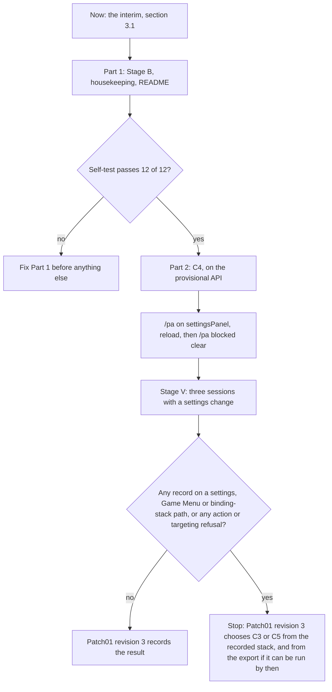

# PersonalAddon — Patch 01 Implementation
**Date:** September 24, 2026
**API Version:** 1.60.1 (WoW Forever Beta), build 70009
**Implements:** `20260924-Patch01.md` revision 2 — Stage B, then C4
**Depends on:** `PersonalAddon.toc`, `Core/BlockWatch.lua`, `Core/Debug.lua`, `Core/Registry.lua` and `Features/SettingsPanel.lua` as of `ff43442`
**Revision:** 3 — Stage S is not run. Part 2 follows Part 1 directly, on the provisional API, and the evidence from 2026-09-26 is recorded (§2.1). Revision 2 added the audit dispositions (§9).
**Status, 2026-09-26:** Closed. Parts 1 and 2 shipped in `488abbd`. Stage V found the remaining `SetPreferredGamepadInteractTarget()` refusals to be a Blizzard Gamepad UI defect; the root cause is recorded in `20260924-Patch01.md` §0.

---

## 1. Scope

The patch ships in two parts, as two commits, back to back (§3).

| Item | Part | Source |
|---|---|---|
| Interim until Part 2: PersonalAddon's page taken out of Options | — | D9, §3.1 |
| BlockWatch revision 2: stack, kind, call-site signature, persisted log, traced paths | 1 | Patch01 §6.1 (R1–R4, R7) |
| `/pa blocked` list, `stack`, `clear`, `selftest` | 1 | §4.6, §4.7 |
| Remove `PersonalAddonProbeLog`: the TOC declaration and the load-time wipe | 1 | The TOC's own note: "next version" |
| Version 1.0.1 | 1 | — |
| README: troubleshooting, rules, roadmap status | 1 | Already written; ships with Part 1 |
| Gate: the Stage S export — not run (D1) | 2, step 0 | Patch01 §6.2 |
| C4: Blizzard-stored settings with an isolated apply | 2 | Patch01 §7 |
| Two-value choices presented as checkboxes | 2 | Decision D2 |
| Declared defaults at registration | 2 | Patch01 R8 |
| `/pa set` and `/pa on\|off` reflected into the panel | 2 | Patch01 §7 |
| README: remove the temporary proxy exception | 2 | — |

Not in this patch:

- C3 and C5.
- Moving FSR's marker texture, or removing `Log.lua`'s `print()` fallback. Both are
  documented exceptions (D4).
- Any change to feature behaviour, beyond the damage panel's "Which fight" control
  becoming a checkbox.

`## Interface: 16001` stays. `.build.info` shows the client at 1.60.1, build 70009.

---

## 2. Decisions and refinements

Decisions taken on 2026-09-24, and revised on 2026-09-26:

| # | Decision | Consequence here |
|---|---|---|
| D1 | ~~Stage S runs before C4~~ **Revised 2026-09-26: Stage S is not run** | The launch option could not be set. Part 2 proceeds on the provisional API (§5.0), and Stage V is the only judge of C4 |
| D2 | Two-value choices are checkboxes | After Part 2, Blizzard's settings code calls no function of this addon's except the value-changed callback, which it delivers through its callback registry |
| D3 | ~~Stage B ships alone first~~ **Revised 2026-09-26: no waiting period** | BugGrabber recorded the baseline (§2.1), and waiting costs controller input after every Options close. Part 2 follows Part 1 directly (§3) |
| D4 | FSR's texture and Log's `print()` stay, documented | The README lists them; nothing here touches them |
| D5 | The planned NPC-frame features are on hold under rule 8 | README only |
| D6 | The rules are checked from CLAUDE.md and by the Copilot auditor | One line each, already added |
| D7 | Stage B's chat output uses `EscapeGuard.Neutralize` | `EscapeGuard` gets its first consumer (Phase 6 §14) |
| D8 | `/pa blocked selftest` ships with Stage B | The recorder is checked without anything being refused |
| D9 | **Added 2026-09-26:** until Part 2 ships, PersonalAddon's page stays out of Options | `/pa off settingsPanel` and a reload; `/pa get` and `/pa set` configure everything meanwhile (§3.1) |

Refinements to Patch01's design, made here:

| Patch01 | Refined to | Why |
|---|---|---|
| §6.1 `call_site_of(capture)` | `call_site_of(capture, refusedName)` | Finding the refused frame by name keeps a deliberate attempt's own frames in its signature (T8) |
| §6.1 `render_stack_for_chat` | `EscapeGuard.Neutralize`, applied per line | Same post-condition, using an existing function (D7) |
| §6.1 eviction by oldest `firstSeenAt` | Eviction of the first record in insertion order | The same order, with ties broken deterministically: records are appended when first seen |
| §6.1 one full stack read and one parse per refusal | One short read per refusal, a parse only for text this session has not seen, and a full read only for a path not yet in the log (§4.3) | A storm of repeated refusals costs a short read and a lookup each (§9, finding 2) |
| §6.1 the traced path's explanation | The explanation in §4.5 | §2.1 showed the real cost: controller presses refused until a reload |
| §7 `PanelBinding.kind` | `PanelBinding.presentation` | A two-value choice is stored as a choice and shown as a checkbox (D2), so the conversion needs the choices |
| §7 `to_panel_form` / `to_store_form` take a kind | They take a `Presentation` | Same reason |
| §7 `Refused(violation: SchemaViolation)` | `Refused(reason: string)` | `ConfigStore.Set` reports a sentence naming the bound, not a structured violation |
| §7 `on_panel_value_changed` handed to the settings API | `value_changed_handler_for(binding, state)`, which adapts the registry's `(setting, value)` (§5.4) | The registry's arguments are not the binding and state the handler needs (§9, finding 3) |
| §7 revert through `setting:SetValue` one frame later, with an echo | `copy_stored_value_to_panel`, at once, writing `panelValues` only (§5.4) | `SetValue` from this addon's execution runs Blizzard's setting and control code under this addon's taint (§9, finding 4) |

### 2.1 Evidence from 2026-09-26

Part 1 was not yet installed, so the evidence comes from three places: BugGrabber, Chatify's
saved chat, and the chat lines of the BlockWatch then running. Times are local.

| Time | Event | Source |
|---|---|---|
| 18:07:51 | `SetPreferredGamepadInteractTarget()` forbidden through `SettingsPanel:Close → ExitWithCommit`, with **BugSack** named | BugGrabber, with stack |
| 18:14:21 | The `GameTooltip.lua:381` `GamepadMode` error again, three times | BugGrabber; Blizzard's defect |
| 18:28 | `/pa blocked`: nothing blocked this session | Chat |
| 18:29:29 | `SetPreferredGamepadInteractTarget()` forbidden on the traced path, with PersonalAddon named | BugGrabber, with stack |
| 18:29 | `UseAction()`, `SpellStopCasting()`, `SpellStopTargeting()`, `ClearTarget()` and `TargetNearestEnemy()` refused, with PersonalAddon named and attempt `unknown` | Chat. There are no stacks: BugGrabber keeps only the first refusal per addon per session |
| 18:30:03 | Reload | Saved-variable write times |

What it changes:

- **The cost is higher than any document here has said.** The five refusals after the
  close are calls behind the controller's action, cancel and targeting presses. For that
  minute, the close had left the gamepad binding state tainted, and those presses did
  nothing until the reload. The traced path's old explanation, "one stale interact icon",
  is wrong in a way a player feels.
- **Blizzard's close path takes taint from other addons' settings code too.** BugSack
  registers several of its options as proxy settings, alongside AddOn settings
  (`BugSack/config.lua`), and it was blamed on the same path.
  - That confirms the carrier this patch removes, and that the underlying defect is the
    beta's settings panel not isolating addon code.
  - Which BugSack setting the close path ran is not recorded, so this does not by itself
    show that AddOn settings are safe. That is still Stage V's question.
  - It is also outside this addon's reach: changing BugSack's own options can still
    break controller input until a reload.
- **Nothing here tests C4's assumptions** (S-Q1 to S-Q3). With the export not run (D1),
  Stage V tests them.

---

## 3. Sequence



- **No baseline wait.** BugGrabber's records from 2026-09-26 are the baseline (§2.1).
  Part 2 follows Part 1 as soon as the self-test passes. The two parts stay separate
  commits, so each can be rolled back on its own.
- **No export.** Part 2 builds on the provisional API (§5.0). What the export would have
  confirmed before any code was written, Stage V now confirms afterwards. If C4 does not
  keep Blizzard's close path clean, Stage V says so, with a stored stack.
- **Clearing the log after Part 2 lands** means every later record comes from after C4,
  with its own stored stack.

### 3.1 Interim, until Part 2 ships

Any close of Options after a PersonalAddon setting has changed can leave controller presses
refused until a reload (§2.1). Until Part 2 ships:

1. Run `/pa off settingsPanel`, then `/reload`. PersonalAddon's page leaves Options, and
   none of this addon's code runs in the settings panel.
2. Configure with `/pa get <feature>` and `/pa set <feature> <key> <value>` meanwhile.
3. If controller presses stop working after any Options close, `/reload` clears it.
   BugSack's options can cause this too.

When Part 2 lands, `/pa on settingsPanel` and `/reload` bring the page back, as §3's
flow shows.

---

## 4. Part 1 — Stage B

### 4.1 Files

| File | Change |
|---|---|
| `PersonalAddon.toc` | `## SavedVariables: PersonalAddonDB, PersonalAddonBlockLog`. The five comment lines about `PersonalAddonProbeLog` removed. `## Version: 1.0.1` |
| `Core/Registry.lua` | Delete `discardProbeLog` with its comment (lines 303–320), and its call in the `ADDON_LOADED` branch (line 329) |
| `Core/BlockWatch.lua` | Revision 2 (§4.2–§4.7) |
| `Core/Debug.lua` | `/pa blocked` subcommands (§4.6), help text; the callers of `Tally` and `IsKnown` are replaced |
| `README.md` | Ships as already written |

Removing the declaration is safe now. The saved variables file already shows
`PersonalAddonProbeLog = nil`, so the wipe has run, and the client drops the line at its
next write.

### 4.2 BlockWatch: state and lifecycle

Patch01 §6.1's types are used unchanged, except where §2 refines them.

```
type SubscriptionToken = integer
type PathKey           = string

type BlockWatchState = {
    tokens:   List<SubscriptionToken>,
    blockLog: PersistentBlockLog | Absent,
    attempt:  AttemptLabel,
    memo:     PathMemo
}
```

`PathMemo` is defined in §4.3.

- **`enable()`**
  - Binds the log, if this session has not bound it yet (§4.4).
  - Subscribes two handlers through `Dispatch`: `ADDON_ACTION_BLOCKED` with kind
    `Blocked`, and `ADDON_ACTION_FORBIDDEN` with kind `Forbidden`. It takes two handlers
    because `Dispatch` passes event arguments without the event name (Patch01 R2).
  - Returns today's failure when the client refuses both subscriptions.
- **`disable()`** unsubscribes both handlers and resets `attempt` to `Unknown`. The log
  stays bound and stays on disk.
- **The memo** is created empty when the file loads and lives for the session. Neither
  `disable` nor `/pa blocked clear` touches it.
- **Each handler** calls `record_refusal` (§4.3), then `surface` (§4.5).

The public surface after this part:

| Function | Change |
|---|---|
| `NoteAttempt`, `CurrentAttempt` | Unchanged. Nothing has called them since the spikes were deleted, so every record's attempt is `unknown` — still the fact to record |
| `IsObserving` | Unchanged |
| `Records() -> List<BlockRecord>` | New; replaces `Tally` |
| `StackOf(index: integer) -> StackCapture \| Absent` | New |
| `Clear() -> integer` | New; calls `clear_block_log` |
| `SelfTest() -> SelfTestReport` | New (§4.7) |
| `Tally`, `IsKnown`, `TotalBlocks` | Removed. `Debug.lua` is the only caller of the first two; the third has none |

The client facilities behind Patch01's `ClientProbe`:

| Field | Client facility |
|---|---|
| `now` | `time()` |
| `build` | The client's build info: version and build number joined with a dot, e.g. `1.60.1.70009` |
| `inCombat` | `InCombatLockdown()` |
| `shownPanels` | Each name in `WATCHED_PANELS` whose global exists, is a frame, and reports itself shown |
| `readStack` | `debugstack(1, topFrames, bottomFrames)`: with `SIGNATURE_READ_FRAMES` and 0 for every refusal, and with `STACK_TOP_FRAMES` and `STACK_BOTTOM_FRAMES` only for a new path (§4.3). `Withheld` when the client's secret-value check reports the text as secret; `Unavailable` when there is no `debugstack` |

The constants are all declared once in `Core/BlockWatch.lua`. Most are restated from
Patch01 §6.1; revision 2 added two.

| Constant | Value | Reason |
|---|---|---|
| `OUR_ADDON_NAME` | `PersonalAddon` | The name the client blames |
| `BLOCK_LOG_CAPACITY` | 16 records | Patch01 §6.1 |
| `STACK_TEXT_LIMIT` | 6000 characters | Patch01 §6.1; about 96 KB on disk at capacity |
| `STACK_TOP_FRAMES` / `STACK_BOTTOM_FRAMES` | 40 / 20 | Patch01 §6.1. Used only for a new path's stored stack |
| `SIGNATURE_READ_FRAMES` | 24 | The short read. This addon's handler puts about seven frames above the refused one: the reader, `record_refusal`, the per-kind handler, `xpcall`, `Isolation.Call`, and Dispatch's `invoke` and `OnEvent`. A signature also needs the refused frame, `SIGNATURE_DEPTH` path frames and the odd tail call, so about 14 in all |
| `SIGNATURE_DEPTH` | 4 | Patch01 §6.1 |
| `PATH_MEMO_CAPACITY` | 32 texts | Twice the log's capacity. Emptied when full, so it never holds more than about 50 KB of short reads |
| `WATCHED_PANELS` | `SettingsPanel`, `GameMenuFrame`, `EditModeManagerFrame`, `CommunitiesFrame`, `GuildControlUI`, `AddonList` | Patch01 §6.1 |

### 4.3 Reading the stack

```
type StackLine =
      OurFrame(sourceFile: FilePath, frameFunction: FrameFunction)
    | LuaFrame(sourceFile: FilePath, frameFunction: FrameFunction)
    | ClientFrame(name: LuaFunctionName | Absent)
    | TailCall
    | Unrecognised
```

A leading `...` on a line marks elided frames, and it is stripped before the line is
classified. The forms below are the ones this client's stack reader produced on
2026-09-24, as BugGrabber captured them:

| Line form | Classified as |
|---|---|
| `[Interface/AddOns/PersonalAddon/<path>]:<n>: in function …` | `OurFrame` |
| `[Interface/AddOns/<path>]:<n>: in function '<name>'` | `LuaFrame(<path>, Named(<name>))` |
| `[Interface/AddOns/<path>]:<n>: in function <<location>>` | `LuaFrame(<path>, Anonymous)` |
| `[C]: in function '<name>'` | `ClientFrame(<name>)` |
| `[C]: ?` | `ClientFrame(Absent)` |
| `[tail call]: ?` | `TailCall` |
| Anything else | `Unrecognised` |

`<path>` is kept relative to `Interface/AddOns/`, as in
`Blizzard_GamepadActionBars/MainActionBarFrame.lua`. `<n>`, the line number, is dropped.

```
# Classifies one line of the client's stack text.
# post: exactly one StackLine; a line matching no form is Unrecognised, never an error
function parse_stack_line(line: string) -> StackLine

# Reduces a captured stack to the frames that identify its path. The refused frame is
# found by name, so a deliberate attempt's own frames stay in its signature.
# post: at most SIGNATURE_DEPTH frames, each from an OurFrame or LuaFrame line. An
#       empty signature means no frame identified the path: the stack was withheld or
#       unavailable, or no Lua frame followed the point where the path starts. An empty
#       signature is always Untraced
function call_site_of(
    capture: StackCapture,
    refusedName: ProtectedFunctionName
) -> CallSiteSignature:
    if capture is not Captured:
        return []
    lines: List<StackLine> = map(split_lines(capture.stackText), parse_stack_line)
    bareName: LuaFunctionName = strip_call_suffix(refusedName)
    start: integer | Absent = index_after_first(lines,
        line -> line is ClientFrame and line.name != Absent
                and ends_with(line.name, bareName))
    if start == Absent:
        start = index_after_leading(lines,
            line -> line is OurFrame or line is ClientFrame or line is TailCall)
    signature: CallSiteSignature = []
    for line in lines from start:
        if length(signature) == SIGNATURE_DEPTH:
            return signature
        if line is LuaFrame or line is OurFrame:
            signature.append(FrameLocation(line.sourceFile, line.frameFunction))
    return signature

type PathMemo = {
    signatures: Map<ProtectedFunctionName, Map<StackText, CallSiteSignature>>,
    entries:    integer,
    hits:       integer
}

# Returns the signature for a short read, parsing only text this session has not seen
# for this function.
# post: Captured text seen before -> its remembered signature, hits + 1, no parsing;
#       unseen Captured text -> call_site_of's signature, remembered, after emptying the
#       memo if it already holds PATH_MEMO_CAPACITY entries;
#       Withheld or Unavailable -> the empty signature, not remembered
function signature_via_memo(
    memo: PathMemo,
    shortRead: StackCapture,
    refusedName: ProtectedFunctionName
) -> CallSiteSignature

# Records a refused protected call at the moment the client reports it. Refines
# Patch01 §6.1: a repeat of a known path costs one short read and a lookup, and only a
# path not yet in the log pays for the full read.
# pre:  called synchronously from the ADDON_ACTION_BLOCKED or _FORBIDDEN handler
# post: at most one BlockRecord per (functionName, callSite); a repeat increments count
#       and changes nothing else; the full stack is read at most once per new record;
#       the log never exceeds BLOCK_LOG_CAPACITY records
# raises: never; a stack the client withholds is recorded as Withheld
function record_refusal(
    kind: BlockKind,
    blamedAddon: AddonName,
    functionName: ProtectedFunctionName,
    attempt: AttemptLabel,
    probe: ClientProbe,
    tracedPaths: List<TracedPath>,
    memo: PathMemo,
    blockLog: PersistentBlockLog
) -> RefusalDisposition:
    if blamedAddon != OUR_ADDON_NAME:
        return NotOurs
    shortRead: StackCapture = probe.readStack(SIGNATURE_READ_FRAMES, 0)
    callSite: CallSiteSignature = signature_via_memo(memo, shortRead, functionName)
    status: PathStatus = classify_path(functionName, callSite, tracedPaths)
    existing: BlockRecord | Absent = find_record(blockLog, functionName, callSite)
    if existing != Absent:
        existing.count = existing.count + 1
        seen: Occurrence = SeenBefore(existing.firstSeenAt, existing.clientBuild)
        return Refusal(existing, status, seen)
    fullRead: StackCapture = probe.readStack(STACK_TOP_FRAMES, STACK_BOTTOM_FRAMES)
    record: BlockRecord = BlockRecord(
        functionName = functionName,
        kind         = kind,
        callSite     = callSite,
        firstStack   = truncate_capture(fullRead, STACK_TEXT_LIMIT),
        firstSeenAt  = probe.now(),
        clientBuild  = probe.build(),
        attempt      = attempt,
        inCombat     = probe.inCombat(),
        shownPanels  = probe.shownPanels(WATCHED_PANELS),
        count        = 1
    )
    insert_evicting_oldest(blockLog, record, BLOCK_LOG_CAPACITY)
    return Refusal(record, status, FirstEver)

# post: functionName, then each frame of callSite as sourceFile:function or
#       sourceFile:anonymous, joined in order; equal paths give equal keys
function path_key_of(
    functionName: ProtectedFunctionName,
    callSite: CallSiteSignature
) -> PathKey
```

Helpers used above:

- `split_lines` splits stack text at line breaks and drops empty lines.
- `strip_call_suffix` removes the trailing `()` the client adds when it names the refused
  function in the event.
- `index_after_first` returns the position just after the first line matching the
  predicate, or `Absent`.
- `index_after_leading` returns the position of the first line that does not match the
  predicate. When every line matches, it returns one past the last line, so the loop
  that follows runs over an empty range and returns the empty signature (T11).
- `ends_with` accepts both `'IsUserOAuthed'` and `'C_Discord.IsUserOAuthed'`. Which form
  this client's stack reader prints for a namespaced function is not yet known (T10).
- These Patch01 §6.1 functions are used unchanged, apart from §2's eviction refinement:
  `classify_path`, `find_record`, `truncate_capture`, `insert_evicting_oldest`,
  `bind_block_log` and `clear_block_log`.

**Cost per refusal.**

- Every refusal pays for one short read of `SIGNATURE_READ_FRAMES` frames.
- If this session has already seen the same text for the same function, a table lookup
  is the only other cost. Otherwise there is one parse, of at most
  `SIGNATURE_READ_FRAMES` lines.
- Only a path not yet in the log pays for the full read.

The realistic storm is one refusal repeated; Patch01 §2.3 shows eleven from one close.
Each of those costs a short read and a lookup. Nothing is throttled, and every refusal is
still counted (§9, finding 2).

### 4.4 The persisted log

**Where it lives.** The saved variable is `PersonalAddonBlockLog`, at `formatVersion` 1.
Its shape is Patch01's `PersistentBlockLog`, written as tables of primitives:

- `BlockKind` and `AttemptLabel` are stored as strings.
- A `FrameFunction` is stored as a function name, or left absent for `Anonymous`.
- A `StackCapture` is stored as a state (`Captured`, `Withheld` or `Unavailable`), plus the
  text when captured.

Records are kept in insertion order, which is also `firstSeenAt` order. Eviction removes
the first record.

**Binding.**

- It happens on first use in a session: `enable`, or any `/pa blocked` subcommand. Both
  run after `PLAYER_LOGIN`, when saved variables are loaded.
- `bind_block_log(_G.PersonalAddonBlockLog, BLOCK_LOG_CAPACITY)` runs once. The bound
  table is assigned back to `_G.PersonalAddonBlockLog`, so the client writes it at
  logout.
- Binding is idempotent within a session. A second `enable` after a `disable` reuses the
  bound log.

**Shape rules for `Reset`.**

- A non-table, or a missing or non-list `records`, is `WrongShape`.
- A `formatVersion` other than 1 is `UnknownFormatVersion`.
- Any record with a missing or wrongly typed field makes the whole log `WrongShape`.
  Dropping one record quietly would hide a writer bug.

### 4.5 Surfacing and traced paths

`KNOWN_BLOCKS` becomes `TRACED_PATHS`, a `List<TracedPath>`:

| Function | Signature (paths relative to `Interface/AddOns/`) |
|---|---|
| `SetPreferredGamepadInteractTarget()` | `Blizzard_GamepadActionBars/MainActionBarFrame.lua` `UpdateInteractIcons` → `Blizzard_GamepadActionBars/MainActionBarFrame.lua` anonymous → `Blizzard_GamepadSharedUtility/InputBindingStack/InputBindingManager.lua` anonymous → `Blizzard_GamepadSharedUtility/InputBindingStack/InputBindingManager.lua` `RemoveSet` |
| `SetPreferredGamepadInteractTarget()` | The same first three frames → `Blizzard_GamepadSharedUtility/InputBindingStack/InputBindingManager.lua` `AddBindingSet` |

Both carry this explanation. It replaces Patch01 §6.1's in light of §2.1:

> traced: closing Options after this addon's settings code ran left the gamepad binding
> state tainted. Until a reload, later menu actions and controller presses can be refused
> — on 2026-09-26, action, cancel and targeting presses were. /reload clears it.

```
# Prints what one refusal means, at most once per PathKey per session.
# post: NotOurs prints nothing; a Refusal prints the line below for its status and
#       occurrence the first time its PathKey is seen this session, and nothing after
function surface(disposition: RefusalDisposition) -> None
```

Every value that came from the client — function names, frame names, stack text — passes
through `EscapeGuard.Neutralize` before it reaches chat. What reaches chat:

| Status and occurrence | Message |
|---|---|
| `Untraced`, `FirstEver` | `BLOCKED (<kind>): <function> refused with PersonalAddon named. Attempt: <attempt>. Via: <first signature frame, or "no path frames">. Open: <shown panels, or "none">. /pa blocked for the record.` |
| `Untraced`, `SeenBefore` | The same line, ending `First seen <date>, build <build>.` |
| `Traced`, `FirstEver` | `<function> refused (<kind>) on a traced path: <explanation>` |
| `Traced`, `SeenBefore` | The same line, ending `First seen <date>, build <build>.` |

`Untraced` lines use `Log.OnceError`, and `Traced` lines use `Log.Once`, both keyed
`blockwatch:<PathKey>`. Repeats within a session are counted and print nothing.

### 4.6 `/pa blocked`

| Command | Output |
|---|---|
| `/pa blocked` | When not observing: today's `NOT OBSERVING` line. Otherwise `<N> record(s); up to 16 are kept`, then one line per record: `<n>. <count>x <function> [<kind>] <Traced \| Untraced> attempt=<attempt> via <frame 1> < <frame 2> < <frame 3>` |
| `/pa blocked stack <n>` | Record `<n>`'s header line, then its stored stack, one chat line per stack line. `Withheld` and `Unavailable` say so in one line |
| `/pa blocked clear` | `cleared <N> record(s)` |
| `/pa blocked selftest` | `selftest: <passed>/12 passed`, then one line per failed case, naming it and the reason |

`/pa help` gains the three subcommands. An index outside the list, or one that is not a
number, prints `no record <n>; /pa blocked lists them`.

### 4.7 Self-test

```
type SelfTestOutcome = Passed | Failed(reason: string)

type SelfTestCase = {
    caseName: string,
    run:      () -> SelfTestOutcome
}

type SelfTestReport = {
    passed: integer,
    failed: List<{ caseName: string, reason: string }>
}

# Runs the stack reader, classifier, memo and log against fixed samples.
# post: PersonalAddonBlockLog and the session's path memo are untouched, and nothing
#       reaches chat except the report; every case runs even after one fails
# raises: never
function run_selftest() -> SelfTestReport
```

**Sample A** is the stack BugGrabber stored at 19:15:47 on 2026-09-24 for the traced
refusal. Its two BugGrabber handler lines are replaced by the five lines this addon's own
handler produces. It is kept in `Core/BlockWatch.lua` as fixed text, and it contains
Blizzard file paths and nothing about the player:

```
[Interface/AddOns/PersonalAddon/Core/BlockWatch.lua]:1: in function <Interface/AddOns/PersonalAddon/Core/BlockWatch.lua:1>
[C]: in function 'xpcall'
[Interface/AddOns/PersonalAddon/Core/Isolation.lua]:33: in function 'Call'
[Interface/AddOns/PersonalAddon/Core/Dispatch.lua]:165: in function 'invoke'
[Interface/AddOns/PersonalAddon/Core/Dispatch.lua]:235: in function <Interface/AddOns/PersonalAddon/Core/Dispatch.lua:208>
[C]: in function 'SetPreferredGamepadInteractTarget'
[Interface/AddOns/Blizzard_GamepadActionBars/MainActionBarFrame.lua]:255: in function 'UpdateInteractIcons'
[Interface/AddOns/Blizzard_GamepadActionBars/MainActionBarFrame.lua]:66: in function <...ns/Blizzard_GamepadActionBars/MainActionBarFrame.lua:49>
[tail call]: ?
[Interface/AddOns/Blizzard_GamepadSharedUtility/InputBindingStack/InputBindingManager.lua]:42: in function <...redUtility/InputBindingStack/InputBindingManager.lua:38>
[Interface/AddOns/Blizzard_GamepadSharedUtility/InputBindingStack/InputBindingManager.lua]:190: in function 'RemoveSet'
[Interface/AddOns/Blizzard_GamepadSharedUtility/InputBindingStack/BindingSetFactory.lua]:264: in function 'DeactivateBindingGroup'
[Interface/AddOns/Blizzard_GamepadSharedUtility/FrameControlsManager.lua]:117: in function <...izzard_GamepadSharedUtility/FrameControlsManager.lua:113>
[Interface/AddOns/Blizzard_GamepadSharedUtility/FrameControlsManager.lua]:542: in function 'FrameHidden'
[Interface/AddOns/Blizzard_GamepadSharedUtility/FrameControlsManager.lua]:226: in function <...izzard_GamepadSharedUtility/FrameControlsManager.lua:221>
...[Interface/AddOns/Blizzard_UIParentPanelManager/Shared/UIParentPanelManager.lua]:513: in function 'MoveUIPanel'
[Interface/AddOns/Blizzard_UIParentPanelManager/Shared/UIParentPanelManager.lua]:570: in function 'HideUIPanelImplementation'
[Interface/AddOns/Blizzard_UIParentPanelManager/Shared/UIParentPanelManager.lua]:530: in function 'HideUIPanel'
[Interface/AddOns/Blizzard_UIParentPanelManager/Shared/UIParentPanelManager.lua]:133: in function <...UIParentPanelManager/Shared/UIParentPanelManager.lua:124>
[C]: in function 'SetAttribute'
[Interface/AddOns/Blizzard_UIParentPanelManager/Shared/UIParentPanelManager.lua]:933: in function 'HideUIPanel'
[Interface/AddOns/Blizzard_Settings_Shared/Blizzard_SettingsPanel.lua]:296: in function 'TransitionBackOpeningPanel'
[Interface/AddOns/Blizzard_Settings_Shared/Blizzard_SettingsPanel.lua]:291: in function 'ExitWithCommit'
[Interface/AddOns/Blizzard_Settings_Shared/Blizzard_SettingsPanel.lua]:260: in function 'Close'
[Interface/AddOns/Blizzard_Settings_Shared/Blizzard_SettingsPanel.lua]:65: in function <.../Blizzard_Settings_Shared/Blizzard_SettingsPanel.lua:64>
```

| Case | Input | Expected |
|---|---|---|
| T1 | Sample A, refused name `SetPreferredGamepadInteractTarget()` | The first traced signature; `Traced` |
| T2 | Sample A with `'RemoveSet'` replaced by `'AddBindingSet'` | The second traced signature; `Traced` |
| T3 | Sample A with the `InputBindingManager.lua]:42` line's path changed to another file | `Untraced` |
| T4 | A `Withheld` capture | Empty signature; `Untraced` |
| T5 | Sample A with every line prefixed by `...` | The same signature as T1 |
| T6 | 17 distinct refusals recorded into a scratch log of capacity 16 | 16 records; the first-written is gone |
| T7 | The same refusal recorded twice into a scratch log | One record with `count` 2; the second call returns `SeenBefore` |
| T8 | Sample A with `[Interface/AddOns/PersonalAddon/Features/Probe.lua]:10: in function 'attempt'` inserted directly below the refused frame | The signature's first frame is `PersonalAddon/Features/Probe.lua` `attempt` |
| T9 | Stack text containing `\|cffff0000red\|r`, rendered for chat | Every `\|` doubled |
| T10 | Sample A with the refused frame printed as `'C_Test.SetPreferredGamepadInteractTarget'` | The same signature as T1 |
| T11 | Sample A's first six lines only, with the refused frame printed as `[C]: ?` | Empty signature; `Untraced` |
| T12 | The same short read twice through a scratch memo; then 33 distinct short reads through a scratch memo of capacity 32 | The second call is a hit: `hits` rises and `entries` does not. The memo never holds more than 32 entries |

T6 and T7 run against a scratch log, and T12 against a scratch memo, never against the
session's own.

### 4.8 Verification — Part 1

Nothing below provokes a refusal.

1. The addon loads with no Lua error, and `/pa status all` shows `blockWatch` enabled.
2. `/pa blocked selftest` reports 12 of 12.
3. On a fresh log, `/pa blocked` prints `0 record(s); up to 16 are kept`.
4. After exit, `WTF/Account/<account>/SavedVariables/PersonalAddon.lua` holds
   `PersonalAddonBlockLog` and no `PersonalAddonProbeLog`.

There is no baseline step. §2.1 is the baseline, and with the interim in place (§3.1)
PersonalAddon cannot produce the traced refusal anyway.

Part 1 is first proven on real client output during Stage V. That is sound because a
failing recorder shows itself: a fault notice, or records reading `Via: no path frames`.
A clean Stage V with `blockWatch` still enabled therefore means that nothing was refused.

---

## 5. Part 2 — C4

### 5.0 Gate: the Stage S export

**Status, 2026-09-26: not run (D1).** This section is kept for the case where Stage V fails
and a choice between C3 and C5 has to be made. The launch option lives in the Battle.net
app, not in the game's own launcher:

1. Open Battle.net's Settings, then Game Settings.
2. Find the entry for the Forever Beta.
3. Tick "Additional command line arguments" and enter `-console`.

When it is run:

1. Set the launch option as above.
2. At the login or character-select screen, open the console and run
   `exportInterfaceFiles code`.
3. Answer the following from `_classic_beta_/BlizzardInterfaceCode/`, and record the
   answers in this document's next revision:
   - **S-Q1.** On close, what does the loop at `Blizzard_SettingsPanel.lua:594` visit?
     Does it reach each setting through `securecallfunction` / `secureexecuterange`, or
     directly? Does anything on that path touch categories?
   - **S-Q2.** What do AddOn settings and proxy settings each run on get, set and commit?
   - **S-Q3.** How does `SetValueChangedCallback` deliver, and with which arguments?
   - **S-Q4.** Where is `C_Discord.IsUserOAuthed` called?
   - **API.** The exact signatures of the provisional calls below, and what a colour
     swatch writes into an AddOn setting: a string, or a colour object.

**Pass:** the close path touches AddOn setting objects only through a secure call, or not
at all, and S-Q3 shows the callback delivered through a secure call.

**Fail:** stop. Patch01 revision 3 chooses C3 or C5 from the same export.

**If the export is not run, or the console refuses it:** Part 2 proceeds on the provisional
API, and Stage V is the only judge (§3). As of 2026-09-26, this is the path taken.

The provisional API below comes from TargetRange's working calls on this client and from
today's panel code, and stands until an export confirms it:

| Call | Provisional shape |
|---|---|
| `Settings.RegisterAddOnSetting` | `(category, variable, variableKey, variableTable, variableType, name, defaultValue) -> setting` |
| `setting:SetValueChangedCallback` | `(callback)`, with the callback receiving `(setting, value)` |
| `Settings.CreateCheckbox` | `(category, setting, tooltip)` |
| `Settings.CreateSliderOptions` | `(minimum, maximum, step) -> options` |
| `Settings.CreateSlider` | `(category, setting, options, tooltip)` |
| `Settings.CreateColorSwatch` | `(category, setting, tooltip)` |

### 5.1 Files

| File | Change |
|---|---|
| `Features/SettingsPanel.lua` | Registration layer replaced (§5.2–§5.6) |
| `Core/Debug.lua` | `/pa set` and `/pa on\|off` reflect into the panel (§5.6); `/pa panel` also reports reverts and unreadable colours |
| `README.md` | Remove the "Until Patch 01 Part 2 lands" exception |

Nothing outside these files changes. Features keep receiving `onConfigChanged` exactly as
they do today.

### 5.2 State and API resolution

```
type CategoryHandle = opaque

type Presentation =
      Checkbox
    | Slider(minimum: number, maximum: number, step: number)
    | ColourSwatch
    | ChoiceCheckbox(offValue: ConfigValue, onValue: ConfigValue, label: string)

type PanelBinding = {
    variable:     VariableName,
    featureId:    FeatureId,
    target:       SettingTarget,
    presentation: Presentation
}

type StoreWrite = Written | Refused(reason: string)

type PanelState = {
    categoryHandle: CategoryHandle | Absent,
    registered:     boolean,
    controlCount:   integer,
    skipped:        List<ControlSkipped>,
    panelValues:    PanelValues,
    bindings:       Map<VariableName, PanelBinding>,
    settings:       Map<VariableName, RegisteredSetting>,
    pending:        Map<VariableName, PanelBinding>,
    pendingOrder:   List<VariableName>,
    flushScheduled: boolean,
    reverts:        integer,
    unreadable:     integer
}
```

`VariableName`, `PanelValues`, `SettingTarget`, `ControlSkipped`, `StoreForm`,
`PanelChangeOutcome`, `SettingsCategory` and `RegisteredSetting` are Patch01 §7's, with
§2's refinements.

**Resolution.** The setting registrar is `RegisterAddOnSetting` only. Today's fallback
list also names `RegisterProxySetting`, and that entry goes. On a client without
`RegisterAddOnSetting`, the panel is not built and says so once:

```
this client offers no Blizzard-stored settings, so the panel is not built; /pa set remains
```

**It never falls back to proxy settings**, because that would silently restore the carrier
this patch removes.

### 5.3 Building controls

```
# Chooses how one setting is shown.
# post: FeatureSwitch and TOGGLE -> Checkbox; NUMBER with minimum, maximum and step ->
#       Slider; COLOUR -> ColourSwatch; CHOICE with exactly two choices ->
#       ChoiceCheckbox, first choice off and second on, labelled with the second
#       choice's label; anything else -> ControlSkipped, naming README rule 1
function presentation_for(
    target: SettingTarget,
    declaration: ConfigSchema | Absent
) -> Result<Presentation, ControlSkipped>

# post: Checkbox and Slider -> unchanged; ColourSwatch -> eight-digit AARRGGBB by
#       ConfigSchema.ToSwatchHex; ChoiceCheckbox -> true exactly when storedValue
#       equals onValue
function to_panel_form(presentation: Presentation, storedValue: ConfigValue) -> PanelValue

# post: Checkbox and Slider -> Converted, unchanged; ColourSwatch -> Converted six-digit
#       RRGGBB, or Unreadable when ConfigSchema.FromSwatch cannot read the value;
#       ChoiceCheckbox -> Converted onValue for true and offValue for false
function to_store_form(presentation: Presentation, panelValue: PanelValue) -> StoreForm

# Builds one control over panelValues.
# pre:  state.panelValues has no entry for binding.variable
# post: Built -> panelValues holds the stored value in panel form; the setting's
#       default is the declared default in panel form (Patch01 R8); its value-changed
#       callback is value_changed_handler_for(binding, state), and no other function
#       of this addon's is handed to the settings API.
#       Skipped -> panelValues has no entry for the binding, and the reason is kept for
#       /pa panel
function build_control(
    category: SettingsCategory,
    binding: PanelBinding,
    declaredDefault: ConfigValue,
    tooltip: string | Absent,
    state: PanelState
) -> Result<RegisteredSetting, ControlSkipped>
```

- **Declared defaults.** A key uses `Registry.Defaults(featureId).settings[key]`. A feature
  switch uses `Registry.Defaults(featureId).enabledByDefault == true`.
- **Labels.** A feature switch is labelled with the feature's label and described by its
  description, as today. A key uses its schema label and description.
- **The two-value choice.** The only curated `CHOICE` today is
  `damageBreakdown.sessionType`. It becomes a checkbox labelled **Whole session**:
  - Unchecked stores `Current`; checked stores `Overall`.
  - The tooltip keeps the declaration's description.
  - The stored value, the schema, and `/pa set damageBreakdown sessionType Overall` are all
    unchanged, so no migration is needed.
- **Order.** Build order is today's: each public feature's switch first, then its curated
  keys sorted by name.

### 5.4 The value-changed callback

```
# The function handed to SetValueChangedCallback for one binding. The registry calls it
# with (setting, value); it closes over the binding and the panel state, ignores the
# setting object, and forwards the value.
# post: returns a handler whose every call equals
#       on_panel_value_changed(binding, value, state); the handler itself writes nothing
function value_changed_handler_for(
    binding: PanelBinding,
    state: PanelState
) -> (setting: RegisteredSetting, value: PanelValue) -> PanelChangeOutcome

# Receives a change the panel has already stored in panelValues (Patch01 §7).
# post: Patch01 §7's post-conditions, except that a refused or unreadable value is set
#       back in panelValues at once rather than through the setting; a FeatureSwitch
#       change is always Accepted and applied through the queue
# raises: never
function on_panel_value_changed(
    binding: PanelBinding,
    panelValue: PanelValue,
    state: PanelState
) -> PanelChangeOutcome:
    if binding.target is FeatureSwitch:
        schedule_apply(state, binding)
        return Accepted
    storeForm: StoreForm = to_store_form(binding.presentation, panelValue)
    if storeForm is Unreadable:
        state.unreadable = state.unreadable + 1
        surface_once(unreadable_colour_notice(binding, panelValue))
        copy_stored_value_to_panel(binding, state)
        return UnreadableColour
    write: StoreWrite = ConfigStore.Set(
        binding.featureId, binding.target.key, storeForm.value)
    if write is Refused:
        state.reverts = state.reverts + 1
        surface_once(refused_value_notice(binding, write.reason))
        copy_stored_value_to_panel(binding, state)
        return Refused(write.reason)
    schedule_apply(state, binding)
    return Accepted

# Sets the panel's copy of one value to what the config store holds. Writes
# panelValues only; it calls nothing on the setting or its control.
# post: panelValues[binding.variable] equals the stored value in panel form; a control
#       on screen shows it the next time it is drawn
function copy_stored_value_to_panel(binding: PanelBinding, state: PanelState) -> None

# post: "the settings panel offered a value the store refused (<featureId>.<key>):
#       <reason>; the stored value stands and the control shows it when next drawn"
function refused_value_notice(binding: PanelBinding, reason: string) -> ChatLine

# post: "the colour control returned something unreadable for <featureId>.<key>
#       (<type of panelValue>); the stored colour stands and the control shows it when
#       next drawn"
function unreadable_colour_notice(
    binding: PanelBinding,
    panelValue: PanelValue
) -> ChatLine
```

- `surface_once` is `Log.OnceError`, keyed `panel:refused:<variable>` or
  `panel:colour:<variable>`, as today.
- **Why nothing calls `setting:SetValue`.**
  - Calling it from this addon's execution would run Blizzard's setting and control code
    in that execution. Whatever that code wrote would then carry this addon's taint,
    which is the hazard README rule 2 names.
  - The panel therefore keeps one invariant: **after registration, this addon writes
    only `panelValues`, and calls no method on a Blizzard setting or control.**
  - The cost is that a control on screen keeps showing a refused value until it is next
    drawn. The notice says so.
  - Refusals should not happen for controls built from the schema's own bounds, so the
    realistic case is an unreadable colour.
- **If S-Q3 finds different callback arguments**, `value_changed_handler_for` is the only
  place that changes.

### 5.5 The deferred queue

```
# Queues an apply for the next frame, one entry per variable; a later change to the same
# variable replaces the earlier entry.
# post: pending[binding.variable] is this binding; a flush is scheduled exactly once
#       until it runs. Without C_Timer.After, the apply runs now and the fallback is
#       surfaced once, as today's canDefer does
function schedule_apply(state: PanelState, binding: PanelBinding) -> None

# Runs the queued applies one frame after they were scheduled, in this addon's own
# execution.
# post: every entry runs at most once, in queue order, and the queue is then empty:
#       a key    -> Registry.NotifyConfigChanged, with today's reload notice;
#       a switch -> Registry.SetEnabled with the switch's value in panelValues.
#       Nothing runs for an entry whose feature no longer has defaults, or when the
#       panel is not registered
function flush_pending_applies(state: PanelState) -> None
```

- **`disable`** empties `pending` and `pendingOrder`, as today. It leaves `flushScheduled`
  for the timer already in flight to clear.
- **Reverts no longer pass through the queue.** They happen at once, in `panelValues`
  (§5.4).

### 5.6 Reflecting slash-command writes

```
# post: when the panel is registered and binds (featureId, key), the effect of
#       copy_stored_value_to_panel for that binding; otherwise nothing changes. No
#       callback fires, and an open panel shows the value the next time the control is
#       drawn
function reflect_stored_value(featureId: FeatureId, key: ConfigKey) -> None

# post: as reflect_stored_value, for the feature's switch and its stored enabled flag
function reflect_enabled(featureId: FeatureId) -> None
```

- **Reflecting and reverting are the same operation**, `copy_stored_value_to_panel`
  (§5.4), reached from different callers.
- **Exports.** Both functions are exported, as `ns.SettingsPanel.ReflectStoredValue` and
  `ns.SettingsPanel.ReflectEnabled`.
- **Call sites.** `Core/Debug.lua` calls them in two places, each guarded by
  `ns.SettingsPanel` existing:
  - `commandSet` calls `ReflectStoredValue` after `ConfigStore.Set` succeeds and before
    `NotifyConfigChanged`.
  - `commandSetEnabled` calls `ReflectEnabled` after `Registry.SetEnabled` returns,
    whatever it returns, because the stored flag has changed either way.

### 5.7 Verification — Part 2

These checks are normal use; nothing is provoked. They start once `/pa on settingsPanel`
and a reload have brought the page back (§3).

1. **Controls match the store.** In Options → AddOns → PersonalAddon, every control shows
   the stored value. "Which fight" appears as a **Whole session** checkbox that matches
   `/pa get damageBreakdown`.
2. **Every kind applies.** Change one control of each kind: a feature switch, a toggle, a
   slider, a colour, and Whole session. Each takes effect by the next frame, and
   `/pa get <feature>` shows the new stored value.
3. **`/pa set` reflects.** With Options closed, run
   `/pa set damageBreakdown anchorOffsetX 50`, then reopen: the slider shows 50. Restore
   your value afterwards.
4. **`/pa on|off` reflects.** Run `/pa off fiveSecondRule` and reopen Options: its switch
   is off. `/pa on fiveSecondRule` restores it.
5. **Defaults restore declared defaults.** Note your values with `/pa get damageBreakdown`
   first. Then use Defaults, these settings only: every PersonalAddon control returns to
   its declared default, for example vertical offset 8 and Whole session unchecked.
   Restore your values with `/pa set`.
6. **Colours.** A nameplate colour change stores six hex digits. If the swatch hands back
   something unreadable, chat says so once, the stored colour stands, and the control
   shows it the next time it is drawn.
7. **Stage V.**
   1. Run `/pa blocked clear` right after the page is back. The baseline is §2.1's, so
      nothing needs recording first.
   2. Play three sessions, each including a PersonalAddon settings change and a close of
      Options. Use the controller afterwards as you normally would.

   Pass, all three of:
   - No record appears whose stack runs through `Blizzard_Settings*`, the Game Menu or
     the gamepad binding stack.
   - No refusal of `UseAction()`, `SpellStopCasting()`, `SpellStopTargeting()`,
     `ClearTarget()` or `TargetNearestEnemy()` appears.
   - `/pa status all` still shows `blockWatch` enabled.

---

## 6. Failure modes

| Failure | Detection | Response |
|---|---|---|
| The self-test fails | `/pa blocked selftest` | Part 1 is not done; fix it before Part 2 |
| Records arrive with empty signatures (`Via: no path frames`) while `/pa blocked stack <n>` shows Blizzard frames | `/pa blocked` | The stored stack shows which of two things happened: the stack format changed (update §4.3's forms), or the short read stops above the path (raise `SIGNATURE_READ_FRAMES`) |
| A storm of refusals | Counts rising fast in `/pa blocked` | Each costs a short read and a lookup (§4.3). Nothing is dropped, and the surfaced line appears once per path per session |
| Controller presses do nothing after Options closes | Chat, or a Stage B record of an action or targeting refusal | `/reload` at once. Before Part 2 this is §2.1's known behaviour, which §3.1 avoids. After Part 2, Stage V has failed: stop |
| The persisted log is malformed | `bind_block_log` returns `Reset` | Reset once, surfaced |
| The export is not run, or the console refuses it | D1, §5.0 | Part 2 on the provisional API; Stage V judges. If Stage V fails, the export is how C3 and C5 are chosen between |
| The gate fails, if the export is run | §5.0 answers | Stop; Patch01 revision 3 chooses C3 or C5 |
| The export disagrees with the provisional API | §5.0 | The export wins; §5 is revised before any further code |
| The client lacks `RegisterAddOnSetting` | API resolution | Panel not built, surfaced once; `/pa set` remains; no proxy fallback |
| A future curated `CHOICE` has more than two values | `presentation_for` | Skipped and listed by `/pa panel`, naming README rule 1 |
| The store refuses a panel value | `Refused` | Surfaced once, naming the bound. `panelValues` is set back at once, and the control shows the stored value when next drawn |
| A colour swatch hands back an unreadable form | `UnreadableColour` | Surfaced once. `panelValues` is set back at once, and the control shows the stored colour when next drawn |
| `/pa set` changes a value while Options is open | The control shows the old value until it is drawn again | Documented; the staleness Phase 6 §9.1 accepts |
| Stage V records a settings-path refusal | `/pa blocked` | Stop; Patch01 revision 3 takes the next step up, with that record's stack |

---

## 7. Rollback

- **Each part is one commit**, so reverting is per part.
- **Reverting Part 2** restores proxy settings, and with them the refusals in §2.1. Put
  the interim (§3.1) back in place with it.
- **Reverting Part 1** restores today's BlockWatch and the `PersonalAddonProbeLog`
  declaration, and drops the `PersonalAddonBlockLog` declaration. The client then stops
  loading and writing the block log, and it leaves the file at the next save.
- **Neither revert touches `PersonalAddonDB`.**

---

## 8. Exit criteria

1. Part 1 is merged, the self-test passes 12 of 12, and the block log survives `/reload`.
2. The baseline is BugGrabber's 2026-09-26 record (§2.1).
3. The export is recorded as not run (D1), or its answers are recorded here.
4. Part 2 is merged, the page is back in Options, and checks 1–6 of §5.7 pass.
5. Stage V passes all three conditions in §5.7.
6. Patch01 revision 3 records the result, and the README's temporary exception is gone.

---

## 9. Audit disposition

Against `20260924-Patch01ImplementationAudit.md`: four findings accepted, one accepted in
part.

| # | Section | Disposition | Resolution |
|---|---|---|---|
| 1 | §4.3 | Accepted | `index_after_leading` never said what it returns when every line matches. It is now total: it returns one past the last line, so the loop runs over an empty range and yields the empty signature. The fix belongs in the helper's contract, not as a guard at the call site. T11 covers it, and the empty signature's meaning is restated |
| 2 | §4.3 | Accepted in part | Parsing every refusal was waste. Every refusal now costs one short read. Text this session has seen costs a lookup, unseen text costs one bounded parse, and only a new path pays for the full read. T12 covers the memo. **Throttling is rejected**: it would drop or merge refusals, and BlockWatch's standing rule is that a refusal is counted, never suppressed. Once a repeat costs a short read and a lookup, there is nothing left to throttle |
| 3 | §5.0, §5.4 | Accepted | `value_changed_handler_for` adapts the registry's `(setting, value)` to `on_panel_value_changed(binding, value, state)`. If S-Q3 finds different arguments, it is also the one place that changes |
| 4 | §5.5, §5.6 | Accepted, resolved the other way | The contradiction was real. The auditor's first suggested fix, having `/pa set` also call `setting:SetValue`, would have spread the hazard: `SetValue` from this addon's execution runs Blizzard's setting and control code under this addon's taint. So nothing calls it. A revert is now the same direct write to `panelValues` that reflecting a slash command already was (`copy_stored_value_to_panel`), and the echo and the deferred revert are gone. The cost is that a refused value stays visible until the control is redrawn, which the notice states |
| 5 | §4.2–§4.4, §5.4 | Accepted | The constants are restated in §4.2 with their reasons, plus the two revision 2 added. `split_lines` and the two notice builders are defined, and §4.3 lists the Patch01 functions used unchanged |

Findings 3 and 4 had one cause: §5 described the panel's dealings with Blizzard's setting
object loosely. §5.4 now states that as one rule. After registration, this addon writes
only `panelValues`, and it calls nothing on a setting or control.

---

## Assumptions

- TargetRange's calls are the right settings API on this client (§5.0). The export is not
  run (D1), so this is tested only by Part 2 working. An API mismatch shows up as a
  control skipped or refused, and it is surfaced, not silent.
- The five action and targeting refusals of 2026-09-26 came through the gamepad binding
  state that the settings close had tainted. This is inferred from timing: they followed
  the traced refusal within the same minute, and their stacks were not captured.
- `/pa off settingsPanel` and a reload keep PersonalAddon's page out of Options. The
  flag persists through the config store, and the panel is built only in `enable()`.
- This client's stack reader prints the forms BugGrabber captured (§4.3). A change shows
  up as empty signatures, not as a silent misclassification.
- `debugstack(1, n, 0)` returns the top `n` frames and nothing from the bottom of the
  stack.
- The client's build info yields a version and a build number.
- Showing `sessionType` as a checkbox needs no migration, because what is stored does not
  change.
- Neither the category nor its settings can be unregistered. Phase 6 §9's documented
  exception carries over to the value-changed callbacks.
- Saved variables are written only on a clean logout or `/reload`.
