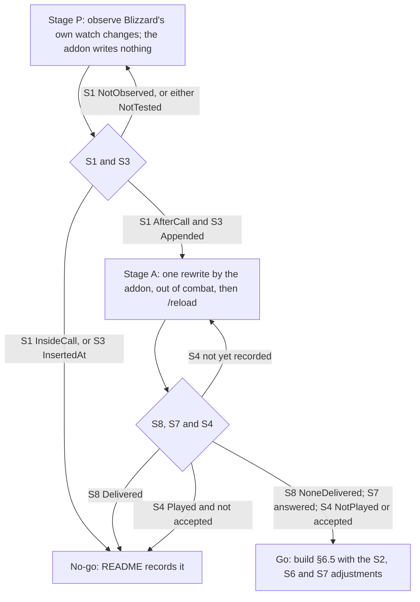
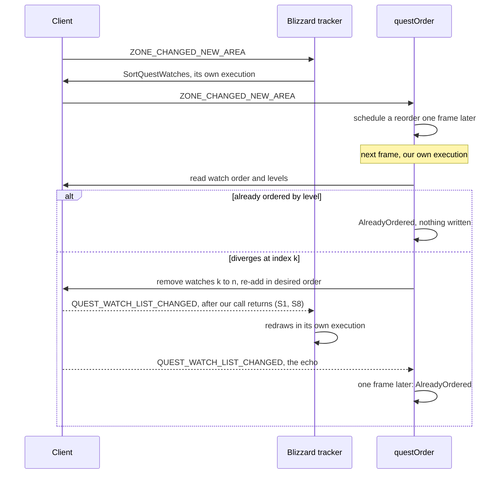

# PersonalAddon — Phase 7 Design
**Date:** September 26, 2026
**API Version:** 1.60.1 (WoW Forever Beta), client patched 2026-09-24 19:07 local; UI source exported 2026-09-26
**Implements:** `20260926-RoadmapProposal02.md`, as revised by its review of 2026-09-26 (§1.1)
**Depends on:** Phase 2 rev 7 (aggro colouring, `StyleLedger`); Phase 6 rev 3 (`ConfigSchema`, curated panel); Patch 01 rev 3 (C4 settings registration, BlockWatch revision 2); README "Rules for future development"
**Revision:** 3 — spike run: feature 3 is a no-go (§6.4). Revision history at the end.
**Status, 2026-09-26:** §5 is implemented, not committed; an offline Lua 5.1 harness passes 80 checks, and its in-game checks (§9, criteria 1–9) are pending. The spike ran and returned a no-go (§6.4). §6.5 is not built, and the probe is deleted.

---

## 1. Scope

| Item | Kind | Ships |
|---|---|---|
| Gamepad combat movement | Roadmap item 1 | **No — the client already does it** (§4) |
| Tapped and neutral nameplate colours | Feature change | Yes (§5) |
| Correction to Phase 2 §9.6 | Record | Yes (§5.8) |
| Quest-watch spike | Investigation | Yes (§6.3) |
| Level ordering of tracked quests | Feature | **No — the spike's no-go** (§6.4) |
| README changes | Documentation | Yes (§7) |

Evidence citations of the form `File.lua:NN` without a path are in the exported UI
source, under `_classic_beta_/BlizzardInterfaceCode/Interface/AddOns/`. Citations
under `Core/` and `Features/` are this addon.

Types defined in earlier documents and used here unchanged: `Absent` (Phase 6 §5),
`AggroState`, `TrackedPlate` and `UnitToken` (Phase 2 §6 and §9), `StyleLedger`,
`Colour` and `Fraction` (Phase 2 §5), `SchemaViolation` (Phase 6 §5), `StackCapture`
(Patch 01 §6.1), and `Result<Success, Failure>` as used since Phase 1.

### 1.1 What the review changed

Every mechanism the proposal named was checked against the export, the client binary
and the user's WTF files. Six were wrong:

| The proposal named | On this client |
|---|---|
| Swapping `MOVEFORWARD`/`TURNLEFT` for `STRAFELEFT`/`STRAFERIGHT` | The left stick moves analog. Every `PADLSTICK*` binding in `bindings-cache.wtf` is `NONE`, so the swap changes nothing |
| `RegisterStateDriver`, with a configurable delay | Restricted code has no timers. The delayed switch back during combat cannot be expressed |
| Checks injected into `UNIT_THREAT_LIST_UPDATE` | The nameplate feature subscribes to no threat event. Colour is decided in one sweep (`Features/Nameplates.lua:552–594`) |
| `ObjectiveTracker_Update`, `QuestObjectiveTracker_Update` | Neither exists |
| `C_QuestLog.GetQuestInfo` | Does not exist. `C_QuestLog.GetQuestDifficultyLevel(questID)` does |
| Sorting the tracker's "data provider" | There is none: a local table rebuilt on every update, sorted by a local comparator |

Phase 6 §4 made enumeration, not guessing, the rule for spikes, after guessed names
failed three times. This is the fourth time, and the first at the roadmap stage. The
binding swap would have shipped as "accepted and does nothing", the failure Phase 2
§4.9 and Phase 5 §4.5b each spent a phase on. The rest would have failed on first run.

| Roadmap item | Outcome |
|---|---|
| 1. Dynamic gamepad movement | **Dropped.** Options → Gamepad already switches the stick to strafe and backpedal in combat (§4) |
| 2. Enhanced nameplate colouring | **Ships**, as one classification change with the priority reordered (§5) |
| 3. Smart quest tracker sorting | **Not deliverable.** Rescoped to level ordering on top of Blizzard's own proximity sort, spiked, and stopped by the spike: the client runs the tracker's handler inside any watch-list change (§6.4) |

## 2. Non-goals

- **Any addon code for gamepad movement** (§4).
- **Continuous proximity sorting.** Blizzard's sort on zone change stays the only
  source of proximity order (§6.1).
- **Touching the objective tracker itself.** No hook on its methods, no write to its
  tables or frames, no replacement of its comparator. The spike's two post-hooks are
  on `C_QuestLog` functions, not on the tracker (§6.3).
- **Colour states beyond tapped and neutral.** Phase 2 §4.8's threat-level swap, and
  its "about to lose threat" colour, stay out.
- **Fixing the cost that §5.8 records.** Phase 7 measures it; any fix is its own patch.
- **Reordering the settings panel.** Curated keys are listed alphabetically
  (`Core/ConfigSchema.lua:78–91`), so the five colour swatches do not appear in
  priority order. Accepted.

## 3. Decisions taken

**Roadmap item 1 is dropped for the native setting.** The user's decision, 2026-09-26.
The target gate and the delays were the only things the addon would have added, and
each needed an in-combat CVar write with unknowns §4.2 lists.

**Colour priority: on you, then tapped, then group or pet, then neutral, then
hostile.** The user's decision. The proposal put tapped first, which matches
Blizzard's own order (`CompactUnitFrame.lua:675` precedes `:680`). It also paints a
tapped mob that is hitting you grey. Phase 2 §1 defines this palette from a DPS
perspective, and grey must never hide incoming damage.

**Standing and aggro are classified separately and combined in one function.** A
unit's standing (tapped, neutral, hostile) is independent of whom it is attacking. One
function (§5.4) combines the two, so the bar colour is decided in one place. The
proposal's three injection points would have made three.

**The new colours are painted, not handed back to Blizzard.** Handing a plate back
restores the ledger's recorded original. That value can be stale, and on an idle
neutral mob nothing makes Blizzard repaint it soon. Painting is deterministic. The
defaults equal Blizzard's own colours, so they add no contest (§5.6).

**The documented secrecy flag replaces Phase 2 §3's preference for predicates.**
Phase 2 preferred boolean predicates because "the restriction system protects
numbers". That was a heuristic about undocumented behaviour. The generated API
documentation now says which returns are secret, and `UnitReaction`'s is not
(`UnitDocumentation.lua:2983`). The flag replaces the heuristic. The first-read check
(§5.2) stays.

**Feature 3 orders by level only, on top of Blizzard's proximity order.** The user's
decision after the review. Blizzard sorts by proximity on zone change. One frame later
the addon sorts by level, without disturbing the order of equal-level quests. So quests
of the same level keep Blizzard's order, and neither writer undoes the other. The
triggers are events, and the addon writes only when the order differs.

**Feature 3 is specified in full and built only on the spike's go.** The user's
decision. README rule 8 asks for a safe path before planning. What this document fixes
is that no code for §6.5 is written until §6.4 is filled in and says go.

**Feature 3 keeps the standard enable switch.** The proposal's "hardcoded, no toggle"
cannot hold: isolation disables a faulting feature through the registry, and only an
explicit user toggle re-enables it (Phase 1 §6.3). The switch appears in the panel like
every feature's. There are no other settings.

---

## 4. Roadmap item 1 — dropped: the client already does it

### 4.1 The setting

The client's help text, from `WowB.exe`:

> `GamePadFaceMovementMaxAngleCombat` — "Max movement to camera angle to face movement
> direction instead of camera direction, in combat. 0 = always, 180 = never (115 allows
> using strafe with quick turn around)"

`GamePadFaceMovementMaxAngle` has the same text without "in combat". Both are sliders
in Options → Gamepad (`Blizzard_SettingsDefinitions_Shared/Gamepad.lua:104–112`), next
to `GamePadTurnWithCamera` ("Turn character to match when camera facing is changed
(1=in-combat, 2=always, 3=in-combat or casting)", `:77–102`).

| Combat angle | Left stick in combat |
|---|---|
| 0 | Always turns to run where the stick points |
| 115 | Strafes sideways; pulling back turns you around |
| **180** | **Strafes and backpedals; never turns you** |

The user runs 45 for both angles (`WTF/Config.wtf`). What the roadmap asked for is the
combat angle at 180, set in Options → Gamepad, with the out-of-combat angle unchanged.
The engine switches between the two angles itself at the start and end of combat.

Guessing would have got the scale backwards: the obvious reading of "max angle" makes
0 the strafe value.

### 4.2 Why the rest was not worth building

The proposal added two things the native setting lacks: strafe only while a hostile
target is selected, and a configurable delay before switching back. Both require the
addon to own the combat angle and write it during combat. Recorded so that a later
revisit starts from here:

1. **`C_CVar.SetCVar` refuses secure CVars** (`RequiresNonSecureCVar`,
   `CVarDocumentation.lua:131–136`). `C_CVar.GetCVarInfo` reports `isSecure` and
   `isReadOnly` without writing (`:82–99`).
2. **Twenty Blizzard frames listen for `CVAR_UPDATE`.** Among them is the settings
   panel, which subscribes to every CVar change (`Blizzard_SettingsPanel.lua:104`). The
   two most sensitive listeners filter by name (`Blizzard_NamePlates.lua:69–74`,
   `SettingsPanelMixin:OnCVarChanged`). But `CallbackRegistryMixin:TriggerEvent` writes
   `executingEvents[event]` into Blizzard's table before it isolates the callbacks
   (`CallbackRegistry.lua:192–196`). Whether the event arrives while our write is
   still running is the question §6.2 raises for quest watches, and the reason for the
   proposed rule 9 (§7).
3. **`CVarSteward` would lose the user's own value.** It records an original once, in
   memory (`Core/CVarSteward.lua:115–125`). A `/rl` while strafing makes the next write
   record 180 as the original, and the client saves 180 to `Config.wtf` at logout. The
   user's own angle must be persisted configuration, and every write must be computed
   from (mode, configuration), never captured at runtime.
4. **The target dying is the common way to lose a hostile target**, and it does not
   fire `PLAYER_TARGET_CHANGED`. `Dispatch` has no per-unit filter (`Core/Dispatch.lua:38`),
   so a `UNIT_HEALTH` subscription would receive every unit's health change. The
   detector would have to be a short poll that runs only while strafing.
5. **The delay after combat ends means owning a second CVar.** The engine switches from
   the combat angle to the normal angle at combat end with no Lua involved. Delaying
   that switch means owning `GamePadFaceMovementMaxAngle` too, with its own restore
   path.

---

## 5. Tapped and neutral nameplate colours

### 5.1 Blizzard already paints both; Phase 2 paints over them

Blizzard's `CompactUnitFrame_UpdateHealthColor` (`CompactUnitFrame.lua:645–712`), for
an enemy nameplate with the optional threat-colour display off (see Assumptions):

1. A unit that is tap-denied and not player-controlled is painted grey, `0.9, 0.9, 0.9`
   (`:675–677`). Enemy plates enable this with `greyOutWhenTapDenied = true`
   (`Blizzard_NamePlateFrameOptions.lua:83`).
2. Otherwise, a non-friendly unit on the player's threat list is painted red (`:680`).
3. Otherwise, the unit's selection colour is used, which is yellow for neutral (`:688`).

Phase 2 paints every in-scope plate whose aggro it can read, so the `Elsewhere` white
replaces both grey and yellow. **This feature puts them back, under the priority in
§3.** It adds no event, no hook and no frame.

### 5.2 Capability

| Read | Call | Secret return, per the generated docs |
|---|---|---|
| Tapped | `UnitIsTapDenied(unit)` | None (`UnitDocumentation.lua:2365`) |
| Player-controlled | `UnitPlayerControlled(unit)` | None (`:2667`) |
| Reaction | `UnitReaction("player", unit)` | None (`:2983`) |

Compare `UnitIsUnit`, which Phase 2 already treats as refusable, flagged
`SecretWhenUnitComparisonRestricted` (`:2410–2413`).

No spike. Blizzard's own nameplate code makes the first two reads on the same units on
every colour update (`CompactUnitFrame.lua:561–563`), and the docs flag none of the
three returns as secret. The runtime gate is Phase 2 §4.7's rule: detect the feature,
attempt it once, cache the verdict.

```
type DispositionCapability = NotYetRead | Readable | Withheld

# Checks, once per session, that the three standing reads return plain values.
# pre:  unitToken is the unit of an InScope plate
# post: Readable when all three calls succeed and each value passes the client's
#       secret-value check where the client provides one (issecretvalue) and has the
#       documented type, or is nil, which is read as "no", the direction that claims
#       nothing; Withheld otherwise. The verdict is cached for the session and
#       surfaced once when Withheld. Every later read is checked the same way, and a
#       read that fails it makes that plate's standing Unreadable.
# raises: never
function check_disposition_capability(
    unitToken: UnitToken
) -> DispositionCapability
```

The secret-value check runs before the value is used in any comparison, because testing
a secret value is itself an error for insecure code.

### 5.3 Types

```
type ReactionLevel = integer

type Disposition =
      TapDenied
    | Neutral
    | Hostile
    | Unreadable

type ColourVerdict =
      OnPlayer
    | TapDenied
    | OnGroupOrPet
    | Neutral
    | Elsewhere
    | Ceded

type ColourPalette = Map<ColourVerdict, Colour>
```

- `ReactionLevel` is the client's reaction scale. 4 is neutral.
- `Hostile` means attackable, not tapped, and any reaction other than 4. That includes
  unfriendly units, and the rare attackable unit with a friendly reaction.
- `Ceded` restores the ledger's original colour and stops contesting the bar. It is
  Phase 2 §9.3's `Unknown` behaviour, renamed at the verdict level because two
  different causes now lead to it (§5.4).
- `ColourPalette` holds a colour for every verdict except `Ceded`.
- `TrackedPlate.lastAggro` becomes `lastVerdict: ColourVerdict | Absent`, with the same
  lifetime.

### 5.4 Resolution: the one place bar colour is decided

```
# Classifies a unit's standing towards the player, independently of whom it attacks.
# pre:  unitToken is the unit of an InScope plate; the capability is not Withheld
# post: TapDenied only when the unit is not player-controlled and is tap-denied,
#       as CompactUnitFrame_IsTapDenied tests; Neutral only when its reaction is 4;
#       Hostile otherwise; Unreadable when any read failed or returned a secret
# raises: never
function classify_disposition(
    unitToken: UnitToken
) -> Disposition

# Combines the two classifications into the colour a plate should carry.
# pre:  both arguments were classified in the same sweep
# post: exactly the row of the table below that matches the arguments
# raises: never
function resolve_colour_verdict(
    aggro: AggroState,
    disposition: Disposition
) -> ColourVerdict
```

`yieldSelectedTarget` is decided **before** either classification runs, as Phase 2
§9.6 point 3 does today (`Features/Nameplates.lua:225–228`). The selected plate is not
asked about at all, and its verdict is `Ceded` whatever its standing.

| Aggro | Standing | Verdict | Default colour | Why |
|---|---|---|---|---|
| `OnPlayer` | any | `OnPlayer` | red `ff4040` | It is on you. Nothing outranks it |
| `OnGroupOrPet` | `TapDenied` | `TapDenied` | grey `e6e6e6` | Tapped outranks group (§3). Nobody in your group gets credit |
| `OnGroupOrPet` | `Neutral`, `Hostile`, `Unreadable` | `OnGroupOrPet` | green `40ff40` | Phase 2, unchanged |
| `Elsewhere` | `TapDenied` | `TapDenied` | grey | |
| `Elsewhere` | `Neutral` | `Neutral` | yellow `ffff00` | |
| `Elsewhere` | `Hostile`, `Unreadable` | `Elsewhere` | white `ffffff` | Phase 2, unchanged |
| `Unknown` | `TapDenied` | `TapDenied` | grey | Blizzard paints tapped grey ahead of its threat-list red (`:675` precedes `:680`). Grey is exactly what handing the plate back would show; painting it is deterministic |
| `Unknown` | `Neutral`, `Hostile`, `Unreadable` | `Ceded` | Blizzard's | Blizzard's colour here encodes threat-list membership we could not read. Yellow would claim "not on you" |

Two rules the table encodes:

- **`Unreadable` behaves as `Hostile` in every row.** A verdict never claims a standing
  it did not read. That is Phase 2 §9.0's rule applied to the new reads.
- **Standing is shown on `Unknown` aggro only where Blizzard would show the same
  colour.** For tapped units it would; for neutral units it would not.

### 5.5 Where it plugs in

One seam: the per-plate step of the sweep (`Features/Nameplates.lua:561–580`).

1. The selected plate with `yieldSelectedTarget` on gets `Ceded`. Nothing is read.
2. Otherwise: aggro from `classify_aggro` (Phase 2 §9, unchanged), standing from
   `standing_of`, and the verdict from `resolve_colour_verdict`.
3. `apply_colour_verdict`, below.

```
# The standing the sweep uses for one plate. The only caller of classify_disposition,
# whose pre-condition excludes a withheld capability.
# post: NotYetRead -> check_disposition_capability runs first, on this plate, and the
#       result follows the rows below;
#       Withheld   -> Unreadable, and no standing is read;
#       Readable   -> classify_disposition(unitToken)
# raises: never
function standing_of(
    unitToken: UnitToken,
    capability: DispositionCapability
) -> Disposition

# Phase 2 §9.3's apply_aggro_colour, generalised from AggroState to ColourVerdict.
# pre:  plate.scope == InScope
# post: Ceded -> the ledger's original colour is restored once, and the plate leaves
#       the contested set; any other verdict -> its palette colour becomes the desired
#       colour, and is written whenever the bar does not already hold it (Phase 2 §9.5)
# raises: never
function apply_colour_verdict(
    plate: TrackedPlate,
    verdict: ColourVerdict,
    palette: ColourPalette,
    ledger: StyleLedger
) -> None
```

**Unchanged:** the post-hooks (they re-assert `desiredColour` and never classify), the
contested set, the stale sweep, the lifecycle, the subscriptions, and the evidence
counters for withheld aggro data. Reads of standing are not aggro evidence.

**No new event.** Tap state has no event of its own, and a unit becoming neutral
arrives through `UNIT_FACTION`, which the feature already handles. The 250 ms sweep
picks both up.

**Cost.** Three predicate calls per in-scope plate per sweep, each followed by the
secret-value check: 40 plates × 4 sweeps a second × 6 = 960 calls a second, beside
the up to ten Phase 2 already makes per plate. Phase 2 §12 criterion 10 stays the
measure.

### 5.6 Configuration

| Key | Kind | Default | Curated | Label |
|---|---|---|---|---|
| `colourTapDenied` | Colour | `e6e6e6` | Yes | "Tagged by a player outside your group" |
| `colourNeutral` | Colour | `ffff00` | Yes | "Neutral, and on neither you nor your group" |
| `aggroColouring` | Toggle | `true` (existing key) | Yes | Relabelled "Colour nameplates"; description lists all five colours in priority order |
| `colourElsewhere` | Colour | `ffffff` (existing key) | Yes | Relabelled "Hostile, and attacking neither", since neutral mobs no longer take it |

- **No migration.** Hydration step 3 fills declared keys from defaults
  (`Core/ConfigStore.lua:47–92`). The key `aggroColouring` keeps its name: renaming it
  would need a migration for a label change.
- **No panel code change.** The two swatches come from the schema through C4's
  `register_stored_setting` (Patch 01 §7).
- **The defaults are Blizzard's colours, so they add no contest.** `e6e6e6` is 0.902,
  within `COLOUR_TOLERANCE` (0.01, `Features/Nameplates.lua:293`) of Blizzard's 0.9.
  `ffff00` is assumed to be Blizzard's neutral selection colour. Exit criterion 5
  verifies both by contest count.
- **`aggroColouring` off still means no colouring at all**, including the two new
  states. Blizzard's own grey and yellow then show, as they already do.
- **The feature's registered description still says "Slimmer hostile nameplates"**
  (`Features/Nameplates.lua:851`). Sizing was removed in 1.0.0 (Phase 2 §4.9). It is
  corrected with the relabel.

### 5.7 Interactions

- **`yieldSelectedTarget`** gives up the selected plate whatever its standing (§5.4).
- **The contested set.** A verdict whose colour equals Blizzard's never contests. With
  the default colours, the two new states contest only if the user changes them.
- **`/pa plates`** reports a count per verdict in place of the single "coloured"
  count.

### 5.8 Correction to Phase 2 §9.6, found in the export

Phase 2 §9.6 bounds the contested set "by one plate in practice", on the grounds that
the selected target is "the only plate Blizzard repaints on its own initiative". The
export contradicts the grounds:

- Blizzard runs the colour function on `UNIT_THREAT_SITUATION_UPDATE` and
  `UNIT_THREAT_LIST_UPDATE` for every enemy plate (`CompactUnitFrame.lua:130–137`),
  because enemy plates set `considerSelectionInCombatAsHostile = true`
  (`Blizzard_NamePlateFrameOptions.lua:73`).
- For a hostile unit its answer is always red: red while on the threat list (`:680`),
  and the hostile selection colour otherwise.

So in a group pull, every mob held by a party member is repainted red on each threat
update. The post-hook on `CompactUnitFrame_UpdateHealthColor` re-asserts green in the
same frame. What stays true: nothing is drawn wrong. What does not: the contested set is
bounded by the plates in combat whose verdict is not red, not by one plate, and the
per-frame driver runs for the whole fight.

This is not fixed here (§2). Exit criterion 7 measures the contested count in a group
pull, and the figure goes into Phase 2's record.

### 5.9 Against the README rules

| Rule | Status |
|---|---|
| 1. Blizzard never calls us inline | No new path. The sweep is our timer; the post-hooks are unchanged |
| 2. No writes to Blizzard variables or tables | No new write. Recolouring the bar is the widget call Phase 2 already makes |
| 4. Post-hooks only, each O(1) | No new hook |
| 5. Deferred work | Unchanged |
| 6. We draw on our own frames | No texture or child added. Recolouring an existing bar is Phase 2's accepted operation |
| 7. No protected calls | The three reads are unprotected queries |
| 8. Blizzard UI panels | Not a panel |

---

## 6. Level ordering of tracked quests

### 6.1 What the client does

- **The tracker lists the client's watch list, in watch order.**
  `QuestObjectiveTrackerMixin:BuildQuestWatchInfos` reads it into a local table on every
  update, then sorts it with a local comparator. The comparator puts callings first,
  then quests that override the sort order, then orders by watch index
  (`Blizzard_QuestObjectiveTracker.lua:168–195`).
- **Blizzard sorts the watch list itself.** It calls `C_QuestLog.SortQuestWatches()` on
  `ZONE_CHANGED_NEW_AREA`, and on `ZONE_CHANGED` when the map changes. It also watches a
  newly accepted quest when `autoQuestWatch` is on (`Blizzard_ObjectiveTracker.lua:23–39`).
- **This client loads the Mainline tracker.** Its Camelot override only disables the
  timer bar (`Blizzard_ObjectiveTracker.toc`, `Camelot/Blizzard_QuestObjectiveTrackerOverride.lua`).
- **The tracker's blocks are navigated by the Gamepad UI** (`Blizzard_ObjectiveTracker.lua:3–11`)
  and carry quest-item buttons.

So the only lever outside Blizzard's code is the watch order itself. It is changed
with `C_QuestLog.RemoveQuestWatch` and `AddQuestWatch`, the calls Blizzard's quest
log and map make when the user clicks. The list holds at most 25 watches
(`MAX_QUEST_WATCHES`, `QuestConstantsDocumentation.lua:157`).

### 6.2 Why this needs a spike

A client call that changes state other code listens to may deliver the resulting events
before it returns. If it does, every Blizzard handler of those events runs inside our
execution, and whatever those handlers write carries our taint. The README rules do not
name this path. Rule 1 covers Blizzard calling us, and rule 2 covers our own writes.
This is Blizzard's writes, made inside our call. §7 proposes rule 9 for it.

For this feature, the tracker's `QUEST_WATCH_LIST_CHANGED` handler writes `isDirty`
and the new-watch animation table (`Blizzard_QuestObjectiveTracker.lua:31–39`,
`Blizzard_ObjectiveTrackerModule.lua:634–648`). The tracker's next redraw reads both.
That redraw creates frames, and the Gamepad UI's navigation rebuilds its state on frame
creation (Patch 01 §0.2). That is the refusal chain Patch 01 traced, with our name on
it. **Reordering less often does not help.** One call is enough.

### 6.3 The spike

Two stages. Stage A runs only if Stage P clears S1 and S3.

```
type QuestId          = number
type QuestLevel       = integer
type WatchIndex       = integer
type WatchOrder       = List<QuestId>
type EventName        = string
type FrameTime        = number
type DistanceSquared  = number

type WatchType = Automatic | Manual

type QuestWatchGateway = {
    count:           () -> integer,
    questAt:         (index: WatchIndex) -> QuestId | Absent,
    watchTypeOf:     (questId: QuestId) -> WatchType | Absent,
    difficultyLevel: (questId: QuestId) -> QuestLevel | Absent,
    logLevel:        (questId: QuestId) -> QuestLevel | Absent,
    distanceTo:      (questId: QuestId) -> DistanceSquared | Absent,
    titleOf:         (questId: QuestId) -> string | Absent,
    remove:          (questId: QuestId) -> boolean,
    add:             (questId: QuestId) -> boolean,
    superTracked:    () -> QuestId | Absent,
    setSuperTracked: (questId: QuestId) -> None,
    npeRestricted:   () -> boolean,
    inCombat:        () -> boolean,
    now:             () -> FrameTime
}
```

What each gateway field reads or calls:

| Field | Client call |
|---|---|
| `watchTypeOf` | `C_QuestLog.GetQuestWatchType`; the enum is `Automatic = 0`, `Manual = 1` (`QuestLogDocumentation.lua:1522–1531`) |
| `difficultyLevel` | `C_QuestLog.GetQuestDifficultyLevel` |
| `logLevel` | `C_QuestLog.GetInfo(C_QuestLog.GetLogIndexForQuestID(q)).level` |
| `distanceTo` | `C_QuestLog.GetDistanceSqToQuest`; `Absent` when it returns nothing, or returns `onContinent` false |
| `titleOf` | `C_QuestLog.GetTitleForQuestID` (`QuestLogDocumentation.lua:668`). Every title printed to chat goes through `EscapeGuard.Neutralize` first |
| `superTracked`, `setSuperTracked` | `C_SuperTrack` |
| `npeRestricted` | `C_PlayerInfo.IsPlayerNPERestricted`, called directly rather than through `QuestUtil.CanRemoveQuestWatch`, so no Blizzard Lua runs in our execution |
| `now` | `GetTime`, constant within one frame |

The gateway is also the seam the offline Lua harness stubs.

```
type EventTiming          = InsideCall | AfterCall | NotObserved
type WatchTypeAfterReAdd  = Preserved | Changed(questIds: List<QuestId>) | NotTested
type WatchTypeOnFreshAdd  = Assigns(watchType: WatchType) | NotTested
type AddPosition          = Appended | InsertedAt(index: WatchIndex) | NotTested
type AnimationOnReAdd     = Played | NotPlayed | NotTested
type ZoneSortCriterion    = Proximity | OtherOrder(observed: WatchOrder) | NotTested
type LevelSourceAgreement = Agree | Disagree(questIds: List<QuestId>) | NotTested
type SuperTrackOnReAdd    = Kept | Cleared | NotTested
type EventsInsideOurCall  = NoneDelivered | Delivered(names: List<EventName>) | NotTested

type QuestWatchSpikeReport = {
    s1WatchEventTiming:  EventTiming,
    s2FreshAddType:      WatchTypeOnFreshAdd,
    s2AutomaticWatches:  integer,
    s2ReAddType:         WatchTypeAfterReAdd,
    s3AddPosition:       AddPosition,
    s4Animation:         AnimationOnReAdd,
    s5ZoneSort:          ZoneSortCriterion,
    s6LevelSources:      LevelSourceAgreement,
    s7SuperTrack:        SuperTrackOnReAdd,
    s8EventsInsideCall:  EventsInsideOurCall
}
```

| # | Question | Stage |
|---|---|---|
| S1 | Is `QUEST_WATCH_LIST_CHANGED` delivered before the add or remove call returns? | P |
| S2 | What type does a one-argument `AddQuestWatch` assign, how many automatic watches exist, and does a re-add change a watch's type? | P, then A |
| S3 | Is an added watch placed last? | P |
| S4 | Does a remove and re-add in the same frame play the new-watch animation? | A, observed by the person |
| S5 | Does Blizzard's zone-change sort order by proximity? | P |
| S6 | Do the two level sources agree for every watched quest? | P |
| S7 | Does re-adding the super-tracked quest's watch keep it super-tracked? | A |
| S8 | Is any event at all delivered while our own call is running? | A |

A question the procedure never reached reports `NotTested`, never a pass. That is
Phase 2 §4's rule.

#### Stage P — the addon writes nothing

```
type DeliveryEvidence = CallInStack | NotInCall | StackWithheld

type WatchDelivery = {
    questId:  QuestId,
    frame:    FrameTime,
    evidence: DeliveryEvidence
}

# Observes the client's own watch-list changes without making any.
# pre:  the probe is enabled, out of combat; post-hooks on C_QuestLog.AddQuestWatch and
#       C_QuestLog.RemoveQuestWatch are installed at most once per session, and a
#       listener for QUEST_WATCH_LIST_CHANGED is registered
# post: S6 is answered at start. S1 is answered by the first watch added or removed
#       through Blizzard's own interface. S2's fresh-add type and S3 are answered only by
#       the first watch ADDED (accepting a quest with auto-watch on counts): a removal
#       assigns no type and takes no position. S5 is answered by the first
#       ZONE_CHANGED_NEW_AREA, read one frame later. Every other field reads NotTested.
# raises: never
function observe_watch_list(
    watches: QuestWatchGateway
) -> QuestWatchSpikeReport

# Judges one delivery of QUEST_WATCH_LIST_CHANGED that names a quest, from the stack
# read inside the listener. Deliveries whose questID is nil cannot be attributed; they
# are counted, not judged.
# post: CallInStack when the stack shows AddQuestWatch or RemoveQuestWatch, which only a
#       delivery made while that call is running can show; NotInCall when the stack is
#       readable and shows neither; StackWithheld when the client withholds the stack or
#       has no reader
function judge_delivery(
    stack: StackCapture
) -> DeliveryEvidence

# Judges S1 for one add or remove call that changed the list, when its post-hook runs.
# A call changed the list when its quest was absent (add) or present (remove) in the
# probe's last snapshot of the list, taken at start and one frame after each delivery.
# A call that changed nothing produces no event and is not judged.
# post: InsideCall when a delivery for questId in the same frame, before this post-hook,
#       was CallInStack or StackWithheld. Otherwise the call waits PROBE_EVENT_WAIT for
#       its delivery: AfterCall when one arrives, NotObserved when none does.
function judge_call_timing(
    questId: QuestId,
    returnedAt: FrameTime,
    deliveries: List<WatchDelivery>
) -> EventTiming

# post: Proximity when the distances along order never decrease and every quest without
#       a distance comes after every quest with one; OtherOrder otherwise; NotTested
#       when fewer than two quests have a distance
function judge_zone_sort(
    order: WatchOrder,
    distances: Map<QuestId, DistanceSquared | Absent>
) -> ZoneSortCriterion
```

`PROBE_EVENT_WAIT` is 2 seconds. **S1 is the worst verdict over every judged call**:
`InsideCall`, then `AfterCall`, then `NotObserved`. One call that delivers inside
itself is enough for a no-go.

**Why the stack, and not counting.** Revision 1 judged S1 by counting deliveries
against returned calls. That reads every delivery with no call behind it as
`InsideCall`, and the client can change the list itself. Nothing in the export removes
a turned-in quest's watch, so if the client announces that removal, no call stands
behind the delivery. Each such quest would have produced a false no-go. A stack read
tells the two apart. The listener runs inside the call only if the delivery is
synchronous, and then the call's frame is on the stack. Where the client withholds
the stack, the same-frame test is the fallback. It can err only towards `InsideCall`,
the safe direction.

**Stage P's answers transfer to our own calls.** When the event is delivered is a
property of the client function, not of who called it. Stage A confirms it for our
calls anyway (S8).

The two post-hooks are `hooksecurefunc` post-hooks on two `C_QuestLog` entries. Like
the nameplate hooks on globals, they replace the entry with a secure wrapper. They are
O(1), installed once, do nothing while the probe is disabled, and are deleted with the
probe. Rule 4, and Phase 2 §7.2's three constraints.

#### Stage A — one rewrite by the addon

```
# Performs one remove and re-add of a single watch, the operation §6.5 is built on,
# restores the original order, and records what the client did.
# pre:  report.s1WatchEventTiming == AfterCall; report.s3AddPosition == Appended;
#       not in combat; not NPE-restricted; at least two watches; one watched quest is
#       super-tracked
# post: the watch list and super-tracking end as they began, or the original order is
#       printed for repair; S2's re-add type, S7 and S8 are answered; S4 is left for
#       the person to record
# raises: never
function exercise_one_rewrite(
    watches: QuestWatchGateway,
    report: QuestWatchSpikeReport
) -> QuestWatchSpikeReport
```

**The moved watch is the super-tracked quest, at whatever position it holds.**
Removing and re-adding the last watch leaves the order unchanged and still answers S7.
If no watched quest is super-tracked, Stage A does not run. It says so and asks the
person to super-track one of the watched quests first. So once Stage A has run, S7 is
never `NotTested`.

While Stage A runs, Stage P's post-hooks and listener stand aside, so the addon's own
calls never enter S1, S2's fresh-add type or S3. S8 is the measure for them.

**S8's mechanism.** Immediately before each write, the probe's frame registers for all
events, or, where the client lacks that, for the tracker's own seven
(`Blizzard_QuestObjectiveTracker.lua:3`). It unregisters immediately after, in the same
execution. Any delivery it records was delivered while our call was running. A deferred
event is dispatched after the frame has unregistered, so it is not recorded.

This frame is the probe's own, not a `Dispatch` subscription (Phase 1 §7), because
`Dispatch` has no all-events form. It is never shown, and it holds no registration
outside the one-call window.

**Procedure:**

1. Run `/pa probe quests`. Stage P starts and prints S6. Running it again prints the
   report so far.
2. Play normally until at least one quest has been **watched** through Blizzard's own
   interface, and one zone change has happened. Accepting a quest with auto-watch on
   counts. Unwatching alone answers S1 only. The probe prints S1, S2, S3 and S5 as each
   is observed.
3. Only if S1 is `AfterCall` and S3 is `Appended`: super-track one of the watched
   quests, then, out of combat and looking at the tracker, run
   `/pa probe quests rewrite`. The probe prints S2, S7 and S8. Then run
   `/pa probe quests animation played` or `/pa probe quests animation none`. That
   prints the whole report with the decision, and turns the probe off.
4. `/reload`.
5. Copy the report into §6.4.

**Neither stage makes a protected call.** Stage P writes nothing. Stage A writes the
watch list once, the same write a click in the quest log makes, and it runs only after
Stage P has shown the tracker's event arrives after the call. The `/reload` in step 4
discards any state Stage A could have tainted if S8 finds a delivery. A refusal that
BlockWatch records between steps 3 and 4 is S8's answer, not a new defect.

#### Decision rule

| Result | Consequence |
|---|---|
| S1 `InsideCall` | **No-go.** §6.5 is not built; README "Tried and not deliverable" records why |
| S1 `NotObserved` | Undecided. Repeat Stage P |
| S3 `InsertedAt` | **No-go.** Removing and re-adding cannot place a quest |
| S8 `Delivered` | **No-go**, naming the events. Auditing which of their handlers write state is not worth it for a list-ordering feature |
| S4 `Played` | **No-go**, unless the user accepts the animation on every reorder |
| S2: a re-add changes a watch's type | Go, with the type guard (§6.5). If the probe saw such watches in normal play, the guard will skip reorders that include them. Decide with the counts in §6.4 |
| S5 `OtherOrder` | Go. The README says equal-level quests keep the game's own order, whatever that is |
| S6 `Disagree` | Go, with `LevelSource = QuestLogLevel` (§6.5) |
| S7 `Cleared` | Go, with the super-tracking restore (§6.5) |
| Any of S1, S3, S4, S7 or S8 still `NotTested` | Undecided. Complete the procedure: Stage A needs a super-tracked watched quest, and S4 needs the person's answer |
| S5 or S6 `NotTested` | Does not block. S5 leaves the README wording at "the game's own order"; S6 keeps `LevelSource = DifficultyLevel` |



### 6.4 Results

Run in normal play on 2026-09-26, in three sessions ending with a reload at 23:44.
Evidence: the probe's lines in Chatify's saved chat history.

| # | Result | Detail |
|---|---|---|
| S1 | **`InsideCall`** | Judged from the stack, not the timing fallback. The game added a watch for an accepted quest, and the probe's own `QUEST_WATCH_LIST_CHANGED` handler ran with `AddQuestWatch` on its stack. Two earlier deliveries carried no quest and were not judged |
| S2 | `Manual` | Fresh one-argument add. Automatic watches seen: 0. Re-add type not tested: Stage A did not run |
| S3 | **`InsertedAt 1 of 13`** | The added watch went to the top of the list, not the bottom |
| S4 | `NotTested` | Stage A did not run |
| S5 | `NotTested` | No zone change produced a decidable order |
| S6 | `Agree` | |
| S7 | `NotTested` | Stage A did not run |
| S8 | `NotTested` | Stage A did not run |
| **Decision** | **No-go** | S1 and S3, independently. §6.5 is not built |

**What S1 means.** The client delivers `QUEST_WATCH_LIST_CHANGED` before `AddQuestWatch`
returns, so every handler of it, the tracker's included, runs inside whoever made the
call. Were that this addon, the tracker's dirty flag and new-watch state would carry
our taint into its next redraw (§6.2). How often the call is made does not matter.

**What S3 means.** Remove-and-re-add assumed a re-added watch lands last. The client
put it first, so the rewrite in §6.5 would not produce the order it computes even if
S1 had passed.

**Stage A never ran.** The addon never wrote the watch list. The spike stopped at its
cheapest point, which is what the two-stage design was for.

**The mirror finding.** S1 also shows the reverse direction: Blizzard's call ran *our*
handler inline. README rule 1 counts our event handlers among the paths the client
keeps separate; for a synchronously delivered event they are not. That is recorded
with rule 9 (§7).

**What remains.** The watch list is the only lever into Blizzard's tracker. The one
other route is a quest list of our own, sorted by level. It is a different feature — a
second list on screen, no quest-item buttons, no controller navigation unless built —
and it is not planned. The game's own proximity sort on zone change stays.

### 6.5 Design — not built (§6.4)

Kept as the record of what the spike was deciding. None of it exists in the addon.

```
type TimerHandle = opaque

type LevelSource = DifficultyLevel | QuestLogLevel

type ReorderTrigger =
      WatchListChanged
    | ZoneChanged
    | NewAreaEntered
    | CombatEnded
    | FeatureEnabled

type ReorderSchedule =
      Idle
    | Pending(handle: TimerHandle)
    | HeldForCombat

type ReorderSkipReason =
      NpeRestricted
    | WatchTypeWouldChange(questId: QuestId)

type ReorderOutcome =
      AlreadyOrdered
    | Reordered(moved: integer)
    | HeldForCombat
    | Skipped(reason: ReorderSkipReason)

type ReorderFailure =
      RemoveRefused(questId: QuestId, restored: List<QuestId>, lost: List<QuestId>)
    | AddRefused(questId: QuestId, restored: List<QuestId>, lost: List<QuestId>)
    | OrderNotAsWritten(expected: WatchOrder, actual: WatchOrder)
```

- `TimerHandle` is the cancellable handle `C_Timer.NewTimer` returns.
- `LevelSource` is fixed by §6.4: `DifficultyLevel` unless S6 found the two sources
  disagree.
- `ReorderSchedule` is the feature's one piece of scheduling state, held for the
  session and reset by `disable`.

```
# post: the quests in watch-index order, stopping at the first index that resolves to
#       no quest
function read_watch_order(
    watches: QuestWatchGateway
) -> WatchOrder

# Reads each quest's level from the source §6.4 chose.
# post: an entry for every quest in order: the gateway's difficultyLevel for
#       DifficultyLevel, its logLevel for QuestLogLevel; Absent where the source
#       returned nothing
function read_levels(
    order: WatchOrder,
    source: LevelSource,
    watches: QuestWatchGateway
) -> Map<QuestId, QuestLevel | Absent>

# The order we want: lowest level first. Equal levels keep their relative order from
# current, which after a zone change is Blizzard's proximity order. A quest whose level
# is Absent or not positive sorts after every quest with a level, keeping its relative
# order; no level is guessed.
# post: a permutation of current, stable with respect to current
function desired_watch_order(
    current: WatchOrder,
    levels: Map<QuestId, QuestLevel | Absent>
) -> WatchOrder

# post: the first index at which the two orders differ, or Absent when they are equal
function first_divergence(
    current: WatchOrder,
    desired: WatchOrder
) -> WatchIndex | Absent

# Rewrites the list from `from` onwards to read as desired. Removes the suffix, then
# re-adds it in desired order, all in one execution. Removing first means the list
# never exceeds its size before the rewrite, so the 25-watch cap cannot refuse an add.
# pre:  §6.4 says go; not in combat; not NPE-restricted; every watch in the suffix has
#       the type a re-add assigns (S2)
# post: Success -> the list, read back, equals desired, and super-tracking is what it
#       was before. On S7 Cleared this is achieved by restoring it.
#       Failure -> every removed quest that can be re-added is re-added in its original
#       relative order (restored); any that cannot be are named (lost) and surfaced
#       with their titles from the gateway's titleOf, neutralized, so the user can
#       watch them again; a quest with no title is surfaced by its QuestId
# raises: never
function rewrite_watch_suffix(
    current: WatchOrder,
    desired: WatchOrder,
    from: WatchIndex,
    watches: QuestWatchGateway
) -> Result<ReorderOutcome, ReorderFailure>

# Read, compare, and rewrite only on divergence.
# post: AlreadyOrdered, HeldForCombat and Skipped write nothing; Skipped surfaces its
#       reason once per session; Reordered made 2 × (count − from + 1) watch calls
function reorder_watches(
    watches: QuestWatchGateway
) -> Result<ReorderOutcome, ReorderFailure>

# Coalesces triggers into at most one pass, run one frame later in our own execution.
# Watch calls are untested in combat, so a pass is never run there: it is held in the
# schedule until combat ends.
# post: the schedule moves as the diagram below shows. At most one pass is Pending or
#       HeldForCombat at a time. A trigger arriving while one is either is absorbed by
#       it. disable cancels any handle and returns the schedule to Idle.
function schedule_reorder(
    trigger: ReorderTrigger,
    schedule: ReorderSchedule
) -> ReorderSchedule
```



```mermaid
stateDiagram-v2
    [*] --> Idle
    Idle --> Pending: trigger, out of combat
    Idle --> HeldForCombat: trigger, in combat
    Pending --> Pending: trigger, absorbed
    HeldForCombat --> HeldForCombat: trigger, absorbed
    Pending --> Idle: handle fires out of combat; the pass runs
    Pending --> HeldForCombat: handle fires in combat; no pass runs
    HeldForCombat --> Pending: PLAYER_REGEN_ENABLED
    Pending --> Idle: disable cancels the handle
    HeldForCombat --> Idle: disable
```

The held state is what the audit asked for. It lives in the schedule, not in a
handle, so nothing is pending in the timer system while combat lasts.
`PLAYER_REGEN_ENABLED` is the only way out of it.

**Triggers:**

| Event | Why |
|---|---|
| `QUEST_WATCH_LIST_CHANGED` | The watch set changed: a quest accepted and auto-watched, watched or unwatched by hand, or turned in. It is also the echo of our own rewrite, which the divergence check ends: the next pass reads `AlreadyOrdered` and writes nothing |
| `ZONE_CHANGED_NEW_AREA`, `ZONE_CHANGED` | Blizzard may just have sorted, and one frame later is after its handler. Every `ZONE_CHANGED` schedules a pass rather than copying Blizzard's map test: when Blizzard did not sort, the list is already ordered and nothing is written |
| `PLAYER_REGEN_ENABLED` | Moves a pass held during combat from `HeldForCombat` to `Pending`. In any other state it does nothing |

`QUEST_ACCEPTED` is not a trigger. Accepting a quest the tracker never shows changes
nothing that needs reordering.



**What Blizzard still decides.** Callings, and quests that override the sort order, sort
ahead of the watch index in Blizzard's comparator. They stay where Blizzard puts them.

**Accepted consequence.** A quest added mid-zone lands last among its level until the
next zone change, because only Blizzard's sort refreshes proximity. Refreshing it
ourselves would mean calling `SortQuestWatches` from our code: one more write, subject
to the same S1 question, for a small gain.

**Cost.** At most 50 watch calls per reorder, and only when the order differs. Reorders
happen at most once per zone change and once per change to the watch set. Every pass
reads at most 25 watches and 25 levels.

**Registration.** Feature `questOrder`, `enabledByDefault = true`, labelled "Quest
tracker order", described as "Lowest-level quests first. Quests of the same level keep
the game's own nearest-first order." No settings keys. `Features/QuestOrder.lua` loads
before `Features/SettingsPanel.lua` in the TOC, so the panel sees it.

**Lifecycle.** Phase 1 §6.1's post-condition holds: zero events, zero shown frames,
zero timers after `disable`.

- `enable` subscribes the four events through `Dispatch` and schedules one pass
  (`FeatureEnabled`). An NPE-restricted character is not a fault. Every pass returns
  `Skipped(NpeRestricted)`, surfaced once, and restriction is re-checked on each pass
  because it ends.
- `disable` returns the schedule to `Idle`, cancelling any handle, and the registry
  unsubscribes everything. The feature owns no frames and installs no hooks.
- **Nothing is restored on disable.** The order is client state, not ours, and no watch
  was added or lost. Blizzard's next zone-change sort returns the list to its own order.
- **After a crash or restart** there is nothing to recover. The addon keeps no state
  about the list. A client crash between a remove and its re-add, inside one execution,
  could lose a watch. It cannot be detected afterwards, because saved variables are
  written only on a clean exit. Accepted.

### 6.6 Against the README rules

| Rule | Status |
|---|---|
| 1. Blizzard never calls us inline | The feature runs only from its own event handlers and its own timer. The probe's post-hooks are rule 4's accepted form, and are deleted with the probe |
| 2. No writes to Blizzard variables or tables | No write to any Blizzard variable. The watch list is client state, changed through the API Blizzard's quest log uses. Whether Blizzard's handlers write during our call is S1 and S8 |
| 3. Out of the panel system | The feature owns no frames |
| 4. Post-hooks only, each O(1) | The feature has none. The probe's two are O(1), installed once, inert when disabled, and deleted |
| 5. Deferred work | Every pass runs one frame later, from a handle `disable` cancels |
| 7. No protected calls | The watch, level and super-track calls carry no restriction flag in the generated docs. They are never made in combat, where they are untested |
| 8. Blizzard UI panels | §6.3 is the spike. §6.5 is not built without its go |

---

## 7. README changes

- **"What the game already does":** add switching the left stick to strafe and
  backpedal in combat. Options → Gamepad → the combat face-movement angle: 180 for
  full strafe, 115 for strafe with a quick turn-around.
- **Features:** the nameplate entry lists five colours in priority order. On go, add a
  "Quest tracker order" entry.
- **"Tried and not deliverable":** on no-go, add feature 3 with the S-number that
  stopped it and its evidence.
- **Rule 9, adopted 2026-09-27 with §6.4's evidence, and a caveat under rule 1 for synchronously delivered events:**

  > 9. **A client call we make can run Blizzard's event handlers before it returns.**
  > Treat any call that changes state other interface code listens to (CVars, quest
  > watches, super-tracking, targets, bindings) as running those listeners inside our
  > execution, until a spike shows its events arrive after the call.

  It names the path §6.2 describes. Feature 1 would have needed the same spike (§4.2
  item 2).

---

## 8. Failure modes

| Failure | Detection | Behaviour |
|---|---|---|
| Standing reads withheld or secret | First-read check (§5.2) | `Unreadable` for every plate, so Phase 2 colours; surfaced once |
| One plate's standing read fails | Per read | That plate is treated as `Hostile` for this sweep |
| A mob becomes tapped, or stops being tapped | Next sweep | Recoloured within one sweep interval |
| A neutral mob is provoked | Aggro changes | `OnPlayer` or `OnGroupOrPet` outranks `Neutral` on the next sweep |
| The user picks non-Blizzard grey or yellow | Re-assert has to write | Contested handling, as for the Phase 2 colours (§5.8) |
| `aggroColouring` turned off | Config change | Every colour restored, the two new states included |
| Selected plate with `yieldSelectedTarget` on | Checked before classifying | `Ceded`, whatever its standing |
| Spike: S1 `InsideCall`, S3 `InsertedAt`, S8 `Delivered` | §6.4 | No-go; README records it |
| Spike: a question never reached | `NotTested` | Never read as a pass (§6.3) |
| NPE-restricted character | Every pass | `Skipped`, surfaced once |
| A reorder falls due in combat | `inCombat` when a trigger arrives or the handle fires | The schedule holds it (`HeldForCombat`) until `PLAYER_REGEN_ENABLED` moves it to `Pending` (§6.5) |
| A re-add would change a watch's type | Pre-check against S2 | `Skipped`, surfaced once, naming the quest |
| A quest's level is unreadable | `read_levels` returns `Absent` from the chosen `LevelSource` | Sorted after every quest with a level; nothing guessed |
| Stage A asked for with no watched quest super-tracked | Stage A's pre-condition | Stage A does not run and asks for one; S7 is never left `NotTested` once it has run |
| A watch change the client makes itself (a turned-in quest's watch dropped) | The delivery's stack shows no watch call | `NotInCall`; not counted towards S1 |
| A remove is refused mid-suffix | Return value | Removed quests re-added in original order; `RemoveRefused`, surfaced |
| An add is refused | Return value | The rest re-added; quests that cannot be are named with their titles (`lost`) |
| The list reads back differently from what was written | Read-back | Reordering stops for the session, surfaced once. No retry: a retry against a client that does not append would rewrite the list on every trigger |
| Blizzard sorts again on a zone change | The zone event | Re-ordered one frame later. The tracker may show Blizzard's order for that frame |
| The echo of our own rewrite | `QUEST_WATCH_LIST_CHANGED` | The divergence check reads `AlreadyOrdered`; nothing written |
| Disabled while a pass is pending | `disable` | Handle cancelled |
| Super-tracking cleared by a rewrite (S7) | Read before and after | Restored |
| Client crash between a remove and its re-add | Not detectable | One watch may be lost. Accepted (§6.5) |

---

## 9. Exit criteria

**Nameplates:**

1. A tapped mob: grey when idle, **red when hitting you**, grey when hitting a party
   member.
2. A neutral mob: yellow when idle, red when hitting you, green when hitting a party
   member.
3. Unreadable aggro: a neutral or hostile mob shows Blizzard's colour; a tapped mob
   shows grey.
4. With `yieldSelectedTarget` on, a selected tapped or neutral plate shows Blizzard's
   colour.
5. **With the default colours, idle tapped and idle neutral plates never enter the
   contested set.** `/pa plates` reports 0 contested in a field of idle neutral and
   tapped mobs. This is what verifies the defaults match Blizzard's.
6. With `aggroColouring` off, all five states show Blizzard's colours.
7. **Measurement, not pass or fail:** the contested count during a group pull with
   mobs on another party member. The figure is recorded in Phase 2 §9.6 (§5.8).
8. Phase 2 §12 criteria 5, 9, 10 and 14–18 still hold.
9. The two new swatches appear in the panel and work with the controller only.

**Quest order:**

10. §6.4 is filled in and states the decision. **Met: no-go.**

Only on go — **void after §6.4's no-go**:

11. After a zone change, tracked quests read lowest level first, and equal-level quests
    keep Blizzard's order.
12. A newly accepted quest appears within its level group, last in it until the next
    zone change.
13. No reorder happens in combat. One falling due in combat runs after it.
14. No new-watch animation plays on a reorder.
15. No watch's type changes across a reorder: `GetQuestWatchType` is the same before
    and after.
16. The super-tracked quest stays super-tracked.
17. Three sessions of normal questing, each crossing zones and accepting quests, record
    no refusal naming PersonalAddon. This is Patch 01 §6.3's pattern.
18. After `disable`, `/pa status` shows zero subscriptions and nothing pending.

**Release:**

19. `Spikes/QuestWatchProbe.lua` and its `/pa probe quests` route are deleted. The
    probe's findings are in §6.4, which is why they can go (Phase 6 §10).
20. The TOC reads `## X-Phase: 7` and `## Version: 1.1.0`.
21. The README is updated per §7.

Criterion 1's middle case is the one to hold this phase to. It is the user's
priority decision, and the proposal as written would have failed it.

---

## 10. Files

| File | Change |
|---|---|
| `Features/Nameplates.lua` | `standing_of`, `classify_disposition`, `resolve_colour_verdict`, the verdict palette, two schema keys, the two relabels and the description fix |
| `Spikes/QuestWatchProbe.lua` | Was temporary; deleted after §6.4 |
| `Core/Debug.lua` | Temporary `/pa probe quests` route, removed with the probe. `/pa plates` also prints the contested count and a count per verdict, which criteria 5 and 7 read; it printed neither before |
| `Features/QuestOrder.lua` | Not built (§6.4) |
| `PersonalAddon.toc` | Version, phase, and the two files above, in load order |
| `README.md` | §7 |

---

## 11. Audit disposition

Against `20260926-Phase07Audit.md`. **All six accepted.**

| # | Section | Disposition | Resolution |
|---|---|---|---|
| 1 | §8 | Accepted | `levelOf` was never defined. The level now has a named source: `LevelSource` in §6.5, read by `read_levels` from the gateway's `difficultyLevel`, or `logLevel` when S6 finds the two disagree. §8 names `read_levels`, and the decision rule names `LevelSource` in place of the two fields. |
| 2 | §6.3 | Accepted | A removal cannot answer S2 or S3. Stage P's contract now says S1 is answered by the first add or remove, S2's fresh-add type and S3 only by the first add. Procedure step 2 now asks for a quest to be watched, not "watched or unwatched". |
| 3 | §6.5 | Accepted | `titleOf` added to the gateway (`C_QuestLog.GetTitleForQuestID`). A title is neutralized before it reaches chat, as every client string printed there is. A quest with no title falls back to its `QuestId`. |
| 4 | §5.5 | Accepted | `standing_of` is new, and it is `classify_disposition`'s only caller: a withheld capability yields `Unreadable` without a read, and a capability not yet read is checked first. The seam's step 2 names it. |
| 5 | §6.3 | Accepted, extended | Stage A now moves the super-tracked quest at any position, since re-adding the last watch still answers S7. It refuses to run until a watched quest is super-tracked. The decision rule gains an undecided row for S1, S3, S4, S7 and S8, and a non-blocking row for S5 and S6. The extension: S4, the person's answer, had the same gap as S7 and is closed by the same row. |
| 6 | §6.5 | Accepted, as a state rather than a flag | `ReorderSchedule` (`Idle`, `Pending`, `HeldForCombat`) replaces the proposed boolean. The state diagram shows every transition, including a trigger arriving while a pass is already held, which a lone flag would have left to the implementer. |

**One further change, found while building the probe rather than by the audit.** S1's
judgement in revision 1 counted deliveries against returned calls, and would have read
every watch change the client announces without a call as `InsideCall` (§6.3, "Why
the stack, and not counting"). The audit could not see it, because it is a property of
the client rather than of the document. It was the most expensive flaw in revision 1:
a possible false no-go on the first quest turned in.

---

## Assumptions

- The export of 2026-09-26 matches the running client, which was patched on
  2026-09-24. Patch 01 §9 says to re-export after each client patch.
- The generated docs' secrecy flags describe runtime behaviour. The first-read check
  (§5.2) catches a mismatch.
- Blizzard's neutral selection colour with extended colours is `ffff00`. Criterion 5
  verifies it; if it fails, only the default changes.
- `UnitReaction("player", unit)` returns 4 exactly for the units Blizzard paints neutral
  yellow.
- The optional nameplate threat colour (`nameplateThreatDisplay`, its health-bar
  option) is off; the user's WTF files do not set it. When on, and only in a party,
  Blizzard's threat colour comes before the tapped check (`CompactUnitFrame.lua:653–655`).
  Our grey and yellow then contest it in party fights, and the `Unknown` row for tapped
  mobs no longer matches what Blizzard would show. Idle plates, and so criterion 5, are
  unaffected.
- When a watch-list event is delivered is a property of the client function, not of
  its caller. Stage P's observations of Blizzard's calls rest on this, and Stage A's S8
  checks it for ours.
- A stack read inside a synchronous delivery names the running watch call as
  `AddQuestWatch` or `RemoveQuestWatch`, the table field it was called through. If this
  client prints C frames without names, `judge_delivery` returns `NotInCall` where it
  should return `CallInStack`. S1 then reads `NotObserved` and the decision stays
  undecided. The result is a spike that cannot conclude, never a false go.
- Below callings and sort-order overrides, the tracker orders by watch index, as the
  export reads (`Blizzard_QuestObjectiveTracker.lua:168–179`).
- A quest's level does not change while it is in the log, so no trigger for level
  changes is needed. Quests ready to turn in sort by level like any other.
- `MAX_QUEST_WATCHES` = 25 bounds every loop in §6.5.
- `GamePadTurnWithCamera` is at its default, 3 ("in-combat or casting"; not set in
  `Config.wtf`), so with the combat angle at 180 the right stick still turns the
  character in combat. This bears only on the README advice in §7.

---

## Revision history

| Revision | Change |
|---|---|
| 1 | From `20260926-RoadmapProposal02.md` and its review. Item 1 dropped for the native setting; item 2 re-seamed and re-prioritised; item 3 rescoped to level ordering, spiked in two stages, built only on go. §5.8 corrects Phase 2 §9.6 from the export |
| 2 | Audit dispositions (§11): all six accepted. `standing_of`, `read_levels` and `LevelSource`, `titleOf`, `ReorderSchedule` with its state diagram, Stage A's super-track requirement, and the undecided rows. S1 is judged by a stack read with a timing fallback in place of call and delivery counts. `colourElsewhere` relabelled. Nameplate change and probe implemented; spike pending |
| 3 | Spike run (§6.4): S1 `InsideCall` from the stack, S3 `InsertedAt 1 of 13`. Feature 3 is a no-go; §6.5 not built; probe and its route deleted. The mirror finding on rule 1 recorded |
