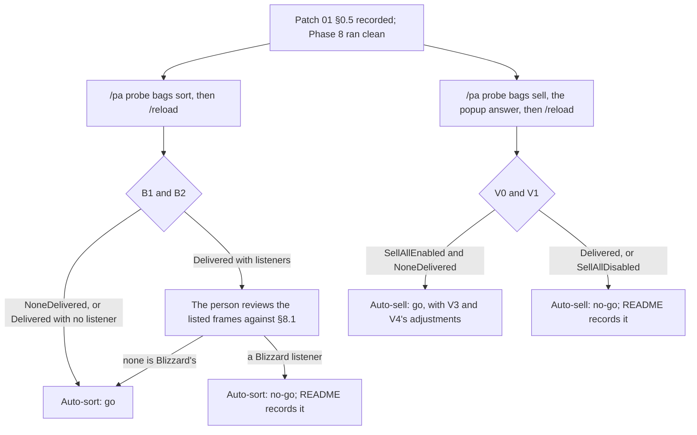
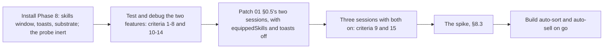

# PersonalAddon — Phase 8 Design
**Date:** September 27, 2026
**API Version:** 1.60.1 (WoW Forever Beta), game type `camelot`; client patched 2026-09-24 19:07 local; UI source exported 2026-09-26
**Implements:** `20260927-Phase08Proposal.md`, as revised by its review of 2026-09-27 (§1.1)
**Depends on:** Phase 1 §6–§9 (registry, dispatch, frame pool, escape neutralization); Phase 4 §6 (the breakdown panel); Phase 6 §5 (`ConfigSchema`); Phase 7 §5.2 (first-read secret check) and §6.3 (Stage A's in-call event window); Patch 01 rev 4 §0.2 and §0.5; README "Rules for future development"
**Revision:** 2 — audit dispositions (§14); the skills window and toasts installed ahead of Patch 01 §0.5 (§3, §9). Revision history at the end.
**Status, 2026-09-27:** §4–§6 and the probe (§8) are implemented, not committed. An offline Lua 5.1 harness passes 169 checks in six sessions, 132 of them for this phase. In-game checks (§12) are pending. Auto-sort and auto-sell (§7) are not built.

---

## 1. Scope

| Item | Kind | Ships |
|---|---|---|
| Equipped skills window | Feature (proposal 3) | Yes (§5) |
| Toasts: looted money, items and quest items; the auto-sell summary | Feature (proposal 4) | Yes, drawn by this addon (§6) |
| Callback-registry subscriptions in `Dispatch` | Substrate | Yes (§4.1) |
| Panel chrome shared with the damage breakdown | Substrate | Yes (§4.2) |
| `FramePool.Prewarm` | Substrate | Yes (§4.3) |
| Auto-sort bags | Feature (proposal 1) | **Specified; built only on the spike's go** (§7.1) |
| Auto-sell junk | Feature (proposal 2) | **Specified; built only on the spike's go** (§7.2) |
| Bag and merchant write spike | Investigation | Built with this phase; run after Patch 01 §0.5 (§8, §9) |
| README changes | Documentation | Yes (§10) |

Citations of the form `File.lua:NN` without a path are in the exported UI source, under
`_classic_beta_/BlizzardInterfaceCode/Interface/AddOns/`. Citations under `Core/` and
`Features/` are this addon.

Types defined in earlier documents and used here unchanged: `Absent` (Phase 6 §5),
`Result<Success, Failure>` (Phase 1), `FeatureId` and `SubscriptionToken` (Phase 1 §6–§7),
`TimerHandle` (Phase 7 §6.5), `EventName` and `FrameTime` (Phase 7 §6.3), `Fraction`
(Phase 2 §5).

### 1.1 What the review changed

Every mechanism the proposal named was checked against the export, the generated API
documentation, `WowB.exe` and the user's WTF files.

| The proposal named | On this client |
|---|---|
| The built-in "Clean Bags" | `C_Container.SortBags()`, which carries no restriction flag (`ContainerDocumentation.lua:554`). The controller already reaches it: Manage Bag → Clean Up Bags (`ContainerFrame.lua:720–727`). Bags marked Ignore are skipped by the client (`Enum.BagSlotFlags.DisableAutoSort`) |
| "When the combined bag is closed" | `ContainerFrame_OnHide` fires `ContainerFrame.CloseBag` on `EventRegistry` (`ContainerFrame.lua:781–782`); the combined bag reaches it through `ContainerFrameTokenWatcherMixin` (`:2665–2666`). The registry calls each callback through `securecallfunction` inside `secureexecuterange` (`CallbackRegistry.lua:198–214`). The Gamepad UI always uses the combined bag (`ContainerFrame.lua:2396`), and the account sets `combinedBags 1` |
| Auto-sell "when interacting with a merchant" | Leaving a merchant closes the bags: `MerchantFrame_OnHide` → `CloseAllBags` (`MerchantFrame.lua:163–167`). Feature 1's trigger fires on every merchant exit |
| Selling the greys | `C_MerchantFrame.SellAllJunkItems()` exists. Blizzard's Sell All Junk button calls it after a confirmation popup (`MerchantFrame.lua:1124–1133`). The user confirms it works on this client. It honours each bag's "exclude from junk selling" flag (`ContainerFrame.lua:673–694`) |
| A toast showing the profit | `Blizzard_MoneyReceipt` loads on this client and prints net money gained to chat when a merchant interaction ends |
| "The player's most relevant current skills" | `C_SkillInfo.GetSkillLineInfoByID` returns rank and maximum regardless of which headers the Skills tab has collapsed (`SkillInfoDocumentation.lua:74–87`). Blizzard's own weapon-skill stat reads it (`Camelot/PaperDollFrame.lua:723–741`). `GetProfessions` and `GetProfessionInfo` return the professions with icons (`Camelot/Blizzard_ProfessionsBook.lua:21, 57`) |
| "The weapon currently equipped" | No API maps a weapon to its skill. Blizzard's two tables disagree: the live one maps fist weapons to 162 and Feral Combat to 3014 (`Camelot/SkillsFrame.lua:10–27`); constants nothing reads say 473 and 134 (`Camelot/PaperDollFrameConstants.lua:1–17`). Defense is 95 (`SkillsFrame.lua:34`) |
| `BossBanner` | `[AllowLoadGameType mainline]` (`Blizzard_FrameXML.toc:100–104`). This client is `camelot`, so it never loads, in either UI mode |
| `LootAlertSystem` | Loads, but only `SHOW_LOOT_TOAST`, `LOOT_ITEM_ROLL_WON` and similar server events feed it (`AlertFrames.lua:598–640`). Ordinary looting never does. No alert file branches on the Gamepad UI. The user has never seen a native loot toast on this client |

| Proposal feature | Outcome |
|---|---|
| 1. Auto-sort bags | Blocked by rule 9 until the spike says go (§7.1, §8) |
| 2. Auto-vend greys | Blocked by rules 8 and 9 until the spike says go (§7.2, §8) |
| 3. Equipped skills window | Ships (§5) |
| 4. Loot and system toasts | Ships, drawn by this addon. The investigation of the native toast is dropped: there is nothing native to restore (§6.1) |

### 1.2 A documented filter for rule 9

The generated documentation flags each event `SynchronousEvent` or `UniqueEvent`.
`QUEST_WATCH_LIST_CHANGED` is synchronous (`QuestLogDocumentation.lua:1408`), and Phase 7
§6.4 saw it delivered inside `AddQuestWatch`. Unique events such as `BAG_UPDATE_DELAYED`
(`ContainerDocumentation.lua:677`) and `QUEST_LOG_UPDATE` are coalesced and dispatched
after the call that caused them.

This phase uses the flag as the first filter, never as the verdict:

- **Unique:** cannot arrive inside a call. Safe to subscribe to.
- **Synchronous:** can arrive inside the call that raised it. Before subscribing, find out
  whether Blizzard's own Lua raises it (rule 1). Before making a call that raises it,
  spike (rule 9).

One observation supports the flag so far. §8 adds two more.

---

## 2. Non-goals

- **Anything inside Blizzard's toast system.** No `AddAlert` call, no alert template
  inherited, no hook on `AlertFrame` (§6.1).
- **Pressing Blizzard's Sell All Junk button or answering its popup** (§3).
- **Sorting or selling in combat.**
- **Sorting the bank**, and per-bag sort configuration: the client's own Ignore flags stay
  the only one.
- **Toasting items the player did not loot:** purchases, quest rewards, created items (§6.3).
- **Skill modifiers, skill names, or secondary professions in the skills window**, except
  Fishing while a fishing pole is equipped (§5.1).
- **Fixing Patch 01 §0.5.** This phase only sequences itself after it (§9).

## 3. Decisions taken

**Features 3 and 4 ship; features 1 and 2 are specified in full and built only on the
spike's go.** The user's decision, 2026-09-27. Both write client state that Blizzard's
frames listen to (§8.1), and rule 8 names the merchant.

**The skills window and toasts are installed now, so they can be tested and debugged. The
spike waits for Patch 01 §0.5's two confirmation sessions.** The user's decisions,
2026-09-27; revision 1 had also held back the installation. Those sessions decide whether
our settings page causes the refused gameplay presses. They stay comparable if run with
`equippedSkills` and `toasts` switched off (`/pa off <feature>`): a disabled feature
subscribes to nothing and draws nothing. The settings page still gains the two features'
controls, but Patch 01 §0.2's mechanism is triggered by drawing the page at all, not by
which controls it holds.

**Toasts are this addon's own.** The user has never seen a native loot toast on this
client, and the export shows why (§1.1). No spike outcome could have made the native toast
the design. Showing one from our code means calling `AddAlert` in our execution, which
writes Blizzard's alert queue and pooled frames (rule 2).

**Every equipped weapon gets a row.** The user's decision: main hand, off-hand weapon and
ranged, one row per distinct skill. An empty main hand shows Unarmed.

**Auto-sell makes the call the confirmation makes, so no popup appears.** The user asked
for the sale to run by itself with the confirmation accepted. The popup's Accept runs
`MerchantFrame_OnSellAllJunkButtonConfirmed`, which calls
`C_MerchantFrame.SellAllJunkItems()` and nothing else (`MerchantFrame.lua:1124–1126`).
Calling it directly has the same result. Pressing the button from our code would run its
`OnClick` in our execution, and answering the popup would run `StaticPopup`'s Lua there
(rules 1 and 2).

**Loot is read from chat.**
- `CHAT_MSG_LOOT` and `CHAT_MSG_MONEY` originate in server packets, so no Blizzard Lua
  raises them.
- Neither is among the 47 chat events the client makes secret under chat-messaging lockdown
  (`ChatInfoDocumentation.lua:1816, 1843`). The lockdown predicate covers dungeons and raids
  (`SecretPredicatesDocumentation.lua:65–68`).
- Reading the loot window instead would need `LOOT_SLOT_CLEARED`, which the loot frame can
  raise through `LootSlot()` on a controller press.

**The skills window subscribes to no client event.** It reads when the bag opens and polls
while it is shown. Both alternatives are synchronous events. The Skills tab raises
`SKILL_LINES_CHANGED` inside controller clicks (`SkillsFrame.lua:341–343`).
`PLAYER_EQUIPMENT_CHANGED` is unclassified. The poll costs about twelve reads a second, and
only while the bag is open.

**Every frame this phase draws is parented to `UIParent` or to our own frames, and created
at enable.** SmartNavigation post-hooks `CreateFrame`. When a new frame's parent chain
reaches a tracked panel, the hook rebuilds that panel's navigation state in the caller's
execution (`SmartNavigation.lua:203–209, 918–929, 1651–1656`). That is Patch 01 §0.2's
mechanism. Parentage is today's guarantee. Creating at enable keeps us out of the hook's
path even if the Alpha changes its condition.

**Toasts are one feature that owns the display and loot capture, and offers the display to
other features.** Two toggles for one visible thing would confuse the user. Auto-sell also
needs the display whether or not loot notices are wanted. Loot notices are therefore
toggles inside the feature.

---

## 4. Substrate

### 4.1 `Dispatch`: callback-registry subscriptions

Features 1 and 3 need `ContainerFrame.OpenBag` and `ContainerFrame.CloseBag`, which only
`EventRegistry` delivers. Registering there directly would leave a gap in the disable
guarantee. After every disable, `Registry` releases the feature's `Dispatch`
subscriptions unconditionally (`Core/Registry.lua:56–68`, Phase 1 §6.1). A callback
registered outside `Dispatch` would survive a disable that raised part-way. So `Dispatch`
gains a second form.

```
type CallbackEventName = string
type CallbackPayload   = List<opaque>
type CallbackHandler   = (payload: CallbackPayload) -> None

type SubscribeFailure =
      EventUnsupported
    | CombatLogUnavailable
    | CallbackRegistryUnavailable

# Subscribes a feature to an event Blizzard delivers through EventRegistry.
# pre:  featureId is registered and Enabling or Enabled
# post: Success -> the registration uses an owner table this addon creates for the
#       subscription: never a number, which the registry reserves
#       (CallbackRegistry.lua:118-122), and never nil; the handler receives deliveries
#       as deliver_callbacks states; SubscriptionCount and UnsubscribeAll include it
#       Failure(CallbackRegistryUnavailable) -> EventRegistry or its RegisterCallback is
#       absent, or registration raised; surfaced once; nothing is recorded
# raises: never
function subscribe_callback(
    featureId: FeatureId,
    eventName: CallbackEventName,
    handler: CallbackHandler
) -> Result<SubscriptionToken, SubscribeFailure>

# What the registry calls. Runs inside Blizzard's call, isolated by securecallfunction
# (CallbackRegistry.lua:198-214).
# post: payload is recorded as the token's latest pending delivery, and one flush is
#       scheduled with C_Timer.After(0) if none is; writes only this addon's tables and
#       calls nothing else
# raises: never
function on_registry_delivery(
    token: SubscriptionToken,
    payload: CallbackPayload
) -> None

# The flush, in this addon's own execution.
# post: every live token with a pending delivery has its handler called once, through
#       Isolation.Call, with the latest payload; tokens released since are skipped; a
#       handler that raises faults its feature, as for client events
# raises: never
function deliver_callbacks() -> None
```

- **Rule 5 becomes structural on this path.** No feature can run work inside the bag's
  `OnShow` or `OnHide`: the flush is the only caller of a handler.
- **Coalescing is safe because consumers are level-triggered.** A handler reads the bag's
  current `IsShown()`, never the event's name. An open and a close in one frame therefore
  resolve to what is on screen.
- **Only `EventRegistry` is accepted.** Rule 1 allows callbacks delivered through Blizzard's
  callback registry. No other Blizzard table receives a function of ours.
- **Release** calls `UnregisterCallback(event, owner)`, which only clears a key that exists
  (`CallbackRegistry.lua:225–246`). It runs in our execution: a flush, a disable, or a fault
  raised in a flush. It never runs inside a delivery.

### 4.2 `PanelChrome`: one source for the panel look

The skills window must look like the damage breakdown. `DamageBreakdown` owns that look
today (`Features/DamageBreakdown.lua:314–437`):

- the frame-template chain;
- the four-step border chain;
- a background texture that alone carries the opacity.

Two consumers now need it, which meets Phase 2 §13's bar, so it moves to
`Core/PanelChrome.lua`.

```
type FrameStrata = string

type BorderStyle =
      Backdrop(template: string)
    | TemplateBorder(template: string)
    | ManualEdges

type PanelChromeSpec = {
    frameName: string | Absent,
    width:     number,
    alpha:     Fraction,
    strata:    FrameStrata
}

type PanelChrome = {
    frame:       Frame,
    background:  Texture,
    borderStyle: BorderStyle
}

# Builds a panel frame styled as the damage breakdown panel is today.
# pre:  called from a feature's enable
# post: the frame is parented to UIParent, hidden, unanchored, mouse-disabled, on
#       spec.strata; it carries the first border this client supports, in Phase 4 §6.1's
#       order; the background alone carries spec.alpha
# raises: never; ManualEdges is the floor and is surfaced once, as today
function build_panel_chrome(spec: PanelChromeSpec) -> PanelChrome

# post: the background alone carries alpha; rows, icons and border are unchanged
# raises: never
function set_panel_alpha(chrome: PanelChrome, alpha: Fraction) -> None
```

`DamageBreakdown` is changed to call it, with no change in behaviour (criterion 1).

### 4.3 `FramePool.Prewarm`

```
# Constructs frames until the pool holds its capacity, and leaves them free.
# pre:  called from a feature's enable
# post: the pool has constructed its full capacity; every frame is reset and free
# raises: never
function prewarm(pool: FramePool) -> integer
```

`Acquire` would otherwise create rows and toasts on first use. Prewarming keeps §3's
"created at enable" true for them.

### 4.4 The subscriptions this phase makes, classified

Rule 1 asks what kind each event is before subscribing. "Raised inside Blizzard's Lua" means
a Blizzard Lua function makes a call that delivers the event before it returns.

| Subscription | Flag | Raised inside Blizzard's Lua? | Used by |
|---|---|---|---|
| `ContainerFrame.OpenBag`, `ContainerFrame.CloseBag` | Callback registry | Yes, inside the bag's `OnShow` and `OnHide`, isolated per callback | Skills window; auto-sort |
| `CHAT_MSG_LOOT`, `CHAT_MSG_MONEY` | Synchronous | No: formatted from server packets. Checked in play (§6.5) | Toasts |
| `MERCHANT_SHOW` | Synchronous | No: the server opens the merchant. `MerchantFrame_MerchantShow` only shows the panel (`MerchantFrame.lua:68–77`) | Auto-sell, on go |
| `BAG_UPDATE_DELAYED` | Unique | Cannot be | Auto-sell, on go |

Considered and not subscribed to:

| Event | Flag | Why not |
|---|---|---|
| `MERCHANT_CLOSED` | Synchronous | Raised by `CloseMerchant()` inside `MerchantFrame_OnHide` (`MerchantFrame.lua:164`), on the panel-hide path Patch 01 traced. Replaced by reading `C_PlayerInteractionManager.IsInteractingWithNpcOfType` |
| `PLAYER_MONEY` | Synchronous | Blizzard's money frames call `PickupPlayerMoney`, which is `HasRestrictions` (`GameCursorDocumentation.lua:87–89`; `Shared/MoneyFrame.lua:43`, `Mainline/MoneyInputFrame.lua:248`). Replaced by reading `GetMoney()` |
| `SKILL_LINES_CHANGED` | Synchronous | Raised inside the Skills tab's clicks (`SkillsFrame.lua:341–343, 497–499`). Replaced by polling |
| `PLAYER_EQUIPMENT_CHANGED` | Synchronous | Unclassified; polling makes it unnecessary |
| `LOOT_SLOT_CLEARED`, `LOOT_CLOSED` | Synchronous | `LootSlot()` and `CloseLoot()` are called from the loot frame (`LootFrame.lua:143, 210–216`). Reading chat makes them unnecessary |
| `ITEM_DATA_LOAD_RESULT`, `GET_ITEM_INFO_RECEIVED` | Synchronous | `RequestLoadItemDataByID` may deliver them, inside the call, to Blizzard's item listener. Nothing is requested; quality is read from the cache (§6.3) |

---

## 5. Equipped skills window

### 5.1 Rows

In this order:

1. **Primary professions**, zero to two, in the order `GetProfessions` returns them. Icon,
   rank and maximum come from `GetProfessionInfo`.
2. **Weapon skills.** One row per distinct skill line across the main hand, off hand and
   ranged slots (`INVSLOT_MAINHAND` 16, `INVSLOT_OFFHAND` 17, `INVSLOT_RANGED` 18,
   `Constants.lua:151–153`), in that order. The icon is the equipped item's own.
   - An off-hand item that is not a weapon, such as a shield or a held item, adds no row.
   - An empty main hand yields Unarmed, drawn with the empty slot's own art, as the paper
     doll shows it (`C_PaperDollInfo.GetInventorySlotInfoForInvSlot`,
     `PaperDollInfoDocumentation.lua:182–198`).
   - A fishing pole yields the Fishing profession's row, from the fourth value
     `GetProfessions` returns (`Camelot/Blizzard_ProfessionsBook.lua:21`).
3. **Defense**, skill line 95, with `Interface\Icons\Ability_Defend`, the icon Blizzard's
   pet bar uses on this client for Defensive (`PetActionBar.lua:3`). `SetTexture` reports
   success (`SimpleTextureBaseAPIDocumentation.lua:604–619`), so an icon that fails to load
   is hidden rather than drawn wrong.

Each row shows its icon and `rank / maximum`, as the proposal specifies. In practice there
are at most six rows; the row pool holds eight.

### 5.2 Weapon to skill line

No client API maps a weapon to its skill. The table below is taken from Blizzard's live
list (`Camelot/SkillsFrame.lua:10–27`), keyed by `Enum.ItemWeaponSubclass`
(`ItemConstantsDocumentation.lua:618–645`).

| Weapon subclass | Candidate skill lines, in order |
|---|---|
| `Axe1H`; `Axe2H` | 44; 172 |
| `Mace1H`; `Mace2H` | 54; 160 |
| `Sword1H`; `Sword2H` | 43; 55 |
| `Polearm`; `Staff`; `Dagger` | 229; 136; 173 |
| `Bows`; `Guns`; `Crossbow`; `Thrown`; `Wand` | 45; 46; 226; 176; 228 |
| `Unarmed` (fist weapons), and an empty main hand | **162, then 473** |
| `Fishingpole` | The Fishing profession (§5.1) |
| `Warglaive`, `Bearclaw`, `Catclaw`, `Generic`, `Obsolete3` | None: no row; `/pa skills` lists the slot |

Fist weapons carry two candidates because Blizzard's tables disagree (§1.1). The live table
sets the order. The first candidate the client knows is used, and `/pa skills` reports which
one.

### 5.3 Reads

```
type SkillLineId     = integer
type SkillRank       = integer
type InventorySlotId = integer
type ItemId          = integer
type IconId          = integer | string

type ProfessionSlots = {
    primary: List<integer>,
    fishing: integer | Absent
}

type ProfessionReading = {
    icon:    IconId,
    rank:    SkillRank,
    maximum: SkillRank
}

type SkillLineReading = {
    rank:    SkillRank,
    maximum: SkillRank
}

type SkillGateway = {
    professionSlots:  () -> ProfessionSlots,
    profession:       (index: integer) -> ProfessionReading | Absent,
    skillLine:        (id: SkillLineId) -> SkillLineReading | Absent,
    equippedItem:     (slot: InventorySlotId) -> ItemId | Absent,
    equippedIcon:     (slot: InventorySlotId) -> IconId | Absent,
    emptySlotIcon:    (slot: InventorySlotId) -> IconId | Absent,
    weaponSubclass:   (item: ItemId) -> ItemWeaponSubclass | Absent,
    combinedBagShown: () -> boolean
}
```

| Field | Client call |
|---|---|
| `professionSlots` | `GetProfessions()`: primaries are the first two values, fishing the fourth |
| `profession` | `GetProfessionInfo(index)`: texture, rank, maxRank |
| `skillLine` | `C_SkillInfo.GetSkillLineInfoByID(id)`: `rank`, `maxRank` |
| `equippedItem`, `equippedIcon` | `GetInventoryItemID("player", slot)`, `GetInventoryItemTexture("player", slot)` |
| `emptySlotIcon` | `C_PaperDollInfo.GetInventorySlotInfoForInvSlot(slot)`: the slot's own texture, for the Unarmed row |
| `weaponSubclass` | `C_Item.GetItemInfoInstant(item)`: `subClassID` when `classID` is `Enum.ItemClass.Weapon` |
| `combinedBagShown` | `ContainerFrameCombinedBags:IsShown()`, which only reads a Blizzard frame |

None of `ExpandSkillHeader`, `CollapseSkillHeader`, `SetSelectedSkill` or an index-based
`GetSkillLineInfo` is ever called. The gateway is the seam the offline harness stubs.

```
type SkillRowSource =
      PrimaryProfession(index: integer)
    | Fishing(index: integer)
    | WeaponSkill(slot: InventorySlotId, skillLine: SkillLineId)
    | Defense

type SkillRow = {
    source:  SkillRowSource,
    icon:    IconId | Absent,
    rank:    SkillRank,
    maximum: SkillRank
}

type UnresolvedWeapon = {
    slot:     InventorySlotId,
    subclass: ItemWeaponSubclass | Absent
}

type SkillsSnapshot = {
    rows:       List<SkillRow>,
    unresolved: List<UnresolvedWeapon>
}

# Resolves the skill line a weapon trains.
# post: the first candidate in §5.2's table for which skills.skillLine returns a
#       reading; Absent when none does, or when the subclass has no candidates
# raises: never
function resolve_weapon_skill(
    subclass: ItemWeaponSubclass,
    skills: SkillGateway
) -> SkillLineId | Absent

# Reads every row the window shows.
# pre:  none; with the capability Withheld (§5.4) only profession rows are read
# post: rows in §5.1's order; a weapon skill appears once, at the first slot that trains
#       it. An Absent main-hand item is the Unarmed subclass, decided without a client
#       call. An Absent off-hand or ranged item has no row and is not unresolved. A slot
#       holding a weapon that resolves to nothing is listed in unresolved and has no row.
#       A profession or skill line that reads Absent, or fails the secret check, has no
#       row
# raises: never
function read_skills(skills: SkillGateway) -> SkillsSnapshot
```

### 5.4 Capability

`GetProfessions` and `GetProfessionInfo` are legacy globals that the generated
documentation does not cover, so their secrecy is unknown. `GetSkillLineInfoByID` carries
no secret flag. Phase 7 §5.2's rule applies: check once, cache the verdict, and check every
later read the same way.

```
type SkillReadCapability =
      NotYetRead
    | Readable
    | Withheld(reason: string)

# Checks, once per session, that the skill reads return plain values.
# post: Readable when GetSkillLineInfoByID exists and a read of Defense returns Absent or
#       numbers that pass issecretvalue where the client provides it; Withheld otherwise,
#       surfaced once. A later profession read that fails the check drops that row and
#       is counted, without withdrawing the capability
# raises: never
function check_skill_capability(skills: SkillGateway) -> SkillReadCapability
```

### 5.5 Visibility and refresh

```mermaid
stateDiagram-v2
    [*] --> Hidden
    Hidden --> Shown: flush, combined bag shown. Read, render, start the poll
    Shown --> Shown: poll tick. Read; render only when the snapshot differs
    Shown --> Hidden: flush, combined bag hidden. Cancel the poll, hide
    Shown --> Hidden: disable
    Hidden --> Hidden: flush, combined bag hidden
```



- Both bag callbacks share one handler (§4.1), which reads `combinedBagShown`. That is why no
  event name appears in the diagram.
- The poll is a `C_Timer.NewTicker` at `pollSeconds`. It exists only while `Shown`, and
  every exit from `Shown` cancels it.
- **The window is shown exactly while the bag is visible.** When a parent hides the bag, as
  a fullscreen re-parent does (`ContainerFrame.lua:131`), the bag's `OnHide` still fires
  `CloseBag`, so the window follows.

### 5.6 Placement

- **Anchor.** The panel's `TOPRIGHT` is anchored to `ContainerFrameCombinedBags`'s
  `TOPLEFT`, at the configured offsets.
- **Strata and screen.** It sits on the bag's strata, `MEDIUM` (`ContainerFrame.xml:308`),
  and is clamped to the screen.
- **Direction.** Our frame is anchored to theirs, which rule 6 permits. The bag is never
  anchored to us, and our frames are never its children.
- **Controller focus.** The window never takes it. It has no buttons and every frame has the
  mouse disabled, so SmartNavigation finds nothing in it.

### 5.7 Configuration

Feature `equippedSkills`, `enabledByDefault = true`, labelled "Equipped skills", described
as "Your professions, the skills of your equipped weapons, and Defense, beside the bags
while they are open."

| Key | Kind | Default | Bounds | Curated | Label |
|---|---|---|---|---|---|
| `anchorOffsetX` | Number | -4 | -300 to 300, step 1 | Yes | "Horizontal offset" |
| `anchorOffsetY` | Number | 0 | -300 to 300, step 1 | Yes | "Vertical offset" |
| `panelAlpha` | Number | 0.8 | 0.1 to 1.0, step 0.05 | Yes | "Panel opacity" |
| `pollSeconds` | Number | 1 | 0.5 to 5, step 0.5 | No | "Refresh interval while open" |

Every key applies live through `onConfigChanged`:

- the offsets re-anchor the panel;
- the opacity goes to the background;
- `pollSeconds` restarts a running poll.

### 5.8 Lifecycle

Phase 1 §6.1's post-condition holds: after `disable`, the feature has zero events, zero
shown frames and zero timers.

- **`enable`** fails, stating the reason, when `ContainerFrameCombinedBags` or
  `C_SkillInfo.GetSkillLineInfoByID` is absent. Otherwise it:
  1. builds the chrome (§4.2);
  2. prewarms the row pool (§4.3);
  3. anchors the panel;
  4. subscribes to the two callbacks;
  5. runs the flush handler once, because the bag may already be open.
- **`disable`** cancels the poll, releases the rows and hides the panel. The registry
  releases the callbacks.
- **After a restart** there is nothing to recover. The window holds no state beyond its
  settings.

### 5.9 Against the README rules

| Rule | Status |
|---|---|
| 1. Blizzard never calls us inline | The bag callbacks are rule 1's callback-registry path, and the handler runs a frame later (§4.1) |
| 2. No writes to Blizzard's tables | The callback registration is rule 1's exception. Nothing else is written |
| 3. Out of the panel system | Our frame is never shown or hidden through the panel system |
| 4. Post-hooks only | No hook |
| 5. Deferred work | Structural (§4.1) |
| 6. We draw on our own frames | Anchored to the bag, parented to `UIParent` |
| 7. No protected calls | Reads only |
| 8. Blizzard UI panels | The bag frame itself is not changed |
| 9. Calls that run Blizzard's listeners | No call changes client state |

---

## 6. Toasts

### 6.1 Why the native toast is not used

- `BossBanner`, `TopBannerManager` and `EventToastManager` never load on this client
  (`Blizzard_FrameXML.toc:100–104`).
- `LootAlertSystem` and `MoneyWonAlertSystem` do load, but only server toast events and
  roll wins feed them (`AlertFrames.lua:598–640`). Nothing on this client raises a toast for
  ordinary loot, and nothing suppresses one in gamepad mode.
- Showing one from our code means calling `AddAlert` in our execution. That writes the
  alert queue and acquires pooled Blizzard frames there. Those are rule 2 writes.

The toast is therefore our own. It copies the geometry and art of Blizzard's compact money
toast, `MoneyWonAlertFrameTemplate` (`AlertFrameSystems.xml:842–895`), onto our own frames
for every kind of notice:

- 249 × 71, with the `Interface\LootFrame\LootToast` background and icon-border texture
  coordinates the template uses;
- a 38 × 38 icon, `INV_Misc_Coin_02` for money and the item's own icon for items;
- a `GameFontNormal` label and a `GameFontHighlightLarge` line, placed as the template
  places them.

It never inherits the template, whose mixin and scripts are Blizzard's code. Money is
formatted with `C_CurrencyInfo.GetCoinTextureString`, a client function, rather than
Blizzard's Lua `GetMoneyString`.

### 6.2 The service

```
type Copper      = integer
type ItemLink    = string
type ItemQuality = integer

type ToastRequest =
      LootedItem(itemId: ItemId, name: string, icon: IconId | Absent, quantity: integer, quality: ItemQuality, isQuestItem: boolean)
    | LootedMoney(amount: Copper)
    | JunkSold(itemsSold: integer, revenue: Copper, itemsUnsold: integer, confirmed: boolean)

type ToastUnavailable = ToastsDisabled | NotReady

type PostOutcome =
      Shown
    | Queued
    | Coalesced
    | Dropped
    | Unavailable(reason: ToastUnavailable)

# Queues a notice. The one entry point other features use: ns.Toasts.Post.
# pre:  none; callable whether or not the toasts feature is enabled
# post: Shown when a slot was free; Queued when TOAST_QUEUE_CAPACITY had room; Coalesced
#       when a LootedMoney merged into a queued LootedMoney, or into a visible one whose
#       timer then restarts; Dropped when the queue was full, counted and surfaced once per
#       session; Unavailable when the feature is not Enabled, so the caller can fall back
#       to chat
# raises: never
function post_toast(request: ToastRequest) -> PostOutcome
```

- **Display.** At most `maximumVisible` toasts are on screen, stacked downward from the
  container. Each shows for `durationSeconds` and then fades. The next queued request takes
  the freed slot.
- **Bounded by construction.** The toast pool's capacity is five, the maximum
  `maximumVisible` allows, so visible toasts cannot exhaust it. The queue is capped at
  `TOAST_QUEUE_CAPACITY` (10).
- **Mouse disabled, strata `HIGH`:** above the bags and below dialogs. Toasts are never
  clicked, which suits the controller.

### 6.3 Loot capture

```
type LootPatterns = {
    itemSelf:         Pattern,
    itemSelfMultiple: Pattern,
    moneySelf:        Pattern,
    moneyShare:       Pattern,
    gold:             Pattern,
    silver:           Pattern,
    copper:           Pattern
}

type MissingFormatString = { globalName: string }

type LootMessage =
      ItemLooted(link: ItemLink, itemId: ItemId, quantity: integer)
    | MoneyLooted(amount: Copper)
    | NotOurs
    | Unparsed

type LootVerdict =
      Toast(request: ToastRequest)
    | NotShown
    | Unresolved

type ToastSettings = {
    showLootedItems: boolean,
    showQuestItems:  boolean,
    showLootedMoney: boolean,
    minimumQuality:  ItemQuality
}

# Builds match patterns from the client's own format strings, once at enable.
# post: Success when LOOT_ITEM_SELF, LOOT_ITEM_SELF_MULTIPLE, YOU_LOOT_MONEY,
#       LOOT_MONEY_SPLIT, GOLD_AMOUNT, SILVER_AMOUNT and COPPER_AMOUNT are all strings:
#       pattern magic characters are escaped, and each placeholder becomes a capture,
#       including the positional %1$s form a locale uses to reorder arguments, whose
#       argument index is recorded with the capture; Failure names the first global that
#       is missing
# raises: never
function build_loot_patterns() -> Result<LootPatterns, MissingFormatString>

# Classifies one loot or money chat message. Only the player's own loot matches.
# pre:  text passed issecretvalue as not secret
# post: ItemLooted for the two LOOT_ITEM_SELF forms, with itemId read from the link's
#       "item:" field; MoneyLooted for YOU_LOOT_MONEY and LOOT_MONEY_SPLIT, summing
#       whichever denominations appear; NotOurs for every other message, including
#       LOOT_ITEM_PUSHED_SELF (purchases, quest rewards), created items and other players'
#       loot; Unparsed when a form matched but its link carries no item ID, or a money
#       form matched and no denomination did
# raises: never
function parse_loot_message(
    text: string,
    patterns: LootPatterns
) -> LootMessage

# Decides whether a looted item earns a toast, from the client's item cache alone.
# post: Toast(LootedItem) when showQuestItems is on and the item's class is
#       Enum.ItemClass.Questitem, or showLootedItems is on and the quality is at least
#       minimumQuality; NotShown otherwise; Unresolved when C_Item.GetItemQualityByID
#       returns nothing. The request's name is the link's bracketed text; its icon is
#       C_Item.GetItemInfoInstant's. Nothing is requested from the client (§4.4)
# raises: never
function judge_looted_item(
    itemId: ItemId,
    quantity: integer,
    link: ItemLink,
    settings: ToastSettings
) -> LootVerdict

# Decides whether looted money earns a toast.
# post: Toast(LootedMoney(amount)) when showLootedMoney is on and amount > 0; NotShown
#       otherwise
# raises: never
function judge_looted_money(
    amount: Copper,
    settings: ToastSettings
) -> LootVerdict
```

- **Format strings.** `LOOT_ITEM_SELF` and the others are client globals. The binary
  references their names, but the export does not contain their text. If one is missing,
  loot capture alone fails, surfaced once; the display stays up for auto-sell.
- **Item names.** The name drawn is the link's bracketed text, passed through
  `EscapeGuard.Neutralize` (Phase 1 §9) and coloured with `SetTextColor` from
  `C_Item.GetItemQualityColor`. No escape code from the link reaches a font string.
- **The inbox is bounded.** Messages wait for the next frame in an inbox of
  `LOOT_INBOX_CAPACITY` (20). A message beyond that is dropped and counted.
- **Secret text.** The handler checks the text with `issecretvalue` first, because the
  payload is not marked `NeverSecret` (`ChatInfoDocumentation.lua:1820`). A secret text is
  counted and surfaced once, and makes no toast.
- **Deferral.** The handler only parses and queues. Posting runs one frame later from the
  feature's own queue (rule 5). If §4.4's classification is right, the deferral costs
  nothing.

### 6.4 Configuration

Feature `toasts`, `enabledByDefault = true`, labelled "Toasts", described as "Pop-up
notices for money and notable items you loot, and for junk sold automatically."

| Key | Kind | Default | Bounds | Curated | Label |
|---|---|---|---|---|---|
| `showLootedItems` | Toggle | true | | Yes | "Looted items of green quality or better" |
| `showQuestItems` | Toggle | true | | Yes | "Looted quest items, whatever their quality" |
| `showLootedMoney` | Toggle | true | | Yes | "Looted money" |
| `durationSeconds` | Number | 4 | 2 to 10, step 0.5 | Yes | "Seconds on screen" |
| `anchorOffsetX` | Number | 0 | -800 to 800, step 1 | Yes | "Horizontal position" |
| `anchorOffsetY` | Number | -180 | -800 to 0, step 1 | Yes | "Vertical position, from the top" |
| `minimumQuality` | Number | 2 | 1 to 5, step 1 | No | "Lowest item quality shown (2 is green)" |
| `maximumVisible` | Number | 3 | 1 to 5, step 1 | No | "Toasts on screen at once" |

The container anchors to `UIParent`'s `TOP`. Every key applies live.

### 6.5 Checking §4.4 in play

The classification of `CHAT_MSG_LOOT` and `CHAT_MSG_MONEY` rests on how the client produces
them, not on an observation. So the first `STACK_CHECK_DELIVERIES` (20) deliveries of each
session read `debugstack` inside the handler. A delivery whose stack shows a Lua frame
outside this addon is counted as `deliveredInsideCall` and surfaced once.

The check only reads. It applies Phase 7 §6.3's stack evidence to our own subscription.
Criterion 15 expects zero.

### 6.6 Lifecycle

Phase 1 §6.1's post-condition holds.

- **`enable`**:
  1. builds the container and prewarms the pool;
  2. builds the patterns;
  3. subscribes to the two chat events.

  If the patterns fail, the display stays enabled with loot capture off, and the failure is
  surfaced.
- **`disable`** cancels every toast timer, hides and releases the toasts, and empties the
  queue. From then on `ns.Toasts.Post` answers `Unavailable(ToastsDisabled)`.
- **After a restart** there is nothing to recover. A queued toast is lost with the reload.
  Accepted.

### 6.7 Against the README rules

| Rule | Status |
|---|---|
| 1 | Server-originated chat events, checked in play (§6.5) |
| 2 | Nothing written to Blizzard. Globals are only read, to build the patterns |
| 3, 6 | Our own frames, parented to `UIParent`, outside the panel system |
| 4 | No hook |
| 5 | Posting runs one frame after the handler |
| 7, 9 | Reads only |

---

## 7. Specified, built only on the spike's go

Nothing in this section is built until §8.4 says go for it. Each feature is specified in
full now, so the spike decides a known design (Phase 7 §3).

### 7.1 Auto-sort bags

**Trigger:** the combined bag's callbacks, through `Dispatch.SubscribeCallback` (§4.1). The
flush handler acts only when the bag is hidden.

```
type Seconds = number

type SortSkipReason =
      InCombat
    | BagShown
    | CoolingDown(remaining: Seconds)
    | CursorHoldsItem
    | ItemsLocked(count: integer)

type SortOutcome =
      Sorted(at: FrameTime)
    | Skipped(reason: SortSkipReason)

type BagGateway = {
    inCombat:         () -> boolean,
    combinedBagShown: () -> boolean,
    cursorHasItem:    () -> boolean,
    lockedItemCount:  () -> integer,
    sortBags:         () -> None,
    now:              () -> FrameTime
}

# Sorts the player's bags once, if nothing in them is moving.
# pre:  §8.4 says go for auto-sort
# post: Sorted -> sortBags was called exactly once, and at becomes lastSortAt;
#       Skipped -> nothing was written. The checks run in the order InCombat, BagShown,
#       CoolingDown, CursorHoldsItem, ItemsLocked. A skipped close is never retried: the
#       next close decides afresh
# raises: never
function sort_if_settled(
    bags: BagGateway,
    cooldownSeconds: Seconds,
    lastSortAt: FrameTime | Absent
) -> SortOutcome
```

| Field | Client call |
|---|---|
| `inCombat` | `InCombatLockdown()` |
| `cursorHasItem` | `CursorHasItem()` |
| `lockedItemCount` | `C_Container.GetContainerItemInfo(bag, slot).isLocked`, over the held bags: at most five, so the scan is bounded |
| `sortBags` | `C_Container.SortBags()` |

- **The lock check decouples auto-sort from auto-sell.** A merchant exit closes the bag while
  sales may still be pending, and those items are locked. The same check covers trading,
  mail and a move in progress.
- **Never in combat.** A sort locks items, so pressing a potion on the gamepad bar mid-sort
  would fail.
- **"Closed" means hidden.** In gamepad mode, opening the character frame hides the bag
  (`Camelot/CharacterFrame.lua:801–802`), and a sort follows, subject to the cooldown.
  Accepted.
- **`lastSortAt` is held in memory.** A `/reload` inside the cooldown allows one extra sort.
  Accepted.
- **Lifecycle.** `enable` subscribes to the two bag callbacks. `disable` resets
  `lastSortAt`; the registry releases the callbacks, and a delivery pending in `Dispatch`'s
  flush is skipped with its token. The feature holds no timer.

Feature `autoSortBags`, `enabledByDefault = true`, labelled "Tidy bags when closed",
described as "Runs the game's Clean Up Bags when the bags close, at most once a minute,
never in combat."

| Key | Kind | Default | Bounds | Curated | Label |
|---|---|---|---|---|---|
| `cooldownSeconds` | Number | 60 | 10 to 600, step 10 | Yes | "Minimum seconds between sorts" |

### 7.2 Auto-sell junk

```mermaid
sequenceDiagram
    participant Server
    participant Ours as autoSellJunk
    participant Client
    participant Toasts

    Server->>Ours: MERCHANT_SHOW
    Ours->>Ours: one frame later, our own execution
    Ours->>Client: read: in combat? at a merchant? sell-all enabled? junk count, money
    alt a check fails
        Ours->>Ours: Skipped; nothing written
    else junk present
        Ours->>Client: C_MerchantFrame.SellAllJunkItems(), once
        Client-->>Ours: BAG_UPDATE_DELAYED, after the call (unique)
        Ours->>Client: read junk count and money
        Ours->>Toasts: JunkSold, or chat when Unavailable
    end
```

```
type VendSkipReason =
      InCombat
    | SaleInProgress
    | NotAtMerchant
    | SellAllJunkDisabled
    | NoJunk

type VendManifest = {
    junkBefore:  integer,
    moneyBefore: Copper,
    calledAt:    FrameTime
}

type SettleTrigger = BagsSettled | TimedOut

type VendOutcome =
      Sold(itemsSold: integer, revenue: Copper)
    | Partial(itemsSold: integer, revenue: Copper, itemsUnsold: integer)
    | Unconfirmed(junkBefore: integer, revenue: Copper)

type SettleResult =
      Settled(outcome: VendOutcome)
    | Pending

type MerchantGateway = {
    inCombat:        () -> boolean,
    atMerchant:      () -> boolean,
    junkSellEnabled: () -> boolean,
    junkCount:       () -> integer,
    money:           () -> Copper,
    sellAllJunk:     () -> None,
    now:             () -> FrameTime
}

# Sells every junk item at the open merchant with one client call.
# pre:  §8.4 says go for auto-sell; runs one frame after MERCHANT_SHOW
# post: Success -> sellAllJunk was called exactly once, after junkBefore and moneyBefore
#       were read in the same execution; a settle timeout of VEND_SETTLE_SECONDS is running
#       Failure -> nothing was written. The checks run in the order InCombat,
#       SaleInProgress, NotAtMerchant, SellAllJunkDisabled, NoJunk. SaleInProgress means a
#       manifest is still pending: that sale settles on its own timeout, and the running
#       timeout and manifest are left untouched. SellAllJunkDisabled is surfaced once; the
#       other reasons are silent
# raises: never
function start_vend(merchant: MerchantGateway) -> Result<VendManifest, VendSkipReason>

# Decides whether a started sale has finished, and what it earned.
# pre:  a manifest is pending
# post: BagsSettled with a junk count of 0 -> Settled(Sold); BagsSettled above 0 ->
#       Pending; TimedOut below junkBefore -> Settled(Partial); TimedOut with no change ->
#       Settled(Unconfirmed), whatever the money did. revenue = money() - moneyBefore in
#       every outcome. On Settled the manifest is cleared and the timeout cancelled
# raises: never
function settle_vend(
    manifest: VendManifest,
    trigger: SettleTrigger,
    merchant: MerchantGateway
) -> SettleResult
```

| Field | Client call |
|---|---|
| `atMerchant` | `C_PlayerInteractionManager.IsInteractingWithNpcOfType(Enum.PlayerInteractionType.Merchant)` |
| `junkSellEnabled` | `C_MerchantFrame.IsSellAllJunkEnabled()` |
| `junkCount` | `C_MerchantFrame.GetNumJunkItems()`, the count Blizzard's button uses (`MerchantFrame.lua:210–212`) |
| `money` | `GetMoney()` |
| `sellAllJunk` | `C_MerchantFrame.SellAllJunkItems()` |

- **No popup.** See §3.
- **One call per visit, with no visit tracking.** A second `MERCHANT_SHOW` in the same visit
  reads a junk count of 0 and returns `NoJunk`.
- **Subscriptions.** `BAG_UPDATE_DELAYED` is subscribed to at enable. Its handler returns at
  once when no manifest is pending.
- **Revenue is measured, not computed.** It is the change in `GetMoney()` from just before
  the call to the settle point. A purchase or repair inside that window, usually under half
  a second, would be counted in. Accepted: `Blizzard_MoneyReceipt`'s line on leaving the
  merchant remains the full account.
- **The summary.** The outcome is posted as `JunkSold`, mapped as below. `Partial` and
  `Unconfirmed` say so in the toast. When the post returns `Unavailable` or `Dropped`, the
  same summary goes to chat through `Log.Info`, so it is never lost.

  | Outcome | `itemsSold` | `revenue` | `itemsUnsold` | `confirmed` |
  |---|---|---|---|---|
  | `Sold(n, r)` | n | r | 0 | true |
  | `Partial(n, r, u)` | n | r | u | true |
  | `Unconfirmed(j, r)` | 0 | r | j | false |
- **Buyback holds 12.** Selling more pushes older buyback entries out, including anything
  sold by hand earlier in the session. Accepted.
- **The server picks the items.** No slot index is ours, so:
  - a concurrent sort cannot make us sell the wrong item;
  - a merchant closing mid-sale cannot turn a sale into an equip, which is the classic
    `UseContainerItem` hazard.

- **Lifecycle.** `enable` subscribes to `MERCHANT_SHOW` and `BAG_UPDATE_DELAYED`. `disable`
  cancels the pending one-frame deferral of a `MERCHANT_SHOW`, cancels the settle timeout
  and clears the manifest; the registry releases the subscriptions. A sale already sent to
  the server completes there, unreported. After a restart there is nothing to recover: the
  manifest lives in memory, and a sale in flight belongs to the server.

Feature `autoSellJunk`, `enabledByDefault = true`, labelled "Sell junk automatically",
described as "Sells every grey item when you open a merchant, with the game's own Sell All
Junk, without the confirmation." It has no keys.

### 7.3 Against the README rules

| Rule | Auto-sort | Auto-sell |
|---|---|---|
| 1 | Callback registry, deferred (§4.1) | `MERCHANT_SHOW` from the server; `BAG_UPDATE_DELAYED` is unique |
| 2 | No write to Blizzard's tables | No write; the button and popup are untouched |
| 5 | Structural (§4.1) | Runs one frame after `MERCHANT_SHOW` |
| 7 | `SortBags` carries no restriction flag | `SellAllJunkItems` carries none (`MerchantFrameDocumentation.lua:86–88`) |
| 8 | Not a panel | The merchant: §8 is the spike |
| 9 | §8, question B1 | §8, question V1 |

---

## 8. The spike

### 8.1 What rule 9 asks

Both writes change state that Blizzard's frames listen to through synchronous events:

| Event | Flag | Blizzard listeners on this client |
|---|---|---|
| `BAG_UPDATE` | Synchronous (`ContainerDocumentation.lua:661`) | The merchant frame, always (`MerchantFrame.lua:11`); the bag bar (`Camelot/MainMenuBarBagButtons.lua:110`, `Shared/MainMenuBarBagButtons.lua:275`); the paper doll (`Camelot/PaperDollFrame.lua:336`); gamepad flyout buttons while they hold a flyout (`ActionBarButton.lua:894–909`) |
| `ITEM_LOCK_CHANGED` | Synchronous (`ContainerDocumentation.lua:721`) | Container frames, only while shown (`ContainerFrame.lua:793, 821`); the cooldown viewer, when active |
| `MERCHANT_UPDATE` | Synchronous | The merchant frame, always (`MerchantFrame.lua:8`) |
| `PLAYER_MONEY` | Synchronous | Money frames (`Mainline/MoneyFrame.lua:30`); the merchant frame's repair state |

If any of these events is delivered while our call runs, those handlers run in our
execution, and whatever they write carries our taint. The spike asks whether that happens.

### 8.2 Method: our own call only

This reuses Phase 7 Stage A's window (§6.3, S8). Immediately before the call, a probe
frame registers for every event (`RegisterAllEvents`,
`SimpleFrameAPIDocumentation.lua:1008`). Immediately after, in the same execution, it
unregisters. Any delivery it records arrived while the call was running.

**There is no passive stage.** Phase 7's Stage P listened to Blizzard's own watch changes.
Patch 01 §0.5 could not rule that listener out as a cause: a synchronous event runs its
handler inside Blizzard's call. This spike wraps only calls it makes itself.

After the window closes, still in the same execution, the probe reads
`GetFramesRegisteredForEvent(name)` for each recorded event and records each frame's name,
or its debug name when it has none. If the client lacks that function, B2 and V2 fall back
to §8.1's table. The list can include other addons' frames, which the probe cannot tell
apart from Blizzard's, so the probe never decides a `Delivered` result with listeners on
its own: it prints the list for the person to judge (§8.5).

Outside its windows the probe registers exactly one thing: `BAG_UPDATE_DELAYED`, a unique
event, and only while V3 waits.

```
type InlineEvents =
      NoneDelivered
    | Delivered(names: List<EventName>)
    | NotTested

type ListenerReport =
      Listeners(byEvent: Map<EventName, List<string>>)
    | ListenersUnavailable
    | NotTested

type SettleObservation =
      SettledWithin(seconds: Seconds, junkAfter: integer, revenue: Copper)
    | DidNotSettle
    | NotTested

type PopupObservation = PopupSeen | NoPopup | NotTested

type EnabledObservation = SellAllEnabled | SellAllDisabled | NotTested

type BagWriteSpikeReport = {
    b1SortInline:    InlineEvents,
    b2SortListeners: ListenerReport,
    v0JunkEnabled:   EnabledObservation,
    v1SellInline:    InlineEvents,
    v2SellListeners: ListenerReport,
    v3Settle:        SettleObservation,
    v4Popup:         PopupObservation
}

# Runs one write inside an all-events window and records what arrived during it.
# pre:  out of combat; the probe frame holds no registration; write is SortBags with the
#       bag hidden and nothing locked, or SellAllJunkItems at a merchant with at least one
#       junk item
# post: the probe frame holds no registration; the names are exactly the events delivered
#       between the register and unregister calls, deduplicated, in arrival order
# raises: never
function capture_inline_events(write: () -> None) -> InlineEvents
```

| # | Question |
|---|---|
| B1 | Is any event delivered while `SortBags` runs, with the bag hidden? |
| B2 | For each B1 event, which frames were registered for it at that moment? |
| V0 | Does `IsSellAllJunkEnabled()` return true? The user reports that it works |
| V1 | Is any event delivered while `SellAllJunkItems` runs? |
| V2 | As B2, for V1's events |
| V3 | Do the junk count and money settle at a `BAG_UPDATE_DELAYED` within `VEND_SETTLE_SECONDS`, and with what revenue? |
| V4 | Does any confirmation appear after the call? Observed by the person |

A question the procedure never reached reads `NotTested`, never a pass (Phase 2 §4).

### 8.3 Procedure

1. **Precondition:** Patch 01 §0.5's two confirmation sessions are complete and recorded,
   and the skills window and toasts have run clean for three sessions (§9).
2. Run `/pa blocked clear`.
3. **Sort.** Out of combat, with the bags closed and nothing on the cursor, run
   `/pa probe bags sort`. It prints B1 and B2. Then `/reload`.
4. **Sell.** At a merchant, carrying at least one grey item:
   1. Run `/pa probe bags sell`. It prints V0, V1 and V2 at once, and V3 when the sale
      settles or times out.
   2. Answer V4 with `/pa probe bags popup seen` or `/pa probe bags popup none`. That
      prints the whole report and turns the probe off.
   3. `/reload`.
5. Copy the report into §8.4.

The `/reload` after each write discards any state a delivered event could have tainted. A
refusal that BlockWatch records between a write and its reload is that question's answer,
not a new defect.

### 8.4 Results

Not yet run.

### 8.5 Decision rule

| Result | Consequence |
|---|---|
| B1 `NoneDelivered` | Auto-sort: **go** |
| B1 `Delivered`, and B2 lists no frame at all | **Go.** Nothing listened, so nothing ran in our execution |
| B1 `Delivered`, and B2 lists frames | **Review.** The probe prints the frames. Go only if the person finds none of them is Blizzard's, and §8.1 lists no Blizzard listener of those events that registers outside a container frame's `OnShow`: §7.1 sorts only while the bag is hidden, when its container frames are unregistered. Otherwise **no-go**, and the README records the events and listeners |
| V0 `SellAllDisabled` | Auto-sell: **no-go on this client**, contradicting the user's report. Recheck at another merchant |
| V1 `NoneDelivered` | Auto-sell: **go** |
| V1 `Delivered` | Auto-sell: **no-go.** The merchant frame always listens to `BAG_UPDATE` and `MERCHANT_UPDATE` |
| V3 `DidNotSettle` | Go if V1 is clean, with `settle_vend` reduced to the timeout alone |
| V4 `PopupSeen` | Go if V1 is clean. The popup is Blizzard's, shown in its own execution; the README notes the extra press |
| B1, V0 or V1 `NotTested` | Undecided. Complete the procedure |



The probe lives in `Spikes/BagWriteProbe.lua`, behind the `/pa probe bags` route. It is an
internal feature, `bagWriteProbe`, off by default, like Phase 7's probe. The first `sort`
or `sell` command enables it, and the final V4 answer disables it; a bare `/pa probe bags`
only prints the report. It makes no call until one of those commands is typed. Once §8.4 is filled in, the probe and its route are
deleted (Phase 6 §4.1).

---

## 9. Sequencing with Patch 01 §0.5



- **The two features are installed first**, the user's decision (§3), so they can be tested
  and debugged in play. The probe is installed with them and does nothing until a
  `/pa probe bags` command is typed.
- **Patch 01's sessions run with the two features off.** A disabled feature subscribes to
  nothing and draws nothing, so those sessions test the same code paths the Phase 7 build
  had, apart from the settings page's extra controls (§3).
- **The spike runs after the two features have run clean**, so that a refusal during the
  spike belongs to the spike.
- **Phase 7's release** (its criteria 19–21: TOC version and phase, README) is its own step.
  This build adds files to the TOC and leaves its version lines alone.

---

## 10. README changes

- **Features:** add "Equipped skills" and "Toasts". On go, add "Tidy bags when closed" and
  "Sell junk automatically". The latter should say that no confirmation appears, because
  the addon makes the call the confirmation makes.
- **"What the game already does":**
  - Clean Up Bags is in the bag's Manage menu, reachable with the controller.
  - The merchant window has a Sell All Junk button.
  - Leaving a merchant prints the money gained to chat.
- **"Tried and not deliverable":**
  - Blizzard's own loot toasts: `BossBanner` does not load on this client, and ordinary
    loot never feeds the alert system.
  - On a no-go, auto-sort or auto-sell, with the §8 question that stopped it.
- **Rule 1's first sub-bullet** gains: "The generated docs flag each event
  `SynchronousEvent` or `UniqueEvent`. A unique event cannot arrive inside a call. A
  synchronous one can, so find out who raises it."
- **Rule 6** gains its reason: "SmartNavigation rebuilds a panel's navigation state in the
  caller's execution when a frame is created under that panel (Patch 01 §0.2). A child we
  created under a Blizzard panel would put our taint there."
- **Rule 9** gains: "The `SynchronousEvent` flag narrows which calls to spike. It does not
  replace the spike."

---

## 11. Failure modes

| Failure | Detection | Behaviour |
|---|---|---|
| `ContainerFrameCombinedBags` absent | `enable` | The skills window fails to enable, with the reason |
| `EventRegistry` absent, or registration raises | `subscribe_callback` | `CallbackRegistryUnavailable`: the enable fails, surfaced |
| A feature faults mid-disable | Registry | `UnsubscribeAll` releases its callbacks too (§4.1) |
| The bag opens and closes within one frame | Flush | Resolves to what is on screen; no work for a bag that never showed |
| The bag is hidden by a parent | Its `OnHide` fires `CloseBag` | The window hides; auto-sort treats it as a close |
| The bag moves | Anchor | The window follows, clamped to the screen |
| `GetProfessions` or `GetProfessionInfo` absent or secret | Capability and per-read checks | Profession rows omitted, surfaced once |
| `GetSkillLineInfoByID` absent | `enable` | The enable fails, with the reason |
| A weapon subclass with no candidates, or none the client knows | `resolve_weapon_skill` | No row; `/pa skills` lists the slot |
| Fist weapons | `resolve_weapon_skill` | 162, then 473; `/pa skills` says which resolved |
| A shield or held item in the off hand | No weapon subclass | No row |
| A loot format global missing | `build_loot_patterns` | Loot capture off, display kept; surfaced once, naming the global |
| Loot text secret | `issecretvalue` | Skipped and counted; surfaced once |
| Item quality not cached | `judge_looted_item` | `Unresolved`: no toast, counted |
| A money message without a denomination | `parse_loot_message` | `Unparsed`: counted, surfaced once |
| A chat event delivered inside Blizzard Lua | §6.5 stack check | Counted and surfaced; §4.4's row is reopened |
| A burst of loot | Queue | Up to `maximumVisible` on screen and 10 waiting, money coalesced; beyond that, dropped and counted |
| Toasts disabled, or the queue full, when a sale posts | `Unavailable(ToastsDisabled)` or `Dropped` | The summary goes to chat |
| More than 20 loot messages before the next frame | Inbox bound | The excess is dropped and counted |
| A locale reorders a loot message's placeholders | Positional captures | Each capture is mapped to its argument index |
| An icon texture fails to load | `SetTexture` returns false | The icon is hidden; the row or toast still shows |
| A roll win also toasted by Blizzard | Not detected | Two toasts. Accepted: never seen on this client |
| A sort due in combat, on cooldown, with the cursor full or items locked | `sort_if_settled` | Skipped, counted by reason in `/pa bags`, not retried |
| The sell-all switch is off | `start_vend` | `SellAllJunkDisabled`, surfaced once |
| The merchant closes before the sale runs | `atMerchant` read | `NotAtMerchant`; nothing written |
| A merchant reopened while a sale is still settling | Pending manifest | `SaleInProgress`: nothing written; the pending sale settles on its own timeout |
| Disabled while a sale is settling | `disable` | Deferral and timeout cancelled, manifest cleared; the server completes the sale unreported |
| The sale never settles | Timeout | `Partial` or `Unconfirmed`, shown as such |
| A purchase inside the settle window | Not detected | Counted in the revenue. Accepted |
| Spike: a question never reached | `NotTested` | Never read as a pass |
| Spike: an event delivered inside our call | B1, V1 | No-go, unless B2 shows no Blizzard listener (§8.5) |
| `/reload` or client crash at any point | Only settings persist | Features rebuild at enable; `lastSortAt` resets; a queued toast is lost. A crash during `SellAllJunkItems` leaves the sale to the server |

---

## 12. Exit criteria

**Substrate:**

1. The damage breakdown panel is unchanged after the chrome moves: same size, anchor,
   border style (as `/pa dps` reports it) and opacity behaviour.
2. `/pa status` counts callback subscriptions in each feature's total, and shows zero for
   every Phase 8 feature after its disable.

**Skills window:**

3. Opening the bags with the controller shows the window at the bag's left edge, and closing
   them hides it. Opening the character frame, which hides the bag in gamepad mode, hides
   the window too.
4. The rows are the primary professions, one per distinct equipped weapon skill, then
   Defense. Every `rank / maximum` equals the Skills tab's.
5. Equipping a different weapon type with the bags open updates its row within
   `pollSeconds`.
6. Two weapons of one type make one row. A shield makes none. An empty main hand shows
   Unarmed, and a fishing pole shows Fishing.
7. `/pa skills` names the fist-weapon skill line that resolved, or reports `NotTested` when
   no fist weapon was tried.
8. Controller navigation of the bag is unchanged with the window shown: items, the Manage
   menu and closing all work, and the window never takes focus.
9. Three sessions with the window enabled record no refusal naming PersonalAddon beyond
   the baseline Patch 01 §0.5 recorded.

**Toasts:**

10. Looting a green item shows its icon and its quality-coloured name. A white item shows
    nothing. A quest item of any quality shows. Money shows its amount, including a group
    share.
11. Buying from a vendor, taking a quest reward and crafting show nothing.
12. Loot toasts appear inside a dungeon. This verifies that loot chat is outside chat
    lockdown.
13. Six loot messages in one second show at most `maximumVisible` toasts at once, lose none
    below the queue cap, and merge the money.
14. `/pa toasts test` posts one toast of each kind at the configured position, and changing
    the offsets moves them live.
15. `/pa toasts` reports `deliveredInsideCall = 0` after three sessions (§6.5).

**Spike:**

16. §8.4 holds B1, B2 and V0–V4 and the decision, run in the order §9 gives.

**Only on go:**

17. Closing the bags sorts them. A second close within the cooldown does not. Nor does a
    close in combat, with an item on the cursor, or straight after a merchant sale while
    items are locked.
18. Opening a merchant with greys sells them all with no confirmation. The toast, or the
    chat line when toasts are off, shows the count and the money. When nothing else was
    bought or repaired, the money equals `Blizzard_MoneyReceipt`'s line. Closing and
    reopening the merchant within the settle window starts no second sale.
19. Three sessions with both enabled record no refusal naming PersonalAddon.
20. After `disable`, each shows zero subscriptions, timers and shown frames.

**Release:**

21. `Spikes/BagWriteProbe.lua` and its route are deleted once §8.4 is filled in.
22. The TOC reads `## X-Phase: 8` and `## Version: 1.2.0`, with the new files in load
    order.
23. The README is updated per §10.

---

## 13. Files

| File | Change |
|---|---|
| `Core/Dispatch.lua` | `SubscribeCallback` and its deferred delivery queue; callback subscriptions included in the counts and in `UnsubscribeAll` |
| `Core/PanelChrome.lua` | New: the chrome, moved from `DamageBreakdown` |
| `Core/FramePool.lua` | `Prewarm` |
| `Core/Constants.lua` | `TOAST_QUEUE_CAPACITY`, `TOAST_POOL_CAPACITY`, `LOOT_INBOX_CAPACITY`, `STACK_CHECK_DELIVERIES`, `SKILL_ROW_CAPACITY`, `VEND_SETTLE_SECONDS`, `DEFENSE_SKILL_LINE`, `DEFENSE_ICON` |
| `Core/Debug.lua` | `/pa skills`, `/pa toasts`, `/pa toasts test`; the temporary `/pa probe bags`; on go, `/pa bags` and `/pa vend` |
| `Features/DamageBreakdown.lua` | Uses `PanelChrome`; no behaviour change |
| `Features/EquippedSkills.lua` | New (§5) |
| `Features/Toasts.lua` | New (§6); exposes `ns.Toasts.Post` |
| `Features/AutoSortBags.lua` | On go only (§7.1) |
| `Features/AutoSellJunk.lua` | On go only (§7.2); loads after `Toasts.lua` |
| `Spikes/BagWriteProbe.lua` | Temporary (§8) |
| `PersonalAddon.toc` | Version, phase and new files: `PanelChrome` after `FramePool`, the features before `SettingsPanel` |
| `README.md` | §10 |

---

## 14. Audit disposition

Against `20260927-Phase08Audit.md`. **Six accepted as written; one accepted with a
different fix.**

| # | Section | Disposition | Resolution |
|---|---|---|---|
| 1 | §7.2 | Accepted | The mapping from `VendOutcome` to `JunkSold` is a table in §7.2. `Unconfirmed` now carries the measured revenue, so every field is defined: 0 sold, the measured revenue, `junkBefore` unsold, not confirmed. |
| 2 | §6.3 | Accepted | `ItemLooted` carries `itemId`, read from the link's `item:` field by `parse_loot_message`. A link without one is `Unparsed`. |
| 3 | §6.3 | Accepted | `judge_looted_money` evaluates `showLootedMoney`, as `judge_looted_item` evaluates the item toggles. |
| 4 | §5.1, §5.3 | Accepted | `read_skills` states it: an `Absent` main-hand item is the Unarmed subclass, decided without a client call. An `Absent` off-hand or ranged item has no row and is not unresolved. Only a weapon that resolves to nothing is unresolved. |
| 5 | §7.2 | Accepted | Auto-sell has a lifecycle paragraph: `disable` cancels the pending deferral and the settle timeout and clears the manifest. Auto-sort gained one for symmetry. |
| 6 | §7.2 | Accepted; the suggested fix rejected | The overlap is real. Cancelling the running timeout and starting again would drop the first sale's summary, and could send a second `SellAllJunkItems` while the first sale's items are still locked in flight. Instead a pending manifest blocks a new sale: `start_vend` returns `SaleInProgress`, and the pending sale settles on its own timeout. Junk left over is sold at the next visit. |
| 7 | §7.2 | Accepted | The summary falls back to chat on `Dropped` as well as `Unavailable`. |

**Changed outside the audit, in the same revision.**

- **Sequencing.** The user asked to install the skills window and toasts first, so they can
  be tested and debugged (§3, §9).
- **Choices settled while planning the build**, each recorded in its section:
  - toast geometry from the compact money toast (§6.1);
  - money text from `C_CurrencyInfo.GetCoinTextureString`, not Blizzard's Lua (§6.1);
  - item names neutralized and coloured, with no live link codes (§6.3);
  - positional placeholders handled in the loot patterns (§6.3);
  - a bounded loot inbox (§6.3);
  - the Defense and Unarmed icons, with every icon's load checked (§5.1);
  - the probe as an internal feature that leaves listener lists to the person (§8.2, §8.5).

---

## Assumptions

- The export of 2026-09-26 matches the running client, which was patched on 2026-09-24.
- The combined bag is the one in use. Gamepad mode forces it, and the account sets
  `combinedBags 1`. If keyboard mode ever uses separate bags, neither the skills window nor
  auto-sort triggers.
- `CHAT_MSG_LOOT` and `CHAT_MSG_MONEY` are raised only from server packets. §6.5 checks this
  in play.
- The client's `LOOT_ITEM_SELF` family holds the text of the messages it prints. The binary
  references the names; their text is not in the export.
- "Green-quality gear" means any item of Uncommon quality or better, not only equippable
  items. The threshold is configurable.
- A quest item is an item of class `Questitem`. An item of another class that a quest uses
  is judged by its quality alone.
- A druid in a feral form sees the equipped weapon's skill, not Feral Combat.
- `YOU_LOOT_MONEY`'s coin text is built from `GOLD_AMOUNT`, `SILVER_AMOUNT` and
  `COPPER_AMOUNT`. If this client prints coin icons instead, the message reads `Unparsed`
  and is surfaced once with its text (criterion 10).
- The toast container's default position, 180 px below the top centre, clears the gamepad
  HUD. Criterion 14 checks it, and the offsets move it.
- `SellAllJunkItems` sells exactly what `GetNumJunkItems` counts. V3 checks it.
- `GetFramesRegisteredForEvent` may be absent from this client, in which case §8.2 falls back
  to §8.1's table.
- Phase 7's release (TOC version and phase, README) is a separate step on the same working
  tree. This build changes only the TOC's file list.

---

## Revision history

| Revision | Change |
|---|---|
| 1 | From `20260927-Phase08Proposal.md` and its review of 2026-09-27. Features 3 and 4 designed; 4 as this addon's own toast, with the native investigation dropped. Features 1 and 2 specified in full and gated on a spike that wraps only our own calls, sequenced after Patch 01 §0.5. `Dispatch` gains callback-registry subscriptions; the panel chrome becomes shared |
| 2 | Audit dispositions (§14): six accepted, one accepted with a different fix (`SaleInProgress`). The skills window and toasts installed before Patch 01 §0.5's sessions, which run with them off. Build-level choices recorded: compact toast geometry, coin text from the client, neutralized item names, positional loot placeholders, a bounded inbox, the Defense icon, the probe as an internal feature. §4–§6 and the probe implemented |
