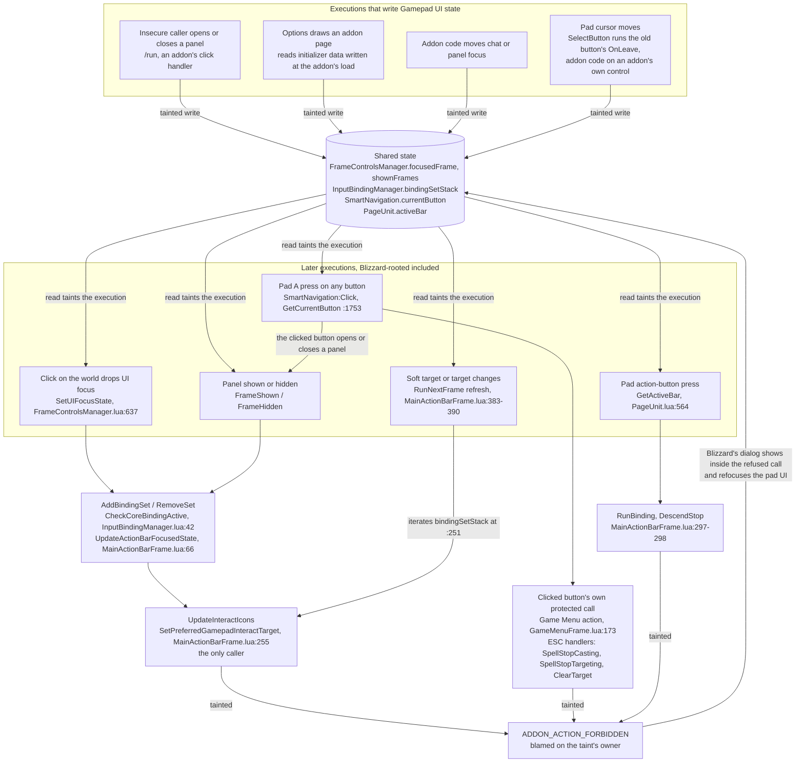
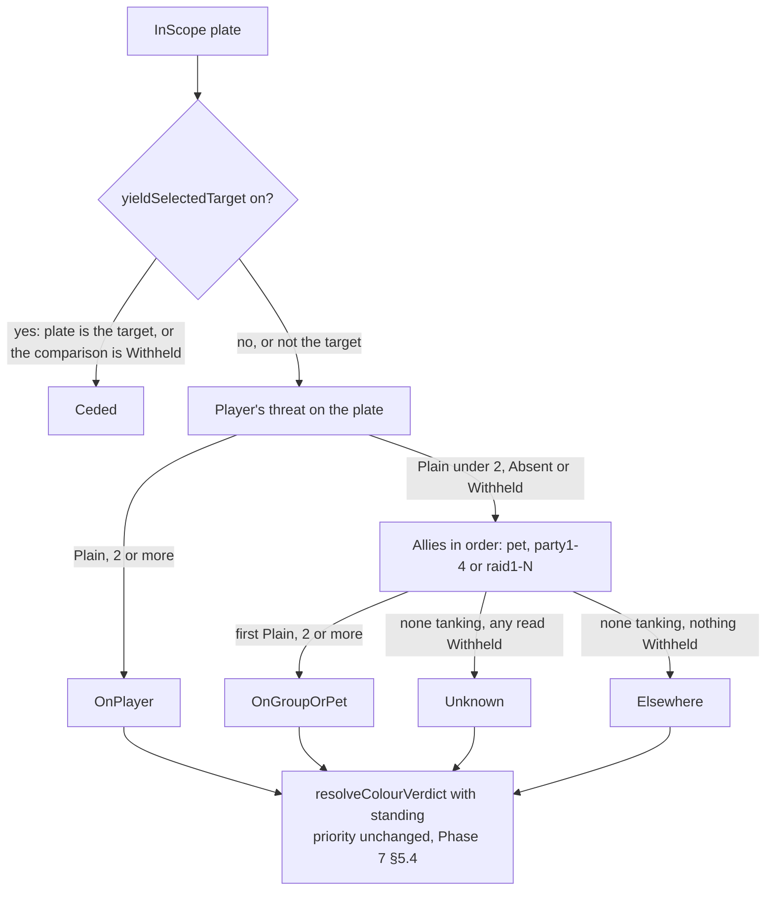

# PersonalAddon — GAP Bugs 01: Gamepad UI taint, dungeon nameplate colours, follow-ups
**Date:** October 2, 2026
**API Version:** 1.60.1 (WoW Forever Beta), game type `camelot`, build 1.60.1.70205. The client was patched 2026-10-01 20:39 and 2026-10-02 20:43 local. The UI source was re-exported 2026-10-02 20:44. The 2026-09-26 export is kept at `c:\tmp\BlizzardInterfaceCode-20260926`.
**Kind:** Gap analysis, in four steps: evidence, diagnosis, gap, plan. It covers the two defects seen in the 2026-10-01 dungeon session and the follow-ups found while tracing them.
**Depends on:** Patch 01 §0.2, §0.5.1 (the Gamepad defect, BugGrabber's four paths); Phase 2 §4.7 (refusal shapes) and §4.8 (threat is the better mechanism); Phase 7 §5.2 (first-read secret check) and §5.4 (colour priority); Phase 8 §12 criterion 12; README "Rules for future development" 1–9
**Revision:** 4. Results of 2026-10-03: §5 S1 and S3 answered, both reports filed; Phase 10 §1.3's corrections. Revision history at the end.

---

## 0. Summary

| ID | Defect | Owner | Root cause | Confidence | Action |
|---|---|---|---|---|---|
| G1 | `SetPreferredGamepadInteractTarget()` is refused, blamed on whichever addon is loaded, or on `/run` with none | Blizzard | The Gamepad UI keeps its focus, binding and cursor state in shared tables. It writes them inside whatever execution opens, closes or focuses a panel, or moves the pad cursor. A later execution that reads them is refused at the restricted function's only caller, and at gameplay presses | Mechanism and location ≥95%: it reproduces with every addon disabled. Blizzard's fix design is not ours to pick | Filed 2026-10-03 (§2.6). Follow-up comment 2 adds the cursor carrier (§2.6). No change to Blizzard's path from our side (§2.7) |
| N1 | Nameplate colours wrong in dungeons | Us | On addon-restricted maps, `UnitIsUnit("nameplate1target", "player")` returns a secret boolean. The comparison at `Nameplates.lua:181` sits outside its `pcall`, raises, and aborts the whole sweep four times a second | Cause ≥95%. Containment ≥95%. Restoring colour in dungeons through threat: verified in a dungeon on 2026-10-03 | Built in Phase 9. Closed (§5 S3) |
| R2–R7 | Follow-ups found on the way | Us | §4 | — | Roadmap §4 |

The two defects are unrelated. G1 is Blizzard state that addon code taints. N1 is our code testing a value the client does not let us test.

---

## 1. Evidence

### 1.1 Sources

| Source | What it held | Blind spot |
|---|---|---|
| `!BugGrabber.lua` and `.bak` | 16 errors. Session 109's BugSack refusal. Session 111's 7,843 nameplate errors with locals and stack | Records only the first refusal per addon per session. Disabled during the 10-02 runs |
| `Chatify.lua` and `.bak` | Session boundaries for sessions 109 and 110 | Keeps the last 250 lines, so the dungeon (21:00–22:20) is not covered |
| `PersonalAddonBlockLog` | Empty on 10-01. On 10-02 it holds 2 records totalling 6,144 refusals, between 21:00 and 21:13 | Records only refusals that name PersonalAddon |
| `BlizzardBugLogs/taint-zeroaddon.log` | Level 1, no addons: 7 refusals. For each one, the line where its execution became tainted | — |
| `Logs/taint.log` (10-02) | Level 4, the 10 s after the relog: every Blizzard field PersonalAddon taints at login | Logging back in overwrote the frozen session's log |
| `Logs/General.log` (10-02) | The execution-limit kill and the disconnect at 21:13 | — |
| `BlizzardBugLogs/taint.log` (09-19) | 11 Options-close and Game Menu refusals, each with its origin line | Pre-C4 build |
| `BlizzardBugLogs/taint-optionsclose.log` (10-03) | Level 1, §5 S1's run: 11 refusals in five executions, all blamed on BugSack, each with its origin line | Taken with every addon enabled, not S1's three |
| `PersonalAddonDiagnostics` (10-03) | Five UI loads of counters, the dungeon among them | Counts, not events; no timestamps inside a load |
| UI exports of 09-26 and 10-02 | Every Blizzard line cited here, and the diff across both patches | — |
| `WowB.exe` strings | `taintLog` levels and the log message formats | — |

### 1.2 Reading a taint log on this client

These facts hold for this client and go into the README (R4).

- **Levels**, from `WowB.exe`'s help text:
  - 1: blocked actions and the taint events leading up to them;
  - 2: adds reads and writes of global variables;
  - 3: adds upvalues;
  - 4: adds table fields.
- **Level 4 cannot be used in play.** It wrote 32,357 lines in 10 seconds after a login with one addon.
- **The line printed directly above each "An action was blocked because of taint from X - F()" entry is where that execution became tainted.** Reading that line in the export names the carrier. Level 1 is enough.
  - Cross-check: in the zero-addon log, that line is `FrameControlsManager.lua:637`, which reads nothing but `self.focusedFrame`. A separate entry in the same log names `focusedFrame` outright.
- **"Execution tainted by X while reading field Y … - file:line" names the variable** whenever the client prints it.
  - It is not always a carrier. One execution can log several of these, because `securecallfunction` boundaries drop taint on return and the next read takes it again.
  - Some name a local table built a few lines earlier in the same function, such as `targetExists` (`MainActionBarFrame.lua:221–225`). Such a field shows only that the execution was already tainted.
  - The bare line directly above the "An action was blocked" entry remains the origin.

### 1.3 Timeline (local time, PDT)

| Time | Event | Source |
|---|---|---|
| 10-01 20:39:40 | Client patched | `WowB.exe` |
| 10-01 ≈20:52 | Session 109 begins, fresh login | Chatify: hooks line and Code of Conduct |
| 10-01 20:57:50 | `SetPreferredGamepadInteractTarget()` FORBIDDEN, blamed on BugSack. Options was closed with the pad: `SmartNavigation:AttemptClose` → `SettingsPanel:Close` → `ExitWithCommit` → `HideUIPanel` → `FrameHidden` → `RemoveSet` | BugGrabber, session 109 |
| 10-01 ≈20:58 | `/reload`, session 110 | Chatify: hooks line without the Code of Conduct |
| 10-01 21:00:39 | Session 110 saved, session 111 begins | `.bak` write times |
| 10-01 21:00–22:20 | Dungeon: 7,843 × `Nameplates.lua:181`, the last at 22:20:06. No addon was blamed for a refusal in this session | BugGrabber |
| 10-01 23:03:22 | AFK logout | SavedVariables |
| 10-02 20:43:08 | Client patched again, build 1.60.1.70205 | `WowB.exe`; BlockWatch `clientBuild` |
| 10-02 20:44:22 | UI re-exported | Export file times |
| 10-02 20:45:59, 20:46:14 | No addons. `/run ToggleCharacter("PaperDollFrame")` opens, then closes, the panel. Each run raises the `TextStatusBar.lua:110` secret-compare error. Neither run is refused | `taint-zeroaddon.log`; user |
| 10-02 20:47:49 | 2 refusals (`RemoveSet`, then `AddBindingSet`) from a click on the world that dropped UI focus. Tainted at `FrameControlsManager.lua:637` | `taint-zeroaddon.log` |
| 10-02 20:48:47–52 | 5 refusals on the deferred interact-icon refresh, tainted inside a `for` iterator | `taint-zeroaddon.log` |
| 10-02 20:59:39 | In the world with PersonalAddon only, BugGrabber off, `taintLog 4` | `Client.log` |
| 10-02 21:00:12 | First of 6,144 refusals naming PersonalAddon: 3,073 via `RemoveSet`, 3,071 via `AddBindingSet` | BlockWatch |
| 10-02 21:13:04 | "insecure scripts exceeded execution limit for addon PersonalAddon" (in `TableUtil.lua`), then about 30 × "Script from "PersonalAddon" has exceeded its execution time limit" in one second | `General.log` |
| 10-02 21:13:05 | Realm disconnect | `General.log` |
| 10-02 21:16:00–21:16:10 | Relog with `taintLog 4` still on; then set to 0 and quit | `Logs/taint.log` |
| 10-03 11:16:27 | Phase 9's dungeon session (V1): 15,621 plain threat reads, none withheld, no plate faults | `PersonalAddonDiagnostics` |
| 10-03 12:22:00 | §5 S1's run: `taintLog 1`, `/reload`, every addon enabled | `PersonalAddonDiagnostics`; user |
| 10-03 12:22:20.660 | Options closed with the pad's A on Close. One execution, 5 refusals blamed on BugSack. Origin of all five: `SmartNavigation.lua:1753` | `taint-optionsclose.log` |
| 10-03 12:22:40–12:22:46 | A Game Menu button's action, a pad jump and the interact icon, all refused for BugSack | `taint-optionsclose.log` |
| 10-03 | §2.6's primary report and §2.8's report filed | User |

### 1.4 What the two patches changed

Between the 09-26 and 10-02 exports, 127 files changed and none were removed. Two were added, `Blizzard_AchievementUI/Camelot/Blizzard_AchievementUI.lua` and `Blizzard_ProjectConstants/Camelot/ProjectConstants.lua`; this list first said none were (corrected by Phase 10 §1.3).

- **Unchanged:** every file on G1's path:
  - `MainActionBarFrame.lua`
  - `InputBindingManager.lua`
  - `FrameControlsManager.lua`
  - `PromptedBindingFooter.lua`
  - `FrameReformUtility.lua`
  - `StaticPopupGamepad.lua`
  - `Blizzard_SettingsPanel.lua`
  - `UIParentPanelManager.lua`

  Neither patch touched the defect.
- **Changed on that path, not taint-related:**
  - `BindingSetFactory.lua`, 10 lines shorter: the four hard-coded core bindings (menu, HUD, autorun, ping) moved into `Bindings.xml`.
  - `SmartNavigation.lua`, 75 lines longer: "reading order" grid navigation, and a nil-guard on `activeInfo`.

  The lazy "cache on first activation" in `BindingSetFactory` is unchanged.
- **Changed, and missed by this list until Phase 10 §1.3. None of the three matters to us:**
  - `PageUnit.lua`, on the G1 path since §2.9: two initialisation calls reordered;
  - `Blizzard_Game/Shared/EventImplementation.lua`: a shard-transfer handler removed, away from the forbidden-action dialog at `:91`;
  - `ContainerFrame.lua`: `ContainerFrameCombinedBagsMixin:CanUseForBagID` added, away from the bag events.
- **Unit API docs:** one function added (`UnitUsesAmmo`). Every flag N1 depends on is unchanged: `UnitIsUnit`, `UnitInRaid`, `UnitThreatSituation`, `UnitDetailedThreatSituation`, and the secret predicates.
- **Nameplates:**
  - Font and text-anchor changes only.
  - The `UnitFrame.healthBar` alias is still set (`Blizzard_NamePlateUnitFrame.lua:56`).
  - All four hooked functions still exist.
  - `CompactUnitFrame.lua` changed one CVar read.

---

## 2. G1 — Gamepad UI taint (Blizzard)

### 2.1 Verdict

**This is Blizzard's defect, reproduced with every addon disabled.** It rests on two facts.

1. **One caller.** `SetPreferredGamepadInteractTarget` is `HasRestrictions` with `SecretArguments = "AllowedWhenUntainted"`. It has one caller in the whole UI: `MainActionBarFrame.lua:255`, inside `UpdateInteractIcons`.
2. **Shared state written by any caller.** The Gamepad UI keeps focus, binding and cursor state in shared tables. It writes them inside whatever execution opens, closes or focuses a panel, or moves the pad cursor:
   - `GamepadMode.FrameControlsManager`: `focusedFrame`, `shownFrames`;
   - `GamepadSharedUtility.InputBindingManager`: `bindingSetStack`;
   - `SmartNavigation`: `currentButton`, the pad cursor's button (§2.9);
   - the action bar page unit: `activeBar` (§2.9).
   - An insecure writer leaves them tainted.
   - Every later execution that reads them is refused at that one call, until `/reload`. That includes executions Blizzard started itself: a click on the world, or a change of soft target.

The addon blamed is whoever's taint the state last carried. With no addons loaded, the client blamed `*** ForceTaint_Strong ***`, its label for `/run` code. The "random addon" pattern across sessions follows from this.

### 2.2 How it fails



The restricted call is reached two ways.

- **Path A: the binding-stack listener.** `UpdateActionBarFocusedState` is registered with `BindToCoreBindingActive` (`MainActionBarFrame.lua:505–506`). `CheckCoreBindingActive` runs it synchronously, inside whichever execution added or removed a binding set.
- **Path B: the deferred refresh.** It starts on a client event and is delayed one frame (`:383–390`). It still reads `bindingSetStack` through `IsOnlyCoreBindingSetActive` (`:251`). The zero-addon log refused it five times, tainted inside a `for` iterator; `bindingSetStack` is the only table written at runtime that this path iterates.

**Deferring the call does not fix the defect.** Path B already defers it, and it was refused.

### 2.3 Every observed route

| Route | Root of the refused execution | Where it became tainted | Blamed | Evidence |
|---|---|---|---|---|
| Insecure code shows a panel | Questie's tracker click → `ShowUIPanel` → `FrameShown` → `AddBindingSet` | The click handler | Questie | BugGrabber, session 21 |
| `/run` opens and closes a panel | `RunScript` → `ToggleCharacter` | `RunScript` | Not refused in these executions. The chat box's binding set kept the core flag from flipping. They wrote the state | Zero-addon log, 20:45:59 and 20:46:14 |
| Focus drop, no addon | `GLOBAL_REGION_MOUSE_DOWN` → `OnGlobalRegionMouseDown` (`:682`) → `SetUIFocusState` → `RefreshFocus` → `PromptedBindingFooter:RefreshBindingGroup` (`:339`, `:369`) | `FrameControlsManager.lua:637`, `self.focusedFrame` | `*** ForceTaint_Strong ***` ×2 | Zero-addon log, 20:47:49 |
| Deferred refresh, no addon | Soft-target or target event → `RunNextFrame` → `UpdateInteractIcons` | `for` iterator (the binding stack) | `*** ForceTaint_Strong ***` ×5 | Zero-addon log, 20:48:47–52 |
| Options close with the pad | `SmartNavigation:AttemptClose` → `SettingsPanel:Close` → `ExitWithCommit` → `HideUIPanel` → `FrameHidden` → `RemoveSet` | `Blizzard_SettingsPanel.lua:594` in the 09-19 build: `CommitCanvases` reading a canvas frame's `OnCommit` | PersonalAddon ×8, BugSack ×4 (once after the patch) | 09-19 log; BugGrabber, sessions 31 and 109 |
| Options close with the pad, build 70205 | Pad A → `SmartNavigation:Click` (`:1584`) → Close's `OnClick` → `SettingsPanel:Close` → `ExitWithCommit` → `TransitionBackOpeningPanel` → `HideUIPanel` → `FrameHidden` → `RemoveSet` | `SmartNavigation.lua:1753`, `currentButton` (§2.9) | BugSack ×2 | `taint-optionsclose.log`, 12:22:20 |
| The same execution returns to the Game Menu | `TransitionBackOpeningPanel` (`:300`) → `ToggleGameMenu` → `TryHandleGameMenuEsc` → ESC handlers (`Blizzard_Game/Shared/Game.lua:7`, `Mainline/Game.lua:29`): `SpellStopCasting`, `SpellStopTargeting`, and an unnamed call that can only be `ClearTarget`, the one protected call at `:29`. Then `GameMenuFrame_Show` → `FrameShown` → `AddBindingSet` | `SmartNavigation.lua:1753` | BugSack ×3 for the ESC handlers. The interact refusal on `AddBindingSet` is one of the ×2 above | `taint-optionsclose.log`, 12:22:20 |
| A Game Menu button pressed with the pad | Pad A → `SmartNavigation:Click` → `GameMenuFrame.lua:172–173`: `HideUIPanel`, then the button's `callback()` | No bare origin line. Each refusal follows an "Execution tainted … while reading" entry (`targetExists`, `promptedBindingsActive`), so the execution was tainted before it reached either (§1.2) | BugSack ×2: the interact icon and the button's action | `taint-optionsclose.log`, 12:22:40 |
| Jump with the pad | `GAMEPADACTIONBUTTON8` → `PressActionButton` → the jump function's release: `DescendStop`, `RunBinding("JUMP", "up")` (`MainActionBarFrame.lua:297–298`) | `PageUnit.lua:564`, `activeBar` (§2.9) | BugSack ×2 | `taint-optionsclose.log`, 12:22:40 |
| Start button, then a Game Menu button | `TOGGLEGAMEMENU` → `ShowUIPanel` → `FrameShown` → `AddBindingSet`; then a Game Menu button → `HideUIPanel` → `FrameHidden` → `RemoveSet`. The second button's action was not refused | `securecall()`; then `(for generator)()`, the binding stack, as in the zero-addon log | BugSack ×2 | `taint-optionsclose.log`, 12:22:45 and 12:22:46 |
| Game Menu key | `TOGGLEGAMEMENU` → `ToggleGameMenu` → footer bindings | `PromptedBindingFooter.lua:369` and `:380` | PersonalAddon ×5 | 09-19 log |
| Chat sent with the pad | `SendText` → `ChatFrame.OnEditBoxPreSendText` → `FloatingChatFrame:SetGamepadFocus` → `FrameShown` | Not captured | Chatify | BugGrabber, session 22 |
| Auction House closes | `AUCTION_HOUSE_CLOSED` → `HideUIPanel` → `FrameHidden` | Not captured | SnapPrice ×3 | BugGrabber, session 86 |
| Professions closed with the pad | `HideUIPanel` → `FrameHidden` | Not captured | Auctionator ×33 | BugGrabber, session 106 |

The same stack mutation reaches a second restricted call when it happens in combat: `RemoveSet` → `ReloadBindings` → `InputActionBinding:Bind` → `SetOverrideBinding`, BLOCKED (Auctionator, session 55).

One more place for Blizzard to look. `PromptedBindingFooter:RefreshBindingGroup` drops its binding group and builds a new one, with `GenerateClosure` function bindings, inside whatever execution refreshes focus (`:337–370`). A pad press then runs a closure built in that execution.

Patch 01 §0.5's refused gameplay presses are now traced (§2.9).
- `RunBinding` refused on a pad jump, from `PageUnit.activeBar`.
- `SpellStopCasting` refused when Options, closed with the pad, returned to the Game Menu, whose ESC handlers ran inside the tainted click.

### 2.4 Severity: the refusal storm

- **Blizzard's handler runs inside the refused call.** `ADDON_ACTION_FORBIDDEN` is a `SynchronousEvent`. The handler (`EventImplementation.lua:91` → `StaticPopup_Show`) runs inside the refused call, and under the Gamepad UI the dialog takes focus.
  - The zero-addon log shows that flow reading the same tainted state: `FrameReformUtility.lua:88` (`gamepadShown`) and `FrameControlsManager.lua:371` (`focusedFrame`).
- **One session ended in a storm and a disconnect.** The setup was PersonalAddon alone, BugGrabber off (so Blizzard's dialog was live) and `taintLog 4`.
  - BlockWatch counted 6,144 refusals in 13 minutes, in alternating `RemoveSet` and `AddBindingSet` pairs. That pair is what the footer refresh produces.
  - The client then killed scripts for exceeding the execution limit, and the realm disconnected.
- **What is established:** the dialog takes part in the tainted state, a storm happened, and it ended in a disconnect.
- **Not established:** how much of the 13 minutes came from the dialog feeding itself, and how much from level-4 logging slowing every execution. §5 S2 separates the two.
- **Why ordinary sessions see a handful, not thousands.** BugGrabber unregisters Blizzard's handler (Patch 01 §1). So keeping BugGrabber installed is a mitigation, not just a convenience.

### 2.5 Confidence

| Claim | Confidence | Basis |
|---|---|---|
| Blizzard's defect, independent of any addon | ≥95% | Zero-addon repro, 7 refusals |
| The sink is the only caller, reached through the binding-stack listener or the deferred refresh | ≥95% | The export; every stack in BugGrabber and both taint logs |
| Taint is carried in shared Gamepad UI state and refuses Blizzard-rooted executions minutes later | ≥95% | Refusals 1½–2½ minutes after the last `/run`, origin `FrameControlsManager.lua:637` |
| `focusedFrame` is a carrier | ≥95% | Named by its origin line, and outright at `:371` |
| `bindingSetStack` is a carrier | ≥90% | The only runtime-written table the deferred path iterates |
| `SmartNavigation.currentButton` is a carrier | ≥95% | The bare origin line of all five refusals in the 12:22:20 execution. `GetCurrentButton` (`:1753`) reads nothing else |
| `PageUnit.activeBar` is a carrier | ≥90% | The bare origin line of both jump refusals. `GetActiveBar` (`:564`) reads nothing else. Its tainted write is inferred, not logged |
| BugSack's settings page wrote `currentButton` | ≥90% | §2.9: BugSack was blamed, and its page is the only place its code runs inside `SelectButton` or a page draw. Which of its paths ran last is not logged |
| The dialog alone sustains a storm | <90% | §5 S2 |
| What Blizzard should change | Not claimed | §2.6 says where to look and what a fix has to achieve |

### 2.6 Bug report

**Primary (253 characters, ASCII). Wording: "where to look", plus the no-addon repro. Filed 2026-10-03:**

```
Gamepad UI, no addons: /run ToggleCharacter("PaperDollFrame") taints FrameControlsManager.focusedFrame/binding stack; later pad focus/target changes hit SetPreferredGamepadInteractTarget (sole caller MainActionBarFrame.lua:255): FORBIDDEN until /reload.
```

**Optional follow-up comment (250 characters).** File it after §5 S2, or now as facts only:

```
Severity: the FORBIDDEN dialog runs inside the refused call and refocuses the pad UI (StaticPopupGamepad, FocusFirstFrameShown), re-tainting it. One session: 6,144 refusals in 13 min, then "insecure scripts exceeded execution limit" and a disconnect.
```

**Follow-up comment 2 (253 characters, ASCII).** Add it to the filed report. It comes from §5 S1's result (§2.9), and the client's log names each line:

```
Same defect, 2 more carriers (taintLog 1): SmartNavigation.currentButton (SelectButton writes it after running the old button's OnLeave, which can be addon code; pad A reads it at :1753) and PageUnit.activeBar (:564). Pad Jump's RunBinding then refused.
```

**What any fix has to achieve.** We are 90% or more sure of the requirement, not the implementation. No restricted call may depend on Gamepad UI state that an insecure execution can write. Deferring the call is not enough (§2.2, path B). Fixing `FrameControlsManager` alone is not enough either: the pad cursor and the action bar page carry the same taint (§2.9).

**Attach if the form allows:** `BlizzardBugLogs/taint-zeroaddon.log`. It is 29 KB, from a level-1 log with no addons loaded.

### 2.7 Our side

- **No code of ours is on the path.** Removing our settings page would not remove the defect (Patch 01 §0.5.1); with no addons loaded, the zero-addon run reproduced it anyway.
- **Our settings page and chat output do write tainted values into Blizzard tables at login**, like any addon with either one. R4 lists them; no code change follows.
- **Three changes do follow:**
  - **R3:** BlockWatch must never be the thing that tips a storm into the execution limit.
  - **R4:** the README's known-issue text and taint procedure.
  - **R5:** classify this refusal as the known defect and point the user at `/reload`.

### 2.8 Incidental Blizzard defect: the character pane from insecure code

Opening the character pane from insecure code raises an error in `CharacterFrame`'s OnShow (`CharacterFrame.lua:745`). That OnShow calls `ShowStatusBarText` on the player's health and mana bars, and `TextStatusBar.lua:110` tests `valueMax > 0` on a secret value. "Insecure code" means `/run`, or any addon that opens the pane. The same OnShow also writes those bars' `showNumeric` and increments their `lockShow` (`TextStatusBar.lua:260`) in the insecure execution. Closing the pane then read `lockShow` tainted (zero-addon log, 20:46:14).

This is separate from G1. An optional report (240 characters), filed 2026-10-03:

```
Opening the character pane from insecure code (/run ToggleCharacter("PaperDollFrame"), or any addon) errors in CharacterFrame OnShow: TextStatusBar.lua:110 compares a secret valueMax (PlayerFrame health/mana bar). Reproduces with no addons.
```

### 2.9 The cursor carrier (§5 S1's result)

**On build 70205, Options closed with the pad is refused because the pad cursor's own state is tainted.** Settings code is not the origin.

- **The read.** `SmartNavigation:Click` (`SmartNavigation.lua:1575–1587`) turns the pad's A into a click on `currentButton`.
  - It first calls `SmartNavigation_IsCurrentButtonClickable` (`Utility.lua:148–149`), which reads `currentButton` through `GetCurrentButton` (`:1753`).
  - That read is the origin of all five refusals at 12:22:20. The whole click then runs tainted: Settings' close, and the Game Menu it returns to.
- **The write.** `SelectButton` (`:568–606`) writes `currentButton`.
  - Before the write, it runs the previous button's leave script (`RunCurrentButtonLeaveScript` → `FocusExit`, `:585`, `:665–668`) and `OnSmartNavDeselect`. After the write, it runs the new button's enter script (`:606`, `:659–662`). Blizzard's own comment calls these "user-provided callbacks".
  - When the previous button is an addon's own control, its `OnLeave` is addon code. The execution is then tainted, and `currentButton` is written tainted.
  - The Settings panel also calls `SelectButton` inside the execution that draws a page (`FocusContainer`, `Blizzard_SettingsPanel.lua:1052`; `Blizzard_CategoryList.lua:251`).
- **How long it lasts.** The taint stays until a clean execution writes `currentButton` again, such as an ordinary cursor move between Blizzard buttons.
  - That fits the log: the Game Menu press at 12:22:40 had its action refused, and the press at 12:22:46 did not.
  - The later press's only refusal took its taint from the binding stack, not the cursor, and the client quit two seconds after it.
- **Into gameplay.** `PageUnit.activeBar` carries the taint on into gameplay. `PageUnit.lua:545` writes it and `:564` reads it.
  - The page unit picks its active bar again when panels open or close. The tainted 12:22:20 execution hid Options and showed the Game Menu, so it is the likely writer.
  - That write is inferred. The log names only the read.

**The writer in this run is BugSack's settings page.** The page runs BugSack code inside Blizzard's executions in three ways. Our rule 1 forbids each of them.
- A custom initializer whose `InitFrame` Blizzard calls when it draws the page (`BugSack/config.lua:183`).
- A preview button with BugSack's own `OnEnter` and `OnLeave` (`:218`, `:225`). `SelectButton` runs these as the cursor passes.
- Proxy settings and a dropdown. Blizzard calls their getters, setters and option list (`:50`, `:75`, `:129`, `:138`, `:153`).

**Our page was not blamed in this run.** Nor has it been blamed on this route since C4 (BugGrabber sessions 109 and 116).
- Our controls are Blizzard templates bound to `RegisterAddOnSetting`. They carry no scripts of ours, and Blizzard calls none of our functions inline.
- Value-changed callbacks arrive through the callback registry. Its `securecallfunction` drops our taint when the callback returns.
- One question was not isolated: does drawing our page taint `currentButton` through initializer data (§2.2, W2)? Only the last writer is blamed, so a run with BugSack loaded cannot show it. No decision depends on it (§5 S1).

---

## 3. N1 — Nameplate colours in dungeons

### 3.1 Verdict

**This is our defect.** Dungeons are addon-restricted maps. On those maps, `UnitIsUnit` with a compound token returns a secret boolean.

- `unitsAreSame` tests that value outside its `pcall`.
- The error escapes through `classifyAggro`, `verdictFor` and `sweep`.
- So every sweep stopped at the first plate whose mob had a target. 7,843 sweeps were aborted in the dungeon: about 33 minutes at 4 Hz.

BugGrabber's record:

| Field | Value |
|---|---|
| Message | `Nameplates.lua:181: attempt to compare local 'same' (a secret boolean value, while execution tainted by 'PersonalAddon')` |
| Locals | `leftUnit="nameplate1target"`, `rightUnit="player"`, `ok=true`, `same=<secret boolean>` |
| Stack | `:181` `unitsAreSame` ← `:273` `classifyAggro` ← `:421` `verdictFor` ← `:726` `sweep`, from the ticker |

### 3.2 Why only in dungeons

`UnitIsUnit` carries `RequiresComparableUnitTokens` and `SecretWhenUnitComparisonRestricted`. The predicate reads:

> Comparisons involving compound unit tokens (eg. 'boss1target') are always secret. This restriction only applies when the player is on an addon-restricted map.

The map restriction is `Enum.AddOnRestrictionType.Map`, "the player is on a map that applies addon restrictions". Blizzard's predicate text gives dungeons and raids as examples. `C_RestrictedActions.IsAddOnRestrictionActive(Enum.AddOnRestrictionType.Map)` reports it.

The restriction is on unit comparison, not on nameplates. Blizzard's own plates are secure code and compare secrets freely.

Line 181 was simply the first test to fail. These would have failed the same way next:
- `unitsAreSame(mobTarget, "pet")`;
- the party loop in `groupMembership`;
- `UnitInRaid(mobTarget)` at `:199–201`, which is `SecretWhenUnitIdentityRestricted`, and a mob is not player-controlled.

### 3.3 What you saw

The sweep walks plates in hash order.

- **Plates reached before the failing plate** got verdicts:
  - an idle mob got Elsewhere (your `651400`), Neutral or Tapped;
  - a mob in combat with no target the client would resolve got Unknown, which hands the plate back to Blizzard.
- **The sweep stopped at the first plate whose mob had a target.** Every plate after it kept its last verdict. The per-frame contest driver and the four post-hooks re-applied that verdict over Blizzard's colours, because they re-assert the desired colour and do not reclassify (`reassertColour`, `:473–488`).
- **The result in a pull:**
  - mobs painted `651400` before the pull stayed `651400` while they attacked you or the tank;
  - plates that first appeared mid-pull, and were never reached, showed Blizzard's colours;
  - nothing turned red or green for the right reason.

### 3.4 Why the design missed it

- **An implicit assumption, never written down.** Phase 2 §4.7 says a refusal arrives "as an error or a log line and a nil", so `pcall` and nil checks were the guard. A secret value is a third kind of answer: the call succeeds and returns a value our code cannot test.
  - Phase 7 §5.2 added the secret check for its own three reads (`plainOrNil`, `:312–324`). It called `UnitIsUnit` refusable, but did not guard Phase 2's comparisons.
- **A single point of failure in the loop.** One plate's error stopped every plate, and the four re-assert paths kept the stale colours alive.
- **It degraded silently.** `/pa plates` showed nothing; only BugGrabber saw it.
- **No dungeon run before release.** Phase 8 criterion 12, toasts in a dungeon, is still open, and nameplates had no dungeon criterion at all.

### 3.5 Decision

The user chose threat-based aggro everywhere, on 2026-10-02. That was Phase 2 §4.8's recommendation.

- It is one path in and out of instances.
- It steadies the read, because threat does not flicker when a mob retargets for a tick.
- It removes every compound-token comparison from the feature.

The five colours keep their meaning:
- **Red:** you are the mob's current target.
- **Green:** your pet or a group member is.
- **Elsewhere:** no one in your group is.

### 3.6 Design

**Types**

```
type ClientRead<T> =
      Plain(value: T)
    | Absent
    | Withheld(reason: WithheldReason)

type WithheldReason = SecretValue | CallFailed | UnexpectedType

type ThreatStatus = integer
type GroupRoster = Solo | Party | Raid(size: integer)
type ThreatReader = (unit: UnitToken, mob: UnitToken) -> ClientRead<ThreatStatus>

type AggroReading = {
    aggro: Aggro,
    withheldReads: integer,
}

type FaultLedger = {
    faultCount: integer,
    reportedMessages: BoundedSet<string>,
}

TANKING_STATUS: ThreatStatus = 2
FAULT_MESSAGE_CAPACITY: integer = 8
```

`Aggro`, `Disposition`, `Verdict` and the colour priority are unchanged (Phase 7 §5.4). `TANKING_STATUS` is the client's scale, not a preference: 2 and 3 mean the unit is the mob's current target.

**The read seam (new `Core/ClientRead.lua`, loaded after `Core/Isolation.lua`)**

```
# Reads one value from the client without comparing, testing or doing arithmetic
# on a value this addon may not operate on.
# pre:  clientFunction is a client API; arguments are plain values
# post: Plain(value) only when the call succeeded, canaccessvalue(value) is true
#       (issecretvalue(value) is false where canaccessvalue is absent) and
#       type(value) == expectedType; Absent when the call returned nil;
#       Withheld otherwise. The accessibility check precedes every other use of
#       the value, the nil test included.
# raises: never
function read_client_value(
    clientFunction: ClientFunction,
    arguments: List<PlainValue>,
    expectedType: LuaTypeName
) -> ClientRead<PlainValue>
```

Every client read in Nameplates goes through it:
- threat;
- the two comparisons;
- scope and existence;
- the roster;
- the three standing reads, where it replaces `plainOrNil`.

`StyleLedger`'s colour read goes through it too, and R2 adds DamageBreakdown. Three modules justify the shared seam.

**Group and threat**

```
# The group shape, read once per sweep.
# pre:  none
# post: Raid(GetNumGroupMembers()) when IsInRaid(); Party when IsInGroup();
#       Solo otherwise; Party when the roster functions are absent or Withheld,
#       which costs four reads of possibly empty tokens and claims nothing
# raises: never
function read_group_roster() -> GroupRoster

# The allies whose threat on a mob makes it OnGroupOrPet.
# pre:  none
# post: "pet" first; then party1..party4 for Party, or raid1..raidN for Raid(N);
#       Solo yields only "pet". A raid list may contain the player's own raid
#       token; reading it again changes no verdict.
# raises: never
function ally_tokens(
    roster: GroupRoster
) -> List<UnitToken>

# Who an InScope plate's mob is attacking, from threat, never from its target.
# pre:  plateUnit is the token of a tracked InScope plate
# post: OnPlayer when the player's read is Plain and >= TANKING_STATUS;
#       otherwise OnGroupOrPet at the first ally whose read is Plain and
#       >= TANKING_STATUS, even if the player's read was Withheld, because a mob
#       has one current target; otherwise Unknown when any read was Withheld;
#       otherwise Elsewhere. Reading stops at the first tanking unit.
#       withheldReads counts this call's Withheld reads.
# raises: never
function classify_aggro_by_threat(
    plateUnit: UnitToken,
    allies: List<UnitToken>,
    threatOf: ThreatReader
) -> AggroReading
```



**Containment**

```
# Classifies and paints every InScope plate. A fault on one plate cedes that
# plate and the sweep continues.
# pre:  the feature is enabled
# post: every InScope plate carries this sweep's verdict or is Ceded. Each plate
#       runs inside Isolation.Call. A faulted plate is restored to Blizzard's
#       colour and counted. The first fault with a given message in a session is
#       passed once to the client's error handler with the stack Isolation.Call
#       captured, so BugGrabber still records it, and surfaced once in chat
#       through EscapeGuard. Messages beyond FAULT_MESSAGE_CAPACITY are counted only.
# raises: never
function sweep_plates(
    plates: Map<NamePlateFrame, Plate>,
    paintPlate: PlatePainter,
    faults: FaultLedger
) -> SweepOutcome

# Reads a nameplate bar's current colour for the desired-versus-actual check.
# pre:  bar is a status bar this ledger holds a BarColour record for
# post: Plain(Colour) when all four components are accessible numbers;
#       Withheld(SecretValue) when any is not. GetStatusBarColor is
#       SecretReturnsForAspect VertexColor and Alpha.
# raises: never
function read_bar_colour(
    bar: StatusBar
) -> ClientRead<Colour>
```

`StyleLedger.Reads` returns `ClientRead<PropertyValue>`. On `Withheld`, `reassertColour` neither writes nor marks the plate contested for that frame, and it counts the read. That plate stays Blizzard's while its colour is secret, and nothing fights over it every frame. `StyleLedger.Apply` still stores originals without comparing them, which is safe for secrets.

**Removed.** These go, along with the calls to `UnitExists(mobTarget)`, `UnitInParty`, `UnitInRaid` and `UnitAffectingCombat`:
- `unitsAreSame` for mob targets;
- `groupMembership`;
- `classifyUnresolvedTarget`;
- `classifyAggro`;
- the 200-attempt "withholds aggro data" heuristic, replaced by one chat line on the first `Withheld` threat read of a session, naming the map-restriction state.

The comparisons that stay are `classifyScope`'s player check and `isSelectedTarget`. Both use simple tokens and go through `read_client_value`. A `Withheld` player check falls through to `UnitCanAttack`, since a player cannot attack themselves.

**Cost per sweep.**

- **Threat reads per plate:** 1 for the player, 1 for the pet, then party or raid members until the first one tanking.
- **Dungeon** (20 plates at 4 Hz): at most 480 client calls a second, plus `read_client_value`'s two checks each.
- **40-player raid with 40 plates:** at most 6,720 a second.

A per-plate memo of the last tanking unit is the remedy if a profile ever says otherwise. It is not built.

**Diagnostics.** `/pa plates` adds these fields:
- `aggroSource = Threat`;
- `withheldThreatReads`;
- `withheldBarColourReads`;
- `withheldComparisonReads`;
- `plateFaults`;
- `restrictedMap`, which is `C_RestrictedActions.IsAddOnRestrictionActive(Enum.AddOnRestrictionType.Map)` read when the command runs.

`aggroResolvedEver` and `aggroAttempts` go.

**Failure modes**

| Failure | Detected by | Behaviour |
|---|---|---|
| Player's threat read is Withheld, no ally is tanking | `ClientRead` | Unknown → Ceded (Blizzard's colour). Counted. The first one per session is surfaced once, with `restrictedMap` |
| Any ally read is Withheld, no one is tanking | `ClientRead` | Unknown → Ceded |
| `UnitThreatSituation` is absent from the client | Capability check at enable | Every plate is Unknown → Ceded. Surfaced once |
| Bar colour read is Withheld | `read_bar_colour` | No write and no contest this frame. Counted |
| Classification raises for any reason | `Isolation.Call` per plate | That plate is Ceded. Counted. The first distinct message per session goes to the error handler and to chat |
| Roster functions are absent | `read_group_roster` | Party is assumed: four reads of possibly empty tokens |
| `yieldSelectedTarget` comparison is Withheld | `read_client_value` | Ceded. Yielding claims nothing |
| `UnitCanAttack` is Withheld | `read_client_value` | Unreachable, as today |

### 3.7 Implementation plan

1. **`Core/ClientRead.lua`, new.** The `ClientRead` constructors and `read_client_value`. TOC entry after `Core\Isolation.lua`.
2. **`Core/StyleLedger.lua`.** `Reads` returns `ClientRead`. The BarColour read checks each component.
3. **`Features/Nameplates.lua`.**
   1. Replace the aggro block (`:168–299`) with `read_group_roster`, `ally_tokens` and `classify_aggro_by_threat`.
   2. Route `classifyScope`, `isSelectedTarget`, `sweepStalePlates` and `readStanding` through `read_client_value`. `plainOrNil` folds into it.
   3. `reassertColour` consumes `ClientRead<Colour>`.
   4. In `sweep`, run each plate inside `Isolation.Call`, with the `FaultLedger` behaviour above.
   5. Swap the 200-attempt notice for the first-Withheld notice.
   6. `Inspect` gains the diagnostics fields.
4. **`Core/Debug.lua`.** `/pa plates` prints the new fields.
5. **README.** Rule 10 (§3.9). The nameplate feature text is unchanged.
6. **Harness** (`c:\tmp\PersonalAddonHarness`, a new session `gap01`):
   - a secret sentinel: a userdata whose comparison and arithmetic metamethods raise;
   - stubs for `issecretvalue`, `canaccessvalue`, a table-driven `UnitThreatSituation`, `IsInRaid`/`IsInGroup`/`GetNumGroupMembers`, a `GetStatusBarColor` that can return the sentinel, and a capturing `geterrorhandler`.

### 3.8 Verification

**Offline.** A boolean test on a secret cannot be trapped in Lua 5.1, so the classifier must take only `ClientRead` results. That makes the property testable: no sentinel ever reaches a comparison.

| # | Given | Expect |
|---|---|---|
| O1 | Player 3 | OnPlayer |
| O2 | Player nil, `party2` 2 | OnGroupOrPet |
| O3 | Player Withheld, `party1` 3 | OnGroupOrPet |
| O4 | Player 0, `party3` Withheld, others nil | Unknown → Ceded |
| O5 | All nil, `UnitReaction` 4 | Neutral; Elsewhere when 5 |
| O6 | Raid of 25, `raid17` 2 | OnGroupOrPet, with 19 or fewer reads |
| O7 | Plate 2 of 5 raises | Plates 1 and 3–5 coloured, plate 2 Ceded, one error-handler call, `plateFaults = 1` |
| O8 | The same fault on 100 sweeps | Still one error-handler call; `plateFaults = 100` |
| O9 | `GetStatusBarColor` returns the sentinel | No write, no contest, `withheldBarColourReads` counts |
| O10 | `yieldSelectedTarget` on, comparison Withheld | Ceded |
| O11 | Existing Phase 2 and Phase 7 colour tests | Pass unchanged |

**Live acceptance:**
- **L1, one 5-player dungeon run.**
  - BugGrabber has no `Nameplates.lua` entry.
  - After a pull, `/pa plates` shows `plateFaults = 0`, `restrictedMap = true`, and verdicts across OnPlayer and OnGroupOrPet.
  - Mobs on you are red; mobs on the tank are green.
- **L2, the open world.** Colours as before; `restrictedMap = false`.
- **L3, the same run as L1.** Close Phase 8 criterion 12, loot toasts in a dungeon.

**If L1 shows `withheldThreatReads > 0`:** the plates cede, which is correct and raises no errors. §5 S3 then decides between `UnitDetailedThreatSituation`'s `isTanking`, which uses a different predicate, and documenting that colours cede in instances.

### 3.9 README rule 10, draft

> 10. **A value from the client may be secret.** A successful call is not a readable answer. On addon-restricted maps such as dungeons and raids, and in combat, many functions return secret values, and comparing, testing or doing arithmetic on one raises in our code. Read client values through `ClientRead`, which checks `canaccessvalue` before anything else touches the value. Treat `Withheld` as "could not tell", never as "no". The generated docs flag which functions can return secrets (`SecretWhen*`, `SecretReturnsForAspect`).

---

## 4. Roadmap

| ID | Item | Priority | Why | Depends on |
|---|---|---|---|---|
| R1 | N1 (§3) | P0 | Colouring is broken in every dungeon and raid | — |
| R2 | Secret audit beyond nameplates. `DamageBreakdown`'s in-combat refresh calls `C_DamageMeter.GetCombatSessionSourceFromType`, which is `SecretWhenInCombat`. Then `source.totalAmount or 0` (`:205`) and `(spell.totalAmount or 0) > 0` (`:210`) raise on every tick when `inCombatRefreshSeconds > 0`. Recommendation: remove the setting. No migration step is needed, because `ConfigStore` prunes saved settings a feature no longer declares (`Core/ConfigStore.lua:105–108`). In combat the source is always secret, so the refresh can never draw. Route the remaining out-of-combat reads through `ClientRead` as a guard | P1 | Same defect class, hidden behind a setting off by default | R1's `ClientRead` |
| R3 | BlockWatch storm guard (contract below) | P1 | 6,144 refusals. BlockWatch's per-refusal work ran inside every refused call up to the execution-limit kill | — |
| R4 | README corrections (list below) | P1 | The README says use level 2; level 4 disconnected the client | R1 for rule 10 |
| R5 | BlockWatch classifies every `SetPreferredGamepadInteractTarget` refusal, whichever addon is blamed, as the known Blizzard defect. One chat line per session suggests `/reload` (Patch 01 §0.3's optional item) | P2 | With BugGrabber installed, the user sees nothing at all | R3 |
| R6 | Patch hygiene. On each client patch, keep the previous export, diff the G1 path files and the secret flags, and re-check §1.4's list before trusting a design. **Designed in Phase 10** | P2 | Two patches in two days; §1.4 was that check, done by hand | — |
| R7 | "About to pull" colour, threat status 1. **Phase 11, with the threat panel** | Roadmap only, by the user's decision | Phase 2 §4.8 called it "arguably the most useful thing on the whole nameplate" | R1 |
| — | Close Phase 8 criterion 12. **Closed 2026-10-03:** a green item and money toasted on a dungeon mob | With L1 | No evidence source covered loot in the 10-01 dungeon | — |

**R3 contract.**

```
type StormState = Quiet | Storming(since: Timestamp, refusals: integer)

STORM_REFUSALS: integer = 20
STORM_WINDOW_SECONDS: number = 10

# Records a refusal unless this UI load is in a refusal storm, in which case it
# only counts. A storm is STORM_REFUSALS refusals within STORM_WINDOW_SECONDS,
# for any blamed addon.
# pre:  called synchronously from the ADDON_ACTION_FORBIDDEN or _BLOCKED handler
# post: in Quiet, behaves as BlockWatch revision 2 (Patch 01 §6.1). On entering
#       Storming, surfaces one chat line with the count and advises /reload; from
#       then until the next UI load it performs no stack read, no record search
#       and no output, only an integer increment that /pa blocked reports
# raises: never
function on_refusal_guarded(
    refusal: Refusal,
    storm: StormState,
    clock: Clock
) -> StormState
```

The thresholds are internal constants in `Core/Constants.lua`, not settings. The storm state is per UI load, so `/reload` resets it, as it resets the Blizzard state that caused it.

**R4: README changes.**
- **Known issue.** It reproduces with no addons, on build 1.60.1.70205.
  - It is triggered by any insecure code that opens or closes a window, and by closing Options with the pad after an addon page was drawn.
  - Refusals then follow on later pad actions until `/reload`.
  - The blamed list gains SnapPrice and Auctionator.
  - Keep BugGrabber installed. Without it, Blizzard's own dialog takes part, and one session flooded until it disconnected (§2.4).
- **Taint procedure.**
  - Use `taintLog 1`.
  - The line above each "An action was blocked" entry is where that execution became tainted (§1.2).
  - Never use 4. Keep BugGrabber on.
  - Copy `Logs/taint.log` before entering the world again, because the client rewrites it.
- **Rule 2's exceptions.** Rule 2's exception list is incomplete. The level-4 log shows that two things inherent to having a settings page and chat output store our values in Blizzard tables:
  - **Settings registration** writes initializer data (`Blizzard_Settings.lua:311–337`, 32 controls) and callback handles (`CallbackRegistry.lua:150`).
  - **`Log`'s `AddMessage`** writes ChatFrame1's message history (`ScrollingMessageFrame.lua:744`). From there it reaches the shared fade list `FADEFRAMES` (`FrameUtil.lua:361–378`), which is read every frame at `:413–427`.

  Neither has a recorded path to a protected call. Watch, don't change.
- **Rule 10** (§3.9).

**Checked, no change:** tidy bags held back while `BankPanel` listened to `ITEM_LOCK_CHANGED`. `BankPanel` registers that event only while shown (`BankFrameTemplates.lua:688–697`), so the hold-back is the designed behaviour.

### 4.1 Pinned note: threat data for every mob (facts for the user's idea)

These are facts for the user's idea, not a design.

- **Coverage.**
  - Any mob with a unit token: `nameplateN` (on-screen plates), `boss1–5`, `target`, `softenemy`, `mouseover`.
  - A mob without a plate has no token and no data.
- **Calls:**
  - **`UnitThreatSituation(unit, mob)`** returns 0–3, or nil when the unit is not on the mob's threat list:
    - 3: tanking, highest threat;
    - 2: tanking, not highest;
    - 1: not tanking, above the tank;
    - 0: below the tank.
  - **`UnitThreatSituation(unit)`** returns the unit's highest status against any mob.
  - **`UnitDetailedThreatSituation(unit, mob)`** returns `isTanking`, `status`, `scaledPercentage`, `rawPercentage` and `rawThreat`. It is `MayReturnNothing`.
- **Secrecy.**
  - The status call is `SecretWhenUnitThreatStateRestricted`: player, pet or ally against a nameplate, boss or target is "generally not secret".
  - The detailed call's values are `SecretWhenUnitThreatValuesRestricted`: player, pet or ally against "a non-boss or nameplate target" is "generally not secret". So per-plate percentages are likely readable. Prefer the boss's nameplate token over `bossN`.
- **Events.** `UNIT_THREAT_LIST_UPDATE` and `UNIT_THREAT_SITUATION_UPDATE` are both flagged `SynchronousEvent` and `UniqueEvent`, with payload `unitTarget`. Under rule 1, find what raises them before subscribing. Polling from the existing sweep needs no event.
- **Coexistence.** Blizzard's compact frames have their own threat health-bar colour (`displayThreatHealthBarColor`, `GetAggroHighlightThreatSituation`, `CompactUnitFrame.lua:630–643`). Anything that shows threat must decide how it sits with that.
- **Rules that bind:**
  - colour is restyle-in-place on Blizzard's bar;
  - anything new on a plate is our own frame, anchored and not parented (rule 6);
  - nameplate text is a restricted region (Phase 2 §4.7).

---

## 5. Next steps where confidence is under 90%

**S1 — Name the Options-close carrier on the current build.** The 09-19 origin, `Blizzard_SettingsPanel.lua:594`, predates C4.

1. Enable BugGrabber, BugSack and PersonalAddon only. BugGrabber's handler replaces Blizzard's dialog.
2. `/console taintLog 1`, then `/reload`.
3. With the pad only: Options → AddOns → PersonalAddon, then close Options with the pad.
4. Quit at once. Run `/console taintLog 0` at the next login.
5. Read the line above each "An action was blocked" entry.

**Decision:**
- **The origin is in `Blizzard_Settings*`** (initializer data or `CommitCanvases`): our page's registration is the carrier on that route. Add a second report text, and weigh C5 (Patch 01 §8.2, our own options frame) against losing pad-navigable settings.
- **The origin is in `FrameControlsManager.lua`:** it is the same carrier as the zero-addon run. Nothing new to report.

**Result, 2026-10-03: neither branch.** `taint-optionsclose.log` puts the origin in `Blizzard_GamepadSmartNavigation`: `currentButton`, the pad cursor's button, at `SmartNavigation.lua:1753` (§2.9). BugSack's settings page wrote it. The run deviated from step 1, because every addon was enabled. That does not change the result: BugSack is one of step 1's three.

**Decision taken:**
- **Report.** Add follow-up comment 2 (§2.6) to the filed report. It is the same defect with two more carriers, and the fix scope changes because of it.
- **C5 is rejected.** An options frame of our own, driven by the pad, would put our `OnEnter` and `OnLeave` inside `SelectButton`, and PersonalAddon would become a writer of this carrier. A Settings page whose controls are data only is the least-tainting option available.
- **README.** The known issue gains the symptoms this run showed: a jump, or a Game Menu button, refused.
- **No code change.**

**Not scheduled: does drawing our page write the carrier?** Run S1 again with BugGrabber and PersonalAddon only, and BugSack disabled, only if a refusal naming PersonalAddon appears on this route. Its answer can change the README's wording, not the design.

**S2 — Does the dialog sustain a storm by itself?** This only shapes the follow-up comment in §2.6.

1. No addons, BugGrabber off, `taintLog 1`.
2. Repeat the §2 repro, then play 2 minutes with the pad: target changes, soft targets, UI focus toggles.
3. Count the refusals per minute in the log.

**Decision:**
- **Refusals keep coming without input:** file the follow-up comment.
- **They scale with input:** drop the follow-up comment's storm claim. Keep R3 either way.

**S3 — Is threat readable in a dungeon?** This is §3.8 L1.

**Decision:**
- **No Withheld reads:** close N1.
- **Withheld reads:** test whether `UnitDetailedThreatSituation(...)`'s `isTanking` is readable there, since it uses a different predicate. If it is not, the README states that plate colours cede in instances.

**Result, 2026-10-03: no Withheld reads. N1 is closed.** The dungeon UI load (`PersonalAddonDiagnostics`, started 11:16:27) recorded:
- `threatReadsPlain` 15,621, `threatReadsWithheld` 0 and `plateFaults` 0;
- `restrictedMapSeen` true, from 1,012 samples;
- verdict changes: 75 to OnPlayer and 136 to OnGroupOrPet.

BugGrabber holds no PersonalAddon entry since session 112, and the user saw the colours work. `UnitThreatSituation` against a nameplate is readable on an addon-restricted map, as its `SecretWhenUnitThreatStateRestricted` text said (§4.1).

**S4 — Every client patch.** Re-export, then run R6's diff before any design or test relies on Blizzard's source.

---

## 6. Review findings

| Finding | Where | Disposition |
|---|---|---|
| Missing failure path: one plate's error aborts the sweep for every plate, and four re-assert paths keep the stale result alive | `Nameplates.lua:711–745`, `:473–488` | R1, containment (§3.6) |
| Implicit assumption: "a refusal is an error or a nil" | Phase 2 §4.7 | Rule 10 (§3.9) |
| Silent degradation: 7,843 errors and `/pa plates` reported nothing | `Nameplates.Inspect` | Diagnostics (§3.6) |
| Unbounded work per event: BlockWatch reads a stack on every refusal, with no rate bound | `BlockWatch.lua:494–572` | R3 |
| Unbounded collection: the fault messages handed to the error handler | §3.6 | Bounded by `FAULT_MESSAGE_CAPACITY` |
| Trust boundary: client error text crosses into chat | §3.6 fault surfacing | Through `EscapeGuard`, as BlockWatch does |
| Taint hazard: rule 2's exceptions do not list Settings registration or chat output | README | R4. No code change |
| Shared mutable state across systems | Blizzard's Gamepad UI | G1 report |
| A design surface that changes under us: two patches in two days | Blizzard's UI | R6, S4 |
| Premature abstraction check: `ClientRead` | Nameplates, StyleLedger, DamageBreakdown | Justified: three modules |

---

## Assumptions

- "GAP" means a gap-analysis proposal: evidence, diagnosis, gap and plan, in the style of the Patch and Phase documents.
- The 10-01 dungeon was a 5-player instance. It was this addon's first dungeon run, since Phase 8 criterion 12 is still open.
- Dungeons and raids are addon-restricted maps for `Enum.AddOnRestrictionType.Map`. That is Blizzard's own example in the predicate text.
- Threat statuses 2 and 3 mean the unit is the mob's current target, and only one unit can be. Status 1 is used only by R7.
- The origin-line reading of taint logs (§1.2) is inferred from both logs and checked against one named field. Blizzard does not document it.
- What the user did between 21:00 and 21:13 on 10-02 is not recorded. The counts come from BlockWatch, and the kill and disconnect from `General.log`.
- `IsInRaid`, `IsInGroup` and `GetNumGroupMembers` are absent from the generated docs, but Blizzard's UI calls them throughout.
- `StyleLedger`'s restore may write back an original colour read while secret. If the client refuses that write, `pcall` catches it and counts it, as today.
- The two reports filed on 2026-10-03 are §2.6's primary and §2.8's. Follow-up comment 1 (the storm) waits for S2.
- The refusal the 10-03 log prints without a name, at `Mainline/Game.lua:29`, is `ClearTarget`, the only protected call on that line.

## Open questions

None blocking. Follow-up comment 2 (§2.6) is ready to add to the filed report. S2 is still optional.

---

## Revision history

| Revision | Change |
|---|---|
| 1 | From the 2026-10-01 dungeon session's BugGrabber log and the 2026-10-02 runs: the zero-addon repro, the 10-02 export diff, the level-4 login capture and the 21:13 disconnect. Decisions on 2026-10-02: threat-based aggro everywhere; the pull-warning colour roadmapped with a pinned note on threat data; the report text as "where to look", replaced by the no-addon version after the repro reproduced |
| 2 | Corrections from Phase 9 §1.3. R2 needs no migration step. §3.6's error-handler step is replaced by `Diagnostics` fault notes, because opening Blizzard's error window from insecure code is G1's trigger. §3.8 O11 passes after the harness's hidden-target units become secret-threat units. R2's audit covers every site the secret-read lint found, not only DamageBreakdown (Phase 9 §5.2) |
| 3 | Results of 2026-10-03. S1 answered: the Options-close origin is the pad cursor's `currentButton`, written by BugSack's settings page, a third carrier (§2.9). G1's shared state gains it and `PageUnit.activeBar`. §2.3 gains five routes, among them the refused pad jump and Game Menu action, which trace Patch 01 §0.5's gameplay refusals. §1.2 gains a caveat on "while reading" lines. C5 rejected. Follow-up comment 2 drafted. S3 answered: threat is readable in a dungeon, N1 closed. Both reports filed |
| 4 | Corrections from Phase 10 §1.3. §1.4 gains the two added files and three changes it missed, none of which matters to us. The roadmap's criterion-12 row is closed. R6 is designed in Phase 10; R7 moves to Phase 11 with the threat panel |
