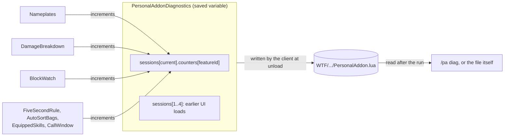
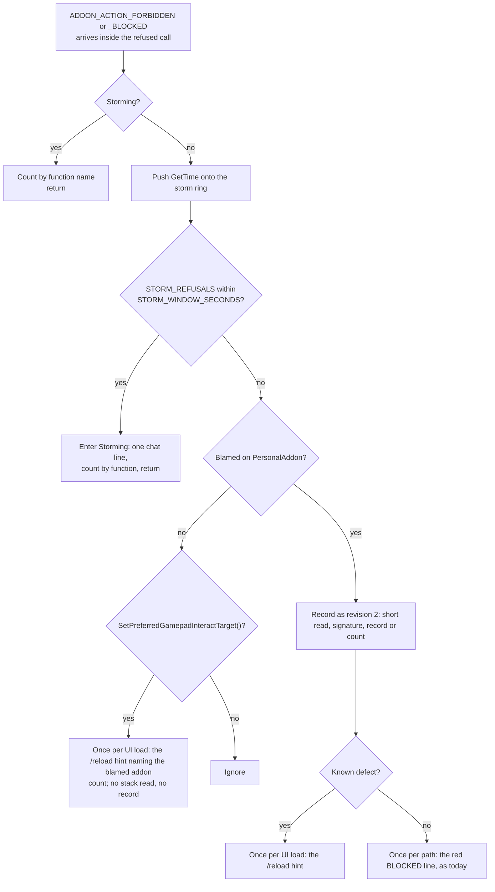

# PersonalAddon — Phase 9 Design: secret-safe reads, threat nameplates, BlockWatch revision 3
**Date:** October 2, 2026
**API Version:** 1.60.1 (WoW Forever Beta), game type `camelot`, build 1.60.1.70205. UI source exported 2026-10-02 20:44.
**Implements:** `20261002-GAPBugs01.md` roadmap items R1, R2, R3 with R5, and R4, as decided on 2026-10-02 (§1.1)
**Depends on:**
- GAPBugs01 §2 (the Gamepad defect, G1), §3.6 (the threat design), §4 (R2–R5 contracts);
- Phase 1 §6–§7 (registry, dispatch, `Isolation`);
- Phase 2 §9.5 (the contested bar);
- Phase 4 (the damage breakdown);
- Phase 7 §5.2–§5.4 (standing reads, colour priority) and §6.3 (`CallWindow`);
- Patch 01 §6.1 (BlockWatch revision 2);
- README "Rules for future development".

**Revision:** 3. Audit dispositions in §13; revision history at the end.
**Status, 2026-10-02:**
- **Built, not committed.**
- **Offline verification passed:**
  - the secret-read lint: 0 hits, 5 allowlisted, none stale;
  - 292 harness checks in ten sessions, the 197 from Phases 7 and 8 among them, all unchanged.
- **In-game verification (§9.3) pending.**

---

## 1. Scope

### 1.1 Decisions

| Question | Answer (2026-10-02) |
|---|---|
| Nameplate aggro source | Threat, everywhere (GAPBugs01 §3.5) |
| Roadmap items in this phase | R1, R2, R3 with R5, R4. R6 (patch-diff tooling) is out |
| Persist diagnostics | Yes: the last 5 sessions, in saved variables |
| The per-mob threat idea | Not in this phase. Facts stay pinned in GAPBugs01 §4.1 |
| The "about to pull" colour (R7) | Not in this phase |
| Static secret-read lint, and one combined verification session | Included: proposed 2026-10-02 and not objected to |

### 1.2 What ships

| Item | Kind | Section |
|---|---|---|
| `ClientRead`: one seam for every read of a value the client may make secret | Substrate, new | §2 |
| `Diagnostics`: per-session counters and fault notes in `PersonalAddonDiagnostics` | Substrate, new | §3 |
| Threat-based nameplate aggro, secret-safe reads, faults contained per plate | R1 | §4 |
| DamageBreakdown: in-combat refresh removed, reads guarded | R2 | §5.1 |
| Other reads the lint found: FiveSecondRule, AutoSortBags, EquippedSkills, CallWindow | R2 | §5.2 |
| BlockWatch revision 3: storm guard; the Gamepad refusal recognised by function; a `/reload` hint whichever addon is blamed | R3, R5 | §6 |
| README corrections, rule 10, `/pa diag` | R4 | §7 |
| Secret-read lint and harness sessions | Verification | §9.1–§9.2 |
| Release housekeeping: TOC `1.0.2`, `X-Phase: 9`, `ns.VERSION` | Housekeeping | §12 |

**Out of scope:**
- R6;
- R7;
- the threat idea;
- C5, our own options frame, which GAPBugs01 §5 S1's result may reopen;
- Phase 8's own `isPlain` helpers (`Features/AutoSellJunk.lua`, `Features/EquippedSkills.lua`, `Features/Toasts.lua`). They already check secrecy before comparing, and the lint finds nothing against them. Folding them into `ClientRead` is a later consolidation, not a fix.

### 1.3 Corrections to GAPBugs01

1. **R2 needs no migration step.** `ConfigStore` already prunes saved settings a feature no longer declares (`Core/ConfigStore.lua:105–108`). Removing `inCombatRefreshSeconds` from DamageBreakdown's declaration clears it from every saved store at the next load.
2. **§3.6 sent the first fault of each kind to the client's error handler. Replaced.**
   - Without BugGrabber installed, that handler opens Blizzard's error window from our execution. Opening a Blizzard window from insecure code is G1's trigger.
   - `Diagnostics` now keeps the fault text on disk (§3), which was the only reason to involve the handler.
3. **§3.8 O11: the Phase 7 colour rows pass after one translation in the harness's unit model, not literally unchanged.** A unit whose target is hidden becomes a unit whose threat read is secret (§9.1).
4. **R2's audit is wider than DamageBreakdown.** The lint prototype run of 2026-10-02 found the reads in §5.2. It also found three hand-written secret checks that `ClientRead` replaces: Nameplates' `plainOrNil`, CallWindow's `isPlain`, and BlockWatch's stack check.

Citations of the form `File.lua:NN` without `Core/` or `Features/` are in the exported UI source, under `_classic_beta_/BlizzardInterfaceCode/Interface/AddOns/`.

### 1.4 Types

Used here as earlier documents define them:

| Types | Defined in |
|---|---|
| `FeatureId`, `SubscriptionToken` | Phase 1 §6–§7 |
| `Aggro`, `Disposition`, `Verdict`, `Colour` | Phase 2; Phase 7 §5.3 |
| `Breakdown`, `BreakdownRow`, `CombatSessionSource` | Phase 4 |
| `FrameTime` | Phase 7 §6.3 |
| `BlockRecord`, `BlockKind`, `CallSiteSignature`, `FrameLocation`, `ClientProbe`, `WallClockSeconds`, `ClientBuildNumber`, `ProtectedFunctionName`, `TraceExplanation` | Patch 01 §6.1 |
| `ClientRead<T>`, `ThreatStatus`, `GroupRoster`, `AggroReading` | GAPBugs01 §3.6 |

`EscapeGuard` is Phase 1's escape-neutralization module (`Core/EscapeGuard.lua`). It is named in prose, and it is not a type.

Defined here:

```
type CounterName = string
type SessionType = integer
type Path = string
type Nothing = ()

type Clock = {
    now: () -> WallClockSeconds,
    frameTime: () -> FrameTime,
}

type Refusal = {
    kind: BlockKind,
    blamedAddon: string,
    functionName: ProtectedFunctionName,
}

type PathStatus = KnownDefect(explanation: TraceExplanation) | Untraced

type LintRule = GlobalFunction | NamespacedFunction | WidgetMethod | Event
type LintHit = { file: Path, line: integer, name: string, rule: LintRule }
type LintReport = Pass | Fail(hits: List<LintHit>)
```

Four types are opaque or generic:

- **`ClientValue`** is any value a client function returns or an event delivers, possibly secret.
- **`PlainValue`** is a value this addon built, or one `ClientRead` classified Plain.
- **`ClientFunction`** is a client function or widget method, or nil where the client lacks it.
- **`SavedValue`** is whatever the client loaded into a saved variable: nil, or any shape.

The rest:

- `DamageMeterApi` is the `C_DamageMeter` namespace.
- `SessionType` holds an `Enum.DamageMeterSessionType` value.
- `PropertyValue` is `Colour`, the only `StyleLedger` property left after §4.4.
- **`Ring<T>` has a fixed capacity.** Pushing onto a full ring drops its oldest entry.
- **`BoundedMap<K, V>` holds a stated maximum number of keys.** Further keys fold into one `other` entry.
- `PathStatus` replaces Patch 01's: `KnownDefect` takes the place of `Traced` (§6.3).

---

## 2. `ClientRead` (new, `Core/ClientRead.lua`)

### 2.1 Purpose

Every value the client returns, or delivers in an event, that it may make secret passes through one seam. The seam classifies the value before any other code touches it.

The value is "may make secret" when the generated docs give its function or event a return-secrecy key (§9.2's definition). Rule 10 (§7) makes this binding, and the lint (§9.2) enforces it.

`ClientRead` is stateless. Callers count what it returns.

### 2.2 Types

```
type ClientRead<T> =
      Plain(value: T)
    | Absent
    | Withheld(reason: WithheldReason)

type WithheldReason = Unavailable | CallFailed | SecretValue | UnexpectedType

type LuaTypeName = "nil" | "boolean" | "number" | "string" | "table" | "function"
```

`Unavailable` is new since GAPBugs01: the function does not exist on this client. It folds capability checks into the same seam, so they need no bare reference to the function.

### 2.3 Contracts

```
# Classifies one value already in hand, such as an event payload field.
# pre:  none
# post: Withheld(SecretValue) when canaccessvalue(value) is false, or, where the
#       client lacks canaccessvalue, when issecretvalue(value) is true; Absent when
#       value is nil; Withheld(UnexpectedType) when type(value) ~= expectedType;
#       Plain(value) otherwise. The accessibility check is the first operation
#       applied to value.
# raises: never
function classify(
    value: ClientValue,
    expectedType: LuaTypeName
) -> ClientRead<ClientValue>

# Calls a client function and classifies its first return.
# pre:  arguments are plain values
# post: Withheld(Unavailable) when clientFunction is not a function;
#       Withheld(CallFailed) when the call raised; otherwise classify() of the
#       first return
# raises: never
function call(
    clientFunction: ClientFunction,
    expectedType: LuaTypeName,
    arguments: List<PlainValue>
) -> ClientRead<ClientValue>

# Calls a client function that returns several values of one type.
# pre:  count >= 1; arguments are plain values
# post: Withheld(Unavailable) when clientFunction is not a function;
#       Withheld(CallFailed) when the call raised; otherwise Plain(values) only
#       when every one of the first count returns classifies as Plain, else
#       Withheld with the first non-Plain reason, an Absent return reading as
#       UnexpectedType
# raises: never
function call_many(
    clientFunction: ClientFunction,
    count: integer,
    expectedType: LuaTypeName,
    arguments: List<PlainValue>
) -> ClientRead<List<ClientValue>>

# Reads one field of a table the client returned.
# pre:  none
# post: in this order: Withheld(SecretValue) when container itself is not
#       accessible (as classify() judges it); Withheld(UnexpectedType) when it is
#       not a table, without indexing it; Withheld(SecretValue) when it is a table
#       this code may not index (canaccesstable false, or issecrettable true where
#       canaccesstable is absent); Withheld(CallFailed) when the index raised,
#       because the index runs under pcall and a metatable can raise; otherwise
#       classify() of the field's value
# raises: never
function field(
    container: ClientValue,
    key: string | integer,
    expectedType: LuaTypeName
) -> ClientRead<ClientValue>

# Whether a client function exists, without reading anything from it.
# pre:  none
# post: true exactly when candidate is a function
# raises: never
function available(
    candidate: ClientValue
) -> boolean
```

In Lua these are `ns.ClientRead.Classify`, `.Call`, `.CallMany`, `.Field` and `.Available`. Each returns two values: a kind constant (`ns.ClientRead.PLAIN`, `.ABSENT` or `.WITHHELD`), then the value, or the reason for Withheld. So no read allocates, and no caller can see a result change underneath it. `CallMany` returns its values after the kind.

`call` uses `pcall` with arguments passed through. That is allocation-free on this client, because `Isolation` confirmed at load that `xpcall` forwards arguments.

---

## 3. `Diagnostics` (new, `Core/Diagnostics.lua`)

### 3.1 Purpose

Yesterday's dungeon left its evidence only in BugGrabber; Chatify's 250-line window missed it. `Diagnostics` keeps each session's counters and first fault messages in a saved variable, so a run can be read from disk afterwards.

A session is one UI load, as in BugGrabber: a login or a `/reload`.

### 3.2 Design

The counters live inside the saved table. A feature asks for its counter table once, at enable, and increments that table directly.

**When the log binds.** The log binds in this addon's `ADDON_LOADED`, right after the config store hydrates (`Core/Registry.lua:306–312`).
- Saved variables are loaded by then. Binding any earlier would capture an empty global that the client then replaces, losing the session.
- No feature can have enabled yet: features enable at `PLAYER_LOGIN` (`:315–318`), and `SetEnabled` defers until then.
- A counter table handed out before the bind is adopted into the session record when it binds. The reference a feature keeps is always the saved one.

- **Whatever the client writes at unload is current**, including at a disconnect, and nothing subscribes to `PLAYER_LOGOUT`. That event is a `SynchronousEvent` (`SystemDocumentation.lua:159–160`), and rule 1 forbids subscribing to one without knowing what raises it.
- **Nothing ticks.**



### 3.3 Types and constants

```
type DiagnosticsLog = {
    formatVersion: integer,
    sessions: List<SessionRecord>,
}

type SessionRecord = {
    startedAt: WallClockSeconds,
    clientBuild: ClientBuildNumber,
    addonVersion: string,
    counters: Map<FeatureId, CounterTable>,
    faults: List<FaultNote>,
}

type CounterTable = Map<CounterName, integer | boolean>

type FaultNote = {
    featureId: FeatureId,
    at: WallClockSeconds,
    message: string,
}

DIAGNOSTICS_FORMAT_VERSION: integer = 1
DIAGNOSTICS_SESSION_CAPACITY: integer = 5
DIAGNOSTICS_FAULT_NOTE_CAPACITY: integer = 8
DIAGNOSTICS_FAULT_NOTE_LENGTH: integer = 300
```

`sessions` runs oldest first. The constants live in `Core/Constants.lua` and are engineering limits, not settings.

### 3.4 Contracts

```
# Binds the saved log and opens this UI load's session record.
# pre:  this addon's ADDON_LOADED has fired, so saved variables are loaded;
#       called from Registry's ADDON_LOADED handler after HydrateConfig
# post: the saved log is kept when it is well formed and of this format version,
#       otherwise a new log replaces it and the reason is surfaced once. Earlier
#       records with every counter zero and no fault notes are dropped, then a new
#       SessionRecord is appended and the oldest dropped beyond
#       DIAGNOSTICS_SESSION_CAPACITY. Counter tables handed out before this call
#       become the record's tables, with their identity kept. Later calls in the
#       same UI load return the same record.
# raises: never
function open_session(
    persisted: SavedValue,
    clock: Clock,
    build: ClientBuildNumber
) -> SessionRecord

# The live counter table a feature increments: it is part of the saved table.
# pre:  none
# post: after open_session, the table owned by featureId in this UI load's
#       record, created empty on first request; before it, a pending table that
#       open_session adopts into the record. The same table is returned for
#       featureId for the rest of the UI load, so counting never fails and never
#       splits.
# raises: never
function counters_for(
    featureId: FeatureId
) -> CounterTable

# Keeps a fault message for after-the-fact reading.
# pre:  none
# post: a FaultNote whose message is neutralized by EscapeGuard and truncated to
#       DIAGNOSTICS_FAULT_NOTE_LENGTH, while the record holds fewer than
#       DIAGNOSTICS_FAULT_NOTE_CAPACITY notes; otherwise only
#       counters_for(featureId).faultNotesDropped is incremented
# raises: never
function note_fault(
    featureId: FeatureId,
    message: ClientValue,
    clock: Clock
) -> Nothing

# Drops every record but this UI load's.
# pre:  none
# post: sessions holds exactly the current record; the number dropped is returned
# raises: never
function clear_previous() -> integer
```

### 3.5 Data handling

- **Contents:** counts, booleans, timestamps, the client build, this addon's version, and Lua fault messages, which are neutralized and truncated. No unit names, GUIDs or chat text are written by any counter in this phase.
- **Retention:** the last five non-empty UI loads.
- **Deletion:** `/pa diag clear` drops all but the current record. Deleting the saved-variables file drops everything.
- **Trust:** the file is user-editable. `open_session` validates every record's shape and resets the log rather than trusting it, as BlockWatch's `bindBlockLog` does (`Core/BlockWatch.lua:403–426`).
- **Crash:** a client crash writes no saved variables, so that UI load's record is lost. Earlier records survive.
- **Verification habit (§9.3):** read the file after a run, before more than four `/reload`s. Each reload is a session.

### 3.6 `/pa diag`

`/pa diag` lists the records newest first, one line per record and one indented line per feature with non-zero counters. A fault-notes line follows when any exist. `/pa diag clear` runs `clear_previous`.

---

## 4. R1 — Threat-based nameplates

GAPBugs01 §3.6 is the design: types, contracts, flow, cost and failure modes. This section gives only what Phase 9 adds or changes.

### 4.1 Changes from GAPBugs01 §3.6

| GAPBugs01 §3.6 | Phase 9 |
|---|---|
| `read_client_value` | `ClientRead.call` (§2.3) |
| First fault of each message sent to the client's error handler | `Diagnostics.note_fault` plus one chat line per session (§1.3 correction 2) |
| Counters on the feature's `state` | In `Diagnostics.counters_for("nameplates")` (§4.3); `Inspect` reads the same table |
| `restrictedMap` read only when `/pa plates` runs | Also sampled from the sweep (§4.2), so the session record proves the run was on a restricted map |
| `StyleLedger.Reads` returns `ClientRead` | `StyleLedger`'s unused `BarWidth`, `BarHeight` and `Point` handlers are deleted with it (§4.4) |

### 4.2 Restricted-map sampling

```
# Resolves the client's enum value for the map restriction, once, at enable.
# pre:  none
# post: Plain(number) when ClientRead.field(Enum, "AddOnRestrictionType", "table")
#       and then field(that, "Map", "number") both read Plain; otherwise that
#       Withheld result. Nothing is indexed outside ClientRead, so an absent Enum or
#       AddOnRestrictionType cannot raise.
# raises: never
function resolve_map_restriction_type() -> ClientRead<integer>

# Records whether this sweep ran on an addon-restricted map.
# pre:  called on every RESTRICTION_SAMPLE_EVERY-th sweep; mapType is the cached
#       result of resolve_map_restriction_type
# post: when mapType is not Plain, counters.restrictedMapUnreadable is
#       incremented and no client function is called. Otherwise
#       C_RestrictedActions.IsAddOnRestrictionActive(mapType.value) is read
#       through ClientRead.call: Plain(true) increments
#       counters.restrictedMapSamples and sets counters.restrictedMapSeen;
#       Plain(false) changes nothing; anything else increments
#       counters.restrictedMapUnreadable
# raises: never
function sample_restricted_map(
    mapType: ClientRead<integer>,
    counters: CounterTable
) -> Nothing

RESTRICTION_SAMPLE_EVERY: integer = 8
```

At the default 0.25 s sweep interval that is once every 2 seconds.

The result never changes a verdict: classification has one path in and out of instances. `ADDON_RESTRICTION_STATE_CHANGED` is a `SynchronousEvent` (`RestrictedActionsDocumentation.lua:99–100`) and is not subscribed to (rule 1).

### 4.3 Counters (`Diagnostics.counters_for("nameplates")`)

| Counter | Incremented when |
|---|---|
| `sweeps` | A sweep runs |
| `plateFaults` | `Isolation.Call` returns a fault for a plate |
| `threatReadsPlain`, `threatReadsAbsent`, `threatReadsWithheld` | Each threat read, by result |
| `comparisonReadsWithheld` | `classifyScope`'s or `isSelectedTarget`'s comparison is Withheld |
| `standingReadsWithheld` | Any of the three standing reads is Withheld |
| `barColourReadsWithheld` | `read_bar_colour` is Withheld |
| `verdictChangedTo<Verdict>` | A plate's verdict changes to that verdict. Counted on change, not per sweep, so the counts show what happened rather than the sweep rate |
| `restrictedMapSamples`, `restrictedMapSeen`, `restrictedMapUnreadable` | §4.2 |
| `maxTrackedPlates` | Raised to `plateCount` when exceeded |

### 4.4 `StyleLedger`

- `Reads` returns `ClientRead<PropertyValue>`.
- The BarColour read is `ClientRead.call_many(bar.GetStatusBarColor, 4, "number", [bar])`, which also replaces the `widget.GetStatusBarColor` existence check (`Core/StyleLedger.lua:70`).
- The `BarWidth`, `BarHeight` and `Point` handlers (`:27–66`) have had no caller since Phase 7, and they read Blizzard widget geometry unguarded. They are deleted.

### 4.5 `/pa plates`

These lines replace the "no nameplate target has ever resolved" warning (`Core/Debug.lua:233–237`):

```
  threat: plain=<n> absent=<n> withheld=<n>  faults=<n>  restricted map now=<yes|no|unreadable>
  withheld reads: comparison=<n> standing=<n> barColour=<n>
```

The verdict line and the others are unchanged.

### 4.6 Fault surfacing

The first plate fault in a UI load prints one line: "a nameplate faulted and was handed back to Blizzard's colour; /pa diag shows the message". It goes through `Log.OnceError` with the key `plates:fault`. Every fault is counted, and the first eight messages are noted (§3.4).

---

## 5. R2 — Secret reads outside nameplates

### 5.1 DamageBreakdown

**Removed:**
- the `inCombatRefreshSeconds` setting and its schema entry (`Features/DamageBreakdown.lua:48, 715–718`);
- `startRefreshTicker` and `cancelRefreshTicker` (`:484–511`) and their calls;
- the `onConfigChanged` branch (`:656`);
- `readSettings`' copy (`:577–578`);
- `Inspect`'s `refreshTickerRunning`;
- the `ticker=` field of `/pa dps` (`Core/Debug.lua:256–258`).

During combat, the session source is secret (`SecretWhenInCombat`), so the refresh could never draw.

**Guarded** in `readOwnBreakdown` (`:164–242`):

```
type BreakdownRead = Breakdown | Withheld(reason: WithheldReason)

# Reads the player's damage from the client's meter for the current session type.
# pre:  the feature is enabled
# post: Breakdown only when UnitGUID("player"), the session source table, its
#       totalAmount and combatSpells, and every ranked spell's spellID,
#       totalAmount and amountPerSecond read Plain; Withheld with the first
#       non-Plain reason otherwise. Ranking, sorting and shares are computed only
#       from Plain values.
# raises: never
function read_own_breakdown(
    meter: DamageMeterApi,
    sessionType: SessionType
) -> BreakdownRead
```

On `Withheld`:
- `refreshNow` keeps the last render and increments `counters_for("damageBreakdown").withheldReads`;
- the first one per UI load prints "the damage meter's figures were withheld; the panel keeps its last figures until the next read";
- the existing settle reads, 0.6 s and 2 s after combat ends (`SETTLE_DELAYS`, `:63`), are the retry.

Session 111 recorded no DamageBreakdown error across a dungeon's worth of combat endings. So Withheld is expected to stay at zero out of combat, and the guard exists for when that assumption fails.

### 5.2 Reads the lint found

| Site | Read | Today | Phase 9 |
|---|---|---|---|
| `Features/FiveSecondRule.lua:264–285` | `UNIT_SPELLCAST_SUCCEEDED` payload, which is `SecretWhenUnitSpellCastRestricted` | `unit ~= "player"` outside any `pcall`; `spellId` used only inside `costsMana`'s `pcall` | `unit` and `spellId` through `classify`. A Withheld unit is not the player's. A Withheld spell ID is treated as a mana cost, today's fallback, and counted as `withheldSpellIds` |
| `Features/FiveSecondRule.lua:73, 131` | Blizzard's mana bar `GetHeight`, `GetWidth` (`SecretWhenAnchoringSecret`) | Compared and multiplied directly | `call` with `"number"`. Withheld skips that frame's positioning and is counted |
| `Features/AutoSortBags.lua:58–65`, `Features/EquippedSkills.lua:261–268` | `ContainerFrameCombinedBags:IsShown` (`SecretReturnsForAspect`) | `ok and shown == true` outside the `pcall` | `call` with `"boolean"`. Withheld reads as whichever answer does nothing: **shown** for tidy bags, because a hidden bag is what lets a sort run, and **not shown** for the skills window, which then hides |
| `Core/CallWindow.lua:71–88` | Listener frames' `GetName`, `GetDebugName` | Already guarded by its own `isPlain` | `call` with `"string"`; `isPlain` is deleted |
| `Core/BlockWatch.lua:463–476` | Watched panels' `IsShown` | `if ok and isShown` outside the `pcall` | `call`, inside revision 3 (§6) |
| `Core/BlockWatch.lua:130–147` | `debugstack` text | Its own `issecretvalue` check | `classify`; behaviour unchanged |
| `Features/Nameplates.lua:312–324` | `plainOrNil` | Its own check | Deleted; `ClientRead` |

**Allowlisted** (§9.2), five entries:
- `IsShown` on our own frames: the `Inspect` reads in `Features/DamageBreakdown.lua`, `Features/EquippedSkills.lua` and `Features/FiveSecondRule.lua`;
- FiveSecondRule's `UNIT_SPELLCAST_SUCCEEDED` subscription line, whose payload is classified in `onSpellcastSucceeded`;
- the fault probe's `UNIT_SPELLCAST_SUCCEEDED` subscription (`Core/Debug.lua:36–43`), an internal tool, off by default, that exists to raise.

---

## 6. R3 and R5 — BlockWatch revision 3

### 6.1 The handler, in order



The storm check runs before anything is read. In the Storming state the handler costs one time read and one counter increment.

### 6.2 Storm guard

GAPBugs01 §4 R3's contract applies, with these concrete values:

```
type StormState =
      Quiet(recent: Ring<FrameTime>)
    | Storming(since: FrameTime, refusals: integer, byFunction: BoundedMap<string, integer>)

STORM_REFUSALS: integer = 20
STORM_WINDOW_SECONDS: number = 10
STORM_FUNCTION_CAPACITY: integer = 16
```

- **Scope.** The storm state is per UI load, and it counts refusals from every addon. Yesterday's storm named PersonalAddon. With BugGrabber absent, one can name anyone.
- **The ring** holds the last `STORM_REFUSALS` refusal times. Entering Storming needs both of these:
  - the ring is full, holding exactly `STORM_REFUSALS` entries;
  - its oldest entry is within `STORM_WINDOW_SECONDS` of the newest.

  With fewer entries the state stays Quiet, so the first refusals of a UI load can never trip it.
- **Storming ends only at the next UI load.** The Blizzard state behind it also lasts until `/reload`, and the storm line says so.
- **During a storm**, each refused function's name still gets a count, up to 16 names; any beyond fall into `other`. `/pa blocked` lists them, so a storm hides no function, only its stacks.
- **The storm line:** "N refusals in 10 s: the Gamepad UI is refusing actions in a loop (a Blizzard defect, GAPBugs01 G1). /reload clears it. Until then this addon only counts them."
- **Counters:** `stormsEntered`, `refusalsDuringStorm`.

### 6.3 Recognising the known defect

The two path signatures in `TRACED_PATHS` (`Core/BlockWatch.lua:72–93`) are replaced by one rule.

```
# Whether a refusal is GAPBugs01's G1.
# pre:  callSite is the signature revision 2 computes
# post: KnownDefect(G1_EXPLANATION) when functionName is
#       "SetPreferredGamepadInteractTarget()" and the first frame's sourceFile is
#       "Blizzard_GamepadActionBars/MainActionBarFrame.lua", whatever follows;
#       Untraced otherwise, an empty signature included
# raises: never
function classify_refusal(
    functionName: ProtectedFunctionName,
    callSite: CallSiteSignature
) -> PathStatus
```

**The premise: the export of 2026-10-02 has exactly one caller of that function, `MainActionBarFrame.lua:255`.** So a refusal whose first frame is that file is the defect, by whichever route the taint arrived:
- the binding-stack listener;
- the delayed refresh, whose stack ends at `:255` and which revision 2 printed as Untraced;
- any route not yet seen.

A first frame in any other file means a second caller exists, and the refusal stays Untraced.

**Distinct paths are still distinct records with their own counts.** The rule changes the label and the surfacing, not the evidence.

**`TRACED_EXPLANATION` (`:63–66`) blames "closing Options after this addon's settings code ran", which GAPBugs01 disproved. Replaced by `G1_EXPLANATION`:**

> a Blizzard Gamepad UI defect that reproduces with no addons loaded. Addon or `/run` code that opened or closed a window, or an addon page drawn in Options, left its focus and binding state tainted, so controller actions are refused in whichever addon's name that state carries. /reload clears it.

The once-per-UI-load hint uses this text. For another addon's refusal, it starts "blamed on <addon>:". The message key is shared between our refusals and others', so a UI load prints the hint at most once.

### 6.4 Other addons' refusals

Revision 2 returns at once for a refusal not naming us (`:562–565`). Revision 3 goes one step further, for the known function only:
- it prints the hint once;
- it increments `refusalsOthersKnownDefect`.

It reads no stack and writes no record. The block log keeps its contract: refusals naming PersonalAddon.

### 6.5 Self-tests

| Case | Change |
|---|---|
| T1, T2 | Expect KnownDefect |
| T3 | Becomes "a changed first frame is Untraced": the edit moves `MainActionBarFrame.lua:255` to another file |
| T13, new | The old T3 edit, changing the third frame, is still KnownDefect |
| T14, new | The delayed path's stack (the refused frame, then `MainActionBarFrame.lua:255` in an anonymous function, then `[C]: ?`) is KnownDefect |
| T15, new | 20 refusals within 10 s on an injected clock enter Storming. The 21st calls no stack reader: the probe's reader raises if called |
| T16, new | Another addon's refusal of the known function is judged `OtherAddonKnownDefect`, reads no stack and writes no record. The hint itself prints from the live handler, which harness test B3 checks |
| T17, new | Another addon's refusal of any other function changes nothing |

The self-test probe gains a `clock` member. `liveProbe` uses `GetTime`.

### 6.6 Counters (`Diagnostics.counters_for("blockWatch")`)

| Counter | Meaning |
|---|---|
| `refusalsOurs`, `refusalsOthersKnownDefect` | Refusals handled, by blame |
| `knownDefectHintShown` | The hint printed this UI load |
| `stormsEntered`, `refusalsDuringStorm` | §6.2 |
| `panelReadsWithheld` | §5.2 |

---

## 7. R4 — README

**Features, nameplate colours**, appended to the lead sentence:

> Colours come from the game's threat data, so they also work in dungeons and raids.

**Commands**, two rows:

| Command | What it does |
|---|---|
| `/pa diag` | Counters and fault notes from the last five sessions |
| `/pa diag clear` | Drop all but the current session's record |

**Troubleshooting, the known issue**, replacing the paragraph:

> **Known issue: the Gamepad UI and refused actions.**
>
> **What triggers it:**
> - any code that is not Blizzard's (an addon, or `/run`) opening or closing a window;
> - closing Options with the controller after an addon's page was drawn.
>
> Either can leave the Gamepad UI's focus and binding state tainted. Later controller actions are then refused, most often updating the interact icon.
>
> **Who gets blamed:** whichever addon's taint that state carries. It has been PersonalAddon, BugSack, Questie, Chatify, SnapPrice and Auctionator, and with no addons at all, `/run`.
>
> **This is a Blizzard defect**, still present on build 1.60.1.70205. `/reload` clears it.
>
> **Keep BugGrabber installed.** Without it, Blizzard's own warning dialog takes part, and one session flooded until it disconnected. PersonalAddon now counts such a flood quietly and says `/reload`. Details: [Architecture/20261002-GAPBugs01.md](Architecture/20261002-GAPBugs01.md).

**Rule 2, known exceptions**, two entries added:

> - Chat output: `Core/Log.lua` calls the chat frame's `AddMessage`, which stores our text in its history. From there it reaches the shared fade list `FADEFRAMES`, so Blizzard's chat refresh and fade code run tainted while our lines are fading. No path from there to a protected call has been seen.
> - The settings page: Blizzard's Settings API stores our controls' initializer data and callback handles in its own tables when we register them. Every addon with a settings page does this.

**Rule 10**, new: GAPBugs01 §3.9's text, with "`ClientRead`" pointing at `Core/ClientRead.lua` and §9.2's lint named as its enforcement.

**"To trace how taint reached a refusal"**, replacing the four steps:

> 1. Keep BugGrabber installed. `/console taintLog 1`, then `/reload`.
> 2. Do the one thing that triggers the refusal, then quit.
> 3. In `Logs/taint.log`, the line just above each "An action was blocked" entry is where that execution became tainted; look that line up in the exported UI source. An "Execution tainted by … while reading …" line names the variable outright.
> 4. `/console taintLog 0`. Never use level 4: it logged 32,000 lines in ten seconds and helped one session flood until it disconnected. Copy `taint.log` before logging in again, because the client rewrites it.

---

## 8. Rule compliance

| Change | Rules | Assessment |
|---|---|---|
| `ClientRead` | 1, 7, 10 | Our code calling client functions, as before. No protected function is called |
| `Diagnostics` | 1, 2 | Writes only `PersonalAddonDiagnostics`, our own saved variable. Subscribes to nothing; `PLAYER_LOGOUT` was avoided because it is a `SynchronousEvent` |
| Nameplates | 1, 4, 6, 9, 10 | No new events or hooks; the four post-hooks stay O(1). Colour stays restyle-in-place. `UnitThreatSituation` and the roster reads change no state other code listens to. Every client value goes through `ClientRead` |
| DamageBreakdown | 5, 10 | Code removed; reads guarded |
| FiveSecondRule, AutoSortBags, EquippedSkills, CallWindow | 10 | Guards only; behaviour unchanged for Plain values |
| BlockWatch revision 3 | 1, 2, 7 | The handler already runs inside the refused call (Patch 01 §6.1); revision 3 does no more work there, and far less during a storm. The hint is chat output, rule 2's documented exception (§7) |
| README | — | Documents rule 10 and the corrected procedure |

---

## 9. Verification

### 9.1 Offline harness

The harness is `c:\tmp\PersonalAddonHarness`, run with a fresh lupa venv.

**Stubs added to `stubs.lua`:**
- `canaccessvalue` and `canaccesstable`, both false for `HARNESS.SECRET`, and `issecrettable`.
- `UnitThreatSituation(unit, mob)`, derived from the existing unit model:
  - 3 when the mob's `targetId` is that unit;
  - `HARNESS.SECRET` when the mob has `threatSecret`;
  - otherwise the mob's `threat[unit]`, or nil.
- `IsInRaid`, `IsInGroup` and `GetNumGroupMembers`, from `HARNESS.group`.
- `C_RestrictedActions.IsAddOnRestrictionActive` and `Enum.AddOnRestrictionType`, from `HARNESS.restrictedMap`.
- A bar flag, `secretColour`, that makes `GetStatusBarColor` return the sentinel.
- `PersonalAddonDiagnostics`, nil at load unless a session seeds it.

**Translation in `tests.lua` (Phase 7):** units built with `hiddenTarget` also get `threatSecret`. The §5.4 rows and the verdict counts (`onPlayer=2 tapDenied=3 onGroupOrPet=1 neutral=2 elsewhere=2 ceded=2`) are the acceptance table, unchanged.

**New `tests9.lua`, in sessions `phase9`, `phase9-raid`, `phase9-baddiag` and `phase9-noapi`:**

| # | Session | Given | Expect |
|---|---|---|---|
| N1–N10 | phase9 | GAPBugs01 §3.8 O1–O10 | As stated there |
| N11 | phase9 | Five sweeps with one faulting plate | `plateFaults = 5`, one chat line, one fault note, other plates coloured |
| N12 | phase9 | `HARNESS.restrictedMap = true` for 16 sweeps | `restrictedMapSamples = 2`, `restrictedMapSeen = true`, verdicts identical to the unrestricted run |
| N13 | phase9-raid | Raid of 25, `raid17` tanking | OnGroupOrPet; at most 19 threat reads for that plate |
| N14 | phase9-noapi | `UnitThreatSituation` absent | Aggro is Unknown everywhere: hostile plates keep Blizzard's colour and tapped plates stay grey (Phase 7 §5.4 priority); one notice; no error |
| N15 | phase9-noapi | `Enum.AddOnRestrictionType` absent | No error; `restrictedMapUnreadable` counts every sample; `IsAddOnRestrictionActive` never called |
| C1 | phase9 | `call_many` on a function that raises, and on nil | `Withheld(CallFailed)`, `Withheld(Unavailable)` |
| C2 | phase9 | `field` on nil, on a string, and on a table whose `__index` raises | `UnexpectedType` twice, with nothing indexed; then `CallFailed` |
| C3 | phase9 | `classify` on the sentinel, nil, and the wrong type | `SecretValue`, `Absent`, `UnexpectedType` |
| D1 | phase9 | Store seeded with `inCombatRefreshSeconds = 5` | Pruned at load; `/pa get damageBreakdown` lacks it |
| D2 | phase9 | Session source returns the sentinel | Last render kept, `withheldReads = 1`, one notice |
| D3 | phase9 | Combat ends, then the source reads Plain at the 0.6 s settle | The panel renders |
| F1 | phase9 | `UNIT_SPELLCAST_SUCCEEDED` with `spellId` = sentinel | The window starts; `withheldSpellIds = 1`; no error |
| F2 | phase9 | Mana bar `GetWidth` returns the sentinel | No positioning that frame, counted, no error |
| W1 | phase9 | Bag `IsShown` returns the sentinel | Tidy bags treats it as shown and does not sort; the skills window treats it as not shown and hides; `bagReadsWithheld` counts |
| B1 | phase9 | `/pa blocked selftest` | 17/17 |
| B2 | phase9 | 25 FORBIDDEN events for PersonalAddon within 2 s | One storm line. The 20th event trips it, so `refusalsDuringStorm = 6`. `debugstack` called at most 20 times: 19 short reads and one full read |
| B3 | phase9 | One FORBIDDEN of the known function blamed on "BugSack" | One hint naming BugSack; no block-log record |
| B4 | phase9 | 19 refusals within 1 s, then none | Still Quiet; no storm line |
| G1 | phase9 | Seven UI loads simulated | Five records kept, oldest dropped; empty records compacted |
| G2 | phase9-baddiag | Saved log seeded malformed | Reset once with a notice; counters still work |
| G3 | phase9 | A counter incremented in Nameplates | Visible in `PersonalAddonDiagnostics` without any save step |
| G4 | phase9 | Ten faults with escape sequences | Eight notes, neutralized, at most 300 characters; `faultNotesDropped = 2` |
| G5 | phase9 | `/pa diag`, `/pa diag clear` | Newest first; clear keeps only the current record |
| G6 | phase9 | `counters_for` called before `open_session`, then incremented | The same table sits in the session record after the bind, holding the earlier count |
| G7 | phase9 | The boot order | `open_session` runs in `ADDON_LOADED`, after `HydrateConfig` and before any feature's `enable` |

### 9.2 Static secret-read lint

```
# Fails when addon code reads a secret-capable client function, widget method or
# event anywhere but on a ClientRead line.
# pre:  docsRoot is the current export's Blizzard_APIDocumentationGenerated
# post: Pass when every hit is on a line that also contains "ClientRead.", or
#       matches an allowlist entry; Fail listing file, line and name otherwise.
#       Comments and string literals are ignored, except event names in
#       subscription positions.
# raises: ExportMissing when docsRoot does not exist
function lint_secret_reads(
    docsRoot: Path,
    addonRoot: Path,
    allowlist: List<AllowlistEntry>
) -> LintReport

type AllowlistEntry = {
    file: string,
    name: string,
    codeSnippet: string,
    reason: string,
}
```

**What makes a name secret-capable.** Its documentation entry carries a key that begins with `Secret`, other than `SecretArguments` and `SecretArgumentsAddAspect`. The 10-02 export has 335 such functions and 93 such events.

**Hits:**
- **Global functions** (a system with no `Namespace`): a bare identifier, not preceded by `.` or `:`.
- **Namespaced functions:** `.Name`, which catches local aliases such as `api.GetCombatSessionSourceFromType`. The Lua `table` extensions (`table.count`) are excluded.
- **Widget methods** (`ScriptObject` systems): `:Name(`, and `.Name` on a receiver outside `ns.`. Function definitions are excluded.
- **Events:** any string literal naming one. A subscription can span lines (the fault probe's does), so the rule does not wait for `Subscribe` on the same line.

**Allowlist matching.** An entry matches by file, name and a code snippet, not by line number, so edits elsewhere do not break it. Its `reason` is required.

**Where it lives.** `secret_lint.py` and `secret_lint_allow.txt` in the harness; `run.py` runs the lint before any session.

**Result after Phase 9 (2026-10-02):**
- every §5.2 site sits on a `ClientRead` line;
- five allowlist entries remain (§5.2), none stale;
- the prototype's other hits (`count`, `IsEnabled`, `SetAttribute` inside a string) are excluded by the rules above;
- run against the pre-Phase-9 files, the lint reports 14 hits, including `Nameplates.lua:177`, the comparison behind the dungeon errors.

### 9.3 In-game verification: one evening

| Step | Addons | Do | Read afterwards, from disk |
|---|---|---|---|
| V1 | Your usual set, BugGrabber on | A 5-player dungeon, then two minutes outdoors | `PersonalAddonDiagnostics` (the dungeon session), BugGrabber |
| V2 | BugGrabber, BugSack, PersonalAddon only | `/console taintLog 1`, `/reload`. With the pad: Options → AddOns → PersonalAddon, close Options with the pad. Quit | `Logs/taint.log` (GAPBugs01 §5 S1), `PersonalAddonBlockLog` |

Afterwards, `/console taintLog 0`, and no more than four `/reload`s before the files are read.

---

## 10. Failure modes

| Failure | Detected by | Behaviour |
|---|---|---|
| `canaccessvalue` absent | `classify` | Falls back to `issecretvalue`; neither present means every value classifies by type only, as before Phase 7 |
| Threat Withheld in a dungeon after all | Counters | Plates cede, which is correct; GAPBugs01 §5 S3 decides between `isTanking` and documenting it |
| A plate faults | `Isolation.Call` | That plate cedes; counted; first message noted and printed once |
| Saved diagnostics malformed | `open_session` | New log; reason printed once |
| `counters_for` called before the bind | `counters_for` | A pending table, adopted by `open_session` with its identity kept |
| `PersonalAddonDiagnostics` missing from the TOC's saved variables | Not detectable at runtime | Counting and `/pa diag` work for the current UI load; nothing persists |
| `Enum.AddOnRestrictionType` absent | `resolve_map_restriction_type` at enable | Every sample counts `restrictedMapUnreadable`; nothing is indexed or called |
| More than eight faults in a UI load | `note_fault` | Counted in `faultNotesDropped` |
| Refusal storm | Storm ring | Storming until reload: count by function, one line |
| A second caller of `SetPreferredGamepadInteractTarget` added by a patch | `classify_refusal` | Its refusals are Untraced and print red, the intended alarm |
| `IsAddOnRestrictionActive` or its enum absent | `sample_restricted_map` | `restrictedMapUnreadable` counted; verdicts unaffected |
| DamageBreakdown reads Withheld out of combat | `read_own_breakdown` | Last render kept; settle reads retry; counted; one notice |
| Lint finds a new unguarded read | `run.py` | The harness run fails, naming file, line and name |
| Client crash | — | That UI load's diagnostics are lost; earlier records and the block log survive |

---

## 11. Exit criteria

**Offline:**
1. The lint passes with exactly §5.2's five allowlist entries.
2. Every harness session passes: Phase 7, Phase 8 and the four Phase 9 sessions.
3. `/pa blocked selftest` reports 17/17, offline and in game.

**V1, the dungeon:**

4. BugGrabber has no entry from `PersonalAddon/Features/Nameplates.lua`.
5. The dungeon session's record shows:
   - `nameplates.plateFaults = 0`, `restrictedMapSeen = true` and `threatReadsPlain > 0`;
   - `threatReadsWithheld = 0`, or, if not, the plates ceded and GAPBugs01 §5 S3 runs next;
   - `verdictChangedToOnPlayer > 0`;
   - `verdictChangedToOnGroupOrPet > 0`, if a group member tanked.
6. You saw mobs attacking you turn red, and mobs on the tank turn green.
7. Outdoors, colours behave as before, and `/pa plates` shows `restricted map now=no`.
8. The damage breakdown updates after dungeon fights, with `damageBreakdown.withheldReads = 0`.
9. Phase 8 criterion 12: loot toasts appear in the dungeon.

**V2, Options close:**

10. If the refusal occurs, BlockWatch prints the corrected hint once and no red `BLOCKED` line.
11. The taint log's origin line for that refusal is recorded against GAPBugs01 §5 S1, and its decision is taken.

**General:**

12. No storm line in V1 or V2. If one appears, it is one line, and counting continues quietly.
13. `/pa get damageBreakdown` does not list `inCombatRefreshSeconds`.
14. The README matches §7.

---

## 12. Files

| File | Change |
|---|---|
| `Core/ClientRead.lua` | New (§2) |
| `Core/Diagnostics.lua` | New (§3) |
| `Core/Constants.lua` | `DIAGNOSTICS_*`, `STORM_*`, `RESTRICTION_SAMPLE_EVERY`, `TANKING_STATUS`. `ns.VERSION = "1.0.2-phase9"`, replacing the stale `"0.4.0-phase4"` |
| `Core/StyleLedger.lua` | `Reads` returns `ClientRead`; BarColour through `call_many`; the `BarWidth`, `BarHeight` and `Point` handlers deleted (§4.4) |
| `Core/BlockWatch.lua` | Revision 3 (§6); panel reads through `ClientRead` (§5.2); `TRACED_PATHS` replaced by `classify_refusal`; T3 changed, T13–T17 added |
| `Core/CallWindow.lua` | `frameLabel` through `ClientRead`; `isPlain` deleted |
| `Core/Registry.lua` | The `ADDON_LOADED` handler calls `Diagnostics.OpenSession` after `HydrateConfig` (§3.2) |
| `Core/Debug.lua` | `/pa plates` (§4.5); `/pa dps` without `ticker=`; `/pa diag` and `/pa diag clear` (§3.6); help lines |
| `Features/Nameplates.lua` | GAPBugs01 §3.7 step 3, plus §4.2, §4.3 and §4.6 |
| `Features/DamageBreakdown.lua` | §5.1 |
| `Features/FiveSecondRule.lua` | §5.2 |
| `Features/AutoSortBags.lua`, `Features/EquippedSkills.lua` | §5.2 |
| `PersonalAddon.toc` | `## Version: 1.0.2`, `## X-Phase: 9`; `PersonalAddonDiagnostics` added to `## SavedVariables`; `Core\ClientRead.lua` after `Core\Isolation.lua`; `Core\Diagnostics.lua` after `Core\CallWindow.lua`, before `Core\BlockWatch.lua` |
| `README.md` | §7 |
| `Architecture/20261002-GAPBugs01.md` | Revision 2: §1.3's corrections noted |
| Harness (`c:\tmp\PersonalAddonHarness`, not in the repo) | `stubs.lua` additions, the `tests.lua` translation, `tests9.lua`, `secret_lint.py`, `secret_lint_allow.txt`, `run.py` sessions and the lint step |

**Build order:**
1. `ClientRead` and the lint. The lint's failures are the to-do list.
2. `Diagnostics`.
3. Nameplates with `StyleLedger`.
4. The §5 sites.
5. BlockWatch revision 3.
6. `Debug`.
7. TOC and README.
8. Harness green.
9. V1 and V2.

---

## 13. Audit disposition

The audit is `20261002-Phase09Audit.md`, of 2026-10-02.

| # | Finding | Disposition | Change |
|---|---|---|---|
| 1 | Types used in contracts and defined nowhere | Accepted | §1.4 names each inherited type's source and defines the rest. Patch 01's existing names replace three that duplicated them: `WallClockSeconds` for `EpochSeconds`, `ClientBuildNumber` for `BuildInfo`, `CallSiteSignature` for `List<StackFrame>`. `PathStatus` gains `KnownDefect`. The audit's list missed some (`Refusal`, `RefusalClass`, `StackFrame`, `PlainValue`, `ClientValue`, `ClientFunction`, `Nothing`), and these are covered too |
| 2 | `call_many` did not say what a raising or absent function returns | Accepted | §2.3: `Unavailable` and `CallFailed`, as `call` returns |
| 3 | `field` on a value that is not a table | Accepted | §2.3: an ordered post-condition. `UnexpectedType` without indexing; the index under `pcall`, so a raising metatable reads `CallFailed`. Tests C1–C3 |
| 4 | Indexing `Enum.AddOnRestrictionType.Map` can raise before `ClientRead` sees anything | Accepted | §4.2: `resolve_map_restriction_type` reads the enum through `ClientRead.field` once, at enable; `sample_restricted_map` takes the cached result. Test N15 |
| 5 | A feature asking for counters before the bind keeps a detached table forever | Accepted, with a different fix | The leak cannot occur under today's Registry: features enable only at `PLAYER_LOGIN` (`Core/Registry.lua:315–318`). The real flaw was the bind point, "first use after `PLAYER_LOGIN`", which does not rule out a call before saved variables load. Such a call would bind an empty global that the client then replaces, losing the session. The log now binds in `ADDON_LOADED`, and tables handed out earlier are adopted with their identity kept (§3.2, §3.4). Tests G6, G7 |
| 6 | Storming could be judged on a ring holding fewer than 20 entries | Accepted | §6.2: the ring must be full. Test B4 |

---

## Assumptions

- "Last 5 sessions" means the last five UI loads that counted anything; a `/reload` starts a session, as in BugGrabber. Empty loads are compacted away (§3.4).
- A new saved variable, `PersonalAddonDiagnostics`, rather than a key in `PersonalAddonDB`. Diagnostics then never touch the validated config store's schema or quarantine path, and a damaged diagnostics log cannot cost settings.
- R2 covers every secret-capable read the lint finds, not only DamageBreakdown. That is GAPBugs01 R2's own wording ("any other client value compared without a check"). The extra sites are guards that change nothing for Plain values. Dropping any of them turns it into an allowlist entry with a reason.
- The sole-caller premise of §6.3 is re-checked by hand after each client patch until R6 exists; a broken premise shows up as a red Untraced line, not as a silent mislabel.
- The client accepts a secret-aspect colour back through `SetStatusBarColor` when `StyleLedger` restores an original it read while secret. If not, the write is refused under `pcall` and counted, as today.
- `Isolation.Call` per plate allocates nothing on this client, because `xpcall` forwards arguments, a fact `Isolation` checks at load (`Core/Isolation.lua:16–20`).

## Open questions

None blocking.

---

## Revision history

| Revision | Change |
|---|---|
| 1 | From GAPBugs01 R1–R5 and the decisions of 2026-10-02. `ClientRead` and `Diagnostics` as new substrate; nameplate threat design taken from GAPBugs01 §3.6 with four changes (§4.1); R2 widened to every site the lint prototype found (§5.2); BlockWatch revision 3 with a storm guard and recognition of G1 by its sole caller (§6); README text (§7); lint and harness sessions (§9) |
| 2 | Audit dispositions (§13): six accepted, one of them with a different fix. §1.4 types. `call_many` and `field` branches. The map-restriction enum resolved through `ClientRead`. The diagnostics log binds in `ADDON_LOADED` and adopts tables handed out earlier. Storming needs a full ring. Tests N15, C1–C3, B4, G6, G7 |
| 3 | Built. Implementation corrected the design in five places. A withheld bag read means **shown** for tidy bags (§5.2, W1): "not shown" would have let a sort run, the opposite of doing nothing. FiveSecondRule's subscription line is a fifth allowlist entry. The lint's event rule matches any string naming a secret-flagged event, because the fault probe's subscription spans two lines. N14's expectation follows the colour priority: tapped plates stay grey. T16 checks the judgement, and B3 the live hint. Offline: lint clean, 292 checks in ten sessions |
