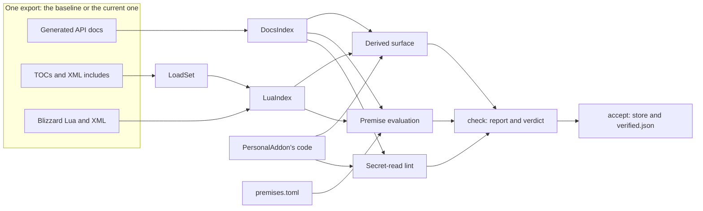
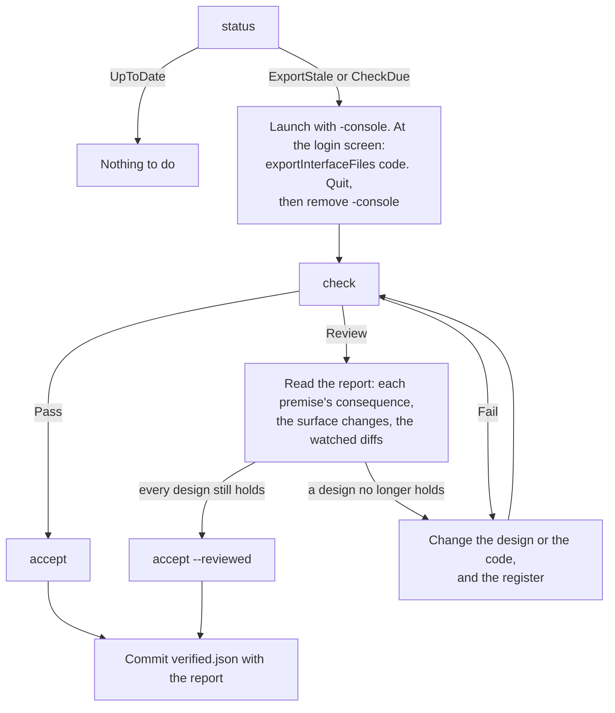

# PersonalAddon — Phase 10 Design: patch check (R6), tools in the repo, evidence gaps
**Date:** October 3, 2026
**API Version:** 1.60.1 (WoW Forever Beta), game type `camelot`, build 1.60.1.70205. UI source exported 2026-10-02 20:44.
**Implements:** `20261002-GAPBugs01.md` R6 and §5 S4, plus the two evidence gaps of Phase 9 §9.4, as decided on 2026-10-03 (§1.1)
**Depends on:**
- GAPBugs01 §1.4 (the hand check R6 replaces), §2 and §2.9 (G1's files), §4 (R6), §5 S4;
- Phase 8 §3 (loot chat outside lockdown), §6 (toasts);
- Phase 9 §3 (`Diagnostics`), §4.2 (map-restriction sampling), §6.3 (the sole-caller premise), §9.1–§9.2 (harness and lint);
- README "Rules for future development".

**Revision:** 3. Audit dispositions in §14; what the build corrected in §15; revision history at the end.
**Status, 2026-10-03:**
- **Built, not committed.**
- **Offline verification passed:**
  - the harness: 311 checks in twelve sessions, the 292 from Phases 7–9 among them, all unchanged;
  - the lint: 0 hits, 5 allowlisted, none stale, the same output as before the move;
  - the patch check's tests: T1–T15, 19 tests, all pass;
  - build 1.60.1.70205 adopted as the baseline, and its self-check passes.
- **In-game verification (§10.3) pending.**

---

## 1. Scope

### 1.1 Decisions

| Question | Answer (2026-10-03) |
|---|---|
| Phase 10 items | R6; Phase 9's two evidence gaps; the harness, the lint and the patch check moved into the repo |
| Phase 11 items | The threat panel (the user's idea, built on GAPBugs01 §4.1) and R7. Both read threat, so they share one reader |
| Loot toasts in a dungeon (Phase 8 criterion 12) | Met. A green item and money toasted on a solo dungeon mob on 2026-10-03; the earlier miss was likely overlooked. No toast change: fix only if it recurs |
| Where tools live | In the repo, under `Tools/` |
| In-game notice when the client build is unverified | No. R6 is offline only |
| Threat % in Phase 11 | The player's scaled threat on each mob; 100% means the mob is on you |

### 1.2 What ships

| Item | Kind | Section |
|---|---|---|
| `Tools/`: the harness, the secret-read lint and the patch check, versioned, with derived paths | Housekeeping | §2 |
| `DocsIndex`: one parser of the generated API docs, shared by the lint and the patch check | Tooling | §3.1 |
| `LoadSet` and `LuaIndex`: which exported files load on `camelot`, and what they define and call | Tooling | §3.2–§3.3 |
| The premise register: each fact a design relies on about Blizzard's code, with a check | R6 | §4 |
| The derived surface: every Blizzard name our code uses, compared across exports | R6 | §5 |
| `patch_check.py` with `status`, `adopt`, `check` and `accept`; the report; the baseline store | R6, S4 | §6 |
| `MapRestriction`, a core helper extracted from Nameplates | Evidence gap | §7.1 |
| Toast counters in `PersonalAddonDiagnostics`, with restricted-map counts | Evidence gap | §7.2 |
| `/pa blocked selftest` results in `PersonalAddonDiagnostics` | Evidence gap | §7.3 |
| BlockWatch's hint names cursor state, as the README now does | Housekeeping | §7.4 |
| README rule 11 and a Development section | Housekeeping | §8 |
| Release: TOC `1.0.3`, `X-Phase: 10`, `ns.VERSION` | Housekeeping | §13 |

**Out of scope:**
- the threat panel and R7 (Phase 11);
- any change to toast parsing, since toasts work in instances (§1.1). The new counters would show a regression;
- an in-game build notice (§1.1);
- GAPBugs01 §5 S2 and follow-up comment 2, which are the user's own steps.

### 1.3 Corrections to earlier documents

1. **GAPBugs01 §1.4 missed two added files.**
   - It says the 09-26 and 10-02 exports differ in 127 files, "none added or removed". The 127 is right, but two files were added: `Blizzard_AchievementUI/Camelot/Blizzard_AchievementUI.lua` and `Blizzard_ProjectConstants/Camelot/ProjectConstants.lua`.
   - It also left out three files on paths we depend on that changed: `PageUnit.lua`, `Blizzard_Game/Shared/EventImplementation.lua` and `ContainerFrame.lua`. All three changes are harmless (§10.1, T2).
   - A hand diff missed all five. §10.1's T2 reproduces them from the two exports.
2. **Phase 9 §9.4: criteria 3 and 9 are met.** Chatify's history holds "PersonalAddon: selftest: 17/17 passed" from the 12:57 login on 2026-10-03, and the user saw loot toasts in a dungeon the same day. Phase 9 meets all 14 exit criteria.
3. **One of Nameplates' five hook candidates is defined nowhere in either export: `DefaultCompactNamePlateFrameSetup`** (`Features/Nameplates.lua:833–839`). The other four are in `CompactUnitFrame.lua`.
   - This is not a defect. The hook loop installs whichever candidates exist, and the login line names four.
   - The day a patch defines it, the derived surface reports it as `Appeared` (§5.3), because our loop will then start hooking it.
4. **Phase 8 §1.1 and §6.1 inferred that `BossBanner` never loads on this client, from its `[AllowLoadGameType mainline]` tag. The inference is wrong; found while building §3.2.**
   - The client loads files with that tag. `[Family]\QuestMapFrame.lua [AllowLoadGameType mainline]` appears in BugGrabber's stacks from this client.
   - `Camelot/ContainerFrame.lua` extends `ContainerFrameCombinedBagsMixin`, which only `Mainline/ContainerFrame.lua` defines, and that file is tagged `mainline` too.
   - 73 TOC lines pair `mainline` with an explicit `[ExcludeLoadGameType camelot]`, which would be redundant unless `mainline` included `camelot`.
   - So `camelot` belongs to the `mainline` family, and `BossBanner` most likely loads.
   - Phase 8's decision stands on its other reason: ordinary loot never feeds Blizzard's alerts. The README's "Tried and not possible" row now gives only that reason.

Citations of the form `File.lua:NN` without `Core/` or `Features/` are in the exported UI source, under `_classic_beta_/BlizzardInterfaceCode/Interface/AddOns/`.

### 1.4 Types

Used as earlier documents define them:

| Types | Defined in |
|---|---|
| `FeatureId` | Phase 1 §6 |
| `ClientBuildNumber`, `WallClockSeconds` | Patch 01 §6.1 |
| `ClientRead<T>`, `WithheldReason` | GAPBugs01 §3.6; Phase 9 §2.2 |
| `CounterName`, `Path`, `Nothing`, `Clock`, `LintReport` | Phase 9 §1.4 |

Defined here:

```
type ExportRoot = Path
type ExportPath = string
type Sha256 = string
type GameType = string
type TextLocale = string
type QualifiedName = string
type PremiseId = string
type TocTag = string

type DocEntryKind = GlobalFunction | NamespacedFunction | WidgetMethod | Event
type DocFlags = Map<string, string>
type DocEntry = {
    name: QualifiedName,
    kind: DocEntryKind,
    flags: DocFlags,
    fieldFlags: Map<string, DocFlags>,
    file: ExportPath,
}
type DocsIndex = Map<QualifiedName, List<DocEntry>>

type LoadSet = {
    files: Set<ExportPath>,
    unknownTags: List<TocTag>,
    missingFiles: List<ExportPath>,
}
type SourceLine = { file: ExportPath, line: integer }
type LuaIndex = {
    definitions: Map<string, List<ExportPath>>,
    callSites: Map<string, List<SourceLine>>,
    registryEvents: Map<string, List<SourceLine>>,
}
type ExportView = {
    root: ExportRoot,
    docs: DocsIndex,
    loadSet: LoadSet,
    lua: LuaIndex,
    hashes: Map<ExportPath, Sha256>,
}
```

- `QualifiedName` spells a documented entry the way the docs do: `UnitThreatSituation`, `C_Item.GetItemQualityByID`, `SimpleStatusBarAPI:SetValue` (a method under the system that documents it), or `event CHAT_MSG_LOOT`. A global defined in Blizzard's Lua or XML is `lua CompactUnitFrame_UpdateAll`; a callback-registry event is `registry ContainerFrame.OpenBag`.
- `ExportPath` is relative to `Interface/AddOns`, with forward slashes.
- `DocFlags` keeps each key's literal value text, so `SecretArguments = "AllowedWhenTainted"` and `SecretReturns = true` compare as written.

The premise, surface, report and store types are defined in §4–§6, where they are used.

---

## 2. Tools in the repo

### 2.1 Layout

| Path | Holds | From |
|---|---|---|
| `Tools/README.md` | Setup, the commands, and the patch procedure (§6.4) | New |
| `Tools/requirements.txt` | `lupa==2.8`, for the harness only | New |
| `Tools/config.toml` | Defaults: game type, text locale, diff budgets, the baseline store's location | New |
| `Tools/common/paths.py` | The repo, the client root, the export, `WowB.exe`, the store; all derived (§2.2) | New |
| `Tools/common/docs_index.py` | `DocsIndex` (§3.1) | Split out of `secret_lint.py` |
| `Tools/common/lua_scan.py` | Blanks comments and strings, `--[[ ]]` blocks and long strings included | Grown from `secret_lint.py`'s line scanner |
| `Tools/common/load_set.py`, `Tools/common/lua_index.py` | §3.2, §3.3 | New |
| `Tools/harness/` | `run.py`, `stubs.lua`, `stubs8.lua`, `stubs9.lua`, `tests.lua`, `tests8.lua`, `tests9.lua`, and the new `tests10.lua` (§10.2) | `c:\tmp\PersonalAddonHarness` |
| `Tools/lint/` | `secret_lint.py`, `secret_lint_allow.txt` | `c:\tmp\PersonalAddonHarness` |
| `Tools/patchcheck/` | `patch_check.py`, `premises.toml` (§4), `verified.json` (§6.3), `reports/` (§6.2), `fixtures/` (§10.1) | New |

**Not carried over:** `tests.phase7-with-probe.lua.bak` and `tests8_autosort_autosell.lua.part`. They test a probe that Phase 8 removed, and cannot run. The `c:\tmp` folder stays as it is until Phase 10's exit criteria are met; after that it can be deleted.

**How the parts connect:**



### 2.2 Paths and configuration

- **Every path derives from the script's own location.** The repo is `<client>/Interface/AddOns/PersonalAddon`, so the client root is three levels up, and the export is `<client>/BlizzardInterfaceCode`. The two hard-coded paths, `run.py:12` and `secret_lint.py:18`, go away.
- **`Tools/config.toml` is versioned and holds defaults.** `Tools/config.local.toml` is ignored by git and overrides any key: another machine, or another place for the baseline store.
- **`.gitignore` gains `__pycache__/` and `Tools/config.local.toml`.**

### 2.3 What stays outside the repo

| Thing | Where | Why |
|---|---|---|
| The Python venv with lupa | Any folder; `Tools/README.md` gives the two commands | Regenerable, and thousands of files |
| The baseline export | The baseline store, by default `C:\tmp\PersonalAddonBaseline` (§6.3) | 46 MB in 4,415 files. The repo keeps what a degraded check needs (§6.3) |
| Full watched-file diffs | The baseline store | Reports keep bounded diffs (§6.2) |

### 2.4 The client and clones

The client loads only files the TOC lists, and the XML they include, so nothing under `Tools/` loads in game. Clones carry about 200 KB more. A release zip, if one is ever made, leaves `Tools/` out.

### 2.5 The move must not change any result

Acceptance is exact. Run from `Tools/`:
- the harness reports the same checks, in the same ten sessions, as from `c:\tmp`;
- the lint reports 0 hits, 5 allowlist entries and none stale, and prints the same counts of secret-capable names as today.

---

## 3. Shared substrate

### 3.1 `DocsIndex`

```
# Parses the generated API docs into entries carrying every flag they declare. The
# docs are read as text and never executed.
# pre:  export contains Interface/AddOns/Blizzard_APIDocumentationGenerated
# post: one DocEntry per documented function, widget method and event; flags hold
#       every top-level key except Name, Type, Arguments, Returns, Payload,
#       Documentation and LiteralName, with its literal value; fieldFlags hold, for
#       each argument, return and payload field, every key but Name and
#       Documentation; a key the parser has not seen before is kept like any other;
#       a file that cannot be parsed is listed in parseErrors, which fails a check
# raises: ExportMissing when the docs folder does not exist
function build_docs_index(export: ExportRoot) -> DocsIndex

# The lint's definition of secret-capable, unchanged from Phase 9 §9.2.
# pre:  none
# post: true when any flag key begins with "Secret", other than SecretArguments and
#       SecretArgumentsAddAspect, or when any field carries such a key
# raises: never
function is_secret_capable(entry: DocEntry) -> boolean
```

- **The lint moves onto it.** `secret_lint.py` keeps its matching rules and allowlist, and asks `DocsIndex` for the four sets it builds itself today. Its output must not change (§2.5).
- **Unknown keys are kept.** A patch that introduces a new flag then shows as a flag change (§5.3), not as silence.
- **As built:**
  - The docs are parsed as table literals, not split by indentation as the lint used to.
  - Four files write constant values as arithmetic (`A + B`, `A * B`). Those values are kept as their text.
  - The 10-02 export holds 8,404 entries, with no parse errors.
  - The lint's four sets come out identical on both exports: 130 global functions, 91 namespaced, 111 widget methods and 93 events.

### 3.2 `LoadSet`

Some exported files never load on this client: `Blizzard_UIPanels_Game/Vanilla/ContainerFrame.lua` is in the export, and is tagged for `vanilla` and `tbc` only. A name defined only in such a file must not count as defined.

```
# The exported files the client loads in game, for one game type and text locale.
# pre:  export holds the TOC files
# post: files holds every file a TOC lists, after resolving its path tags, when
#       the TOC and the line both allow gameType, in-game loading and textLocale;
#       files an XML file includes through <Script file> or <Include file> are added
#       under the same rules; tags these rules do not know are treated as allowing,
#       and listed in unknownTags; listed paths that do not exist go to missingFiles
# raises: never
function resolve_load_set(
    export: ExportRoot,
    gameType: GameType,
    textLocale: TextLocale
) -> LoadSet
```

| Rule | Evidence in the export |
|---|---|
| **This client is named by `camelot` or `mainline`.** `camelot` belongs to the `mainline` family; the list is `game_types` in `Tools/config.toml` | The running client loads `[Family]\QuestMapFrame.lua [AllowLoadGameType mainline]` (BugGrabber's stacks); `Camelot/ContainerFrame.lua` extends a mixin only the `mainline`-tagged `Mainline/ContainerFrame.lua` defines; 73 lines pair `mainline` with an explicit `[ExcludeLoadGameType camelot]` |
| TOC `## AllowLoadGameType: a, b`: the addon loads only when it names this client. No header: every game type. `standard` does not include `camelot` | `Blizzard_GamepadActionBars.toc` is `camelot` only. The 29 `standard`-only TOCs are retail content (housing, delves, remix), and 11 TOCs list `standard, camelot` |
| TOC `## AllowLoad: Glue`: not in game. `Game`, `Both` or no header: in game | 16 TOCs say `Glue` or `glue` |
| A `##` header line can carry tags, and then applies only when they allow this client | `## AllowLoad: game [AllowLoadGameType classic]`, `## Dep: … [AllowLoadGameType mainline]` |
| Line `[AllowLoadGameType a, b]`: loads only when it names this client. `[ExcludeLoadGameType a, b]`: never when it does | 1,078 and 143 lines |
| Tag values are separated by commas, spaces, or both | `[ExcludeLoadGameType camelot classic]`, `[ExcludeLoadGameType vanilla tbc]` |
| The TOC read is the one named after its folder | `Blizzard_EndOfMatchUI` holds two TOCs |
| An XML include resolves against the XML's folder, then against the addon's root | `Blizzard_SettingsDefinitions_Frame/Mainline/Colorblind.xml` includes `Colorblind.lua`, which sits at the addon's root |
| Line `[AllowLoad glue]`: never. `[AllowLoad game]`: yes | 23 and 19 lines |
| Line `[AllowLoadTextLocale x]`, also written `[AllowLoadTextLocale: x]`: loads only when `x` is the configured locale | 6 and 2 lines |
| `[Family]\` resolves to `Mainline\`; `[Game]\` resolves to `Camelot\` | The running client loads `Blizzard_ChatFrameBase/Mainline/ChatFrameOverrides.lua` from a `[Family]` line; `Blizzard_Game.toc` lists `[Game]\EventImplementation.lua` for `camelot`, and `Blizzard_Game/Camelot/` exists |
| `[Bootstrap]`, `[AllowLoadEnvironment x]`, `[LoadIntoEnvironment x]`: do not decide whether a file loads | 86, 37 and 11 lines |
| `## LoadOnDemand: 1`: included, because such an addon can load | 119 TOCs |
| Tag names and values compare without regard to case | `[AllowLoad Game]` and `[AllowLoad game]`, `Global` and `global`, both appear |

A wrong path rule cannot pass silently: it puts files in `missingFiles`, and names they define show up as `Gone`.

**As built, on the 10-02 export:**
- 3,304 files load, with 0 unknown tags and 0 missing files.
- All 53 Blizzard files that appear in this client's BugGrabber stacks and taint logs are in the set. T15 (§10.1) keeps that check.

### 3.3 `LuaIndex`

```
# Global definitions, call sites and callback-registry events in the loaded files.
# pre:  loadSet came from the same export
# post: definitions maps each global defined at file scope (function Name(...),
#       Name = function, Name = {...}, or a mixin table in Lua; an XML frame with a
#       literal name="Name") to the files defining it; callSites maps each name
#       called as Name( to its lines, definitions excluded; registryEvents maps each
#       string literal passed to TriggerEvent to its lines. The generated docs
#       folder is never a source of calls
# raises: never
function build_lua_index(
    export: ExportRoot,
    loadSet: LoadSet
) -> LuaIndex
```

**What is blanked, and when:**
- **Lua files:** comments and string contents, `--[[ ]]` blocks and long strings included, are blanked before definitions and calls are matched. Literals passed to `TriggerEvent` are read from the unblanked line.
- **XML files:** frame names come from the raw markup, before anything is blanked, so `name="Name"` survives. Names beginning with `$parent` are not globals and are skipped.
- **Lua inside XML:** the text of `<Script>` bodies and of handler elements such as `<OnLoad>` and `<OnClick>` is treated as Lua, blanked the same way, and searched for calls. Without this, a caller added in a handler would be invisible to `Callers` (§4.1). On 10-02, no XML file calls `SetPreferredGamepadInteractTarget`.

**As built:**
- Call sites are indexed only for the names a `Callers` premise asks about, which keeps the index small.
- On the 10-02 export, the index holds 16,432 definitions and 376 registry events, and takes about a second.
- The only call site of `SetPreferredGamepadInteractTarget` is `MainActionBarFrame.lua:255`.

---

## 4. The premise register

### 4.1 Format and evaluation

`Tools/patchcheck/premises.toml` is versioned, hand-written data. Each entry states one fact that a design relies on, where the design says so, what to re-read if the fact stops holding, and how to check it.

```
type PremiseCheck =
    Callers(name: string, files: Set<ExportPath>, count: integer)
  | Defined(name: string)
  | Pattern(file: ExportPath, regex: string, expect: Present | Absent)
  | FlagAbsent(entry: QualifiedName, flag: string)
  | Watch(files: List<ExportPath>)

type Premise = {
    id: PremiseId,
    statement: string,
    source: string,
    consequence: string,
    check: PremiseCheck,
}

type PremiseOutcome =
    Holds
  | NeedsReview(changedFiles: List<ExportPath>)
  | Broken(evidence: string)
  | Unknown(reason: string)

type RegisterInvalid = { faults: List<string> }
```

```
# Reads and validates the register.
# pre:  none
# post: Success when every id is unique, every field is present, every path is
#       relative, normalised and free of "..", every regex compiles and every check
#       kind is known; Failure names each offending entry and field
# raises: never
function load_register(file: Path) -> Result<List<Premise>, RegisterInvalid>

# Evaluates one premise against the current export, using the baseline for Watch.
# pre:  current is complete; baseline may be degraded (§6.3)
# post: Callers holds when the call sites lie exactly in files and number count.
#       Defined holds when the load set defines name.
#       Pattern holds when the file is loaded and the regex's presence matches expect.
#       FlagAbsent holds when the entry exists without flag; Broken when the entry
#       has the flag or no longer exists.
#       Watch holds when every file's hash equals the baseline's; NeedsReview
#       otherwise.
#       Unknown when a named file is not in the load set, or a needed baseline hash
#       is missing
# raises: never
function evaluate_premise(
    premise: Premise,
    current: ExportView,
    baseline: BaselineView
) -> PremiseOutcome
```

**`Unknown` counts as broken** in the verdict (§6.2). A premise the tool could not check has not been shown to hold.

### 4.2 The initial register

Each entry traces to the document that relies on it. GAPBugs01 §1.4's hand list maps onto entries 1–4 and onto the derived surface.

| # | Id | Statement | Check | Source | If it stops holding |
|---|---|---|---|---|---|
| 1 | `G1-SOLE-CALLER` | `SetPreferredGamepadInteractTarget` has exactly one caller | `Callers`: 1, in `Blizzard_GamepadActionBars/MainActionBarFrame.lua` | Phase 9 §6.3 | BlockWatch labels refusals by the wrong rule. Re-check `classify_refusal` |
| 2 | `G1-PATH` | G1's mechanism, as GAPBugs01 §2 and §2.9 describe it | `Watch`: the 12 files of §4.3 | GAPBugs01 §1.4, §2.9 | Re-read GAPBugs01 §2 against the diff. If Blizzard fixed G1, retire the hint (§7.4) and the README's known issue |
| 3 | `PLATE-HEALTHBAR` | Nameplate frames alias `healthBar` to `HealthBarsContainer.healthBar` | `Pattern` present: `self\.healthBar\s*=\s*self\.HealthBarsContainer\.healthBar` in `Blizzard_NamePlates/Blizzard_NamePlateUnitFrame.lua` | GAPBugs01 §1.4; Phase 7 | Nameplate colours find no bar |
| 4 | `PLATE-COLOUR` | Blizzard's colour update paints tapped grey ahead of threat red, and every colour write passes the hooked functions | `Watch`: `Blizzard_UnitFrame/Shared/CompactUnitFrame.lua` | Phase 7 §5.4; Phase 9 §4.4 | Re-check the colour priority and the restyle contest |
| 5 | `THREAT-READABLE` | `UnitThreatSituation` is secret only for restricted pairings, never by default | `FlagAbsent`: `SecretReturns` | GAPBugs01 §3, §5 S3 | Nameplate aggro cedes everywhere |
| 6 | `LOOT-TEXT-READABLE` | Loot chat is outside chat lockdown | `FlagAbsent`: `SecretInChatMessagingLockdown` on `event CHAT_MSG_LOOT` | Phase 8 §3, criterion 12 | Item toasts go silent in instances |
| 7 | `MONEY-TEXT-READABLE` | Money chat is outside chat lockdown | `FlagAbsent`: `SecretInChatMessagingLockdown` on `event CHAT_MSG_MONEY` | Phase 8 §3, criterion 12 | Money toasts go silent in instances |
| 8 | `BANK-LISTENER` | `BankPanel` listens to `ITEM_LOCK_CHANGED` only while shown | `Watch`: `Blizzard_UIPanels_Game/Mainline/BankFrameTemplates.lua`, which loads here through the `mainline` family, and `Blizzard_UIPanels_Game/Camelot/BankFrame.lua`, this client's bank frame | GAPBugs01 §4 | Tidy bags holds back when it need not, or sorts when it must not |
| 9 | `LOOT-ALERTS` | Blizzard's loot alerts come only from server toast events and roll wins | `Watch`: `Blizzard_FrameXML/Mainline/AlertFrames.lua` | Phase 8 §6.1 | Our toasts duplicate Blizzard's |
| 10 | `SETTINGS-DATA` | Registering settings stores initializer data in Blizzard's tables, one of README rule 2's exceptions | `Watch`: `Blizzard_Settings_Shared/Blizzard_Settings.lua` | GAPBugs01 R4 | The exception's wording |
| 11 | `CHAT-FADE` | Our chat lines reach the shared fade list, the other exception | `Watch`: `Blizzard_SharedXMLBase/FrameUtil.lua` | GAPBugs01 R4 | The exception's wording |
| 12 | `FORBIDDEN-DIALOG` | Blizzard's forbidden-action dialog opens inside the refused call | `Watch`: `Blizzard_Game/Shared/EventImplementation.lua` | GAPBugs01 §2.4 | BlockWatch's storm reasoning (Phase 9 §6.2) |
| 13 | `CHARPANE-SECRET` | The defect reported in GAPBugs01 §2.8 | `Watch`: `Blizzard_TextStatusBar/TextStatusBar.lua` | GAPBugs01 §2.8 | Whether Blizzard fixed it |
| 14 | `PLAYER-MANABAR` | `PlayerFrame.manabar` is the player's mana bar, set by `UnitFrame_Initialize` | `Pattern` present: `self\.manabar\s*=\s*manabar` in `Blizzard_UnitFrame/Mainline/UnitFrame.lua` | README rule 2's exceptions; `Features/FiveSecondRule.lua` (`resolveManaBar`) | The five-second-rule line finds no bar |
| 15 | `PLAYER-FRAME` | The player frame the five-second-rule line is drawn against | `Watch`: `Blizzard_UnitFrame/Mainline/PlayerFrame.lua`, `Blizzard_UnitFrame/Camelot/PlayerFrame.lua` | README rule 2's exceptions | Re-check the line's anchoring and size reads |

Entries 14 and 15 were added during the build. `Features/FiveSecondRule.lua` reads `PlayerFrame.manabar` first; its fallback, `_G.PlayerFrameManaBar`, exists nowhere in this export. No premise covered that dependency before.

**Not listed:** hook targets, bag events, and every documented function, widget method and event our code uses. §5 derives those from our code each run, so they cannot be forgotten.

### 4.3 The G1 path files

- `Blizzard_GamepadActionBars/MainActionBarFrame.lua`
- `Blizzard_GamepadActionBars/PageUnit.lua`
- `Blizzard_GamepadSharedUtility/FrameControlsManager.lua`
- `Blizzard_GamepadSharedUtility/FrameReformUtility.lua`
- `Blizzard_GamepadSharedUtility/InputBindingStack/InputBindingManager.lua`
- `Blizzard_GamepadSharedUtility/InputBindingStack/BindingSetFactory.lua`
- `Blizzard_GamepadSharedUtility/PromptedBindings/PromptedBindingFooter.lua`
- `Blizzard_GamepadSmartNavigation/SmartNavigation.lua`
- `Blizzard_GamepadSmartNavigation/Utility.lua`
- `Blizzard_StaticPopup/StaticPopupGamepad.lua`
- `Blizzard_Settings_Shared/Blizzard_SettingsPanel.lua`
- `Blizzard_UIParentPanelManager/Shared/UIParentPanelManager.lua`

### 4.4 Keeping the register current

A design that relies on a fact about Blizzard's code adds a register entry in the same change (README rule 11, §8). Phase 11 adds its own:
- that the widget setters it feeds hidden values to accept them (`StatusBar:SetValue`, `StatusBar:SetMinMaxValues`, `FontString:SetText`);
- `UnitDetailedThreatSituation`'s flags.

---

## 5. The derived surface

### 5.1 Purpose

Hand lists go stale. The surface is computed from our code on every run: each Blizzard name PersonalAddon mentions that an export defines or documents. A patch that removes or changes one is caught whether or not anyone remembered that we use it.

### 5.2 Extraction

```
type SurfaceOrigin = Documented(kind: DocEntryKind) | BlizzardLua | RegistryEvent
type SurfaceName = {
    name: QualifiedName,
    origin: SurfaceOrigin,
    usedAt: List<SourceLine>,
}

# Every Blizzard name the addon's code mentions, matched by the lint's rules.
# pre:  docs and lua each hold the union of the baseline's and the current export's
#       entries
# post: holds a name when addon code (Core/*.lua, Features/*.lua) uses it as a
#       documented global function (a bare identifier), a documented namespaced
#       function (C_X.Y, or .Y on a chain outside ns.), a documented widget method
#       (:Y, mapped to every system that documents Y), a documented event (any
#       string literal), a global the load set defines (an identifier, or a string
#       literal, which covers hook candidates), or a literal the load set passes to
#       TriggerEvent; names the addon defines itself, Lua's own libraries and ns.*
#       are excluded
# raises: never
function derive_surface(
    addonRoot: Path,
    docs: DocsIndex,
    lua: LuaIndex
) -> List<SurfaceName>
```

Deriving against the union of both exports is what makes `Appeared` visible. A hook candidate that only the new export defines is still on the surface.

**As built:**
- **Locals are excluded.** A bare identifier counts only when the same file does not declare it local or take it as a parameter; a `_G.Name` reference always counts.
- **Simple aliases resolve.** `local api = C_DamageMeter` makes `api.GetCombatSessionSourceFromType` count as `C_DamageMeter.GetCombatSessionSourceFromType`.
- **On the 10-02 export, the surface holds 168 names:**
  - documented: 18 global functions, 26 namespaced functions, 59 widget methods and 27 events;
  - 36 Blizzard globals;
  - 2 registry events.

### 5.3 Comparison

```
type SurfaceChange =
    Unchanged
  | Gone
  | Appeared
  | Moved(before: List<ExportPath>, after: List<ExportPath>)
  | FlagsChanged(before: DocFlags, after: DocFlags)

# Compares each surface name across the two exports.
# pre:  surface came from derive_surface over both exports
# post: Gone when the baseline defines or documents the name on camelot and the
#       current export does not; Appeared for the reverse; Moved when both define it,
#       in different files; FlagsChanged when a documented entry's flags or field
#       flags differ; Unchanged otherwise
# raises: never
function compare_surface(
    surface: List<SurfaceName>,
    baseline: BaselineView,
    current: ExportView
) -> List<(SurfaceName, SurfaceChange)>
```

| Change | Effect on the verdict | Why |
|---|---|---|
| `Gone` | Fail | Our code calls, hooks or subscribes to something that no longer exists |
| `FlagsChanged` | Review; Fail if the lint then fails | A secrecy or event flag moved. The lint decides whether our reads still hold |
| `Appeared` | Review | A name we already mention now exists, so our code starts using it |
| `Moved` | Review | Usually a refactor. The diff shows whether behaviour moved with it |

### 5.4 Beyond our surface

The report also counts every documented entry added, removed or with changed flags, and lists up to 50 of each kind. A design for a new feature reads that list to see what a patch made possible.

**What R6 cannot see.** GlobalStrings and CVars are compiled into the client, not exported.
- Toasts already checks its format strings when it enables, and says so in chat (`toasts:nopatterns`).
- A claim about a CVar is still checked against `WowB.exe`'s help text, by hand.

---

## 6. The patch check

### 6.1 Commands

```
type ToolPaths = {
    repo: Path,
    client: Path,
    export: ExportRoot,
    binary: Path,
    store: Path,
    register: Path,
    reports: Path,
}

type ClientIdentity = {
    build: Optional<ClientBuildNumber>,
    binaryModifiedAt: WallClockSeconds,
}

type PatchStatus =
    UpToDate(client: ClientIdentity)
  | ExportStale(client: ClientIdentity, exportedAt: WallClockSeconds)
  | CheckDue(client: ClientIdentity, verified: ClientIdentity)
  | BaselineMissing
  | RecoveryPending(actions: List<string>)
  | AcceptIncomplete(storeDigest: Sha256, verifiedDigest: Sha256)

type BuildUnreadable = NoVersionResource | Unparsable(text: string)
type CheckRefused = ExportMissing | ExportStale | RegisterInvalid | BaselineMissing
type AdoptRefused = BaselineExists | ExportStale | ExportMissing
type AcceptRefused =
    VerdictFail
  | NotReviewed
  | ExportChangedSinceCheck
  | StepFailed(step: integer, reason: string)
```

```
# Reads the client's build from WowB.exe's version resource (FileVersion).
# pre:  none
# post: Failure when the resource is absent or does not parse
# raises: never
function read_client_build(binary: Path) -> Result<ClientBuildNumber, BuildUnreadable>

# Where the client, the export and the verified record stand. Reads only: it never
# recovers or repairs anything.
# pre:  none
# post: BaselineMissing when verified.json does not exist; RecoveryPending, naming
#       each action the next adopt, check or accept will take, when an interrupted
#       accept left files behind (§6.3); AcceptIncomplete when the store manifest's
#       exportDigest differs from verified.json's; ExportStale when WowB.exe is
#       newer than the export's newest file; CheckDue when the client differs from
#       the verified record; UpToDate otherwise. Two clients differ when both builds
#       are known and unequal, or, when either build is unknown, when their
#       binaryModifiedAt differ; the output then says the build was unreadable and
#       file times were compared
# raises: never
function status(
    paths: ToolPaths,
    clock: Clock
) -> PatchStatus

# Records the current export as verified without comparing it. Used once, for the
# build Phase 9 was verified on.
# pre:  status is BaselineMissing; the export is not stale
# post: the store holds the export and its manifest; verified.json records the
#       build, with acceptedBy = Adopted
# raises: never
function adopt(
    paths: ToolPaths,
    clock: Clock
) -> Result<VerifiedRecord, AdoptRefused>

# Compares the current export with the baseline, and writes the report.
# pre:  the register loads; the export is not stale; verified.json exists
# post: a report in Tools/patchcheck/reports/; the full watched diffs in the store;
#       exit code 0 for Pass, 2 for Review, 1 for Fail, 3 when refused; neither the
#       store nor verified.json changes
# raises: never
function check(
    paths: ToolPaths,
    clock: Clock
) -> Result<CheckReport, CheckRefused>

# Makes the checked export the new baseline. All or nothing.
# pre:  report's verdict is Pass, or Review with reviewed = true; the export's
#       digest, recomputed now, still equals report.exportDigest
# post: on Success, the store holds this export and verified.json records it; on
#       Failure, the previous baseline is intact and the failed step is named
# raises: never
function accept(
    report: CheckReport,
    reviewed: boolean,
    paths: ToolPaths,
    clock: Clock
) -> Result<VerifiedRecord, AcceptRefused>
```

**A Fail cannot be accepted.** Fix the design, the code or the register, then `check` again. `ExportChangedSinceCheck` stops an `accept` of an export re-exported after its check.

**`adopt`, `check` and `accept` first run §6.3's recovery,** and print each action. `status` only reports it (`RecoveryPending`).

**As built:**
- **`accept` reads the report it accepts from the store.** `check` keeps its machine-readable result in the store as `last-check.json`, so `accept` needs no argument but `--reviewed` or `--resume`.
- **`check --baseline-export <folder>` compares against any export folder instead of the store.** T2 uses it with the 09-26 export, and it writes no verified record.
- **When an `accept` stopped between its commit and `verified.json`, recovery and `accept --resume` are both due.** `status` then reports `RecoveryPending`, and its last line says to run `accept --resume`. T10 found this.

### 6.2 The verdict and the report

```
type Verdict = Pass | Review(reasons: List<string>) | Fail(reasons: List<string>)
type FileChange = Added | Removed | Modified(linesAdded: integer, linesRemoved: integer)
type CheckReport = {
    verdict: Verdict,
    client: ClientIdentity,
    baseline: ClientIdentity,
    exportDigest: Sha256,
    degraded: boolean,
    premises: List<(Premise, PremiseOutcome)>,
    surface: List<(SurfaceName, SurfaceChange)>,
    watched: List<(ExportPath, FileChange)>,
    lint: LintReport,
    exportAdded: List<ExportPath>,
    exportRemoved: List<ExportPath>,
    exportModifiedCount: integer,
    docsAdded: List<QualifiedName>,
    docsRemoved: List<QualifiedName>,
    docsFlagsChanged: List<QualifiedName>,
    loadSet: LoadSet,
}
```

```
# One digest for a whole export, so a report can name exactly the export it judged.
# pre:  hashes holds every file of the export
# post: SHA-256 of the lines "<ExportPath>\t<file SHA-256>\n", one per file, sorted
#       by path, in UTF-8. Equal digests mean the same files with the same contents
# raises: never
function export_digest(hashes: Map<ExportPath, Sha256>) -> Sha256

# The verdict, from the most severe finding.
# pre:  every part of report is filled
# post: Fail when any premise is Broken or Unknown, any surface name is Gone, or the
#       lint fails against the current docs. Otherwise Review when any premise
#       NeedsReview, any surface name changed, any TOC tag is unknown, or the
#       baseline is degraded. Otherwise Pass. Each reason names its premise id,
#       surface name or file
# raises: never
function judge(report: CheckReport) -> Verdict
```

**The report** is `Tools/patchcheck/reports/<date>-<build>.md`, versioned; with an unreadable build, `<build>` is `unknown-<binary time>`. In this order:
1. The verdict and its reasons; both builds; whether the check was degraded.
2. Premises: id, outcome, evidence. For anything other than `Holds`, the entry's consequence, which says what to re-read.
3. Surface changes.
4. Watched files: lines added and removed per file, then unified diffs. At most `DIFF_LINES_PER_FILE` (300) lines per file and `DIFF_LINES_PER_REPORT` (2,000) in all; the store keeps the full diffs.
5. The lint result against the current docs.
6. The export: files added, removed and modified, by count, with the added and removed files listed.
7. The docs changes of §5.4, at most 50 per kind.
8. Load-set notes: unknown tags, and files a TOC lists that the export lacks.

The budgets live in `Tools/config.toml`.

### 6.3 The baseline store and the verified record

```
type AcceptedBy = Adopted | Accepted | AcceptedAfterReview
type VerifiedRecord = {
    client: ClientIdentity,
    exportDigest: Sha256,
    exportedAt: WallClockSeconds,
    acceptedAt: WallClockSeconds,
    acceptedBy: AcceptedBy,
    report: Path,
    watchedHashes: Map<ExportPath, Sha256>,
    surfaceDefinitions: Map<QualifiedName, List<ExportPath>>,
    usedFlags: Map<QualifiedName, DocFlags>,
}
type BaselineView = Complete(view: ExportView) | Degraded(record: VerifiedRecord)
```

- **The store** (default `C:\tmp\PersonalAddonBaseline`, 47 MB) holds:
  - `export/`, a copy of the last accepted export;
  - `manifest.json`: every file's SHA-256, plus the record above;
  - `last-check.json`, the last check's result, which `accept` reads;
  - `diffs/`, one full diff of the watched files per check.
- **`Tools/patchcheck/verified.json`** holds the `VerifiedRecord` only, 63 KB for build 70205. It is the last verified build, versioned next to the code verified against it.
- **A degraded check.** If the store's copy is gone, `check` still runs from `verified.json`:
  - every premise is evaluated, `Watch` by hash;
  - the surface and our flags are compared from the record.

  It loses line diffs, and counts of changed files outside the watched ones. The report says so at the top, and the verdict is at least Review.

**`accept` is all or nothing.** Its steps run in this order:
1. Copy the export to `export.new/`. Hash every copied file, and compare `export_digest` of those hashes with `report.exportDigest`. A mismatch stops `accept` with `ExportChangedSinceCheck`.
2. Write `manifest.new.json`: the per-file hashes from step 1, plus the new record. Its presence marks a swap in progress.
3. Rename `export/` to `export.old/`, then `export.new/` to `export/`.
4. **The commit point:** rename `manifest.new.json` over `manifest.json`. This is one atomic replace on the same volume. Before it, the old baseline is the truth; after it, the new one is.
5. Write `verified.json`.
6. Delete `export.old/`.

**Recovery runs before `adopt`, `check` and `accept`.** It decides by the marker, so it never mixes an old manifest with a new export:

| Found | Meaning | Action |
|---|---|---|
| `manifest.new.json` | Stopped before the commit, in step 2, 3 or 4 | Roll back: delete `export.new/` if present; if `export.old/` exists, delete any `export/` and rename `export.old/` back to `export/`; then delete `manifest.new.json`. The store again matches `manifest.json` and `verified.json`, and `accept` can simply be run again |
| `export.new/` without `manifest.new.json` | Step 1 was interrupted | Delete `export.new/` |
| `export.old/` without `manifest.new.json` | Step 6 was interrupted, after the commit | Delete `export.old/` |
| `manifest.json`'s `exportDigest` differs from `verified.json`'s | Step 5 was interrupted | `status` reports `AcceptIncomplete`; `accept --resume` rewrites `verified.json` from the manifest |

After the commit, `export.new/` cannot exist, because step 3 renamed it. So the first three rows never overlap.
- The last two rows both apply when `accept` stopped between steps 4 and 5.
- Recovery then deletes `export.old/`, and `accept --resume` completes the record.
- `status` names both (§6.1).

Each action is printed; none happens silently.

### 6.4 The procedure on a client patch (GAPBugs01 §5 S4)



**No design or test may rely on Blizzard's source while `status` reports anything but `UpToDate`.** That is GAPBugs01 §5 S4, made checkable.

---

## 7. Evidence gaps

### 7.1 `MapRestriction` (new, `Core/MapRestriction.lua`)

Nameplates owns the map-restriction read today (Phase 9 §4.2), and Toasts now needs it too (§7.2).
- A second copy would duplicate the handling Phase 9's audit finding 4 required.
- Reading it through Nameplates would tie Toasts to a feature that can be switched off.

So the read moves to core.

```
type MapRestrictionReading = Restricted | Unrestricted | Unreadable(reason: WithheldReason)

# Whether the current map restricts addons, read now through ClientRead.
# pre:  none
# post: resolves Enum.AddOnRestrictionType.Map through ClientRead.Field once per UI
#       load and reuses the result; Unreadable, without calling the client, when the
#       enum or C_RestrictedActions.IsAddOnRestrictionActive is absent; Unreadable
#       when the read is withheld
# raises: never
function read_map_restriction() -> MapRestrictionReading
```

Nameplates' sampler and `/pa plates` call it. Their counters and what they mean do not change; Phase 9's N12 and N15 must pass unmodified.

### 7.2 Toast counters in `PersonalAddonDiagnostics`

Toasts keeps 14 counts in memory (`Features/Toasts.lua:62–79`). `/pa toasts` prints them, and a `/reload` loses them. That is why criterion 12 needed another trip into a dungeon.

- **The counts move to disk.** They become the `toasts` table from `Diagnostics.CountersFor`, bound at enable like every other feature's, and incremented with `Diagnostics.Bump`. Their names stay.
- **Two counters are new:**
  - `lootMessagesOnRestrictedMap`: loot and money messages processed while `read_map_restriction` returns `Restricted`;
  - `shownOnRestrictedMap`: loot and money toasts shown while it does.
- **When the read happens.** It runs in `processMessage`, a frame after the event (rule 5), once per message. A zone change inside that frame is not worth handling.
- **`/pa toasts` gains one line,** `restricted map: messages=N shown=M`. `Inspect` fills absent counters with 0, because `Bump` creates each one on first use.

```
# Records whether a processed loot or money message came on a restricted map, and
# whether it made a toast.
# pre:  called from processMessage, never from the event handler
# post: when the reading is Restricted, lootMessagesOnRestrictedMap is incremented,
#       and shownOnRestrictedMap too when shown; Unrestricted and Unreadable change
#       nothing, because "could not tell" is not "no" (rule 10)
# raises: never
function note_restricted_map_outcome(
    counters: Map<CounterName, integer>,
    shown: boolean
) -> Nothing
```

**What the next check reads from disk:**
- `toasts.shownOnRestrictedMap > 0` is the evidence criterion 12 lacked.
- If it is 0 while `lootMessagesOnRestrictedMap > 0`, the existing counters (`notOurs`, `unparsed`, `secretTexts`, `unresolved`, `notShown`) say which branch dropped the messages.

### 7.3 Self-test results in `PersonalAddonDiagnostics`

```
type SelfTestFailure = { caseName: string, reason: string }
type SelfTestReport = { passed: integer, total: integer, failed: List<SelfTestFailure> }

# Runs BlockWatch's self-tests and keeps the result on disk.
# pre:  none
# post: blockWatch.selftestRuns is incremented; selftestPassed and selftestTotal
#       hold this run's numbers; each failed case adds a fault note
#       "selftest <case>: <reason>", neutralised and bounded like every fault note
#       (Phase 9 §3)
# raises: never
function run_self_test_recorded() -> SelfTestReport
```

The write sits in BlockWatch, which owns those counters. `/pa blocked selftest` prints exactly as before. As built, `BlockWatch.SelfTest` takes an optional list of cases, which defaults to the 17 built-in ones; the harness hands it a failing case to check the recording (E5).

### 7.4 BlockWatch's hint text

`G1_EXPLANATION` (`Core/BlockWatch.lua:80–83`) says the defect "left its focus and binding state tainted". GAPBugs01 §2.9 showed that the pad cursor's state carries the taint as well. The text becomes "left its focus, binding and cursor state tainted", matching the README's known issue. No harness check reads this text.

---

## 8. README

- **Rule 11**, added to "Rules for future development". The existing numbers stay, because the documents cite them:
  > 11. **A design that relies on a fact about Blizzard's code records it.** Add the fact to the patch check's register, `Tools/patchcheck/premises.toml`, in the same change. After a client patch, run the patch check before relying on any design (`Tools/README.md`).
- **Development**, a short new section before Credits: the three folders under `Tools/`, the two venv commands, and a pointer to the patch procedure in `Tools/README.md`.
- Rule 10's last sentence names "the harness's secret-read lint", and stays true.

---

## 9. Rule compliance

**The in-game changes (§7):**

| Rule | How §7 meets it |
|---|---|
| 1 | No new events, hooks or Blizzard callbacks. The restriction read runs in our own timer callback; the self-test runs in a slash command |
| 2 | Writes only `PersonalAddonDiagnostics`, which is ours |
| 5 | The new read happens a frame after the loot event |
| 7, 9 | `IsAddOnRestrictionActive` only reads. It is not protected, and changes no state that other code listens to |
| 10 | The read goes through `ClientRead`, inside `MapRestriction` |

**The tools** touch the client only to read: the export, and `WowB.exe`'s version resource. They never execute Blizzard's code; docs, TOCs, XML and Lua are parsed as text. The harness executes only our addon, as before.

---

## 10. Verification

### 10.1 Patch-check tests

| # | Given | Expect |
|---|---|---|
| T1 | The 10-02 export as both baseline and current | Pass. Every premise holds; no surface change; the lint as today |
| T2 | Baseline: the 09-26 export (`c:\tmp\BlizzardInterfaceCode-20260926`). Current: the 10-02 export | Review, with all of the following. Export: 127 modified, the 2 added files of §1.3, 0 removed. `G1-PATH` NeedsReview for exactly `BindingSetFactory.lua` (0+/10−), `SmartNavigation.lua` (80+/5−) and `PageUnit.lua` (4+/2−). `PLATE-COLOUR` NeedsReview (`CompactUnitFrame.lua`, 1+/1−). `FORBIDDEN-DIALOG` NeedsReview (`EventImplementation.lua`, 0+/4−). `PLAYER-FRAME` NeedsReview (`Mainline/PlayerFrame.lua`, 10+/4−). Every other premise holds. No surface name `Gone`. `UnitUsesAmmo` among the documented entries added. No flag change on GAPBugs01 §1.4's N1 functions |
| T3 | Fixture: a second call to `SetPreferredGamepadInteractTarget` in another loaded file; separately, one in an XML `<OnShow>` handler | `G1-SOLE-CALLER` Broken, naming the file and line, in both; Fail |
| T4 | Fixture: `function CompactUnitFrame_UpdateAll` removed | That surface name `Gone`; Fail |
| T5 | Fixture: `SecretInChatMessagingLockdown = true` added to `CHAT_MSG_LOOT` | `LOOT-TEXT-READABLE` Broken; Fail |
| T6 | Fixture: `SecretReturns = true` added to `UnitThreatSituation` | `THREAT-READABLE` Broken, and `FlagsChanged` on the surface; Fail |
| T7 | Fixture: a TOC line with a tag the rules do not know | Listed; the file counted as loading; Review |
| T8 | Fixture: the only definition of a surface name moves to an `[AllowLoadGameType classic]` file | `Gone` on `camelot`; Fail. (Revision 2 named a `mainline` file here; `mainline` loads on this client, §3.2) |
| T9 | The store's copy deleted | Degraded: premises by hash, the surface and our flags from `verified.json`, no line diffs; at least Review; the report says why |
| T10 | `accept` stopped after each of its six steps, and between the two renames of step 3 (injected faults) | Before the commit: the next command rolls back, and the store, `manifest.json` and `verified.json` all name the old export. After it: the new export, with `export.old/` cleaned up. After step 4 only: `status` reports `RecoveryPending` with a line saying to run `accept --resume`, and that completes it. `status` itself changes nothing. No leftover remains in any case |
| T11 | A register entry with `..` in a path, a duplicate id, and a bad regex | `RegisterInvalid` naming all three; exit 3 |
| T12 | `WowB.exe` newer than the export | `status` reports ExportStale; `check` refuses with exit 3 |
| T13 | `WowB.exe`'s version resource unreadable (stubbed) | `status` compares file times and says so; a report named `unknown-<binary time>`; `client.build` absent in the record |
| T14 | The export changed between `check` and `accept` | `accept` stops in step 1 with `ExportChangedSinceCheck`; the store unchanged |
| T15 | Every Blizzard file named in this client's BugGrabber stacks and taint logs | All are in the load set (53 on 2026-10-03) |

Besides T1–T15, the suite checks that a Review needs `--reviewed`, that a Fail is refused, and that a `classic`-only file stays outside the load set: 19 tests in all, in `Tools/patchcheck/tests/test_patch_check.py`. **All 19 passed on 2026-10-03, in one to two minutes.**

- **T1, T2 and T15 use the real exports and logs.** T2 is the hand check of GAPBugs01 §1.4, done by the tool.
- **T2's three unreviewed changes were read on 2026-10-03, and none matters to us.** That reading is what a Review looks like:
  - `PageUnit.lua` reorders two initialisation calls;
  - `EventImplementation.lua` drops a shard-transfer handler, away from the dialog at `:91`;
  - `ContainerFrame.lua` adds `ContainerFrameCombinedBagsMixin:CanUseForBagID`, away from the bag events;
  - `Mainline/PlayerFrame.lua`, flagged by entry 15, adds a sound on the PvP flag changing, away from the mana bar.
- **T3–T14 use small synthetic exports** under `Tools/patchcheck/fixtures/`: a few TOCs, Lua files and one docs file. They run in seconds, without copying 46 MB.

### 10.2 Harness: `tests10.lua`, sessions `phase10` and `phase10-noenum`

| # | Given | Expect |
|---|---|---|
| E1 | A green item looted | `toasts.shown = 1` in `PersonalAddonDiagnostics`, with no save step |
| E2 | `HARNESS.restrictedMap = true`; then a green item, a white item and money | `lootMessagesOnRestrictedMap = 3`, `shownOnRestrictedMap = 2`, `notShown = 1`; `/pa toasts` prints them |
| E3 | Session `phase10-noenum`: `Enum.AddOnRestrictionType` absent from load on | The toast still shows; no restricted-map toast counters; the client is never called; `/pa plates` says `unreadable` |
| E4 | `/pa toasts` on a fresh UI load | Every count prints as 0, the restricted-map line included; no error |
| E5 | `/pa blocked selftest`; then `BlockWatch.SelfTest` handed one case that fails | `selftestRuns` 1, then 2; `selftestPassed` 17, then 0; `selftestTotal` 17, then 1; one fault note, `selftest forced: forced failure` |
| E6 | One refusal of the known function blamed on BugSack | The hint names "focus, binding and cursor state" |

E3 needs its own session because `MapRestriction` resolves the enum once per UI load, so removing it mid-session would test nothing. E5 hands `BlockWatch.SelfTest` its own case list, the one seam the recording needs, instead of a hook into the 17 built-in cases. **Results, 2026-10-03:** `phase10` 14 checks and `phase10-noenum` 5, all passing.

Every Phase 7, 8 and 9 session runs unchanged. N12 and N15 cover the `MapRestriction` extraction. The lint stays at 0 hits with the same 5 allowlist entries: the new read sits on a `ClientRead` line inside `MapRestriction`.

### 10.3 In game

One session, with the usual addons:
1. Loot a green item or money in any instance, then `/pa diag`: `toasts.shownOnRestrictedMap` is at least 1.
2. `/pa blocked selftest`, then `/pa diag`: `blockWatch.selftestPassed = 17` and `selftestTotal = 17`.
3. `/pa plates` in the instance shows `restricted map now=yes`, and outdoors `no`.

---

## 11. Failure modes

| Failure | Detected by | Behaviour |
|---|---|---|
| The export is older than the client | `status`, `check` | ExportStale; `check` refuses with exit 3 |
| `WowB.exe`'s version resource unreadable | `read_client_build` | Clients are compared by `WowB.exe`'s time; `status` and the report say so (§6.1) |
| No baseline yet | `status` | BaselineMissing; `adopt`, once |
| The store's copy is lost | `check` | A degraded check from `verified.json` (§6.3); at least Review |
| `accept` interrupted | The marker `manifest.new.json` | Before the commit: roll back. After it: clean up, or `accept --resume`. `status` reports it as `RecoveryPending` (§6.3) |
| The export re-exported between `check` and `accept` | `export_digest` in `accept`'s step 1 | `ExportChangedSinceCheck`; check again |
| The register is invalid | `load_register` | Exit 3, each fault named |
| A premise's file no longer loads | `evaluate_premise` | Unknown, which fails the check |
| A TOC tag the rules do not know | `resolve_load_set` | Listed; the file counted as loading; Review |
| A docs key the parser has not seen | `build_docs_index` | Kept as a flag, so it shows as a flag change |
| A name we use moves to a file that does not load on `camelot` | `LoadSet` with `compare_surface` | `Gone`; Fail |
| A GlobalString or CVar changes | Not visible to R6 (§5.4) | Toasts checks its patterns when it enables; CVars are checked against `WowB.exe` by hand |
| A diff exceeds its budget | The report | Truncated, with the count of lines left out; the store keeps the full diff |
| A toast counter that was never bumped | `Inspect` | Shown as 0 |
| The map restriction is unreadable when a loot message is processed | `note_restricted_map_outcome` | Counted in neither restricted counter |
| A self-test case raises | `run_self_test_recorded` | That case counts as failed, with its error as the reason, and is noted |

---

## 12. Exit criteria

**Offline:**
1. §2.5 holds: from `Tools/`, the harness and the lint reproduce today's results exactly. **Met:** the output was byte-identical, run from an unrelated working folder.
2. The lint's output is unchanged after it moves onto `DocsIndex`. **Met:** the same four sets on both exports.
3. T1–T15 pass. **Met:** 19 tests.
4. Every harness session passes: Phases 7, 8 and 9, and the new `phase10` and `phase10-noenum`. **Met:** 311 checks in twelve sessions.
5. `adopt` has recorded build 1.60.1.70205. `verified.json` and T1's report are committed. **Adopted 2026-10-03, and the self-check passes; the commit is the user's.**

**In game (§10.3):**

6. `toasts.shownOnRestrictedMap` is at least 1 after an instance loot.
7. `blockWatch.selftestPassed = 17` and `selftestTotal = 17` after `/pa blocked selftest`.
8. `/pa plates` reads `restricted map now=yes` in an instance and `no` outdoors.

**Documents:**

9. GAPBugs01 §1.4 and its roadmap's criterion-12 row corrected; Phase 9 §9.4 updated (§1.3). **Done with this design:** GAPBugs01 revision 4, Phase 9 revision 5.
10. The README has rule 11 and the Development section (§8). **Met.**

---

## 13. Files

| File | Change |
|---|---|
| `Tools/**` | New (§2–§6, §10), with `Tools/README.md` |
| `Tools/patchcheck/verified.json`, `Tools/patchcheck/reports/2026-10-03-1.60.1.70205.md` | New: build 70205's verified record, and its self-check report (Pass) |
| `.gitignore` | `__pycache__/` and `Tools/config.local.toml` |
| `Core/MapRestriction.lua` | New (§7.1) |
| `Features/Nameplates.lua` | The map-restriction read goes through `MapRestriction`; behaviour unchanged |
| `Features/Toasts.lua` | Counters through `Diagnostics`; two new counters (§7.2) |
| `Core/BlockWatch.lua` | The recorded self-test (§7.3); the hint text (§7.4) |
| `Core/Debug.lua` | `/pa toasts` gains the restricted-map line; `/pa blocked selftest` calls the recorded run |
| `Core/Constants.lua` | `ns.VERSION = "1.0.3-phase10"` |
| `PersonalAddon.toc` | `## Version: 1.0.3`, `## X-Phase: 10`; `Core\MapRestriction.lua` after `Core\ClientRead.lua` |
| `README.md` | Rule 11; the Development section (§8); the "Tried and not possible" row on Blizzard's loot toasts loses its BossBanner clause (§1.3 item 4) |
| `Architecture/20261002-GAPBugs01.md` | §1.4's additions; the roadmap's criterion-12 row closed (§1.3). Done: revision 4 |
| `Architecture/20261002-Phase09.md` | §9.4's criteria 3 and 9 (§1.3). Done: revision 5 |

**Build order:**
1. Move the tools, and prove §2.5.
2. `DocsIndex`; move the lint onto it, and prove its output unchanged.
3. `LoadSet` and `LuaIndex`.
4. The derived surface and the premise register.
5. `check`, the report and `judge`; then `status`, `adopt`, `accept` and recovery.
6. Fixtures, and T1–T15.
7. `adopt` build 70205; commit `verified.json` and T1's report.
8. `MapRestriction`, with Nameplates switched to it; N12 and N15 pass.
9. Toast counters, the recorded self-test and the hint text; `tests10.lua`.
10. README.
11. In game: criteria 6–8.

---

## 14. Audit disposition

The audit is `20261002-Phase10Audit.md`, of 2026-10-03.

| # | Finding | Disposition | Change |
|---|---|---|---|
| 1 | Recovery deletes the old export when `accept` stops between step 3's directory renames and the manifest rename, leaving an old manifest over a new export that `status` cannot detect | Accepted | §6.3: the manifest rename is the single commit point, and `manifest.new.json` marks a swap in progress. With the marker present, recovery rolls back to the old baseline; without it, recovery only cleans up after a commit. Also fixed: §6.1 called `status` read-only while §6.3 had every command recover. Now `adopt`, `check` and `accept` recover, and `status` reports `RecoveryPending`. `AcceptIncomplete` compares export digests, not builds. Tests T10, T14 |
| 2 | `accept` verified "every file's hash" against `exportDigest`, a single hash | Accepted | §6.2 defines `export_digest`: one SHA-256 over the sorted list of path and file-hash pairs. `accept` step 1 hashes the copy, recomputes the digest and compares. The per-file hashes go to the store's manifest, not the report |
| 3 | `build_lua_index` blanked strings before reading XML frame names, which are quoted attribute values | Accepted | §3.3: XML frame names come from the raw markup, before any blanking. Also closed: Lua inside XML script elements is now searched for calls, or `Callers` could miss a caller added in an XML handler |
| 4 | `PatchStatus` had no variant for an unreadable build | Accepted | §6.1: `ClientIdentity` holds an optional build and `WowB.exe`'s time. Two clients differ by build when both are known, and by the binary's time otherwise. The report is named `unknown-<binary time>` when the build is unknown. Test T13 |

**Found while checking finding 3:** the export's TOCs use three tag forms §3.2 did not list. Values appear in either case (`[AllowLoad Game]`, `[AllowLoad game]`); `[LoadIntoEnvironment x]` appears on 11 lines; and the locale tag is once written with a colon. `standard`, in `## AllowLoadGameType`, was confirmed to exclude `camelot`. §3.2's table now covers all four.

---

## 15. What the build corrected

| # | Revision 2 said | The build found | Change |
|---|---|---|---|
| 1 | A `mainline`-tagged file does not load on `camelot`; `BossBanner` was the example | `camelot` belongs to the `mainline` family. The running client loads `mainline`-tagged files (§1.3 item 4) | §3.2: `game_types` lists `camelot` and `mainline`. T8's fixture uses a `classic` file. The BossBanner example is replaced, and the README row is corrected |
| 2 | §3.2's rules covered the tags as listed | Values can be space-separated; header lines can carry tags; one folder holds two TOCs; an XML include can resolve against the addon's root | §3.2's table. Result: 3,304 files, nothing unknown or missing, and all 53 files from running stacks present (T15) |
| 3 | `BANK-LISTENER` watched `Mainline/BankFrameTemplates.lua` | That file loads here, through item 1, but this client's bank frame is `Camelot/BankFrame.lua` | The premise watches both |
| 4 | The register had 13 entries | The five-second rule depends on `PlayerFrame.manabar`, and no premise covered it | Entries 14 and 15 (§4.2). T2 flags `PlayerFrame.lua`'s harmless PvP-sound change through entry 15 |
| 5 | `status` reported either `RecoveryPending` or `AcceptIncomplete` | After a stop between the commit and `verified.json`, both apply (T10) | `RecoveryPending` names `accept --resume` too (§6.1, §6.3) |
| 6 | Constants in the docs were plain values | Four docs files write arithmetic (`A + B`) | The parser keeps such values as their text (§3.1) |
| 7 | E3 removed the enum within the `phase10` session; E5 forced a failure among the 17 built-in cases | `MapRestriction` resolves the enum once per UI load; the built-in cases are private | E3 runs in session `phase10-noenum`; `BlockWatch.SelfTest` takes an optional case list (§10.2) |
| 8 | Method names were spelled `StatusBar:SetValue` | The docs name the system, not the widget type | `SimpleStatusBarAPI:SetValue`; Blizzard globals and registry events carry `lua` and `registry` prefixes (§1.4) |

---

## Assumptions

- **The export carries no build number.** The tool takes it as the client's build when the export's newest file is newer than `WowB.exe`.
- **`[Family]` resolves to `Mainline` and `[Game]` to `Camelot` on this client, and `mainline` tags include it.** This is inferred from the files the running client loads, and T15 checks it against every file in BugGrabber's stacks and the taint logs. A wrong rule shows up as `missingFiles`, as `Gone`, or as a T15 failure, not as silence.
- **The text locale is `enUS`.**
- **One person runs the tools at a time,** so the store has no lock.
- **Python 3.12.** `tomllib` is in its standard library, so the patch check needs nothing else; lupa 2.8 is for the harness only.
- **Reports are worth versioning.** They record what each patch changed on the paths we depend on.
- **The 09-26 export at `c:\tmp\BlizzardInterfaceCode-20260926` can stay as T2's fixture.** T2 passed. It is skipped when the folder is missing, and nothing else needs it.
- **`c:\tmp\PersonalAddonHarness` is no longer used.** The harness now runs from `Tools/harness/`, so the old folder can be deleted once Phase 10 is committed.
- **The derived surface finds widget methods by name only.** A method name maps to every system that documents it. That over-reports flag changes slightly, and never misses one.

## Open questions

None blocking.

---

## Revision history

| Revision | Change |
|---|---|
| 1 | From GAPBugs01 R6 and §5 S4, and Phase 9 §9.4's evidence gaps, with the decisions of 2026-10-03 (§1.1). The threat panel and R7 moved to Phase 11. Corrections to GAPBugs01 §1.4 and Phase 9 §9.4 (§1.3) |
| 2 | Audit dispositions (§14), all four accepted. `accept` commits at one atomic manifest rename, and recovery rolls back by marker; `status` only reports. `export_digest` defined. XML frame names read before blanking, and Lua in XML handlers searched for calls. `ClientIdentity` for an unreadable build. §3.2's TOC tag rules completed. Tests T13, T14 |
| 3 | Built. The build corrected the design in eight places (§15), most notably that `camelot` belongs to the `mainline` family, which also corrects Phase 8 and the README (§1.3 item 4). Premises 14 and 15 added. Test T15 added. Offline: 311 harness checks in twelve sessions, the lint unchanged, 19 patch-check tests, build 70205 adopted |
