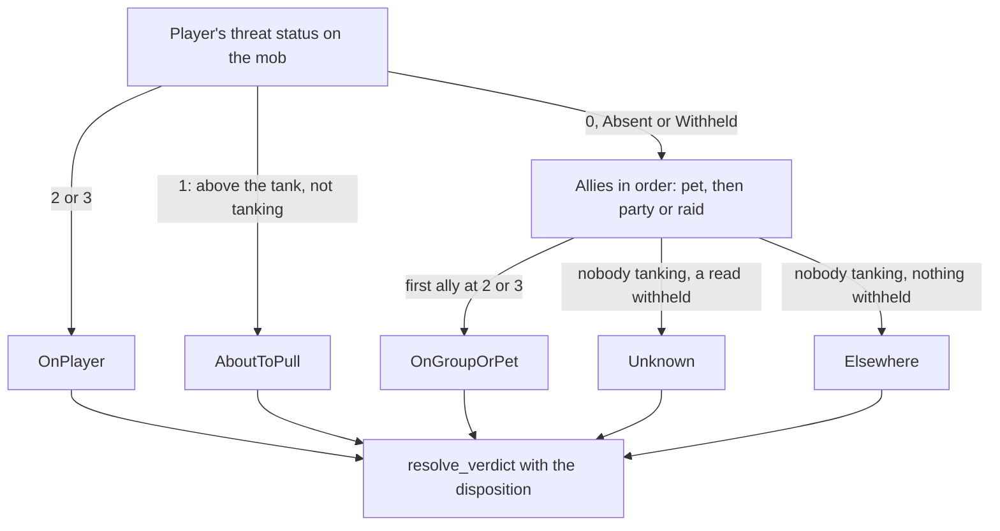
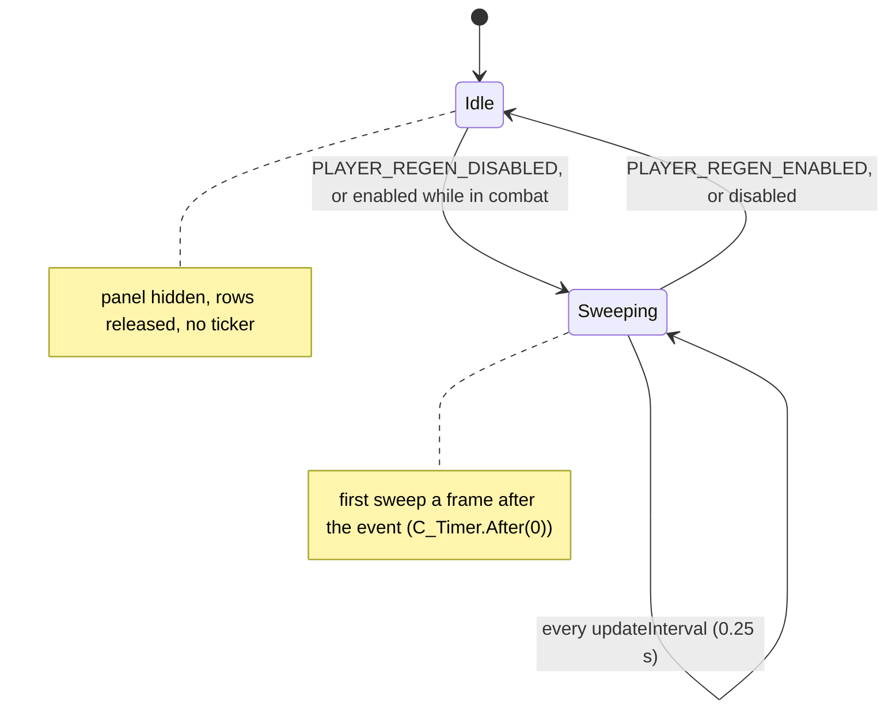

# PersonalAddon — Phase 11 Design: the threat panel and the about-to-pull colour (R7)
**Date:** October 5, 2026
**API Version:** 1.60.1 (WoW Forever Beta), game type `camelot`, build 1.60.1.70235. UI exported 2026-10-05 20:02; its source is byte-identical to 70205's. The patch check reports UpToDate.
**Implements:** the user's threat panel, built on GAPBugs01 §4.1's pinned note, and GAPBugs01 R7, as decided on 2026-10-03 and 2026-10-05 (§1.1)
**Depends on:**
- GAPBugs01 §3.6 (threat-based aggro), §4.1 (threat data for every mob), R7;
- Phase 2 §4.8 (threat is the better mechanism);
- Phase 4 (the damage breakdown);
- Phase 7 §5.3–§5.4 (dispositions and colour priority);
- Phase 8 §5 (`PanelChrome`, `FramePool`);
- Phase 9 §2 (`ClientRead`), §3 (`Diagnostics`), §4 (threat nameplates);
- Phase 10 §4 (the premise register), §7.1 (the shape of a core extraction);
- README "Rules for future development".

**Revision:** 3. Audit dispositions in §14; what the build corrected in §15; revision history at the end.
**Status, 2026-10-05:**
- **Built, not committed.** The build corrected the design in nine places (§15).
- **Offline verification passed** (§12 criteria 1–3):
  - the harness: 387 checks in fifteen sessions. The 311 from Phases 7–10 pass unchanged; `phase9-noapi` also gains one check, N16 (§15 item 8);
  - the 75 Phase 11 checks, P1–P18. Ten deliberate breakages of the new code, one at a time, were each caught by at least one check;
  - the lint: 0 hits, the same 5 allowlisted, none stale;
  - the patch check's tests: T1–T18, 23 tests, all pass. A `check` of the 70235 export against itself passes with all 22 premises holding, and the derived surface picks up every name the panel uses.
- **In-game verification (§10.3) pending.**

---

## 1. Scope

### 1.1 Decisions

| Question | Answer |
|---|---|
| What the panel shows per mob | Its name, a health bar, and your threat on it as a percentage (2026-10-03) |
| Threat % | Your scaled threat from `UnitDetailedThreatSituation`. 100% means the mob is on you (2026-10-03) |
| Which mobs | Hostile mobs in combat with you or your group: on your threat list or a group member's, pet included (2026-10-05) |
| Where it sits | The damage breakdown's place above the player frame. The breakdown hides during combat, when it only shows the last fight; the panel takes its place and hides when combat ends. Both move by offsets in Settings (2026-10-05) |
| Bar colour | The nameplate colours: one palette, the same verdict as the mob's plate (2026-10-05) |
| Row extras | A target marker, and a level and elite tag. No health % text (2026-10-05) |
| When it shows | In combat only, as the user's idea states |
| R7's colour | Orange, "you are about to pull it". Under red; above grey and green |

### 1.2 What ships

| Item | Kind | Section |
|---|---|---|
| `Core/Threat.lua`: the threat reads, aggro classification, dispositions, verdicts and palette, moved out of Nameplates | Substrate | §2 |
| R7: the AboutToPull aggro and verdict, and its colour on nameplates | R7 | §3 |
| `ClientRead.Pass` and `ClientRead.CallNth`: hidden values handed straight to widgets, and one return of a multi-value call read | Substrate | §4 |
| `Features/ThreatPanel.lua`: the panel | Feature | §5 |
| DamageBreakdown's `hideInCombat` | Feature change | §6 |
| The patch check's `FlagEquals` check kind, and seven premises | Tooling | §7 |
| README: the colour table, the feature, `/pa threat` | Housekeeping | §8 |
| Release: TOC `1.1.0`, `X-Phase: 11`, `ns.VERSION` | Housekeeping | §13 |

### 1.3 Not possible, or out of scope

| Wanted | Why not |
|---|---|
| Raid marker icons on rows | `GetRaidTargetIndex` is `SecretReturns`: always hidden. No widget method takes a hidden marker index |
| Mobs with no nameplate on screen | No unit token reaches them. The panel lists what enemy nameplates list; §5.7 says once if they are off |
| Clicking a row to target its mob | Targeting is protected in combat (README rule 7) |
| Health as a number or a percentage | `UnitHealth` and `UnitHealthPercent` are always hidden, and `UnitHealthMax` is hidden for any unit that is not player-controlled. A bar can show them (§4); text would need Blizzard's curve objects, which the user declined |
| A tank's view (who holds aggro, by how much) | The addon's colours and this panel take a damage dealer's view (§1.1) |

### 1.4 Types

Used as earlier documents define them:

| Types | Defined in |
|---|---|
| `FeatureId`, `SubscriptionToken` | Phase 1 §6–§7 |
| `Colour` | Phase 7 §5.3 |
| `ClientRead<T>`, `ThreatStatus` | GAPBugs01 §3.6; Phase 9 §2.2 |
| `CounterName`, `ClientFunction`, `PlainValue`, `ClientValue`, `Nothing` | Phase 9 §1.4 |
| `QualifiedName`, `Premise`, `PremiseOutcome`, `ExportView` | Phase 10 §1.4, §4.1 |

Defined here:

```
type UnitToken = string
type NameplateToken = UnitToken
type ScaledThreatPercent = number
type Counters = Map<CounterName, integer>

type Aggro = OnPlayer | AboutToPull | OnGroupOrPet | Elsewhere | Unknown
type Engagement = Engaged | NotEngaged | CouldNotTell
type AggroReading = { aggro: Aggro, engagement: Engagement, withheldReads: integer }

type Disposition = TapDenied | Neutral | Hostile | Unreadable
type Verdict = OnPlayer | AboutToPull | TapDenied | OnGroupOrPet | Neutral | Elsewhere | Ceded
type Palette = Map<Verdict, Colour>

type AllyRoster = { tokens: List<UnitToken>, count: integer }

type ThreatReading = Readable(percent: ScaledThreatPercent) | NotOnYourList | Hidden

type PassOutcome = Shown(hidden: boolean) | Absent | Unavailable(reason: string)

type Widget = opaque
type WidgetMethod = (Widget, ...PlainValue | ClientValue) -> Nothing
type NamePlateFrame = opaque

type MobRow = {
    token: NameplateToken,
    plate: NamePlateFrame,
    verdict: Verdict,
    threat: ThreatReading,
    firstSeenSweep: integer,
}

type ThreatPanelSettings = {
    maximumRows: integer,
    panelAlpha: number,
    anchorOffsetX: number,
    anchorOffsetY: number,
    showLevel: boolean,
    markTarget: boolean,
    showWhenEmpty: boolean,
    updateInterval: number,
}
```

`NamePlateFrame` values are compared by identity only. `Widget` is a frame or region of ours. `ThreatPanelSettings` holds the keys of §5.8, with their defaults there.

---

## 2. The shared threat reader (new, `Core/Threat.lua`)

### 2.1 Why it moves

The panel must colour a mob exactly as its plate is coloured (§1.1). Two copies of the classification would drift; the panel reading Nameplates' internals would tie it to a feature that can be off. So the reads and the decisions move to core, as Phase 10 moved the map-restriction read.

| What | From | Change |
|---|---|---|
| `allyTokens` | `Features/Nameplates.lua:224–238` | None |
| `readThreat` | `:242–253` | Counts into the caller's table, not Nameplates' state |
| `classifyAggro` | `:264–288` | R7's AboutToPull (§3); returns an `AggroReading` with `engagement` (§2.2) |
| `readStanding`, `checkDispositionCapability`, `classifyDisposition`, `standingOf` | `:290–355` | The once-per-UI-load capability cache moves with them |
| `resolveColourVerdict` | `:357–382` | AboutToPull ranks second (§2.3) |
| `hexToColour` and the palette in `readSettings` | `:132–157` | `palette_from(settings)`, a pure function. The colour keys and defaults are declared once, here |

Nameplates keeps everything that is about plates: scope, styling, the style ledger, the contest, the re-assert hooks, the sweep, `yieldSelectedTarget`, and its counters.

**No state is shared between the two features.** Each passes its own `Diagnostics` table, and each runs on its own timer. The one cache, the standing capability, is resolved once per UI load and only read after that.

### 2.2 Contracts

```
# The group's shape, read once per sweep: a raid, a party, or the player alone.
# pre:  none
# post: tokens begin with "pet", then party1-4 or raid1-N. When the roster
#       functions are absent or withheld, a party is assumed, which costs four
#       reads of possibly empty tokens and claims nothing
# raises: never
function allies() -> AllyRoster

# One unit's threat status on one mob, counted in the caller's table as
# threatReadsPlain, threatReadsAbsent or threatReadsWithheld.
# pre:  counters is the caller's Diagnostics table
# post: Plain(0..3), Absent (not on the mob's threat list), or Withheld
# raises: never
function read_status(
    unit: UnitToken,
    mob: NameplateToken,
    counters: Counters
) -> ClientRead<ThreatStatus>

# Who the mob is attacking, from threat, never from its target. Stops at the
# first unit found tanking.
# pre:  roster came from allies() this sweep
# post: aggro is OnPlayer when the player's status is 2 or 3; AboutToPull when it
#       is 1; OnGroupOrPet when an ally's is 2 or 3; Unknown when nobody was found
#       tanking and a read was withheld; Elsewhere otherwise.
#       engagement is Engaged when any read returned a status, NotEngaged when
#       every read was Absent, CouldNotTell when none returned a status and one
#       was withheld. withheldReads counts the withheld reads
# raises: never
function classify_aggro(
    mob: NameplateToken,
    roster: AllyRoster,
    counters: Counters
) -> AggroReading

# The mob's standing: tapped by someone outside the group, neutral, or hostile.
# pre:  none
# post: Unreadable when this client withholds standing reads, which is checked
#       once per UI load on the first call; otherwise TapDenied, Neutral or Hostile
# raises: never
function disposition(
    mob: NameplateToken,
    counters: Counters
) -> Disposition

# The one place a mob's colour is decided, for both features.
# pre:  none
# post: §2.3's priority. Unknown aggro on a mob that is not tapped is Ceded
# raises: never
function resolve_verdict(aggro: Aggro, disposition: Disposition) -> Verdict

# The colours both features paint with, from a settings table holding the colour
# keys of PALETTE_KEYS. Nameplates passes its own settings; the panel passes the
# nameplates feature's stored settings, which exist whether or not that feature
# is enabled.
# pre:  none
# post: a Colour for every Verdict but Ceded; a missing or malformed value takes
#       its declared default
# raises: never
function palette_from(settings: Map<string, PlainValue>) -> Palette
```

`PALETTE_KEYS` maps each verdict to its setting key and default: `colourOnPlayer` `ff4040`, `colourAboutToPull` `ff8000` (new), `colourTapDenied` `e6e6e6`, `colourOnGroup` `40ff40`, `colourNeutral` `ffff00`, `colourElsewhere` `ffffff`. Nameplates' settings declaration takes its defaults from it, so the two cannot disagree.

### 2.3 The verdict, with R7



| Priority | Verdict | Colour | Why here |
|---|---|---|---|
| 1 | OnPlayer | Red | Grey never hides a mob that is hitting you (Phase 7 §5.4) |
| 2 | AboutToPull | Orange | It is about your safety, like red. It must also outrank green: a mob you are about to pull is by definition on someone else, so under green it would never show in a group |
| 3 | TapDenied | Grey | Unchanged |
| 4 | OnGroupOrPet | Green | Unchanged |
| 5 | Ceded (Unknown aggro) | Blizzard's own, on plates; the Elsewhere colour in the panel | Unchanged on plates. The panel has no Blizzard bar to cede to (§5.4) |
| 6 | Neutral | Yellow | Unchanged |
| 7 | Elsewhere | White | Unchanged |

---

## 3. R7: the about-to-pull colour on nameplates

- **AboutToPull is a fifth aggro and verdict** (§2.2–§2.3). A player at status 1 now ends the read early as AboutToPull; before, the reads went on to the allies and usually found the tank, so the plate was green.
- **A new colour setting,** `colourAboutToPull`, default `ff8000`. Its label is "You are about to pull it", and its description "Your threat is above the tank's, and the mob is not on you yet". Like every colour, it can be changed in Settings.
- **No existing harness check sets the player's status to 1**, so every Phase 7–10 check keeps its expectation.
- **Threat status 1 is already readable on restricted maps.** It is the same `UnitThreatSituation` read that returned 38,454 plain values in the 2026-10-05 instance session, and the patch check's `THREAT-READABLE` premise guards it.

---

## 4. Hidden values: `ClientRead.Pass` and `ClientRead.CallNth`

### 4.1 Why

A mob's current and maximum health are always hidden, and its name may be. A status bar and a font string accept hidden values. Their docs carry `SecretArguments = "AllowedWhenTainted"` on `SetValue`, `SetMinMaxValues`, `SetText` and `SetFormattedText`, so the client can draw what our code may not read.

The rule 10 risk is our code touching such a value on the way: a comparison, a nil test, a format in Lua. The lint can only check that the read happens on a `ClientRead` line. So the hand-over itself lives in `ClientRead`, which the lint already treats as the one sanctioned place (Phase 9 §9.2).

### 4.2 Contracts

```
# Calls a client function and hands one of its returns, untouched, to a widget
# method: setter(receiver, value), or setter(receiver, leading, value) when
# leading is given. The value is never compared, tested or computed on; only its
# accessibility is asked, so that a readable nil can be told from a hidden value.
# For widget methods whose docs accept hidden arguments, which the patch check
# guards (section 7).
# pre:  setter is a method of receiver; index >= 1
# post: Shown(hidden = true) when a hidden value was handed over;
#       Shown(hidden = false) when a readable, non-nil value was;
#       Absent when the value is a readable nil, and the setter is not called;
#       Unavailable(reason) when the client function is missing (Unavailable)
#       or raised (CallFailed), or the setter raised (SetterFailed)
# raises: never
function pass(
    setter: WidgetMethod,
    receiver: Widget,
    leading: Optional<PlainValue>,
    index: integer,
    clientFunction: ClientFunction,
    arguments: List<PlainValue>
) -> PassOutcome

# Calls a client function and classifies only its index-th return, for calls
# whose returns differ in type (UnitDetailedThreatSituation: boolean, number,
# number, number, number).
# pre:  index >= 1
# post: as ClientRead.Call, applied to that return
# raises: never
function call_nth(
    clientFunction: ClientFunction,
    index: integer,
    expectedType: string,
    arguments: List<PlainValue>
) -> ClientRead<PlainValue>
```

Both pick the return without building a table: the returns are forwarded to a helper that takes `index` as its first argument.

### 4.3 Uses

| Value | Read | Widget method |
|---|---|---|
| The mob's name | `pass(SetText, nameText, nil, 1, UnitName, mob)` | Font string `SetText` |
| Its maximum health | `pass(SetMinMaxValues, bar, 0, 1, UnitHealthMax, mob)` | Status bar `SetMinMaxValues` |
| Its current health | `pass(SetValue, bar, nil, 1, UnitHealth, mob)` | Status bar `SetValue` |
| Your threat %, when hidden | `pass(SetFormattedText, threatText, "%.0f%%", 3, UnitDetailedThreatSituation, "player", mob)` | Font string `SetFormattedText` |
| Your threat %, readable | `call_nth(UnitDetailedThreatSituation, 3, "number", "player", mob)` | Formatted by us, and sorted on |

`valuesPassedHidden` counts hidden hand-overs, and `passFailures` counts failures, in the panel's diagnostics. A failure leaves that cell blank; it never raises.

---

## 5. The threat panel (new, `Features/ThreatPanel.lua`)

### 5.1 What it shows

```
 ┌───────────────────────────────────────────────┐
 │▌62+ [█████████ Defias Pillager ░░░░░░░]  100% │   ▌ target marker
 │ 61  [██████ Defias Looter ░░░░░░░░░░░░]   92% │   level and elite tag
 │ 60  [███ Kobold Miner ░░░░░░░░░░░░░░░░]   40% │   bar: health, in the verdict colour
 │ 60  [████████ Kobold Tunneler ░░░░░░░░]     — │   name over the bar; your threat %
 └───────────────────────────────────────────────┘
```

| Part | Size | Content |
|---|---|---|
| Panel | 200 wide; 6 px padding; rows 16 high, 2 apart | `PanelChrome`, as the breakdown and the skills window use |
| Target marker | 3 × 14 | Shown on the row of your target's plate (§5.4) |
| Level and elite tag | 30 wide | `62`, `62+` elite, `62r` rare, `62r+` rare elite, `??` for a skull or world boss |
| Health bar | The row's remaining width less the threat cell | Fill: the mob's health, passed hidden (§4.3). Colour: the verdict's |
| Name | Over the bar, left, truncated by the font string | Passed, possibly hidden |
| Threat % | 36 wide, right | Readable: `92%`. Not on your list: `—`. Hidden: passed through |

### 5.2 Which mobs

```
# The nameplates on screen now, each with its unit token, read from the client on
# every sweep. Nothing is tracked between sweeps.
# pre:  none
# post: one pair per plate C_NamePlate.GetNamePlates() returns whose unitToken
#       field reads as a plain string through ClientRead.Field; a plate without
#       one is skipped and counted in platesWithoutToken; empty when the API is
#       missing, which is noted once
# raises: never
function current_plates(counters: Counters) -> List<(NamePlateFrame, NameplateToken)>

# The mobs the panel lists this sweep, before ordering.
# pre:  plates came from current_plates() this sweep
# post: a row for each plate whose unit exists, can be attacked, is not dead, is
#       in combat, and whose aggro reading is Engaged or CouldNotTell; the row
#       keeps its plate frame. A filter read that is withheld leaves the mob out
#       and counts filterReadsWithheld: "could not tell" never lists a mob as
#       fighting you
# raises: never
function collect_rows(
    plates: List<(NamePlateFrame, NameplateToken)>,
    roster: AllyRoster,
    counters: Counters,
    sweep: integer
) -> List<MobRow>
```

- **"Fighting you or your group" is the `engagement` of §2.2.** A mob at least one of you is on the threat list of is Engaged. A mob fighting only a stranger is NotEngaged, and is left out.
- **CouldNotTell is listed.** The filter reads already say the mob is hostile and in combat; leaving it out because one threat read was withheld would hide exactly the mob nobody can read. Its row shows the Elsewhere colour and a passed-through threat value.
- **The plates are read from the client on every sweep,** with `C_NamePlate.GetNamePlates()` and each frame's `unitToken`. Nameplates' own enable step already reads plates this way (`Features/Nameplates.lua:963–976`).
  - Nothing is tracked between sweeps, so no token can go stale, and none is missing after enabling during a fight (§14, findings 3 and 5).
  - The panel subscribes to no nameplate event.
  - Premise 22 (§7.2) guards the frame field.

### 5.3 Order

```
# Rows in the order the panel draws them.
# pre:  previous maps each token to its position in the last sweep's order
# post: Readable threat first, highest first; then Hidden; then NotOnYourList.
#       Ties, and every row without a readable percentage, keep last sweep's
#       relative order; a new row goes after the old ones of its group
# raises: never
function order_rows(
    rows: List<MobRow>,
    previous: Map<NameplateToken, integer>
) -> List<MobRow>
```

A mob attacking you has a scaled threat of 100, so mobs on you sort first without a special case. Orange rows, high but under 100, come next.

### 5.4 Drawing a row

```
# Draws the top rows, at most maximumRows, top down, and sizes the panel.
# pre:  the row pool was filled at enable; the panel exists
# post: each drawn row shows the parts of section 5.1, and every one of its fields
#       is set this sweep: where pass returns Absent or Unavailable, the name is
#       blank, the bar's range is 0 to 1 at 0, and the threat cell is blank, so a
#       reused row never shows the last mob's values; rows past maximumRows are
#       counted in rowsTruncated, not drawn; the panel is shown when at least one
#       row is drawn or showWhenEmpty is set, and hidden otherwise
# raises: never
function render_rows(
    ordered: List<MobRow>,
    palette: Palette,
    targetPlate: Optional<NamePlateFrame>,
    settings: ThreatPanelSettings
) -> integer
```

- **Bar colour** is `palette[row.verdict]`; a Ceded verdict takes the Elsewhere colour. `SetStatusBarColor` takes plain numbers here.
- **The palette** is re-read from the nameplates feature's stored settings when its colour strings change. The panel compares the six strings each sweep and rebuilds only when one differs, so a colour changed in Settings shows on the next sweep.
- **The target marker** compares `C_NamePlate.GetNamePlateForUnit("target")` with `row.plate`, by frame identity. That lookup is never hidden, while `UnitIsUnit` goes hidden on restricted maps. The lookup is read once per sweep, through `ClientRead`; the row's plate costs nothing, since `current_plates` already returned it.
- **The level and elite tag** comes from `UnitLevel` and `UnitClassification`, which carry no secret flags. A withheld read omits the tag rather than guessing it.
- **All the per-row reads happen only for the drawn rows.** The filter and the order need only the threat reads.

### 5.5 When it runs



- **The panel's only events are `PLAYER_REGEN_DISABLED` and `PLAYER_REGEN_ENABLED`,** flagged `SynchronousEvent` (README rule 1). It subscribes through `Dispatch`, which already registers both for the breakdown, so the client's delivery into our code does not change.
- **The handlers only record state and schedule.** Every client read happens a frame later, on our own timer.
- **Enabling in combat starts at once,** as the breakdown does after a `/reload` in combat. The first sweep lists every mob already on screen, because the plates are read from the client (§5.2).
- **Every frame is made at enable,** out of combat: the panel and a pool of 16 rows, prewarmed. Nothing is created during a fight.

### 5.6 The swap with the damage breakdown

- **The panel anchors exactly as the breakdown does:** its bottom-left to the player frame's top-left, offsets 0 and 8. It falls back to the screen when the player frame is missing.
- **The breakdown gains `hideInCombat`** (§6), which is on by default. During a fight the breakdown hides and the panel shows; when the fight ends, the panel hides and the breakdown draws that fight.
- **The two features know nothing of each other.** The swap is two defaults, the same position and the breakdown's new setting. Moving either, or turning `hideInCombat` off, is the user's choice to overlap them.

### 5.7 When enemy nameplates are off

At the first sweep of each fight, the panel reads the `nameplateShowEnemies` CVar through `ClientRead`. When it is `"0"`, the panel prints one line per UI load: enemy nameplates are off, so the threat panel can list nothing. It also counts `enemyPlatesOff`. It never changes the CVar: the setting is the user's.

### 5.8 Settings

| Key | Default | Kind | In Settings |
|---|---|---|---|
| `maximumRows` | 6 | Number, 1–10 | Yes |
| `panelAlpha` | 0.8 | Number, 0.1–1.0 | Yes |
| `anchorOffsetX` | 0 | Number, −300–300 | Yes |
| `anchorOffsetY` | 8 | Number, −300–300 | Yes |
| `showLevel` | true | Toggle: "Show level and elite tag" | Yes |
| `markTarget` | true | Toggle: "Mark your target" | Yes |
| `showWhenEmpty` | false | Toggle | No (`/pa set`) |
| `updateInterval` | 0.25 | Number, 0.1–1.0 seconds | No (`/pa set`) |

The feature registers as `threatPanel`, label "Threat panel", on by default. The colours are the nameplates' settings (§2.2); Settings says so in the panel's description.

### 5.9 Diagnostics and `/pa threat`

**Counters,** in `PersonalAddonDiagnostics` under `threatPanel`:
- `sweeps`, `rowsShownMax`, `rowsTruncated`;
- the shared reader's `threatReadsPlain`, `threatReadsAbsent`, `threatReadsWithheld` and `standingReadsWithheld`;
- `percentReadsPlain`, `percentReadsAbsent`, `percentReadsWithheld`;
- `filterReadsWithheld`, `platesWithoutToken`, `valuesPassedHidden`, `passFailures`, `targetMarked`, `enemyPlatesOff`.

**`/pa threat`** prints:
- the state: enabled, in combat, rows drawn of the maximum, rows truncated, and the timer;
- one line per drawn row: its token, verdict, threat %, and whether it is your target;
- the counters.

---

## 6. DamageBreakdown: `hideInCombat`

```
# Hides the breakdown for the length of a fight, when it can only show the last
# one; the fight's own figures are drawn when it ends.
# pre:  the feature is enabled
# post: with hideInCombat set, the panel is hidden on PLAYER_REGEN_DISABLED and
#       drawn again by the existing end-of-combat refresh and settle reads; with
#       it unset, behaviour is Phase 9's. Enabling during combat hides it at once
#       when the setting is on
# raises: never
function on_combat_start(settings: BreakdownSettings) -> Nothing
```

- **The setting:** `hideInCombat`, default true. Its label is "Hide during combat", and its description "During a fight the panel still shows the last fight's figures; hiding it leaves room for the threat panel".
- **No migration step.** `ConfigStore` gives a new key its default (Phase 9 §1.3).

---

## 7. The patch check

### 7.1 `FlagEquals`, a new check kind

Phase 10's kinds can say a flag is absent, but not that it has a given value. The panel relies on four widget methods keeping `SecretArguments = "AllowedWhenTainted"`.

```
# Holds when every documented entry of that name carries the flag with exactly
# that literal value, as the docs write it (a string keeps its quotes).
# pre:  the register validated the entry, flag and value fields
# post: Holds; Broken naming the value found, or "no longer documented"
# raises: never
function evaluate_flag_equals(
    entry: QualifiedName,
    flag: string,
    value: string,
    current: ExportView
) -> PremiseOutcome
```

### 7.2 New premises

| # | Id | Statement | Check | If it stops holding |
|---|---|---|---|---|
| 16 | `BAR-VALUE-TAKES-HIDDEN` | A status bar's value accepts a hidden number | `FlagEquals`: `SimpleStatusBarAPI:SetValue`, `SecretArguments`, `"AllowedWhenTainted"` | Health bars stay empty; `passFailures` counts it |
| 17 | `BAR-RANGE-TAKES-HIDDEN` | A status bar's range accepts a hidden number | `FlagEquals`: `SimpleStatusBarAPI:SetMinMaxValues`, same | As 16 |
| 18 | `TEXT-TAKES-HIDDEN` | A font string accepts hidden text | `FlagEquals`: `SimpleFontStringAPI:SetText`, same | Names go blank |
| 19 | `FORMATTED-TEXT-TAKES-HIDDEN` | A font string formats a hidden number | `FlagEquals`: `SimpleFontStringAPI:SetFormattedText`, same | A hidden threat % goes blank |
| 20 | `THREAT-PERCENT-READABLE` | Your threat % on a nameplate is not hidden by default | `FlagAbsent`: `UnitDetailedThreatSituation`, `SecretReturns` | The panel can no longer sort; re-read §5.3 |
| 21 | `PLATE-LOOKUP-READABLE` | The target's nameplate can be looked up | `FlagAbsent`: `C_NamePlate.GetNamePlateForUnit`, `SecretReturns` | The target marker cannot be drawn |
| 22 | `PLATE-UNIT-TOKEN` | A nameplate frame carries its unit token in `unitToken` | `Pattern` present: `self\.unitToken\s*=` in `Blizzard_NamePlates/Blizzard_NamePlateBase.lua` | The panel lists nothing; Nameplates' adoption of plates at enable (`Features/Nameplates.lua:963–976`) finds none |

Every name the panel reads (`UnitHealth`, `UnitName`, `UnitLevel`, and so on) also joins the derived surface on its own, from the code (Phase 10 §5).

---

## 8. README

- **Features, nameplate colours:** the table gains an Orange row after Red, "You are about to pull it: your threat is above the tank's", and the priority text follows §2.3.
- **Features, Combat:** a new entry. *Threat panel.* In combat, the mobs fighting you or your group are listed in the damage breakdown's place:
  - their health as a bar in the nameplate colours;
  - your threat on each, highest first;
  - your target marked, with level and elite tags.

  It needs enemy nameplates on.
- **Features, damage breakdown:** it hides during combat by default, and its place goes to the threat panel.
- **Commands:** `/pa threat`, beside `/pa plates`.
- **Tried and not possible:** "Raid markers on the threat panel: the client always hides them."

---

## 9. Rule compliance

| Rule | How Phase 11 meets it |
|---|---|
| 1 | No hooks. The two combat events come through `Dispatch`, which already receives them (§5.5); the handlers record state only. No nameplate event: the plates are read on our timer (§5.2). No Blizzard callbacks; settings by value-changed callback, as every feature |
| 2 | Writes only our frames, our settings and `PersonalAddonDiagnostics` |
| 3 | The panel is never shown through the panel system; `Show` and `Hide` on our own frame only |
| 4 | No new hooks |
| 5 | The first sweep runs a frame after the event, in our timer |
| 6 | The panel is parented to `UIParent` and anchored to the player frame, as the breakdown is; it takes no mouse input, so it never catches a click and gives the Gamepad UI nothing to navigate |
| 7 | No protected call: rows do not target |
| 9 | Every call is a read; none changes state another listener watches |
| 10 | Every client value goes through `ClientRead`: classified (`Call`, `CallNth`) or handed over untouched (`Pass`) |
| 11 | Seven premises added (§7.2), in the same change |

**The G1 hazard** (GAPBugs01 §2) comes from code that opens or closes Blizzard panels, or moves the pad cursor, in its own execution. The panel does neither. It is the breakdown's kind of frame, and the breakdown has never been blamed for a refusal.

---

## 10. Verification

### 10.1 Harness: `tests11.lua`

New stubs, `stubs11.lua`, all derived from the existing unit model:
- `UnitDetailedThreatSituation`: the scaled % from the mob's `threatPercent[unit]`; nothing when the unit is not on the list; the hidden sentinel in session `phase11-hidden`.
- `UnitHealth` and `UnitHealthMax`: always the sentinel, as the client returns them for mobs.
- `UnitName`: the sentinel for mobs in `phase11-hidden`.
- `UnitLevel`, `UnitClassification` and `UnitIsDead`, from the model.
- `C_NamePlate.GetNamePlateForUnit("target")`.
- `C_CVar.GetCVar("nameplateShowEnemies")`.
- A status bar and a font string that record a hidden value handed to them, and raise if one is compared.

| # | Session | Given | Expect |
|---|---|---|---|
| P1 | `phase11` | The player at status 1 on a mob tanked by party1 | Its plate and its row are orange; aggro AboutToPull |
| P2 | `phase11` | Status 1 on a tapped mob; status 2 on another tapped mob | Orange, then red: both outrank grey |
| P3 | `phase11` | A mob only a stranger fights; a dead one; a friendly one; one out of combat; one on party2's list | Only the last is listed |
| P4 | `phase11` | Readable threat 100, 92 and 40, and one not on your list | Order 100, 92, 40, then `—` |
| P5 | `phase11` | Eight listed mobs, `maximumRows` 6 | Six drawn; `rowsTruncated` 2 |
| P6 | `phase11` | Health and maximum health hidden | Both handed to the bar; `valuesPassedHidden` counts them; no error |
| P7 | `phase11-hidden` | Threat % and names hidden | Rows drawn with the values passed through, after any readable rows, in a stable order; `percentReadsWithheld` counted |
| P8 | `phase11` | Your target is the second mob | That row alone is marked; the panel calls `UnitIsUnit` never |
| P9 | `phase11` | Levels 62 elite, 61 rare elite, −1 world boss | `62+`, `61r+`, `??` |
| P10 | `phase11` | Out of combat; combat starts; combat ends; enabled during combat with three mobs already on screen | Hidden; shown after one frame; hidden with rows released; shown at once, listing all three |
| P11 | `phase11` | Combat starts and ends with the breakdown on | The breakdown hides, then draws the fight; with `hideInCombat` off it stays |
| P12 | `phase11-noplates` | `nameplateShowEnemies` is `"0"` | One line per UI load; `enemyPlatesOff` counted; the CVar untouched |
| P13 | `phase11` | `colourOnGroup` changed with nameplates disabled | The panel's next sweep paints the new green |
| P14 | `phase11` | A fight | No `CreateFrame` call while in combat |
| P15 | All | Phases 7–10 | Every session passes unchanged; no existing check sets the player's status to 1 |
| P16 | Lint | The new code | 0 hits, the same 5 allowlist entries: every hidden read is on a `ClientRead` line |
| P17 | `phase11` | A row drawn for a named mob, then reused for a mob whose name, health and threat read Absent | Its name is blank, its bar at 0, its threat cell blank: nothing of the first mob shows |
| P18 | `phase11` | A plate whose frame has no `unitToken` | Skipped; `platesWithoutToken` counts it; no error |

### 10.2 The patch check

| # | Given | Expect |
|---|---|---|
| T16 | Fixture: a `FlagEquals` premise whose value matches | Holds |
| T17 | Fixture: the same premise after the flag's value changes, and after the entry is removed | Broken, naming the value found; then "no longer documented" |
| T18 | The real 70235 export with premises 16–22 | `check` passes; all 22 premises hold |

### 10.3 In game

In a group fight, ideally a dungeon:
1. The panel appears where the breakdown was when the fight starts, and the breakdown hides.
2. Rows are sorted by your threat %, mobs on you first. Your target is marked, and levels and elite tags show.
3. Each row's bar matches its plate's colour. Push threat on a mob the tank holds: plate and row turn orange before red.
4. The fight ends: the panel hides, and the breakdown draws the fight.
5. `/pa diag`: `threatPanel.passFailures` is 0 and there is no fault note. `/pa threat` during a fight lists the rows.

---

## 11. Failure modes

| Failure | Detected by | Behaviour |
|---|---|---|
| Threat % hidden after all | `call_nth` | Passed through for display; those rows sort after readable ones, in a stable order; counted |
| A widget stops taking hidden values | Patch check premises 16–19; `pass` at run time | The check fails on the next patch; at run time that cell stays blank and `passFailures` counts it |
| A threat status read withheld | `classify_aggro` | Unknown, which the panel lists as CouldNotTell, in the Elsewhere colour |
| A filter read withheld | `collect_rows` | The mob is left out; `filterReadsWithheld` counts it |
| Enemy nameplates off | §5.7 | One line per UI load; the panel stays empty |
| More mobs than rows | `render_rows` | `rowsTruncated` counts them |
| The player frame missing | The anchor fallback | The panel anchors to the screen, as the breakdown does |
| The nameplates feature's colours malformed | `palette_from` | Defaults for those colours |
| A sweep raises | `Isolation.Call` around each sweep | That sweep is dropped and noted once, in `Diagnostics` and chat; the next runs |
| The row pool exhausted | `FramePool`'s surface-and-fail policy | Surfaced; never grows during a fight |
| `C_NamePlate.GetNamePlates` missing | `current_plates` | The panel lists nothing; one line per UI load |
| A plate frame without a readable `unitToken` | `current_plates`; premise 22 at the next patch | That plate is skipped and counted |
| A pass returns Absent or Unavailable on a reused row | `render_rows` | That field is cleared, never left showing the last mob's value |
| `UnitThreatSituation` missing | The panel's enable | The panel declines at enable and is marked faulted, naming the missing function, as the breakdown does without its meter. Nameplates keeps its own notice (§15 item 8) |

---

## 12. Exit criteria

**Offline:**
1. Every harness session passes: Phases 7–10 unchanged, and the new Phase 11 sessions.
2. The lint passes with the same 5 allowlist entries.
3. The patch-check suite passes, T16–T18 included, and `check` passes on the 70235 export with all 22 premises.

**In game (§10.3):**

4. The panel takes the breakdown's place in combat and gives it back after.
5. Rows sort by your threat %; your target is marked; level and elite tags show.
6. Bars match their plates' colours, and orange appears before a pull.
7. `threatPanel.passFailures = 0` and no fault note after a dungeon.

**Documents:**

8. The README matches §8.

---

## 13. Files

| File | Change |
|---|---|
| `Core/Threat.lua` | New (§2) |
| `Core/ClientRead.lua` | `Pass` and `CallNth` (§4) |
| `Features/Nameplates.lua` | Threat code moved to `Core/Threat.lua`; R7's colour and setting (§3) |
| `Features/ThreatPanel.lua` | New (§5) |
| `Features/DamageBreakdown.lua` | `hideInCombat` (§6) |
| `Core/Debug.lua` | `/pa threat`; help line; `/pa plates` counts `aboutToPull` |
| `Core/Constants.lua` | `ns.VERSION = "1.1.0-phase11"`; `ABOUT_TO_PULL_STATUS = 1`; `THREAT_ROW_CAPACITY = 16` |
| `PersonalAddon.toc` | `## Version: 1.1.0`, `## X-Phase: 11`; `Core\Threat.lua` after `Core\MapRestriction.lua`; `Features\ThreatPanel.lua` after `Features\DamageBreakdown.lua` |
| `README.md` | §8 |
| `Tools/patchcheck/premises.py`, `premises.toml`, tests | `FlagEquals`; premises 16–22; T16–T18 (§7). The fixture register gains one `FlagEquals` premise |
| `Tools/harness/stubs11.lua`, `tests11.lua`, `run.py` | §10.1. `threatPanel` joins the names whose faults the harness reports |
| `Tools/harness/tests9.lua` | `phase9-noapi` expects the panel to decline; check N16 (§15 item 8) |
| `Tools/README.md` | Phase 7–11 checks; `FlagEquals` among the check kinds |

**Build order:**
1. `Core/Threat.lua`, with Nameplates switched to it. Every Phase 7–10 check passes unchanged.
2. R7 in the reader and on the plates; P1, P2.
3. `ClientRead.Pass` and `CallNth`.
4. The panel; P3–P14.
5. `hideInCombat`; P11.
6. `FlagEquals` and the premises; T16–T18; `check` on 70235.
7. README, TOC, version.
8. In game.

---

## 14. Audit disposition

The audit is `20261005-Phase11Audit.md`, of 2026-10-05.

| # | Finding | Disposition | Change |
|---|---|---|---|
| 1 | `render_rows` takes a `ThreatPanelSettings` that is defined nowhere | Accepted | §1.4 defines it, with §5.8's keys |
| 2 | The target marker compares plate frames, but `MobRow` holds only a token | Accepted, with the audit's first fix | `MobRow.plate`, filled by `current_plates` at no extra cost (§5.2, §5.4) |
| 3 | Out of combat no sweep drops stale tokens, so the set would grow and stall the first sweep of a fight | Accepted, with a different fix | The growth claim does not hold: the set was keyed by token string, so it could hold at most one entry per nameplate token, and every sweep tested each unit's existence. But the panel no longer keeps a set: it reads the plates from the client on every sweep (§5.2), so nothing can go stale between fights |
| 4 | A reused row keeps the last mob's name or health when `pass` returns Absent and skips the setter | Accepted | `render_rows` sets every field each sweep, and clears it on Absent or Unavailable (§5.4). Test P17 |
| 5 | Enabled during a fight, the panel waits for nameplate events that already fired | Accepted | The same change as finding 3: the first sweep reads every plate on screen (§5.2, §5.5). Test P10 |

**Found while checking findings 3 and 5:** reading the plates each sweep depends on the frame field `unitToken`. Blizzard sets it in `NamePlateBaseMixin:SetUnit` (`Blizzard_NamePlateBase.lua:30`), and Nameplates already depends on it at enable. Premise 22 now guards it.

---

## 15. What the build corrected

| # | Revision 2 said | The build found | Change |
|---|---|---|---|
| 1 | A malformed colour takes its declared default (§2.2) | Nameplates' old fallbacks were typed approximations of the defaults (`0.25` for `40`, `0.9` for `e6`) | The fallback is the default's own hex value, so a malformed colour and the default look the same. The two differ by under 0.002, inside Nameplates' colour tolerance |
| 2 | No Phase 7–10 check changes (§3) | `/pa plates` must count AboutToPull, and a Phase 7 check reads that line's text | `aboutToPull=` goes at the end of the verdict line, so the line's earlier text is unchanged |
| 3 | `collect_rows` returns rows with a verdict (§1.4, §5.2) | §5.4 limits per-row reads to the drawn rows, and the standing reads behind a verdict are per-row reads | The disposition and the verdict are resolved in `render_rows`, for drawn rows only. `MobRow.verdict` is filled when the row is drawn |
| 4 | Sweeping goes Idle on `PLAYER_REGEN_ENABLED` (§5.5) | The handlers only record state and schedule | Going idle also runs a frame later. A sweep that fires in between sees that combat is over and does nothing. P10 checks that the panel is still drawn until that frame |
| 5 | `rowsShownMax` and `rowsTruncated` are counters (§5.9) | A running total would grow four times a second | Both keep the most seen in any one sweep. `/pa threat` also shows the last sweep's truncation |
| 6 | A sweep that raises is noted once (§11) | Fault notes are shared by every feature and capped at eight per UI load | The panel keeps the first fault message only, and counts every fault in `sweepFaults`, a counter §5.9 did not list |
| 7 | The lint keeps its 5 allowlist entries (P16) | `IsShown` is a secret-capable widget method, and the breakdown's own use of it is an allowlist entry | The panel keeps its own shown flag; nothing but the panel shows or hides it |
| 8 | No behaviour for a client without `UnitThreatSituation` | Without threat reads, every mob in combat would come out CouldNotTell and be listed | The panel declines at enable (§11). Session `phase9-noapi` removes that function, so it now expects the panel's fault and checks it (N16). The message is worded so that N14's "surfaced once" count still holds |
| 9 | Premises 16–19 rest on `SecretArguments = "AllowedWhenTainted"` | The same four setters also carry `SecretArgumentsAddAspect` (`BarValue`, `Text`): a hidden value marks that part of the widget hidden, so reading it back from the widget returns a hidden value | Nothing changes: the panel never reads its widgets back. A future feature that reads back a widget it handed a hidden value must read it through `ClientRead` |

Also beyond revision 2, though not a correction: §6's `hideInCombat`, when changed during a fight, shows or hides the panel's last render as it stands. A re-read is withheld in combat, so the panel is not redrawn.

**The real baseline store was not re-checked.** A `check` against it would overwrite the report of 70235's first check, `reports/2026-10-05-1.60.1.70235.md`, which is not yet committed. The check instead ran on a scratch copy of the same export, which `adopt` took into a temporary store: Pass, with all 22 premises holding. The UI source is identical, so the real store gives the same result. `status` reports UpToDate.

---

## Assumptions

- **Your scaled threat % against a nameplate is readable in practice.** The docs say "generally not secret" for that pairing. The status read with the same predicate family returned 38,454 plain values in a dungeon. The detailed values themselves have not been observed yet, and §11 says how the panel behaves if they are hidden.
- **The `nameplateShowEnemies` CVar's value `"0"` means enemy nameplates are off.** Blizzard's own code reads it in 29 places.
- **Six rows by default, refreshed every 0.25 s.** The cost is a few hundred client calls per sweep with 40 plates, comparable to the nameplate sweep.
- **The tag format** follows Blizzard's own conventions: `+` for elite, `r` for rare, `??` for a skull.
- **The panel's label is "Threat panel".**
- **The user's class is a damage dealer, as the threat % choice implies.** A tank sees red on everything, which is correct for them.

## Open questions

None blocking.

---

## Revision history

| Revision | Change |
|---|---|
| 1 | From the user's threat panel idea and GAPBugs01 R7, with the decisions of 2026-10-03 and 2026-10-05 (§1.1). Shared threat reader; R7 orange; hidden values passed straight to widgets; the panel; the breakdown's `hideInCombat`; `FlagEquals` and six premises |
| 2 | Audit dispositions (§14), all five accepted, two with a different fix. The plates are read from the client on every sweep, instead of tracked through nameplate events. `MobRow.plate`; `ThreatPanelSettings` defined; every row field set each sweep. Premise 22 guards the frame's `unitToken`. Tests P17, P18 |
| 3 | Built. The build corrected the design in nine places (§15). §11 gains a row for a client without `UnitThreatSituation`. Offline: 387 harness checks in fifteen sessions, the lint unchanged, 23 patch-check tests, and the 70235 export passing with all 22 premises |
