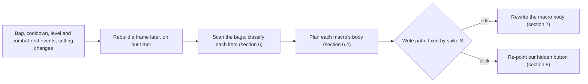
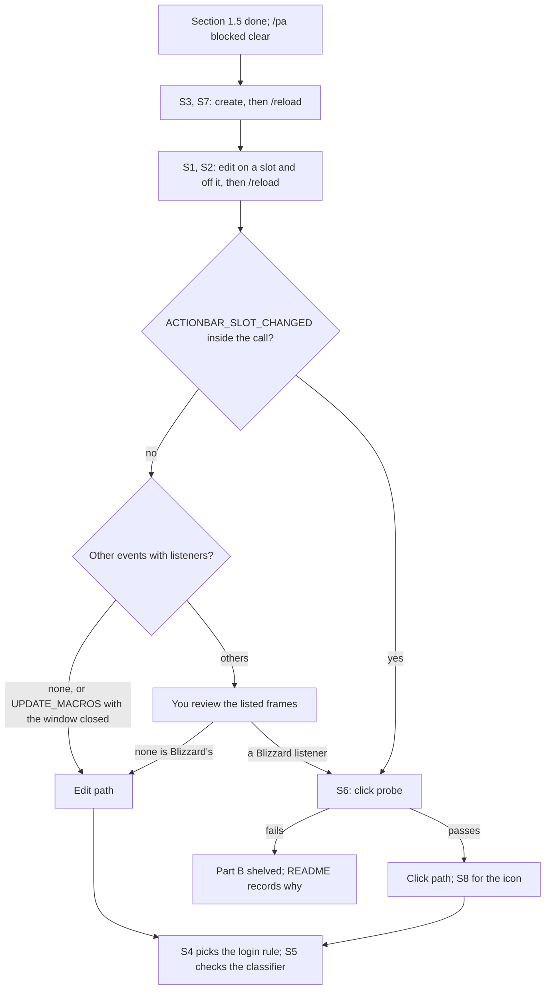

# PersonalAddon — Phase 12 Design: settings pages, and consumable macros
**Date:** October 6, 2026
**API Version:** 1.60.1 (WoW Forever Beta), game type `camelot`, build 1.60.1.70291.
- The UI was exported 2026-10-08 20:20, checked at 20:22 (Review) and accepted after review at 20:49 (§1.5).
- Every Blizzard line cited here was re-read on the 70291 export. The ones that moved since revision 2's 70235 citations are listed in §19 item 14.
**Implements:** the user's two requests of 2026-10-06, with the decisions of two question rounds the same day (§1.1):
- Part A: a settings menu that is better organised and more thorough;
- Part B: macros for food, water and healing that always use the best item you carry.

**Depends on:**
- Phase 6 §5 and §9 (the schema, the panel);
- Patch 01 Implementation §5 (Blizzard-stored settings, and the panel's one rule);
- Phase 8 §4.2 (`PanelChrome`), §4.5 and §8 (`CallWindow`, the spike method);
- Phase 9 §2 (`ClientRead`), §3 (`Diagnostics`);
- Phase 10 §4 (the premise register);
- Phase 11 §5.6 and §5.8 (where the two combat panels sit);
- GAPBugs01 §2.2 and §2.9 (who writes the Gamepad UI's state; `PageUnit.activeBar`);
- README "Rules for future development".

**Revision:** 3. Audit dispositions in §18; what the build corrected in §19; Part A's in-game results in §14.4; revision history at the end.
**Status, 2026-10-08:**
- **Part A is shipped,** committed as "Phase 12: settings menu".
- **Offline verification, on the 70291 export:**
  - the harness: 439 checks in seventeen sessions; the lint 0 hits, with the same 5 allowlisted and none stale;
  - the patch check's tests: 23 pass. T2 is skipped: its reference export is gone (§19 item 13);
  - all 29 premises in the register hold.
- **The in-game verification (§14.3 Part A) ran on 2026-10-08.** The settings pages behaved as designed.
  - Closing Options with the pad produced G1's known cascade, once under DrinkBot's name and once under ours.
  - The flat page produced the same cascade on 2026-09-26 and 09-27 (Patch 01 §0.5), so it is not a Part A regression.
  - §14.3's pass criteria are corrected to G1's baseline (§3.9, §14.4).
- **Part B is on hold** (§1.1, 2026-10-07).
  - The user uses DrinkBot and AutoPotion for consumables.
  - Spike S is replaced by passive evidence from those two addons (§9.5).
  - The audit's Part B findings are applied anyway, so the design stays whole if it is taken up again.

---

## 1. Scope

### 1.1 Decisions

| Question | Answer (2026-10-06) |
|---|---|
| How the settings are organised | Pages by area under PersonalAddon: Combat, Nameplates, Bags & loot, Consumables. Each page's Defaults resets only that page |
| What "more thorough" covers | Sub-options indented under their feature's switch; slider values shown; scale and position for the damage breakdown and the threat panel |
| Moving the two panels | Wider offset sliders, still anchored to the player frame: ±1200 across, ±800 up and down |
| Their position and scale | Separate for each panel |
| One press of the healing macro | A healthstone, then a healing potion on the next press; the sequence restarts when combat ends. Whichever was ready when the macro was last written goes first |
| Where the macros live | Per character. The water macro only on characters that use mana |
| Conjured food and water | Used first, even when weaker than what you carry |
| Food that gives Well Fed | Never picked |
| A "Rest" macro, food and water in one press | Not wanted |
| If spike S shows a macro rewrite taints the pad's action bar | Fixed-icon macros that `/click` hidden buttons of ours (§8) |
| Consumables from now on (2026-10-07) | DrinkBot and AutoPotion, installed 2026-10-07. Part B goes on hold, and the two addons stand in for spike S where they can (§9.5) |
| Part A before the re-export (2026-10-07) | Build it now; §1.5's re-export and check follow before it is committed |

Offered and not chosen, so out of scope: putting the `/pa set`-only settings in Settings, and new tooltips on every control (§1.3).

### 1.2 What ships

| Item | Part | Kind | Section | Status, 2026-10-07 |
|---|---|---|---|---|
| Schema: `unit`, `order`, `group`, `groupDescription` | A | Substrate | §2 | Built |
| Schema: text bounds, `distinctFrom` | B | Substrate | §2 | On hold, with Part B |
| Settings pages, section headers, declared order, indented options | A | Feature change | §3 | Built |
| Slider values; percent sliders; README rule 1 reworded | A | Feature change | §3.5, §3.6 | Built |
| `/pa panel` no longer opens Options | A | Defect fix | §3.8 | Built |
| Scale and wider offsets for the breakdown and the threat panel; `PanelChrome.Place` | A | Feature change, substrate | §4 | Built |
| Spike S, and its probe, deleted after | B | Investigation | §9 | Replaced by §9.5 |
| `Features/ConsumableMacros.lua`: what counts, ranking, bodies | B | Feature | §6 | On hold |
| The write path the spike picks: edit (§7) or click (§8) | B | Feature | §7, §8 | On hold |
| `/pa consumables` and its counters | B | Command | §10 | On hold |
| Premises 23–29 (Part A) and 30–37 (Part B) | A, B | Tooling | §11 | Part A's built |
| README; TOC `1.2.0`, `X-Phase: 12`; `ns.VERSION` | A, B | Housekeeping | §12, §17 | Part A's done |

### 1.3 Not possible, or out of scope

| Wanted | Why not |
|---|---|
| Dropdowns, buttons ("test toasts", "create the macros now"), text fields (macro names), live status lines in Settings | Each needs a function of ours that Blizzard calls, or a frame of ours on its page (rules 1 and 6) |
| Greying out a feature's options while its switch is off | It needs a modify predicate, a function Blizzard calls on every draw (`Blizzard_SettingControls.lua:148–157`) |
| Drag-to-move for the panels | Declined (§1.1). It would also need mouse input on our frames, and put our scripts under the pad cursor (GAPBugs01 §2.9) |
| Changing a macro during combat | The client blocks macro edits in combat lockdown |
| Putting the macros on your bar for you | `PlaceAction` from our code would raise slot changes in our execution (§7.1). The Gamepad action bar editor places macros (`ActionBarEditFrame.lua:436–438`) |
| Food-and-drink items in either macro | No reference name for them was checked; they are left out, not guessed |
| Mana potions, bandages, a Rest macro | Not asked for, or declined |
| The `/pa set`-only keys in Settings: `showWhenEmpty`, toast quality and count, the intervals | Not chosen (§1.1) |
| New tooltips on every control | Not chosen. New keys still carry a description where they need one |

### 1.4 Types

Used as earlier documents define them:

| Types | Defined in |
|---|---|
| `FeatureId`, `ConfigKey`, `ConfigValue` | Phase 1 §5–§6 |
| `ConfigSchema`, `ConfigKind`, `SchemaViolation` | Phase 6 §5 |
| `PanelBinding`, `PanelValue`, `StoreForm`, `ControlSkipped`, `PanelUnavailable` | Patch 01 Implementation §5.2–§5.3; Phase 6 §9 |
| `ClientRead<T>`, `Counters` | Phase 9 §2.2; Phase 11 §1.4 |
| `InlineEvents`, `ListenerReport` | Phase 8 §8.2 |
| `QualifiedName`, `Premise` | Phase 10 §1.4 |

Defined here:

```
type SettingsPage = General | Combat | Nameplates | BagsAndLoot | Consumables
type ValueUnit = Count | Pixels | Seconds | Fraction | Plain
type FeaturePlacement = { page: SettingsPage, order: integer }

type CategoryHandle = opaque
type LayoutHandle = opaque
type InitializerHandle = opaque
type SliderOptions = opaque
type PageHandle = { page: SettingsPage, category: CategoryHandle, layout: LayoutHandle }
type PageSet = { parent: PageHandle, pages: List<PageHandle> }

type Presentation =
      Checkbox
    | Slider(minimum: number, maximum: number, step: number)
    | PercentSlider(minimum: integer, maximum: integer, step: integer)
    | ColourSwatch
    | ChoiceCheckbox(offValue: ConfigValue, onValue: ConfigValue, label: string)

type Frame = opaque
type SecureButton = opaque
type PanelPlacement = { scale: number, offsetX: number, offsetY: number }
type PanelAnchor = { frame: Frame, panelPoint: string, anchorPoint: string }

type ItemId = integer
type Tristate = Yes | No | CouldNotTell
type ConsumableKind = Food | Drink | HealingPotion | Healthstone
type ReferenceNames = {
    food: Optional<string>,
    drink: Optional<string>,
    healingPotion: Optional<string>,
    wellFed: Optional<string>,
    conjuredLine: Optional<string>,
}
type ItemFacts = {
    itemId: ItemId,
    kind: ConsumableKind,
    conjured: Tristate,
    buffFood: Tristate,
    requiredLevel: integer,
    itemLevel: integer,
}
type Classification = Classified(facts: ItemFacts) | NotConsumable | CouldNotTell(reason: string)
type Candidate = { facts: ItemFacts, count: integer, readyInSeconds: number }
type CandidateSet = Map<ConsumableKind, List<Candidate>>

type MacroKind = FoodMacro | WaterMacro | HealMacro
type MacroBody = string
type MacroPlan = { kind: MacroKind, name: string, body: MacroBody, chosen: List<ItemId> }
type WritePath = EditPath | ClickPath
type MacrosKnown = Known | NotYet | GaveUp
type DeferReason = InCombat | CombatUnknown | ListenerPresent(listeners: string)
type MacroWrite =
      Unchanged
    | Written(created: boolean)
    | Deferred(reason: DeferReason)
    | NotCreated(reason: string)
    | Refused(reason: string)

type MacroState = {
    path: WritePath,
    known: MacrosKnown,
    createdThisLoad: Set<MacroKind>,
    missingThisLoad: Set<MacroKind>,
    pendingRenames: Map<MacroKind, string>,
    retries: integer,
    faulted: boolean,
}

type ConsumableSettings = {
    foodMacro: boolean,
    waterMacro: boolean,
    healMacro: boolean,
    conjuredFirst: boolean,
    skipBuffFood: boolean,
    foodMacroName: string,
    waterMacroName: string,
    healMacroName: string,
}
```

`Presentation` adds `PercentSlider` to Patch 01 Implementation §5.2's union. `SecureButton` is a button of ours made from `SecureActionButtonTemplate` (§8).

### 1.5 Gate: the export was stale (settled 2026-10-08)

- **Revision 1 found the client newer than the export.** `WowB.exe` (2026-10-06 21:28:39, build 1.60.1.70245) was newer than the 70235 export of 2026-10-05.
- **Revision 2 built Part A first,** at the user's instruction, on the 70235 export (§1.1, §19 item 10). The re-export and `check` were moved to before the commit.
- **The client was patched again before that happened:** 1.60.1.70291, `WowB.exe` of 2026-10-08 19:48:34. Build 70245 was never exported.
- **The settlement, 2026-10-08:**
  1. The user exported 70291 at 20:20.
  2. `check` gave **Review** at 20:22 (report `Tools/patchcheck/reports/2026-10-08-1.60.1.70291.md`).
  3. It was accepted after review at 20:49.

| Review item | What changed | Effect on this addon |
|---|---|---|
| `G1-PATH` | Five Gamepad files: the action bars joined Edit Mode; `SelectButton` gained an `activeInfo == nil` guard; binding-group activation logic changed; reading-order navigation was removed | **G1 is not fixed.** The same evening's sessions reproduced it on 70291 (§14.4). The interact-icon call moved to `MainActionBarFrame.lua:291`, its only caller still (`G1-SOLE-CALLER` holds). BlockWatch's hint and the README's known issue stay |
| `PLATE-COLOUR` | One line in the nameplate name logic | Neither the colours nor the restyle contest |
| `BANK-LISTENER` | The bank's player-interaction registration moved between two loaded files | No bag-event listener changed |
| `PLAYER-FRAME` | Two `ComboFrame_Update` calls removed | The five-second rule's line still anchors to the mana bar |
| Surface: `SetFrameStrata` | Accepts hidden values only when called untainted; a hidden value marks the strata hidden | We pass fixed strata names and never read strata back |

- **The premises.** All 29 hold on 70291, the seven Part A premises at the lines revision 2 cited.
- **From now on,** the premises of §11 guard the facts this document relies on.

---

## 2. Schema additions (`Core/ConfigSchema.lua`)

Four optional fields on a key's declaration, built in Part A, and two for text, which wait for Part B. Each says what a value means, not which control shows it (Phase 6 §5.2).

| Field | Meaning | When absent | Part |
|---|---|---|---|
| `unit` | What a number counts: `Count`, `Pixels`, `Seconds`, `Fraction` (a share of one) or `Plain` | `Plain` | A |
| `order` | The key's place among its feature's curated keys | After the ordered keys, by name, which is today's rule | A |
| `group` | A label shared by consecutive keys that belong together, such as the nameplate colours | No group | A |
| `groupDescription` | The group header's tooltip, read from the group's first key | No tooltip | A (§19 item 4) |
| `maximumLength` | Text only: the longest value accepted | Any length of one character or more | B |
| `distinctFrom` | Text only: keys of the same feature whose values this one must differ from, compared without case | No constraint | B (§18 finding 5) |

The text fields have no consumer until Part B's macro names, so they are not built with Part A (§19 item 3).

A feature's registration gains two fields beside `label` and `description`:

| Field | Meaning | When absent |
|---|---|---|
| `settingsPage` | The page its controls go on, a `SettingsPage` | `General`, the parent page |
| `settingsOrder` | Its place on that page | Registration order, after the features that declare one |

```
# A text value for a key that declares Text. Part B.
# pre:  declaration.kind == Text; current holds the feature's stored values
# post: WrongKind when candidate is not a string, or holds a line break;
#       BelowMinimum ("must be at least 1 character") when it is empty;
#       AboveMaximum ("must be at most <maximumLength> characters") when
#       maximumLength is declared and the string is longer; with no maximumLength,
#       any length of one or more passes this step;
#       NotDistinct ("must differ from <key>") when a key named in distinctFrom
#       holds the same text, compared without case;
#       Accepted(candidate) otherwise
# raises: never
function validate_text(
    declaration: ConfigSchema,
    candidate: ConfigValue,
    current: Map<ConfigKey, ConfigValue>
) -> Result<string, SchemaViolation>

# The feature's curated keys in the order the panel draws them.
# pre:  none
# post: keys with an order first, ascending; then the rest by name. With no
#       order declared, equal to today's CuratedKeys
# raises: never
function curated_keys_in_order(featureId: FeatureId) -> List<ConfigKey>

# Where a feature's controls go.
# pre:  featureId is registered and public
# post: the declared placement; General, after every feature that declares an
#       order, when it declares none, so a new feature is never left off the menu
# raises: never
function placement_of(featureId: FeatureId) -> FeaturePlacement
```

- **Units, orders and groups never change what is stored or what `/pa set` accepts.** Text keys gain the length and distinctness checks with Part B.
- **The violations reuse Phase 6's `BelowMinimum` and `AboveMaximum`,** with the bound in characters. `NotDistinct` is the one new violation.
- **As built,** `curated_keys_in_order` is `ConfigSchema.CuratedKeysInOrder` and `placement_of` is `Registry.PlacementOf`. A feature that declares no order sorts after `ns.SETTINGS_UNPLACED_ORDER` (1000), by registration index.

---

## 3. Part A — the settings pages (`Features/SettingsPanel.lua`)

### 3.1 The pages

```
Options › AddOns
  PersonalAddon        intro; Reload command
    Combat             Five-second rule indicator, Damage breakdown, Threat panel
    Nameplates         Nameplates, then its colours, highest priority first
    Bags & loot        Equipped skills, Toasts, Tidy bags when closed, Sell junk automatically
    Consumables        Consumable macros (Part B)
```

| Page | Feature, in order | Its controls in order, indented under its switch |
|---|---|---|
| PersonalAddon | An intro header, "PersonalAddon 1.2.0", with the tooltip "/pa help lists every command" | — |
| | Reload command | The switch only |
| Combat | Five-second rule indicator | Line width (px); Line opacity (%) |
| | Damage breakdown | Whole session; Rows shown; Panel opacity (%); Scale (%); Horizontal offset (px); Vertical offset (px); Hide during combat |
| | Threat panel | Rows shown; Panel opacity (%); Scale (%); Horizontal offset (px); Vertical offset (px); Show level and elite tag; Mark your target |
| Nameplates | Nameplates | Colour nameplates; Leave your target's colour alone; the header "Colours, highest priority first"; It is attacking you; You are about to pull it; Tagged by a player outside your group; It is attacking your group or pet; Neutral, and on neither you nor your group; Hostile, and attacking neither |
| Bags & loot | Equipped skills | Horizontal offset (px); Vertical offset (px); Panel opacity (%) |
| | Toasts | Looted items of green quality or better; Looted quest items, whatever their quality; Looted money; Seconds on screen; Horizontal position (px); Vertical position, from the top (px) |
| | Tidy bags when closed | Minimum seconds between sorts |
| | Sell junk automatically | The switch only |
| Consumables | Consumable macros | Food macro; Water macro; Healing macro; Conjured food and water first; Never use Well Fed food (§6.5) |

- **Section headers.** On a page with two or more features, each feature gets a section header: its label, with its description as the tooltip. A page with one feature gets none, because the page title already names it.
- **The colour header's tooltip** says the threat panel's bars use these colours too.
- **Labels keep their text.**
  - The unit is appended: " (px)" for Pixels and " (%)" for Fraction. Seconds labels already say seconds.
  - So every Phase 7–11 harness check that finds a control by its label still finds it (§14.1).
- **The order is declared now.** Until now it was alphabetical by key name. That put the colours in the order AboutToPull, Elsewhere, Neutral, OnGroup, OnPlayer, TapDenied.

### 3.2 Building the pages

```
# Registers the parent category and one subcategory per page that holds a public
# feature, in SettingsPage order.
# pre:  the settings API resolved as Patch 01 Implementation section 5.2 says,
#       RegisterVerticalLayoutSubcategory included
# post: Built -> the parent is registered and added to the AddOns list once per UI
#       load, and each populated page is registered under it. The category list
#       keeps registration order for subcategories (Blizzard_Category.lua:6–10;
#       Blizzard_CategoryList.lua:408–424). A page that cannot be registered puts
#       its features on the parent page, noted for /pa panel.
#       PanelUnavailable(reason) when the parent cannot be registered or added
# raises: never
function build_pages(features: List<FeatureId>) -> Result<PageSet, PanelUnavailable>

# Builds one feature's controls on its page.
# pre:  page is registered; featureId is public and placed on it
# post: a section header first when headed; then the switch; then each key of
#       curated_keys_in_order, with a group header before the first key of each
#       group, each key's control indented under the switch (section 3.4). Returns
#       the number of controls built. A control that cannot be built is skipped and
#       noted, as today
# raises: never
function build_feature_section(
    page: PageHandle,
    featureId: FeatureId,
    headed: boolean
) -> integer
```

- **How a header is made.** It is `CreateSettingsListSectionHeaderInitializer(name, tooltip)`, added to the page's layout.
- **It holds only strings.** Its data is two strings (`Blizzard_SettingControls.lua:112–115`), and Blizzard's own template draws it.
- **Variable names are unchanged:** `PersonalAddon_<feature>_<key>`. So `ReflectStoredValue` and `ReflectEnabled` work as before.

### 3.3 Defaults

- Blizzard's Defaults → "These settings" resets every setting registered on the current category (`Blizzard_SettingsPanel.lua:500–520`).
- Each of our settings is registered on its own page's category, so it resets that page only.
- Each value still arrives through the value-changed callback, as today. The declared default is passed in panel form (§3.6).

### 3.4 Indented options

```
# Indents a key's control under its feature's switch.
# pre:  both initializers belong to the same page; called while building, never after
# post: true after SetParentInitializer(switch) with no predicate. The client indents
#       the control while its parent is on the page
#       (Blizzard_SettingControls.lua:204–226) and adds no modify predicate
#       (:120–131), so the control never greys out. Blizzard's own control listens to
#       the parent setting (:311–320). Nothing of ours is stored.
#       false, with the control left unindented and counted in unindented for
#       /pa panel, when control is Absent, when switch is Absent (the client returned
#       no initializer for the switch), or when the call raised
# raises: never
function indent_under(
    control: Optional<InitializerHandle>,
    switch: Optional<InitializerHandle>
) -> boolean
```

- **This writes into Blizzard's initializer while registering.** That falls under the settings-page exception the README already records.
- **The panel's one rule still holds:** after registration it writes only `panelValues` (Patch 01 Implementation §5.4).

### 3.5 Slider values

- **No slider shows its value today.**
  - The template's value labels are hidden (`MinimalSlider.xml:73`, `RightText`, `hidden="true"`).
  - `FormatValue` returns before showing one when the options carry no formatter (`MinimalSlider.lua:160–170`).
  - `Features/SettingsPanel.lua:341–347` builds options without one.
- **The fix is Blizzard's own pass-through label.**
  - `options:SetLabelFormatter(MinimalSliderWithSteppersMixin.Label.Right)`, with no function, stores the file-local `NoModification` (`MinimalSlider.lua:14–31`).
  - Blizzard's own pages do exactly this (`Blizzard_SettingsDefinitions_Frame/Accessibility.lua:34`, `Nameplates.lua:566`).
  - No function of ours is stored or called.
- **README rule 1 is reworded** (§12): "No commit, default or refresh hooks, slider label formatters of ours (Blizzard's built-in label, `SetLabelFormatter` with no function, is allowed), colour-picker callbacks, or functions stored in Blizzard's tables."
- **What it adds to the taint picture.**
  - The options table is built in our execution, and Blizzard reads it when it draws the slider. It already reads that table's minimum, maximum and steps the same way.
  - The formatter is Blizzard's function, reached through a table we built.
  - That is the class of the existing settings-page exception. GAPBugs01 §2.9 left one question open there: whether drawing our page taints the pad cursor through initializer data. Nothing of a new kind is added.

```
# Slider options with Blizzard's own value label on the right.
# pre:  presentation is Slider or PercentSlider
# post: minimum, maximum and steps as today, and the right-hand label set with no
#       function. Without the label enum or the method, the options come back
#       unlabelled and the slider is noted for /pa panel
# raises: never
function slider_options(presentation: Presentation) -> SliderOptions
```

### 3.6 Percent sliders

A number with unit Fraction, such as opacity or scale, is shown as a whole percentage. The pass-through label then reads `80`, not `0.8000000119`.

```
# How one curated key is shown; extends Patch 01 Implementation section 5.3.
# post: Number with unit Fraction -> PercentSlider(minimum × 100, maximum × 100,
#       step × 100), each rounded to an integer; any other Number -> Slider; every
#       other kind as before
# raises: never
function presentation_for(declaration: ConfigSchema) -> Result<Presentation, ControlSkipped>

# post: PercentSlider -> round(storedValue × 100); every other presentation as before
# raises: never
function to_panel_form(presentation: Presentation, storedValue: ConfigValue) -> PanelValue

# post: PercentSlider -> Converted(panelValue / 100); every other presentation as before
# raises: never
function to_store_form(presentation: Presentation, panelValue: PanelValue) -> StoreForm
```

- **The store is unchanged.**
  - `panelAlpha` stays 0.8, and `/pa set threatPanel panelAlpha 0.8` works as before.
  - No migration is needed.
- **The declared default is passed in panel form,** 80, so Defaults restores 0.8 (Patch 01 R8).

### 3.7 The keys after Part A

Only the changes:

| Feature | Key | Change |
|---|---|---|
| `damageBreakdown`, `threatPanel` | `scale` | New: Number 0.5–2.0, step 0.05, Fraction, default 1.0, label "Scale", description "Offsets stay in screen pixels at any scale" (§4) |
| `damageBreakdown`, `threatPanel` | `anchorOffsetX` | −1200 to 1200, was −300 to 300; Pixels |
| `damageBreakdown`, `threatPanel` | `anchorOffsetY` | −800 to 800, was −300 to 300; Pixels |
| Every public feature | Each curated key | `order` and `unit`; the colours also `group` |
| Every public feature | Its registration | `settingsPage`, `settingsOrder` |

The wider bounds accept every value stored today. The new key gets its default from `ConfigStore`, so no migration step is needed (Phase 9 §1.3).

### 3.8 `/pa panel` no longer opens Options

- **The defect.**
  - `/pa panel` ends with `ns.SettingsPanel.Open()` (`Core/Debug.lua:404–406`). That calls `Settings.OpenToCategory`, which calls `C_SettingsUtil.OpenSettingsPanel` (`Blizzard_Settings.lua:144–146`).
  - The docs flag that function `HasRestrictions` (`SettingsUtilDocumentation.lua:15–18`), the flag `SetPreferredGamepadInteractTarget` carries.
  - From our execution it is a call the client refuses (rule 7). It is also an insecure caller opening a panel, the first writer in GAPBugs01 §2.2.
  - Neither `PersonalAddonBlockLog` nor BugGrabber records a refusal of it. Either the command has not been run since they started recording, or the client let it through. The flag is reason enough.
- **The fix.**
  - `ns.SettingsPanel.Open` goes.
  - `/pa panel` prints where the page is ("Options → AddOns → PersonalAddon") and each page with its control count.
  - It also prints the skipped controls, reverts and unreadable colours, as today.

### 3.9 Rule 8: a test before it ships

- **What rule 8 asks.** Any change to the settings panel needs a test that shows a safe path.
- **What is new.** Part A keeps Patch 01's Blizzard-stored settings and adds four things: subcategories, headers, parent links and Blizzard's label.
- **Corrected in revision 3.** Revision 2 said Patch 01's Stage V had cleared that design. It had not cleared the Options-close path.
  - With the flat page, closing Options with the pad produced G1's cascade, naming PersonalAddon: on 2026-09-26 the Escape handlers and a pad jump, and on 09-27 the interact icon eight times (Patch 01 §0.5, §0.5.1).
  - The disposition then was to keep the page, `/reload` after using Options, and report the defect to Blizzard. It still is.
  - So no settings page of any addon can pass "no refusal on the Options-close path" while G1 exists. That baseline is what rule 8's test measures Part A against.
- **How it is tested.** Part A was built in the working tree and committed only after §14.3's sessions, as C4 was. The pass criteria are G1's baseline (§14.3). The 2026-10-08 results are in §14.4.
- **What would have reverted it:** a refusal outside G1's known routes, an error from our code, or a cascade that `/reload` does not clear. Then the flat page would have come back: the panel code and the schema additions revert together, and the new keys keep working through `/pa set`.

---

## 4. Scale and position of the two combat panels

- **Each panel has its own `scale`,** shown as 50–200 %.
- **Each panel's offsets reach ±1200 across and ±800 up and down** (§1.1).
- **Offsets stay screen pixels at any scale.**
  - A frame's anchor offsets are measured in its own scaled units, so a growing panel would drift.
  - `PanelChrome.Place` divides each offset by the scale.

```
# Scales a panel of ours and anchors it, with offsets in screen pixels at any scale.
# pre:  panel is ours and parented to UIParent; placement passed ConfigSchema
# post: the panel's scale is placement.scale; its panelPoint sits offsetX, offsetY
#       UIParent units from the anchor frame's anchorPoint, whatever the scale,
#       because SetPoint receives offset / scale; the anchored corner stays put
#       while the scale changes
# raises: never
function place_panel(
    panel: Frame,
    anchor: PanelAnchor,
    placement: PanelPlacement
) -> Nothing
```

- **It lives in `PanelChrome`**, Phase 8 §4.2's one source for the panel look.
  - Its two consumers exist today: the breakdown (`Features/DamageBreakdown.lua:354–371`) and the threat panel (`Features/ThreatPanel.lua:375–390`).
  - Each keeps its own anchor resolution and its fallback to the screen.
- **A change applies at once,** in combat or out. These are our own frames, and not secure.
- **The swap stays seamless only while the two placements are equal** (Phase 11 §5.6). They are separate by decision (§1.1).

---

## 5. Part B — overview



- **The feature is `consumableMacros`,** label "Consumable macros", on the Consumables page.
- **It keeps three character macros:** food, water and healing.
- **It never reads or writes in combat.** The client blocks macro edits during lockdown, and the same rule covers its own secure buttons.
- **Only one write path is built,** the one spike S picks (§9.3). The other stays in this document and nowhere in the code.

---

## 6. What counts as the best consumable

### 6.1 Signals

| Fact | Signal | Read |
|---|---|---|
| Food | The item's use-spell name equals the client's name for spell 433, "Food" | `C_Item.GetItemSpell`; `C_Spell.GetSpellName` |
| Drink | The same, for spell 430, "Drink" | The same |
| Healing potion | The same, for spell 439, "Healing Potion" | The same |
| Healthstone | The item ID is one of the 15 Classic healthstones: 5512, 19004, 19005; 5511, 19006, 19007; 5509, 19008, 19009; 5510, 19010, 19011; 9421, 19012, 19013 | None |
| Conjured | A tooltip line equals the `ITEM_CONJURED` global string, "Conjured Item" | `C_TooltipInfo.GetItemByID` |
| Well Fed food | A tooltip line contains the client's name for spell 19705, "Well Fed", compared without case | The same |
| How good | Required level, then item level | `C_Item.GetItemInfo` |
| Ready | Cooldown remaining | `C_Container.GetItemCooldown` |

- **Names come from the client, in your locale, not from strings in our code.** Only the four spell IDs and the healthstone list are ours.
- **"Highest" means the highest required level you meet.** A restore amount cannot be read without parsing text, and Classic's restore tiers rise with required level.
- **Healthstones are matched by ID.** Their use spells carry a different name at each tier. They count as summoned by kind. Item 5512, a Minor Healthstone, appears in your saved chat.
- **No load is ever requested.**
  - `ITEM_DATA_LOAD_RESULT`, `SPELL_DATA_LOAD_RESULT` and `SPELL_TEXT_UPDATE` are all `SynchronousEvent`.
  - `SPELL_TEXT_UPDATE` has Blizzard listeners, such as the Encounter Journal while it is shown (`Blizzard_EncounterJournal.lua:785`) and the order hall talents (`Blizzard_OrderHallTalents.lua:488`).
  - So the classifier calls neither `RequestLoad*` nor `GetSpellDescription`, and reads the tooltip instead.
  - `TOOLTIP_DATA_UPDATE` is a `UniqueEvent` (`TooltipInfoDocumentation.lua:1393`), so it cannot arrive inside our call. Spike S5 still wraps the tooltip read in `CallWindow.Capture`.
- **Every read goes through `ClientRead`** (rule 10). A withheld or missing read is CouldNotTell, never No.

### 6.2 Contracts

```
# The localized names the classifier compares against, read once per UI load.
# pre:  none
# post: each field is the client's name for its reference spell (Food 433,
#       Drink 430, Healing Potion 439, Well Fed 19705), or the ITEM_CONJURED string,
#       read through ClientRead. A field whose read is not Plain is Absent, which
#       disables what needs it and is noted once
# raises: never
function reference_names() -> ReferenceNames

# What one item is, from the client, cached per item ID for the UI load.
# pre:  references came from reference_names()
# post: NotConsumable, uncached, when C_Item.GetItemInfoInstant's classID is not
#       Enum.ItemClass.Consumable: an instant read from the client's own item data,
#       which requests nothing. Only consumables go further.
#       Healthstone when itemId is in HEALTHSTONE_ITEMS; Food, Drink or
#       HealingPotion when GetItemSpell's name equals that reference name;
#       NotConsumable, cached, otherwise. conjured is Yes when a tooltip line equals
#       the conjured line, No when the tooltip was read and none does, CouldNotTell
#       when it could not be read; buffFood likewise, for a line containing the Well
#       Fed name. CouldNotTell(reason) when GetItemInfo or GetItemSpell returns
#       nothing; that result is not cached, so the next scan asks again.
#       The cache holds consumable-class items only, at most
#       CLASSIFICATION_CACHE_CAPACITY (128), and is emptied when full.
#       No load is requested (section 6.1)
# raises: never
function classify(
    itemId: ItemId,
    references: ReferenceNames,
    counters: Counters
) -> Classification

# The candidates in the backpack and the four bags, by kind, counts summed per item.
# pre:  out of combat
# post: one Candidate per classified item ID, readyInSeconds from GetItemCooldown
#       and 0 when ready; an item that could not be told is counted in couldNotTell
#       and left out
# raises: never
function scan_bags(references: ReferenceNames, counters: Counters) -> CandidateSet

# The best usable candidate of one kind.
# pre:  candidates came from scan_bags in this rebuild
# post: only candidates with requiredLevel <= playerLevel; for Food with
#       skipBuffFood, only buffFood == No, so "could not tell" never eats food you
#       are saving; with conjuredFirst, conjured == Yes outranks the rest; then
#       requiredLevel, itemLevel and itemId, each highest first. Absent when none
#       qualifies
# raises: never
function best_of(
    kind: ConsumableKind,
    candidates: CandidateSet,
    playerLevel: integer,
    settings: ConsumableSettings
) -> Optional<Candidate>

# The body for one macro.
# pre:  candidates came from scan_bags in this rebuild
# post: section 6.4's table; at most 255 characters
# raises: never
function plan_body(
    kind: MacroKind,
    candidates: CandidateSet,
    playerLevel: integer,
    settings: ConsumableSettings
) -> MacroBody
```

### 6.3 Which item each macro picks

| Macro | Picks |
|---|---|
| Food | `best_of(Food)` |
| Water | `best_of(Drink)`. Well Fed applies to food only, as decided |
| Healing | `best_of(Healthstone)` and `best_of(HealingPotion)`, in the order §6.4 gives |

### 6.4 Bodies

| Case | Body |
|---|---|
| Food or water found | `#showtooltip` ⏎ `/use item:<id>` |
| A healthstone and a potion | `#showtooltip` ⏎ `/castsequence reset=combat item:<first>, item:<second>` |
| One of them | `#showtooltip` ⏎ `/use item:<id>` |
| Nothing found | `#showtooltip` |

- **`/castsequence` takes items on this client.** `CreateCanonicalActions` recognises `item:` entries (`CastSequenceManager.lua:8–27`). Sequences marked "combat" restart on `PLAYER_REGEN_ENABLED` (`:101–102`).
- **Which goes first.**
  - The one with less cooldown left goes first; on a tie, the healthstone.
  - Out of combat, a timer at the earliest cooldown end plans again. So the order when a fight starts is the order of the last write before it.
- **The icon.** It is 134400, the question mark, as your own macros use. With `#showtooltip`, the button shows the chosen item, its count and its cooldown.
- **Length.** A body is at most 255 characters (`Blizzard_MacroUI.xml:123`), and the longest here is under 80.
- **When nothing is found,** the button shows a question mark: you are out.

### 6.5 Settings

| Key | Default | Kind | In Settings |
|---|---|---|---|
| `foodMacro` | true | Toggle, "Food macro" | Yes |
| `waterMacro` | true | Toggle, "Water macro"; description "Only on characters that use mana" | Yes |
| `healMacro` | true | Toggle, "Healing macro"; description "A healthstone, then a healing potion on the next press. Restarts when combat ends" | Yes |
| `conjuredFirst` | true | Toggle, "Conjured food and water first"; description "Even when weaker than what you carry" | Yes |
| `skipBuffFood` | true | Toggle, "Never use Well Fed food" | Yes |
| `foodMacroName` | `PA Food` | Text, 1–16 characters | No, `/pa set` |
| `waterMacroName` | `PA Water` | Text, 1–16 characters | No, `/pa set` |
| `healMacroName` | `PA Heal` | Text, 1–16 characters | No, `/pa set` |

- **The three names must differ** (§18 finding 5). Each name key declares `distinctFrom` the other two, so `/pa set` refuses a duplicate, naming the key it collides with.
  - A saved file edited by hand can still hold two equal names. At enable, the feature then maintains only the first kind in the order food, water, heal that holds each name, and says once which kind it left alone.
  - So two kinds never share one macro.
- **Registration.** The feature registers as `consumableMacros`, on by default, page Consumables.
- **Its description:** "Keeps character macros that use your best food, water and healing item. They change only out of combat. Put them on your bar with the action bar editor."
- **The name length.** Spike S7 confirms the 16-character limit.
- **Turning a kind off** stops that macro being maintained. It is not deleted (§7.6).

---

## 7. The edit path: rewriting the macros

### 7.1 What a macro write sets off

| Event | Flag | Blizzard listeners on this client | What runs there |
|---|---|---|---|
| `UPDATE_MACROS` | `SynchronousEvent` (`UIMacrosDocumentation.lua:68–72`) | The Macros window, only while it is shown (`Blizzard_MacroUI.lua:110–112`, `:119–121`) | It rebuilds its list and selects again (`:132–136`). When hidden, it saves its edit box into the selected macro (`:122`) |
| `ACTIONBAR_SLOT_CHANGED` | `SynchronousEvent` (`ActionBarFrameDocumentation.lua:1067–1075`) | The Gamepad action bars' page unit, always while the Gamepad UI is on (`PageUnit.lua:255`); the classic action buttons (`ActionButton.lua:216`); the spell book and talents while shown | The page unit chooses its active bar again (`:247–251` → `:550` → `:527`). Each time, it writes `activeBar` (`:528`) |

- **`activeBar` is a known G1 carrier.** GAPBugs01 §2.9 traced refused pad jumps to its read, now at `PageUnit.lua:546–547` (70291). The pad jump refused on 2026-10-08 (§14.4) shows the carrier is still live.
- **What happens if the event arrives inside our call.**
  - Suppose `EditMacro` on a macro that sits on a pad slot delivers `ACTIONBAR_SLOT_CHANGED` while the call is still running.
  - The page unit then writes `activeBar` in our execution.
  - Pad presses that read it are refused until a clean execution writes it again, such as your next press or release of a trigger.
- **Rule 9 says to assume it does,** until a test shows otherwise. Spike S1 is that test.
- **The edit path is built only if S1 shows `ACTIONBAR_SLOT_CHANGED` is not delivered inside the call** (§9.3).

### 7.2 When a rebuild runs

```mermaid
stateDiagram-v2
    [*] --> Waiting
    Waiting --> Waiting: any trigger; recorded as dirty, nothing runs
    Waiting --> Pending: macros known, or gave up after 60 s (section 7.3)
    Idle --> Pending: bag change, cooldown change, level up, cooldown timer, setting changed
    Pending --> Idle: a frame later, out of combat; plan, then write each macro
    Pending --> Held: a frame later, lockdown reads true
    Held --> Pending: PLAYER_REGEN_ENABLED
    Pending --> Retrying: lockdown could not be read, or a write deferred with ListenerPresent
    Retrying --> Pending: after 2 s, doubling to 30 s, at most 20 times
    Retrying --> Idle: tries used up; the next trigger starts again
    Pending --> Faulted: a write Refused
    Faulted --> [*]
```



- **No rebuild runs in Waiting** (§18 finding 7). A trigger there only marks the feature dirty. Leaving Waiting always schedules one rebuild, so nothing that happened meanwhile is lost. `write_macro` is never called in Waiting, so it has no "not known" outcome.
- **Every deferral has its own path** (§18 finding 8).
  - Lockdown read as true goes to Held, which `PLAYER_REGEN_ENABLED` ends.
  - Lockdown that could not be read is CombatUnknown. That can happen out of combat, when no `PLAYER_REGEN_ENABLED` will come, so it goes to Retrying, as a listener does.
  - The rebuild reads lockdown once, before its first write. Lockdown cannot begin inside one execution, so the per-write guard in §7.4 only protects a caller that skipped the rebuild.

- **Events.**
  - `BAG_UPDATE_DELAYED` and `BAG_UPDATE_COOLDOWN` are `UniqueEvent`.
  - `PLAYER_LEVEL_UP`, `PLAYER_REGEN_ENABLED` and `PLAYER_ENTERING_WORLD` are `SynchronousEvent`, but each arrives on its own: the server or the loading screen raises it, never a Lua call.
  - `Dispatch` already registers `PLAYER_REGEN_ENABLED` (Phase 11 §5.5).
- **Handlers only record and schedule.**
  - The rebuild runs a frame later, on our timer (rule 5).
  - It is coalesced: one per frame, however many events arrived.
- **`UPDATE_MACROS` is not subscribed after login.**
  - The Macros window's own edits raise it inside Blizzard's call, so our handler would run inside Blizzard's execution (rule 1).
  - A macro you edit or delete is seen at the next rebuild, found by name.
- **Combat.** Combat lockdown is read through `ClientRead`; a withheld read counts as in combat.
- **Retries back off without jitter.** One client is involved, so nothing competes for the write.
- **Tidy bags and Sell junk need no special handling.** Their bag changes plan the same bodies and end as `Unchanged`: no client write.

### 7.3 Login: before macros are known, nothing is created

Creating a macro before the client has this character's macros risks a duplicate. Spike S4 picks the rule:

| S4 finds | Rule |
|---|---|
| `GetNumMacros` reports the character's macros one frame after `PLAYER_ENTERING_WORLD`, on a login and on a `/reload` | Known then. No subscription |
| It does not, and the first `UPDATE_MACROS` of the UI load arrives on its own, with no Lua caller on its stack | Known at that event. The feature subscribes from `PLAYER_LOGIN` and unsubscribes at the first delivery. The handler only records |
| Neither | Never known. Existing macros are maintained by name, none is created, and `/pa consumables` says so |

```
# Whether the client has this character's macros yet.
# pre:  none
# post: Known by section 7.3's rule, as spike S4 fixed it; NotYet before it holds;
#       GaveUp MACROS_KNOWN_TIMEOUT (60 s) after PLAYER_ENTERING_WORLD without it,
#       noted once. Known and GaveUp both leave Waiting (section 7.2). After GaveUp,
#       macros found by name are maintained and none is created (section 7.4)
# raises: never
function macros_known(state: MacroState) -> MacrosKnown
```

### 7.4 The write

```
# Brings one macro to its planned body.
# pre:  runs in a rebuild, on our own timer, a frame after the event that scheduled
#       it; state.known is Known or GaveUp (section 7.2: no rebuild runs in Waiting)
# post: Deferred(InCombat) when lockdown reads true; Deferred(CombatUnknown) when it
#       could not be read;
#       Unchanged when a macro of that name exists and its body equals the plan,
#       with no client write, whether state.known is Known or GaveUp;
#       NotCreated(reason) when none exists and may_create refuses, which it always
#       does under GaveUp;
#       Deferred(ListenerPresent) when CallWindow.Listeners(WRITE_INLINE_EVENTS)
#       lists any frame not ours;
#       Written when EditMacro, or CreateMacro, ran inside CallWindow.Capture and
#       delivered only events in WRITE_INLINE_EVENTS; under GaveUp, only EditMacro
#       on an existing macro;
#       Refused(reason) when the call raised, or delivered any other event: the
#       feature faults through Registry.Fault and makes no further write this UI load
# raises: never
function write_macro(plan: MacroPlan, state: MacroState) -> MacroWrite
```

- **`WRITE_INLINE_EVENTS`** is the set S1 and S3 saw delivered. Under the edit path it is at most `UPDATE_MACROS`.
- **The listener check runs before every write,** as tidy bags does before every sort (Phase 8 §7.1).
  - While the Macros window is open, it registers `UPDATE_MACROS`, so the check lists it and the write waits.
  - Waiting also keeps the window's save-on-hide from overwriting our body, or ours from overwriting yours.
- **A body edit passes no name and no icon,** as the Macros window does (`Blizzard_MacroUI.lua:364`). The macro's name and icon stay as they are.

### 7.5 Creating and adopting

```
# Whether a missing macro may be created now.
# pre:  out of combat
# post: Refused("the client never reported this character's macros") when
#       macros_known is GaveUp. Otherwise Allowed when the kind is on; its name is not
#       also held by an earlier kind (section 6.5); no macro of that name exists; the feature has
#       neither created it nor found it missing earlier in this UI load; the
#       character has fewer than Constants.MacroConsts.MAX_CHARACTER_MACROS (30)
#       macros; and, for the water macro, UnitPowerType("player") reads MANA through
#       ClientRead. Refused(reason) otherwise
# raises: never
function may_create(
    kind: MacroKind,
    settings: ConsumableSettings,
    state: MacroState
) -> Result<Allowed, string>
```

- **Creation** is `CreateMacro(name, 134400, body, true)`, a character macro, as the Macros window does it (`Blizzard_MacroIconSelector.lua:109`). It goes through §7.4's gate.
- **A macro you delete stays deleted until the next login or reload.** It is then created again, unless its kind is off.
- **Adopting an existing macro.**
  - A macro that already has the configured name is adopted, whether it is yours or an account macro (`GetMacroIndexByName` finds either).
  - Its body is ours from then on.
  - The first adoption in a UI load says so in chat.
- **A druid who logs in shapeshifted** reads Rage or Energy, so their water macro waits for a login in caster form. The five-second rule makes the same read (`Features/FiveSecondRule.lua:121`).

### 7.6 Names, and turning it off

- **Renaming.**
  - Changing a name renames the existing macro at the next write: `EditMacro(index, newName)`, through the same gate.
  - If a macro already has the new name, it is adopted and the old one is left alone.
- **Turning a kind off, or the whole feature, leaves the macro as it is.**
  - Nothing is deleted: deleting a macro clears its slot on your bar (`ActionBarEditFrame.lua:783–785`).
  - A delete would also go through the same gate.

---

## 8. The click path, only if spike S rules out the edit path

- **Three buttons of ours.**
  - Their names are `PersonalAddonFoodButton`, `PersonalAddonWaterButton` and `PersonalAddonHealButton`, from `SecureActionButtonTemplate`.
  - They are hidden and parented to `UIParent` (rule 6). They carry no scripts of ours, so the pad cursor never stops on them.
  - They are created when the file loads. After a `/reload` in combat, creation waits for `PLAYER_REGEN_ENABLED`.
- **Each macro is created once,** with a fixed body: `/click PersonalAddonFoodButton`, and so on.
  - It is never edited after that, so §7.4's gate applies only to its creation.
  - Creation follows the same rules (§7.3–§7.5).
- **Planning again re-points a button, out of combat.** It writes attributes on our own frames only:
  - food and water: `type` "item" and `item` "item:<id>";
  - healing: `type` "macro", with `macrotext` set to §6.4's castsequence line;
  - nothing found: `type` cleared.
- **A press runs only Blizzard's code:** action button → macro → `/click` → our button → the template's secure handler.
- **The cost, as accepted (§1.1).**
  - The icon is fixed when the macro is created: the chosen item's icon then, or the question mark.
  - The button shows no count and no tooltip.
- **S6 checks the press from a pad slot.** That includes the down-press setting (`ActionButtonUseKeyDown`) and `macrotext`. S8 checks whether the icon can follow the item after all.

```
# Points one of our buttons at the planned item.
# pre:  the button exists; the plan was made in this rebuild
# post: Deferred(InCombat) in combat lockdown, with nothing written; Unchanged when
#       the attributes already match; otherwise Written, after setting the
#       attributes above on our own button and nothing else
# raises: never
function point_button(plan: MacroPlan, button: SecureButton) -> MacroWrite
```

---

## 9. Spike S

### 9.1 Questions

| # | Question |
|---|---|
| S1 | Is any event delivered while `EditMacro` changes the body of a macro that sits on a pad action slot? And of one that sits on no slot? |
| S2 | For each S1 event, which frames are registered for it at that moment? |
| S3 | Is any event delivered while `CreateMacro` adds a character macro, and which frames are registered for it? |
| S4 | When can this character's macros be read: at `PLAYER_LOGIN`, one frame after `PLAYER_ENTERING_WORLD`, or at the first `UPDATE_MACROS`? On a login and on a `/reload`? Does that `UPDATE_MACROS` arrive with no Lua caller on its stack? |
| S5 | For every item in your bags: the four reference names and `ITEM_CONJURED` as read; each item's use spell, required level, item level, conjured and Well Fed lines, and the kind §6.1 gives it. Is any event delivered while the tooltip is read? |
| S6 | Only if S1 or S3 rules out the edit path: does a `/click` macro on a pad slot use the item our hidden button points at, and run its castsequence `macrotext`? |
| S7 | What does `CreateMacro` do with a 17-character name: shorten it, refuse it, or raise? |
| S8 | Only if S6 passes: does `SetMacroItem` (present in `WowB.exe`) deliver any event inside the call, and does it change the button's icon? |

A question the procedure never reached reads `NotTested`, never a pass (Phase 2 §4).

### 9.2 Procedure

1. Finish §1.5, then run `/pa blocked clear`.
2. **Create.** On the warlock, run `/pa probe macros create`. It creates "PA Probe" inside a capture window and prints S3 and S7. Then `/reload`.
3. **Edit.** Put "PA Probe" on a pad action slot with the action bar editor.
   1. Run `/pa probe macros edit`. It edits that macro, then a second one that sits on no slot, each inside a window, and prints S1 and S2.
   2. `/reload`.
4. **Login timing.** Run `/pa probe macros login`. Then log out and back in, and `/reload` once. Five seconds after entering the world, the probe prints S4 for each.
5. **Classification.** Run `/pa probe consumables` for S5:
   - on the warlock, carrying a healthstone, a potion, food and water;
   - then on the mage, carrying conjured food and water.
6. **Click path, only if §9.3 says so.**
   1. Run `/pa probe click`.
   2. Out of combat, press its macro from a pad slot: once for food, once for the castsequence (S6).
   3. Then S8.
7. **Record.** Copy the report into §9.4. The probe is then deleted, with its route.

- **The `/reload` after each write** discards any state a delivered event could have tainted. A refusal that BlockWatch records between a write and its reload is that question's answer, not a new defect.
- **Where the probe lives.**
  - It is in `Spikes/MacroProbe.lua`, as the internal feature `macroProbe`, off by default, behind `/pa probe macros` and `/pa probe consumables`.
  - Phase 8's probe followed the same pattern.
  - It makes no call until one of its commands is typed.

### 9.3 Decision rule

| Result | Consequence |
|---|---|
| S1 delivers nothing | Edit path |
| S1 delivers `UPDATE_MACROS` only, and S2 lists no frame while the Macros window is closed | Edit path, with §7.4's listener check on `UPDATE_MACROS` |
| S1 delivers `ACTIONBAR_SLOT_CHANGED` for the macro on a slot | Edit path ruled out: the page unit is always registered while the Gamepad UI is on. Click path if S6 passes; otherwise Part B is shelved and the README records why |
| S1 delivers anything else that has listeners | Review: the probe prints the frames for you to judge, as Phase 8 §8.5 did |
| S3 delivers `ACTIONBAR_SLOT_CHANGED` | Neither path creates macros from our code. `/pa consumables` prints each macro's name and body for you to make once in the Macros window, and the feature maintains them by name |
| S4 | Picks §7.3's rule |
| S5 disagrees with what your bags hold | The reference IDs or the healthstone list change before the build. Nothing is guessed |
| S7 | Sets `maximumLength` |
| S8 clean, and the icon follows the item | The click path also calls `SetMacroItem` after re-pointing, through §7.4's gate |
| Any question `NotTested` | Undecided: finish the procedure |



### 9.4 Results

Not run. Part B is on hold (§1.1), and §9.5 says what DrinkBot and AutoPotion answer in its place.

### 9.5 Passive evidence from DrinkBot and AutoPotion (2026-10-07)

Both addons write macros the way the edit path would. The user runs them from now on, so their sessions are evidence about Blizzard's macro system that costs no probe of ours.

| Question | Can the two addons answer it? | Where the answer is |
|---|---|---|
| S1, S2: does `EditMacro` deliver `ACTIONBAR_SLOT_CHANGED` inside the call? | **The consequence, not the mechanism.** If it does, the page unit writes `activeBar` inside their call, and a pad press before the next trigger press is refused, blamed on whichever addon wrote last. If it does not, nothing is refused. Neither shows which events arrived inside the call | BugGrabber, which keeps the first refusal per addon per session with its stack; a level-1 `taint.log`, where an origin at `PageUnit.lua:546–547` (`GetActiveBar`) names the carrier |
| S3: the same for `CreateMacro` | As S1, but only once per macro: both create account macros, so this happens on the first character only | As S1 |
| S4: can macros be read at login? | **Yes, through the symptom.** Both create a macro whenever a lookup by name finds none: AutoPotion at the first `PLAYER_ENTERING_WORLD`, DrinkBot 1.5 s after it. If macros arrive later than that, they create duplicates | Count the macros named AutoPotion, AutoFood, FoodBot and so on in `WTF/Account/<acct>/macros-cache.txt` after several fresh logins. On 2026-10-07 there was one of each after two UI loads |
| S5: classification | **Partly.** AutoPotion's 15 Classic healthstone IDs match §6.1's list exactly. DrinkBot's Forever fixtures (`Core/Regex/Fixtures/forever.lua`) show that Forever changed food from Classic: new recipes, and restoration as a percentage per second | Their source; `/db debug`'s audit window lists each bag item's status |
| S6–S8 (the click path), S7 (the name limit) | No. Neither uses secure buttons or long names | — |

**Why the consequence test is strong here: they rewrite often.**
- DrinkBot rewrites both of its macros after every fight, whether anything changed or not: `PLAYER_REGEN_ENABLED` sets `macroUpdatePending`, which forces the write (`Core/Macro.lua:55`). It also rewrites on every equipment change and level-up, and when its best item changes.
- AutoPotion rewrites all five of its macros, with no check for an unchanged body, 0.5 s after every fight, at every loading screen, on every equipment change and every `UNIT_PET`, and 3 s after any bag change (`code.lua:612–710`).

With their macros on pad slots, the hazard's condition occurs after nearly every fight.

**The protocol:**
1. Put FoodBot, or AutoFood, and AutoPotion on pad action slots. A macro on no slot raises no slot change.
2. `/console taintLog 1`, then `/reload`.
3. Fight. When the fight ends, wait one second for AutoPotion's timer. Then, without touching a trigger, jump and press one action button with the pad.
4. Do this for three fights. Then quit, copy `Logs/taint.log`, and set `/console taintLog 0`.
5. Read BugGrabber for refusals naming DrinkBot or AutoPotion, and `taint.log` for an origin at `PageUnit.lua:546–547`.

**Reading the result:**

| Seen | What it means for the edit path |
|---|---|
| A `RunBinding` or action refusal naming DrinkBot or AutoPotion, with its origin at `PageUnit.lua:546–547` | The hazard is real: rewriting a macro that sits on a pad slot taints the pad's action bar. The edit path is ruled out, and S1 is answered without a probe of ours |
| A refusal naming them, with another origin | Their other taint, such as their Options pages (§20). Read the origin line; it does not answer S1 |
| No refusal in three fights done as above | Strong evidence that the slot change is not delivered inside the call, or does no harm there. Not proof: BugGrabber keeps only the first refusal per addon per session, and a refusal blamed on another addon hides theirs |

**What they cannot replace.** Our `CallWindow.Capture` says which events arrive inside the call, and §7.4's listener check depends on that list. Their sessions only show whether something was refused.
- So if Part B is taken up again, S1–S3 still run, one session.
- A confirmed refusal settles the question without them: the edit path is ruled out.

---

## 10. `/pa consumables` and diagnostics

**`/pa consumables`** prints:
- the write path, whether macros are known, whether you are in combat, any pending or deferred reason, and the listeners it names;
- for each macro: its name, whether it exists, its planned body and whether the current body matches it, and the item chosen with the reason (conjured, required level, item level);
- the best three candidates of each kind, and how many items could not be told;
- the counters.

**Counters,** in `PersonalAddonDiagnostics` under `consumableMacros`:
- `rebuilds`, `writes`, `unchanged`, `created`, `adopted`, `renamed`;
- `deferredInCombat`, `deferredListener`, `retriesExhausted`, `notCreated`;
- `couldNotTell`, `refused`, `rebuildFaults`.

Like the threat panel, it keeps only the first fault message (Phase 11 §15 item 6).

---

## 11. The patch check

Fifteen premises: seven for Part A, in the register since the build, and eight for Part B, added only if it is taken up again. Each regex was matched against the 70235 export, and every file named is in the load set. The build added `SUBCATEGORY-SECURE` and put the built premises first (§19 item 1).

| # | Id | Part | Statement | Check | If it stops holding |
|---|---|---|---|---|---|
| 23 | `OPEN-SETTINGS-RESTRICTED` | A, built | Opening the settings panel is restricted | `FlagEquals`: `C_SettingsUtil.OpenSettingsPanel`, `HasRestrictions`, `true` | §3.8's reason. If the flag goes, an insecure open is still G1's first writer |
| 24 | `SLIDER-BUILTIN-LABEL` | A, built | A label formatter given no function is Blizzard's pass-through | `Pattern` present in `Blizzard_SharedXML/Shared/Slider/MinimalSlider.lua`: `if value == nil then\s*\n\s*formatter = NoModification` | §3.5's label would become ours to supply: drop it, and re-read rule 1 |
| 25 | `PARENT-WITHOUT-PREDICATE` | A, built | A parent link adds no predicate unless one is given | `Pattern` present in `Blizzard_Settings_Shared/Blizzard_SettingControls.lua`: `if modifyPredicate then\s*\n\s*self:AddModifyPredicate\(modifyPredicate\)` | Indentation may start calling something; re-read §3.4 |
| 26 | `SECTION-HEADER-DATA-ONLY` | A, built | A section header's initializer holds strings only | `Pattern` present in the same file: `function CreateSettingsListSectionHeaderInitializer\(name, tooltip, newTagID\)\s*\n\s*local data = \{name = name, tooltip = tooltip, newTagID = newTagID\};` | Re-read §3.2 |
| 27 | `DEFAULTS-PER-PAGE` | A, built | "These settings" resets only the current category | `Pattern` present in `Blizzard_Settings_Shared/Blizzard_SettingsPanel.lua`: `if category == currentCategory then` | Defaults may reset every page; re-read §3.3 |
| 28 | `SUBCATEGORIES-IN-ORDER` | A, built | Subcategories keep registration order unless asked to sort | `Pattern` present in `Blizzard_Settings_Shared/Blizzard_CategoryList.lua`: `canSort = category:ShouldSortAlphabetically\(\)` | The pages sort by name; rename them to keep the order |
| 29 | `SUBCATEGORY-SECURE` | A, built | An addon's subcategory is created inside a secure call | `Pattern` present in `Blizzard_Settings_Shared/Blizzard_SettingsInbound.lua`: `securecallfunction\(PrivateSettingsCategoryMixin\.CreateSubcategory, parentCategory, categoryName\)` | Registering the pages would run Blizzard's category code in our execution; re-read §3.2 |
| 30 | `SLOT-CHANGED-SYNCHRONOUS` | B | A slot change can arrive inside the call that caused it | `FlagEquals`: `event ACTIONBAR_SLOT_CHANGED`, `SynchronousEvent`, `true` | Re-read §7.1; S1's answer may change |
| 31 | `PAGEUNIT-REPICKS-ON-SLOT-CHANGE` | B | The page unit chooses its active bar again on every slot change | `Pattern` present in `Blizzard_GamepadActionBars/PageUnit.lua`: `"ACTIONBAR_SLOT_CHANGED"\) then\s*\n\s*self:RefreshActionBarVisibilities\(\);\s*\n\s*self:ActionBarModKeyDownStateCheck\(\)` | §7.1's hazard may be gone or moved. Run S1 again before relaxing anything |
| 32 | `MACROS-SYNCHRONOUS` | B | `UPDATE_MACROS` can arrive inside the call that caused it | `FlagEquals`: `event UPDATE_MACROS`, `SynchronousEvent`, `true` | §7.2's reason for not subscribing; re-read it |
| 33 | `MACRO-WINDOW-LISTENS-WHILE-SHOWN` | B | The Macros window registers `UPDATE_MACROS` when shown | `Pattern` present in `Blizzard_MacroUI/Blizzard_MacroUI.lua`: `function MacroFrameMixin:OnShow\(\)[^\n]*\n[^\n]*\n\s*self:RegisterEvent\("UPDATE_MACROS"\)` | The listener check may stop seeing the window; add an explicit check of the window |
| 34 | `MACRO-WINDOW-SAVES-ON-HIDE` | B | Closing the Macros window saves its edit box | `Pattern` present in the same file: `function MacroFrameMixin:OnHide\(\)[\s\S]{0,200}?self:SaveMacro\(\)` | Re-read §7.4's reason for waiting |
| 35 | `CASTSEQUENCE-TAKES-ITEMS` | B | `/castsequence` accepts item entries | `Pattern` present in `Blizzard_ChatFrameBase/Shared/CastSequenceManager.lua`: `C_Item\.GetItemInfo\(action\)` | The two-item healing body fails; it becomes `/use` of the first item |
| 36 | `CASTSEQUENCE-RESETS-AFTER-COMBAT` | B | A `reset=combat` sequence restarts when combat ends | `Pattern` present in the same file: `"PLAYER_REGEN_ENABLED" \) then\s*\n\s*reset = "combat"` | The healing macro stays on the potion after a fight; re-read §6.4 |
| 37 | `TOOLTIP-UPDATE-UNIQUE` | B | A tooltip data update never arrives inside a call | `FlagEquals`: `event TOOLTIP_DATA_UPDATE`, `UniqueEvent`, `true` | §6.1's tooltip read could run GameTooltip's handler in our call; repeat S5's window |

- **Already watched.** `G1-PATH`'s watch list includes `PageUnit.lua` and `Blizzard_SettingsPanel.lua`. Premises 27 and 31 name the exact facts this phase relies on.
- **Boolean flags.** The first `FlagEquals` on a boolean flag, premise 23, is covered by T19 (§14.2).
- **Event flags.** The first `FlagEquals` on an event entry, premises 30, 32 and 37, gets its fixture test with Part B.

---

## 12. README

- **Introduction.** "Every feature can be switched on or off and adjusted in Options → AddOns → PersonalAddon, on its pages Combat, Nameplates, Bags & loot and Consumables, or with `/pa` commands."
- **Features, damage breakdown and threat panel.** Each gains: "Its scale and position are in Settings."
- **Features, a new group, Consumables.**
  - *Consumable macros.* Three character macros that always use your best food, water and healing item: conjured first, then the highest level you can use, and never Well Fed food.
  - The healing macro uses a healthstone, then a potion on the next press.
  - The macros change only out of combat. Put them on your bar with the action bar editor.
  - Their names are `PA Food`, `PA Water` and `PA Heal`; change them with `/pa set`.
- **Commands.** Add `/pa consumables`. `/pa panel` now says where the page is and what is on it.
- **Rule 1.** The formatter bullet is reworded as in §3.5.
- **Rule 9's confirmed list** gains `EditMacro` and `CreateMacro`, with spike S's results.
- **Tried and not possible.** Add "Greying out a feature's options when it is off: that needs a function Blizzard calls."

---

## 13. Rule compliance

| Rule | Part A | Part B |
|---|---|---|
| 1 | Blizzard stores and reads our settings and calls only the value-changed callback, through its registry. Headers hold strings. Parent links carry no predicate. The slider label is Blizzard's `NoModification` | Handlers only record and schedule. Their events are unique, or arrive on their own. `UPDATE_MACROS` is subscribed at most until its first delivery after login (§7.3) |
| 2 | Registration-time writes into the settings registry, under the existing exception | Writes macro bodies (client state, not Lua tables), our own frames' attributes, and our saved variables |
| 3 | None of our frames joins the panel system | The same |
| 4 | No hooks | No hooks |
| 5 | Applies stay a frame later (Patch 01 Implementation §5.5) | Every rebuild runs a frame after its event, from a queue we own: coalesced, cancelled on disable |
| 6 | No frame of ours on Blizzard's page | The panels and our secure buttons are parented to `UIParent` |
| 7 | `/pa panel` stops calling `OpenSettingsPanel` (§3.8) | No protected calls. Macro edits happen out of combat only, behind §7.4's gate |
| 8 | Built, then tested in three sessions before it is committed (§3.9) | Spike S before any build (§9) |
| 9 | No call here changes state that others listen to | Every write runs inside a capture window, after a listener check (§7.4), on what the spike found |
| 10 | Not touched | Every client read goes through `ClientRead`; a withheld read is CouldNotTell |
| 11 | Premises 23–29, in the register | Premises 30–37, when Part B is built |

**The G1 hazard** (GAPBugs01 §2) comes from code that opens or closes Blizzard panels, or moves the pad cursor, in its own execution. After §3.8 neither part does either. The one new route into G1's state is `ACTIONBAR_SLOT_CHANGED` delivered inside our call (§7.1), and spike S decides whether it exists.

---

## 14. Verification

### 14.1 Harness: `stubs12.lua`, `tests12.lua`

**Part A, as built.** `stubs12.lua` loads after `stubs11.lua` in every session. It provides:
- **Settings.** It replaces `stubs.lua`'s Settings stub while keeping its contract: every control is still recorded in `HARNESS.settingsControls` as `<kind>:<name>`, and `setting:SetValue` still writes the variable table and then runs the callbacks. On top of that:
  - `RegisterVerticalLayoutSubcategory`;
  - layouts that record their initializers in order, with each one's kind, name, parent and category;
  - `CreateSettingsListSectionHeaderInitializer`;
  - `SetParentInitializer`, which records how many arguments it got;
  - slider options whose `SetLabelFormatter` records its arguments;
  - `MinimalSliderWithSteppersMixin.Label`;
  - a call counter on `Settings.OpenToCategory`.
- **Frames that keep their scale.** `SetScale` and `GetScale` on every frame.

**Part B, on hold.** It would add:
- **Macros.**
  - A store of account and character macros, sorted by name: `GetNumMacros`, `GetMacroIndexByName`, `GetMacroInfo`, `CreateMacro` and `EditMacro`. `HARNESS.macroInline` lists the events they deliver inside the call.
  - `HARNESS.listeners` for `GetFramesRegisteredForEvent`.
  - `UPDATE_MACROS` at login, as `HARNESS.macrosArrive` sets it.
- **Items.**
  - A bag model: `C_Container.GetContainerNumSlots`, `GetContainerItemInfo` and `GetItemCooldown`.
  - `C_Item.GetItemInfo`, `GetItemInfoInstant` and `GetItemSpell`; `C_Spell.GetSpellName`; `C_TooltipInfo.GetItemByID` lines; `ITEM_CONJURED`.
  - `UnitLevel`, `UnitPowerType`, `Constants.MacroConsts`.
  - Call counters for `RequestLoadItemDataByID` and `GetSpellDescription`.
- **The click path, only if it is chosen:** `SecureActionButtonTemplate` buttons that record their attributes.

| # | Session | Given | Expect | Built |
|---|---|---|---|---|
| A1 | `phase12` | Login | One parent in the AddOns list. Combat, Nameplates and Bags & loot registered under it, in that order. Consumables only once Part B exists | Yes |
| A2 | `phase12` | Every public feature, and a test feature that names no page | Each on its declared page, in `settingsOrder`; the test feature on the parent page, after Reload command | Yes |
| A3 | `phase12` | The pages' headers | A header per feature on Combat, each just before its switch. On Nameplates only the group header, just before the first colour, with its tooltip. The intro header first on the parent page | Yes |
| A4 | `phase12` | Nameplates | The colours in priority order: OnPlayer, AboutToPull, TapDenied, OnGroup, Neutral, Elsewhere | Yes |
| A5 | All the pages | Every option's initializer | Its parent is its own feature's switch, linked with exactly one argument; no switch has a parent | Yes |
| A6 | `phase12` | Every slider, 19 of them | `SetLabelFormatter(Label.Right)` called with no function | Yes |
| A7 | `phase12` | `panelAlpha` 0.8, then a callback with 85 | The panel holds 80, labelled "Panel opacity (%)", bounds 10–100 step 5; the declared default registered as 80; then the store holds 0.85. Scale's default is 100. Pixels get "(px)"; Seconds labels are unchanged | Yes |
| A8 | `phase12` | `scale` 2 on the threat panel; 0.5 on the breakdown; both with offsets 0 and 8 | Scale 2, `SetPoint` received 0 and 4; scale 0.5, `SetPoint` received 0 and 16 | Yes |
| A9 | `phase12` | `/pa set threatPanel anchorOffsetX 1200`, then 1201 | Accepted; then refused, naming 1200, with the stored value unchanged | Yes |
| A10 | `phase12` | `/pa panel` | `Settings.OpenToCategory` never called and `ns.SettingsPanel.Open` gone; the pages listed and "Options > AddOns > PersonalAddon" printed; nothing unlabelled, unindented or skipped | Yes |
| A11 | `phase12-nopages` | No `RegisterVerticalLayoutSubcategory` | Every public feature's switch on the parent page; "offers no settings subcategories" said once; controls still built; no fault | Yes |
| A12 | `phase12` | Settings of the threat panel, the colours, toasts and Reload command | Each registered on its own page's category | Yes |
| A13 | All | Phases 7–11 | Every session passes unchanged: labels keep their prefixes | Yes, 387 |
| A14 | `phase12` | Keys y and z with orders 1 and 2; a and b with none | `CuratedKeysInOrder` gives y, z, a, b | Yes |
| A15 | `phase12` | `/pa set damageBreakdown panelAlpha 0.6` | Reflected into the panel as 60 | Yes |
| M1 | `phase12` | Food, drink, a potion, a healthstone, a cloth | Each kind classified, the cloth NotConsumable by item class and not cached; names come from the reference spells | Part B |
| M2 | `phase12` | A conjured muffin, Well Fed food, an item with no tooltip | Conjured Yes; buff food Yes; CouldNotTell for both facts, and not cached | Part B |
| M3 | `phase12` | Conjured food at level 15, bag food at 45 | The conjured food; with `conjuredFirst` off, the level-45 food | Part B |
| M4 | `phase12` | Food requiring a level above yours | Not picked | Part B |
| M5 | `phase12` | Well Fed food, and food whose tooltip could not be read | Neither picked while `skipBuffFood` is on | Part B |
| M6 | `phase12` | A stone and a potion; the stone on cooldown; one of them; neither | Castsequence with the stone first; with the potion first; `/use`; `#showtooltip` alone | Part B |
| M7 | `phase12` | Two rebuilds with the same bags | One `EditMacro` call | Part B |
| M8 | `phase12` | A bag change in combat; a lockdown read withheld out of combat | No write, then one write a frame after `PLAYER_REGEN_ENABLED`; the withheld read retried with backoff, then written | Part B |
| M9 | `phase12` | A frame listening to `UPDATE_MACROS` | Deferred; retried at 2, 4, 8 s and so on; written once it is gone; `retriesExhausted` after 20 tries | Part B |
| M10 | `phase12` | `EditMacro` delivers an event outside the expected set | Refused; faulted once; no further write | Part B |
| M11 | `phase12-macros-late` | Triggers before macros are known; then known; then a session that gives up | Nothing runs before; one rebuild on leaving Waiting, creating character macros with icon 134400; under GaveUp, existing macros still rewritten and none created | Part B |
| M12 | `phase12` | A macro deleted during the session | Not created again until a new session | Part B |
| M13 | `phase12` | Power type Rage, then Mana in a new session | No water macro; then one | Part B |
| M14 | `phase12` | 30 character macros | NotCreated; noted once | Part B |
| M15 | `phase12` | `/pa set consumableMacros foodMacroName Grub`; then a name already taken; then the water macro's name | Renamed; then the existing macro adopted, and the old one left; then refused, naming `waterMacroName` | Part B |
| M16 | `phase12` | After the login window | No `UPDATE_MACROS` subscription (`Dispatch` count) | Part B |
| M17 | `phase12` | Every rebuild | `RequestLoadItemDataByID` and `GetSpellDescription` never called | Part B |
| M18 | `phase12` | The feature disabled | Macros untouched; timers cancelled | Part B |
| M19 | `phase12` | The stone's cooldown ends out of combat | The cooldown timer plans again, and the stone goes first | Part B |
| M20 | Lint | The new code | 0 hits; the same 5 allowlist entries | Part A: yes |

- **Built sessions.** `phase12` and `phase12-nopages`. The latter removes `RegisterVerticalLayoutSubcategory` before login.
- **Part B's sessions.** `phase12-macros-late` holds macros back until `UPDATE_MACROS`, and runs the 60-second bound to GaveUp. Sessions for the click path are added only if that path is chosen. With Part B, `consumableMacros` joins `WATCHED` in `run.py`.
- **The mutation pass.** Ten deliberate breakages of the Part A code, one at a time, were each caught by at least one check, with the files restored after each:
  - no slider label;
  - a parent link with a predicate;
  - no percent presentation;
  - offsets not divided by the scale;
  - a colour out of priority;
  - settings registered on the parent;
  - every page headed;
  - the offset bound not widened;
  - the unplaced feature dropped;
  - the fallback notice gone.

### 14.2 The patch check

| # | Given | Expect |
|---|---|---|
| T18 | Recounted: the register holds 29 premises | Passes, on 70235 and on 70291 |
| T19 | The real export: premises 23–29 hold, `FlagEquals` on a boolean flag included | Passes, on 70235 and on 70291 |
| T1 | The real export against itself | Refused with `ExportStale` while the export was stale; passes on 70291 |
| T2 | GAPBugs01 §1.4's diff, the 09-26 export against the current one | Skipped since 70291: it now runs only while the current export is the 10-02 UI source, which no longer exists (§19 item 13) |
| T20 | Part B: a `FlagEquals` premise on an event entry; then the flag's value changed | Holds; then Broken, naming the value found. With Part B |
| — | The current export with the whole register | Review on 70291, accepted after review on 2026-10-08 (§1.5) |

### 14.3 In game

**Part A: three sessions, as Patch 01's Stage V.**
1. Options → AddOns → PersonalAddon shows the parent page and its pages, in order.
2. With the pad only, every control on every page can be reached. Sliders show their values; opacity reads 80.
3. Change one control on each page. `/pa get <feature>` shows the stored value.
4. Defaults → These settings on the Combat page resets Combat's controls only.
5. Set the threat panel's scale to 150 %, then back. Its bottom-left corner stays where the offsets put it.
6. Close Options with the pad each time, then play with the controller as usual.

**Pass, as corrected in revision 3 (§3.9).** Revision 2 asked for no record on a settings, Game Menu or binding-stack path, no action or targeting refusal, and an empty `/pa blocked`. G1 makes that impossible for any addon's settings page, the flat one included. What the sessions must show instead:
- **Nothing beyond G1's known signature.** A refusal is allowed only on the Options-close path:
  - the interact icon through `HideUIPanel` → `FrameHidden` → `RemoveSet`;
  - the Game Menu's Escape handlers through `TransitionBackOpeningPanel` → `ToggleGameMenu`;
  - and, until `/reload`, a pad press that reads the tainted state, such as `RunBinding` on a jump.
- **Every such refusal is classified as the known defect,** and BlockWatch shows its `/reload` hint.
- **`/reload` clears it:** the next UI load is clean.
- **No error from this addon's code,** in BugGrabber or in chat.
- **Every Part A behaviour works,** checks 1–5.

**Part B, after spike S:**
1. After login, the warlock has `PA Food`, `PA Water` and `PA Heal` among its character macros. The mage has all three. The warrior has no water macro.
2. Place them with the action bar editor.
3. Out of combat, buy or loot a better food: the food macro's icon changes.
4. In combat, nothing changes; after the fight, the macros catch up.
5. With a healthstone and a potion, press the healing macro in a fight: the stone. Press again: the potion. After the fight, the stone is first again.
6. Open the Macros window: no rewrite while it is open (`/pa consumables` shows ListenerPresent). Close it: the rewrite follows.
7. **Right after a rewrite, without touching a trigger, jump and use an action with the pad.** Neither is refused. This checks §7.1's carrier directly.
8. `/pa blocked` is empty, and `/pa diag` shows `consumableMacros.refused` = 0.

### 14.4 Results, 2026-10-08 (Part A)

**The run:**
- Five UI loads on build 70291, between 20:03 and 20:29, on the warlock, with the user's other addons loaded, DrinkBot among them.
- Part B was not run (§1.1).
- **Evidence:**
  - `PersonalAddonBlockLog` and `PersonalAddonDiagnostics`;
  - BugGrabber's sessions 175 and 176;
  - the stored settings;
  - `macros-cache.txt`.
- No `taint.log` was taken.

| UI load | What happened | Recorded |
|---|---|---|
| 2 (20:23) | G1's cascade on closing Options, under **DrinkBot's** name: the interact icon twice, through `TransitionBackOpeningPanel` → `HideUIPanel` | BugGrabber session 175. BlockWatch counted 8 refusals blamed on other addons as the known defect, and showed its hint |
| 3 (20:24) | G1's cascade under **PersonalAddon's** name. Pad A on Options' Close (`SmartNavigation.lua:1511` → `MouseUp`) led to `SettingsPanel:Close` → `ExitWithCommit` → `TransitionBackOpeningPanel`: the interact icon ×9 through `HideUIPanel` → `RemoveSet`, then `SpellStopCasting`, `SpellStopTargeting` and the unnamed `ClearTarget` through `ToggleGameMenu`, at 20:26:17. At 20:26:32, 15 s later, a pad jump: `RunBinding` ×2 and `DescendStop` through `PressActionButton` | Block log records 3–7; BugGrabber session 176. `refusalsOurs` = 14, and the hint was shown |
| 4, 5 (from 20:26:50) | After the user's `/reload`: nothing refused | Diagnostics |

**Against the criteria:**
- **G1's signature only.** Every refusal is on the Options-close path, or is the pad press that reads its state.
- **Classified, with the hint shown** in both UI loads.
- **Cleared by `/reload`.**
- **No error from this addon's code.**
- **The settings work and store as designed:**
  - the threat panel's scale was stored as 0.8 from an 80 % slider;
  - offsets were changed on four features: breakdown 83 and −27, threat panel 11, skills −25, toasts −757 and −765;
  - a toast duration of 4.5 s was stored.
- **Part A passes the corrected test.**

**What the run adds:**
- **GAPBugs01 §2.9's open question is answered.** It asked whether drawing our page can leave the Gamepad UI's state carrying our taint. On 70291 it can, as DrinkBot's page can.
- **Earlier runs could not show this.** Only the last addon to write that state is named, and another addon's page had always been drawn later.
- **Still unknown: whether Part A makes the cascade more frequent than the flat page did.** A comparison would answer it, about ten minutes:
  - BugGrabber and PersonalAddon only, with `taintLog 1`;
  - three closes with the pad after browsing our pages; three after changing a slider; then both again with the flat page stashed;
  - `taint.log`'s origin line names the carrier.
  - It is worth running only if the cascade's frequency becomes a problem. Meanwhile, `/reload` after using Options with the controller, as the README says.

**Also from this run:**
- **No fights took place,** so §9.5's test of DrinkBot and AutoPotion did not run.
- **The account still has exactly one of each of their seven macros,** after more logins. That is more evidence for S4 that macros can be read at login.

---

## 15. Failure modes

| Failure | Detected by | Behaviour |
|---|---|---|
| The export is older than the client | `patch_check.py status` | No spike and no build until `check` passes (§1.5) |
| No subcategory API | `build_pages` | Everything on the parent page; noted once |
| No section-header function | `build_feature_section` | No headers; noted |
| An initializer not returned | `indent_under` | That control unindented; noted |
| No label enum or method | `slider_options` | An unlabelled slider; noted |
| A scale puts a panel off screen | You | Defaults → These settings on the Combat page, or `/pa set` |
| Macros not known within 60 s | `macros_known` | Maintained by name, none created; noted |
| No free character slot | `may_create` | NotCreated; noted once |
| The name is already one of your macros | Adoption | Adopted; noted once |
| In combat | `write_macro` | Held until combat ends |
| The Macros window is open | The listener check | Deferred, retried with backoff |
| Another addon always listens to `UPDATE_MACROS` | The listener check | Deferred each time until the tries run out; `/pa consumables` names it |
| An unexpected event inside a write | `CallWindow.Capture` | Refused: faulted, no further writes this UI load, counted |
| `EditMacro` or `CreateMacro` raises | Capture's `pcall` | Refused, as above |
| A reference name unreadable | `reference_names` | What needs it is disabled; noted once |
| Item information not cached | `classify` | CouldNotTell; asked again at the next scan |
| The tooltip unreadable | `classify` | Not treated as conjured; food treated as possibly Well Fed, so skipped |
| A healthstone outside the list, such as a new item | `/pa consumables` | Not picked; S5 is where the list grows |
| The classification cache fills | `classify` | Emptied, then refilled |
| A rebuild raises | `Isolation.Call` | That rebuild dropped; first message noted; `rebuildFaults` counted |
| Click path: a button missing after a `/reload` in combat | `point_button` | Created at `PLAYER_REGEN_ENABLED`, then pointed |

---

## 16. Exit criteria

**Offline:**
1. Every harness session passes: Phases 7–11 unchanged, plus the Phase 12 sessions. **Met:** 439 checks.
2. The lint passes, with the same 5 allowlist entries. **Met,** against 70291's docs too.
3. The patch check's tests pass, T19 included, and the current export's `check` is settled with every premise in the register: 29 with Part A, 37 with Part B. **Met for Part A:** 23 pass and T2 is skipped; 70291 was accepted after review, with all 29 premises holding.

**In game:**

4. Part A: §14.3's sessions pass, before Part A is committed. **Met,** under the corrected criteria (§14.4).
5. Part B: spike S is recorded in §9.4, and the probe is deleted. On hold.
6. Part B: §14.3's Part B checks pass, check 7 included. On hold.

**Documents:**

7. The README matches §12, rule 1 reworded and rule 9 extended. **Met for Part A,** with the known issue's build updated to 70291. Rule 9's extension waits for Part B.

---

## 17. Files

| File | Change | Status |
|---|---|---|
| `Core/ConfigSchema.lua` | `UNIT`; `unit`, `order`, `group`, `groupDescription` kept per key; `CuratedKeysInOrder` | Built |
| `Core/ConfigSchema.lua` | `maximumLength`, `distinctFrom`; the `NotDistinct` violation | Part B |
| `Core/Registry.lua` | Each record keeps its registration `index`; `PlacementOf` | Built |
| `Core/PanelChrome.lua` | `Place` (§4) | Built |
| `Core/Constants.lua` | `ns.VERSION = "1.2.0-phase12"`; `SETTINGS_PAGE`; `SETTINGS_UNPLACED_ORDER = 1000` | Built |
| `Core/Constants.lua` | `HEALTHSTONE_ITEMS`; `REFERENCE_SPELLS`; `MACRO_ICON = 134400`; `CLASSIFICATION_CACHE_CAPACITY = 128`; `MACROS_KNOWN_TIMEOUT = 60`; retry 2, 30 and 20 | Part B |
| `Features/SettingsPanel.lua` | Pages, headers, indentation, labels with units, percent sliders; `Open` removed; `Inspect` lists pages, unlabelled sliders and unindented controls | Built |
| Every public feature | `settingsPage`, `settingsOrder`; units and orders; the nameplate colours' group and its tooltip | Built |
| `Features/DamageBreakdown.lua`, `Features/ThreatPanel.lua` | `scale`; wider offsets; `PanelChrome.Place`; `scale` re-anchors | Built |
| `Features/ConsumableMacros.lua` | New (§6–§8, one path) | Part B |
| `Spikes/MacroProbe.lua` | New for spike S; deleted after §9.4 | Part B, if at all (§9.5) |
| `Core/Debug.lua` | `/pa panel` (§3.8) and its help line | Built |
| `Core/Debug.lua` | `/pa consumables`; the `/pa probe` routes while the spike lasts | Part B |
| `PersonalAddon.toc` | `## Version: 1.2.0`, `## X-Phase: 12` | Built |
| `PersonalAddon.toc` | `Features\ConsumableMacros.lua` after `Features\AutoSellJunk.lua`. The probe's line only while the spike lasts | Part B |
| `README.md` | Part A's part of §12: the pages, the panels' scale and position, `/pa panel`, rule 1, "Tried and not possible" | Built |
| `Tools/patchcheck/premises.toml`, `tests/test_patch_check.py` | Premises 23–29; T18 recounted to 29; T19 | Built |
| `Tools/patchcheck/premises.toml`, `tests/test_patch_check.py` | Premises 30–37; T20 | Part B |
| `Tools/harness/stubs12.lua`, `tests12.lua`, `run.py` | §14.1: Part A's stubs, A1–A15, two sessions | Built |
| `Tools/README.md` | The Phase 12 checks | Built |

**Build order:**

*Part A*
1. §1.5: export again, `check`, `accept`. **Done 2026-10-08, after the build,** at the user's instruction: 70291, Review, accepted after review.
2. Schema additions and every feature's declarations; tests A1–A7. **Done.**
3. `PanelChrome.Place`, scale, wider offsets; A8, A9. **Done.**
4. Pages, headers, indentation, labels, percent sliders; `/pa panel`; A10–A15. **Done.**
5. Premises 23–29; T18, T19. **Done,** and `check` on 70291 settled. T2's guard added (§19 item 13).
6. README rule 1 and the Part A text. **Done,** with the known issue's build updated to 70291.
7. In game: §14.3 Part A. **Done 2026-10-08** (§14.4). Committed as "Phase 12: settings menu".

*Part B (on hold)*

8. Spike S (§9), unless §9.5's passive evidence has already ruled the edit path out. Revision 3 records it, and the probe is deleted.
9. The classifier, ranking and bodies; `/pa consumables`; M1–M6, M17.
10. The chosen write path; M7–M16, M18, M19.
11. Premises 30–37; T20; `check`.
12. README.
13. In game: §14.3 Part B. Commit Part B.

---

## 18. Audit disposition

The audit is `20261006-Phase12Audit.md`, of 2026-10-06. It made eight findings, all accepted, one with a different fix. Findings 4–8 are on Part B, which is on hold. They are applied all the same, so the design is whole if it is taken up again.

| # | Finding | Disposition | Change |
|---|---|---|---|
| 1 | `validate_text` does not say what an empty string returns | Accepted | An empty string is `BelowMinimum`, "must be at least 1 character". The violations reuse Phase 6's bounds; `NotDistinct` is the only new one (§2) |
| 2 | `maximumLength` is optional, but `validate_text`'s post-condition assumes it | Accepted | With no `maximumLength`, any length of one or more passes that step (§2) |
| 3 | `indent_under` says nothing of an Absent `switch` | Accepted | An Absent switch, like an Absent control or a raised call, returns false and leaves the control unindented, counted in `unindented` for `/pa panel` (§3.4). As built, `indentUnder` checks both |
| 4 | Caching `NotConsumable` in a 128-entry cache churns it, and costs client queries on every rebuild | Accepted, with a different fix | The claim is overstated: one scan sees at most one entry per bag slot, about 100, so it does not overflow on every rebuild. The real cost is a session's worth of non-consumables accumulating until the cache empties. So a class check now comes first: `GetItemInfoInstant`'s classID, read from the client's own item data, which requests nothing. A non-consumable is answered there and never cached. The cache holds consumable-class items only, which rarely number more than a few dozen (§6.2) |
| 5 | The three macro names can be set equal, and two kinds would then fight over one macro | Accepted | Each name key declares `distinctFrom` the other two, so `/pa set` refuses a duplicate. A hand-edited saved file is caught at enable: only the first kind holding a name keeps it (§2, §6.5, §7.5). Test M15 |
| 6 | Under GaveUp, `write_macro` returns `Deferred(MacrosNotKnown)` forever, contradicting "maintained by name" | Accepted | GaveUp leaves Waiting, as Known does. `write_macro` maintains existing macros under both, and `may_create` refuses every creation under GaveUp (§7.3–§7.5) |
| 7 | `write_macro` can say MacrosNotKnown, but the state diagram never calls it before macros are known | Accepted | Removed from `write_macro` and `DeferReason`. In Waiting, a trigger only marks the feature dirty, and leaving Waiting schedules one rebuild (§7.2) |
| 8 | The diagram has no path for `Deferred(InCombat)` caused by an unreadable lockdown, out of combat | Accepted | A withheld lockdown read is now `CombatUnknown` and goes to Retrying, with backoff. Lockdown read as true goes to Held, which `PLAYER_REGEN_ENABLED` ends (§7.2). Test M8 |

Findings 6, 7 and 8 had one cause: the write contract and the state machine each described waiting for macros, in different words. The machine now owns the waiting, and the write assumes it is done.

---

## 19. What the build corrected

| # | Revision 1 said | The build found | Change |
|---|---|---|---|
| 1 | Fourteen premises, numbered 23–36, Part B's first | Blizzard creates an addon's subcategory inside `securecallfunction(PrivateSettingsCategoryMixin.CreateSubcategory, …)`, with the comment "to avoid taint" (`Blizzard_SettingsInbound.lua:181–188`). The pages rest on that | A seventh Part A premise, `SUBCATEGORY-SECURE`. The built premises are numbered first, 23–29, and Part B's follow, 30–37 (§11) |
| 2 | T18 checks the Phase 11 premises | T18 also counts the register, 22 | It now counts 29. T19 checks the seven Part A premises, `FlagEquals` on a boolean flag included. T1 and T2 are refused with `ExportStale` until §1.5 |
| 3 | The text bound ships with the schema additions (§2) | Nothing in Part A has a text key | `maximumLength` and `distinctFrom` wait for Part B, the bar Phase 6 §14 set: a consumer that exists at the moment of writing |
| 4 | The colour header's tooltip says the threat panel's bars use these colours (§3.1) | The schema had nowhere to hold a header's tooltip | `groupDescription`, read from the group's first key |
| 5 | `placement_of` puts an undeclared feature "after every declared one" | Registration order has to be numeric to sort with declared orders | Declared orders are 10, 20, 30, 40. An undeclared feature sorts at `SETTINGS_UNPLACED_ORDER` (1000) plus its registration index |
| 6 | A page that cannot be registered is noted | With no subcategory API at all, that note would name only the first page | Two notices: one when the client has no subcategory API, and one per page when a single registration fails |
| 7 | `/pa panel` prints each page with its control count | The count of controls that lost their label or their indent was nowhere to be seen | `/pa panel` and `Inspect` also give `unlabelledSliders` and `unindented`. Both are 0 in `phase12` |
| 8 | Test A13: the Phase 7–11 checks pass unchanged | They pass because labels keep their text and only gain a unit suffix. A label change would have broken three Phase 7–8 checks that find a control by its label | No relabelling. A14 (`CuratedKeysInOrder`) and A15 (a reflected Fraction) were added |
| 9 | The breakdown and the threat panel each anchor themselves | Their two `anchorPanel`s were identical apart from the notice keys | Both now call `PanelChrome.Place` with their own anchor; the fallback to the screen stays in each feature |
| 10 | The build follows §1.5's re-export | The user asked for Part A first | Built on the 70235 export. The re-export and `check` come before the commit, and any cited line that moved goes into revision 3 |
| 11 | Part B follows spike S | The user adopted DrinkBot and AutoPotion on 2026-10-07 | Part B is on hold; §9.5 describes the passive evidence; §20 records what in the two addons bears on this design |
| 12 | §3.9: Patch 01's Stage V cleared the design; §14.3: pass means no refusal on the Options-close path, no action or targeting refusal, and an empty `/pa blocked` | Patch 01 §0.5 recorded G1's cascade under PersonalAddon's name with the flat page on 2026-09-26 and 09-27. The 2026-10-08 run reproduced it on 70291, under DrinkBot's name and then ours | §3.9 corrected. §14.3's criteria became G1's baseline: nothing beyond its signature, classified with the hint, cleared by `/reload`, and no error of ours. §14.4 records the run |
| 13 | T2 runs once the export is fresh (revision 2's §14.2) | T2 checks the 09-26 export against the current one and pins GAPBugs01 §1.4's counts, which hold only for the 10-02 UI source. On 70291 it saw 267 modified files, not 127. The accept on 2026-10-08 replaced the baseline store's copy, the last one of that source | T2 skips unless the current export's digest is the 10-02 source's, `2a5463e1…`, which builds 70205 and 70235 exported byte for byte. The skip names the reason. A future regression test on real exports should freeze both of its exports first |
| 14 | The citations of revision 2, from the 70235 export | 70291 moved some lines. In `PageUnit.lua`, the slot-change handler 255→247, its registration 262→255, `SetActiveActionBar` 544→527, the `activeBar` write 545→528, `GetActiveBar` 563→546, the active-bar check 567→550. In `ActionBarEditFrame.lua`, `BindMacro` 430→436 and the deleted-macro comment 780→783. In `Blizzard_MacroUI.lua`, the body-only edit 366→364. In `MainActionBarFrame.lua`, the interact-icon call 255→291 | Citations updated in §1.3, §7.1, §7.4, §7.6 and §9.5. Every other cited line is unchanged, and Part B's premise patterns still match |

---

## 20. DrinkBot and AutoPotion, as they bear on this design

The user's full review of the two addons is in the session report of 2026-10-07. This section keeps only what a later revival of Part B, or any later macro feature, needs to know.

| Fact | DrinkBot 7.0.2 | AutoPotion 3.16.5 (`AutoPotion_Camelot.toc`) |
|---|---|---|
| Macros | `FoodBot`, `DrinkBot`, account-wide (`Core/Macro.lua:7–20`) | `AutoPotion`, `AutoBandage`, `AutoFood`, `AutoDrink`, `AutoManaPotion`, account-wide (`code.lua:160–213`) |
| When it rewrites | After every fight, forced; on equipment change and level-up; when the best item changes | All five after every fight, at every loading screen, on equipment change, on every `UNIT_PET` and 3 s after any bag change, with no check for an unchanged body |
| Combat | Defers to `PLAYER_REGEN_ENABLED` | Skips events in combat. Its Options pages' `OnShow` calls `ham.updateMacro()` with no combat check (`FrameXML/InterfaceOptionsFrame.lua:270–276`), so opening them in a fight is a blocked `EditMacro` |
| The Macros window | Not checked | Not checked |
| How "best" is decided | Restore per second, parsed from the tooltip; conjured first; Well Fed excluded; required level checked | Fixed item lists, conjured first, Well Fed opt-in; required level not checked |
| The healing macro | — | `/castsequence [@player] reset=combat item:<healthstone>, item:<potion>`: the user's choice, without ordering by cooldown, so a stone on cooldown stalls the sequence until the fight ends |
| Options pages | A canvas page in Options with a button carrying its own `OnEnter` and `OnLeave` (`Options/Panel.lua:197–217`) | Five canvas pages whose checkboxes and icons hook `OnEnter` and `OnLeave` to drive `GameTooltip` |
| G1 exposure | The pad cursor runs those scripts in `SelectButton`, the `currentButton` carrier of GAPBugs01 §2.9 | The same, on every checkbox the cursor passes. Its `/ap` calls `Settings.OpenToCategory`, the restricted call of §3.8 |

- **Forever's food is not Classic's.** DrinkBot's fixtures, taken from Wowhead's Forever pages, include new recipes such as Peace Tea and Skywall Souffle, decimal restoration (243.6 health over 21 s), and percentage restoration (5 % per second for 20 s).
- **Consequence for §6.1.** Its proxy, "the highest required level you meet", is weaker on this client than revision 1 assumed. A Part B revival should rank by restore per second, parsed as DrinkBot does, or take DrinkBot's ranking as given.

---

## Assumptions

- **Rule 8 is met for Part A the way C4 met it:** built in the working tree, three sessions, and committed only if they pass (§3.9). If you read rule 8 as a separate spike before any Part A code, the build has already gone ahead of it, at your instruction (§1.1).
- **A macro body an addon wrote runs as securely as one you typed.** The client parses the body when the button is pressed, and no Lua of ours runs then. Every macro addon rests on this, DrinkBot and AutoPotion included. §9.5's protocol and §14.3 Part B check 8 confirm that no refusal follows.
- **Required level as the measure of "best" is unsafe on Forever** (§20). Part B, if taken up again, ranks by restore per second instead.
- **The four reference spell IDs and the 15 healthstone IDs are Classic's,** and this client keeps them. AutoPotion's list matches ours, and item 5512 is in your chat history. S5 confirms the rest if Part B is revived.
- **One section header per feature, only on pages with two or more features.** That is the layout your chosen preview showed, applied so that single-feature pages do not repeat their title.
- **The macro names `PA Food`, `PA Water` and `PA Heal`** do not follow your own naming (ATK1, COR1 and so on), and differ from DrinkBot's and AutoPotion's, so adopting someone else's macro by accident is unlikely.
- **Consumable macros would be on by default,** because you asked for them; Part B is on hold.
- **Turning the feature off leaves its macros in place.** Deleting a macro would clear its slot on your bar.
- **`UnitPowerType("player")` reads MANA for mana users outside a shapeshift form,** as the five-second rule already relies on.
- **Anchor offsets are measured in the frame's own scaled units,** which §4's division assumes. §14.3 Part A check 5 confirms it.
- **The bag scan is cheap:** about 100 slots, out of combat only, with consumable classifications cached per item ID.
- **Retries need no jitter:** one client, and nothing contends for the write.
- **The 70291 export describes the running client.** It was taken at 20:20 on 2026-10-08 from the client patched at 19:48 that day. The settings and slider files Part A relies on are unchanged from 70235: the seven Part A premises hold at the same lines.
- **The cascades of 2026-10-08 came from closing Options with the pad.** The stacks' root, pad A on Close (`SmartNavigation.lua:1511` → `MouseUp`), supports that, and no `taint.log` contradicts it. Without a taint log, the carrier itself is inferred from GAPBugs01, not observed.

---

## Revision history

| Revision | Change |
|---|---|
| 1 | From the user's two requests and the decisions of two question rounds on 2026-10-06 (§1.1). Part A: settings pages, headers, declared order, indented options, slider values, percent sliders, panel scale and wider offsets, `/pa panel`'s restricted call removed. Part B: the consumable classifier and ranking, an edit path and a click path, spike S to choose between them. Premises 23–36 |
| 2 | Audit dispositions (§18): eight findings, all accepted, finding 4 with a different fix. Part A built; the build corrected the design in eleven places (§19). Offline: 439 harness checks in seventeen sessions, the lint unchanged, 22 of 24 patch-check tests, T1 and T2 refused while the export is stale. Part B on hold, as the user adopted DrinkBot and AutoPotion (§1.1): §9.5 says what their sessions can answer in place of spike S, §20 what in them bears on this design. Premises renumbered 23–29 (Part A, built) and 30–37 (Part B) |
| 3 | The re-export and the in-game run, 2026-10-08. The client moved to 70291; its `check` gave Review and was accepted after review, all 29 premises holding (§1.5). §14.4 records Part A's in-game run: G1's known cascade, under DrinkBot's name and then ours, the flat page's baseline of Patch 01 §0.5. §3.9 and §14.3's criteria corrected to that baseline (§19 item 12). T2 guarded, as its reference export is gone (item 13). Citations moved to 70291 (item 14). README's known issue now names 70291. Part A committed as "Phase 12: settings menu" |
