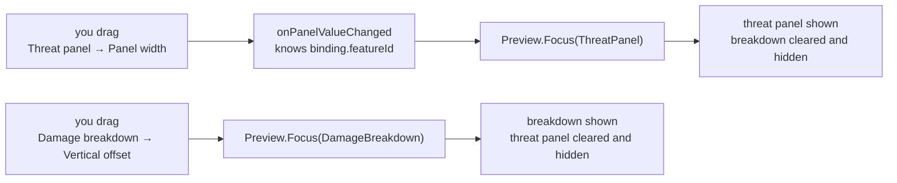
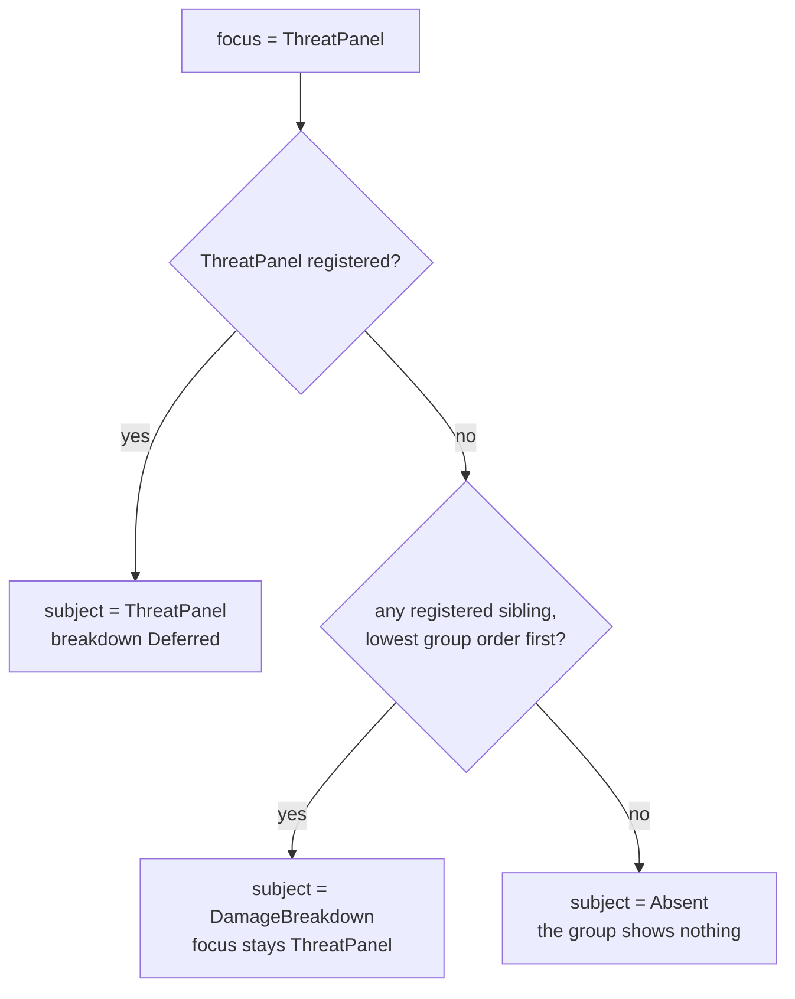
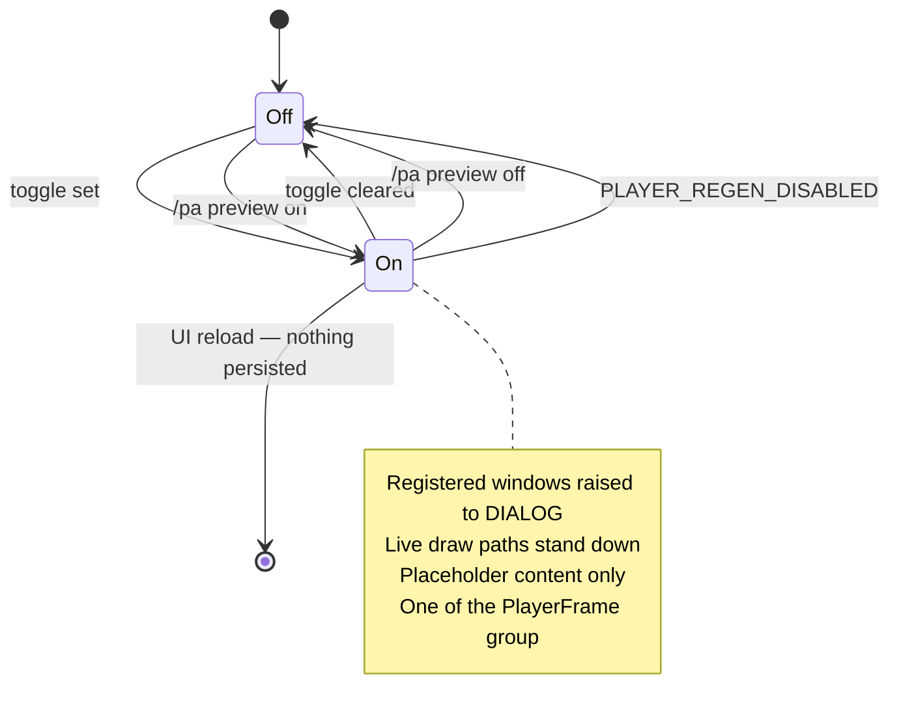

# PersonalAddon — Phase 13 Design: preview mode and panel width

**Date:** October 9, 2026
**API version:** 1.60.1 (WoW Forever Beta)
**Designed against:** build 1.60.1.70291, UI export 2026-10-08 20:20
**Verified on:** build **1.60.1.70334**, UI export 2026-10-09 21:00 — `check` **Pass**,
all 31 premises hold (report `reports/2026-10-09-1.60.1.70334.md`)
**Supersedes:** §2 of `20261009-RoadmapProposal03.md`
**Depends on:** `20261006-Phase12.md` rev 3 (settings pages, the coalescing apply queue,
`PanelChrome.Place`), `20261005-Phase11.md` rev 7 (threat panel, the swap with the
breakdown), `20260927-Phase08.md` (toasts, `PanelChrome`, `FramePool`)
**Revision:** 5 — audit findings applied (§15); built and run in game twice, with §16's seven corrections; §1.2's gate closed; §16a records both runs

---

## 1. Scope

Three of the five items in Roadmap 03: a preview that shows this addon's windows while
you adjust them, a width setting on two of them, and the README column that records what
Phases 14 and 15 are about to re-open. Nothing here needs a capability this client has not
already demonstrated, and nothing here touches a Blizzard panel.

### 1.1 Decisions

Taken 2026-10-09. These are decisions, not open questions, and the sections below do not
re-argue them.

| # | Decision | Where it lands |
|---|---|---|
| D1 | Preview raises the windows above Blizzard's Options window and **keeps them up after Options closes**, until switched off, combat starts, or the UI reloads | §2.6, §2.7 |
| D2 | **No dragging.** Sliders only | §1.3 |
| D3 | **Width only.** No height control of any kind | §6 |
| D4 | Of the two panels that share the player-frame anchor, preview shows **exactly one at a time: whichever feature's setting you last changed.** Before any change, the threat panel | §2.5 |
| D5 | Preview **holds one item toast and one money toast** on screen for as long as it lasts | §5.5 |
| D6 | A real loot toast **evicts a sample at once**; samples are the lowest priority in the pool | §5.5 |
| D7 | The threat panel's minimum width is **10% under the player frame's health bar: 112 px** | §6.1 |
| D8 | The mob name is **hidden when the bar falls under 40 px**, rather than truncated to nothing | §6.3 |
| D9 | The skills panel keeps its own `SetPoint` and gains no Scale key. It still gains width and preview | §6.4 |

### 1.2 Gate: the client was patched mid-build, and is now verified

**Closed 2026-10-09 21:16.** Every fact in this document was verified against the 70291
export of 2026-10-08. `WowB.exe` was then replaced at 19:29 on 2026-10-09 — after the
design and after the code — so `patch_check` refused to run until the UI was exported
again.

| Step | Outcome |
|---|---|
| UI re-exported | 2026-10-09 21:00, digest `62705aa5d4d8fbf5` |
| `patch_check check` | **Pass** on build 1.60.1.70334, baseline 70291 |
| All 31 premises | Hold |
| `SETTINGS-PANEL-STRATA` | Holds — present at line 4 |
| `PLAYER-HEALTH-BAR-WIDTH` | Holds — present at line 124, so 112 is still ten per cent under that bar |

So the two facts this phase rests on survived the patch, and no number in
`Core/Constants.lua` had to change.

### 1.3 What ships

| Item | Kind | File |
|---|---|---|
| Preview registry and state | Substrate | `Core/Preview.lua` (new) |
| Strata raise and restore | Substrate | `Core/PanelChrome.lua` |
| Preview toggle, General page | Feature | `Features/SettingsPanel.lua` |
| Focus from the changed binding | Feature | `Features/SettingsPanel.lua` |
| Placeholder rows, three panels | Feature | `ThreatPanel.lua`, `DamageBreakdown.lua`, `EquippedSkills.lua` |
| Held toast samples and sample eviction | Feature | `Features/Toasts.lua` |
| `panelWidth`, two panels | Feature | `ThreatPanel.lua`, `EquippedSkills.lua` |
| Name hidden under a bar threshold | Feature | `Features/ThreatPanel.lua` |
| `/pa preview` | Feature | `Core/Debug.lua` |
| Two premises | Docs | `Tools/patchcheck/premises.toml` |
| The "Tried in" column | Docs | `README.md` |

### 1.4 Not possible, or out of scope

- **Blizzard's Edit Mode.** It is named in rule 8 and it is a Blizzard panel system.
  Registering our frames with it puts our frames in it, which rules 3 and 6 forbid.
  Preview is ours and draws only our own frames.
- **Dragging a panel to move it** (D2). `PanelChrome.Build` calls `EnableMouse(false)` on
  purpose: with no mouse and no buttons, the Gamepad UI's navigation finds nothing in the
  panel. Enabling it would reverse that and give `anchorOffsetX` a second writer that has
  to agree with the slider.
- **Any height control** (D3). Panel height is `padding × 2 + rows × ROW_HEIGHT + gaps`.
  The threat panel and the breakdown already have "Rows shown"; the skills panel's row
  count is what you have equipped.
- **A width slider on the damage breakdown.** §6.5.
- **A Scale slider for the skills panel** (D9), and moving it onto `PanelChrome.Place`.
- **Previewing a disabled feature's window.** Its frames are built at `enable` and do not
  exist. Preview reports it `Skipped` with the state named.
- **Previewing the five-second-rule line.** It is a texture on Blizzard's mana bar, not a
  window of ours, and it has no geometry setting.
- **Previewing nameplate colours.** No fake nameplate is drawn. The threat panel's
  placeholder bars use the nameplate palette, so the six colours are visible there.

### 1.5 Types

```
PanelId        = ThreatPanel | DamageBreakdown | EquippedSkills | Toasts
AnchorGroup    = PlayerFrame | Bags | Screen
PreviewState   = Off | On
Strata         = "BACKGROUND" | "LOW" | "MEDIUM" | "HIGH" | "DIALOG"
               | "FULLSCREEN" | "FULLSCREEN_DIALOG" | "TOOLTIP"
Pixels         = integer

PreviewOutcome = Shown(panelId: PanelId, rowsDrawn: integer)
               | Deferred(panelId: PanelId, shownInstead: PanelId)
               | Skipped(panelId: PanelId, standing: FeatureState | NotRegistered)

Registration   = {
    panelId:     PanelId,
    raiseTarget: Frame,
    baseStrata:  Strata | Inherited,
    show:        function() -> integer,
    clear:       function() -> nil,
}

PreviewView    = {
    state:   PreviewState,
    focus:   Map<AnchorGroup, PanelId>,
    windows: List<{ panelId: PanelId, outcome: PreviewOutcome }>,
}

WidthFloor     = { total: Pixels, flexible: Pixels }
BindingTarget  = Switch | Key | PreviewToggle
ChangeOutcome  = Accepted | UnreadableColour | Refused
ControlBuilt   = Built(initializer: Initializer | Absent)
               | NotBuilt(reason: string)
```

Four of these are inherited rather than new. `FeatureState` is `ns.FEATURE_STATE`
(`Core/Constants.lua`: `REGISTERED`, `DISABLED`, `ENABLING`, `ENABLED`, `FAULTED`).
`Binding`, `PanelValue`, `Initializer`, `Category` and `SettingsApi` are Phase 12
§1.4's. `Frame` is a client widget. `ChangeOutcome`'s three values are the strings
`onPanelValueChanged` already returns.

~~`Inherited` is a distinct value, not `nil`~~ — **retired in the build (§16).** There is
no way to restore a frame to "inherited", so `PanelChrome.Build` records a literal
strata for every panel instead: `spec.strata` when one is given, and otherwise the new
frame's own strata, read once at creation through `ClientRead`. `Restore` therefore
always writes a literal and never reads one.

`Registration` carries no anchor group. The group is a fact about where a window is drawn
rather than about whether it is drawn now, so it belongs in the static table of §2.2 and
not in a record that comes and goes with a feature's lifecycle.

---

## 2. `Core/Preview.lua`

### 2.1 Why one module and not three toggles

Three independent per-panel toggles would let two panels disagree about whether the screen
is showing real numbers, and D4's one-at-a-time rule is a decision **between** panels
that no single panel can take. One module holds the state, the registration set and the
focus; each panel contributes two functions and reads one boolean.

The module holds at most four registrations, keyed by `PanelId`. There is no unbounded
collection in it.

### 2.2 What preview knows, and what it is told

Two tables, with different lifetimes.

**The static table** names the four windows, their anchor groups and the features that own
them. It is static because the group is a fact about where a window is drawn, and because
`Inspect` has to be able to say *the threat panel is off* about a window that never
registered at all.

| `PanelId` | `AnchorGroup` | `featureId` | Order in group |
|---|---|---|---|
| `ThreatPanel` | `PlayerFrame` | `threatPanel` | 1 |
| `DamageBreakdown` | `PlayerFrame` | `damageBreakdown` | 2 |
| `EquippedSkills` | `Bags` | `equippedSkills` | 1 |
| `Toasts` | `Screen` | `toasts` | 1 |

**A registration is transient.** A feature adds one at its `enable` and drops it at its
`disable`, because the frames a registration points at are built at enable. So *known* and
*registered* are different questions and both are answered: a disabled feature is known,
unregistered, and reported `Skipped` with its registry state named.

The group order breaks ties in §2.5's fallback. It is declared, not derived from
registration order, so the fallback does not depend on which feature enabled first.

### 2.3 Contracts

```
# Whether placeholder content is on screen now. Read by every live draw path
# before it draws, and by the four /pa inspectors.
# pre:  none
# post: true between SetEnabled(true) and whichever comes first of
#       SetEnabled(false), PLAYER_REGEN_DISABLED and the end of the UI load
# raises: never
function Preview.IsEnabled() -> boolean

# The window a group shows, which is not always the focused one (section 2.5).
# pre:  group is one of the three
# post: the focused panel when it is registered; otherwise the lowest-order
#       registered panel in the group; Absent when the group holds no
#       registration. The focus itself is not changed
# raises: never
function group_subject(group: AnchorGroup) -> PanelId | Absent

# Turns preview on or off across every window.
# pre:  runs in our own execution, a frame after whatever asked for it
# post: entering On, one outcome per KNOWN panelId, in static-table order:
#       Skipped(panelId, Registry.State(featureId)) when it holds no
#       registration, or NotRegistered when the feature never registered at all;
#       Shown(panelId, rowsDrawn) when it is its group's subject, after being
#       raised to DIALOG;
#       Deferred(panelId, subject) when it is registered but another panel is its
#       group's subject - it is neither raised nor shown.
#       Leaving On: every raised window is restored to its recorded base strata,
#       every registration's clear() runs whether or not it was shown, and each
#       window's own visibility rule decides what stays on screen. Idempotent:
#       the state it already holds returns the same outcomes and touches no frame
# raises: never
function Preview.SetEnabled(wanted: boolean) -> List<PreviewOutcome>

# Names the window a group should prefer (section 2.5).
# pre:  none
# post: the group that owns panelId has panelId as its focus, whether or not it
#       is registered: the focus is the user's last stated intent and a disabled
#       feature does not take it away. While preview is On, the group's subject
#       is recomputed, and if it changed the new subject is raised and shown and
#       the old one is cleared, hidden and restored, in this call. A panelId the
#       static table does not know is ignored
# raises: never
function Preview.Focus(panelId: PanelId) -> nil

# Adds a window, at its feature's enable.
# pre:  registration.show and .clear are the feature's own and read no client
#       value; raiseTarget is a frame of ours
# post: the registration replaces any earlier one for the same panelId. While
#       preview is On the group's subject is recomputed, so registering the
#       focused panel displaces whichever sibling was standing in for it. A
#       panelId the static table does not know is refused and noted
# raises: never
function Preview.Register(registration: Registration) -> nil

# Drops a window, at its feature's disable.
# pre:  none
# post: the registration is gone, and if it was raised it is restored and
#       cleared first, so a feature never disables with our strata left on it.
#       While preview is On the group's subject is recomputed, so dropping the
#       subject promotes a registered sibling
# raises: never
function Preview.Unregister(panelId: PanelId) -> nil

# Registers the one observer told when preview's state changes (section 2.6).
# pre:  observer is ours and writes no Blizzard state
# post: observer replaces any earlier one and is called with the new state after
#       every transition, including the combat exit
# raises: never
function Preview.SetStateObserver(observer: function(state: PreviewState) -> nil) -> nil

# What /pa preview prints.
# pre:  none
# post: the state, each group's focus, and one line per KNOWN panelId with its
#       last outcome - so a window that is off, or deferred, is listed with the
#       reason rather than missing
# raises: never
function Preview.Inspect() -> PreviewView
```

### 2.4 The anchor groups

Preview is told which windows compete for a place on screen. Inferring it would mean
reading our panels' resolved anchors and comparing them, which is geometry reading for no
gain.

| `PanelId` | Anchored to | Competes with |
|---|---|---|
| `ThreatPanel` | `PlayerFrame` BOTTOMLEFT→TOPLEFT, offsets 0, 8 | `DamageBreakdown` |
| `DamageBreakdown` | the same frame, point and offsets | `ThreatPanel` |
| `EquippedSkills` | `ContainerFrameCombinedBags` TOPRIGHT→TOPLEFT | nothing |
| `Toasts` | `UIParent` TOP, offsets 0, −180 | nothing |

The `PlayerFrame` group holds two windows because Phase 11 §5.6 gave them the same anchor
and the same offsets on purpose: "The two features know nothing of each other. The swap is
two defaults, the same position and the breakdown's new setting." Combat separates them in
play. Preview runs out of combat, where nothing does.

A feature whose anchor falls back to the screen because `PlayerFrame` is missing keeps its
declared group. The group is about which setting you are adjusting, not about where the
frame ended up.

### 2.5 Focus



The signal already exists. `onPanelValueChanged(binding, panelValue)` is handed the
binding, and `binding.featureId` names the feature. Focus is taken from there, which
means preview needs nothing from Blizzard — not the open category, not the control, not
the window's state.

Three properties this gets for free:

- **The panel you are adjusting is the visible one**, always, because the thing that
  changes the focus is the act of adjusting.
- **`/pa set threatpanel panelWidth 140` focuses it too**, because the slash path goes
  through the same `NotifyConfigChanged` seam and can call `Focus` beside it.
- **No new control.** D4 costs the user nothing to learn.

The initial focus is `ThreatPanel`, as a constant in `Core/Constants.lua`. It is the
panel with the most geometry to adjust and the one this phase exists for.

**The focus is a preference; the subject is what is on screen.** They differ whenever the
focused panel holds no registration — its feature is off, faulted or still enabling:



Without the fallback, a user with the threat panel switched off and the breakdown on would
turn preview on and see neither, which is the one outcome preview exists to prevent. With
it, the group always shows something if anything in it can be shown.

**The fallback does not move the focus.** `Preview.Focus` records the user's last stated
intent, and a feature being off is not a statement about intent: re-enabling the threat
panel makes it the subject again, in the `Register` call itself, with no second click.
`/pa preview` prints both, so the stand-in is never mistaken for a choice:

```
focus    PlayerFrame=ThreatPanel  Bags=EquippedSkills  Screen=Toasts
windows  ThreatPanel       skipped (DISABLED)
         DamageBreakdown   shown (4 rows, standing in)
         EquippedSkills    shown (6 rows)
         Toasts            shown (2 samples)
```

### 2.6 State



`PLAYER_REGEN_DISABLED` arrives on its own, so our handler is a separate run (rule 1).
`Preview` subscribes through `Dispatch`, which refuses and surfaces an undeliverable event
rather than assuming delivery — a preview that could not hear combat start would hide the
real threat panel during a fight, so the subscription failing has to be loud.

Ending at combat is wanted behaviour, not a limitation: the threat panel's whole purpose
is the fight, and placeholder rows during one would hide the thing being previewed.

**Two of those transitions are not the checkbox's doing, so the checkbox has to be told.**
The toggle's value lives in `state.panelValues`, which nothing but the panel writes. If
combat ends preview and that value stays `true`, the control shows checked the next time
the page is drawn, and the user's next click sets it `false` — a no-op on an already-off
preview — so turning preview back on takes two clicks.

`Preview.SetStateObserver` closes that. `SettingsPanel` registers one observer at its
enable; `Preview` calls it after **every** transition it makes, including the ones the
observer itself asked for, because writing a value that already holds is idempotent and a
"not for transitions you caused" rule is a special case that buys nothing.

What the observer may do is narrow, and §4.2 states it as a contract: **write
`panelValues` and nothing else.** `SettingsPanel.lua:22` records why — "A `setting:SetValue`
from here would run Blizzard's setting and control code in our execution." This is exactly
the shape `copyStoredValueToPanel` already uses for a refused value, whose documented
behaviour is that "the control on screen shows the stored value the next time it is drawn".

The combat exit also prints one line, once, because a window set that vanishes without
explanation reads as a bug:

```
PersonalAddon: the preview ended because a fight started.
```

A user-asked exit prints nothing: they know.

### 2.7 Why nothing hooks the Options window

Hiding the preview when Options closes needs to know that Options closed. The ways to know
are a hook on a Blizzard panel's hide path or a listener on its close event. **Rule 8
requires a test before anything that changes the settings panel**, and the Gamepad UI's
known refusal is specifically about closing Options with the controller after an addon's
page was drawn.

D1 needs neither. The three signals in §2.6 are all ours. This is the whole reason that
option was chosen over the tidier-sounding one.

---

## 3. The strata raise (`Core/PanelChrome.lua`)

### 3.1 What sits where

| Frame | Strata | Note |
|---|---|---|
| `SettingsPanel` | `HIGH` | `920 × 724`, `toplevel="true"`, `movable="true"` (`Blizzard_SettingsPanel.xml:4-5`) |
| `ContainerFrameCombinedBags` | `MEDIUM` | `parent="UIParent"`, `hidden="true"`, declared in XML so it always exists (`Blizzard_UIPanels_Game/Mainline/ContainerFrame.xml:308`) |
| Threat panel, damage breakdown | inherited from `UIParent` | `spec.strata` is nil for both |
| Skills panel | `MEDIUM` | `EquippedSkills.lua:508` |
| Toast container | `HIGH` | `Toasts.lua:750` |

The toast container is the one that needs care. `HIGH` is `SettingsPanel`'s own strata,
and `SettingsPanel` is `toplevel="true"`, so it raises its frame level within that strata
when shown. Equal strata is not above; the toasts need the same raise as the panels.

### 3.2 Contracts

```
# Raises one of our frames above Blizzard's Options window.
# pre:  frame is ours and parented to UIParent
# post: the frame's strata is DIALOG. Returns false, without raising, when the
#       frame has no SetFrameStrata or the call refused: one window the client
#       will not raise must not take the others down (section 12)
# raises: never
function PanelChrome.Raise(frame: Frame) -> boolean

# Returns one of our frames to the strata Build recorded for it.
# pre:  baseStrata came from PanelChrome.Build, or is the literal a caller that
#       sets its own strata uses
# post: the frame's strata is baseStrata. When baseStrata is absent -- Build's
#       read was Withheld -- MEDIUM is written, which is the client's default for
#       a frame with no strata of its own. Returns false as Raise does
# raises: never
function PanelChrome.Restore(
    frame: Frame,
    baseStrata: Strata | Absent
) -> boolean
```

`PanelChrome.Build` records `chrome.baseStrata` for every panel:

- `spec.strata` when the spec names one — the skills panel's `"MEDIUM"`;
- otherwise **the new frame's own strata, read once at creation** — the threat panel's
  and the breakdown's, which name none.

The toast container does not go through `Build`, so `Toasts.lua` hands over the literal
`CONTAINER_STRATA` its own code sets.

### 3.3 Why a literal is recorded rather than an "inherited" marker

The first draft of this section had `Build` record `Inherited` for a panel with no strata
of its own, and `Restore` "clear it back to its parent's". **There is no such operation.**
No API clears a frame's strata, and `UIParent` is created in C++, so the export cannot
tell us what a child of it inherits either. `Inherited` was a value nothing could act on.

So the read happens once, at creation, before anything of ours has written the frame's
strata — which is not the thing §3.3's first draft was avoiding. The distinction matters:

- **Reading back a value we wrote** is what rule 10's discipline is about, and what Phase
  12's review warned of: `SetFrameStrata` "accepts hidden values only when called
  untainted; a hidden value marks the strata hidden."
- **Capturing a default we never knew** is the only way to know it at all.

The read still goes through `ClientRead`. `GetFrameStrata` is secret-capable in the
generated docs, the secret-read lint fails any read that bypasses `ClientRead`, and it
failed this one on the first run (§16). A `Withheld` read records no literal, and
`Restore` then writes `MEDIUM` — a stated fallback rather than a frame left raised.

---

## 4. The toggle (`Features/SettingsPanel.lua`)

### 4.1 Owner and placement

`settingsPanel` is registered `internal = true` with empty `settings` and `schema`, so it
is filtered out of `Registry.PublicIds()` and draws no controls today. It is still the
right owner: the toggle is a property of adjusting settings rather than of any one
feature, and this is the only file that knows how to register a control on a page.

One checkbox, first on the **General** page, above the feature sections:

> **Show all windows for adjusting** — Shows this addon's windows with sample contents so
> you can see your changes as you make them. They stay up after you close Options, and
> turn off when a fight starts. The threat panel and the damage breakdown share one place,
> so you see whichever one you last changed.

### 4.2 A third binding target

`BindingTarget` gains `PreviewToggle` beside `Switch` and `Key`. Three functions branch on
it, one function is new, and no other code changes.

```
# Registers the preview toggle. Session-only: the value lives in the panel's own
# value table and reaches no config key.
# pre:  the General category is registered; controls.registerSetting resolved
# post: Built -> a checkbox whose binding target is PreviewToggle, registered
#       against state.panelValues with default false, with the standard
#       value-changed callback. NotBuilt(reason), noted for /pa panel, when the
#       setting or the control is refused: every other control on the page still
#       builds, and /pa preview still works
# raises: never
function build_preview_toggle(
    controls: SettingsApi,
    generalCategory: Category
) -> ControlBuilt

# post: PreviewToggle -> schedule_apply(binding) and Accepted, with no
#       ConfigStore.Set and no store form conversion; Switch and Key as today
# raises: never
function on_panel_value_changed(
    binding: Binding,
    panelValue: PanelValue
) -> ChangeOutcome

# post: PreviewToggle -> Preview.SetEnabled(panelValues[binding.variable] == true);
#       Switch -> Registry.SetEnabled as today;
#       Key -> Preview.Focus(binding.featureId) and then apply_key as today
# raises: never
function apply_binding(binding: Binding) -> nil

# The observer handed to Preview.SetStateObserver at this feature's enable, so
# the checkbox agrees with a state change it did not cause (section 2.6).
# pre:  runs from Preview, in our own execution
# post: the preview toggle's entry in panelValues is (state == On). NOTHING else
#       is touched: not the setting, not the control, not the config store. The
#       control on screen shows the written value the next time the page is drawn,
#       which is the same guarantee copy_stored_value_to_panel gives a refused
#       value. A no-op when the toggle was never built
# raises: never
function reflect_preview_state(state: PreviewState) -> nil
```

Four consequences of registering it this way rather than inventing a path:

- **A reload ends preview**, because nothing is persisted. No saved variable can strand
  placeholder windows on a future login.
- **The page's Defaults button turns it off**, because the declared default is `false` and
  Phase 12 §3.3 passes declared defaults, not current values.
- **Dragging is already coalesced.** The apply is deferred one frame per variable
  (§6.6), so `Preview.SetEnabled` and `Preview.Focus` both run in our own execution
  (rule 5).
- **A state change preview makes on its own reaches the checkbox**, through
  `reflect_preview_state`, so combat ending preview does not leave a checked box over an
  off preview (§2.6).

### 4.3 Focus from the binding

`apply_binding` calls `Preview.Focus(binding.featureId)` for every `Key` binding, not only
for the geometry keys. A feature id that no registration claims is ignored, so adjusting a
toast duration or a nameplate colour costs one table lookup and changes nothing.

Doing it in `apply_binding` rather than in `on_panel_value_changed` keeps it on the
deferred side of the queue, so a slider drag produces one focus call per frame instead of
one per step.

---

## 5. Placeholder content

### 5.1 The rule

**Placeholder content never goes through the live draw path.** The live paths bump
diagnostics counters and, in two of three panels, read the client. A preview that reused
them would move the counters `/pa threat` and `/pa dps` print and would make a screenshot
of placeholder rows indistinguishable from a real fight.

So each panel gets a second, shorter draw function. Three properties, asserted in the
harness rather than left to inspection:

1. **No client read.** No `ClientRead` call, no `UnitThreatSituation`, no
   `C_DamageMeter`, no skill read. The threat panel's palette comes from
   `Threat.PaletteFrom(settings)`, which reads stored settings and not the client.
2. **No counter moves.** Every counter in each panel's `COUNTER_NAMES` is unchanged
   across a preview cycle.
3. **Every placeholder is marked as one.** Row text says so, and the four `/pa`
   inspectors report `preview: on` while it is.

### 5.2 Threat panel

```
# Draws placeholder rows and sizes the panel. Not the sweep.
# pre:  the row pool was filled at enable; Preview.IsEnabled()
# post: maximumRows rows, drawn top down, each with: a bar at a descending
#       fraction coloured from Threat.PaletteFrom's palette so all six colours
#       appear across the rows; a descending threat percentage; the level and
#       elite tag when showLevel is set; the target marker on the first row when
#       markTarget is set; and a name marked as a sample, shown or hidden by
#       section 6.3's rule. The panel is sized as draw_rows sizes it. No counter
#       moves and no client value is read. Returns the row count
# raises: never
function show_placeholders() -> integer
```

The palette matters: it is the one place in the addon where the six nameplate colours can
be seen without finding six kinds of mob, so the placeholder rows cycle them.

### 5.3 Damage breakdown

```
# post: maximumRows rows with a fixed question-mark icon, descending DPS figures
#       and shares summing to 100, sized as the live path sizes it. No
#       C_DamageMeter call. Returns the row count
# raises: never
function show_placeholders() -> integer
```

The breakdown's row is icon, DPS, share — there is no name string, so there is nothing to
mark as a sample inside the row. `/pa dps` reporting `preview: on` is the whole signal,
which is weaker than the other two panels and is accepted: the figures are plainly round
numbers.

### 5.4 Skills panel

```
# post: PREVIEW_SKILL_ROWS (6) rows, each with a fixed icon and text marked as a
#       sample, at the widths a live row uses, anchored exactly as anchor_panel
#       anchors the live panel. No skill read. Returns 6
# raises: never
function show_placeholders() -> integer
```

Two divergences from the live panel, both stated rather than designed around:

- **The height is six rows, not your row count.** The live count is what you have
  equipped, behind reads that can be withheld. Width is what this phase adjusts, and
  width is unaffected.
- **The position is the bag frame's position.** `ContainerFrameCombinedBags` always
  exists, but before the bags have been opened once in a session it sits where XML put it
  rather than where Blizzard's panel manager puts it. Preview anchors where the live panel
  anchors, so the panel is in the right place relative to the bags whenever the bags have
  been seen, and in the wrong place on a fresh login until they have. The alternative —
  a second, preview-only position — would show you a panel that is nowhere it will ever
  be.

`/pa preview` names this: `skills: shown (bag frame not yet placed)` when the bag frame
has never been shown this session.

### 5.5 Toast samples

Two samples, one item and one money (D5), held for as long as preview lasts. They go
through the same `display` path as a real toast, with two differences: no duration timer
is started, so they never fade, and they are marked.

```
# Puts the held samples on screen.
# pre:  the feature is enabled; Preview.IsEnabled()
# post: one LOOTED_ITEM and one LOOTED_MONEY sample are in state.visible, laid
#       out by the existing layout(), with no duration timer and no counter
#       moved. Fewer than two when the pool or maximumVisible allows fewer, and
#       the shortfall is named for /pa preview. Returns the number shown
# raises: never
function Toasts.ShowPreviewSamples() -> integer

# Takes them down.
# pre:  none
# post: every sample is released to the pool, the remaining toasts are laid out
#       again, and the queue is drained as release() already drains it. Returns
#       the number released
# raises: never
function Toasts.ClearPreviewSamples() -> integer
```

**Eviction happens before the pool is asked, not after it fails** (D6). The toast pool is
`SURFACE_AND_FAIL` at `TOAST_POOL_CAPACITY` (5), and `FramePool.Acquire` at capacity logs
once that *"the cap is wrong"*. Two held samples with `maximumVisible` at its own maximum
of 5 would want seven frames and trip that notice — a false alarm caused by preview, about
a cap that is correct.

```
# Frees a slot for a real toast by giving up a sample.
# pre:  called from post(), before the visible-count check and before Acquire
# post: when no free slot remains and at least one sample is visible, the
#       newest sample is released and true is returned; false when no sample was
#       visible, in which case post() behaves exactly as it does today. A sample
#       given up this way comes back on the next ShowPreviewSamples, which the
#       real toast's release() triggers while preview is on
# raises: never
function evict_sample_for_real_toast() -> boolean
```

No real loot notification is ever lost to preview, and the position being adjusted stays
visible: at the default `maximumVisible` of 3, two samples leave a free slot and the first
real toast evicts nothing at all.

### 5.6 Suppressing the live paths

One boolean read per draw, at each panel's existing entry point.

| Panel | What stands down | Why it would fire |
|---|---|---|
| Threat panel | the sweep | Only runs in combat, and preview ends at combat. Belt and braces |
| Damage breakdown | the refresh and both settle reads (`SETTLE_DELAYS = { 0.6, 2.0 }`) | They fire out of combat, which is when preview runs |
| Skills panel | the poll ticker while the bags are open | Opening the bags during preview would overwrite the rows |
| Toasts | nothing | Real toasts must keep working (D6). Only the pool's priority changes |

---

## 6. Panel width

### 6.1 The floor

The threat panel's minimum width is **10% under the player frame's health bar** (D7). That
bar is `124 × 20`, declared twice in XML — `Blizzard_UnitFrame/Mainline/PlayerFrame.xml:124`
for the container and `:173` for the bar itself — and resized nowhere in Lua. So:

```
THREAT_PANEL_MINIMUM_WIDTH = round(124 × 0.9) = 112
```

**It is a constant, not a runtime read.** Three reasons, in order of weight:

1. `ConfigSchema.Declare` runs at file scope through `Registry.Register`, before any frame
   exists. A schema minimum cannot be read from a frame at declaration time.
2. The bar is inside `SecureFrameParentPropagationTemplate`. Reading its width is reading
   Blizzard widget geometry, which rule 10 puts behind `ClientRead` and which Phase 9
   deleted the ledger's geometry handlers for doing unguarded.
3. A `Withheld` read would need a fallback number anyway, and that fallback would be this
   constant — reached only on the path that is hardest to test.

Rule 11 covers the risk the constant creates: the fact goes in the premise register
(§8), so a client that changes the player frame's bar breaks the check instead of
silently invalidating the number.

```
# The narrowest this panel can be drawn without its columns colliding.
# pre:  the caller passes its own layout constants
# post: total is padding × 2 + every fixed column + every gap between them + the
#       flexible column's declared minimum; flexible is that minimum. Declared
#       at file scope, so the schema's minimum is a number by the time any
#       control is built
# raises: never
function width_floor(
    padding: Pixels,
    fixedColumns: List<Pixels>,
    gaps: List<Pixels>,
    flexibleMinimum: Pixels
) -> WidthFloor
```

The threat panel's floor is **not** `width_floor`'s result — D7 fixes it at 112, which is
below the 140 that a 50 px bar minimum would give. `width_floor` is still what the skills
panel uses, and what the threat panel's flexible minimum is derived *from*:

```
THREAT_BAR_MINIMUM = 112 − 12 − 78 = 22
```

recorded in `Core/Constants.lua` as a consequence of D7 rather than a judgement of its
own, so nobody later reads 22 as a considered minimum bar width.

| Panel | Fixed columns, padding, gaps | Flexible | Default | Minimum | Maximum |
|---|---|---|---|---|---|
| Threat panel | marker 3, tag 30, threat 36; padding 6; gaps 3, 3, 3 | the health bar | 200 | **112** (D7) | 400 |
| Skills panel | icon 14; padding 6; gap 4 | the `rank / maximum` text | 96 | **74** | 240 |

Defaults are today's `PANEL_WIDTH` values, so nothing moves on upgrade.
`ConfigSchema.Validate` already refuses a number below a declared minimum and names the
bound, so `/pa set threatpanel panelWidth 60` is refused with `must be at least 112`.

### 6.2 Applying it

```
# Applies a width to the panel and every row in its pool.
# pre:  width passed ConfigSchema; the pool was filled at enable
# post: the panel and every pooled row carry the new width; the flexible column
#       is width − padding × 2 − fixed − gaps; fixed columns are untouched. No
#       frame is created, so this is safe during a fight. Idempotent
# raises: never
function apply_width(width: Pixels) -> nil
```

The row pool is bounded — `THREAT_ROW_CAPACITY` is 16, `SKILL_ROW_CAPACITY` is 8 — so this
is a bounded loop over our own frames, and it must iterate the **pool**, not the live
rows: a row returned to the pool and acquired later would otherwise come back at the old
width.

Both panels anchor on the edge that does not move. The threat panel pins its BOTTOMLEFT to
the player frame's TOPLEFT, so narrowing takes width off the right; the skills panel pins
its TOPRIGHT to the bag frame's TOPLEFT, so narrowing takes it off the left. Neither needs
re-anchoring after a width change, and `anchorOffsetX` keeps its meaning.

### 6.3 The threat panel's row at narrow widths

The bar is the only flexible column, and the mob name is drawn **over** the bar rather
than beside it, so the name has no width of its own to give up:

| Panel width | Bar, tag on | Bar, tag off |
|---|---|---|
| 200 (default) | 110 | 143 |
| 140 | 50 | 83 |
| 112 (minimum) | 22 | 55 |

At 112 with the tag on, 22 px of bar carries two or three characters of name. D8:

```
# Whether a row shows the mob's name at the current width.
# pre:  called from the row draw, after the bar's width is known
# post: hidden when the bar is narrower than THREAT_NAME_MINIMUM_BAR (40),
#       shown otherwise. One shown-state call per row per draw
# raises: never
function name_shown_for(barWidth: Pixels) -> boolean
```

Below 40 px of bar the name is hidden outright, so a 112 px panel reads as marker, tag,
bar, threat percentage — deliberate, rather than a row with a letter and an ellipsis on
it. The threshold is a constant in `Core/Constants.lua`, not a setting: it is a legibility
floor, and a preference that lets you choose an unreadable name is not a preference worth
having.

**The tag column is counted in the floor whether or not `showLevel` is set.** A floor that
followed the toggle would mean turning the tag back on at 112 either overflowed the row or
silently rewrote a width the user had chosen. Instead the tag's 33 px is always reserved,
and turning it off hands that space to the bar — 55 px at the minimum width, which is
above the name threshold, so the names come back.

### 6.4 The skills panel

`panelWidth` only (D9). Its `level` font string already derives its width from
`PANEL_WIDTH`, so it is genuinely flexible; its `SetPoint` stays as it is and it gains no
Scale key.

The inconsistency this leaves is worth naming: the skills panel is the only one of the
three whose offsets are not divided by a scale, because it has no scale to divide by. If
Scale is ever added to it, that move has to go through `PanelChrome.Place` in the same
change, or the offsets will shift under the user.

### 6.5 Why not the damage breakdown

Its row is icon 14, DPS 48, share 36 — every column fixed, and no name string, because the
icon is the identifier. The usable range is:

```
12 + 14 + 8 + 48 + 4 + 36 = 122   …   132 (today)
```

Ten pixels, after which the DPS and share columns collide; above 132 the panel gains dead
space and nothing else. **For a panel whose every column is fixed, width is scale**, and
`scale` has been on the breakdown since Phase 12.

If a wider DPS column is what is wanted for five-digit figures, that is a different
change: `rate` is a fixed 48 px and a wider panel does not widen it.

### 6.6 Live adjustment needs no new machinery

Phase 12 §2 already defers and coalesces the apply per variable, one frame after the
value-changed callback, because "dragging a slider fires the callback continuously, and
each intermediate value need not be applied."

So a drag produces at most one `apply_width` per frame over at most sixteen pooled rows,
and at most one `Preview.Focus` per frame. Nothing in this phase adds a timer, a ticker or
an `OnUpdate`.

---

## 7. `/pa preview` and diagnostics

| Command | What it does |
|---|---|
| `/pa preview` | The state, each group's focus, and one line per **known** window with its last outcome — so one that is off, or standing in for the focused one, says so (§2.5) |
| `/pa preview on`, `/pa preview off` | The same path the toggle takes |
| `/pa preview threat`, `/pa preview dps` | Focuses one of the `PlayerFrame` group, for when you are not in Options |

`/pa threat`, `/pa dps`, `/pa skills` and `/pa toasts` each gain one line, `preview: on`,
while it is on. That line is the whole defence against reading placeholder figures as
real, so it goes first in each report rather than last.

One chat line is printed on the combat exit and on nothing else (§2.6). A preview the
user ended needs no narration; one that ended on its own does.

`Preview` registers no diagnostics counters. It is session state with no failure history
worth keeping across reloads, and §5.1's second property is that preview moves **no**
counter — a preview that kept its own counters in the same table would weaken the check.

---

## 8. The patch check

```toml
[[premise]]
id = "SETTINGS-PANEL-STRATA"
statement = "Blizzard's settings window sits at HIGH strata, so DIALOG is above it"
source = "Phase 13 section 3.1"
consequence = "Preview windows are drawn behind the Options window (Core/Preview.lua)"
check = { kind = "Pattern", file = "Blizzard_Settings_Shared/Blizzard_SettingsPanel.xml", regex = 'name="SettingsPanel"[^>]*frameStrata="HIGH"', expect = "Present" }

[[premise]]
id = "PLAYER-HEALTH-BAR-WIDTH"
statement = "The player frame's health bar is 124 pixels wide, declared in XML and resized nowhere in Lua"
source = "Phase 13 section 6.1; decision D7"
consequence = "The threat panel's 112 px minimum is no longer 10% under the player frame's bar (Core/Constants.lua)"
check = { kind = "Pattern", file = "Blizzard_UnitFrame/Mainline/PlayerFrame.xml", regex = '<Size x="124" y="20"/>', expect = "Present" }
```

Both targets were checked against the 70291 export before this document was written:
each file is in the resolved load set, so neither check returns `UNKNOWN`, and each regex
matches — the strata one once at line 4, the size one twice, at lines 124 and 173.

`PLAYER-HEALTH-BAR-WIDTH` is weaker than it looks and the weakness is stated here rather
than discovered later: the pattern matches that size **anywhere** in the file, and the
file declares it twice. A patch that changed the bar to 124 × 24, or moved the 124 to some
other frame, would pass. Binding the check to the `HealthBar` key needs a multi-line
pattern the register's `Pattern` kind does not take. The check is still worth having: the
realistic failure is Blizzard changing the number, which this catches.

A third premise is deliberately not added for the bag frame's existence. The skills panel
already depends on `ContainerFrameCombinedBags` in shipped code and `anchor_panel` already
returns early when it is missing; preview adds no new dependency on it.

---

## 9. README

Three changes.

1. **The "Tried in" column** on the "Tried and not possible" table, carrying the phase, a
   link to its design document, and the client build the attempt failed on. Not "Phase
   introduced": nothing in that table was introduced, and the build is what makes a row
   actionable. Where the build was not recorded — three rows predate the patch check — the
   cell reads `not recorded` rather than a guess.
2. **Preview**, under the features, in one paragraph: what it shows, that it survives
   closing Options, that it ends when a fight starts, and that the threat panel and the
   breakdown take turns.
3. **Width**, on the threat panel's and the skills panel's bullets, with the minimum and
   where it comes from.

The "Planned" section and the rules are untouched.

---

## 10. Rule compliance

| Rule | How this phase satisfies it |
|---|---|
| 1 | One value-changed callback per control, as every control already uses. `PLAYER_REGEN_DISABLED` arrives on its own, so the handler is a separate run. No dropdown: the toggle is a checkbox |
| 2 | Nothing written into a Blizzard variable or table. The toggle lives in `state.panelValues`, ours. Sample marks go on our own toast frames |
| 3 | No `ShowUIPanel` or `HideUIPanel`. Preview shows our frames |
| 4 | No new hooks of any kind |
| 5 | Every apply is deferred one frame into our own execution through the queue Phase 12 built |
| 6 | Panels stay parented to `UIParent`. Raising a strata does not reparent, and no frame of ours is created under a Blizzard panel |
| 7 | No protected call. `SetFrameStrata` on our own frame is not one |
| 8 | **Nothing touches a Blizzard panel.** §2.7 |
| 9 | No client call that other code listens to |
| 10 | Preview reads nothing from the client. Width reads nothing. The player frame's bar width is a constant, not a read (§6.1) |
| 11 | Two premises, §8 |

The known exceptions list in the README gains nothing: this phase adds no new one.

---

## 11. Verification

### 11.1 Harness: `tests13.lua`

Two sessions, as Phase 12 ran two: `phase13` and `phase13-refused`, the second with the
settings API refusing the preview setting and `SetFrameStrata` raising.

| Check | Asserts |
|---|---|
| Preview on, all four registered | one outcome per known panelId, in static-table order; `DamageBreakdown` is `Deferred(DamageBreakdown, ThreatPanel)`, the other three `Shown` |
| Preview on with the threat panel's feature disabled | `Skipped(ThreatPanel, "DISABLED")`, and `group_subject(PlayerFrame)` falls through, so the breakdown is `Shown` |
| …and the focus after that fallback | still `ThreatPanel`: the fallback shows a sibling and does not move the focus |
| …then the threat panel is enabled while preview is on | `Register` makes it the subject again in that call; the breakdown is cleared, hidden and restored. No second click |
| Preview on with **both** `PlayerFrame` features disabled | both `Skipped`, `group_subject` is `Absent`, and the other two windows still `Shown` |
| A feature that never registered at all | `Skipped(panelId, NotRegistered)`, distinct from a registry state |
| `Unregister` of the current subject while on | the sibling is promoted, raised and shown in that call |
| `SetEnabled(true)` twice | identical outcomes, no second raise, no second `show` call |
| `SetEnabled(false)` from `Off` | no `clear` call on an unraised window |
| Strata restore | a window built with no strata ends on the literal `Build` read at creation; one built `MEDIUM` ends `MEDIUM`; the toast container ends `HIGH` |
| `Focus(DamageBreakdown)` while on | the breakdown shown and the threat panel cleared, in one call |
| `Focus` on an id the static table does not know | no change, no error |
| `Focus` on a known but unregistered id | the focus is recorded; the subject does not change |
| `PLAYER_REGEN_DISABLED` while on | preview `Off`, every window restored and cleared |
| **The registered setting's own `SetValue`, then a frame** | the preview turns on, and off again — the control path, not the API (§16 item 7) |
| **The width slider's `SetValue`, then a frame** | the panel narrows, the store takes the value, and the threat panel takes the focus |
| **A breakdown setting's `SetValue`, then a frame** | the focus and the subject move to the breakdown |
| The state observer | called on every transition, including `SetEnabled`'s own, with the new state |
| `reflect_preview_state(Off)` | writes the toggle's `panelValues` entry to false and calls nothing on the setting or the control |
| Combat exit with no observer registered | preview still goes `Off`; no error |
| Dispatch refuses the combat event | `enable` surfaces it; preview does not silently run without it |
| Counters across a preview cycle | every counter in all four `COUNTER_NAMES` unchanged |
| Placeholder draws | no `ClientRead` entry point called, in a run where each one raises if touched |
| `width_floor` | the skills panel's 74 from its own constants |
| `panelWidth` at 111 and at 401 | refused, with `must be at least 112` and `must be at most 400` |
| `apply_width(112)` | panel and all 16 pooled rows at 112; bar 22 with the tag on, 55 with it off |
| `name_shown_for` | false at 22 and 39, true at 40 and 110 |
| A row released and re-acquired after a width change | comes back at the new width |
| Every sample icon is a real texture path, and at least three were found to check | catches a path whose separators were lost; mutation-tested |
| Two samples with `maximumVisible` 5, then five real toasts | no `POOL_EXHAUSTED` notice; samples evicted newest first; all five real toasts shown |
| A real toast at `maximumVisible` 3 with two samples | evicts nothing; three visible |
| `ClearPreviewSamples` | pool returned to its pre-preview counts; the queue drained |
| The preview setting refused | `NotBuilt`, every other General-page control still built, `/pa preview on` still works |

The secret-read lint runs first, as it always does. It is the check that enforces §5.1's
first property mechanically rather than by reading the diff.

### 11.2 The patch check

**Not run, and it cannot be: §1.2's gate is open.** The two premises are in the register,
which now holds 31, and `load_register` validates their kinds, paths, regexes and expect
values. Both regexes were matched by hand against the 70291 export — the strata one once,
at line 4; the size one twice, at lines 124 and 173 — and both files are in the resolved
load set, so neither check will come back `UNKNOWN`.

`check` itself refuses while `WowB.exe` is newer than the export. Re-export, then
`python Tools/patchcheck/patch_check.py check`, expecting all 31 to hold.

### 11.3 In game

1. `/pa preview on` out of combat, with no Options window open: threat panel, skills panel
   and two toast samples appear; the breakdown does not.
2. Open Options → AddOns → PersonalAddon → General. The windows are still visible, over
   the settings window.
3. Combat → Threat panel → Panel width. Drag it from 200 to 112 and watch the panel
   narrow; confirm the names disappear as the bar passes 40 px.
4. Drag Damage breakdown → Vertical offset. The breakdown appears and the threat panel
   goes.
5. Loot something green. A real toast appears at once; a sample gives up its slot.
6. Close Options with the controller. The windows stay up.
7. Pull a mob. Preview ends; the real threat panel draws the fight.
8. `/reload`. Preview is off and the General-page checkbox is clear.
9. `/pa preview`, `/pa threat`, `/pa dps`, `/pa skills`, `/pa toasts` — each consistent
   with what is on screen.
10. `/pa blocked` — empty. `/pa diag` — no fault notes.

Step 6 is the one to watch: it is the Gamepad UI's known refusal path, and reaching it
after an addon's page was drawn is what the README's known issue describes. A refusal there
is a Blizzard defect and not this phase's, but it must be recorded in the run notes either
way, because a refusal that appears only after preview has run would mean something here
is wrong.

---

## 12. Failure modes

| Failure | Behaviour |
|---|---|
| The preview setting or control is refused | `NotBuilt`, noted for `/pa panel`; the rest of the General page builds; `/pa preview` still works |
| `SetFrameStrata` raises on one window | That window is `Skipped` with the reason; the others still raise. Fewer windows, never a window left raised |
| `Dispatch` cannot deliver `PLAYER_REGEN_DISABLED` | Surfaced at enable. Preview refuses to turn on rather than run without a combat exit |
| Preview on when the UI reloads | Off. Nothing is persisted |
| A feature disabled while preview is on | `Unregister` restores and clears it first, then promotes a registered sibling if the group has one |
| The focused `PlayerFrame` feature disabled | Its sibling stands in (§2.5). The focus does not move, and `/pa preview` says which is standing in |
| Both `PlayerFrame`-group features disabled | `group_subject` is `Absent`; the group shows nothing; the other two windows still show |
| Combat ends preview | The toggle's value is written back to false through the observer, so the checkbox agrees, and one line says why (§2.6) |
| The toggle was never built, and combat ends preview | `reflect_preview_state` is a no-op; `/pa preview` still reports the state |
| `PlayerFrame` missing entirely | Both panels fall back to the screen, as they already do, and keep their group. Preview still shows one of them |
| The bag frame has never been shown | The skills panel previews at the bag frame's XML position; `/pa preview` says so |
| The toast pool exhausted with no sample to evict | Today's behaviour exactly: the `POOL_EXHAUSTED` notice, which is then a true report |
| A width below the floor from a hand-edited saved variable | `ConfigStore` validates on load as it does today; the stored value is refused and the default stands |
| `C_Timer.After` missing | `canDefer` already falls back to applying inside the callback, with its existing notice. Preview and width both still work, in Blizzard's call stack — a stated trade, not a new one |

---

## 13. Exit criteria

| # | Criterion | Status |
|---|---|---|
| 1 | `tests13.lua` passes in both sessions, with the lint clean | **Met.** 71 checks in `phase13` and 69 in `phase13-refused`; 579 across all nineteen sessions; lint 0 hits |
| 2 | The register holds the two new premises and they are well-formed | **Met.** 31 premises, `load_register` clean |
| 3 | All 31 premises hold on the running client | **Met.** `check` Pass on 1.60.1.70334 (§1.2) |
| 4 | The in-game run of §11.3 completes, with step 6's outcome recorded either way | **Met.** The first run found §16 item 7 and stopped at step 2; the second completed on the fixed build. Step 6's outcome is the known G1 cascade, recorded in §16a |
| 5 | `/pa blocked` empty across the run; no fault note in `/pa diag` | **Met as far as it can be.** `faults = {}` in all five sessions. `/pa blocked` is not empty and was not expected to be: only the two known G1 records moved, no new function name appeared, and every other entry predates this phase (§16a) |
| 6 | The README's table has a filled "Tried in" column for every row | **Met.** Nine rows; three read `build not recorded`, which is what they are |
| 7 | The threat panel sits at 112 px with no names and at 140 px with names — a screenshot pair in the run notes | Not captured. The width path is covered offline by P42–P53f, including through the slider itself |

Criteria 1 to 6 are met. Only 7's screenshot pair is outstanding, and the behaviour it
would illustrate is asserted offline.

---

## 14. Files

| File | Change |
|---|---|
| `Core/Preview.lua` | New. The static window table, registrations, state, focus and its fallback, the state observer, the combat subscription |
| `Core/PanelChrome.lua` | `baseStrata` recorded in `Build`; `Raise`, `Restore` |
| `Core/Constants.lua` | `PREVIEW_INITIAL_FOCUS`, `PREVIEW_SKILL_ROWS` (6), `THREAT_PANEL_MINIMUM_WIDTH` (112) with its derivation, `THREAT_BAR_MINIMUM` (22), `THREAT_NAME_MINIMUM_BAR` (40), `SKILL_PANEL_MINIMUM_WIDTH` (74), `SKILL_TEXT_MINIMUM` (44) |
| `Core/ConfigSchema.lua` | Nothing. `Number` with `UNIT.PIXELS` already presents as a slider |
| `Features/SettingsPanel.lua` | `PreviewToggle` binding target, exempt from `flushPendingApplies`' registry guard (§16 item 7) and from `stored_value_for`; `build_preview_toggle`; `reflect_preview_state` registered as `Preview`'s state observer at enable; `Preview.Focus` from `apply_binding` |
| `Features/ThreatPanel.lua` | `panelWidth`, `apply_width`, `show_placeholders`, `name_shown_for`, the live-path gate, `Preview.Register`/`Unregister` |
| `Features/EquippedSkills.lua` | `panelWidth`, `apply_width`, `show_placeholders`, the live-path gate, register/unregister |
| `Features/DamageBreakdown.lua` | `show_placeholders`, the live-path gate, register/unregister. No width |
| `Features/Toasts.lua` | `ShowPreviewSamples`, `ClearPreviewSamples`, `evict_sample_for_real_toast`, `CONTAINER_STRATA` named, `coalesceMoney` skips samples (§16 item 4), register/unregister |
| `Core/Debug.lua` | `/pa preview`; `preview: on` in four reports; the help line |
| `Core/FramePool.lua` | `ForEach`, for a geometry change that must reach pooled frames nobody holds (§16 item 5) |
| `Tools/harness/tests13.lua` | New. 71 checks in `phase13`, 69 in `phase13-refused`, including the control-driven paths of §16 item 7 |
| `Tools/harness/stubs13.lua` | New. `frameByName`, `settingValue`, `childWidths` |
| `Tools/harness/stubs8.lua` | A new frame inherits its parent's strata, as the client's does (§16) |
| `Tools/harness/tests12.lua` | A5 skips the one page-level control (§16) |
| `Tools/harness/run.py` | Two sessions and `stubs13.lua` added |
| `Tools/patchcheck/premises.toml` | Two premises |
| `README.md` | §9: the "Tried in" column, the preview bullet, width on two features, `/pa preview` in the command table |
| `PersonalAddon.toc` | `Core\Preview.lua` before the features; `X-Phase: 13`; version |

---

## 15. Audit disposition

The audit is `20261009-Phase13Audit.md`, of 2026-10-09. Three findings, **all accepted**,
one extended.

| # | Finding | Disposition | Change |
|---|---|---|---|
| 1 | `PreviewView`, `ChangeOutcome`, `Built` and `NotBuilt` are used as return types and defined nowhere | Accepted | All four defined in §1.5, with `PreviewState` which was also missing. `ChangeOutcome`'s values are the three strings `onPanelValueChanged` already returns; `Built`/`NotBuilt` became one `ControlBuilt`. §1.5 now also names the five types inherited from Phase 12 §1.4 and `FeatureState` from `Core/Constants.lua`, so a reader can tell new from existing |
| 2 | Nothing syncs the combat exit back to the session-only toggle, so the checkbox shows checked over an off preview | Accepted | `Preview.SetStateObserver` (§2.3) and `reflect_preview_state` (§4.2). `SettingsPanel` registers one observer at enable; `Preview` calls it after every transition. The observer writes `panelValues` and nothing else, which is the shape `copy_stored_value_to_panel` already uses for a refused value — `SettingsPanel.lua:22` records why a `setting:SetValue` from here is not available. The combat exit also prints one line (§2.6), because a window set that vanishes without explanation reads as a bug |
| 3 | §11.1 expects the breakdown to be shown when the focused threat panel is skipped; §2.2 says the sibling stays `Deferred`, so neither would show | Accepted, extended | The test was right and the contract was wrong. §2.5 adds the fallback: a group's **subject** is the focused panel when registered, otherwise the lowest-order registered sibling, otherwise `Absent`. The focus is not moved by the fallback, so re-enabling the focused feature restores it inside the `Register` call. The extension the audit did not ask for is in §2.2: with registrations added at `enable` and dropped at `disable`, a disabled feature had **no registration at all**, so the `Skipped(state name)` outcome §2.2 promised was unreachable and the audit's own quoted test could not have passed either. Preview now holds a static table of the four windows, their groups and their feature ids, separately from the transient registrations, so `Skipped` is reachable, `/pa preview` can say *the threat panel is off*, and the group order that breaks the fallback's tie is declared rather than derived from whichever feature enabled first |

Findings 2 and 3 shared a cause: the design treated preview's state and its window set as
things only the settings page changed. Both are changed by events the page knows nothing
about — a fight starting, a feature being switched off — and each needed a stated answer
rather than an assumption that it could not happen.

---

## 16. What the build corrected

Five things the document had wrong, found by building it. Three were found by the tooling
rather than by reading.

| # | What the design said | What is true | Found by |
|---|---|---|---|
| 1 | `Restore` "clears the strata back to its parent's" for a panel built without one | No API clears a frame's strata, and `UIParent` is C++-made so the export cannot say what a child inherits. `Inherited` was a value nothing could act on. `Build` records a literal for every panel, reading the new frame's own strata once at creation (§3.3) | Writing `PanelChrome.Restore` |
| 2 | The strata read is "a read of our own frame", so unguarded | `GetFrameStrata` is secret-capable in the generated docs. The read goes through `ClientRead`; `Withheld` records no literal and `Restore` falls back to `MEDIUM` | **The secret-read lint**, which failed the first run with two hits in `Core/PanelChrome.lua` |
| 3 | A `Skipped` outcome carries the feature's registry state, captured when the group was applied | `Registry.SetEnabled` runs the feature's `disable` — which unregisters — **before** it writes the new state, so a standing captured then still says `ENABLED`. The standing is resolved when the outcome is reported instead | **Test P27**, which read `Skipped/ENABLED` |
| 4 | Preview samples are ordinary toasts with no fade timer | A real money toast **coalesced into the money sample**: `coalesceMoney` merges into any visible money toast, so real loot was added to a made-up figure on a toast that has no timer and would sit there until the preview ended. `coalesceMoney` now skips samples | **Test P36**, which found `counts.shown == 0` |
| 6 | — (not in the design) | Both sample **icon paths lost their backslashes**. The Lua literal needs two characters per separator; what reached disk had one, so Lua read `\I` as an unknown escape and the path became `InterfaceIconsINV_Misc_QuestionMark` — one the client cannot load. The harness passed anyway: no check looked at a texture path | **The IDE's Lua server** (`err-esc`), after the harness was already green |
| 7 | The toggle's value-changed callback schedules an apply, and the apply runs | **The apply was dropped.** `flushPendingApplies` guards each queued binding with `Registry.Defaults(binding.featureId)`, to discard an apply whose feature went away between the click and the frame. The preview toggle's `featureId` names no registered feature, so that guard was nil for it and **the checkbox did nothing** — silently, with no fault and no refusal. The guard now exempts `PREVIEW_TOGGLE` | **The user, in game.** Every offline check called `Preview.SetEnabled` directly and passed |
| 5 | Rows are resized through the live row list | A row resized only while live comes back at the old width the next time it is acquired. `FramePool.ForEach` is new, and `apply_width` walks the whole pool | Writing `apply_width`; asserted by P48 and P53 |

Two of these — 2 and 4 — are defects a reading of the design would not have caught, and
both were caught by a check that exists because an earlier phase was burned: the lint by
Phase 9 §4.4, and the "no counter moved, nothing read" discipline by Phase 2 §4.9's
accepted-and-discarded write. Finding 3 is the same shape as the audit's finding 3: state
that changes between two points in a call, described as though it could not.

**Finding 6 is the one worth dwelling on, because it is Phase 2 §4.9's error again.** The
addon could confirm its own write — the string was in the file, the file parsed, the
harness drew a row — and could not confirm the effect, because no stub rejects a texture
path and no check read one. Two further turns of the same screw:

- The *first* attempt to assert it passed **vacuously**. It ran while the damage breakdown
  was `Deferred`, so that panel had drawn nothing and the loop inspected two icons instead
  of four. P25a now asserts that at least three icons were found, so a check that
  inspects nothing fails instead of passing.
- The *first* attempt to mutation-test it **did not mutate anything**, for the same reason
  the bug existed: the edit went through a shell heredoc, which collapsed the doubled
  backslashes, so the pattern never matched the file. The mutation was redone with an
  editor and P25b failed as it should, naming all four rows.

The lesson is the project's existing one, stated for a new case: **a check that cannot be
shown to fail has not been shown to work.** Mutation-test a check written for a bug the
tests just missed, and do it with a tool that writes what you typed.

**Finding 7 is the worst of the seven, and the only one a user found.** The preview was
unusable from the settings menu — the one place this phase exists to serve — and sixty-five
offline checks said it worked, because every one of them called `Preview.SetEnabled`
rather than the control. The API path and the control path diverged at
`flushPendingApplies`, four calls downstream of the click.

The fix is one clause. The correction that matters is in the tests: **drive what the user
drives.** `tests13.lua` now sets the registered setting's value the way Blizzard's control
does — `HARNESS.settingsByVariable[variable]:SetValue(v)`, then a frame — so the check
traverses `onPanelValueChanged`, `scheduleApply`, `flushPendingApplies` and `applyBinding`.
Written first, it failed; with the clause, it passes. The same treatment went to the two
other control-driven paths this phase added, neither of which was broken but both of which
were equally untested: the width slider (P53a–c) and focus-follows-adjustment (P53d–f).

Phase 12 built that queue and tested it through the same direct calls. The gap was
inherited, not introduced — but it was Phase 13 that added the first binding whose
`featureId` is not a feature, which is what turned a harmless guard into a silent drop.

One change outside Phase 13's files was needed. **Phase 12's test A5** asserts that every
settings control is indented under its feature's switch; the preview toggle belongs to no
feature and has no switch to indent under. A5 now skips it by variable name, and Phase 13's
P1 asserts it is top-level, so the exception is tested rather than excused.

The harness stub for `CreateFrame` also gained an inherited `strata`, so a new frame reads
a string as the client's does rather than `nil`. Without it the harness could only exercise
`Restore`'s fallback path.

---

## 16a. The in-game runs, 2026-10-09

Build 1.60.1.70334, addon 1.3.0-phase13. Five UI loads. The run stopped at step 2 of
§11.3 and found §16 item 7.

**What worked.** `/pa preview` printed the window list correctly — so the static table,
the groups, the focus, the registrations and the report all behaved. `panelWidth` is in
the saved variables for both panels (200 and 96, the declared defaults), so the new
schema keys loaded, validated and persisted. There is **no `preview` entry** in
`PersonalAddonDB`, which is the session-only toggle behaving as §4.2 says it must.

**What failed.** The toggle did nothing (§16 item 7). Nothing surfaced it: no fault, no
refusal, no chat line — the apply was discarded by a guard before it ran.

**Diagnostics.** `faults = {}` in all five sessions. Nothing in the addon faulted, and no
feature declined to enable on the new build.

**Refusals, and whose they are.** `/pa blocked` was not empty, and none of it is this
phase's:

| Function | Count | First seen on | Reading |
|---|---|---|---|
| `SetPreferredGamepadInteractTarget` | 3083, 3080 | 1.60.1.70205 | The G1 cascade, from earlier sessions. The README's known issue |
| `RunBinding` | 2 | 1.60.1.70291 | A controller binding refused |
| `DescendStop`, `SpellStopCasting`, `SpellStopTargeting`, one unnamed | 1 each | 1.60.1.70291 | The same family: controller actions refused after Options |

One session recorded `refusalsOthersKnownDefect = 8` with `knownDefectHintShown = true`,
so BlockWatch recognised the defect and showed its `/reload` hint — which is what the
operator did. Every stack in the log reaches
`Blizzard_Settings_Shared/Blizzard_SettingsPanel.lua:291` in `ExitWithCommit`, through
`HideUIPanel` and `FrameControlsManager`, which is precisely the path the README's known
issue describes and `Architecture/20261002-GAPBugs01.md` documents. **No new refusal
pattern appeared, and none names a Phase 13 call.**

So the reload was the known Blizzard defect, not this phase — but the phase did nothing
useful before it, which is item 7.

### The second run, after item 7's fix

§11.3 was run again on the same build. The saved variables were diffed against the
capture taken between the two runs, rather than read fresh and judged by eye:

| Evidence | Reading |
|---|---|
| Block-log function names | **Unchanged — the same seven.** No new refused function appeared |
| Counts that moved | **Only the two `SetPreferredGamepadInteractTarget` records**, +7 each |
| `SpellStopCasting`, `SpellStopTargeting`, `RunBinding`, `DescendStop`, one unnamed | `firstSeenAt` 2026-10-09 **03:26 UTC** — that morning, hours before this phase existed. Untouched by either run |
| The two G1 records | `firstSeenAt` 2026-10-03. Six days old |
| `faults` | **Empty in all five sessions.** No feature faulted, and none declined to enable on 70334 |
| `refusalsOurs` | 7, 4, 4 and 6 across the four active sessions, each with `knownDefectHintShown = true` |
| The newest session | **No counters at all** — the load after the last `/reload`, before the client was closed |

**`refusalsOurs` is the counter to read carefully, and it is not an accusation.**
`onRefusal` bumps it whenever the game names *PersonalAddon* and the refusal is not
attributed to another addon's known defect (`Core/BlockWatch.lua:667`). The G1 cascade
names whichever addon's taint the UI state carries, so a Blizzard-caused refusal lands
there. `G1-SOLE-CALLER` holds on 70334: Blizzard is the only caller of the interact-icon
function, at `MainActionBarFrame.lua:291`.

That is why the README's "any entry in `/pa blocked` is a bug in this addon" now carries
the one exception explicitly, with the signature to tell it apart — the sentence as it
stood contradicted the known-issue paragraph three lines below it, which is what made this
run ambiguous to read.

---

## Assumptions

- **The export matches the running client.** `WowB.exe` is 2026-10-08 19:48, the export is
  20:20 the same evening, and `patch_check status` reports `UpToDate`. Every line number
  cited here is from that export.
- **`round(124 × 0.9)` is 112**, and D7 means the minimum rather than the default. The
  default stays at today's 200, so no existing panel moves on upgrade.
- **22 px of bar is a legible bar.** It is 20% of the default 110 and it is a consequence
  of D7, not a judgement — `THREAT_BAR_MINIMUM` is recorded as derived so nobody later
  reads it as a considered minimum.
- **40 px of bar is where a mob name stops being worth drawing.** Roughly six characters
  at `GameFontHighlightSmall`. A constant, not a setting (§6.3).
- **Six rows is a fair preview of the skills panel.** Two professions, three weapon slots
  and Defense is what `SKILL_ROW_CAPACITY`'s comment describes as the normal case.
- **`SetPoint` to a hidden frame places our panel geometrically.** `ContainerFrameCombinedBags`
  is declared in XML with `parent="UIParent"`, so it exists from load with a position; the
  shipped skills panel already relies on this whenever the bags are closing.
- **Blizzard's Options window being movable is enough** when a preview window lands over
  the control being dragged. If it is not, the next step is a preview-only offset — not
  dragging, and not hooking the window.
- **`binding.featureId` is a sound focus signal.** It is already how the panel decides
  which feature to notify, so a change that reaches a feature's settings is a change the
  user is making to that feature.
- **Two samples is the right number for the toasts.** It shows the stacking without
  filling the default `maximumVisible` of 3, so the first real toast evicts nothing.
