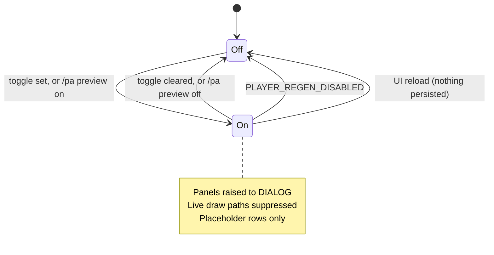
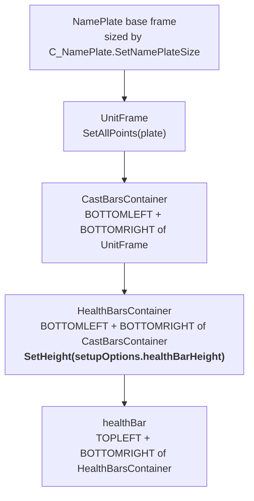
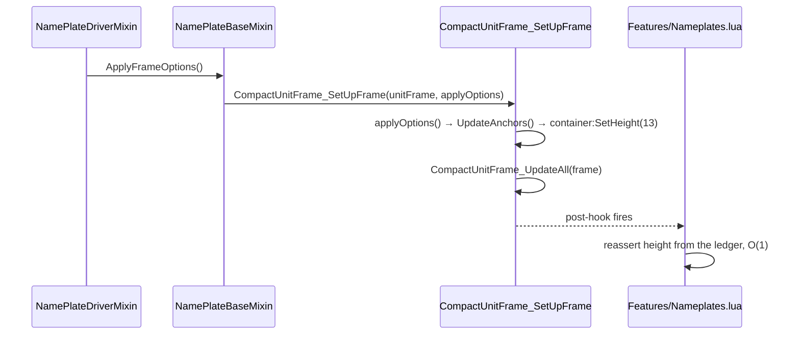
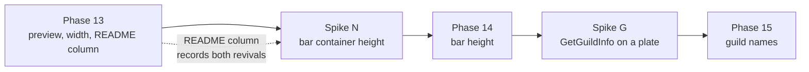

# PersonalAddon — Roadmap Proposal 03

**Date:** October 9, 2026
**API version:** 1.60.1 (WoW Forever Beta)
**Client:** 1.60.1.70291 (`WowB.exe`, 2026-10-08 19:48)
**UI export:** 2026-10-08 20:20 — `patch_check status` reports `UpToDate`, accepted after
review 2026-10-08 20:49
**Depends on:** `20261006-Phase12.md` rev 3 (settings pages, `PanelChrome.Place`),
`20261005-Phase11.md` rev 7 (threat panel), `20260919-Phase02.md` rev 7 (nameplate
restyle, the two failed sizing attempts, the restricted name region)
**Revision:** 1

---

## 1. Scope

Five requests. They do not belong in one phase, because two of them revive capabilities
this client was previously found not to have, and a revival has to be **probed before it
is designed against**. That is Phase 2 §4.9's lesson, and it was learned by shipping a
resize that never once took effect.

| # | Request | Phase | Why there |
|---|---|---|---|
| 1 | Edit mode / show all, with live adjustment | 13 | Our own frames only. No new client capability |
| 2 | Width adjustment on the panels | 13 | Same frames, same settings machinery, same commit |
| 5 | README: a column on the "Tried and not possible" table | 13 | Documents what 14 and 15 are about to act on |
| 3 | Resizing the nameplate health bar | 14 | Needs spike N first. Phase 2 closed this on a wrong measurement |
| 4 | Guild names on nameplates | 15 | Needs spike G, and widens the nameplate feature's unit scope for the first time |

Phase 13 is buildable from this document. Phases 14 and 15 are specified down to their
spikes and their seams; neither gets a full design until its spike answers.

### 1.1 Decisions

Taken 2026-10-09. These are decisions, not open questions.

| # | Decision | Consequence |
|---|---|---|
| D1 | Preview raises the panels above Blizzard's Options window and **keeps them up after Options closes**, until it is switched off, combat starts, or the UI reloads | Nothing hooks the Options window's close, which is what keeps this clear of rule 8 (§2.3) |
| D2 | **No dragging.** The existing offset, scale and the new width sliders are the only controls | `PanelChrome` keeps `EnableMouse(false)`; the Gamepad UI's navigation still finds nothing in our panels; offsets keep one writer |
| D3 | **Width only.** No panel-height control of any kind | Vertical size stays `rows × ROW_HEIGHT`. The threat panel and the damage breakdown already have "Rows shown"; the skills panel keeps none (§2.5) |
| D4 | The nameplate bar is attempted as an **addon restyle of `HealthBarsContainer`**, probed first | Spike N gates Phase 14 entirely. The CVar route is recorded as the fallback the user declined, not designed (§3.2) |
| D5 | Phase 15 ships **guild names on friendly player plates only**. NPC role tags are declined | No tooltip scrape on the nameplate path. Friendly plates enter scope for the first time (§4.2) |

### 1.2 One finding that changes request 2

The damage breakdown's row has **no flexible column**: icon (14 px, fixed), DPS (48 px,
fixed), share (36 px, fixed), and no spell-name string — the icon is the identifier.
A width slider there has a usable range of about ten pixels before the DPS and share
columns collide, and widening past today's 132 px only inserts dead space.

**For a panel whose every column is fixed, width *is* scale, and scale already exists.**
So Phase 13 puts width on the threat panel and the skills panel, and not on the damage
breakdown. §2.5 states what it would cost to overrule this.

### 1.3 Types

```
PanelId         = ThreatPanel | DamageBreakdown | EquippedSkills
PreviewState    = Off | On
Pixels          = integer
Strata          = "BACKGROUND" | "LOW" | "MEDIUM" | "HIGH" | "DIALOG"
                | "FULLSCREEN" | "FULLSCREEN_DIALOG" | "TOOLTIP"

WidthFloor      = { total: Pixels, flexibleColumn: Pixels }
PreviewOutcome  = Shown(PanelId) | Skipped(PanelId, reason: string)

BarHeightVerdict = Applied(onScreen: Pixels)
                 | AcceptedNoEffect
                 | Refused(reason: string)
                 | Unavailable(reason: string)

GuildReading    = Plain(guildName: string) | NoGuild | Withheld | Unavailable(reason: string)
```

---

## 2. Phase 13 — preview mode, panel width, README column

### 2.1 What ships

| Item | Kind | Files |
|---|---|---|
| `Core/Preview.lua` | Substrate | New |
| Preview toggle on the General page | Feature | `Features/SettingsPanel.lua` |
| Preview draw path, three panels | Feature | `Features/ThreatPanel.lua`, `DamageBreakdown.lua`, `EquippedSkills.lua` |
| Strata raise and restore | Substrate | `Core/PanelChrome.lua` |
| `panelWidth` setting, two panels | Feature | `ThreatPanel.lua`, `EquippedSkills.lua` |
| `/pa preview` | Feature | `Core/Debug.lua` |
| README: "Tried in" column | Docs | `README.md` |

### 2.2 Who owns the toggle

`settingsPanel` is registered `internal = true` with empty `settings` and `schema`, so it
draws no controls of its own today and is filtered out of `Registry.PublicIds()`. It is
still the right owner: the toggle is a property of **adjusting** settings, not of any one
feature, and `SettingsPanel` is the only file that already knows how to register a
control.

The toggle is **not a config key and is never persisted.** `buildControl` registers every
control against `state.panelValues`, our own table, and writes through to `ConfigStore`
only inside the value-changed handler. The preview toggle reuses that registration and
substitutes a handler that calls `Preview.SetEnabled` and writes nothing to the store.
A reload therefore ends preview, and no saved variable can strand placeholder panels on a
future login.

```
# Registers the preview toggle at the top of the General page. Session-only:
# the value lives in the panel's own value table and reaches no config key.
# pre:  the General category is registered; controls.registerSetting resolved
# post: Built -> one checkbox labelled "Show all windows for adjusting", default
#       false, whose value-changed handler calls Preview.SetEnabled one frame later
#       through the existing coalescing queue, and which page Defaults returns to
#       false. NotBuilt(reason), noted for /pa panel, when the setting or the
#       control is refused: every other control on the page still builds
# raises: never
function build_preview_toggle(
    controls: SettingsApi,
    generalCategory: Category
) -> Built | NotBuilt
```

Rule 1 holds: `SetValueChangedCallback` takes a function of ours, which is the sanctioned
exception Phase 6 established and Phase 12 §3 uses for every control. Rule 5 holds: the
apply is deferred one frame through the queue that already exists, so nothing of ours
runs inside Blizzard's control code.

### 2.3 Why preview persists after Options closes

The option that hides the preview when Options closes needs to know when Options closed.
The ways to know are a hook on a Blizzard panel's hide path or a listener on its close
event — and **rule 8 requires a test before anything that changes the settings panel**,
while the Gamepad UI's known refusal is specifically about closing Options with the
controller after an addon's page was drawn.

Persisting costs nothing and needs no such hook. The preview ends on three signals we
already own:



`PLAYER_REGEN_DISABLED` arrives on its own, so the handler is a separate run (rule 1).
`Preview` subscribes through `Dispatch`, which already surfaces an undeliverable event
rather than assuming delivery.

### 2.4 `Core/Preview.lua`

One module, because three panels have to agree on one answer and because
`Preview.IsEnabled()` is the gate each panel's live draw path checks. Three independent
per-panel toggles would let two panels disagree about whether the screen is showing real
numbers.

```
# Whether placeholder content is on screen now. Read by each panel's draw path
# before it draws anything, and by /pa threat, /pa dps and /pa skills.
# pre:  none
# post: true between SetEnabled(true) and the next SetEnabled(false), combat start
#       or UI load, false otherwise
# raises: never
function Preview.IsEnabled() -> boolean

# Turns preview on or off across every enabled panel.
# pre:  called from our own execution, never inside Blizzard's call stack
# post: on entering On, each panel whose feature is ENABLED is raised to DIALOG,
#       has its live draw suppressed, and draws its placeholder rows; a panel
#       whose feature is not ENABLED is Skipped with its state named, because its
#       frames are built at enable and do not exist. On leaving On, every raised
#       panel's strata is restored from the value recorded at build time, the
#       placeholder rows are cleared, and the panel's own visibility rule decides
#       whether it stays on screen. Idempotent: setting the state it already holds
#       returns the same outcomes and touches no frame
# raises: never
function Preview.SetEnabled(wanted: boolean) -> List<PreviewOutcome>

# Registers one panel with the preview, at the panel's enable.
# pre:  chrome came from PanelChrome.Build; show and clear are the panel's own
# post: the panel is in the preview's set, replacing any earlier registration for
#       the same PanelId. Registering while preview is On shows it at once
# raises: never
function Preview.Register(
    panelId: PanelId,
    chrome: PanelChrome,
    showPlaceholders: function() -> integer,
    clearPlaceholders: function() -> nil
) -> nil

# Drops a panel, at the panel's disable.
# pre:  none
# post: the panel is out of the set and, if it was raised, restored first
# raises: never
function Preview.Unregister(panelId: PanelId) -> nil
```

`Preview` holds at most three registrations, keyed by `PanelId`, so there is no unbounded
collection here.

### 2.5 The strata raise

`SettingsPanel` is `920 × 724`, `frameStrata="HIGH"`, movable
(`Blizzard_SettingsPanel.xml:4-5`). Our panels are `MEDIUM` (skills) or inherit
`UIParent`'s, so every one of them is below it. The threat panel and the damage breakdown
anchor to the player frame, which the Options window covers at common resolutions.

```
# Raises one of our panels above Blizzard's Options window.
# pre:  panel is ours and parented to UIParent
# post: the panel's strata is DIALOG and chrome.baseStrata is unchanged
# raises: never
function PanelChrome.Raise(chrome: PanelChrome) -> nil

# Returns the panel to the strata it was built with.
# pre:  chrome.baseStrata was recorded by PanelChrome.Build
# post: the panel's strata is chrome.baseStrata when one was given, and UIParent's
#       inherited strata when none was: Build records the absence, so restore does
#       not have to invent a name
# raises: never
function PanelChrome.Restore(chrome: PanelChrome) -> nil
```

`chrome.baseStrata` is recorded in `Build` from `spec.strata`, **not read back from the
frame.** Phase 12's patch review recorded the surface: `SetFrameStrata` accepts hidden
values only when called untainted, and a hidden value marks the strata hidden. We pass
fixed strata names and never read strata back, and recording at build time is what keeps
that true here.

### 2.6 What each panel shows

Placeholder content, drawn by a path that is not the live one. The live path bumps
diagnostics counters and, for the threat panel and the breakdown, reads the client; a
preview that went through it would move the counters `/pa threat` and `/pa dps` print and
would make a screenshot indistinguishable from a real fight.

| Panel | Rows drawn | Content | Reads the client? |
|---|---|---|---|
| Threat panel | `maximumRows` | Bars in the nameplate palette, descending threat, one row marked as target, `60+` tags | No. The palette comes from stored settings, which `Threat.PaletteFrom` already reads without the client |
| Damage breakdown | `maximumRows` | A fixed question-mark icon, descending DPS, shares summing to 100% | No |
| Skills panel | A fixed six | Labelled rows at the widths a real row uses | No |

Every placeholder string is marked as one, and the three `/pa` commands report
`preview: on` while it is. The skills panel's six rows are a **known divergence**: its
live height is dictated by what you have equipped and by skill reads that can be
withheld, so the previewed height is the panel at six rows, not necessarily the panel you
will see. Width, which is what is being adjusted, is unaffected.

```
# Draws this panel's placeholder rows and sizes the panel.
# pre:  the row pool was filled at enable; Preview.IsEnabled()
# post: the panel is shown at this panel's row count, every field of every drawn
#       row is set, and no diagnostics counter moved. Returns the row count
# raises: never
function show_placeholders() -> integer
```

### 2.7 Suppressing the live path

Each panel's existing draw entry point gains one check. The cost is one boolean read per
draw.

| Panel | Live path that must stand down | Why it would otherwise fire |
|---|---|---|
| Threat panel | the sweep | Only runs in combat, and preview ends at combat — belt and braces |
| Damage breakdown | the refresh and both settle reads (`SETTLE_DELAYS = { 0.6, 2.0 }`) | Fire out of combat, which is exactly when preview is on |
| Skills panel | the poll ticker while bags are open | Opening bags during preview would overwrite the rows |

### 2.8 Width

Width is a new `Number` key, `panelWidth`, in pixels, on the threat panel and the skills
panel. The floor is **derived from the row's columns, not written down as a literal**: a
literal would go stale the first time a column changes, which is how `barHeight = 6`
survived in Phase 2 as a number attached to nothing.

```
# The narrowest this panel can be drawn without its columns colliding.
# pre:  the caller passes its own layout constants
# post: total is twice the padding, plus every fixed column, plus every gap
#       between them, plus the flexible column's declared minimum. The tag column
#       is counted whether or not showLevel is set, so turning that option back on
#       can never overflow a width the user already chose
# raises: never
function width_floor(
    padding: Pixels,
    fixedColumns: List<Pixels>,
    gaps: List<Pixels>,
    flexibleMinimum: Pixels
) -> WidthFloor
```

| Panel | Fixed columns | Flexible column | Today | Floor |
|---|---|---|---|---|
| Threat panel | marker 3, tag 30, threat 36; padding 6, gaps 3 | the health bar | 200 | `12 + 3 + 30 + 36 + 9 + 50` = **140** |
| Skills panel | icon 14; padding 6, gap 4 | the `rank / maximum` text | 96 | `12 + 14 + 4 + 44` = **74** |

The schema declares `minimum = width_floor(...).total`, `maximum = 400`, `step = 1`.
`ConfigSchema.Validate` already refuses a number below a declared minimum and names the
bound, so `/pa set threatpanel panelWidth 60` is refused with the floor in the message.

```
# Applies a new width to the panel and every row in its pool.
# pre:  width passed ConfigSchema; the pool was filled at enable
# post: the panel and every pooled row carry the new width, the flexible column is
#       width - 2*padding - fixed - gaps, and the fixed columns are untouched. No
#       frame is created, so this is safe during a fight
# raises: never
function apply_width(width: Pixels) -> nil
```

**Real-time adjustment needs no new machinery.** Phase 12 §2 already defers and coalesces
the apply per variable, one frame after the value-changed callback: "dragging a slider
fires the callback continuously, and each intermediate value need not be applied." A drag
therefore produces at most one `apply_width` per frame over at most sixteen pooled rows.

### 2.9 Overruling §1.2

If the damage breakdown is to get a width slider anyway, the cost is: a range of
122–132 px before the DPS and share columns collide, dead space on every pixel above
132, and a second control that does what `scale` does. If the intent is a wider DPS
column for five-digit numbers, that is a different change — `rate` is a fixed 48 px and a
wider panel does not widen it.

### 2.10 The README column

The "Tried and not possible" table gains one column, **"Tried in"**, carrying the phase,
a link to its design document, and the client build the attempt failed on. Not "Phase
introduced": nothing in that table was introduced, and the build matters more than the
phase number — "Camera pitch … worth retrying after a client patch" is only actionable if
you know which build it failed on.

| Idea | Why not | Tried in |
|---|---|---|
| Camera pitch, DynamicCam style | The client accepts the settings and then ignores them. Worth retrying after a client patch | [Phase 5](Architecture/20260919-Phase05.md), build at 2026-09-19 |
| Resizing nameplates | … | [Phase 2 §4.9](Architecture/20260919-Phase02.md), build at 2026-09-19 — **re-opened, §3** |

Phase 13 fills the column for every existing row. Where the build that an attempt failed
on was not recorded, the cell says `not recorded` rather than guessing: three of the rows
predate the patch check.

### 2.11 Rule compliance

| Rule | How |
|---|---|
| 1 | One value-changed callback, as every control already uses. `PLAYER_REGEN_DISABLED` arrives on its own |
| 2 | Nothing written into a Blizzard table. The toggle lives in `state.panelValues`, ours |
| 3 | No `ShowUIPanel`/`HideUIPanel`. Preview shows **our** frames |
| 4 | No new hooks at all |
| 5 | The apply is deferred one frame through the existing queue |
| 6 | Panels stay parented to `UIParent`. Raising strata does not reparent |
| 7 | No protected call. `SetFrameStrata` on our own frame is not one |
| 8 | **Nothing touches a Blizzard panel.** This is what D1 buys |
| 9 | No client call that other code listens to |
| 10 | Preview reads nothing from the client. Width reads nothing |
| 11 | One new premise: `SETTINGS-PANEL-STRATA` (§2.12) |

### 2.12 Premise to add

```toml
[[premise]]
id = "SETTINGS-PANEL-STRATA"
statement = "Blizzard's settings window sits at HIGH strata, so DIALOG is above it"
source = "RoadmapProposal03 section 2.5"
consequence = "Preview panels are drawn behind the Options window (Core/Preview.lua)"
check = { kind = "Pattern", file = "Blizzard_Settings_Shared/Blizzard_SettingsPanel.xml", regex = 'name="SettingsPanel".*frameStrata="HIGH"', expect = "Present" }
```

### 2.13 Failure modes

| Failure | Behaviour |
|---|---|
| The preview toggle cannot be registered | Noted for `/pa panel`; every other control on the page still builds; `/pa preview on` still works |
| `SetFrameStrata` is refused | The panel is `Skipped` with the reason; the others still raise. The user sees fewer panels, never a stuck one |
| Preview on when the UI reloads | Nothing persisted, so it is off |
| A panel's feature is disabled while preview is on | `Preview.Unregister` restores it before its frames go |
| A width below the floor arrives from `/pa set` or a hand-edited saved variable | `ConfigSchema.Validate` refuses and names the floor; the stored value is unchanged |

### 2.14 Exit criteria

1. The harness covers: preview on and off with a panel disabled, idempotent `SetEnabled`,
   strata restore for a panel built with no strata, `width_floor` for both panels, and a
   width one below each floor being refused with the bound named.
2. In game: preview on from the General page; the threat panel, skills panel and
   breakdown visible over the Options window; dragging the threat panel's width slider
   narrows it live; closing Options leaves them up; entering combat ends preview and the
   real threat panel takes over.
3. `/pa threat`, `/pa dps` and `/pa skills` each report `preview: on` while it is on, and
   their counters are unchanged by it.
4. `/pa blocked` is empty across the run.

---

## 3. Phase 14 — the nameplate health bar

### 3.1 The finding, and the correction it forces

Blizzard's nameplate lays the health bar out in two frames:



`HealthBarsContainer` carries **two bottom anchors and an explicit height**
(`Blizzard_NamePlateUnitFrame.lua:716`). One vertical anchor plus a written height
means a write of ours is not recomputed away by the next layout pass. `healthBar` fills
that container top-to-bottom, so the visible bar follows the container's height.

**Phase 2 §4.9 measured the wrong frame.** It wrote `SetHeight` to `healthBar`, which does
carry two vertical anchors, correctly observed that the write was discarded, and then
generalised to "neither the health bar nor the plate can be usefully resized on this
client". The generalisation was wider than the evidence.

What this proposal does **not** claim is that the patch made this possible.
`HealthBarsContainer` is already in the patch check's register as `PLATE-HEALTHBAR`, from
Phase 7, and no copy of a pre-70291 export survives, so no diff can be run. The honest
statement is: **a frame Phase 2 never wrote to, whose anchoring does not discard a
height.** Whether it was always so is unknown and does not matter — the spike settles the
only question that does.

### 3.2 What the client offers without us, and why it is not enough

On this game type (`camelot`) the Style dropdown offers four of the seven
`Enum.NamePlateStyle` values (`Camelot/NameplatesOverrides.lua:7-13`), and the bar height
follows from the style and the Global Scale slider:

| Style, as Options names it | `Enum.NamePlateStyle` | Bar height | In the dropdown? |
|---|---|---|---|
| Default | `Thin` (1) | `SMALL_HEALTH_BAR_HEIGHT` = 13 | Yes, default |
| Large | `Modern` (0) | `LARGE_HEALTH_BAR_HEIGHT` = 20 | Yes |
| Block | `Block` (2) | 20 | Yes |
| Cast Focus | `CastFocus` (4) | 13 | Yes |
| — | `HealthFocus` (3) | 20 | No |
| — | `Legacy` (5) | 13 | No |
| — | `Classic` (6) | `CLASSIC_HEALTH_BAR_HEIGHT` = 10 | No |

Global Scale multiplies the bar by `vertical` — 0.8 at Small, up to 1.6 at Huge — and
also multiplies `horizontal` (0.75 at Small) and every font height.

So the best result reachable from Blizzard's own menu is **Default + Small = 10.4 px, on
a plate that is also 25% narrower with smaller text.** Half of the default 13 px with the
width and the fonts left alone is not available there, which is why D4 takes the addon
route. The CVar route is recorded here as the fallback that was considered — a
`nameplateStyle` write to 6 would give a 10 px bar and the whole Classic skin with it, and
would finally give `Core/CVarSteward.lua` the consumer it has lacked since Phase 5.

### 3.3 Spike N — runs before any of Phase 14 is designed

Phase 2 §4.9: "The only sufficient check was a person looking at a nameplate, and that
check failed for both mechanisms." So the spike's verdict is a person's report, and the
addon's own read-back is evidence of nothing.

```
# Writes one height to one plate's health bar container and reports what the
# client did, for the spike only. Never shipped.
# pre:  out of combat; plate came from C_NamePlate.GetNamePlates(); the original
#       height was read through ClientRead before this call
# post: Applied(onScreen) when the write was accepted AND a read-back a frame
#       later returns the written value AND the operator confirms the bar changed
#       on screen;
#       AcceptedNoEffect when the write was accepted and either the read-back
#       returns the old value or the operator reports no visible change;
#       Refused(reason) when the call raised or the client logged a refusal;
#       Unavailable(reason) when the container is absent or its height is withheld
# raises: never
function probe_bar_height(
    plate: NamePlateFrame,
    wantedHeight: Pixels
) -> BarHeightVerdict
```

Procedure, and the questions each step answers:

| Step | Question |
|---|---|
| N1 | Does `HealthBarsContainer` resolve on a plate on this client, under the three-name resolution `resolveParts` already uses? |
| N2 | Is its height readable? `ClientRead` first — Phase 9 deleted the ledger's height handlers precisely because they read Blizzard geometry unguarded |
| N3 | Write a **different** height (6 from 13), read back a frame later, and have the operator say whether the bar on screen changed. A write of the current value back to itself is the error of Phase 2 §4.9 and is not an acceptable probe |
| N4 | Does the written height survive a target change, a health change, a plate recycling onto a new mob, and a Style or Global Scale change in Options? Each is a `UpdateAnchors` trigger |
| N5 | With the bar at 6 px, is the plate still clickable, and where? `UpdateHitTestArea` computes its vertical padding from `setupOptions.healthBarHeight / 2`, which our write does not change |
| N6 | What moves? Everything above the bar is bottom-anchored upward, and the plate's own reserved height still comes from `GetNamePlateHeight` computed for the full bar |

**Decision rule.** `Applied` on N3 *and* N4 showing the height recoverable after every
trigger → Phase 14 is designed. `AcceptedNoEffect` on N3 → the README row stands, this
proposal's §3.1 is recorded as the third failed mechanism, and the CVar route of §3.2 is
re-offered. `Applied` on N3 but a trigger in N4 that no hook of ours catches → the
feature is not built, because a bar that silently returns to full height on a Style
change is a feature that degrades silently.

### 3.4 If spike N passes: the seam

The algorithm is not the subject; the seam is. Two pieces:

**The ledger gets its height property back.** `Core/StyleLedger.lua` carried width,
height and point handlers until Phase 9 removed them for reading Blizzard widget geometry
unguarded. `BarHeight` returns with its read through `ClientRead`, and a `Withheld`
original means the write does not happen at all: without a recorded original there is
nothing for `disable` to restore, which is the rule §5 of Phase 2 exists to enforce.

**Re-assertion rides the hooks the colour feature already installs.** `UpdateAnchors` has
exactly two callers in the nameplate code — `NamePlateUnitFrameMixin:ApplyFrameOptions`
(`:246`) and `UpdateShowOnlyName` (`:585`) — and the first is reached through
`CompactUnitFrame_SetUpFrame`, which is already in `HOOK_CANDIDATES`:



The second caller, `UpdateShowOnlyName`, reaches `UpdateAnchors` only for units that are
both friend and player, which the nameplate feature does not style — until Phase 15,
which is a reason to order 15 after 14.

Two notes for the design, not for the build:

- `DefaultCompactNamePlateFrameSetup` is **no longer in the export** and is one of the
  five `HOOK_CANDIDATES`. The existing guard (`type(_G[name]) == "function"`) means it is
  skipped, not an error, but the list should lose a name it will never find again.
- The plate's reserved height is unchanged, so a shorter bar moves the name, auras and
  cast bar down and leaves the vertical stacking spacing as it was. Writing
  `C_NamePlate.SetNamePlateSize` to compensate is **not** in Phase 14: Phase 2 shipped
  that call and it changed nothing visible, and `NamePlateDriverMixin:SetBaseNamePlateSize`
  writes fields onto a Blizzard frame (rule 2).

### 3.5 Premises to add

```toml
[[premise]]
id = "PLATE-BAR-CONTAINER-HEIGHT"
statement = "The nameplate health bar's height comes from an explicit SetHeight on HealthBarsContainer, which carries no opposing vertical anchor"
source = "RoadmapProposal03 section 3.1; spike N"
consequence = "A height restyle is discarded again (Features/Nameplates.lua, Core/StyleLedger.lua)"
check = { kind = "Pattern", file = "Blizzard_NamePlates/Blizzard_NamePlateUnitFrame.lua", regex = 'HealthBarsContainer:SetHeight\(setupOptions\.healthBarHeight\)', expect = "Present" }

[[premise]]
id = "PLATE-ANCHOR-CALLERS"
statement = "UpdateAnchors is reached from ApplyFrameOptions, which runs inside CompactUnitFrame_SetUpFrame"
source = "RoadmapProposal03 section 3.4"
consequence = "The height re-assert misses a layout pass and the bar returns to full height"
check = { kind = "Watch", files = ["Blizzard_NamePlates/Blizzard_NamePlateBase.lua", "Blizzard_NamePlates/Blizzard_NamePlateUnitFrame.lua"] }
```

### 3.6 Risks

| Risk | Flag |
|---|---|
| A third accepted-and-discarded write | The decision rule in §3.3 is the whole mitigation. Nothing is designed on a read-back |
| Silent regression after a client patch | `PLATE-BAR-CONTAINER-HEIGHT` is a `Pattern`: a renamed frame or a moved `SetHeight` breaks the check rather than the feature quietly |
| Clicking a 6 px bar | N5 answers it before design. If the plate becomes hard to target, the floor rises and the finding is recorded |
| A style change in Options wipes the height | N4. `CVAR_UPDATE` on `nameplateStyle` and `nameplateSize` reaches `UpdateNamePlateOptions` → `ForEachNamePlate(ApplyFrameOptions)`, so the existing hook should catch it — "should" is what N4 is for |

### 3.7 Exit criteria

Spike N's verdict recorded in the design document with the operator's report, not the
addon's read-back; the height recoverable after each N4 trigger; `/pa plates` reporting
the held height and the restore count; `/pa blocked` empty.

---

## 4. Phase 15 — guild names on friendly plates

### 4.1 Blizzard's name string is still unusable

Unchanged from Phase 2 §4.7. The plate carries exactly one `name` FontString
(`Blizzard_NamePlates.xml:294`, anchoring handled in Lua) and no guild string at all.
`FontString:GetPoint()` on it fails with `Can't measure restricted regions`, logs, and
returns — so we cannot record an original and must not move it.

The only path is the one Phase 2 §13 sketched as "Phase 2b": **one font string we own,
on a frame we own, anchored to the plate but never parented to it** (rule 6). Both pieces
of substrate that path needs already exist and still have no consumer worth the name:
`Core/FramePool.lua` and `Core/EscapeGuard.lua`. `EscapeGuard` becomes mandatory the
moment any phase renders a name, which this one does.

### 4.2 The scope change, stated plainly

Hostile and neutral plates have been the nameplate feature's entire scope since Phase 2,
where friendly nameplates are listed as a non-goal. Guild names live almost entirely on
friendly players. **Phase 15 therefore widens the feature's unit scope for the first
time**, and that is the single largest thing in it:

- `classifyScope` gains a friendly-player scope, and the colour path must keep ignoring
  it: a guild tag on a plate we do not colour must not drag the plate into the colour
  ledger.
- `UpdateShowOnlyName` becomes reachable for the units we touch, which is the second
  `UpdateAnchors` caller §3.4 could previously ignore. If Phase 14 shipped, its height
  re-assert must be checked against this path.
- The friendly show-only-name mode
  (`nameplateShowOnlyNameForFriendlyPlayerUnits`) hides the health bar and leaves the
  name alone, which is the arrangement a guild line under the name suits best. The
  anchor has to work in both modes.

### 4.3 Spike G — the data

`GetGuildInfo` is **not in the generated API documentation.** Blizzard's own UI calls it
only with `"player"` (seven sites). So there is no `SecretReturns`, `SecretWhen*` or
restriction flag to certify it, and the patch check cannot guard it with `FlagAbsent`.

| Step | Question |
|---|---|
| G1 | Does `GetGuildInfo(unitToken)` return a guild name for a `nameplateN` token, not just for `"player"`? |
| G2 | Is the return `Plain` through `ClientRead` on an open-world map, in combat, and on an addon-restricted map? Phase 11 established that restricted maps withhold far more than expected |
| G3 | Does it allocate or request anything per call? It has to run per plate on add, not per sweep |
| G4 | Does a font string of ours, on a frame of ours, anchored to a plate frame, draw where expected — and does it survive the plate being recycled onto another unit? |

`GuildReading.Withheld` must be treated as "could not tell" and show nothing, never as
"no guild" (rule 10).

### 4.4 The seam

```
# The guild name to show on one plate, read once when the unit is attached.
# pre:  unitToken names a plate the feature tracks; out of a restricted read path
# post: Plain(guildName) when the client returned a plain, non-empty string;
#       NoGuild when it returned a readable nil or an empty string; Withheld when
#       ClientRead could not see the value; Unavailable(reason) when the function
#       is missing or raised. Called once per occupancy, never per sweep
# raises: never
function read_guild_name(unitToken: UnitToken) -> GuildReading

# Attaches our own label to a plate, for one occupancy.
# pre:  reading is Plain; the plate is tracked; the label came from FramePool
# post: the label's text is the guild name passed through EscapeGuard, its frame
#       is anchored to the plate frame and parented to UIParent, and the pair is
#       recorded against this occupancy so detach releases it before the client
#       can recycle the plate. Nothing is parented to, or written onto, any
#       Blizzard frame
# raises: never
function attach_guild_label(
    plate: TrackedPlate,
    reading: GuildReading
) -> Attached | NotAttached(reason: string)
```

The occupancy discipline is `StyleLedger`'s, for the same reason: a label captured while
plate X showed one player would sit under whichever player X shows next.

### 4.5 Why NPC role tags are not in this phase

There is no `UnitSubtitle`-shaped function anywhere in the generated documentation. The
only source for `<Innkeeper>` is the unit tooltip: `C_TooltipInfo.GetUnit(unit)`, which is
documented but carries `MayReturnNothing`, `SecretArguments = "AllowedWhenUntainted"`, and
a `UnitTokenPvPRestrictedForAddOns` argument. The line type enum has `UnitName`,
`UnitLevel`, `UnitType` and `UnitDead` but no guild and no role, so the role would be
identified by position in a list Blizzard does not document.

That is a tooltip scrape per plate, an undocumented line position inside a documented
call, and a cache needing a bound and an eviction rule — on the nameplate path. D5
declines it. If it is ever wanted, it is its own phase with its own spike, not an
addition to this one.

### 4.6 Premise to add

```toml
[[premise]]
id = "GUILD-INFO-UNDOCUMENTED"
statement = "GetGuildInfo is absent from the generated documentation, so no secret or restriction flag certifies it"
source = "RoadmapProposal03 section 4.3; spike G"
consequence = "A guild read may begin returning secrets with no flag to warn us (Features/Nameplates.lua)"
check = { kind = "Watch", files = ["Blizzard_APIDocumentationGenerated/UnitDocumentation.lua"] }
```

A `Watch` is weaker than a flag check and is the strongest guard available for an
undocumented function. That weakness is the reason G2 probes the restricted-map case
explicitly rather than reasoning from flags.

### 4.7 Risks and exit criteria

| Risk | Flag |
|---|---|
| The friendly-plate scope change leaks into the colour path | A plate in the friendly scope holds a label and no colour record. Asserted in the harness, not by inspection |
| One font string per plate, unbounded | `FramePool` bounded by the client's plate cap, which Phase 2 already assumes bounds the tracked set |
| A label outliving its occupancy | Detach releases before recycling, as the ledger does. A visible wrong guild name is the failure to design against |
| Interaction with Phase 14's height re-assert | §4.2: `UpdateShowOnlyName` becomes reachable. Checked if 14 shipped |

Exit: spike G recorded; a guild name visible on a friendly player's plate in both name
modes; nothing drawn when the read is `Withheld`; the label gone the moment the plate is
recycled; `/pa plates` reporting labels held and released; `/pa blocked` empty.

---

## 5. What this proposal declines

| Declined | Reason |
|---|---|
| Registering our panels with Blizzard's Edit Mode | Edit Mode is named in rule 8 and is a Blizzard panel system. Our panels would be in it, which rule 3 and rule 6 forbid. Preview is our own and draws only our own frames |
| Drag-to-move the panels | D2. `EnableMouse(false)` is deliberate, and offsets would gain a second writer |
| A panel-height slider | D3, and §2.8: height is `rows × ROW_HEIGHT`, and two of three panels already have "Rows shown" |
| A width slider on the damage breakdown | §1.2: every column is fixed, so width is scale, and scale exists |
| NPC role tags | §4.5 |
| `C_NamePlate.SetNamePlateSize` to compensate for a shorter bar | §3.4: shipped in Phase 2, changed nothing visible |
| Writing `NamePlateSetupOptions.healthBarHeight` | It is a Blizzard global table (rule 2), and `UpdateNamePlateOptions` overwrites every field of it on `CVAR_UPDATE`, `DISPLAY_SIZE_CHANGED` and `VARIABLES_LOADED` |

The last row deserves emphasis, because it is the obvious-looking route. A single write to
`NamePlateSetupOptions.healthBarHeight` followed by `ForEachNamePlate(ApplyFrameOptions)`
would resize every plate in one call. It is also a write into Blizzard's own table whose
value Blizzard's own layout code then reads — the exact shape rule 2 exists to forbid, on
a path that runs on every plate add.

## 6. Order



Phase 13 first because it is unblocked and because its README column is where 14 and 15
record their verdicts either way. Spike N before spike G because Phase 15 makes the second
`UpdateAnchors` caller reachable, and 14 should be settled before that happens. Both
spikes can run in one session; neither is a phase.

## 7. Files

| File | Phase | Change |
|---|---|---|
| `Core/Preview.lua` | 13 | New |
| `Core/PanelChrome.lua` | 13 | `baseStrata` recorded in `Build`; `Raise`, `Restore` |
| `Core/Constants.lua` | 13 | `PREVIEW_SKILL_ROWS`, the two width floors' flexible minimums |
| `Features/SettingsPanel.lua` | 13 | The General-page toggle, registered with a non-persisting handler |
| `Features/ThreatPanel.lua` | 13 | `panelWidth`, `show_placeholders`, live-path gate |
| `Features/EquippedSkills.lua` | 13 | `panelWidth`, `show_placeholders`, live-path gate |
| `Features/DamageBreakdown.lua` | 13 | `show_placeholders`, live-path gate. No width |
| `Core/Debug.lua` | 13 | `/pa preview`, and `preview: on` in three existing commands |
| `README.md` | 13 | The "Tried in" column, filled for every row |
| `Tools/patchcheck/premises.toml` | 13, 14, 15 | One, two and one premise |
| `Core/StyleLedger.lua` | 14 | `BarHeight` property returns, read through `ClientRead` |
| `Features/Nameplates.lua` | 14, 15 | Height restyle and re-assert; `HOOK_CANDIDATES` loses `DefaultCompactNamePlateFrameSetup`; friendly scope and guild labels |

---

## Assumptions

- The export of 2026-10-08 20:20 matches the running client. `WowB.exe` is 19:48 the
  same evening and `patch_check status` reports `UpToDate`, so this holds until the next
  patch — at which point §3 and §4 are re-read before either spike runs (rule 11).
- `HealthBarsContainer` has been present since at least Phase 7, since `PLATE-HEALTHBAR`
  records it. The container's height path is therefore presented as a frame Phase 2 never
  wrote to, not as a capability the patch added. No pre-70291 export survives to prove
  either way, and spike N does not depend on which it is.
- A `Number` setting rendered as a plain slider is the right control for width. Phase 12
  §3.6's presentation rule sends any Number that is not a Fraction to `Slider`, and
  §3.5 gives it Blizzard's own pass-through value label — which is what `anchorOffsetX`
  and `anchorOffsetY` already get.
- The Options window being movable is enough to deal with a preview panel drawn over it.
  If it is not, the next step is an offset applied to previewed panels only — not
  dragging, and not hooking the window.
- `Preview` exiting on `PLAYER_REGEN_DISABLED` is wanted behaviour, not a limitation: the
  threat panel's whole purpose is the fight, and a placeholder panel during one would
  hide the real thing.
- The skills panel's previewed height differs from its live height (§2.6). Width is what
  is being adjusted, so this is accepted rather than designed around.
- `GetGuildInfo(unitToken)` accepting a nameplate token is the premise spike G exists to
  test, not an assumption this proposal relies on. If G1 fails, Phase 15 has no data
  source and is closed with a README row.
